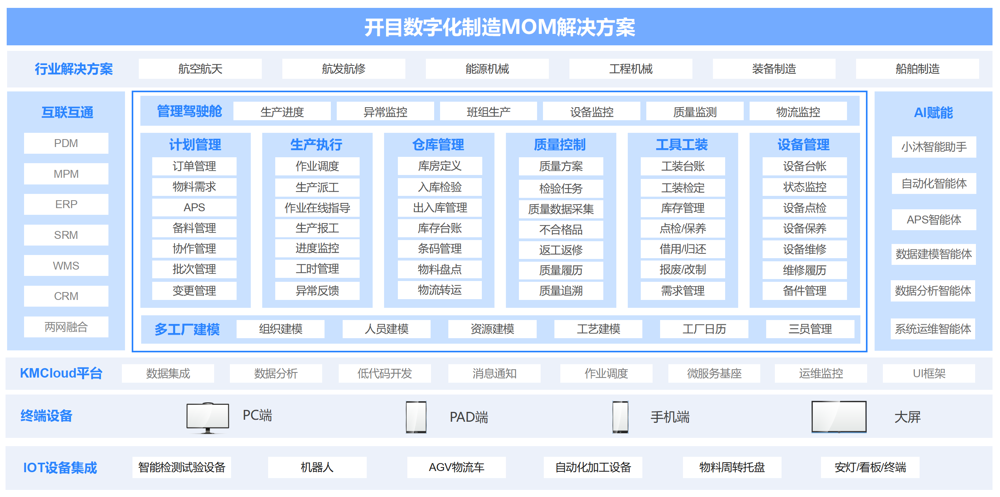
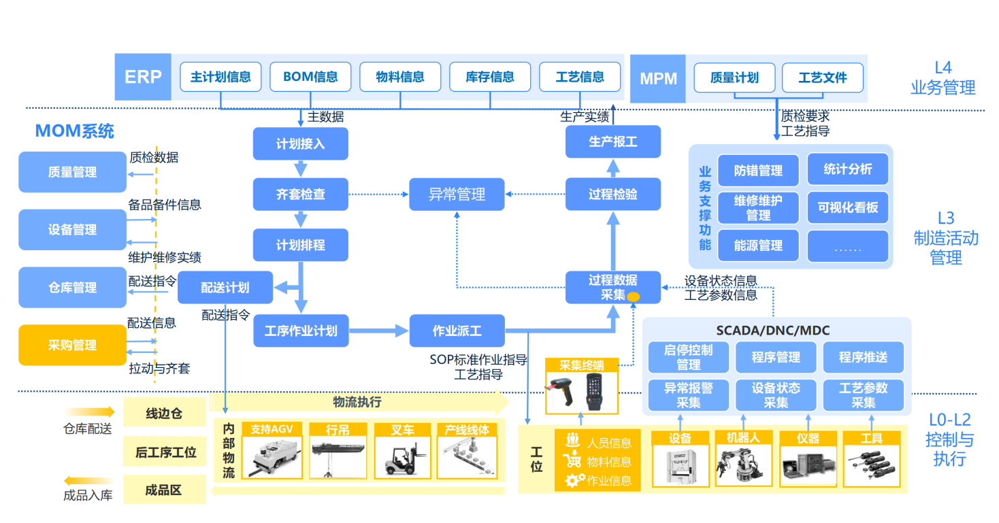
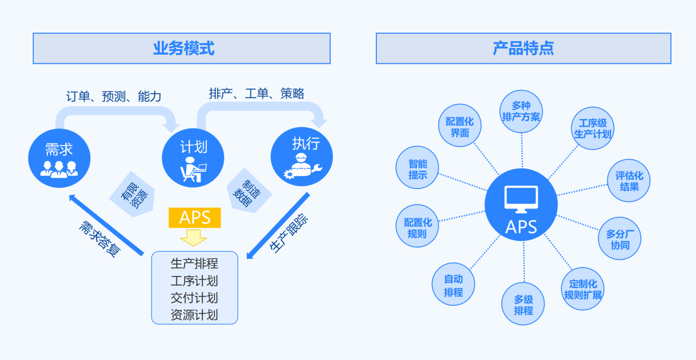
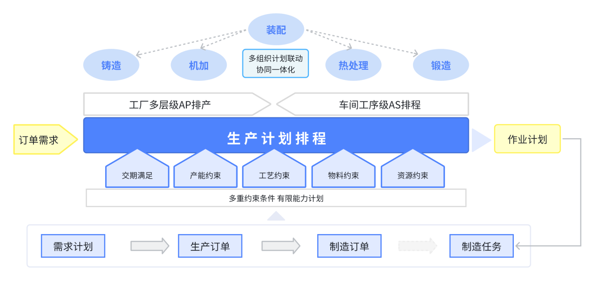
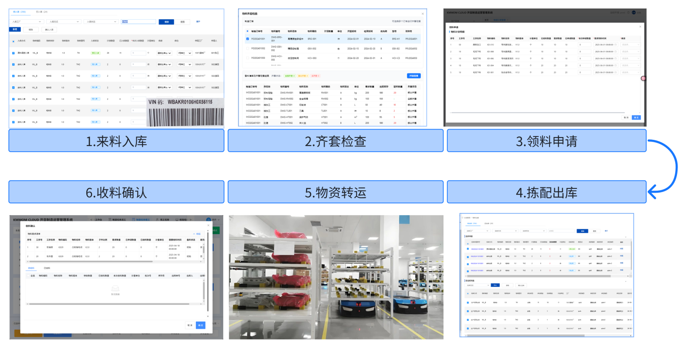
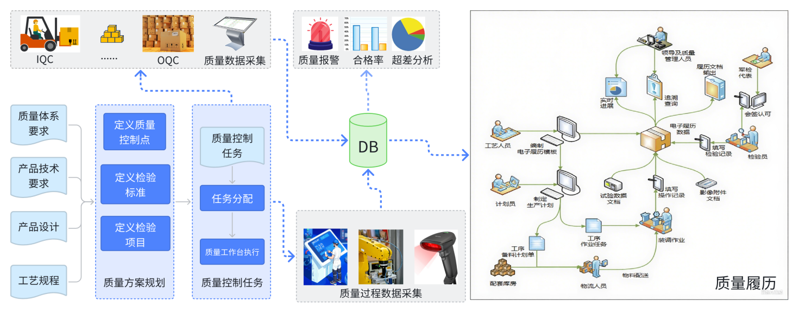
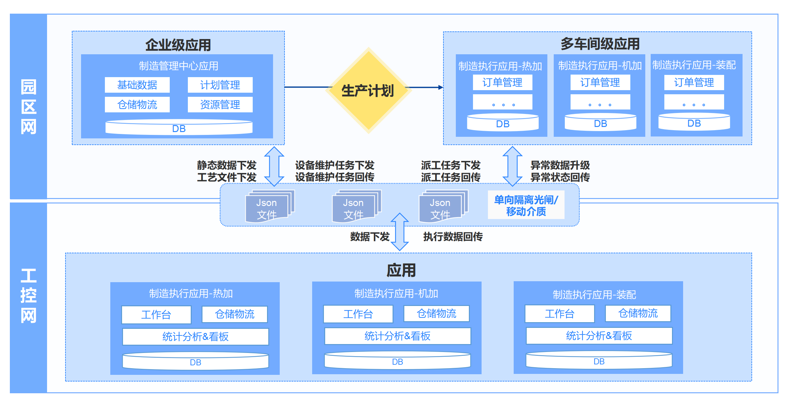
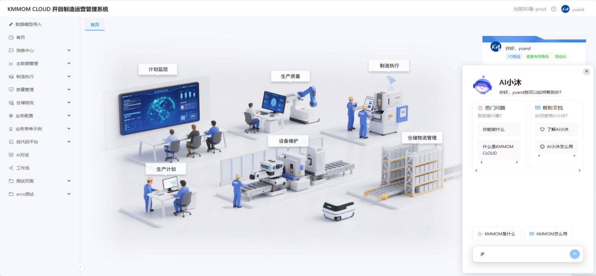
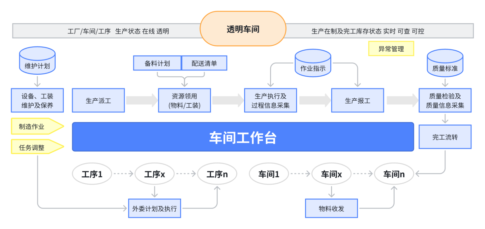

# 产品介绍

## 1  产品概述
当下，全球制造业正朝着数字化、智能化的方向加速前行。在这一进程中，智能工厂作为工业智能化发展的关键实践模式，发挥着举足轻重的作用。而制造运营管理（MOM）系统，作为连接企业管理系统与底层车间的重要桥梁，在制造业从数字化迈向智能化的道路上扮演着不可或缺的角色。目前，政策、认知、技术等各方条件成熟为转型提供良好基础。

开目数字化制造运营管理系统（简称：KMMOM CLOUD），是武汉开目信息技术股份有限公司（简称开目公司）自主研发的新一代面向离散高端制造业信息化变革的MOM产品，基于开目自主研发的 KMCloud 统一技术底座，能够充分打通工艺与制造的数据流通，实现工艺制造一体化的闭环管理。开目MOM系统作为开目公司“工艺专家”在制造端的延续，也是开目公司以CAPP为核心，贯穿上游PLM与下游MOM的“一体两翼”产品战略的关键组成部分。

## 2  业务架构

开目MOM 系统是面向制造运营管理的集成化平台，它以生产管理为核心，将质量管理、设备管理、物料管理等功能模块进行有机整合，同时与 ERP、PLM 等系统实现无缝集成，形成企业完整的信息化管理体系。其业务架构如图所示，底层通过物联网技术采集生产现场的设备、物料、人员等数据，经过数据处理和分析后，为生产管理、质量管理等功能模块提供数据支持，同时与 ERP 系统进行财务、采购等数据交互，与 PLM 系统共享产品设计和工艺数据 。

## 3 核心功能

### 3.1 **以排产为核心的计划管理**

MOM中的生产管理是衔接企业上层生产计划与底层生产执行的关键枢纽。它涵盖了对生产订单的详细分解、排程优化以及资源分配，基于主生产计划和销售订单需求将生产任务细化到具体的工序、工位和生产时间段。通过与车间现场的数据交互，实时获取生产进度、设备状态等信息，根据实际执行与计划的偏差，进行分析和调整，确保计划的有效性和适应性。

**(1)** **多层级的生产计划管理**

**生产订单管理**

系统采用生产订单承载主生产计划、基于BOM展开的零部件生产计划，或接收来自ERP系统提供的生产计划，也可以手工编制（新增或导入）生产订单。根据生产管理要求，合理分配工艺路线、进行齐套分析、设置订单优先级或指定计划员，同时系统支持多种策略和方式将生产订单进一步拆分成可投产的制造订单。

**制造订单管理**

 系统采用制造订单承载由生产订单释放的可直接投产的零部件加工计划，支持以制造订单为粒度的批次/序列号管理、工序级计划展开、物料齐套性分析、工序级计划排程、工序流转卡/条码 生成与打印。

**制造任务管理**

系统采用制造任务承接由制造订单基于工艺展开生成的工序级作业计划，可全局性的管控工序级作业计划，支持所有工序级计划的操作，如任务派工、协调、开完工汇报等。

**生产进度监控**

通过实时采集和分析，系统可将多层级计划关联查询，并通过自定义的看板设计器，自由定制和查询展示需要的数据。

**(2)** **基于规则的计划排程**

系统提供基于规则的计划排程，负责对复杂的数据和业务逻辑进行快速、准确的计算和分析。它整合了多种算法和计算模型，能够高效处理大规模的数据量。主要解决零部件级计划的交期预测、工序级计划的生产安排以及围绕工序级计划的相关准备工作安排问题。

 **灵活可扩展的排产策略**

对于多品种小批量变化的特点，系统提供可自定义的排产方案模块，方便计划人员将排产经验沉淀在系统中，同时系统提供业界通用的排序计算规则供用户选择。

系统支持多车间协同排产、重排和增量排产、插单等多种业务场景。

 **多维度可视化的排产结果展示**

 在排产计算过程中，通过展示排产计算的过程，方便用户理解系统排产逻辑。

 在排产计算完毕后，将排产结果分类汇总供计划员查询并采取对应的措施，同时提供订单甘特图、资源甘特图等多种图示化的结果展示方式。

**(3)**  **集中式的委外管理**

系统通过委外计划模块集中管理零件级计划委外、工序级计划委外，支持计划发送、供应商指定等操作；支持进行收发货实物管理。

**(4)** **流程化的异常管理**

系统通过异常管理与审批流结合，支持企业根据不同的异常类型自定义对应的异常处理流程；支持过程中的消息通知、异常升级管理等业务场景；支持异常处理过程中与变更、排产等业务的反馈关联。

### **3.2** **“推拉结合”的精益备料及仓储管理**

系统提供可细化到工序级的备料模型，可基于多途径生成备料计划，覆盖从齐套分析、领料申请、拣配出库、运输配送到收料确认的备料全过程管理，实时追踪物料全生命周期动态，实现动态精准库存管控，确保物料配送的及时准确；

系统支持多途径的实物入库，支持调拨、移库、盘点等库房管理功能；支持扫码枪、二维码、RFID 标签等技术在日常库房操作中的应用。

### 3.3 **全面追溯的质量管理**  

 质量控制是确保产品达到规定质量标准的关键环节，KMMOM可在生产过程中收集组件、过程、记录等相关信息，从原材料采购、生产工艺执行、在制品检验、到成品检测的整个生产流程，构建完整的质量履历，实现质量追溯的一键穿透，同时利用先进质量检测技术和数据分析模型的集成应用可及时发现质量异常，定位质量根因，确保质量持续改进。

**(1)** **可扩展的质量方案**

针对离散制造业研制与批产并行，客户方的设计、企业的制造工艺与质量的相关要求变化频繁的特点，系统提供可扩展维护的工艺质量配置，满足首检、互检、专检、客户检等检验控制的配置；支持在各类检验类型中配置执行资源、待检项目清单、待完成质量报告。

**(2)** **严格的质量控制**

系统基于质量定义中的控制要求在对应的工序任务节点严格控制，支持各种检验任务的生成、流转；支持不合格品处理，支持让步接收、返工返修、报废等多种不合格处理结论。

**(3)** **完整的质量记录**

基于企业不同的采集条件与内容，系统支持过程参数、产品检验记录的手工填写或系统集成；支持纸质记录或合格证以及音视频证明附件的上传；支持基于批次或序列号实物的扫码记录采集。

**(4)** **全面的质量追溯**

系统以交付的产品为粒度建立完备的质量履历，包含产品的工序过程信息、采集的记录信息；支持根据组件的领用记录构建从产品至主辅材的实物BOM信息。

### 3.4  **资源全生命周期管理**

**(1)** **资源维护保养**

系统从点检、保养、维修等多维度支撑对设备、工装日常维保工作；支持点检、保养、维修的策略、项目定义；支持任务化管控资源维保作业；支持在作业过程中进行信息记录采集。

**(2)** **工装及备件的实物台账管理**

系统针对工装实物、设备备件提供库存台账管理，完成入库、借用/领用、归还、定检、维修、报废等全生命周期管控；支持与立库、条码、AGV等周边硬件及系统集成应用。

### 3.5  **跨网部署整体运行的两网设计**

针对需要跨网段建设系统并进行网络隔离的场景，KMMOM秉承内部网管理复杂业务流程、工控网管理实物的原则，通过对业务、服务进行优化设计拆分实现了双网部署以及跨网数据传输。

**(1)**  **两网数据传输**

系统根据两网数据交互的安全要求，提供数据定点打包、可视化审核、自动解析等功能，结合光闸、刻录机等硬件手段，实现系统跨网部署、整体运行的应用效果。

**(2)** **两网监控**

 针对两网传输链路可能会发生的数据异常问题，系统通过建立全链路的跟踪监控与重试机制，保持两网数据的准确性。

### 3.6 AI智能化应用

**(1)** **在线知识问答**

 将制造业相关的知识以及系统相关的知识为基础，快速构建与MOM系统相关的知识库，方便使用者快速上手。

**(2)** **数据展示分析**

通过开目AI小沐智能体，实现自然语言交互抓取系统数据进行展示分析，快速辅助管理者智能决策。

**(3)** **辅助功能开发**

 在开目MOM低代码平台中，可通过AI生成式技术赋予高效的数据模型搭建、业务流程编排、交互界面与数据驾驶舱的 “智能感知” 能力，使系统具备更高的柔性与敏捷性。同时，企业中MOM的系统维护、统计分析、二次开发等相关人员，可以基于开目MOM元数据定义中的“数据模型图谱”，快速理解MOM内部的业务对象关系，并开展相应的扩展开发及设计分析。

### 3.7 全局视角的首页管理

KMMOM CLOUD为用户在首页提供了一站式的操作界面，能够集中监控和管理生产过程中的各项关键指标和任务执行情况。通过整合控制台、数据监控等信息，为用户提供直观、高效的生产管理体验。

### 3.8 **便捷的工作台管理**

考虑车间作业环境、人员成分等多方面因素，KMMOM CLOUD系统提供操作简洁的车间工作台满足班组长、操作者、检验员等实际任务执行角色的操作需求。

**(1)** **简洁的汇报终端**

结合终端操作的特点，信息整合可减少页面切换，支持数量、百分比、批量、顺序号等多种汇报方式；支持配置化的合格、报废、让步、返工等多种汇报结论；支持任务二次派工、协调、分卡等多种功能，满足现场灵活调整.

**(2)** **一体化的文件浏览**

依托开目公司的深厚工艺基础，实现工艺与制造无缝衔接，满足多种格式的技术文件的本地化浏览。

**(3)**  **灵活的工时分配方案**

基于离散制造业多专业的特点，系统提供多种工时分配模式，满足计件、计时、多人合作等场景。

**(4)** **便携的手持终端应用**

对于网络环境宽松的客户，系统提供手持应用，可基于手机、手持终端等登录系统进行相关操作。

---
**上一篇**: [无] | **下一篇**: [功能地图](/view/01-快速入门/02-功能地图.md) | **返回首页**: [文档中心](../../README.md)
