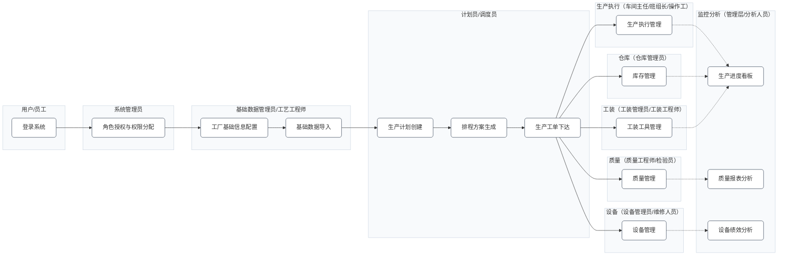

# 功能地图

## 核心流程概览

本功能地图遵循 **“基础配置 → 计划排产 → 生产执行 → 监控分析”** 的制造业务逻辑，帮助用户快速理解系统架构与操作流程。

> **核心说明**
>
> 1.  **逻辑清晰**：按业务流转顺序设计，新手按此路径可逐步上手。
> 2.  **重点突出**：图中高亮显示的节点为核心必做步骤，预计 **15分钟** 即可完成基础环境搭建。
> 3.  **交互友好**：点击各节点可直接跳转至对应功能的详细操作教程（需在帮助中心浏览时生效）。

---

## 常用角色（参考）

下表为 MOM 系统常见岗位角色示例。实际以企业组织、权限模型与岗位职责划分为准。

| 角色                  | 典型职责（示例）                            |
| --------------------- | ------------------------------------------- |
| 系统管理员            | 系统初始化、用户与权限、基础配置维护        |
| 基础数据管理员        | 工厂/组织基础信息维护、主数据规范维护       |
| 计划员/调度员         | 生产计划编制、排程、工单下达与调整          |
| 车间主任/生产主管     | 生产组织与协调、进度与异常处理、资源统筹    |
| 班组长/操作工         | 工序执行、报工、物料消耗与过程记录          |
| 质量工程师/检验员     | IQC/IPQC/OQC 质量检验与数据记录、质量追溯   |
| 设备管理员/维修人员   | 设备点检保养、故障处理、设备状态维护        |
| 工装管理员/工装工程师 | 工装/工具台账、领用归还、维护保养与寿命管理 |
| 仓库管理员            | 物料入出库、盘点、条码/批次管理             |
| 管理层/分析人员       | 经营与生产分析、指标看板、报表查看与决策    |

## 系统功能流程图（按角色泳道）

## 新手3步核心上手路径（必做）

1.  **基础环境搭建**
    - 完成「工厂基础信息配置」+「基础数据导入」。
    - _目标：搭建系统运行所需的基础数据环境。_

2.  **核心业务实操**
    - 创建 1 份简单生产计划并下达工单，完成 1 次「生产执行进度记录」。
    - _目标：熟悉从计划到执行的完整生产流程。_

3.  **数据价值体验**
    - 查看「生产进度看板」。
    - _目标：直观掌握工单推进情况，感知系统数据监控价值。_

## 适配与标准说明

- **功能覆盖**：节点内容覆盖 MOM 系统核心功能域（生产、质量、设备、库存），完全符合 **IEC/ISO 62264** 标准对制造运行管理的功能定义。
- **业务贴合**：流程逻辑贴合制造企业实际业务流程，避免抽象概念，确保每个节点均对应具体可操作的业务动作。
- **灵活配置**：系统支持按需配置，可根据企业实际业务范围增删节点（例如：如无需单独管理库存，可忽略 D4 节点）。

---

**上一篇**: [产品简介](/view/01-快速入门/01-产品介绍.md) | **下一篇**: [基础操作](/view/01-快速入门/03-基础操作.md) | **返回首页**: [帮助中心](../../README.md)
