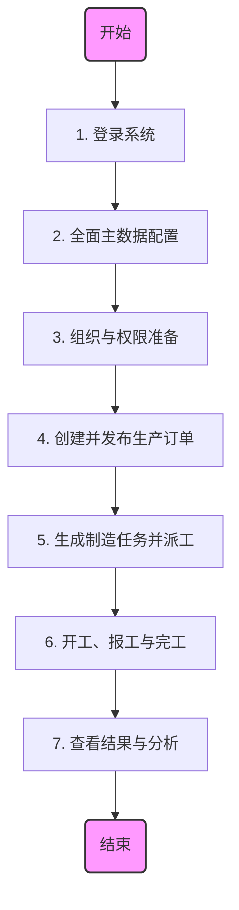
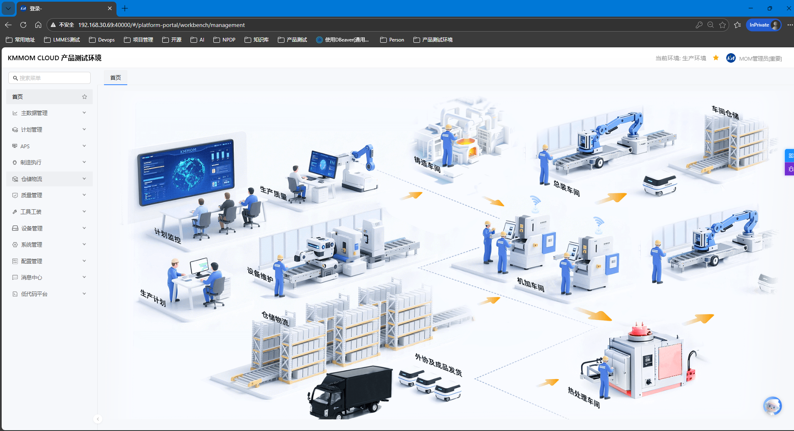

# 基础操作：从登录到完工的全流程体验

## 1. 概述

本指南面向首次使用 **KMMOM 标准产品** 的 **业务人员** 和 **实施顾问**。通过本指南，你将在 **30–60 分钟** 内，完成从系统登录、基础数据配置，到下达生产订单、执行制造任务并最终完工的标准业务闭环。

### 1.1 核心流程概览

## 2. 准备工作

在开始之前，请确保满足以下条件：

- [ ] **环境就绪**：系统已完成安装部署。
- [ ] **账号获取**：拥有系统管理员账号或已被分配初始账号。
- [ ] **网络通畅**：能够访问系统部署的 URL 地址。

---

## 3. 步骤详解

### 3.1 步骤一：登录系统

> **目标**：成功进入系统首页，熟悉界面布局。

1.  **访问地址**：在浏览器中输入系统地址。
2.  **输入凭证**：输入账号和密码，点击 **“登录”**。
3.  **修改密码**（如需）：首次登录若提示修改密码，请按指引完成。
4.  **验证**：成功登录后，进入 **个人工作台** 或 **系统首页**。

**常见问题提示**：

- 若提示“账号被禁用”，请联系管理员检查账号状态。
- 推荐使用 Chrome 或 Edge 浏览器以获得最佳体验。

---

### 3.2 步骤二：全面主数据配置

> **目标**：按照依赖关系顺序建立完整的工厂生产模型。
>
> **重要提示**：主数据之间存在严格的引用关系，请务必严格按照以下 **1-5** 的顺序进行配置。
>
> **参考文档**：[工厂数据](/view/04-核心模块/01-主数据/01-工厂数据.md)

#### 1. 组织与人员（基础）

- **路径**：**主数据管理** > **工厂数据** > **用户管理**
- **操作**：
  1.  建立 **公司** > **工厂** > **车间** > **班组** 的层级结构。
  2.  在 **用户管理** 菜单中，创建用户账号并关联到对应的工厂/车间（后续工作中心将引用这些人员）。

#### 2. 时间管理（日历）

- **路径**：**主数据管理** > **工厂数据** > **出勤模式** / **工作日历**
- **操作**：
  1.  **出勤模式**：定义工厂的班次规则（例如：**长白班**、**两班倒**）。
  2.  **工作日历**：基于出勤模式生成指定年份的工厂日历（这是计算产能和排程的基础）。

#### 3. 基础资源（物料/设备/工装/供应商）

- **路径**：**主数据管理** > **物料数据** / **资源数据**
- **操作**：
  1.  **物料**：定义 **成品**、**半成品** 和 **原材料**。
  2.  **设备**：录入生产机器资产信息。
  3.  **工装**：录入模具、夹具等辅助工具。
  4.  **供应商**：录入原材料供应商信息。

#### 4. 生产能力建模（工作中心）

- **路径**：**主数据管理** > **工厂数据** > **工作中心**
- **操作**：
  1.  创建 **工作中心**（产线/机台）。
  2.  在工作中心详情中，关联步骤 1 创建的 **人员** 和步骤 3 创建的 **设备**。这是生产任务分配和能力平衡的最小单元。

#### 5. 产品工艺定义（工艺/BOM）

- **路径**：**主数据管理** > **工艺数据**
- **操作**：
  1.  **工艺路线**：定义产品的加工工序，每道工序需指定对应的 **工作中心**。
  2.  **BOM (物料清单)**：定义产品的组成结构，关联 **父件** 和 **子件** 物料。

> **💡 高效提示：批量导入**
> 系统为每个主数据对象（如物料、BOM、人员等）均提供了 **导入** 功能，支持通过 Excel 模板批量录入数据。
>
> - **操作方法**：在列表页点击 **“导入”** > **“下载模板”**，按模板格式填充数据后上传。
> - **注意事项**：导入时需特别注意 **引用属性**（例如：导入工作中心时，需填写的“负责人编码”必须是系统里已存在的用户编码）。建议严格按照上述 1-5 的顺序分批次导入，以避免因关联数据缺失导致导入失败。

---

### 3.3 步骤三：准备组织与权限

> **目标**：确保不同角色（计划员、操作工）能看到对应的功能菜单。
>
> **参考文档**：[组织权限](/view/03-产品平台/01-组织权限.md)

- **路径**：**系统管理** > **组织权限** / **安全配置**
- **关键动作**：
  1.  **角色分配**：确保你的账号拥有 **计划员** 和 **生产操作工** 的角色权限（演示时可使用超级管理员权限覆盖）。
  2.  **权限验证**：
      - 确认能看到 **计划管理** 菜单。
      - 确认能看到 **制造执行** 菜单。

---

### 3.4 步骤四：创建并发布生产订单

> **角色**：计划员
>
> **目标**：下达生产指令。
>
> **参考文档**：[生产制造计划管理](/view/04-核心模块/02-生产计划/01-生产制造计划管理.md)

1.  **进入菜单**：**计划管理** > **生产订单管理**。
2.  **新增订单**：
    - **物料**：选择刚才创建的成品（如 **M-PROD-001**）。
    - **数量**：输入计划生产数量（如 **10**）。
    - **工厂/车间**：选择对应的生产组织。
    - **时间**：设置计划开始和结束时间。
3.  **发布订单**：
    - 保存后，选中订单，点击 **“发布”**。
    - 状态变为 **“已发布”**。
4.  **释放订单**（可选）：点击 **“释放”**，系统将自动生成下游的 **制造订单**。

---

### 3.5 步骤五：生成制造任务并派工

> **角色**：生产调度员
>
> **目标**：将制造订单拆解为工序级任务，并指派给具体人员或设备。
>
> **参考文档**：[生产制造计划管理](/view/04-核心模块/02-生产计划/01-生产制造计划管理.md)

1.  **检查制造订单**：
    - 进入 **计划管理** > **制造订单管理**，确认已生成制造订单。
    - 执行 **“工艺展开”**（如未自动触发），生成工序任务。
2.  **任务派工**：
    - 进入 **制造执行** > **制造任务管理**。
    - 选中待派工的任务，点击 **“派工”**。
    - 指定 **执行人**（可以是自己）和 **设备**（如有）。
    - 确认后，任务状态更新为 **“已派工”**。

---

### 3.6 步骤六：开工、报工与完工

> **角色**：一线操作工
>
> **目标**：模拟现场生产执行，反馈生产进度。
>
> **参考文档**：[制造任务执行](/view/04-核心模块/03-任务执行/01-制造任务执行.md)

#### 1. 开工 (Start)

- **位置**：**制造执行** > **制造任务管理**
- **操作**：找到“已派工”的任务，点击 **“开工”**。
- **结果**：任务状态变为 **“已开工”**，系统开始记录工时。

#### 2. 报工 (Report)

- **位置**：同上
- **操作**：
  - 点击 **“报工”**。
  - 输入 **合格数量**（如 **10**）。
  - 勾选 **“是否完工”**（表示该工序任务全部完成）。
  - 提交。

#### 3. 完工 (Complete)

- **结果**：
  - 任务状态更新为 **“已完工”**。
  - 若这是最后一道工序，关联的 **制造订单** 和 **生产订单** 也会根据配置自动更新为完工状态。

---

### 3.7 步骤七：查看结果与分析

> **目标**：验证数据流转是否闭环。

完成上述操作后，请检查以下数据以验证成果：

1.  **订单状态**：回到 **生产订单管理**，确认订单状态是否已变为 **“完工”**。
2.  **进度看板**：若系统配置了 **生产进度看板**，应能看到该订单的进度条已达 100%。
3.  **报表分析**：在 **报表管理** 中查看产量统计，确认刚才报工的 **10** 件产品已被统计。

---

## 4. 常见问题排查

**Q: 找不到“派工”按钮？**
A: 请检查当前登录用户是否具备调度员权限，且任务状态是否为“已创建”或“部分派工”。

**Q: 报工时提示“数量超出”？**
A: 检查报工数量是否超过了任务派工数量或允许的超产比例。

**Q: 流程无法继续？**
A: 请优先检查 **主数据**（工艺路线是否有效）和 **权限**（当前用户是否有操作该菜单的权限）。

---

完成本流程后，建议进一步探索 **质量检验**、**设备管理** 或 **仓储物料** 等高级功能。

---

**上一篇**: [产品简介](/view/01-快速入门/01-产品介绍.md) | **下一篇**: [基础操作](/view/01-快速入门/03-基础操作.md) | **返回首页**: [帮助中心](../../README.md)