# 组织权限

## 简介
本文档聚焦组织权限的两项核心能力：角色管理与角色授权。角色管理用于配置与维护“菜单/功能权限”、“数据权限（范围/对象）”以及“数据模型权限（实体/属性）”，以实现按角色统一授权；角色授权用于建立“角色—用户”的关联关系，使已配置的菜单、功能与数据模型权限在用户登录与操作校验中生效。系统遵循最小权限原则并支持审计追溯，文档帮助您规范完成角色创建、授权与分配。

## 核心功能

- **角色分组管理**：支持按组织或业务域构建分组树，快速定位目标角色。
- **角色管理**：支持角色新增、查询、编辑、启用/停用、删除、另存。
- **权限配置**：支持菜单授权、功能授权、数据授权、模型授权四类权限配置。
- **角色授权**：支持建立“角色-用户”关联关系，使角色权限在用户侧生效。

## 操作指南

### 1. 进入页面

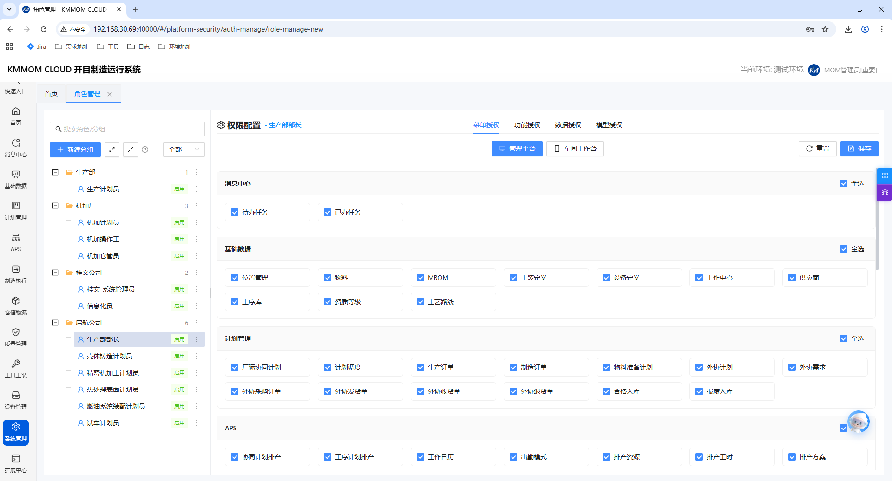

1. 在左侧导航栏点击 **系统管理** → **角色权限**。
2. 进入后默认展示角色树和权限配置区。

### 2. 角色分组管理
#### 2.1 新建分组

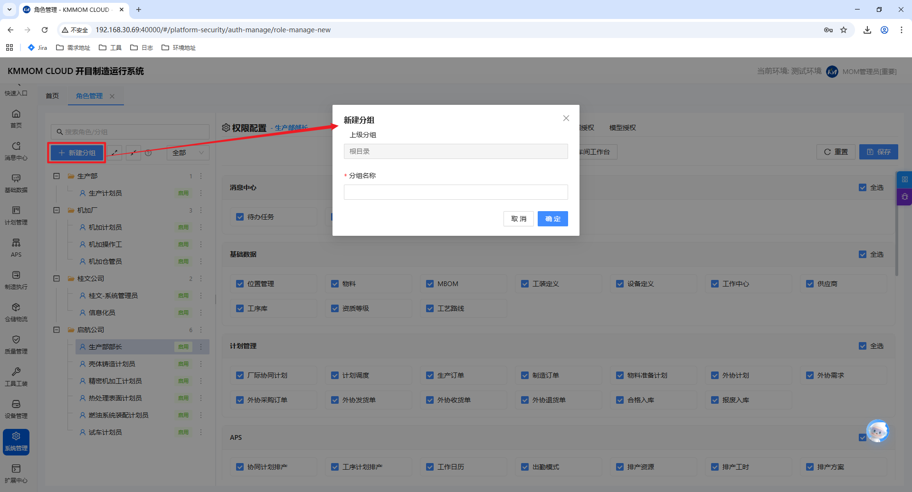

1. 在角色树区域点击 **新建分组**。
2. 在弹窗中确认上级分组（根分组下创建时通常显示“根目录”）。
3. 输入分组名称并点击 **确定**。

#### 2.2 新建子分组

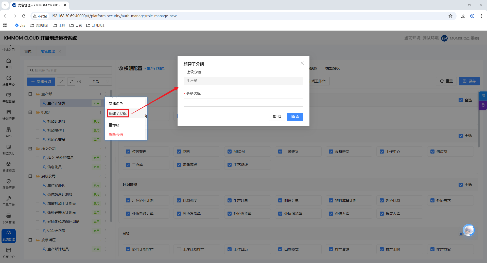

1. 在目标分组右侧点击更多操作（`...`）。
2. 点击 **新建子分组**。
3. 输入分组名称并点击 **确定**。

#### 2.3 重命名分组

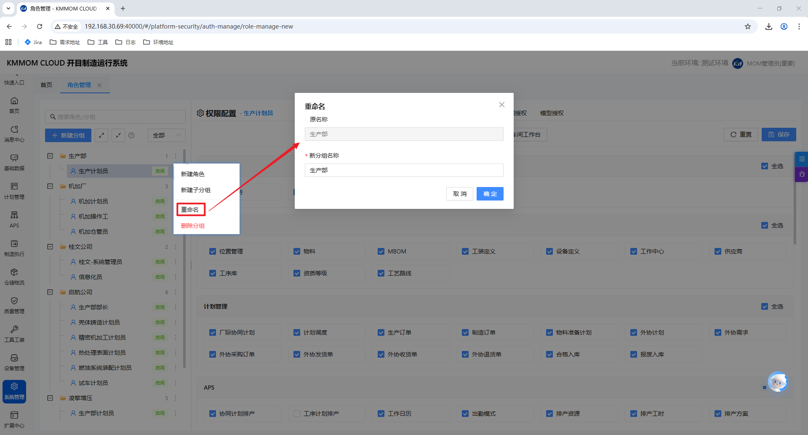

1. 在目标分组右侧点击更多操作（`...`）。
2. 点击 **重命名**，输入新名称后确认。

#### 2.4 删除分组

1. 在目标分组右侧点击更多操作（`...`）。
2. 点击 **删除分组** 并在确认框中确认。

> **说明**：若分组下存在角色，系统会按规则处理（移动到默认分组/未分组或阻止删除），请先核对分组内角色归属。

### 3. 角色管理
#### 3.1 新建角色

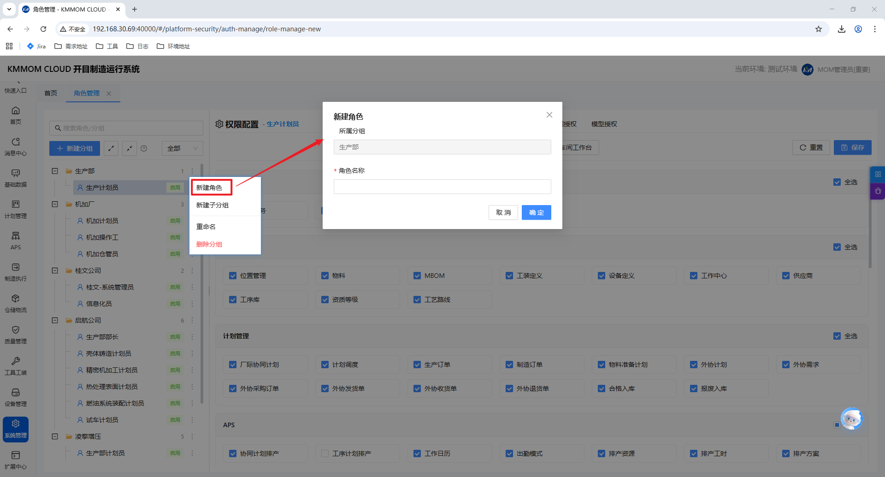

1. 选择目标分组。
2. 在分组或角色节点右侧点击更多操作（`...`），选择 **新建角色**。
3. 在弹窗中确认所属分组，输入角色名称（如系统启用角色编码，则同步输入编码）。
4. 点击 **确定** 完成创建。

#### 3.2 查询角色

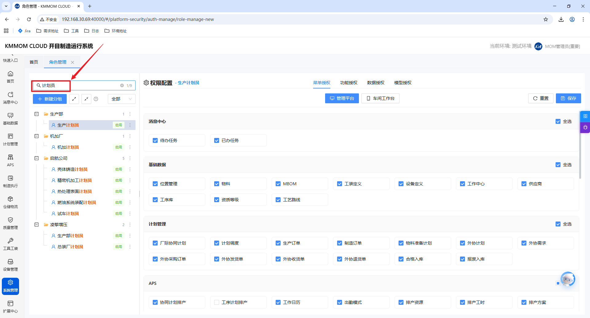

1. 在角色树上方输入关键字（角色名/分组名）。
2. 按状态筛选（如“全部/启用/停用”）定位角色。

#### 3.3 编辑角色

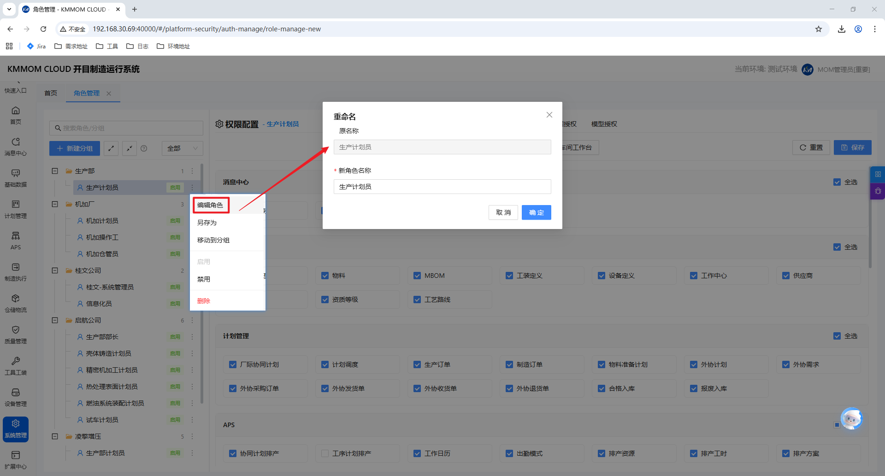

1. 选择目标角色。
2. 点击角色操作区中的 **编辑**（入口位置以页面实际按钮为准）。
3. 修改后保存。

#### 3.4 启用/停用角色

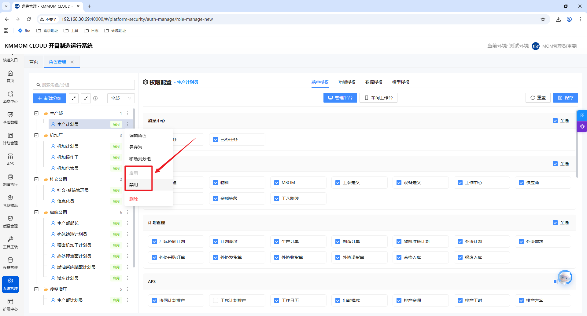

1. 在角色列表/角色树中定位目标角色。
2. 执行 **启用** 或 **停用** 操作。

#### 3.5 删除角色

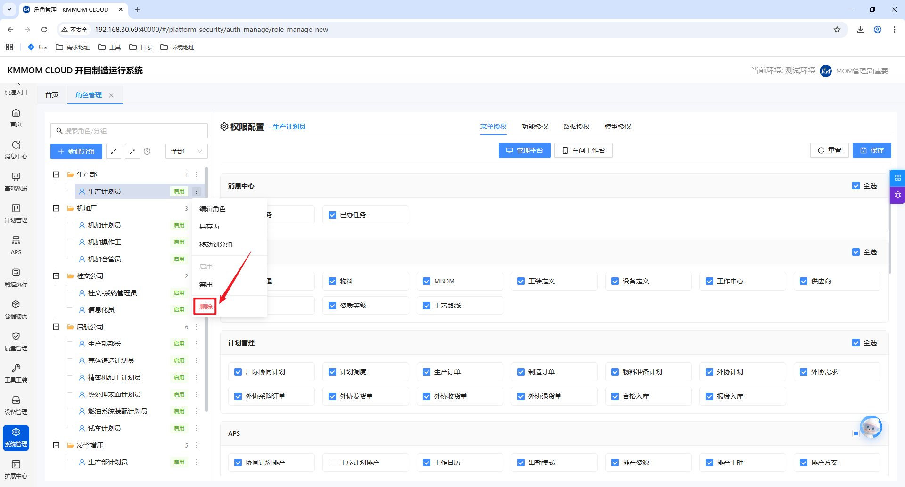

1. 在目标角色上执行删除操作并确认。
2. 若角色已关联用户或被策略引用，系统会阻止删除并提示处理依赖关系。

#### 3.6 角色另存（快速复用）

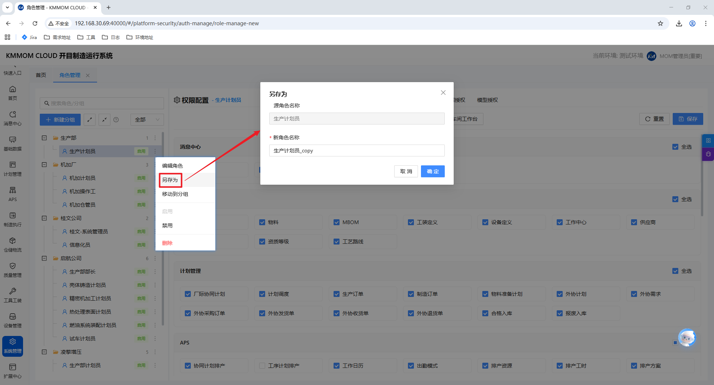

1. 选中源角色。
2. 点击 **另存**（工具栏或角色操作菜单）。
3. 输入新角色名称/编码并确认。
4. 系统创建新角色，并继承源角色的授权配置。

> **说明**：另存是“复制已验证权限模板”的推荐方式，适用于同岗位、不同组织的角色快速搭建。

### 4. 权限配置
#### 4.1 进入权限配置

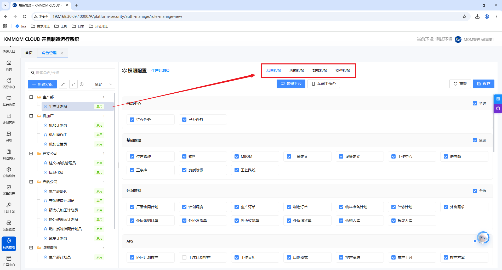

1. 在左侧角色树选中目标角色。
2. 右侧进入 **权限配置**，包含以下页签：**菜单授权**、**功能授权**、**数据授权**、**模型授权**。
3. 配置完成后点击 **保存**。

#### 4.2 菜单授权（按平台区分）

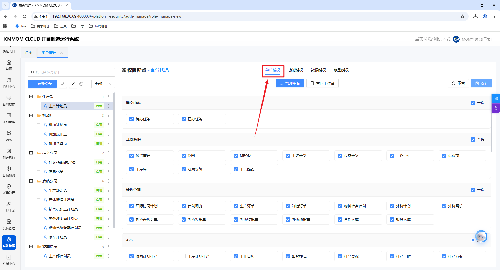

1. 切换至 **菜单授权** 页签。
2. 在页面顶部切换平台标签：**管理平台** / **车间工作台**。
3. 勾选当前平台需授权菜单项；可使用 **全选** 提升配置效率。
4. 切换到另一平台继续配置并保存。

> **规则**：两个平台的菜单授权独立保存，互不覆盖。

#### 4.3 功能授权

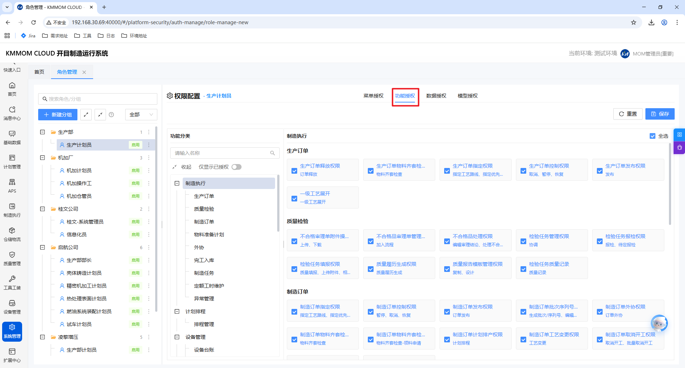

1. 切换至 **功能授权** 页签。
2. 在左侧“功能分类”树中搜索并选择目标模块。
3. 在右侧勾选对应功能权限项（支持模块级全选）。
4. 可开启 **仅显示已授权** 快速复核已勾选项。

#### 4.4 数据授权

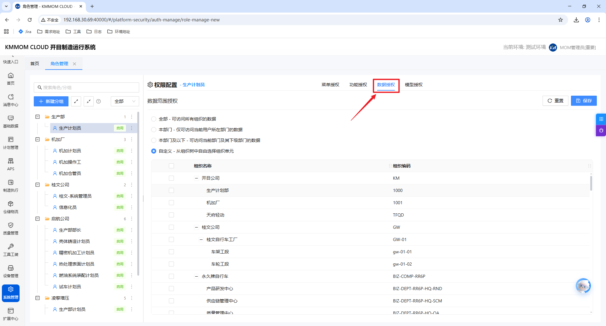

1. 切换至 **数据授权** 页签。
2. 选择数据范围：
   - **全部**：可访问所有组织数据。
   - **本部门**：仅可访问当前用户所在部门数据。
   - **本部门及以下**：可访问当前部门及下级部门数据。
   - **自定义**：从组织树中选择可访问组织单元。
3. 选择完成后点击 **保存**。

> **校验**：选择“自定义”时，必须至少选择一个组织单元，否则无法保存。

#### 4.5 模型授权

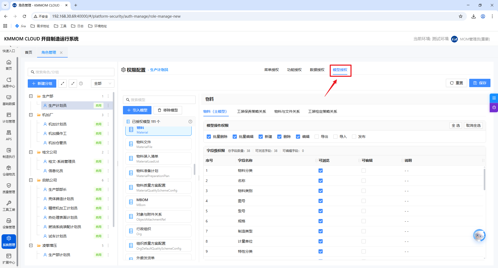

1. 切换至 **模型授权** 页签。
2. 点击 **引入模型**，在弹窗中勾选目标模型并确认。
3. 在“已授权模型”中选择模型，配置：
   - **模型操作权限**：如新增/删除/编辑及模型扩展操作权限。
   - **字段级权限**：按字段勾选“可浏览/可编辑”。
4. 不再需要的模型可点击 **移除模型**。

> **建议**：优先按“新增、编辑、删除”三类核心操作完成授权，再按业务需要补充导入/导出等扩展操作。

#### 4.6 重置与保存
1. 点击 **重置** 可清空当前配置页签未保存变更（以页面实际行为为准）。
2. 点击 **保存** 提交当前角色的权限配置。

### 5. 角色授权（用户关联）

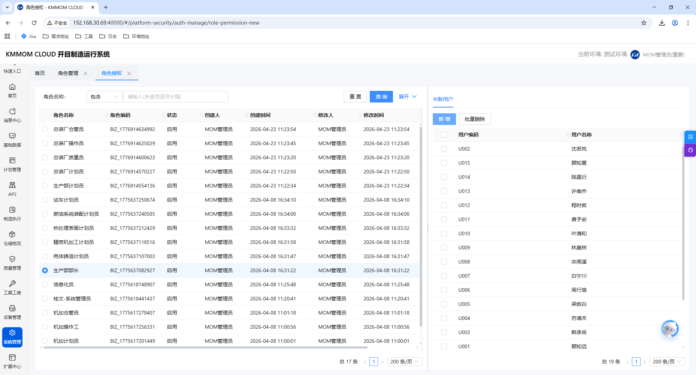

#### 5.1 进入页面
1. 在左侧导航栏点击 **系统管理** → **角色权限** → **角色授权**。

#### 5.2 查询角色
1. 在查询区输入条件并点击 **查询**。
2. 点击 **重置** 可清空条件。

#### 5.3 关联用户
1. 在角色列表中选中目标角色。
2. 在用户区域点击 **新增**，选择用户后确认。
3. 系统建立该角色与用户的关联关系。

#### 5.4 解除关联
1. 在“已关联用户”区域勾选目标用户。
2. 点击 **移除用户** 并确认，系统解除关联。

## 关键规则与注意事项
- 平台权限（管理平台/车间工作台）独立配置、独立保存。
- 角色停用后，权限生效时机以系统会话策略为准，必要时需用户重新登录。
- 删除角色或分组前，请先检查用户关联、策略引用和角色归属，避免权限中断。
- 建议遵循最小权限原则，先授予必要权限，再逐步放开。
