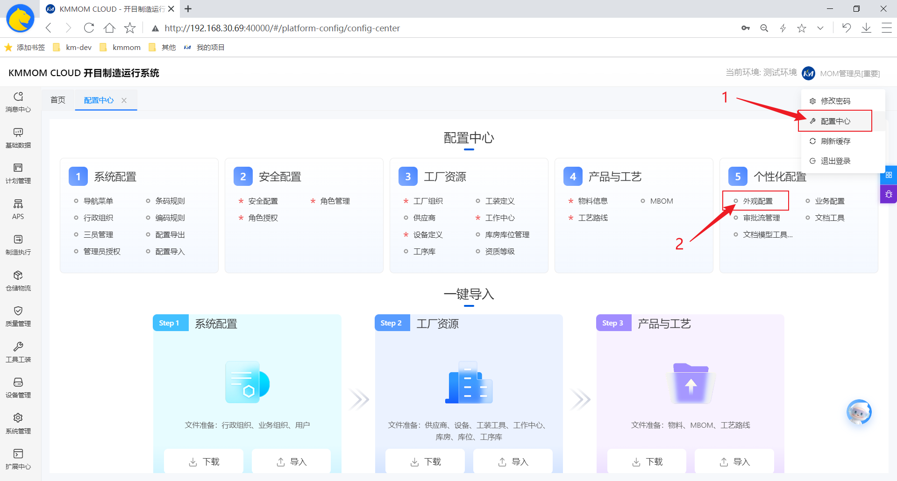
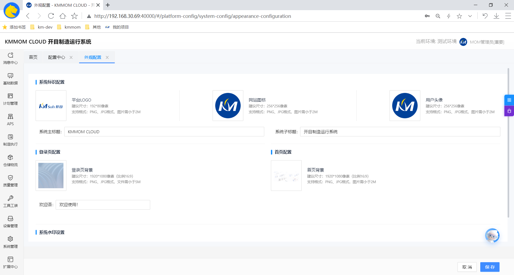
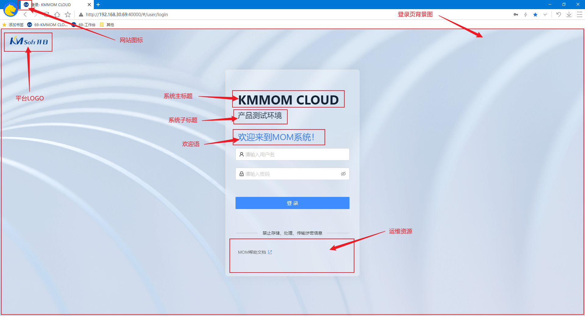
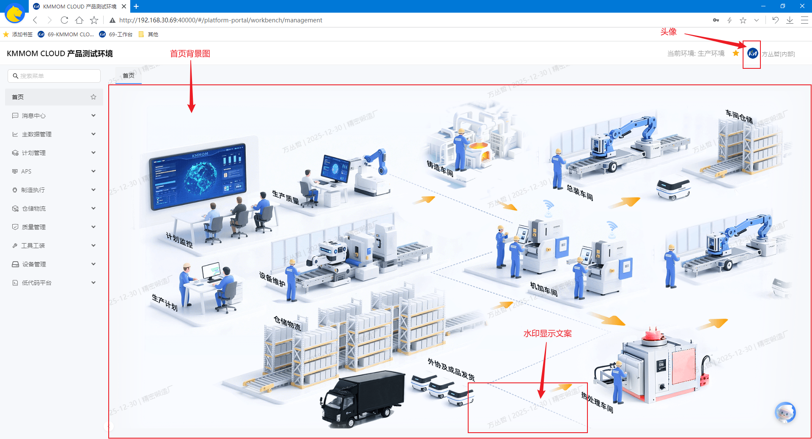

# 外观配置

## 功能概述
外观配置用于统一维护系统的视觉与标识元素。支持对平台 LOGO、网站图标、默认用户头像、系统名称与欢迎语等进行集中维护，登录页和首页背景图与欢迎语可按需调整。允许上传运维文档或设置常用访问地址，便于用户在系统内快速获取帮助与规范文件。支持系统水印，提升数据使用的合规性与审计可追溯。

## 核心功能
- **系统标识配置**：维护平台 LOGO、网站图标、默认用户头像；配置系统名称与欢迎语；支持图片规格校验。
- **登录页配置**：上传登录页背景图与首页图；设置登录页欢迎语。
- **首页配置**：上传首页背景图。
- **运维资源管理**：上传运维文档或设置常用访问地址，便于用户在系统内快速获取帮助与规范文件。
- **系统水印设置**：开启/关闭水印，选择水印类型：**内容水印** 或 **图片水印**，可选是否显示文案：**当前用户名**、**当前时间**、**当前组织**。

> **注意**：仅首页配置适用于管理端，其他配置适用于管理端和工作台。

## 操作指南

### 1. 进入页面
1. 在右上角管理员下拉菜单选项中，点击 **配置中心**，在 **5 个性化配置** 下点击**外观配置**，即可进入外观配置页面。

### 2.外观配置
1. **系统标识配置**：
    - 在 **平台LOGO**、**网站图标**、**默认用户头像** 处上传对应的背景图片；
    - 在“系统主标题”输入框中填写系统对外显示的名称（例如：KMMOM CLOUD）。
    - 在“系统子标题”输入框中填写系统对外显示的副标题（例如：测试环境）。
3. **登录页配置**：
    - 点击 **上传文件** 选择登录页背景图；
    - 在“欢迎语（登录页）”输入框中填写登录与首页展示的欢迎文案。
4. **首页配置**：点击 **上传文件** 选择首页背景图；
5. **系统水印配置**：
    - 开启“**启用开关**”，选择水印类型：**内容水印** 或 **图片水印**。
    - 若选择**内容水印**，在“水印内容”输入框中填写水印文案（例如：KMMOM CLOUD）。
    - 若选择**图片水印**，点击 **上传文件** 上传水印图片。
    - 可选水印显示文案：勾选“当前用户名”、“当前时间”、“当前组织”。
6. **外观配置效果示意图**：
    - 登录页面：
    
    - 首页页面：
    

## 注意事项
- 生效机制：配置需点击 **保存** 才会写入并生效；部分浏览器存在缓存，必要时请刷新页面或清除缓存。
- 规范限制：图片类型与大小需满足页面提示；上传失败请检查文件格式、尺寸与网络状态。
- 安全建议：启用水印时仅展示必要信息，避免泄露敏感数据；外部访问地址应通过内网/安全网关管控。
- 回滚策略：如配置影响显示效果，可重新上传或复原至默认资源后 **保存**；系统会记录操作审计以便追溯。