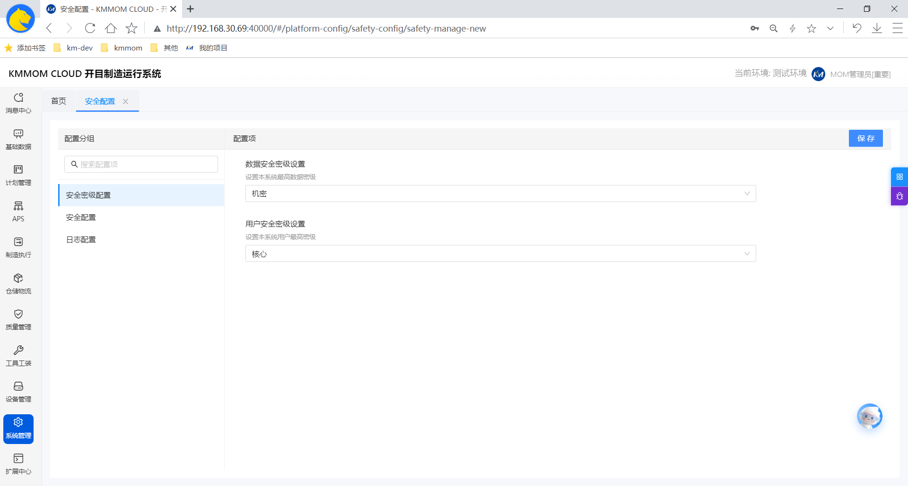
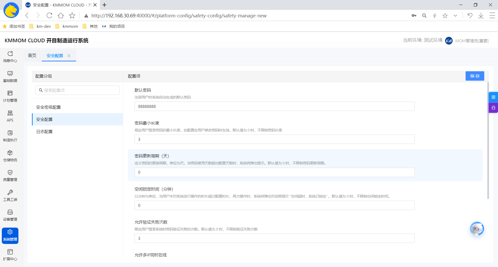
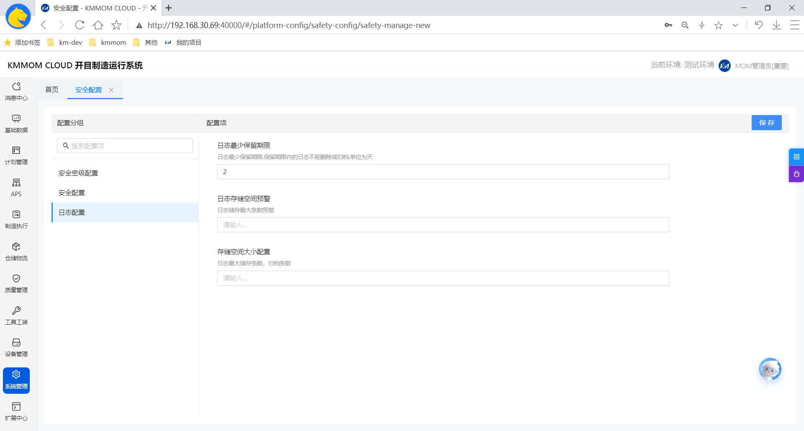

# 安全配置

## 1. 功能概述
安全配置模块旨在保障系统的安全性，通过灵活的策略设置，管控用户的账户安全与访问权限。MOM产品的安全配置主要分为**安全密级配置**、**安全配置** 和**日志配置** 三个部分：
*   **安全密级配置**：基于数据的密级（公开、内部、秘密、机密）和用户的密级（内部、一般、重要）分别设置差异化的安全策略。
*   **安全配置**：制定适用于全系统的通用安全标准。
*   **日志配置**：制定适用于全系统的通用日志存储策略。

## 2. 配置说明

### 2.1 安全密级配置
安全密级配置允许管理员分别设置系统数据和用户的最高密级。

### 2.2 安全配置
安全配置用于定义系统层面的基础安全策略，适用于所有用户或作为默认标准。

*   **默认密码**
    *   **说明**：设置新建用户或重置密码时的系统默认初始密码。
    *   **示例**：可设置为较为复杂的初始字符串，如 "MOM@2024"。
*   **密码最小长度**
    *   **说明**：全局限制的密码最小长度，作为系统的基准要求。
*   **密码更新周期**
    *   **说明**：全局默认的密码有效期（天）。
*   **空闲锁定时间**
    *   **说明**：全局默认的无操作锁定时间（分钟）。
*   **允许验证失败次数**
    *   **说明**：全局允许的登录失败尝试次数。
*   **允许多IP同时在线**
    *   **说明**：控制同一账号是否可以在不同设备或IP地址同时登录。
    *   **示例**：开启则允许同时在线；关闭则后登录的设备会将前一个设备挤下线。
*   **密码复杂度**
    *   **说明**：设置密码必须包含的字符类型组合（如字母、数字、特殊字符等）。
    *   **示例**：要求密码必须包含“大写字母+小写字母+数字”。
*   **允许新旧密码一致**
    *   **说明**：全局控制修改密码时是否允许与旧密码一致。

### 2.3 日志配置
日志配置用于定义系统层面的日志存储策略，适用于所有用户或作为默认标准。

*   **日志最少保留期限**
    *   **说明**：保留期限内的日志不能删除或归档,单位为天。
*   **日志存储空间预警**
    *   **说明**：全局日志存储空间不足预警量。
*   **存储空间大小配置**
    *   **说明**：全局默认的日志最大存储量。

## 3. 操作步骤

系统提供简便的界面进行安全策略的调整，具体操作如下：

1.  **进入界面**：在系统导航菜单中，点击 **系统管理 > 安全配置 > 安全配置**。
2.  **选择类型**：
    *   若需设置系统最高密级，点击 **安全密级配置**。
    *   若需设置用户安全策略，点击 **安全配置**。
    *   若需设置系统日志存储策略，点击 **日志配置和**。
3.  **修改配置**：根据实际安全需求，在右侧面板中输入或选择相应的参数值。
4.  **保存生效**：确认无误后，点击页面右上角的 **保存** 按钮。

## 4. 注意事项
*   **安全性平衡**：建议根据实际业务需求平衡安全性与易用性。过于严格的策略（如频繁更新密码、极短的锁定时间）可能会影响用户体验，而过于宽松的策略则可能增加安全风险。
*   **生效时间**：修改安全配置后，通常对新登录或下一次操作生效，已在线用户可能需要重新登录才能应用最新策略。
*   **初始密码安全**：建议设置较复杂的默认密码，并开启“用户首次登录强制修改密码”策略（如有），以确保账号初始安全。
