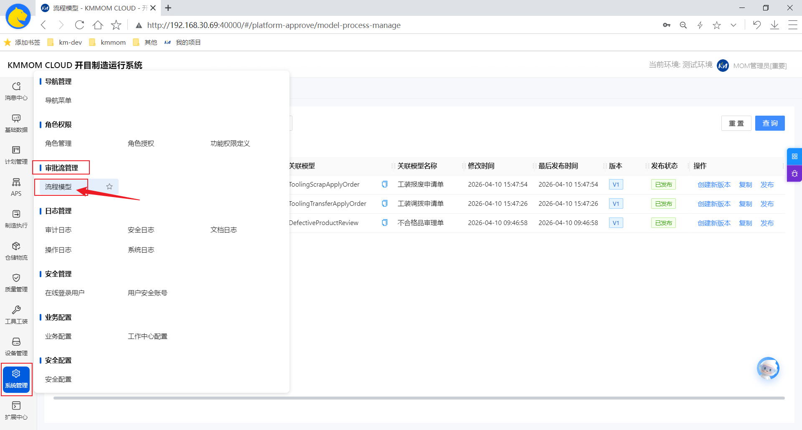
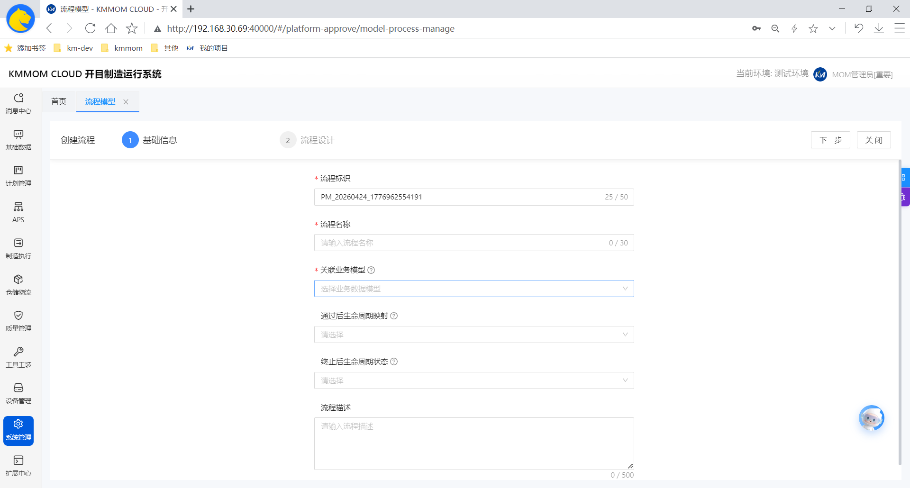
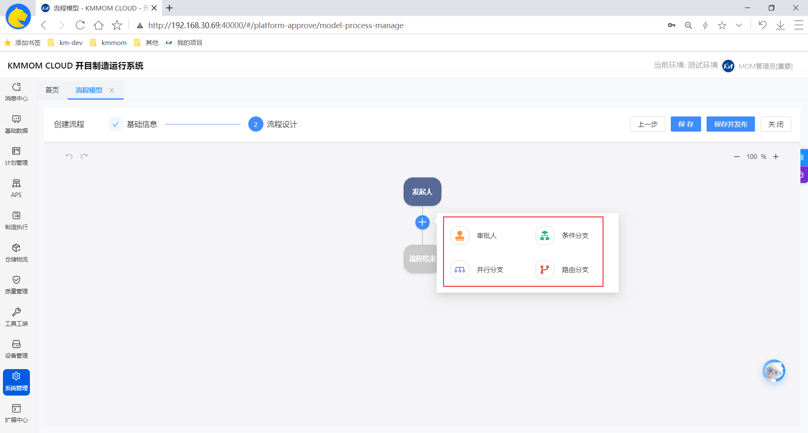
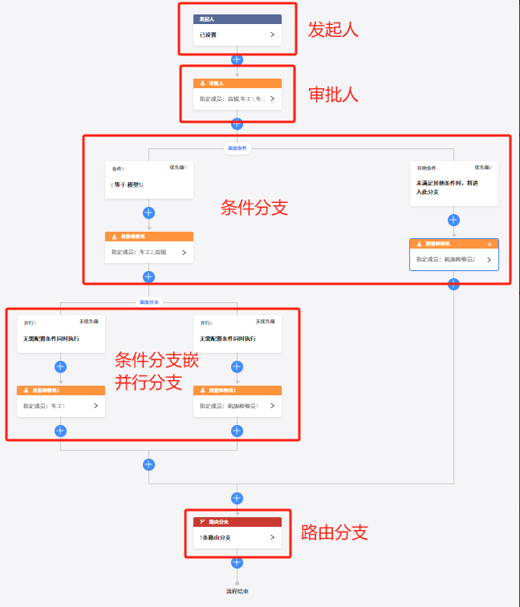
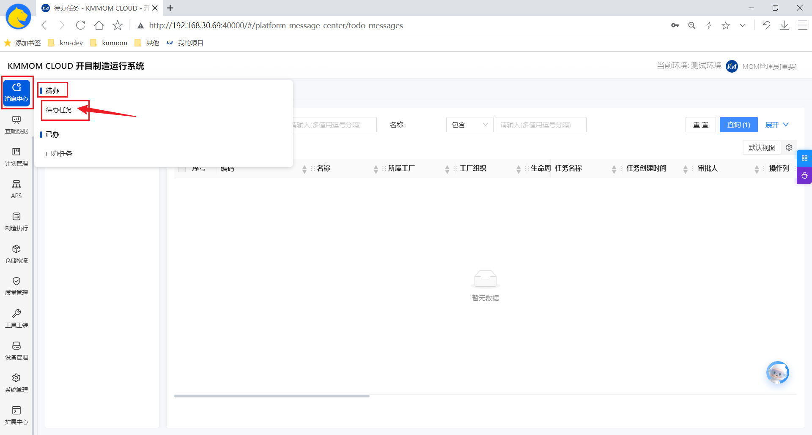
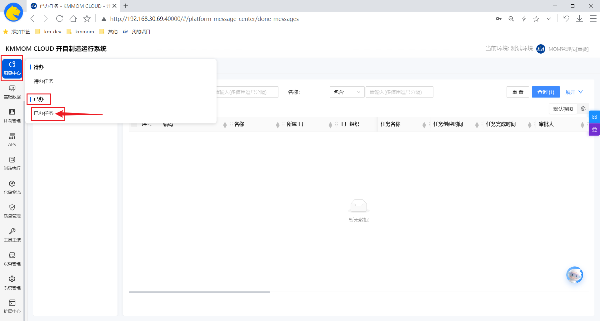

# 流程引擎

## 简介
本文档全面介绍了流程引擎的功能特性与操作指南，旨在帮助用户快速构建企业级的业务审批体系。内容涵盖了流程模型可视化设计的完整配置流程，详细解析了人工审批、自动节点、多类型分支（条件、并行、路由）等核心能力。同时，文档还提供了关于流程发起、待办处理、进度追踪等执行端操作的详细说明，助力企业实现业务流程的规范化、自动化与高效流转。

## 核心功能
- **流程模型**：是对业务流程的抽象表示，它定义了流程的起点、终点、各个环节的关系和操作。（例如，可以通过图形化的方式进行设计，常见的流程模型任务节点、网关（用于流程分支判断）、顺序流等）。
- **待办任务**：可查看和办理待审批的流程。
- **已办任务**：可查看已审批过的流程。

## 审批工作流配置说明
- 定义并设计一个完整工作流流程模型。
- 审批流程定义好后，需要配置在对应业务流程的审批配置中，方可在对应业务中发起对应审批流程。

## 操作指南

### 1. 流程模型
#### 1.1. 进入页面
1. 在左侧导航栏中，点击 **系统管理** → **审批流管理** → **流程模型**，即可进入流程模型配置页面。

#### 1.2. 搜索流程
根据"流程模型名称"对全部流程模型数据模糊查询。

#### 1.3. 新建模型
1. 点击页面右上角 **新建模型**，进入新建页面；

2. 填写 **基础信息**：流程标识、流程名称、关联业务模型，点击右上角 **下一步** 继续后续配置；
3. 配置 **流程设计**：根据实际业务配置对应需要的审批流程（各审批流程配置项说明如下表所示，其中审批人具体配置见 **1.4. 流程模型审批人配置说明**），点击右下角 **下一步** 继续后续配置;

| 配置项 | 作用说明 | 典型应用场景 |
| :------: | :----------------------------------------------------------: | :----------------------------------------------------------: |
| 审批人   | 设置需对流程内容审核、决策的人员 / 角色，流程到该节点需等待其同意 / 驳回 | 请假流程中部门经理审批、费用报销流程中财务 / 领导审批        |
| 条件分支 | 按规则判断拆分流程走向，不同条件触发不同分支，实现流程智能分流 | 费用报销依金额判断，＜1000 走直接打款分支、≥1000 走总经理二次审批分支 |
| 并行分支 | 使流程同时推进多个独立任务，并行执行以缩短整体耗时、提升效率 | 新员工入职时，同步并行 IT 配设备、行政办工牌、人力签合同等任务 |
| 路由分支 | 结合复杂逻辑（多字段组合、关联其他数据等）动态决定流程走向，适配复杂场景 | 跨区域业务依 "申请人所属区域 + 业务类型"，路由到对应区域负责人 / 专属流程 |
审批流程配置示例：

> **注意事项：**
> - 可根据提供的5种分支功能，自由进行排列组合，配置出理想的工作流模型；
> - 例：（7种业务场景）
>    - 1）发起人-审批人-结束；
>    - 2）发起人-审批人-并行分支-审批人-结束；
>    - 3）发起人-审批人-条件分支-审批人-结束；
>    - 4）发起人-审批人-路由分支-审批人-结束；
>    - 5）发起人-审批人-条件分支-并行分支-路由分支-审批人-结束；
>    - 6）发起人-审批人-并行分支-条件分支-路由分支-审批人-结束；
>    - 7）发起人-审批人-路由分支-并行分支-条件分支-审批人-结束。

#### 1.4. 流程模型审批人配置说明
根据实际情况，参考下表说明，根据页面对应审批类型的配置项，配置各审批节点审批人：
| 分类       | 配置项       | 解释                                                         |
| :----------: | :------------: | :------------------------------------------------------------: |
| 审批类型   | 人工审批     | 需指定人员手动对流程进行审批操作，决定是否通过，是最常见的审批交互方式 |
|            | 自动通过     | 无需人工干预，流程到达该节点时自动判定为通过，可用于一些预设好符合条件就直接放行的场景 |
| 审批人设置 | 指定成员     | 直接选定具体的个人作为审批人，明确到个体                     |
|            | 部门成员     | 选定某个部门内的成员作为审批人，可灵活选取部门内合适人员     |
|            | 审批人自选   | 让当前环节的审批人自行选择后续环节（若有）的审批人，用于动态调整审批流程 |
| 其他       | 操作按钮设置 | 可自定义审批节点上显示的操作按钮（如同意、驳回、转办等）及功能 |
|            | 表单字段权限 | 设置审批人对流程表单中各字段的查看、编辑等权限，控制信息可见范围 |

#### 1.5. 修改
对流程模型内基本信息、流程设计内容做调整，点击"创建新版本"按钮，详细操作步骤与新建模型一致。

#### 1.6. 复制
复制当前流程模型，点击"复制"按钮后会，系统会自动打开二级弹窗"基本信息"界面，需修改"流程标识"、"流程名称"（"流程标识"作为唯一标识，不允许重复）。

#### 1.7. 发布
发布后流程才能生效，方可在对应业务流程中发起审批（对应业务配置了加入审批流程，发起才会生成对应的审批流程）。

#### 1.8. 注意事项
- 新增、修改完成后，切记点击"发布"，否则修改内容不会生效；

### 2. 待办任务
#### 2.1. 进入页面
1. 在左侧导航栏中，点击 **消息中心** → **代办任务**，即可进入待办任务页面。

#### 2.2. 查询
根据对应查询条件，查询流程数据；

#### 2.3. 办理
针对当前流程任务，可进行编辑、通过、审批、抄送、退回、保存等操作（操作说明如下表）。
| 功能列表 | 功能描述 |
| :----: | :----: |
| 通过 | 审批人确认内容符合要求，点击后流程流转至下一节点，完成当前审批环节推进 |
| 拒绝 | 审批人判定内容不满足条件，操作后流程终止或退回至发起人，同时可填写拒绝原因反馈 |
| 抄送 | 将审批结果通知给抄送人，同一个审批默认排重，不重复抄送给同一人 |
| 转办 | A 转给其 B 审批，B 审批后，进入下一节点 |
| 委派 | A 转给其 B 审批，B 审批后，转给 A，A 继续审批后进入下一节点 |
| 加签 | 允许当前审批人根据需要，自行增加当前节点的审批人，支持向前、向后加签 |
| 退回 | 将审批重置发送给某节点，重新审批。可驳回至发起人、上一节点、任意节点 |
| 保存 | 暂存当前审批填写内容，不提交流转，方便后续补充完善后再处理 |

### 3. 已办任务
#### 3.1. 进入页面
1. 在左侧导航栏中，点击 **消息中心** → **已办任务**，即可进入已办任务页面。

#### 3.2. 查询
根据对应查询条件，查询流程数据。
