# 业务配置

## 1. 功能概述
业务配置用于集中维护 MOM 系统中的关键业务规则。采用“配置卡片 + 配置分组”的方式组织配置，既支持统一默认值，也支持按项目或业务场景进行差异化覆盖。

本文重点说明：

- 产品级默认配置：作为基础配置，对未单独设置的业务场景生效。
- 项目级配置：用于按项目或专题场景覆盖默认规则，同一时间仅允许启用一个项目级配置。
- 分组化维护：在单个配置内按业务域维护规则，例如 `MES制造执行`、`计划排产配置`、`质量管理配置`、`设备管理配置`、`工装管理配置`、`外委配置` 等。
- 层级覆盖：优先维护通用默认值，再针对具体组织或项目补充差异化设置，降低维护成本。

## 2. 入口与页面结构

### 2.1 进入方式
1. 管理员登录系统。
2. 在左侧导航中进入 **系统管理**。
3. 点击 **业务配置**，进入业务配置首页。

### 2.2 首页说明

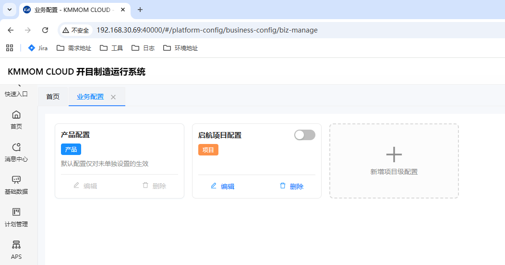

业务配置首页以卡片方式展示当前可维护的配置方案，常见区域如下：

| 区域 | 说明 |
| --- | --- |
| 产品配置卡片 | 作为默认配置使用，页面通常会提示“默认配置仅对未单独设置的生效”。 |
| 项目配置卡片 | 用于维护项目级规则，可通过卡片右上角开关控制是否启用。 |
| 新增项目级配置 | 点击带有 `+` 的卡片可新增一套项目级配置。 |
| 编辑 / 删除 | 每张卡片底部提供编辑、删除等操作入口。 |

新增配置时，系统通常弹出“新增配置”窗口，维护以下信息：

- `编码`：配置的唯一标识。
- `名称`：配置名称，用于页面显示。
- `备注`：对配置用途进行补充说明，便于后续维护。

### 2.3 详情页说明

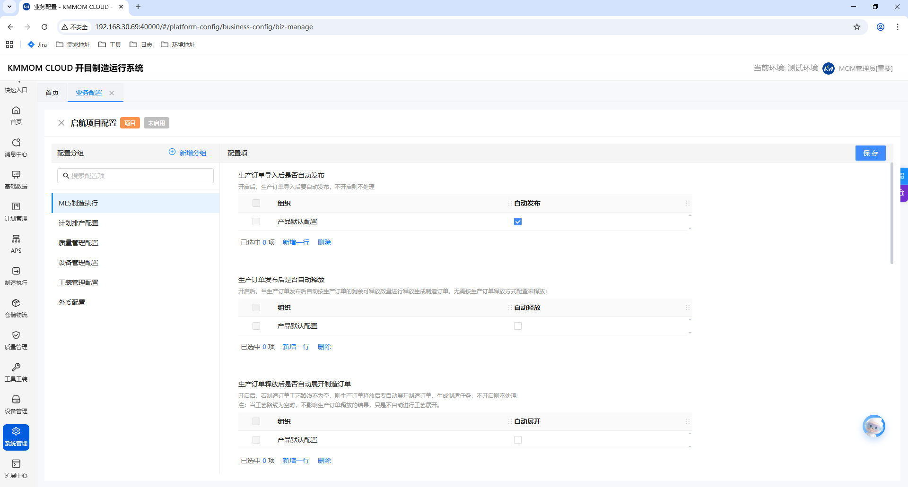

点击卡片后，进入配置详情页。详情页一般包含以下区域：

- 顶部标题区：显示配置名称、配置级别标签及启用状态。
- 左侧配置分组区：用于切换不同业务分组，并支持搜索配置项。
- 右侧配置区：展示当前分组下的具体配置内容。
- 页面右上角 `保存`：完成本次修改后统一保存。

在表格类配置中，常见的维护方式如下：

- `产品默认配置`：表示当前配置的基础值。
- `新增一行`：为特定业务组织补充差异化配置。
- `删除`：删除已选中的覆盖行，删除后通常回退为默认值。
- 行内控件：根据配置项不同，可能使用开关、下拉框、输入框、复选框等方式维护。

## 3. 配置使用规则

### 3.1 默认配置与项目配置
- 建议先维护 `产品配置`，作为统一基线。
- 当某一项目需要与默认规则不同的业务逻辑时，再新增并维护项目级配置。
- 启用某个项目级配置时，系统会提示“该操作会禁用其他项目级配置”，确认后才会生效。

### 3.2 配置覆盖原则
- 优先维护通用默认值，减少重复配置。
- 如某一组织或场景存在特殊需求，可在表格中新增对应组织的覆盖行。
- 删除覆盖行后，系统一般恢复使用默认配置。
- 配置变更通常影响后续新产生的业务，已在途业务是否同步变化，应以实际业务规则为准。

### 3.3 保存与生效
1. 在左侧切换到目标配置分组。
2. 在右侧完成字段修改、下拉选择或表格编辑。
3. 点击页面右上角 **保存**。
4. 建议保存后使用测试数据或样例业务单据进行验证。

## 4. 操作指南

### 4.1 新增项目级配置

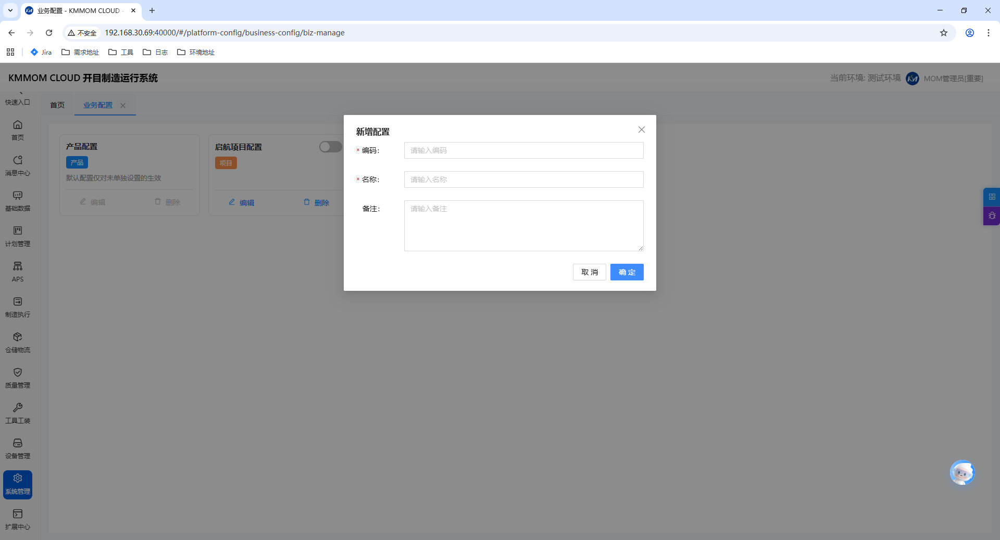

1. 进入 **业务配置** 首页。
2. 点击 **新增项目级配置** 卡片。
3. 在弹窗中填写 `编码`、`名称`、`备注`。
4. 点击 **确定** 完成新增。
5. 新增完成后，进入详情页维护具体业务规则。

### 4.2 启用项目级配置

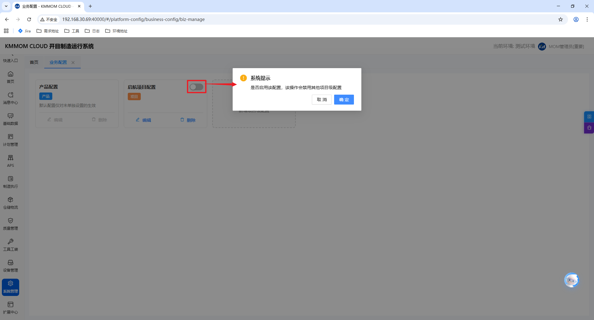

1. 在首页找到目标项目配置卡片。
2. 打开卡片右上角的启用开关。
3. 阅读系统提示“启用该配置会禁用其他项目级配置”。
4. 点击 **确定** 后，当前项目配置变为启用状态。

### 4.3 修改配置项

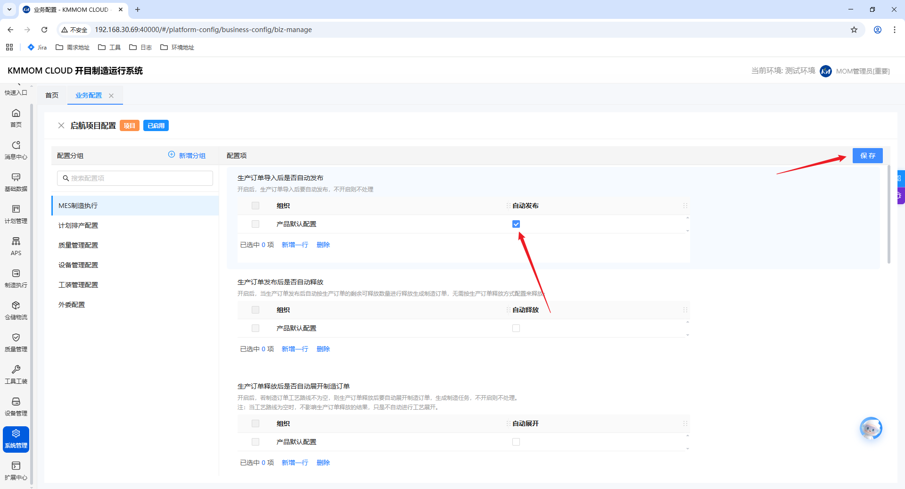

1. 在首页找到目标配置卡片。
2. 点击卡片。
3. 在左侧切换到需要维护的配置分组。
4. 在右侧修改对应参数。
5. 点击 **保存** 完成更新。

### 4.4 新增组织覆盖行

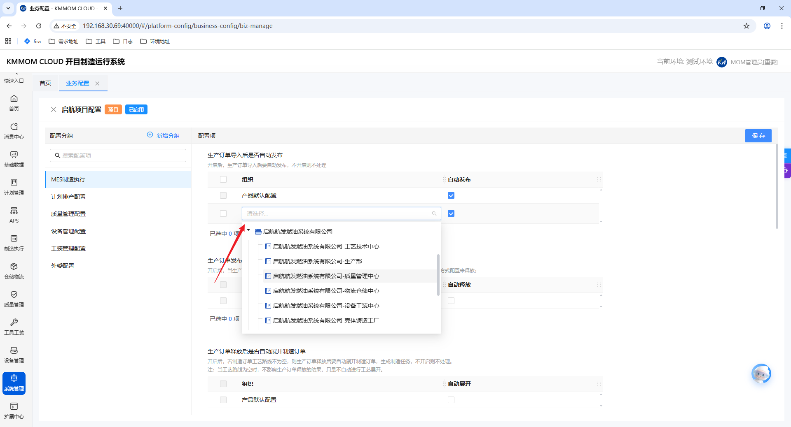

1. 进入目标配置分组。
2. 在表格类配置区域点击 **新增一行**。
3. 选择适用的业务组织。
4. 维护该组织对应的配置值。
5. 点击 **保存**。

### 4.5 删除组织覆盖行

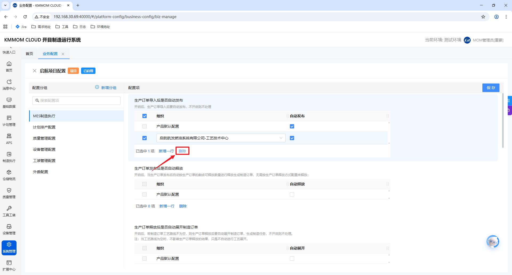

1. 在表格中勾选需要删除的行。
2. 点击 **删除**。
3. 保存后，该组织通常恢复使用默认配置。

## 5. 配置分组说明

### 5.1 MES制造执行

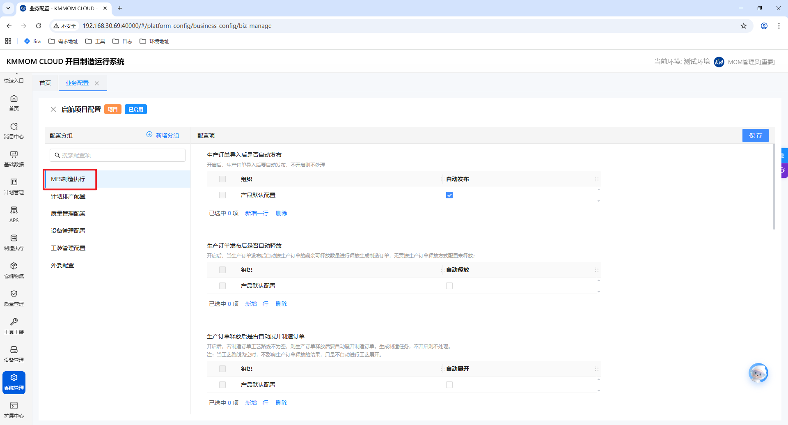

`MES制造执行` 用于控制生产订单在导入、发布、释放等环节的系统行为。当前页面中常见配置项如下：

| 配置项 | 说明 |
| --- | --- |
| 生产订单导入后是否自动发布 | 控制生产订单导入后是否直接进入已发布状态。 |
| 生产订单发布后是否自动释放 | 控制订单发布后是否自动释放到执行环节。 |
| 生产订单释放后是否自动展开制造订单 | 控制释放后是否按工艺路线自动生成制造任务。 |
| 生产订单释放后是否自动生成物料准备计划 | 控制释放后是否同步生成备料相关计划。 |
| 制造订单完工后是否自动发起合格入库申请 | 开启后，当制造订单完工后且存在合格数量时，自动发起合格入库申请单，若未配置该物料的合格库房，则发起申请失败，但订单完工成功，此时可手动进行合格入库申请。 |
| 制造任务报工后是否自动发起报废入库申请 | 开启后，当制造任务汇报时且存在报废数量时，自动发起报废入库申请单，若未配置该物料的报废库房，则发起申请失败，但订单完工成功，此时可手动进行报废入库申请。 |
| 默认库房配置 | 用于定义成品完工入库和报废入库申请等业务场景的默认库房。 |

维护建议：

- 自动化程度越高，对基础数据完整性要求越高。
- 建议先在默认配置中确定统一规则，再对特殊组织追加覆盖行。

### 5.2 计划排产配置

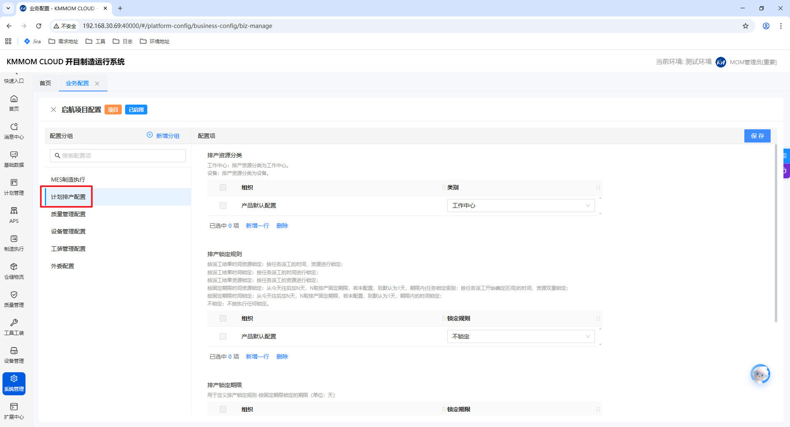

`计划排产配置` 用于维护排产资源口径及锁定规则，常见项包括：

| 配置项 | 说明 |
| --- | --- |
| 排产资源分类 | 定义排产按 `工作中心` 还是 `设备` 作为资源粒度。 |
| 排产锁定规则 | 定义排产结果在何种规则下保持不被再次排程覆盖。 |
| 排产锁定期限 | 当锁定规则需要期限参数时，在此维护锁定天数。 |
| 其他排产参数 | 某些项目版本还会开放排产标准时间等辅助参数。 |

操作要点：

- 先选择适用的业务组织，再维护该组织的排产参数。
- 如组织较多，建议优先维护默认值，仅为少量特殊组织增加覆盖配置。

### 5.3 质量管理配置

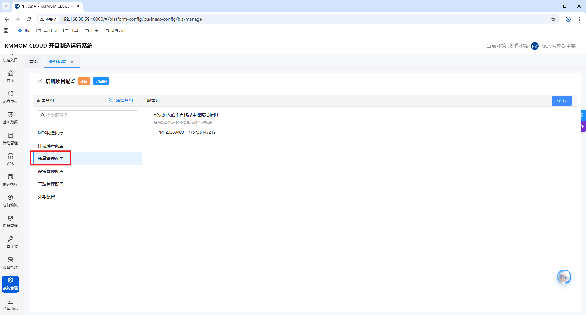

`质量管理配置` 主要用于维护不合格品处理相关规则。当前确认页面中，常见配置项为：

| 配置项 | 说明 |
| --- | --- |
| 默认加入的不合格品审理流程标识 | 指定不合格品处理时默认关联的审批流程编码。 |

维护时请注意：

- 流程标识需与审批流系统中的已发布流程保持一致。
- 若流程已停用或编码变更，应同步更新本配置。

### 5.4 设备管理配置

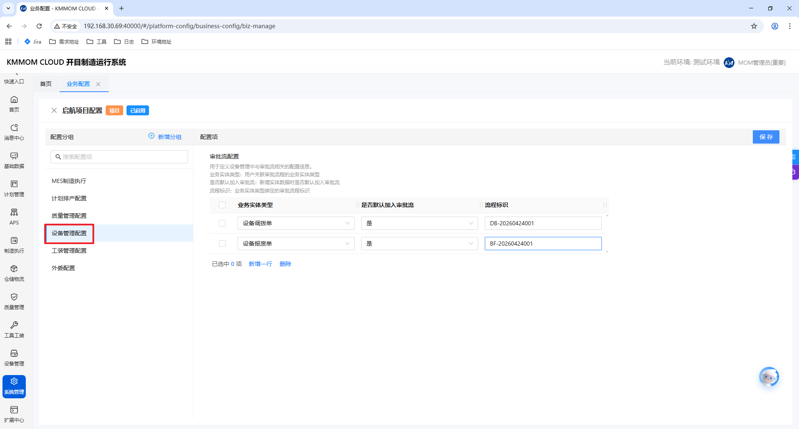

`设备管理配置` 用于维护设备业务的审批流规则。页面通常以表格方式维护，不同业务实体可分别配置审批策略。

| 字段 | 说明 |
| --- | --- |
| 业务实体类型 | 例如设备调拨单、设备报废单等。 |
| 是否默认加入审批流 | 控制新建业务数据时是否默认启动审批。 |
| 流程标识 | 指定该业务实体对应的审批流程编码。 |

建议做法：

- 先确认设备业务实体与审批流编码的对应关系。
- 如企业要求所有设备类单据必须审批，可统一开启“默认加入审批流”。

### 5.5 工装管理配置

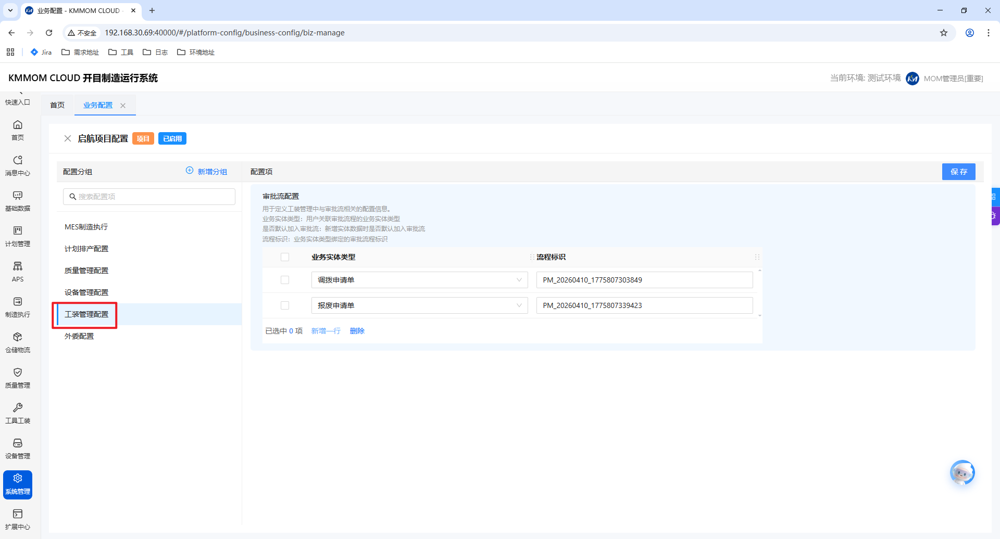

`工装管理配置` 用于维护工装工具相关业务的审批规则。当前确认页面中，常见业务实体包括调拨申请单、报废申请单等。

| 字段 | 说明 |
| --- | --- |
| 业务实体类型 | 例如调拨申请单、报废申请单。 |
| 流程标识 | 指定该业务实体对应的审批流程编码。 |

使用建议：

- 工装类审批流应先在流程管理中完成定义，再回到业务配置中引用。
- 若项目版本已开放借用周期等优化项，可继续在本分组下按表格方式维护。

### 5.6 外委配置

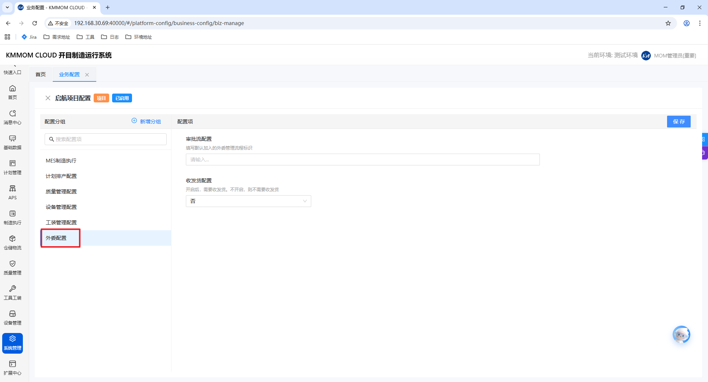

部分项目版本在左侧会显示 `外委配置` 分组。由于不同版本开放的字段可能不同，建议按以下原则维护：

1. 先阅读页面上的配置说明。
2. 优先维护默认值，再补充特殊组织覆盖。
3. 修改后及时保存，并用外委相关业务单据进行验证。

## 6. 推荐配置顺序
为降低实施风险，建议按以下顺序完成业务配置：

1. 先维护 `产品配置`，形成统一的默认业务规则。
2. 依次完成 `MES制造执行`、`计划排产配置` 等影响面较大的基础规则。
3. 再维护 `质量管理配置`、`设备管理配置`、`工装管理配置` 等审批相关配置。
4. 如项目存在差异化需求，再新增并启用项目级配置。

## 7. 注意事项
- `产品配置` 是基础规则，修改后会影响未单独设置的业务场景。
- 同一时间仅允许启用一个项目级配置，启用新的项目配置会自动替换当前已启用项目配置。
- 对于表格类配置，建议优先维护默认值，只有确有差异时再增加组织覆盖行。
- 审批流相关配置必须保证流程标识有效，且对应流程已在流程引擎或审批中心中发布。
- 涉及生产订单、排产、审批流的配置调整，建议先在测试环境验证，再在正式环境变更。
- 修改完成后务必点击 **保存**，未保存的更改不会生效。
- 若页面实际字段与本文略有差异，应以当前版本界面显示及项目实施规则为准。
