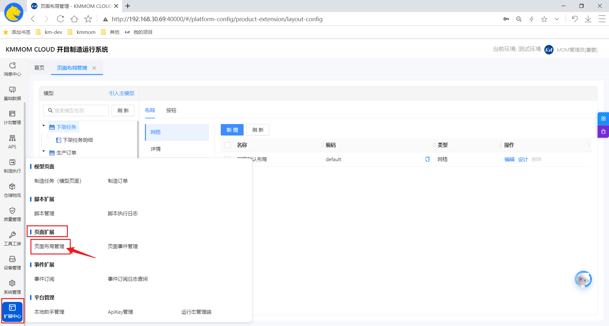
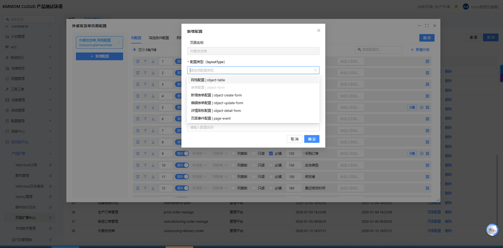
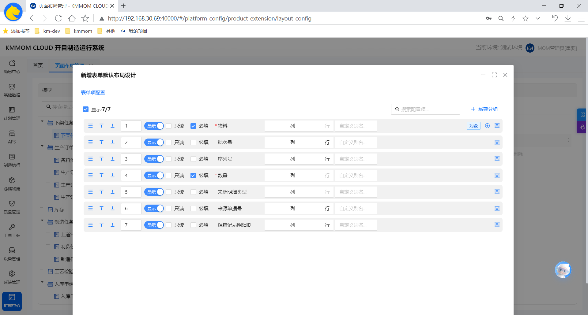
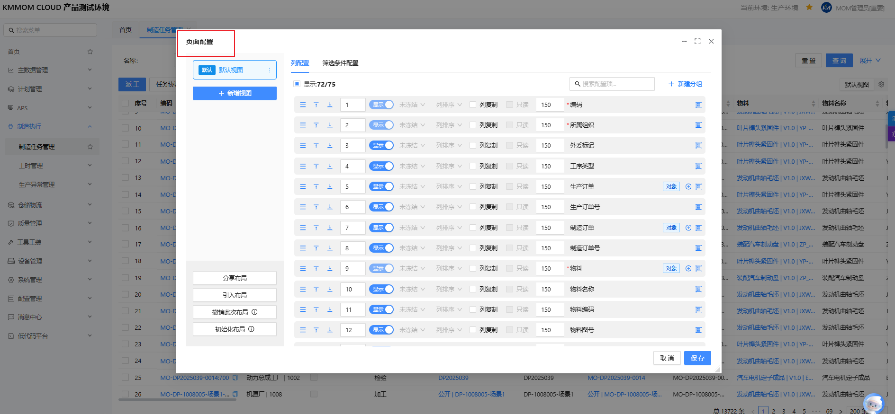
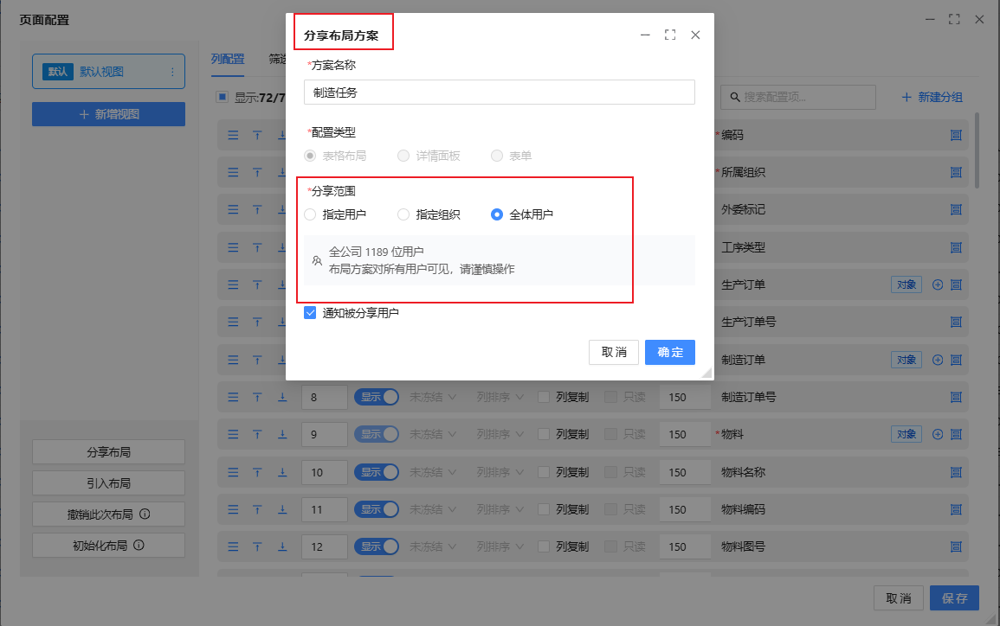

# 自定义布局配置

## 1. 概述

在MOM（制造运营管理）系统中，为了满足不同企业、不同业务场景以及不同用户的个性化需求，系统提供了强大的**自定义布局配置**能力。该能力采用“服务端定义标准 + 客户端个性化”的双层架构设计，既保证了企业级业务规范的统一性，又赋予了最终用户灵活的操作体验。

本文档将详细介绍自定义布局配置的体系结构、核心功能及使用指南，帮助管理员和最终用户充分利用这一特性提升工作效率。

### 1.1 核心设计理念

系统的布局配置遵循以下核心原则：

- **权责分离**：
  - **服务端（管理员/实施顾问）**：定义“能力”和“标准”。决定用户**能看到什么**、**能操作什么**（如：字段的可用性、数据验证规则、业务联动逻辑）。
  - **客户端（最终用户）**：定义“偏好”。在服务端划定的圈子内，决定**想怎么看**（如：表格列的顺序、筛选条件的默认值、个性化的视图方案）。
- **配置驱动**：所有页面结构和行为均由元数据驱动，支持“即改即用”，无需重新部署代码。
- **场景化适配**：支持同一业务对象在不同场景（如管理平台CRUD、车间工作台）下呈现不同的布局形态。

---

## 2. 核心价值：解决什么问题？

| 痛点         | 解决方案           | 价值收益                                                                                           |
| :----------- | :----------------- | :------------------------------------------------------------------------------------------------- |
| **千人千面** | **客户端个性化**   | 用户可根据个人习惯隐藏不常用字段、调整列顺序，聚焦核心信息，提升操作效率。                         |
| **业务多变** | **服务端灵活配置** | 面对多品种小批量的生产环境，管理员可快速调整页面结构（如增加质检项、调整报工字段），无需开发介入。 |
| **交付效率** | **可视化配置中心** | 实施顾问通过图形化界面即可完成页面标准的定义，大幅缩短项目交付周期。                               |
| **协作共享** | **方案管理与分享** | 资深员工配置的高效视图方案可一键分享给团队或新人，沉淀最佳实践。                                   |

---

## 3. 服务端布局配置指南

> **适用角色**：系统管理员、实施顾问
> **功能入口**：扩展中心 -> 页面扩展 -> 页面布局管理

服务端布局配置是系统管理员定义页面标准结构、行为规则和权限边界的核心工具。通过配置，您可以决定用户在界面上“能看到什么”以及“必须遵循什么规则”。

### 3.1 页面布局管理

页面布局管理是所有页面配置的总入口。

#### 3.1.1 核心操作

1.  **引入页面**：
    - 点击列表上方的 **[引入主模型]** 按钮。
    - 在弹出的模型列表中选择需要进行布局配置的功能页面对象模型（如“生产订单”）。
    - **作用**：将标准功能纳入布局管理体系，未引入的页面将使用系统硬编码的默认布局。

2.  **进入配置**：
    - 在页面列表中找到目标页面。
    - 点击 **[布局]** 和 **[按钮]**，进入详细配置设计器。

---

### 3.2 详细配置指南

进入配置设计器后，界面分为左右两栏：

- **左侧（配置导航）**：选择要配置的模块类型（如网格、新增表单、详情页）。
- **右侧（属性设置）**：针对选中模块的具体参数设置。

#### 3.2.1 网格配置 (Object-Table)

用于定义列表页（List Page）的数据展示和查询规则。

**1. 列配置 (Columns)**
定义表格中显示哪些列及其属性。

- **显示/隐藏**：勾选字段前的复选框，决定该列是否默认显示。
- **排序设置**：设置列的默认排序规则（升序/降序），支持多列组合排序。
- **冻结列**：勾选“冻结”，将关键列（如单号、状态）固定在表格左侧，避免横向滚动时丢失上下文。
- **列宽**：输入像素值（如 **120**），设定列的默认宽度。
- **快速复制**：开启后，用户在单元格悬停时会出现复制图标，方便快速提取数据。

**2. 筛选条件 (Filters)**
定义列表顶部的查询区域。

- **字段选择**：勾选需要作为查询条件的字段。
- **操作符限制**：为每个字段指定允许的操作符（例如：对“状态”字段只允许“等于”，对“备注”字段允许“包含”）。
- **默认值设定**：
  - **固定值**：如默认查询“状态=新建”的单据。
  - **动态值**：支持系统变量，如“当前用户”、“本周”、“本月”。
- **多级联动**：
  - 配置字段间的依赖关系。例如：当“工厂”字段选择了A工厂时，“车间”下拉框仅显示属于A工厂的车间数据。
- **只读控制**：将某些筛选条件设为只读（配合默认值使用），强制用户只能查询特定范围的数据。

**3. 表格样式 (Styles)**

- **行样式**：设置条件格式。例如：当 **库存数量 < 安全库存** 时，整行背景标红。
- **单元格样式**：针对特定单元格设置颜色或字体加粗。

#### 3.2.2 表单配置 (Object-Form)

用于定义“新增”和“编辑”弹窗的布局与交互。

_(建议截图：展示表单配置界面，体现字段分组和拖拽排序功能)_

**1. 布局与分组**

- **字段排序**：通过拖拽调整字段在表单中的上下顺序。
- **属性分组**：点击 **[添加分组]**，创建逻辑区块（如“基础信息”、“财务信息”、“物流信息”），将相关字段归类，支持默认折叠/展开。

**2. 字段属性控制**

- **显示/隐藏**：控制字段是否在表单中可见。
- **必填校验**：勾选“必填”，强制用户必须输入。
- **正则验证**：输入正则表达式（如 **^[0-9]\*$**），限制输入格式（如仅允许数字），并可自定义错误提示语。

**3. 业务联动**

- 配置字段值改变时的触发行为。例如：修改“物料编码”后，自动带出并填充“物料名称”、“规格型号”和“单位”。

#### 3.2.3 详情配置 (Object-Detail-Form)

用于定义数据详情页（Detail Page）的展示结构。

- **多标签页管理**：
  - 支持添加多个Tab页签（如“基本属性”、“关联单据”、“操作日志”）。
  - 可配置每个Tab页签内加载的数据模型或关联列表。
- **信息分级**：通过分组和Tab页签，将复杂的大量信息分层展示，避免一页展示过多内容导致信息过载。

#### 3.2.4 卡片配置
用于定义数据卡片的展示结构。
- **不分行展示**：仅需调整字段位置，改变显示顺序。
- **分行展示**：创建分组，一组一行，将字段属性移动到分组下，只显示分组信息

#### 3.2.5 脚本配置 (Page-Script)

- **应用场景**：当配置项无法满足复杂的业务逻辑时使用。
- **功能**：支持编写或挂载JavaScript脚本，监听页面事件（如 **onLoad**, **onSave**, **onFieldChange**），实现高度定制化的交互逻辑。

#### 3.2.6 按钮配置
用于控制当前页面按钮是否启用及扩展，角色管理中对启用的按钮可进行授权。

---

## 4. 客户端布局配置指南

> **适用角色**：所有系统用户
> **功能入口**：各功能页面右上角的 **【设置】** 图标 <i class="icon-settings"></i>

客户端布局是用户提升个人工作效率的神器。您所做的所有配置**仅对自己生效**，除非您主动分享给他人。

### 4.1 个性化配置操作手册

#### 4.1.1 打造您的专属表格（网格配置）

在任何包含数据表格的页面（如订单列表），点击右上角【设置】->【表格配置】：

_(建议截图：展示客户端的表格配置弹窗，包含列显示勾选、排序拖拽和冻结设置)_

1.  **精简列展示**：
    - 取消勾选那些您从不关心的列，减少视觉干扰。
2.  **调整列顺序**：
    - 按住字段名左侧的拖拽图标 <i class="icon-drag"></i>，将最重要的信息（如“单号”、“状态”）拖到最上面（对应表格的最左侧）。
3.  **锁定关键信息**：
    - 点击“冻结”按钮，将关键列锁定在左侧。无论表格如何横向滚动，这些列始终可见。
4.  **保存为视图方案**：
    - **场景**：如果您既需要关注“待处理订单”，又需要定期查看“异常订单”，它们的列关注点可能不同。
    - **操作**：配置好后，点击底部的 **[保存为新视图]**，命名为“我的待处理视图”。之后您可以在页面左上角的视图下拉框中一键切换。

#### 4.1.2 优化查询效率（筛选配置）

在【设置】->【筛选配置】中：

1.  **设置默认查询条件**：
    - 如果您每天都要查“本车间”且状态为“进行中”的任务，可以在这里填好默认值。
    - 下次打开页面，系统自动为您填好这些条件，直接点击查询即可。
2.  **调整操作符**：
    - 将默认的“等于”改为“包含”，支持模糊搜索，无需每次手动切换。
3.  **排序筛选字段**：
    - 将最常用的查询字段拖到第一排，不再需要展开“更多”去寻找。

#### 4.1.3 顺手的表单录入（表单配置）

在新增或编辑数据时，点击弹窗右上角的【设置】：

1.  **隐藏干扰项**：
    - 将非必填且不常用的字段隐藏。
2.  **符合直觉的顺序**：
    - 调整字段顺序，使其符合您手边纸质单据或实际作业流程的顺序，实现“盲打”录入。

### 4.2 方案管理与分享

好的工作习惯值得推广。

_(建议截图：展示方案管理界面，包含分享给用户/组织的选项)_

1.  **分享方案**：
    - 在配置弹窗左下角，点击 **[分享]**。
    - 选择分享对象：可以是特定的**用户**（如您的徒弟），也可以是整个**部门/角色**。
    - 被分享者在收到通知后，可直接应用您的布局方案。
2.  **恢复默认**：
    - 如果配置调整得过于混乱，或者系统升级了新功能，您可以点击 **[恢复默认]**，一键重置回系统管理员设定的标准布局。

---

## 5. 总结：服务端与客户端的边界

为了避免配置冲突，理解两者的边界至关重要：

| 维度         | 服务端 (Server)      | 客户端 (Client)                         |
| :----------- | :------------------- | :-------------------------------------- |
| **字段权限** | 决定字段**是否存在** | 决定字段**是否显示** (在存在的范围内)   |
| **必填控制** | 定义**必填项**       | **不可隐藏**必填项                      |
| **默认值**   | 定义**系统级默认值** | 定义**个人级默认值** (优先级高于系统级) |
| **影响范围** | 全局生效 (或按角色)  | 仅对自己生效 (除非主动分享)             |
| **能力上限** | 定义最大能力集       | 在能力集内做减法或重排                  |

通过灵活运用自定义布局配置，MOM系统能够从一个通用的业务平台，进化为每个用户得心应手的个性化生产力工具。
