# 自定义布局配置

## 1. 概述

在 MOM（制造运营管理）系统中，布局配置分为 **服务端布局** 和 **客户端布局** 两个层面。

- **服务端布局**：由管理员或实施顾问维护，定义页面的标准结构、默认字段、筛选条件和展示样式。
- **客户端布局**：由最终用户按个人习惯调整，在服务端定义的范围内优化个人使用体验。

页面布局管理采用 **模型树 + 布局页签 + 布局设计器** 的方式组织配置。本文档从功能和操作角度说明自定义布局配置的使用方法，重点覆盖服务端布局配置。

### 1.1 核心设计理念

- **权责分离**：服务端定义标准，客户端定义偏好。
- **自动生成**：引入主模型后，系统自动引入关系实体并生成默认布局，减少人工初始化工作。
- **配置驱动**：页面结构通过配置生效，无需重新开发。
- **场景适配**：同一数据实体可按网格、详情、表单、卡片等不同场景呈现。

---

## 2. 核心价值

| 痛点 | 功能解决方式 | 价值收益 |
| :--- | :--- | :--- |
| 页面初始化成本高 | 引入主模型后自动生成默认布局 | 降低实施配置成本，缩短交付周期 |
| 关系实体维护分散 | 自动引入主模型对应的关系实体 | 避免遗漏，保证布局管理完整性 |
| 网格展示需求差异大 | 列配置、筛选配置、样式配置分离管理 | 提升页面可读性和业务适配能力 |
| 用户关注点不同 | 服务端标准布局 + 客户端个性化布局 | 兼顾统一管理和个体效率 |

---

## 3. 服务端布局配置指南

> **适用角色**：系统管理员、实施顾问  
> **功能入口**：扩展中心 -> 页面布局管理

服务端布局配置用于维护系统标准页面。管理员可以通过页面布局管理功能，统一引入模型、生成默认布局并对不同布局类型进行设计。

### 3.1 页面布局管理

页面布局管理是服务端布局配置的总入口。页面主要分为以下区域：

- **左侧模型区**：展示已引入的主模型及其关系实体，支持搜索和刷新。
- **中部功能页签**：分为 **布局** 和 **按钮** 两个页签。
- **右侧列表区**：展示当前模型对应的布局记录，支持新增、刷新、编辑、设计和删除。

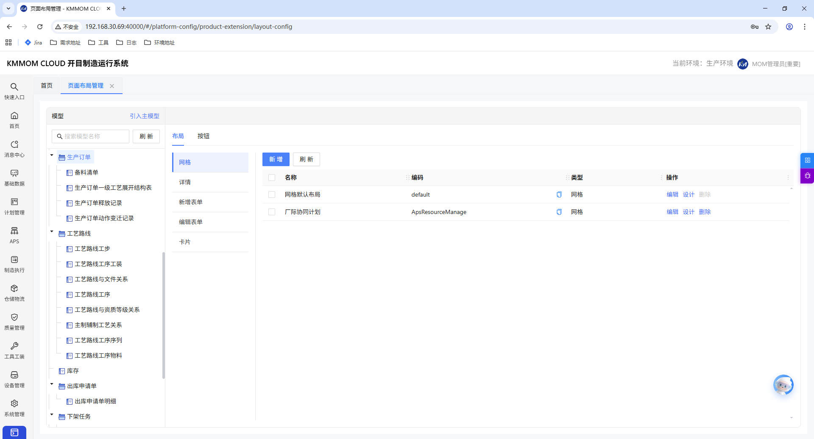

本文重点说明 **布局** 页签中的配置能力。

#### 3.1.1 引入主模型

1. 进入 **页面布局管理** 页面。
2. 在左侧模型区域上方点击 **引入主模型**。
3. 系统弹出“引入主模型”窗口。
4. 在“数据实体”输入框中选择需要引入的主模型。
5. 选中后，系统开始执行模型初始化。

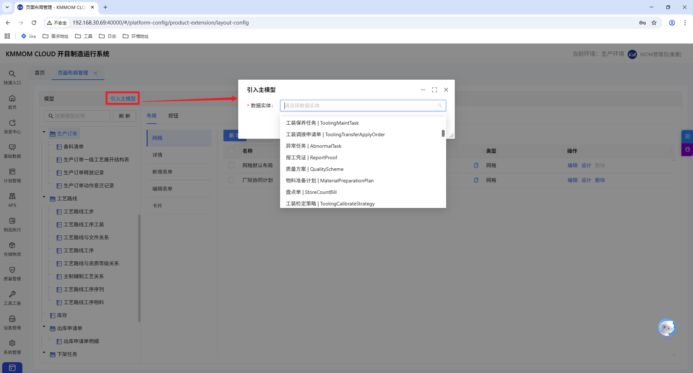

#### 3.1.2 引入结果

引入主模型后，系统会自动完成以下操作：

1. 自动引入该主模型对应的关系实体。
2. 自动生成该模型的默认布局。
3. 自动初始化当前模型的相关布局记录。

初始化完成后，系统会显示处理结果列表，用户可关闭窗口或继续点击 **引入其他实体**，继续进行布局初始化。


#### 3.1.3 默认生成的布局类型

选择目标模型后，切换到 **布局** 页签，系统会自动生成以下布局类型：

- 网格
- 详情
- 新增表单
- 编辑表单
- 卡片

这些布局作为系统默认布局生成，后续可在此基础上继续设计和调整。

---

### 3.2 布局设计入口

1. 在左侧模型树中选择目标模型。
2. 点击 **布局** 页签。
3. 在右侧布局列表中找到目标布局。
4. 点击对应行的 **设计**，进入布局设计器。

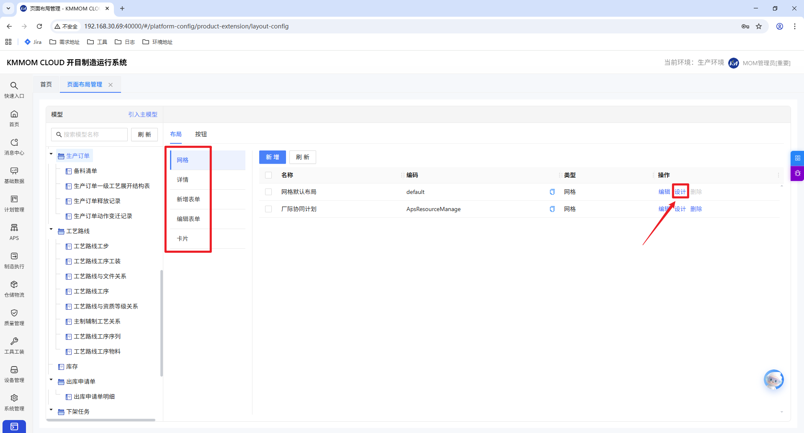

不同布局类型进入设计器后提供的配置页签如下：

| 布局类型 | 设计页签 | 说明 |
| :--- | :--- | :--- |
| 网格 | 列配置、筛选条件配置、网格样式配置 | 用于列表页字段展示、查询条件和样式控制 |
| 详情 | 表单项配置、标签页配置 | 用于详情页字段展示，以及控制对应模型关系表是否显示 |
| 新增表单 | 表单项配置 | 用于新增表单的字段展示和录入规则配置 |
| 编辑表单 | 表单项配置 | 用于编辑表单的字段展示和录入规则配置 |
| 卡片 | 卡片配置、筛选条件配置 | 用于卡片展示内容和卡片查询条件配置 |

管理员可根据不同页面类型进入对应设计器，完成标准布局维护。

---

### 3.3 网格配置

网格配置用于定义列表页字段显示方式、筛选条件和样式规则，是服务端布局中最常用的配置入口。

#### 3.3.1 列配置

进入网格默认布局设计后，默认打开 **列配置** 页签。该页签用于维护网格列的显示顺序、展示属性和字段行为。

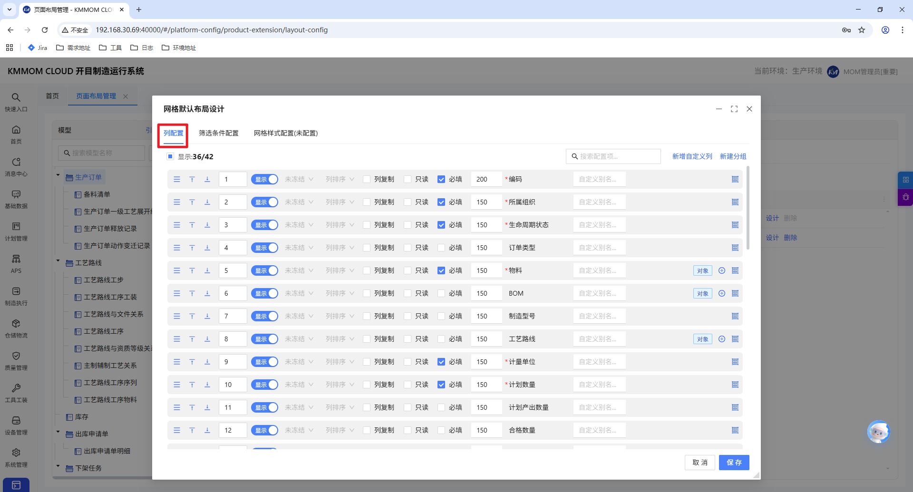

##### 1. 顺序调整

- 支持通过拖拽字段前的拖动图标调整字段顺序。
- 支持通过 **置顶**、**置底** 快速调整字段位置。
- 支持直接输入序号后按回车，系统自动按序号重新排序。

##### 2. 显示控制

- 可通过显示开关控制字段是否在网格中显示。
- 页面顶部会显示当前已显示字段数量，例如“显示：15/19”。

##### 3. 列属性设置

列配置支持以下常用属性：

1. **冻结设置**：支持配置为未冻结、左冻结或右冻结。
2. **列复制**：勾选后支持该列内容一键复制。
3. **只读**：控制字段是否只读。
4. **必填**：控制字段是否必填。
5. **列宽**：设置网格列默认宽度。
6. **自定义别名**：修改字段展示名称。
7. **引用属性显示**：为引用类字段指定展示属性。
8. **分组配置**：可将字段配置到不同分组中展示。
9. **时间格式**：时间类字段支持单独设置显示格式。

##### 4. 时间字段格式

时间类字段常用格式包括：

- `YYYY-MM-DD HH:mm:ss`
- `YYYY-MM-DD`

##### 5. 辅助能力

- 支持通过右上角搜索框快速查找配置项。
- 支持 **新增自定义列**。
- 支持 **新建分组**，便于按业务场景组织字段。

---

#### 3.3.2 筛选条件配置

切换到 **筛选条件配置** 页签后，可对网格顶部筛选区域进行统一维护。

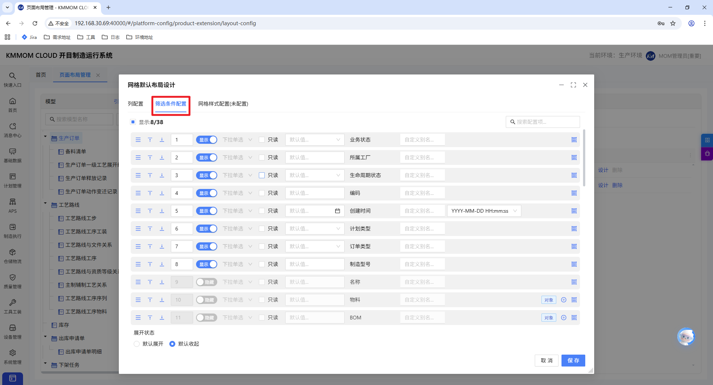

##### 1. 顺序与显示

- 支持通过拖拽调整筛选条件顺序。
- 支持 **置顶**、**置底** 操作。
- 支持输入序号并按回车自动排序。
- 支持设置筛选条件是否显示。

##### 2. 条件属性

筛选条件配置支持以下内容：

1. **默认条件**：可为筛选项配置默认值或默认查询条件。
2. **自定义别名**：修改筛选项显示名称。
3. **只读设置**：控制筛选项是否允许用户修改。
4. **时间格式**：时间类筛选项支持设置显示格式。

##### 3. 展开状态

筛选条件区域支持设置默认展开方式：

- 默认展开
- 默认收起

##### 4. 配置建议

- 常用筛选项建议靠前显示，减少用户查找成本。
- 有固定查询习惯的场景，可配置默认条件，提升查询效率。

---

#### 3.3.3 网格样式配置

切换到 **网格样式配置** 页签后，可维护网格样式脚本。

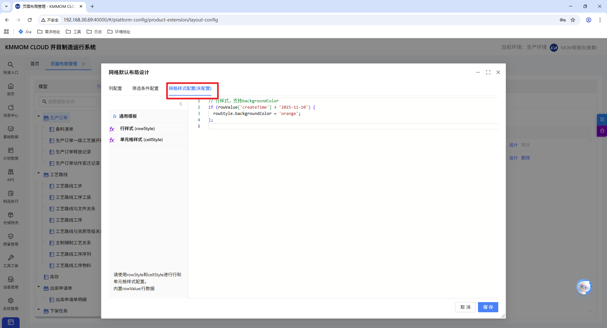

当前界面中，样式配置通过编辑器完成，主要用于控制：

- 行样式
- 单元格样式

##### 1. 模板与配置入口

网格样式配置左侧提供样例模板，便于管理员快速编写样式脚本，常见入口包括：

- **通用模板**
- **行样式（rowStyle）**
- **单元格样式（cellStyle）**

管理员可先选择系统提供的样例模板，再按实际业务字段和显示规则进行修改。

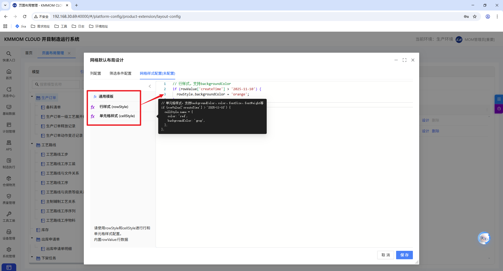

##### 2. 配置方式

- 使用 `rowStyle` 配置行样式。
- 使用 `cellStyle` 配置单元格样式。

其中：

- `rowStyle` 适合控制整行展示效果，常用于设置整行背景色。
- `cellStyle` 适合控制指定字段单元格样式，支持设置颜色、背景色、字号、字重等。

##### 3. 内置数据

- 编辑器内置 `rowValue`，表示当前行数据。

管理员可通过 `rowValue` 获取当前行字段值，并基于条件判断动态设置样式。

##### 4. 样例说明

系统提供的样例脚本可直接作为参考，例如：

```javascript
// 行样式，支持 backgroundColor
if (rowValue['createTime'] > '2025-11-10') {
  rowStyle.backgroundColor = 'orange';
}

// 单元格样式，支持 backgroundColor、color、fontSize、fontWeight 等
if (rowValue['createTime'] > '2025-11-10') {
  cellStyle.name = {
    color: 'red',
    backgroundColor: 'gray',
  };
}
```

样例说明：

1. 第一段脚本表示：当当前行的 `createTime` 大于指定日期时，将整行背景色设置为橙色。
2. 第二段脚本表示：当当前行的 `createTime` 大于指定日期时，将 `name` 字段对应单元格的文字颜色设置为红色，背景色设置为灰色。

在实际使用中，可将 `createTime`、`name` 替换为业务字段编码，并按业务规则调整条件和样式属性。

##### 5. 适用场景

- 对异常数据进行高亮显示。
- 对关键状态字段设置颜色区分。
- 对特定业务字段设置醒目标识。

---

### 3.4 详情配置

详情布局用于展示单据或业务对象的详细信息。进入 **详情** 类型布局后，点击 **设计**，可进入详情默认布局设计器。

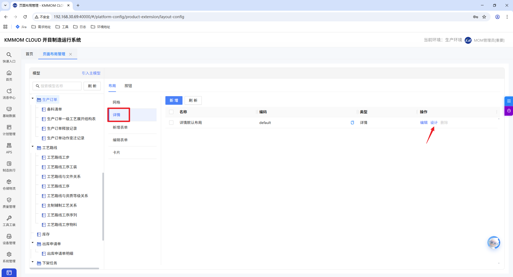

详情配置提供以下两个页签：

- 表单项配置
- 标签页配置

#### 3.4.1 表单项配置

表单项配置用于维护详情页中字段的显示顺序、显示状态和展示属性。

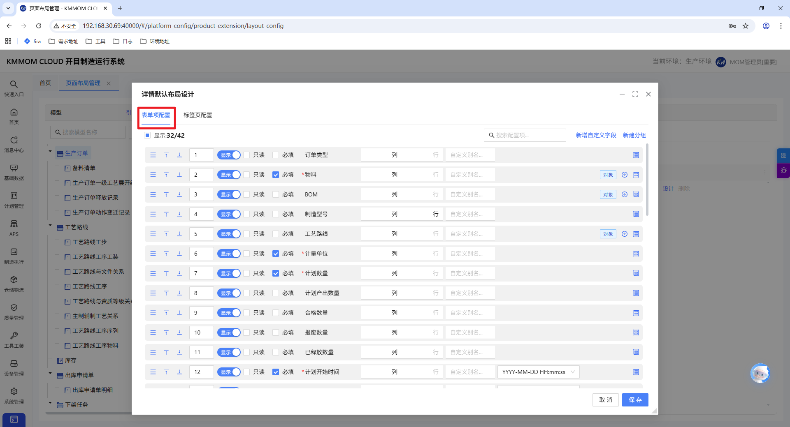

_详情布局 - 表单项配置界面_

支持的常见配置包括：

1. 通过拖拽调整字段显示顺序。
2. 通过 **置顶**、**置底** 调整字段位置。
3. 通过输入序号并按回车自动排序。
4. 配置字段是否显示。
5. 配置字段是否只读。
6. 配置字段是否必填。
7. 配置字段所在列和行位置。
8. 配置自定义别名。
9. 为引用类字段配置引用属性显示。
10. 为时间类字段配置显示格式。

当字段较多时，可结合列、行和别名配置优化详情页信息呈现效果。

#### 3.4.2 标签页配置

标签页配置用于控制详情页中对应模型的关系表是否显示。

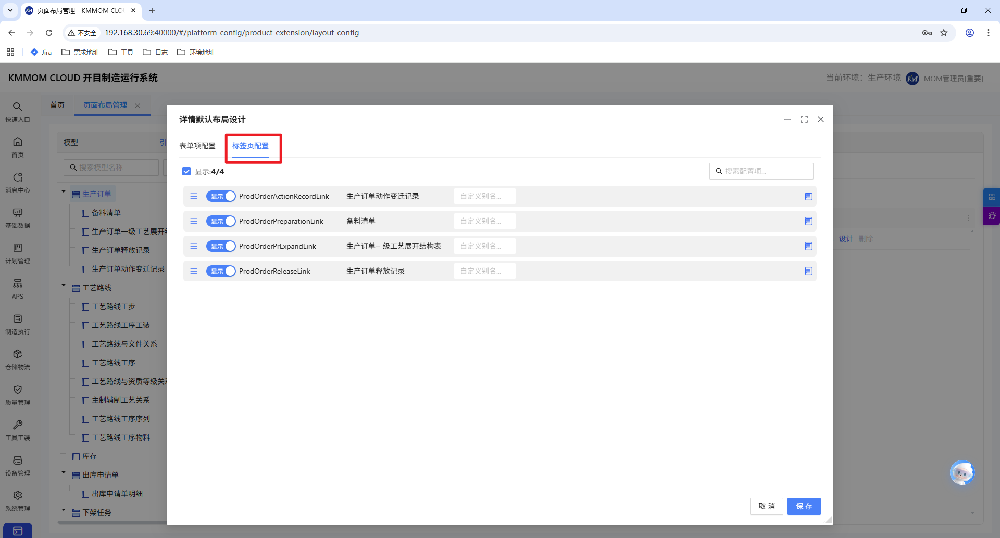

_详情布局 - 标签页配置界面_

适用场景包括：

- 控制二开扩展的关系表在详情页中是否展示。
- 按业务需要隐藏或显示对应关系表。
- 减少详情页中不必要的关联信息干扰。

说明：

- 配置对象是当前详情模型下挂接的关系表。
- 系统预定义的标签页不受此处控制。
- 仅二开扩展的关系表受布局配置影响。

配置保存后，详情页会按当前布局设置决定对应关系表是否显示。

---

### 3.5 新增表单配置

新增表单布局用于新增业务数据时的默认录入界面。进入 **新增表单** 类型布局后，点击 **设计**，可进入新增表单默认布局设计器。

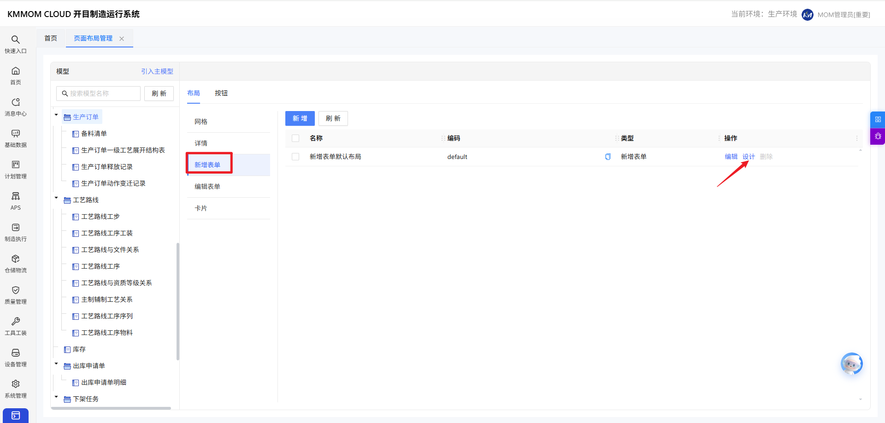

新增配置提供 **表单项配置** 页签。

#### 3.5.1 表单项配置

新增表单的表单项配置主要用于控制字段录入时的展示和校验规则，支持的常见配置包括：

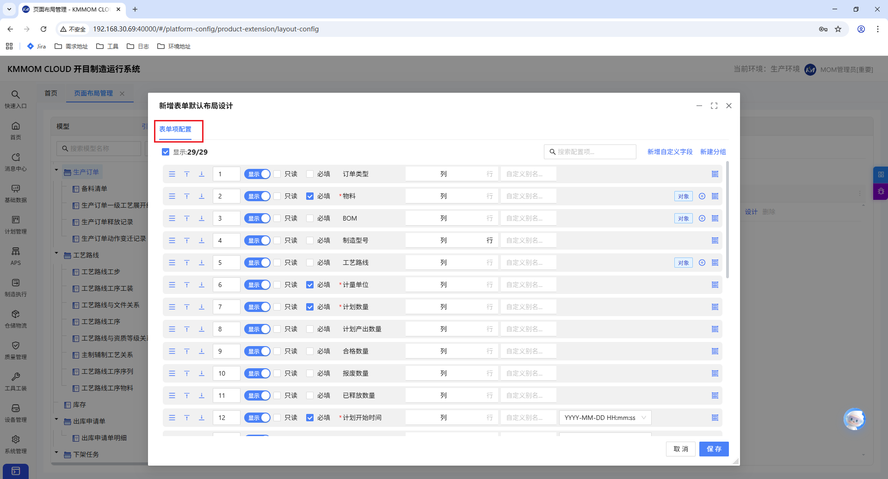

_新增表单 - 表单项配置界面_

1. 调整字段顺序。
2. 控制字段是否显示。
3. 配置字段是否只读。
4. 配置字段是否必填。
5. 配置字段所在列和行位置。
6. 配置自定义别名。
7. 配置引用属性显示。
8. 配置时间字段显示格式。
9. 支持新增自定义字段。
10. 支持新建分组，便于按业务模块组织录入项。

新增表单建议重点关注必填项、录入顺序和分组结构，使录入过程更符合业务操作习惯。

---

### 3.6 编辑表单配置

编辑表单布局用于修改现有业务数据时的默认录入界面。进入 **编辑表单** 类型布局后，点击 **设计**，可进入编辑表单默认布局设计器。

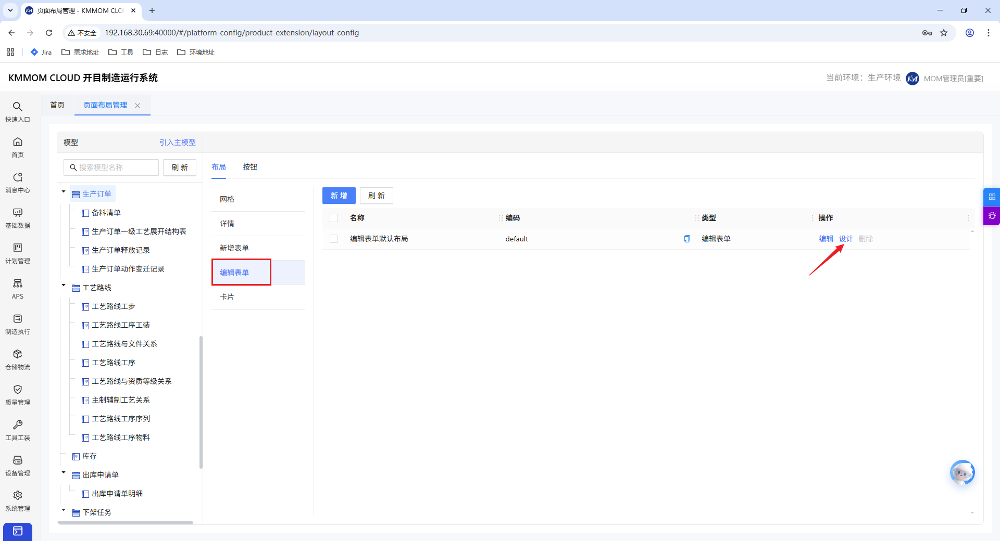

编辑配置同样提供 **表单项配置** 页签。

#### 3.6.1 表单项配置

编辑表单的表单项配置与新增表单配置方式基本一致，常用于控制：


1. 字段显示顺序。
2. 字段是否显示。
3. 字段是否只读。
4. 字段是否必填。
5. 字段所在列和行位置。
6. 自定义别名。
7. 引用属性显示。
8. 时间字段显示格式。
9. 自定义字段扩展。
10. 分组结构维护。

在编辑表单中，建议重点区分“允许修改”的字段和“仅展示不可修改”的字段，以避免关键数据被误改。

---

### 3.7 卡片配置

卡片布局用于以卡片方式展示业务数据。进入 **卡片** 类型布局后，点击 **设计**，可进入卡片默认布局设计器。

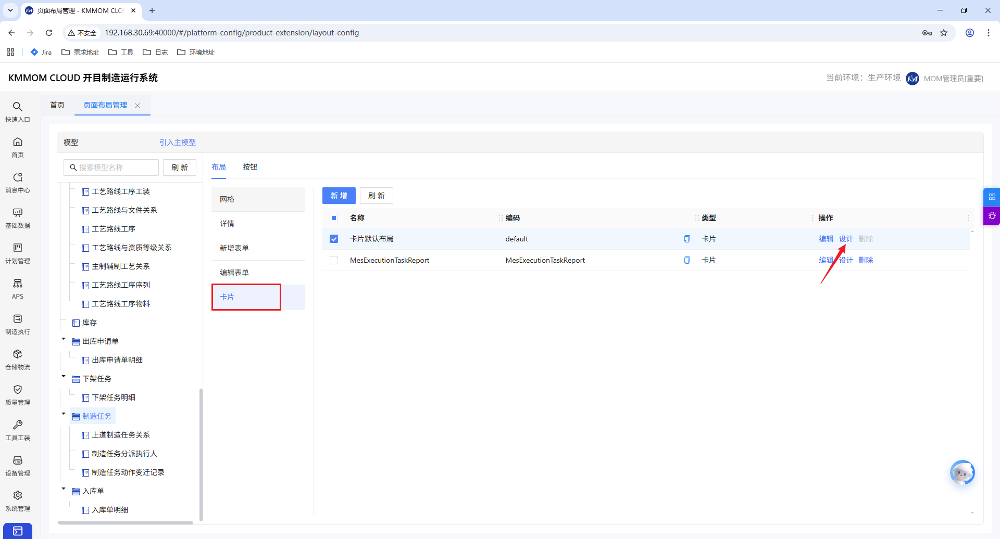

卡片布局提供以下两个页签：

- 卡片配置
- 筛选条件配置

#### 3.7.1 卡片配置

卡片配置用于维护卡片中字段的展示顺序、展示内容和显示属性。

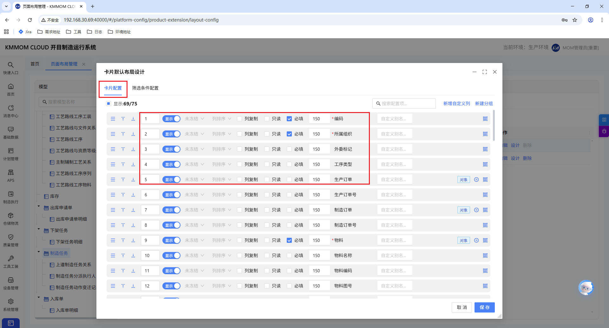

卡片布局的常见配置能力包括：字段顺序、字段是否显示、是否显示字段名、自定义别名、时间字段的显示格式、支持分组显示字段信息、筛选条件配置等。

其中，**卡片配置** 页签主要支持以下内容：

1. 调整字段顺序。
2. 控制字段是否显示。
3. 控制是否显示字段名。
4. 配置自定义别名。
5. 配置时间字段显示格式。
6. 通过分组方式展示字段信息。
7. 支持按卡片展示需求组织字段内容。

##### 1. 工作台卡片的适用范围

工作台卡片可按业务模型分别维护，当前常见场景如下：

- **制造任务模型**
  - 班组派工
  - 工序任务报工
  - 完工任务
- **检验任务模型**
  - 检验任务报工
  - 完工检验任务
- **异常任务模型**
  - 生产异常

##### 2. 制造任务模型的统一配置方法

对于 **班组派工**、**工序任务报工**、**完工任务** 三个页面，如果希望共用同一套卡片展示规则，可直接在：

`制造任务 -> 卡片 -> 卡片默认布局`

中完成配置。

默认布局编码为：

`default`

在未单独绑定页面专用卡片布局时，这三个页面将默认读取该布局。

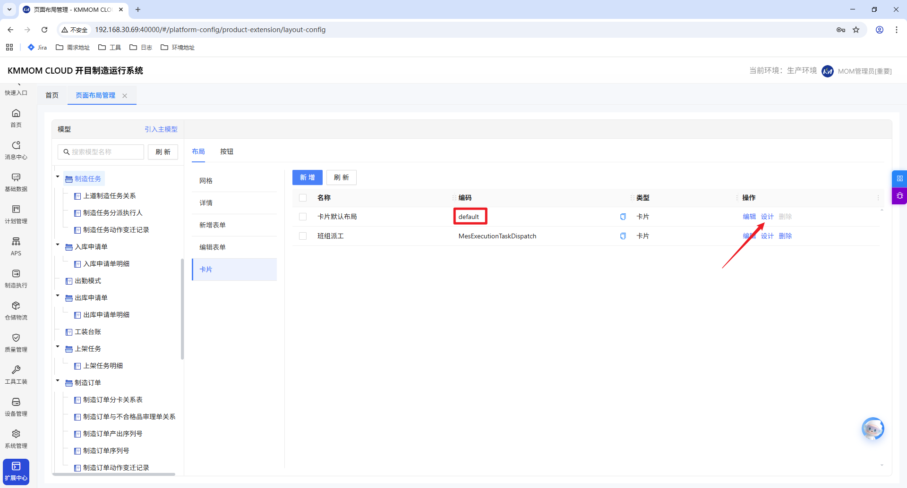

##### 3. 制造任务模型的差异化配置方法

如果 **班组派工**、**工序任务报工**、**完工任务** 的展示内容需要区分，则不要继续只维护 `default`，而应新增页面专用布局。

操作方法如下：

1. 在 **制造任务 -> 卡片** 下点击 **新增**。
2. 在新增窗口中将布局绑定方式选择为 **页面**。
3. 选择对应页面，例如 **班组派工**、**工序任务报工** 或 **完工任务**。
4. 录入布局编码、名称并保存。
5. 对新增布局点击 **设计**，进入卡片配置与筛选条件配置界面。

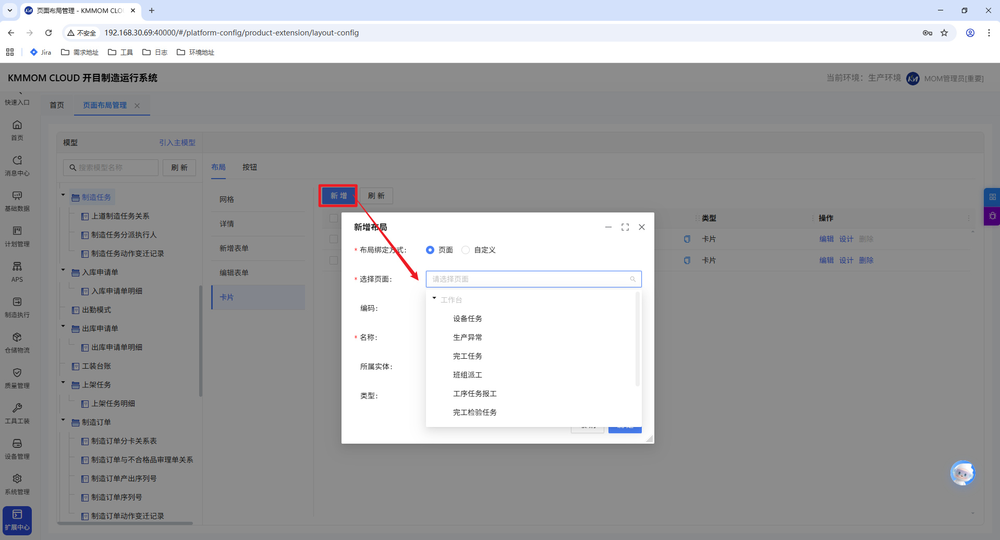

##### 4. 检验任务模型的统一配置方法

对于 **检验任务报工**、**完工检验任务** 两个页面，如果希望共用同一套卡片展示规则，可直接在：

`检验任务 -> 卡片 -> 卡片默认布局`

中完成配置。

默认布局编码同样为：

`default`

在未单独绑定页面专用卡片布局时，这两个页面将默认读取该布局。

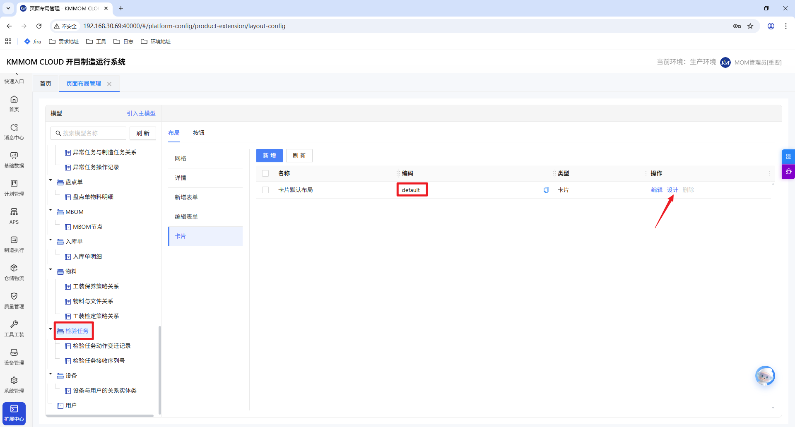

##### 5. 检验任务模型的差异化配置方法

如果 **检验任务报工**、**完工检验任务** 的展示内容需要区分，则应在 **检验任务 -> 卡片** 下新增页面专用布局。

操作方法与制造任务模型一致：

1. 在 **检验任务 -> 卡片** 下点击 **新增**。
2. 在新增窗口中将布局绑定方式选择为 **页面**。
3. 选择对应页面，例如 **检验任务报工** 或 **完工检验任务**。
4. 录入布局编码、名称并保存。
5. 对新增布局点击 **设计**，进入卡片配置与筛选条件配置界面。

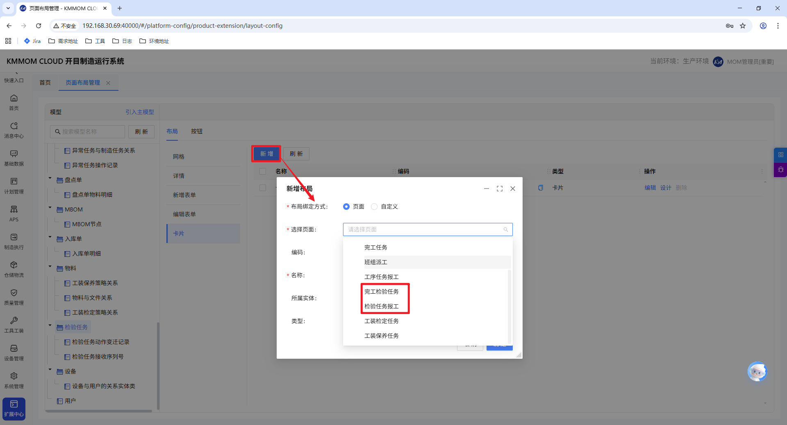

##### 6. 异常任务模型的配置方法

**生产异常** 页面的卡片布局在 **异常任务模型** 下维护。

实施时，可在：

`异常任务 -> 卡片`

下配置对应的服务端布局。

如果仅维护统一布局，可直接维护该模型下的默认卡片布局；如后续页面场景需要区分，也可按页面新增专用布局。

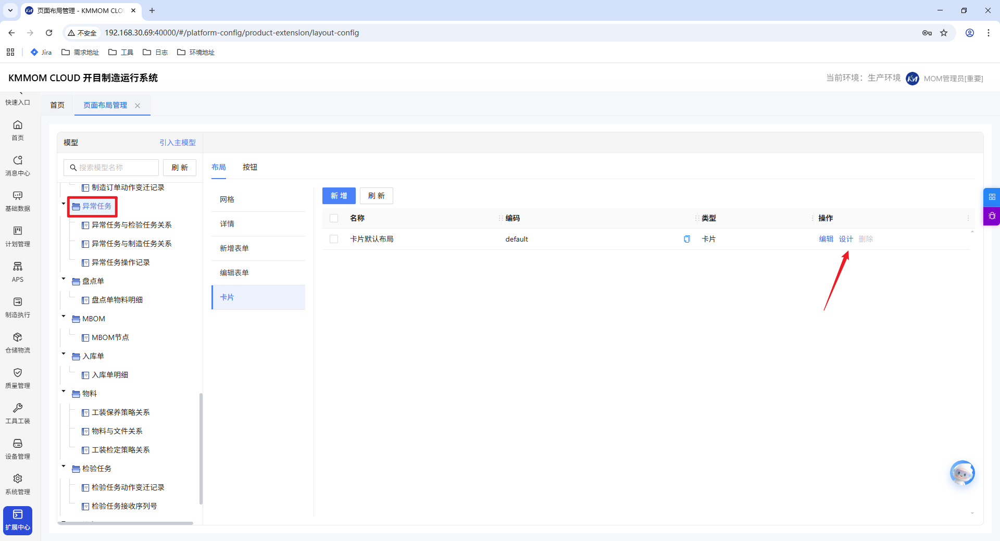

##### 7. 使用建议

- `default` 适合作为统一基线。
- 页面专用布局适合作为局部差异化覆盖。
- 当页面已绑定专用布局时，优先使用专用布局；未绑定时，回退使用 `default`。
- 先按模型区分配置入口，再判断是否需要做页面级差异化。

##### 8. 卡片配置控制范围

卡片配置主要控制 **卡片正文区域** 的字段展示，不负责以下内容：

- 卡片顶部的主标题、状态标签、角标
- 卡片底部的固定业务按钮
- 页面级操作按钮

这些内容通常由页面功能本身控制，不在卡片布局配置范围内。

##### 9. 未分组场景的显示规则

不使用分组时，系统按 **已开启显示的字段顺序** 展示卡片正文属性。

工作台卡片使用时，需要特别注意以下规则：

- 工作台卡片正文最多只显示前 `5` 个属性。
- 若显示字段超过 `5` 个，超出部分不会在卡片正文中展示。
- 因此应将最重要的字段排在最前面。

推荐做法：

1. 先关闭不需要展示的字段。
2. 再把核心字段排在前 `5` 位。
3. 优先保留现场最关注的字段，例如组织、工艺路线、物料、数量、时间等。

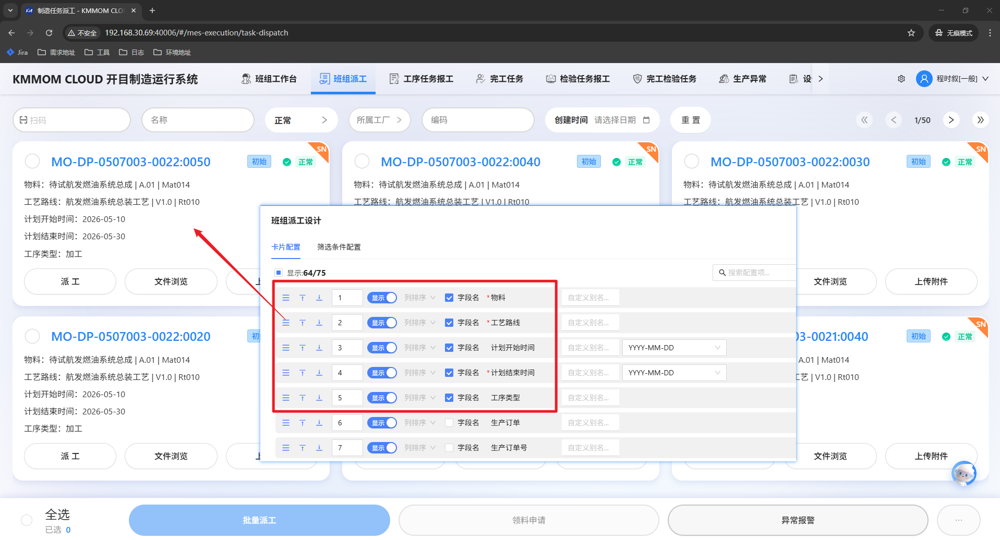

##### 10. 分组场景的显示规则

如果希望在一行中显示多个字段，或希望将卡片内容按业务语义拆成多行，建议使用 **分组**。

分组后的展示逻辑如下：

1. 每个分组对应卡片中的一行展示区域。
2. 组内字段按顺序从左到右拼接显示。
3. 可分别调整分组顺序和组内字段顺序。
4. 建议将最重要的分组排在前面。

典型适用场景：

- **工序任务报工** 页面中，将数量类指标放在同一组
- 将物料信息单独作为一组
- 将计划开始时间、计划结束时间放在同一组

实施建议：

- 工作台卡片建议控制在 `3-5` 个分组内，避免卡片内容过高。
- 数量类、进度类字段适合分组展示。
- 长文本字段不建议放入核心分组，避免挤占卡片空间。

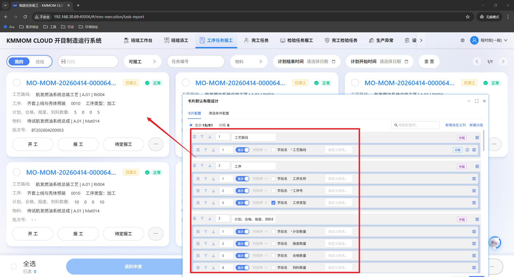

##### 11. 推荐配置方法

建议按以下顺序维护工作台卡片：

1. 先确定卡片要展示的业务信息。
2. 关闭无须展示的字段。
3. 调整核心字段顺序。
4. 如信息较多，再使用分组压缩展示。
5. 最后统一优化别名和时间格式。

#### 3.7.2 筛选条件配置

卡片布局中的 **筛选条件配置**，用于维护工作台页面顶部的查询区域。

典型筛选项包括：

- 任务编号/编码
- 物料
- 状态
- 计划时间
- 创建时间

配置能力与网格筛选条件类似，主要包括：

1. 调整筛选项顺序。
2. 控制筛选项是否显示。
3. 配置默认值或默认条件。
4. 配置是否只读。
5. 配置自定义别名。

实施建议：

- 常用筛选项放在前面。
- 低频筛选项可隐藏。
- 有固定查询习惯的场景可配置默认值。
- 工作台顶部筛选区不宜过满，建议优先保留高频查询条件。

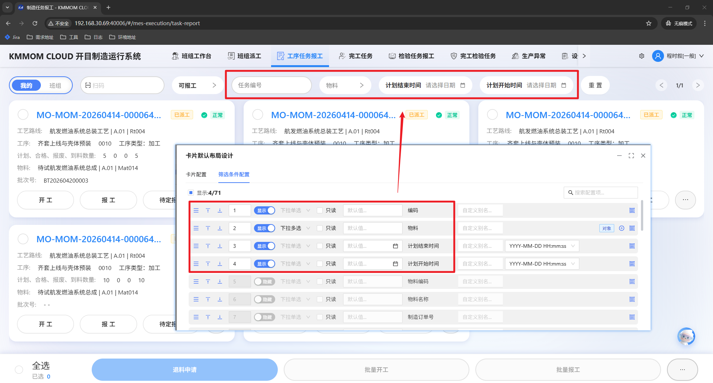

---

### 3.8 保存与生效

完成布局设计后，点击页面右下角 **保存**，系统将保存当前配置。

保存成功后，系统会提示 **“保存成功”**。进入对应的数据模型页面时，系统将自动加载已保存的布局配置。

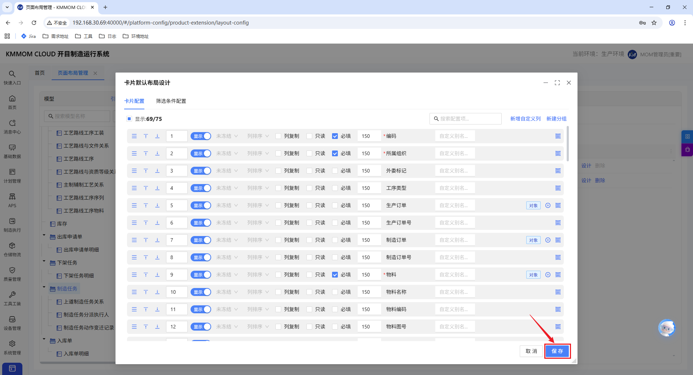

- 若当前登录用户未配置客户端布局，则默认显示服务端布局配置。
- 若当前登录用户已配置客户端布局，则优先显示客户端布局配置。

建议每完成一类配置后及时保存，避免调整丢失。

---

## 4. 客户端布局配置指南

> **适用角色**：所有系统用户  
> **功能入口**：各功能页面右上角的 **【设置】** 图标

客户端布局用于满足最终用户的个性化使用需求。用户所做的客户端布局配置仅对本人生效，除非主动将方案分享给其他用户或组织。

客户端布局是用户提升个人工作效率的重要工具。在服务端已定义标准布局的前提下，用户可以根据自身业务关注点和使用习惯，对表格、筛选条件和表单项进行个性化调整。

### 4.1 个性化配置操作手册

#### 4.1.1 打造专属表格（网格配置）

在任何包含数据表格的业务页面中，点击右上角 **【设置】->【表格配置】**，即可进入客户端网格配置界面。

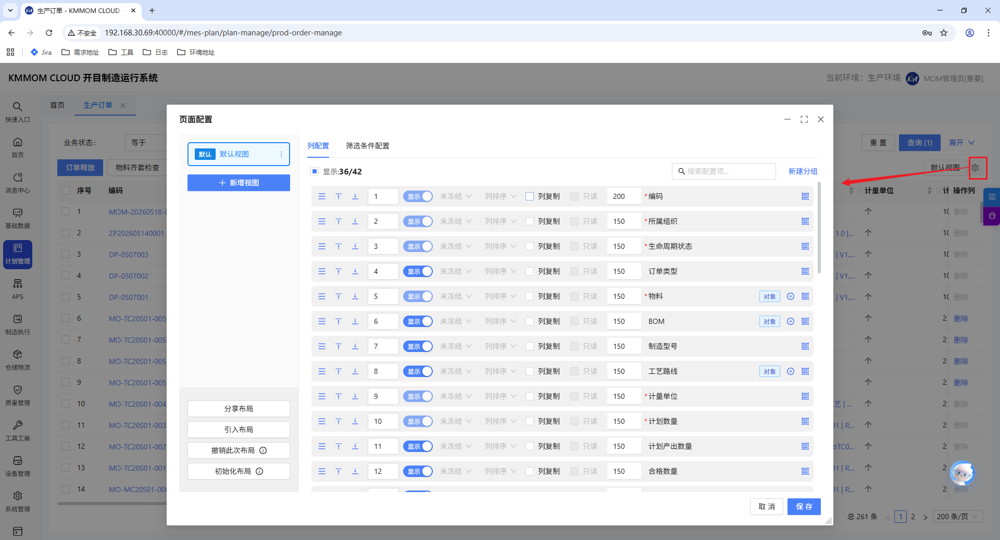

_客户端页面右上角“设置”入口及表格配置弹窗_

用户可进行以下操作：

1. **精简列展示**
   取消勾选不常用字段，减少界面干扰，使页面聚焦于当前工作需要关注的数据。
2. **调整列顺序**
   通过拖拽字段左侧的拖动图标，调整列的先后顺序，将最重要的列放在更靠前的位置。
3. **冻结关键列**
   对单号、状态、名称等关键字段设置冻结，避免横向滚动时丢失上下文信息。
4. **保存为个人视图**
   当不同业务场景关注的列不同时，用户可将当前配置保存为新的个人视图，后续可按场景快速切换。

适用示例：

- 待处理单据视图：重点保留单号、状态、创建时间、责任人。
- 异常处理视图：重点保留异常状态、异常原因、处理进度。

#### 4.1.2 优化查询效率（筛选配置）

在 **【设置】->【筛选配置】** 中，用户可对查询区域进行个性化设置。

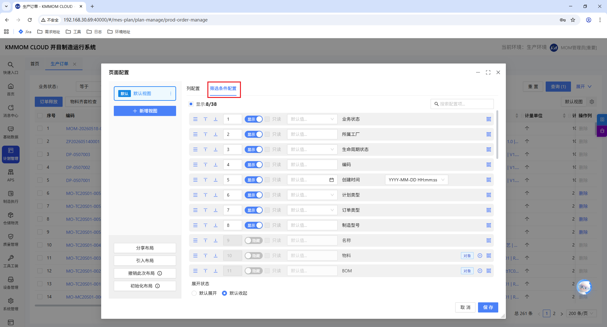

_客户端筛选配置界面_

支持的典型操作包括：

1. **设置默认查询条件**
   例如将“工厂”“车间”“状态”等设置为常用默认值，页面打开后即可直接查询。
2. **调整筛选字段顺序**
   将最常用的筛选项放在靠前位置，减少频繁展开更多条件的操作成本。
3. **调整查询操作习惯**
   根据个人使用习惯选择更适合的筛选方式，例如更偏向模糊搜索或精确搜索。

适用示例：

- 班组长可默认查询本车间、进行中的任务。
- 计划员可默认查询本周计划、未完成单据。

#### 4.1.3 优化表单录入体验（新增/编辑表单配置）

在新增或编辑业务数据时，点击表单右上角 **【设置】**，即可进入客户端表单配置界面。

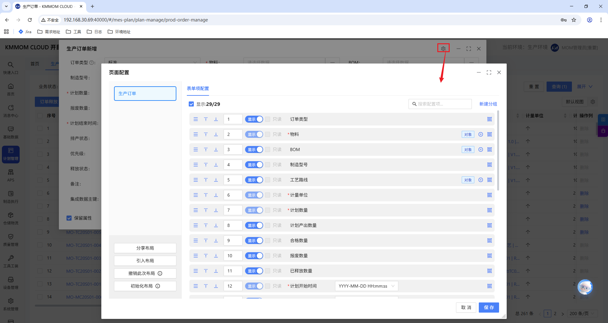

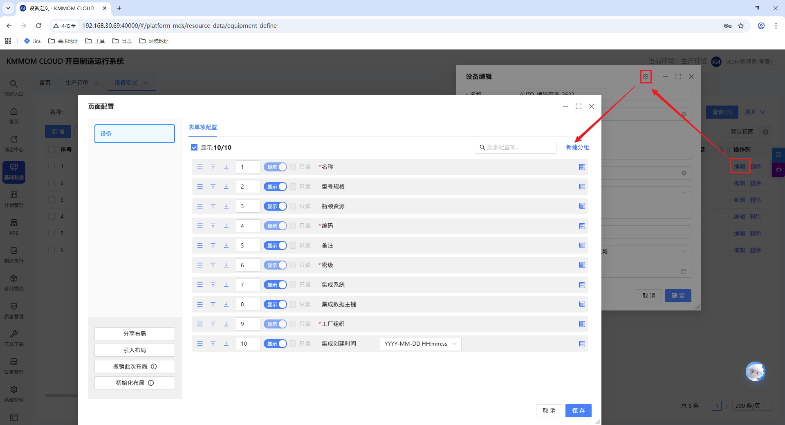

_客户端新增/编辑表单设置入口与配置弹窗_

用户可根据个人录入习惯进行以下调整：

1. **隐藏干扰项**
   将不常用、非关键或临时无关注需求的字段隐藏，减少录入时的视觉负担。
2. **调整字段顺序**
   使字段顺序更贴合纸质单据、业务流程或个人录入习惯，提升连续录入效率。
3. **保留核心字段**
   将高频录入字段放在页面更靠前位置，减少来回查找。

这类配置尤其适合高频录单、快速报工、异常提报等场景。

### 4.2 方案管理与分享

客户端布局支持个人方案沉淀与共享，便于团队复制高效操作习惯。

#### 4.2.1 分享方案

当用户已经配置出适合某类业务场景的布局方案后，可通过分享能力将方案提供给其他人员使用。

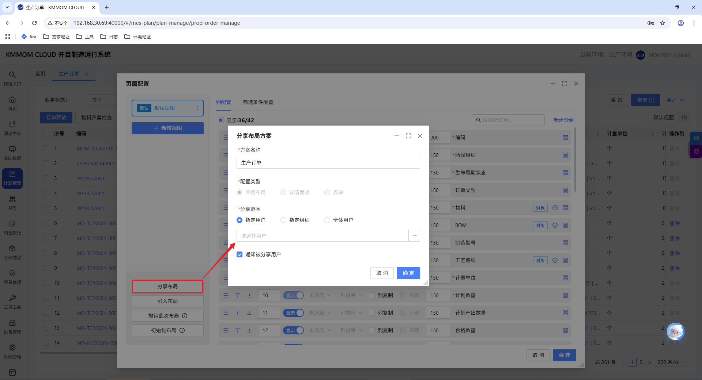

_方案分享界面_

常见分享对象包括：

- 指定用户
- 指定部门
- 指定角色

分享后，被分享者可直接应用该布局方案，减少重复配置工作。

#### 4.2.2 撤销此次布局

当用户希望清空当前正在编辑的此次布局配置时，可在布局方案菜单中点击 **撤销此次布局**。该操作会清空当前此次布局的配置内容，需在点击 **保存** 后才会正式生效。

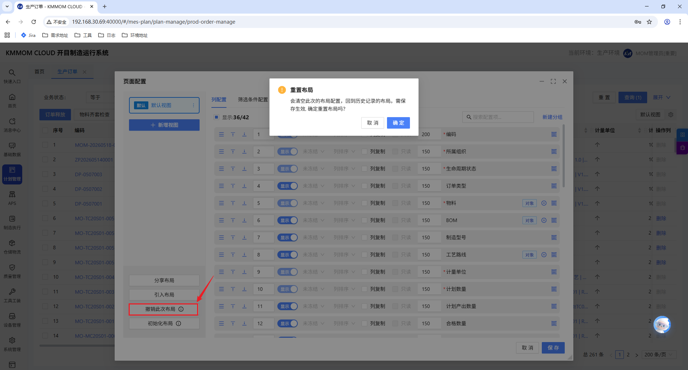

_撤销此次布局操作入口_

该操作适用于以下场景：

- 当前此次布局调整结果不符合预期，需要重新配置。
- 本次修改过程中误删、误调了较多字段，希望直接清空本次布局配置。
- 需要放弃当前布局方案内容，并重新按新的展示思路配置。

与 **初始化布局** 的区别是：

- **撤销此次布局**：清空当前此次布局配置，保存后生效。
- **初始化布局**：清除客户端个性化覆盖，重新加载服务端布局。

#### 4.2.3 初始化布局

当需要显示服务端布局时，用户可进入对应的**客户端布局页面**，点击 **初始化布局** 按钮。


_客户端布局页面中的“初始化布局”按钮_

初始化后，系统将清除当前客户端布局的个性化覆盖，并重新加载服务端布局作为当前展示内容。

该操作通常用于以下场景：

- 需要临时查看服务端标准布局。
- 客户端布局与当前业务场景不匹配，需要切回系统标准布局。
- 希望以服务端布局为基础重新配置个人布局。

---

## 5. 服务端与客户端的边界

| 维度 | 服务端布局 | 客户端布局 |
| :--- | :--- | :--- |
| 配置角色 | 管理员、实施顾问 | 最终用户 |
| 配置目标 | 定义标准布局和字段规则 | 定义个人显示偏好 |
| 影响范围 | 面向系统标准或统一配置范围 | 仅对个人生效 |
| 配置重点 | 布局结构、列属性、筛选项、样式规则 | 列顺序、显示偏好、个人筛选习惯 |
| 优先级 | 服务端定义可用边界 | 若已配置，则客户端优先覆盖服务端显示 |

---

## 6. 注意事项

1. 引入主模型后，系统会自动引入关系实体并生成默认布局，无需逐个手工创建。
2. 网格、详情、新增表单、编辑表单、卡片均为系统自动生成的默认布局，后续可按需设计。
3. 网格配置包含列配置、筛选条件配置和网格样式配置，应按展示、查询和样式三个层面分别维护。
4. 详情配置包含表单项配置和标签页配置，其中标签页配置用于控制关系表是否显示，不用于控制系统预定义标签页。
5. 新增表单和编辑表单均以表单项配置为主，建议重点维护字段顺序、必填和只读规则。
6. 卡片布局包含卡片配置和筛选条件配置，适合工作台类和聚合展示类场景；其中 **班组派工**、**工序任务报工**、**完工任务** 可统一维护在 `制造任务 -> 卡片 -> 卡片默认布局(default)`，**检验任务报工**、**完工检验任务** 可统一维护在 `检验任务 -> 卡片 -> 卡片默认布局(default)`，**生产异常** 可在 `异常任务 -> 卡片` 下维护服务端布局；如需差异化展示可新增页面专用布局；未分组时，工作台卡片正文最多显示前 5 个属性。
7. 调整字段顺序、筛选条件或样式配置后，应及时保存。
8. 保存成功后，进入对应数据模型页面会自动加载配置内容，若存在客户端布局则优先显示客户端布局。
9. 如需显示服务端布局，可进入客户端布局页面点击 **初始化布局**。
10. 时间字段建议结合业务场景选择展示到日期或展示到秒。
11. 字段较多时，建议结合显示控制、冻结、分组、别名以及关系表显示控制优化页面可读性。

通过灵活使用自定义布局配置能力，可以在统一业务标准的基础上，更高效地完成页面交付和业务适配。
