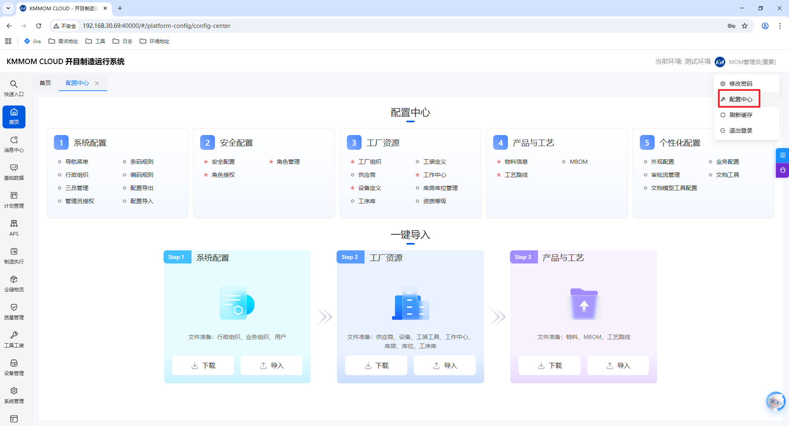

# 配置中心

## 1. 功能概述
配置中心是面向超级管理员的集中配置入口，用于按业务分类完成系统初始化与持续维护。页面采用卡片化分组，支持按推荐顺序逐项配置，并提供“下载模板 + 导入数据”的一键导入能力。

配置顺序建议如下：
1. 系统配置
2. 安全配置（★ 必选）
3. 工厂资源（★ 必选）
4. 产品与工艺
5. 个性化配置

## 2. 入口与权限

### 2.1 进入方式
1. 管理员登录系统后，点击右上角名称下拉菜单。
2. 选择 **配置中心** 进入页面。

### 2.2 访问权限
- 仅超级管理员可进入配置中心并执行配置导入。

## 3. 页面结构说明

### 3.1 五大配置分类

| 分类 | 配置项 |
| --- | --- |
| 1. 系统配置 | 导航菜单、行政组织、三员管理、管理员授权、条码规则、编码规则、配置导出、配置导入 |
| 2. 安全配置（★） | 安全配置、角色授权、角色管理 |
| 3. 工厂资源（★） | 工厂组织、供应商、设备定义、工序库、工装定义、工作中心、库房库位管理、资源等级 |
| 4. 产品与工艺 | 物料信息、工艺路线、MBOM |
| 5. 个性化配置 | 外观配置、审批流管理、文档模型工具配置、业务配置、文档工具 |

### 3.2 一键导入区域
页面下方提供分阶段导入能力，每个阶段均包含 **下载** 与 **导入** 两个按钮：

1. `Step 1 系统配置`：文件准备包括行政组织、业务组织、用户。
2. `Step 2 工厂资源`：文件准备包括供应商、设备、工装工具、工作中心、库房、库位、工序库。
3. `Step 3 产品与工艺`：文件准备包括物料、MBOM、工艺路线。

## 4. 操作指南

### 4.1 按分类逐项配置
1. 进入配置中心后，先完成带 `★` 的必选分类：**安全配置**、**工厂资源**。
2. 按“系统配置 → 安全配置 → 工厂资源 → 产品与工艺 → 个性化配置”的顺序进入各模块。
3. 在各模块内完成新增、编辑、启停、授权等业务操作并保存。
4. 完成每一类后返回配置中心，继续下一类，直至全部完成。

### 4.2 一键导入（推荐用于初始化）
1. 在对应 `Step` 卡片点击 **下载**，获取导入模板。
2. 按模板要求准备数据，确保字段完整、编码唯一、引用关系正确。
3. 点击 **导入**，上传模板文件并执行导入。
4. 导入成功后进入对应功能页抽样校验关键数据（如组织、资源、物料、MBOM、工艺路线）。
5. 若导入失败，按系统返回信息修正数据后重新导入。

### 4.3 配置导出与配置导入
1. 在“系统配置”分类中可使用 **配置导出** 导出当前配置数据。
2. 需要跨环境迁移时，先在源环境导出，再在目标环境通过 **配置导入** 执行导入。
3. 导入前确认目标环境基础数据与版本一致，避免覆盖或关联失败。

## 5. 推荐实施流程
1. 管理员账号与权限确认。
2. 完成“系统配置”基础项（组织、账号、编码/条码规则）。
3. 完成“安全配置（★）”与“工厂资源（★）”。
4. 完成“产品与工艺”主数据。
5. 完成“个性化配置”与业务侧工具配置。
6. 全量回归验证后正式启用。

## 6. 注意事项
- `★` 标识分类为上线前必配项，未完成不建议进入生产使用。
- 存在前后依赖关系：组织/用户应先于角色授权，资源主数据应先于产品工艺数据。
- 使用一键导入时，建议先在测试环境验证模板与数据质量，再执行生产导入。
- 发生大批量配置变更后，建议执行一次缓存刷新并通知相关用户重新登录。
