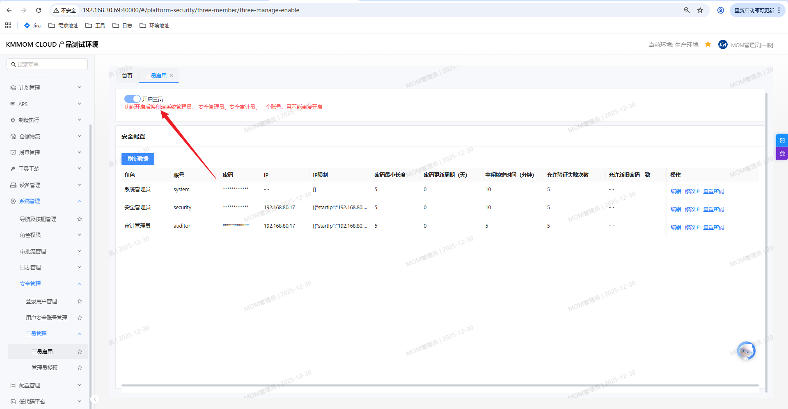
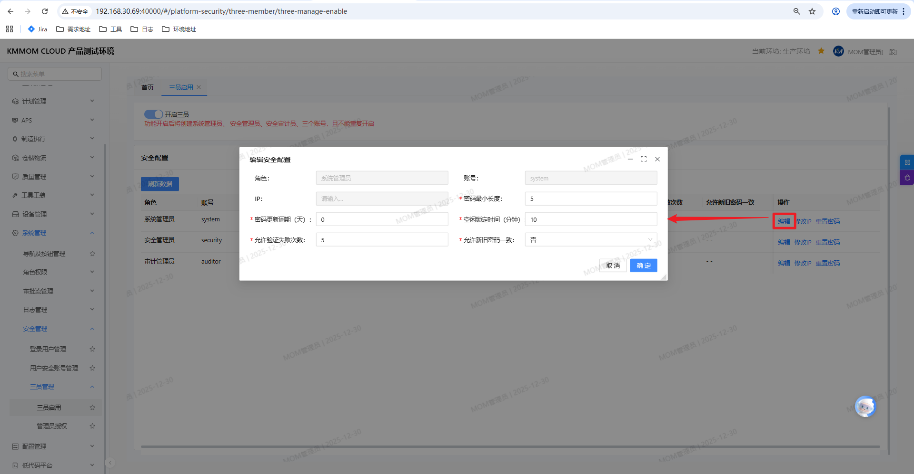
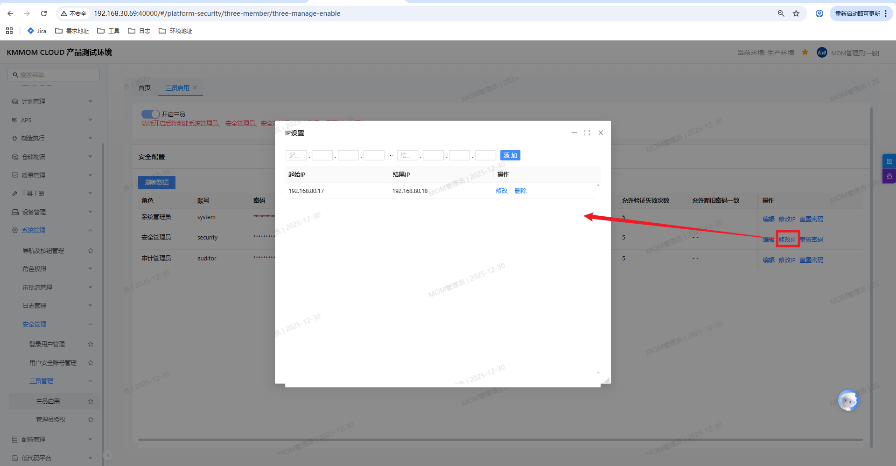
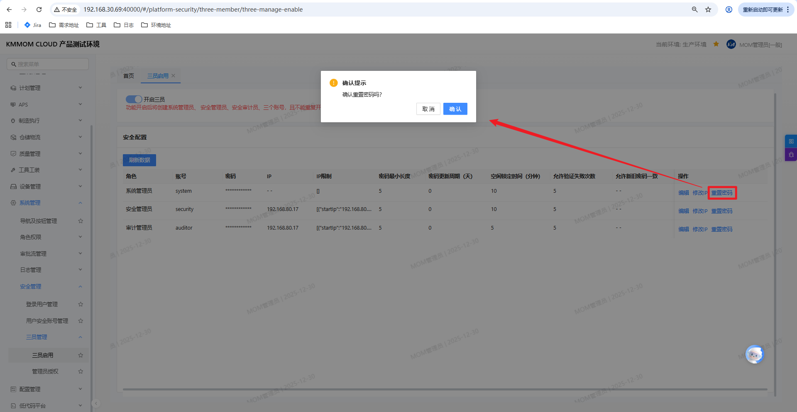
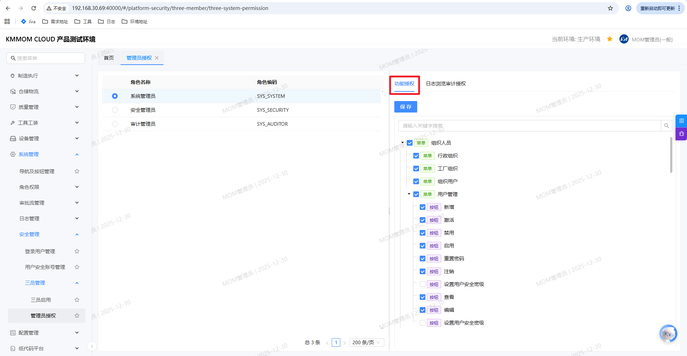
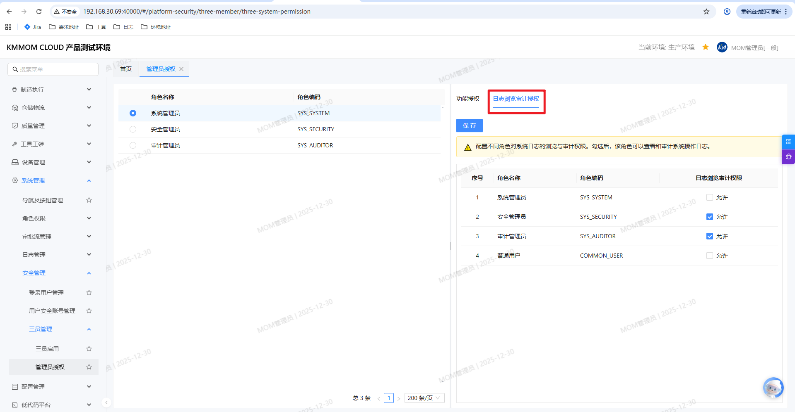

# 三员管理

## 1. 功能概述
三员管理是系统为了满足高安全级别需求而设计的权限分离机制。通过“三员”分立（系统管理员、安全管理员、审计管理员），实现权限的相互制约与监督，确保系统运行的安全性和合规性。

## 2. 三员启用

### 2.1 启用三员
在“三员管理 > 三员启用”界面，用户可以开启三员功能。

*   **功能说明**：开启后，系统将自动创建三个专用账号：
    *   **系统管理员** (System Administrator)
    *   **安全管理员** (Security Administrator)
    *   **审计管理员** (Audit Administrator)
*   **操作步骤**：点击界面上的“开启三员”开关。
*   **约束条件**：
    *   该功能只能开启一次，不可重复开启。
    *   功能一旦开启，不支持关闭。

### 2.2 安全配置
开启三员功能后，系统会自动生成三员账号列表。为了保障系统安全，建议立即对这些高权限账号进行详细的安全策略配置。

#### 2.2.1 列表信息
在安全配置列表中，可以查看每个三员角色的当前状态和配置信息：
*   **角色与账号**：显示系统预置的三个角色（系统管理员、安全管理员、审计管理员）及其对应账号（system, security, auditor）。
*   **当前策略**：展示当前的IP限制、密码长度要求、更新周期、锁定时间等安全参数。

#### 2.2.2 编辑安全配置
点击列表右侧的“编辑”按钮，可对指定角色的安全策略进行个性化设置。配置项详细说明如下：

*   **基本信息**：
    *   **角色/账号**：系统预置，不可修改。
    *   **IP**：设置允许登录该账号的IP地址。为空表示不限制IP，支持输入特定IP以增强安全性。
*   **密码安全策略**：
    *   **密码最小长度**：设置账号密码的最少字符数（如 5 位）。
    *   **密码更新周期（天）**：设置密码强制定期修改的间隔天数。设置为 0 表示不强制更新。
    *   **允许新旧密码一致**：设置修改密码时，新密码是否允许与旧密码相同（是/否）。为了安全起见，通常建议选择“否”。
*   **登录安全策略**：
    *   **空闲锁定时间（分钟）**：登录后无操作超过指定时间，系统自动锁定或登出，防止账号被他人盗用。
    *   **允许验证失败次数**：连续登录失败超过该次数后，账号将被暂时锁定，以防止暴力破解。

#### 2.2.3 其他操作
*   **修改IP**：快捷修改允许登录的IP地址，无需进入完整编辑页面。

*   **重置密码**：当管理员忘记密码或账号存在安全风险时，可在此进行密码重置操作。

## 3. 管理员授权

### 3.1 功能授权
在“三员管理 > 管理员授权”界面的“功能授权”标签页，可以管理三员角色的菜单和按钮权限。

*   **自动授权**：开启三员功能时，系统会自动创建对应的三员角色，并根据预设规则自动授予相应的菜单和按钮权限。
*   **手动修改**：管理员可以在此界面手动调整各角色的权限范围。在左侧角色列表中选择角色，在右侧功能树中勾选或取消勾选相应的菜单和按钮，最后点击“保存”生效。

### 3.2 日志浏览审计授权
在“三员管理 > 管理员授权”界面的“日志浏览审计授权”标签页，配置各角色对系统日志的查看和审计权限。

*   **授权对象**：支持对系统管理员、安全管理员、审计管理员及普通用户进行授权。
*   **权限说明**：配置不同角色对系统日志的浏览与审计权限。勾选“允许”后，该角色可以查看和审计系统操作日志。
*   **操作步骤**：在列表中找到目标角色，勾选“日志浏览审计授权”列的复选框，点击“保存”按钮。

## 4. 注意事项
1.  **不可逆操作**：三员功能一旦开启无法关闭，请在操作前确认业务需求。
2.  **账号管理**：三员账号由系统自动生成，具有特殊性，请妥善保管账号密码。
3.  **权限制衡**：建议严格遵循三员管理规范，保持各角色权限的独立和制衡，避免赋予单一角色过大的权限。
