# 工厂数据

## 功能概述
工厂数据模块用于维护离散型制造企业的生产组织主数据，覆盖**行政组织**、**工厂组织**、**用户管理**，以及用于计划与排班的**工作日历**与**出勤模式**配置。模块统一支撑组织归属、权限分配与生产业务（计划排程、排班、报工、质检、仓储、统计分析）所需的基础数据，支持层级结构（公司/工厂/车间/班组）与批量维护；其中，**工作日历**用于定义工厂/车间的可工作时间、班次与节假日，**出勤模式**用于设定人员/设备的出勤规则，为资源负荷与计划排程提供约束数据。整体确保各业务域主数据的一致性与可追溯性。

## 核心功能
1. **行政组织**：
   - 支持组织层级（公司/工厂/车间/班组）维护的**查询/新增/编辑/删除**；
   - 支持批量**导入**行政与工厂组织。
2. **工厂组织**：支持工厂对象的**查询/新增/编辑/删除**，层级展示各组织间父子关系。
3. **用户管理**：
   - 联动组织树维护账号与组织关系，支持**查询/新增/查看/编辑/删除/组织变动/激活/禁用/启用/重置密码/注销/设置用户安全密级**；
   - 支持与人员对象的关联，满足数据访问控制与操作审计。
4. **工作日历**：
   - 定义工厂/资源（设备）维度的**可工作时间、班次、节假日/停产日**；
   - 支持工厂日历的**编辑/删除/出勤设置**，与计划排程、资源负荷计算联动；
   - 提供生效范围与冲突校验，保障排程与报工时间约束一致。
5. **出勤模式**：
   - 设定工厂组织的**出勤模式**（轮班、班次节奏、休息日），并支持**查询/新增/编辑/导入/导出**；
   - 与**工作日历**关联套用到组织或班组；支持批量应用与有效期管理；
   - 为计划排程、派工与报工提供可用性约束与一致性校验。

## 操作指南

### 1. 行政组织
#### 1.1. 进入页面
1. 在左侧导航选择 **主数据管理 > 工厂数据 > 行政组织**。
   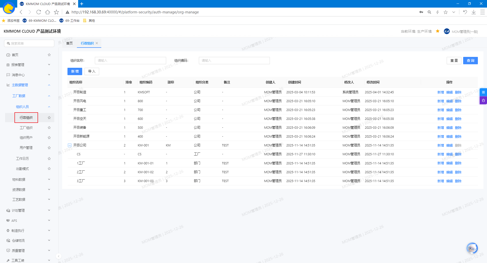

####  1.2. 增、删、改、查
1. 通过顶部的 **查询** 功能筛选出目标组织。
2. 点击 **新增** 创建新组织，可根据实际情况填写**上级组织**、**排序**、**组织分类**建立不同组织间的层级关系。
   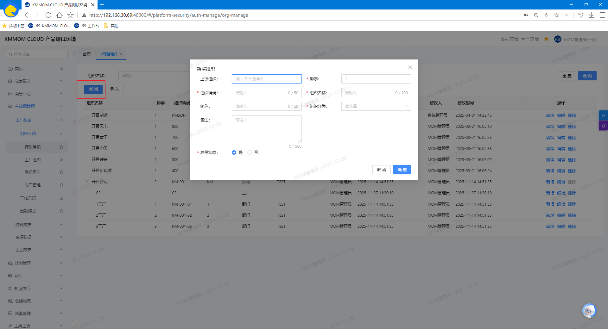
3. 点击 **编辑** 修改组织信息，可控制是否启用该组织。
4. 点击 **删除** 移除组织。

#### 1.3. 导入（批量维护）
1. 点击 **导入**，根据页面提示下载模板。
2. 按模板要求填写需要导入的信息，包含 **行政组织**、**业务组织**、**用户** sheet页。
3. 导入后可在**行政组织**、**工厂组织**、**用户管理**页面中查看。
   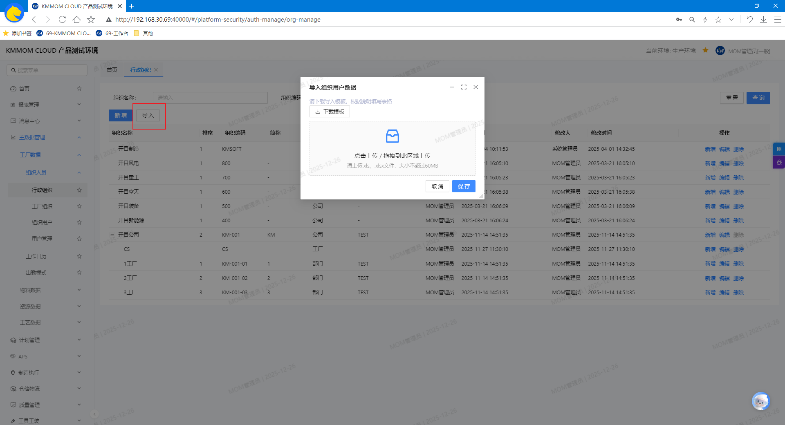

> **注意：**
> - 导入前确认sheet页数据正确，且关联正确
> - 无父组织编码则视为根组织
> - 导入的数据在同一父组织节点下，依据序号排序

#### 1.4. 注意事项
- **编码**需保持唯一。
- 删除前请确认该组织未被**工厂组织**引用，无子节点组织；否则无法删除。
- 批量导入时请严格遵守模板字段与格式（日期、编码、分类、工厂等），确认数据间关联正确，避免导入失败。
- 为保证列表展示与检索体验，建议合理维护**排序**与**简称**。

### 2. 工厂组织
#### 2.1. 进入页面
1. 在左侧导航选择 **主数据管理 > 工厂数据 > 工厂组织**。
   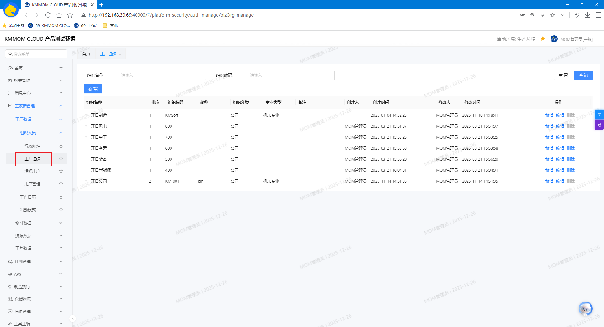

#### 2.2. 增、删、改、查
1. 通过顶部的 **查询** 功能筛选出目标工厂组织。
2. 点击 **新增** 创建新工厂组织，可根据实际情况填写**上级组织**、**排序**、**组织分类**、**专业类型**建立不同组织间的层级关系。
   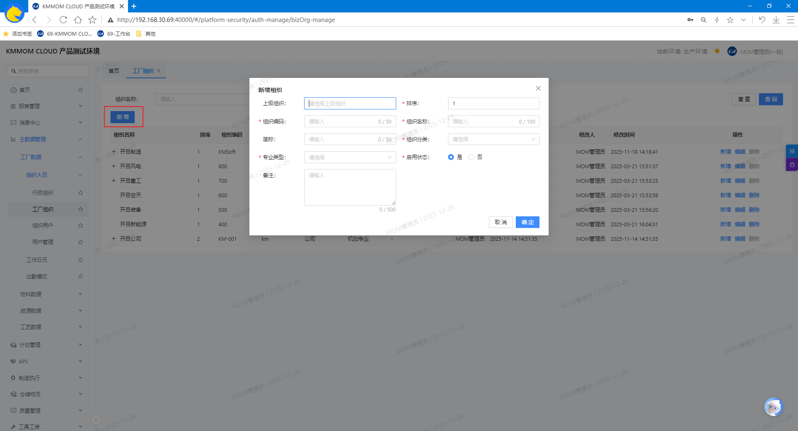
3. 点击 **编辑** 修改工厂组织信息，可控制是否启用该工厂组织。
4. 点击 **删除** 移除工厂组织。

#### 2.3. 注意事项
- **组织编码**需保持唯一。
- 删除工厂组织前务必核对其是否被**用户**引用，无子节点组织；否则无法删除。
- 如需在生产高峰期调整工厂组织编码或分类，请先确认，避免影响实际生产。
- 建议合理维护**排序**与**备注**，提升列表展示与检索体验。

### 3. 用户管理
#### 3.1. 进入页面
1. 在左侧导航选择 **主数据管理 > 工厂数据 > 用户管理**。
   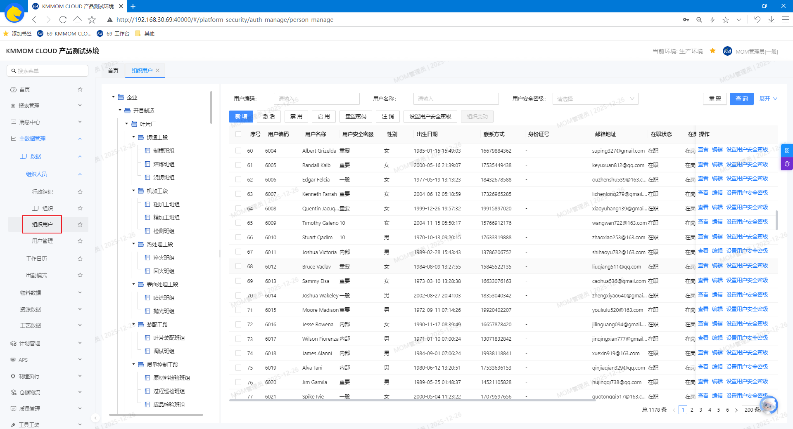

#### 3.2. 增、改、查
1. 在左侧的**工厂组织树**选择需要查看的组织节点。
2. 通过顶部的 **查询** 功能筛选出目标用户。
3. 点击 **查看** 查看用户详情。
4. 点击列表上方 **新增** 创建用户，根据实际情况填写**用户名称**、**手机号**、**邮箱**、**组织**、**在职在岗状态**、**设置用户安全密级**等信息。
   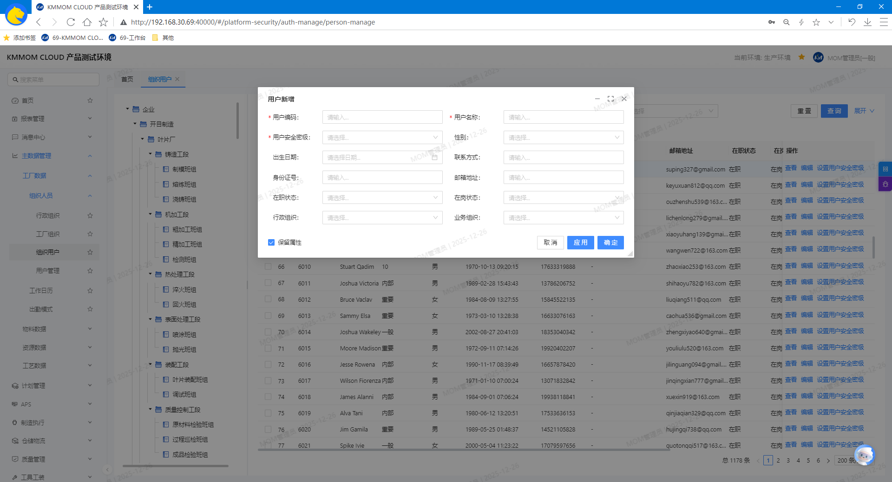
5. 在列表中定位目标用户，点击右侧 **编辑**，维护用户信息。

#### 3.3. 组织变动
1. 在列表中选择用户，点击 **组织变动**。
2. 在弹窗中选择 **工厂组织**，确认后点击 **保存**。
4. 变更成功后，人员将显示在对应工厂组织的列表中，并记录 **变更人** 与 **变更时间**。
   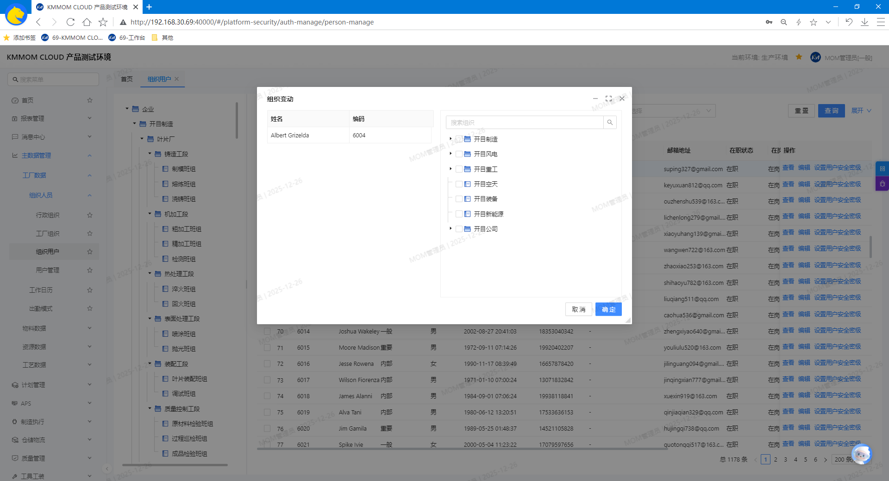

#### 3.4. 激活
1. 在列表中选择目标用户，点击 **激活**。
2. 激活后用户可正常登录系统，否则无法登录系统。

#### 3.5. 禁用/启用
1. 在列表中选择目标用户，点击 **禁用**，用户将不可登录但保留数据。
3. 禁用状态可通过 **启用** 恢复正常。

#### 3.6. 重置密码
1. 在列表中选择目标用户，点击 **重置密码**，在弹窗中确认后，系统将重置为 **初始密码**。

> **注意：**
> - 重置密码为系统中 **配置管理-安全配置-全局安全配置** 中设置的 **默认密码**。
> - 重置密码后，建议用户在首次登录后立即更新密码，避免安全风险。

#### 3.7. 注销
1. 在列表中选择目标用户，点击 **注销**。
2. 在确认弹窗中点击 **确定**；账号被永久注销（不可登录），历史操作记录保留以便审计。

#### 3.8. 设置用户安全密级
1. 点击列表中目标用户数据右侧的 **设置用户安全密级**按钮。
2. 在弹窗中选择目标密级，点击 **保存**。

#### 3.9. 注意事项
- **用户编码**需保持唯一；
- 建议先**新增**后立即执行**激活**与**设置用户安全密级**，再分配角色与权限，避免无密级账号访问异常。
- 进行**组织变动**会影响排班、权限与报工归集，请在生产计划冻结前完成变更并复核。
- **禁用**用于临时停用，**注销**为不可恢复的永久停用；请根据实际场景慎重选择。
- **重置密码**属于高风险操作，建议通过双人复核并及时通知用户完成首次登录的密码更新。
- 密级调整会影响资源可见性与操作权限，请在变更前与安全管理员确认并保留变更记录。

### 4. 工作日历
#### 4.1. 进入页面
1. 在左侧导航选择 **主数据管理 > 工厂数据 > 工作日历**。
   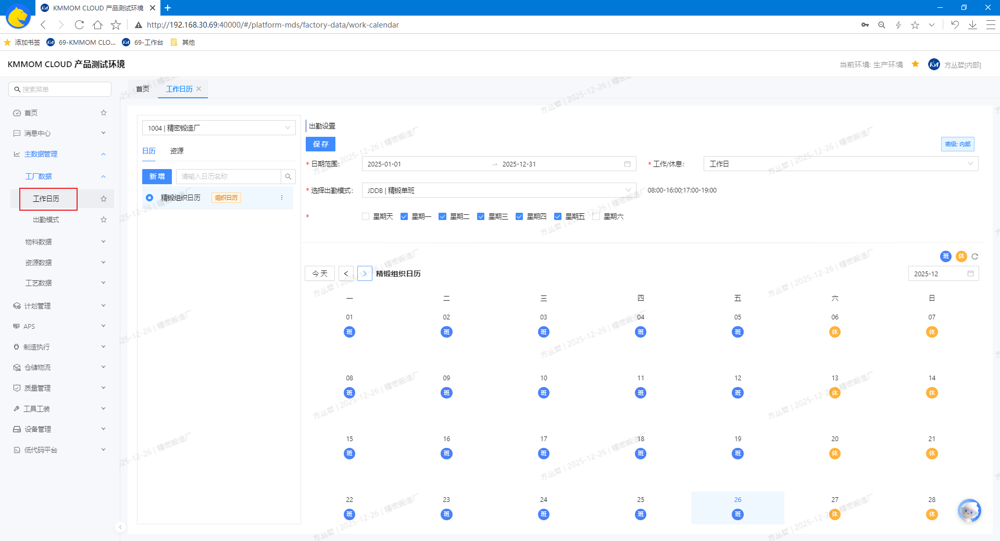

#### 4.2. 增、删、改、查
1. 使用左上角的 **工厂** 下拉或列表区的 **搜索** 输入框，筛选目标工厂组织/资源日历。
2. 在左侧**日历/资源列表**中点击目标项（如：**精馏车间日历**），右侧将展示该日历的详细配置与月历视图。
3. 在左侧日历列表选中日历，点击条目更多按钮下的 **编辑**，根据需要调整日历数据。
4. 在左侧日历列表选中日历，点击条目更多按钮下的 **删除**。
   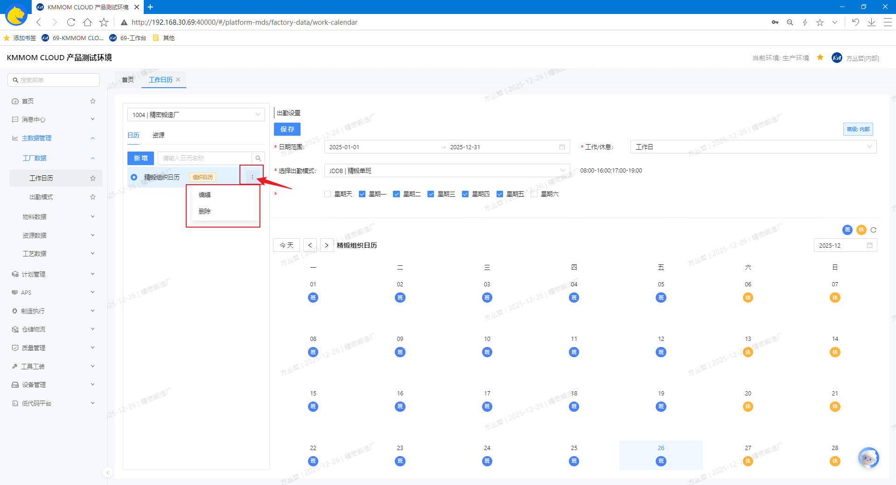

#### 4.3. 出勤设置
1. 在左侧日历列表选中日历，右侧维护出勤设置。  
2. 在 **月历视图** 中进行逐日维护，点击单日切换 **班/休**。

#### 4.4. 注意事项
- **工作/休息** 的调整会影响排班、加班与统计，请在生产计划冻结前完成更新。
- 变更后务必点击 **保存**，否则设置不会生效；保存成功后方可用于后续业务流程。

### 5. 出勤模式
#### 5.1. 进入页面
1. 在左侧导航点击 **主数据管理** → **工厂数据** → **出勤模式**。
   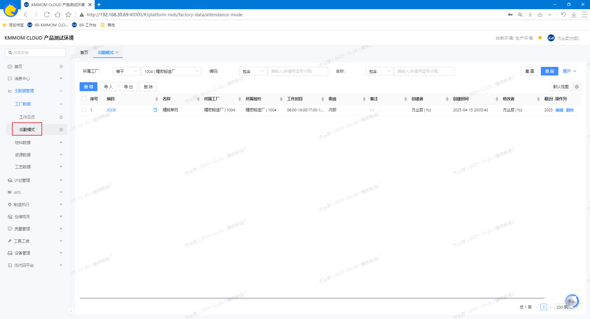

#### 5.2. 增、删、改、查
1. 在顶部搜索框输入关键字（支持编码、名称等），按下回车或点击 **查询**。
2. 在列表中点击目标行 **编辑**，系统打开详情页维护信息。
3. 点击 **新增**，创建出勤模式，根据实际情况填写工作时间段。
   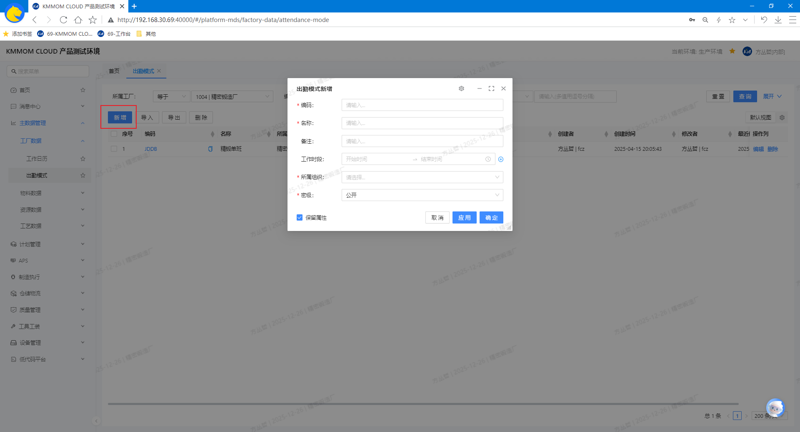
4. 选中数据，点击 **删除**。

> **注意：**
> - 新增出勤模式时，如果有多个时间段，时间段间不能有重叠。
> - 删除出勤模式前，请确认该模式未被排班使用，否则会导致排班异常。

#### 5.3. 导入导出
1. 点击 **导入**，下载导入模板。
2. 按模板根据实际情况填写数据，导入后，列表自动更新。
   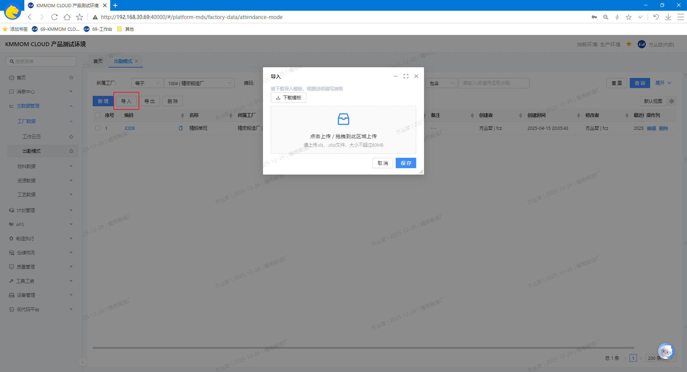
   - **工作时段**：时间段格式为 **开始时间-结束时间**，如“08:00-16:00”；多个时间段用分号隔开，如“08:00-12:00;14:00-18:00”。
3. 选中数据，点击 **导出**，选择导出范围，导出excel文件。

#### 5.4. 注意事项
- 数据维护应遵循编码唯一、名称清晰的规范，避免重复创建。
- 请确保 **班次时段** 不重叠且与 **生效/失效时间** 合理匹配；启用状态变更会影响排班与统计。
- 批量导入前请严格对照模板字段与格式，必须与系统主数据一致。
- 删除为不可逆操作，谨慎执行。建议在删除前先导出备份。
- 用户需要具备相应的权限才能进行 **新增**、**导入**、**导出**、**删除** 和 **编辑** 操作；无权限时请联系管理员开通。