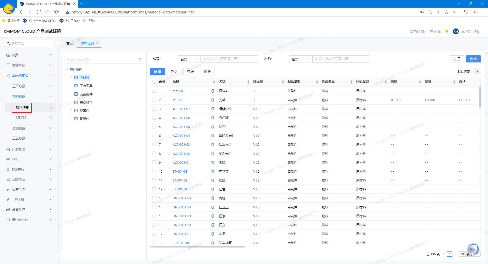
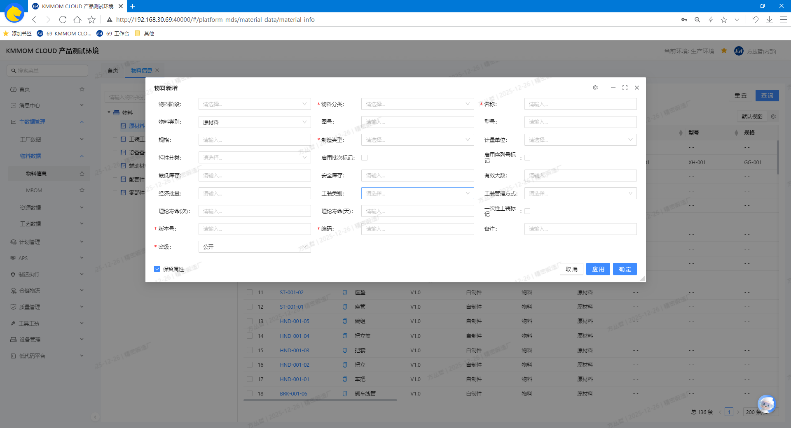
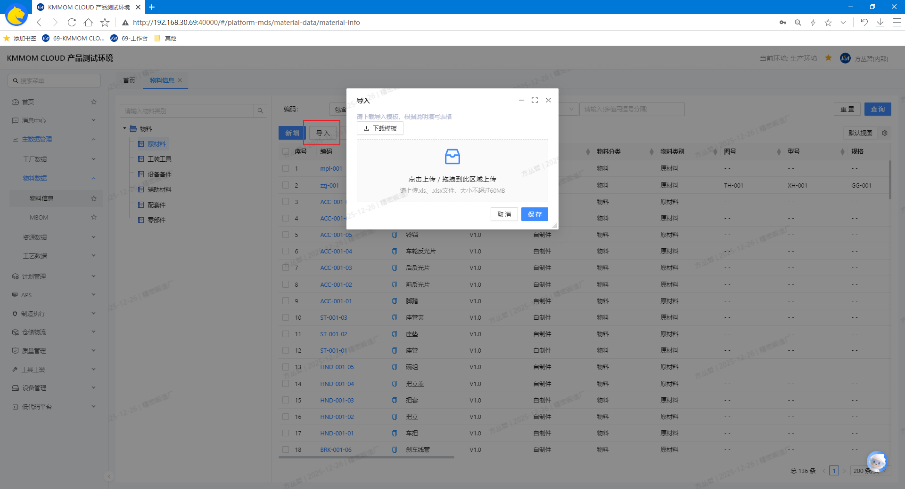
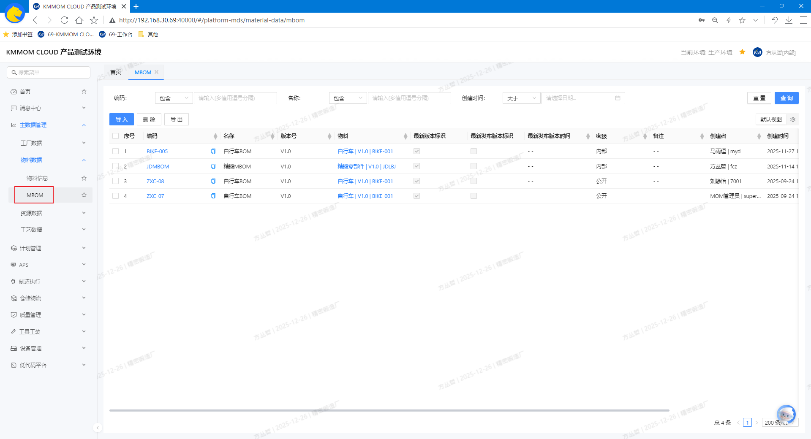
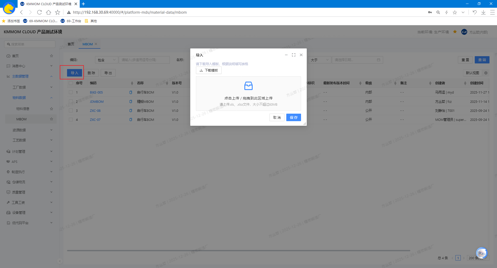

# 物料数据

## 功能概述
物料数据模块面向离散型制造业，覆盖**物料信息**与**MBOM（制造BOM）**两类主数据。支持按权限维护数据，保障计划排程、备料、工艺与质量模块的主数据一致性与可追溯性。

## 核心功能
1. **物料信息**：集中维护编码、名称、版本、制造类型、分类/类型、密级、计量单位等属性；支持列表与详情查看、版本管理与批量导入/导出、引入技术文件。
2. **MBOM**：与上游 PLM 版本保持一致，展示节点制造属性与关联技术文件，支持查询、导入/导出、查看（发布版本）与维护。

## 操作指南

### 1. 物料信息
#### 1.1. 进入页面
1. 在左侧导航点击 **主数据管理** → **物料数据** → **物料信息**。
   

#### 1.2. 增、删、改、查
1. 在左侧点击目标 **分类**（如：标准件、工装工具等），列表自动按分类过滤。
2. 在右侧筛选区设置查询条件，查询目标物料数据。
3. 点击 **新增** 打开新增窗口，根据实际情况填写**编码**、**名称**、**物料分类**、**物料类别**、**制造类型**、**启用批次/序列号标记**、**经济批量**、**版本号**、**密级**等属性。
   
4. 勾选目标物料数据，点击 **删除**。
5. 点击列表中的 **编码** 进入物料详情：
   - 可维护对应物料信息：**最低库存**、**安全库存**、**启用批次/序列号标记**等属性。
   - 在 **版本记录** tab标签页，可查看历史版本信息。
   - 在 **技术文件** tab标签页，引入/下载相关技术文件，如：设计图、操作手册、规格书等。

> **注意：**
> - **启用批次/序列号标记**：启用情况下，制造订单才能生成对应的批次/顺序号。
> - **经济批量**：指在计划排程中考虑的最小生产数量，用于生产订单释放成制造订单时，默认每份数量（即每个制造订单生产数量）。
> - **安全库存**：在物料库存低于安全库存值时，进行库存预警，提醒及时补货。

#### 1.3. 导入/导出
1. 点击 **导入** 打开导入窗口，下载模板文件。
2. 按照模板根据实际情况填写物料信息（参考 **1.2. 增、删、改、查** 的字段说明），导入文件后，数据更新。
   
3. 勾选需要导出的记录，点击 **导出**，选择导出范围，导出excel文件。

#### 1.4. 注意事项
- 导入文件的结构与字段必须严格符合模板要求；格式不正确将被拒绝并给出明确提示。
- **数据一致性**：版本号与制造类型需与上游系统保持一致；同编码在同版本下不可重复。
- **删除不可逆**：删除后无法恢复，请确认不影响生产与关联数据后再执行。
- **性能建议**：大批量导入建议分批进行，避免一次性导入导致校验耗时或网络波动。
- **分类规范**：请按企业物料分类标准维护分类与类型，保障后续查询与统计准确性。

### 2. MBOM
#### 2.1. 进入页面
1. 在左侧导航点击 **主数据管理** → **物料数据** → **MBOM**。
   

#### 2.2. 删、改、查
1. 在筛选区设置查询条件，查询目标MBOM数据。
2. 勾选目标物料数据，点击 **删除**。
3. 点击列表中的 **编码** 进入MBOM详情
   - 可维护对应MBOM信息：**层级**、**制造类型**、**物料版本**等属性。
   - 在**技术文件** tab标签页，引入/下载相关技术文件，如：设计图、操作手册、规格书等。

#### 2.3. 导入/导出
1. 点击 **导入**，打开导入窗口，下载模板文件。  
   
2. 按照模板根据实际情况填写内容，导入文件成功后，数据更新。
   - MBOMsheet页，填写基础属性信息；MBOM节点sheet页，填写BOM具体层级节点信息；
   - MBOM节点sheet页中”0“层级，无需写父物料信息；同一层级中，按照 **序号** 进行节点排序。
3. 勾选需要导出的记录，点击 **导出**，选择导出范围，导出excel文件。

> **注意**：模板文件数据导入前，确认MBOM与MBOM节点数据正确，关联关系正确。

#### 2.4. 注意事项
- **删除影响**：删除为不可逆的本地数据移除操作；请确认不影响生产后再执行。
- **性能建议**：大型MBOM浏览与导入建议分批操作，避免一次性加载导致等待时间过长。
