# 资源数据

## 功能概述
资源数据模块面向离散型制造业，统一维护生产现场可用资源的主数据，包含**设备定义**、**工装定义**、**工作中心**与**供应商**。模块按权限提供一致的**查询**、**重置**、**新增**、**导入**、**导出**、**删除**与详情维护能力，支持按工厂/车间维度的筛选与分类树快速定位，保障排程、派工、报工与质检等业务对资源主数据的规范性与可追溯性。

## 核心功能
1. **设备定义**：
   - 集中维护设备的基础属性、安装位置、型号、维保类别、使用期限等，并支持批量导入/导出；
   - 关联使用人员。
2. **工装定义**：
   - 维护制造过程所需的标准工装信息（编码、名称、图号、批次/序列号启用控制、制造类型、工装管理方式等），支持树形分类浏览与批量维护；
   - 查看工装详情及历史版本记录；
   - 关联工装检定和保养策略。
3. **工作中心**：
   - 管理作业单元（工段/产线/设备/人员），支持新增、导入/导出、分类与类型维护，作为排程与派工的承载对象；
   - 按照分类关联对应的人员、设备、供应商。
4. **供应商**：
   - 维护外委/外购相关的供应商主数据（编码、名称、资质与分类等），支撑工作中心、外委计划与到货验收的数据依赖；
   - 可控制是否启用该供应商。

## 操作指南

### 1. 设备定义
#### 1.1. 进入页面
1. 在左侧导航点击 **主数据管理** → **资源数据** → **设备定义**。
   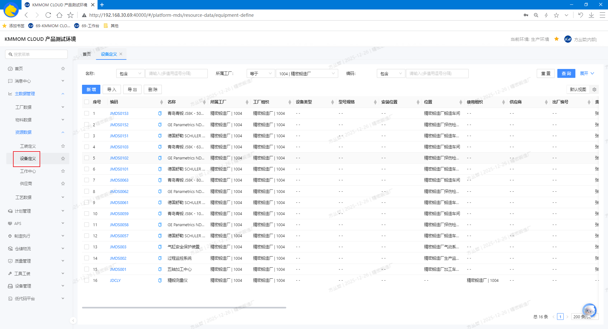

#### 1.2. 增、删、改、查
1. 在筛选区设置查询条件，查询目标设备数据。
2. 点击列表上方的 **新增**，创建设备数据，根据实际情况填写 **所属组织**、**编码**、**名称**、**安装位置**、**型号规格**、**设备类型**、**投用日期**、**密级** 等基础信息。
   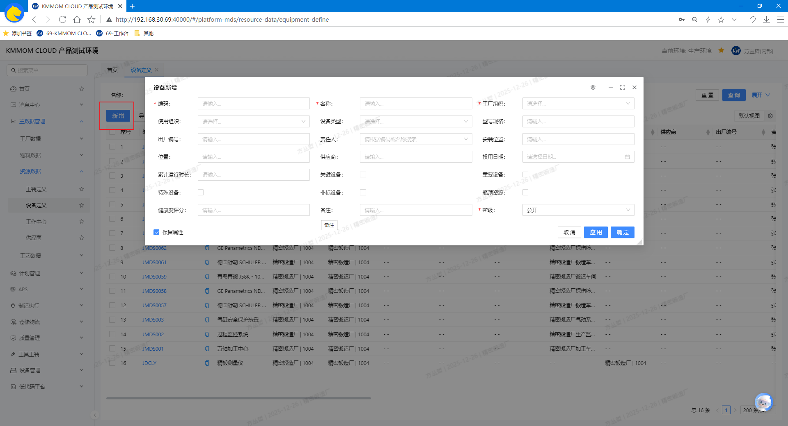
3. 勾选目标设备数据，点击 **删除**。
4. 点击列表中的 **编码** 进入设备详情页面，可查看并维护设备的基础属性、安装与使用信息等，关联对应的使用人信息。

#### 1.3. 导入/导出
1. 点击 **导入** 打开导入窗口，下载模板文件。
2. 按照模板根据实际情况填写数据（参考 **1.2. 增、删、改、查** 的字段说明），导入文件成功后，系统新增对应设备数据。
   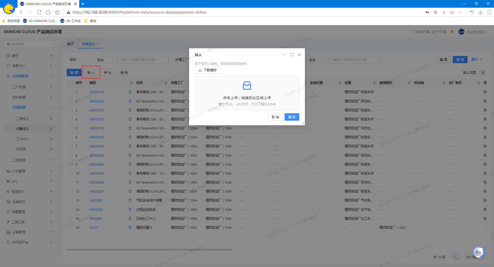
3. 勾选需要导出的记录，点击 **导出**，选择导出范围，导出为excel文件。

> **注意**：模板文件数据导入前，确认设备数据正确，设备与人员的关联关系正确。

#### 1.4. 注意事项
- 导入文件必须符合模板规范；格式不正确或必填项缺失将被拒绝并提示原因。
- **唯一性校验**：**编码** 关键字段需唯一；重复数据不允许新增或导入。
- **数据一致性**：**所属工厂**、**使用组织**、**设备类别**、**规格型号** 请按企业统一标准维护，避免统计与查询偏差。
- **删除不可逆**：删除操作无法恢复，请确认不影响生产与维保管理后再执行。
- **性能建议**：大批量导入建议分批进行，避免一次性导入导致校验耗时或网络波动。

### 2. 工作中心
#### 2.1. 进入页面
1. 在左侧导航点击 **主数据管理** → **资源数据** → **工作中心**。
   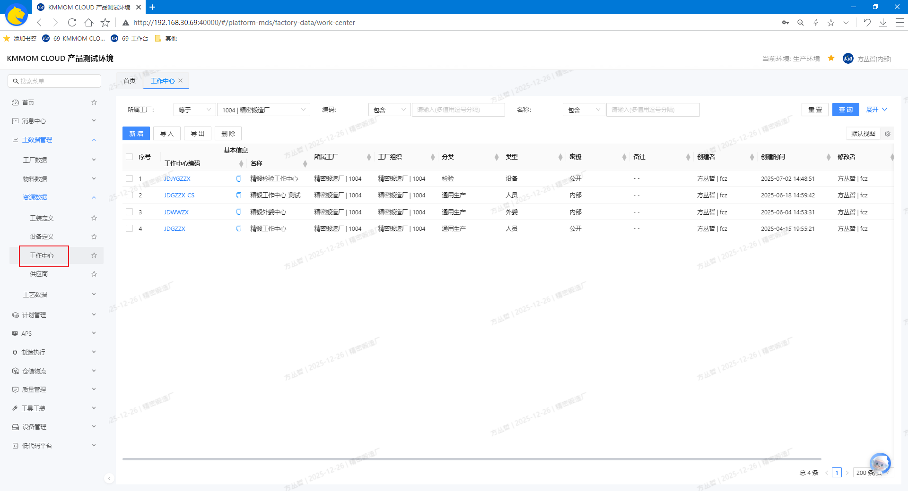

#### 2.2. 增、删、改、查
1. 在顶部搜索框输入关键字（支持编码、名称等），查询目标工作中心数据。
2. 点击列表上方 **新增**，创建工作中心，根据实际情况填写**所属工厂**、**分类**、**类型**、**密级**等基础信息。
   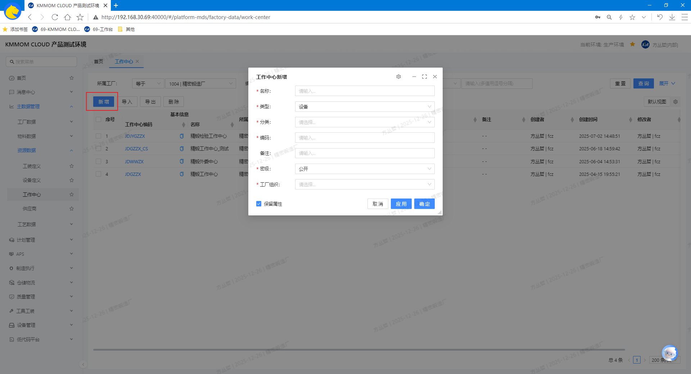
3. 点击列表中数据所在行的 **编码** 超链接，进入详情页面
   - 可维护基础信息（编码、名称、所属工厂、车间、分类、类型、对象等）；
   - 维护关联对应的人员、设备、供应商，作为后续工序及任务的执行对象。类型与关联规则：
     - **设备型工作中心**：可关联设备、人员；不关联供应商；
     - **人员/产线/小组/车间/工厂/工段型工作中心**：可关联人员、设备；不关联供应商；
     - **外委型工作中心**：可关联供应商、人员；不维护设备关联。
4. 勾选目标工作中心数据，点击 **删除**。

#### 2.3. 导入/导出
1. 点击 **导入**,下载导入模板。
2. 按模板根据实际情况填写数据，包含 **工作中心**、**工作中心与供应商的关系**、**工作中心与人员的关系**、**工作中心与设备的关系** 4个sheet页（参考 **2.2. 增、删、改、查** 的字段说明），导入文件成功后，列表自动更新。
   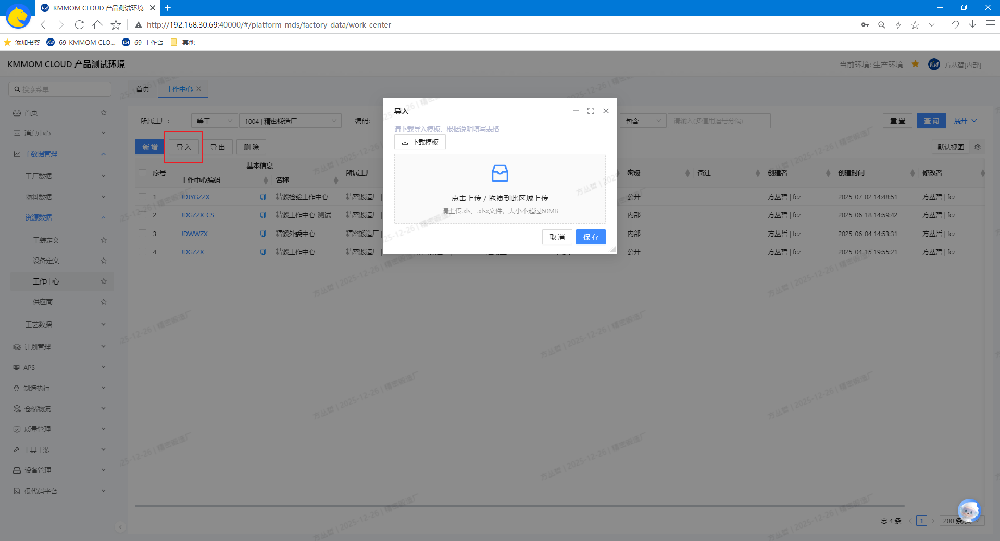
3. 点击 **导出**，选择导出范围（当前筛选结果/勾选的数据），导出为excel文件。

> **注意**：模板文件数据导入前，确认工作中心数据正确，工作中心与人员/设备/供应商的关联关系正确。

#### 2.4. 注意事项
- 批量导入前请严格对照模板字段与格式，尤其是 **所属工厂**、**类型**、**分类** 等字段必须与系统主数据一致。
- 删除为不可逆操作，谨慎执行。建议在删除前先导出备份。
- 用户需要具备相应的权限才能进行 **新增**、**导入**、**导出**、**删除** 等操作；无权限时请联系管理员开通。
- 如遇页面无数据或筛选异常，请尝试点击 **重置** 后重新筛选，或刷新页面再次加载。

### 3. 工装定义
#### 3.1. 进入页面
1. 在左侧导航点击 **主数据管理** → **资源数据** → **工装定义**。
   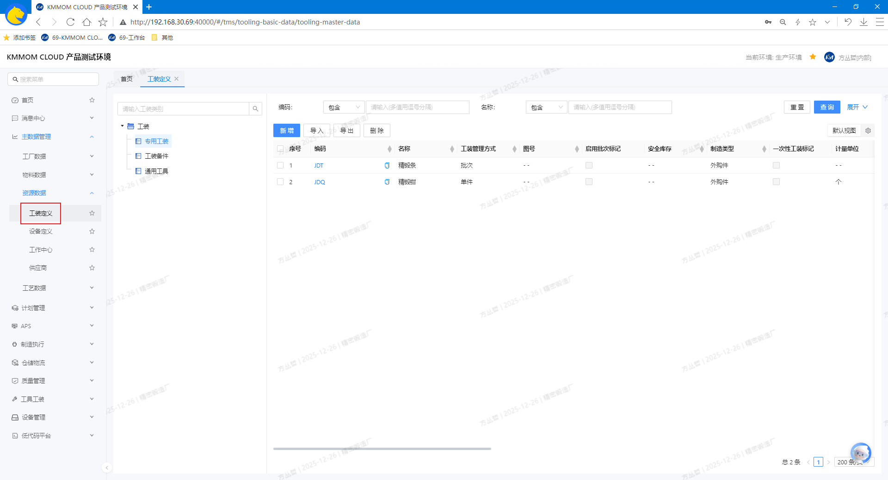

#### 3.2. 增、删、改、查
1. 在顶部搜索框输入关键字（支持 **编码**、**名称** 等），查询目标工装数据。
2. 点击列表中 **编码** 列的链接，打开详情页
   - 可维护基础信息（编码、名称、工装管理方式、图号、启用批次标识、启用序列号标识、制造类型、工装类别 等），查看历史版本记录。
   - 根据工装类别，关联对应类别的保养策略和定检策略，作为后续检定保养任务的执行依据。
3. 点击列表上方 **新增**，创建工装数据，根据实际情况填写 **编码**、**名称**、**工装管理方式**、**图号**、**启用批次标识**、**启用序列号标识**、**制造类型**、**工装类别** 等基础信息。
   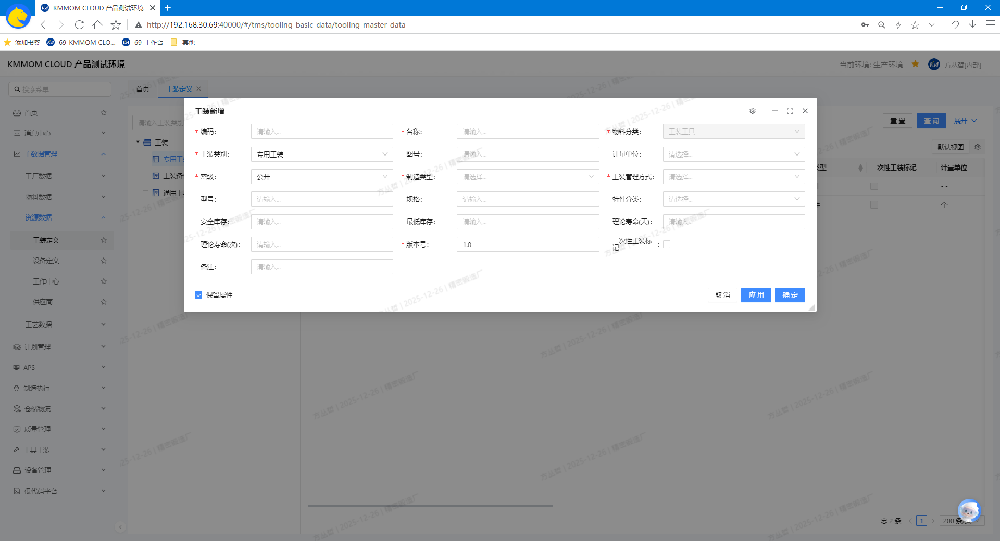
4. 勾选需要删除的工装数据行，点击 **删除**。

#### 3.3. 导入/导出
1. 点击 **导入**，下载并查看导入模板。
3. 按模板根据实际情况填写数据，包含 **物料**、**工装检定策略关系**、**工装保养策略关系** 3个sheet页，导入文件成功后，数据自动进入列表。
   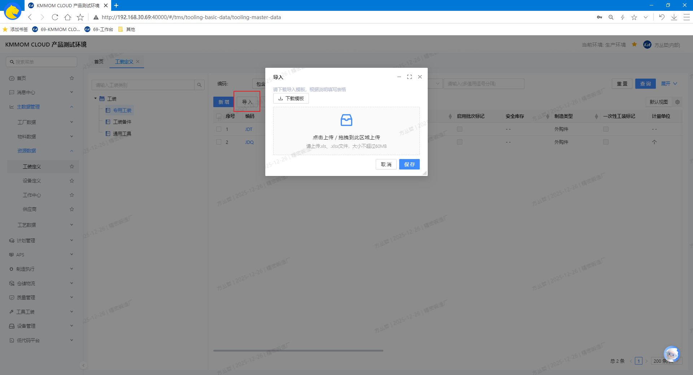
   - **物料** sheet页：
      - 填写工装的基本信息，包括 **物料分类**、**名称**、**制造类型**、**版本号**、**编码**、**密级**；
      - 选填工装信息，包括 **物料类别**、**图号**、**型号**、**规格**、**计量单位**、**特性分类**、**启用批次标识**、**启用序列号标识**、**工装类别**、**工装管理方式**、**一次工装标记**、**备注**。
   - **工装检定策略关系** 和 **工装保养策略关系** sheet页：
      - 填写工装与策略的关联关系；
      - 也可不填写，通过系统中对应策略页面的同步策略到工装的功能，进行关联。

#### 3.4. 注意事项
- 维护工装前，请确保 **编码唯一**、**名称清晰**，避免与现有工装重复。
- **启用/停用批次/序列号标识** 会影响计划与执行，请在调整前与相关部门确认。
- 导入前务必使用系统模板并校验数据；字段如 **制造类型**、**工装类别** 应与主数据字典一致。
- 删除为不可逆操作；建议在删除前 **导出备份** 并确认工装未被订单/工艺路线使用。
- 无权限时无法进行 **新增**、**导入**、**导出**、**删除** 等操作；请联系管理员开通相应权限。

### 4. 供应商
#### 4.1. 进入页面
1. 在左侧导航点击 **主数据管理** → **资源数据** → **供应商**。
   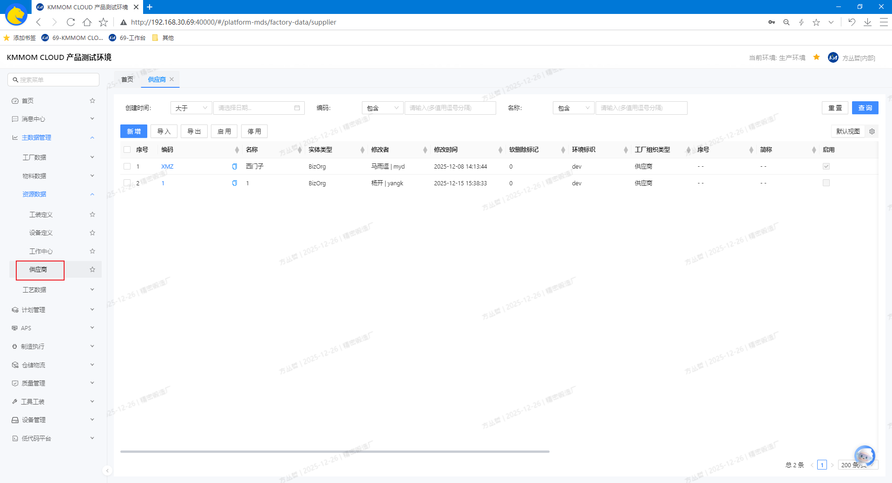

#### 4.2. 增、改、查
1. 在筛选区设置查询条件，查询目标供应商数据。
2. 点击 **新增** 打开新增表单，创建供应商数据，根据实际情况填写 **编码**、**名称**、**启用状态**（默认 **启用**）等。
   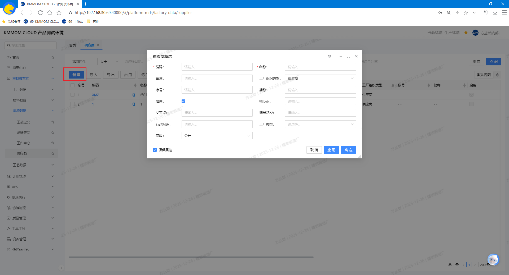
3. 列表中点击目标供应商数据行 **编码** 进入详情页，可维护基础信息（编码、名称、启用状态）。

#### 4.3. 导入/导出
1. 点击 **导入** 打开导入窗口，下载导入模板。
2. 按模板根据实际情况填写字段（参考 **4.2. 增、改、查** 中新增供应商的填写说明），导入文件成功后，系统写入数据并返回列表。
   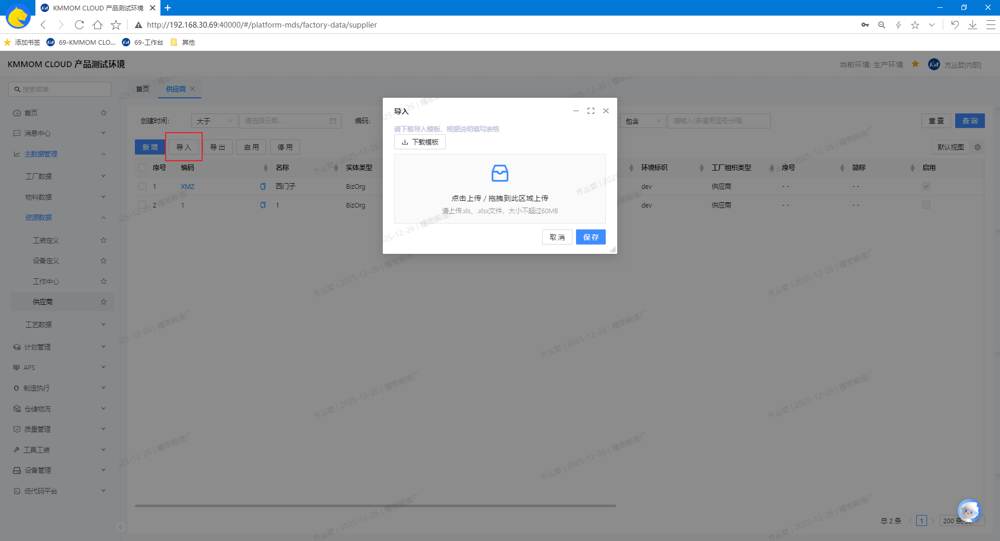
3. 勾选需要导出的记录，点击 **导出**，选择导出范围（当前筛选结果/勾选的数据），导出为excel文件。

#### 4.4. 启用/停用
1. 在列表中勾选单条或多条记录，点击 **启用** 或 **停用** ，执行状态变更。

#### 4.5. 注意事项
- **唯一性校验**：**供应商编码** 必须唯一；导入或新增重复编码将被拒绝。
- **停用影响**：停用后不可加入工作中心或被指定为供应商；历史数据保持不变；请在确认外委任务与协作关系后操作。。
- **模板规范**：导入需严格按模板字段与类型填写；校验失败将给出明确提示。
