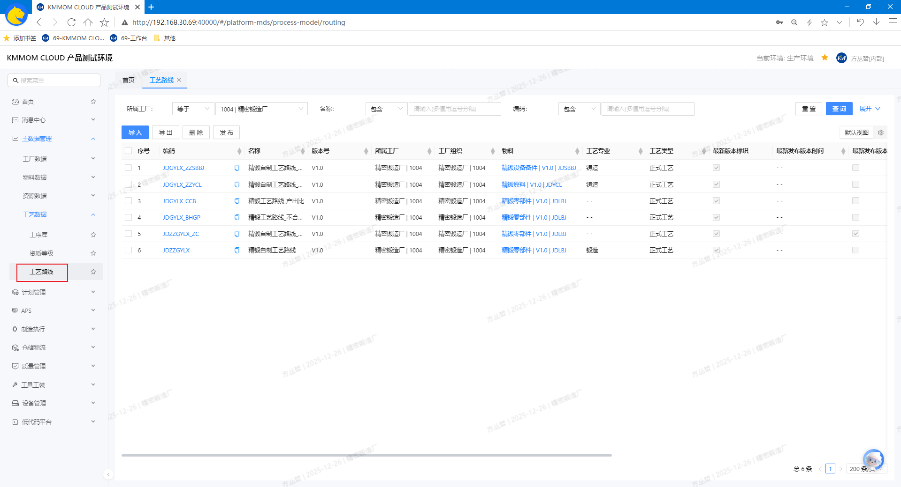
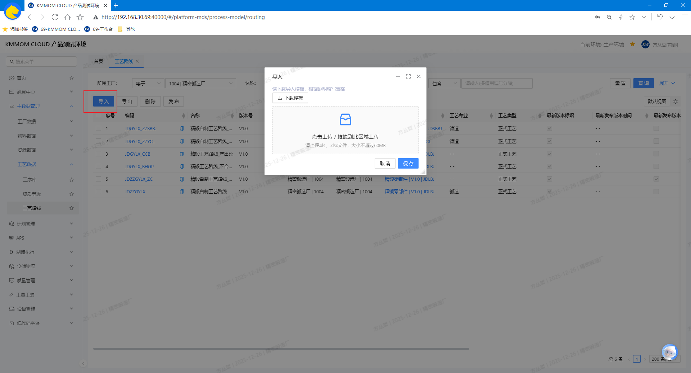
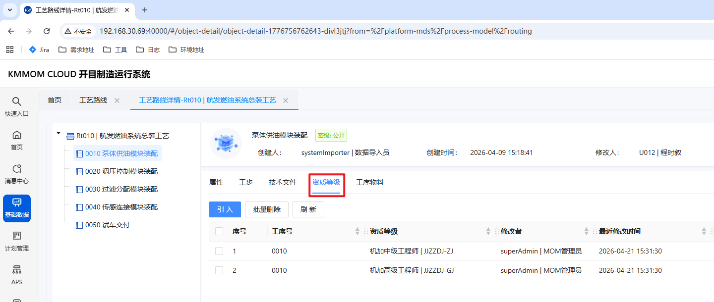

# 工艺数据

## 功能概述

工艺数据模块面向离散型制造业，集中维护产品的 **工艺路线** 主数据。用户可完成 **查询**、**重置**、**更多**、**默认设置**、**导入**、**导出**、**删除**、**发布** 等操作，并通过筛选条件快速定位目标记录。列表显示字段包含：**序号**、**编码**（可点击查看详情）、**名称**、**版本号**、**所属工厂**、**工厂部门**、**物料**、**工艺步骤**、**工艺类型**、**最新版本标识**、**最新发布标识** 等。

## 核心功能

1. **工艺路线**：
   - 维护产品的工艺路线主数据，包含工艺路线属性、工序序列、技术文件等。
   - 可发布工艺路线，发布后不可编辑，用于维护质量过程标准。

## 操作指南

### 1. 工艺路线

#### 1.1. 进入页面

1. 在左侧导航点击 **主数据管理** → **工艺数据** → **工艺路线**。
   

#### 1.2. 删、查、改

1. 在筛选区设置查询条件，查询目标工艺路线数据。
2. 勾选目标工艺路线数据，点击 **删除**，系统移除对应工艺路线数据。
3. 点击列表中的 **编码** 进入工艺路线详情页面，可查看、维护 **工艺路线** 及其 **工序** 的相关信息（相关属性参考 **1.3. 导入导出** 下的导入模板文件说明）。
   - 工艺路线相关：
     - 包含 **属性**、**工序序列**、**技术文件**、**工序关系图**、**版本记录** 页签；
     - 可维护 **属性**、**技术文件** 相关信息（上传、引入、查看、删除相关技术文件）。
   - 工序相关：
     - 包含 **属性**、**技术文件**、**工序物料** 页签；
     - 可维护 **属性**、**技术文件** 相关信息（上传、引入、查看、删除相关技术文件）。

> **注意**：工艺路线属性在发布后不可编辑、删除。

#### 1.3. 导入导出

1. 在列表上方点击 **导入**，弹出导入窗口，下载导入模板文件。
2. 按模板根据实际填写文件数据，包含 **工艺路线**、**工艺路线工序**、**工艺路线工序序列**（工序间上下道关系）、**工艺路线工序物料** 4个sheet页，导入文件成功后，列表数据会按创建时间倒序展示。
   
   - 工艺路线sheet页：
      - **工艺类型**：必填项，根据实际情况选择工艺路线的类型（正式/典型/临时/一级）：
      - 一级工艺用于企业级生产管理部对各制造厂的工艺协同管理；
      - 正式/典型/临时工艺用于各制造厂的工艺管理。
      - **工艺专业**：选填项，根据实际情况选择工艺路线的专业（如：机加、装配等）。
   - 工艺路线工序sheet页：
      - **工序时间**：必填项，根据实际情况填写工艺路线工序的加工、定额等工时，用于执行、排产的时间计算；
      - **时间单位**：必填项，根据实际工时的时间单位（如：小时、分钟等）；
      - **工序类型**：必填项，根据实际情况选择工序的类型（如：加工、检验、转工、外委等）；
      - **产出比**：选填项，根据实际情况填写工序的产出比（如：1、2等）。
         - 用于计算一级工艺展开后，各工序对应的子生产订单的计划数量（一级订单计划数量\*工序产出比）。
   - 工艺路线工序序列sheet页：
      - **工序序列**：根据实际情况选择工序间上下道关系（ES/SSEE），用于制造任务执行、排产。
      - ES：表示当前工序是前工序的直接后继，无中间工序；
      - SSEE：表示当前工序是前工序的直接后继，且有中间工序。
3. 勾选需要导出的记录，点击 **导出**，选择导出范围，导出为excel文件。

#### 1.4. 发布

1. 勾选需发布的工艺路线，点击 **发布**，发布成功后，列表的 **最新发布标识** 将同步更新。
2. 发布后，可用于维护质量过程标准

#### 注意事项

- 导入文件的结构与字段必须严格符合模板要求；格式不正确将被拒绝并给出明确提示。
- **唯一性校验（导入）**：系统会校验数据唯一性；重复数据不允许导入，请先排重再重试。
- **删除不可逆**：删除操作无法恢复，请在确认无生产影响后再执行。
- **发布影响生产**：发布会影响生产执行使用的版本，建议在发布前完成数据核验与审批。
- **性能建议**：大批量数据建议分批导入，避免单次数据量过大导致校验耗时或网络波动。

---

### 工艺路线-工序绑定资质等级

#### 操作入口
主数据管理 -> 工艺数据 -> 工艺路线 -> 工艺路线详情 -> 工序 -> 资质等级页签

#### 操作步骤
1. 进入工艺路线详情，在左侧选择目标工序。
2. 打开资质等级页签，点击引入。
3. 在引入窗口中筛选并勾选目标资质等级，点击确定。
4. 检查当前工序资质列表后保存工艺路线。
5. 若工序要求变更，可删除或替换已绑定资质等级后再次保存。

#### 业务规则
- 工序可绑定多个资质等级要求。
- 此处维护的是工序执行门槛，直接影响后续任务派工、报工、协调可选人员范围。
- 工艺路线发布前请完成资质要求复核，避免执行端出现无可选人员。

