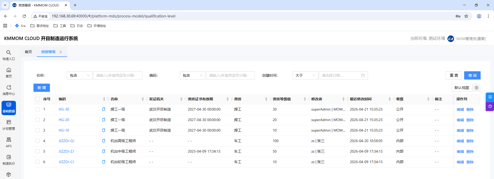
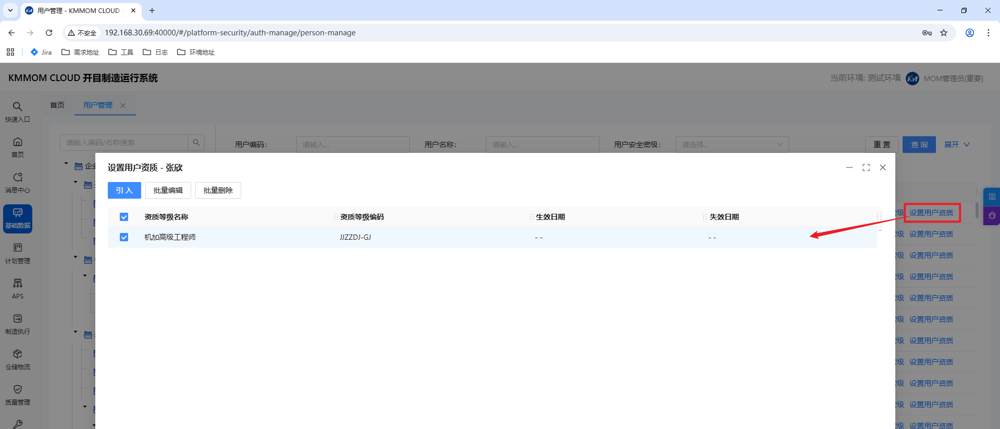

# 资质等级管理

## 功能概述
本手册面向主数据相关角色，覆盖资质等级主数据维护与人员资质绑定，作为任务派工、报工、协调资质校验的上游数据来源。

## 适用角色
- 主数据管理员：维护资质等级定义。
- 人员管理员：维护用户与资质等级关系。

## 1. 资质等级定义

### 操作入口
基础数据 -> 资质等级

### 操作步骤
1. 进入资质等级列表，使用名称、编码、资质类型等条件检索。
2. 点击新增，维护资质信息：名称、编码、资质类型、资质等级值、发证机关、证书有效期、密级等。
3. 点击应用或确定保存。
4. 需要调整时可编辑；需要停用时优先执行失效/停用策略，避免直接删除。

### 维护规则
- 编码应保持唯一。
- 同一资质类型内，等级值建议按从低到高连续维护。
- 已被人员资质关系或工序资质要求引用的数据，不允许直接删除。

## 2. 用户绑定资质等级

### 操作入口
基础数据 -> 用户管理 -> 设置用户资质

### 操作步骤
1. 在用户管理列表选择目标人员，点击设置用户资质。
2. 在弹窗中点击引入，选择一个或多个资质等级。
3. 完成绑定后维护生效日期、失效日期（如系统启用该字段）。
4. 点击确定保存。
5. 人员离岗、证书过期或角色变更时，及时失效对应资质关系。

### 维护规则
- 仅状态有效且在有效期内的人员资质关系参与执行校验。
- 用户可绑定多个资质等级，系统按工序要求实时判断是否可执行。

## 3. 数据联动说明
1. 工艺员在工艺路线工序中绑定资质等级要求。
2. 调度员/班组长在派工、报工、协调选择执行人时，系统按工序资质要求与人员有效资质关系联动校验。
3. 不满足要求的人员在候选列表中灰显不可选。
