 # 生产制造计划管理

## 功能概述
订单管理页面用于对生产订单进行集中维护与调度，支持按条件查询、批量处理与状态变更。用户可执行：**查询**、**导入**、**新增**、**删除**、**发布**、**齐套检查**、**订单释放**、**取消**、**暂停**、**恢复**、**指定（优先级、工艺路线、计划员、计划时间）**、**查看详情** 与 **编辑**。  
支持数据的导入导出、批量处理以及自定义筛选视图。  

## 操作指南

### 1. 生产订单管理
#### 1.1. 进入页面
1. 在左侧导航点击 **计划管理** → **生产订单管理**。
   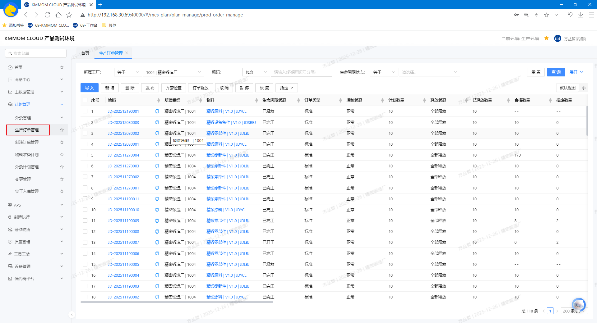

#### 1.2. 增、删、改、查
1. 在页面顶部选择筛选条件查询目标生产订单数据。
2. 点击 **新增** 按钮，打开新增订单页面或对话框，根据实际情况填写 **物料**、**计划类型**、**工艺路线**、**优先级**、**密级**等必要字段。
   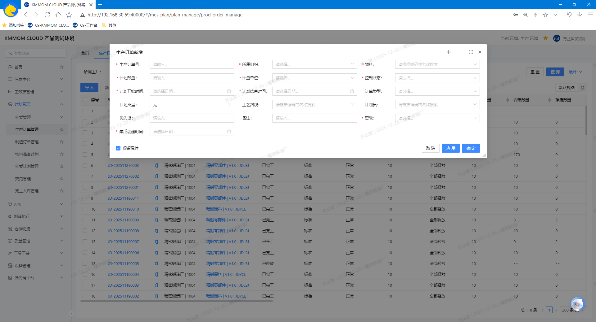
3. 在列表左侧勾选需要删除的 **已创建** 状态的生产订单，点击 **删除** 按钮并确认操作，列表移除该生产订单。
4. 在订单列表中点击 **已创建** 状态的订单数据行的 **编码** 进入详情页，可维护订单信息（如：**数量**、**工艺路线**、**计划时间**、**备注**）。
   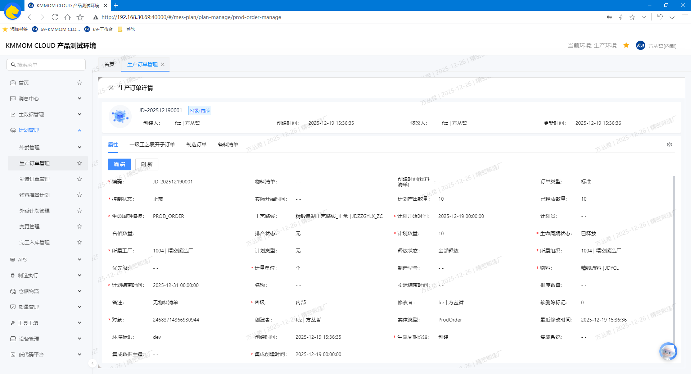

> **注意**：生产订单发布后，不能再进行修改。

#### 1.3. 导入
1. 点击列表上方的 **导入** 按钮，下载模板；
2. 按模板根据实际填写订单数据，包含 **生产订单**、**备料清单**等sheet页，导入文件成功后，列表更新数据。
   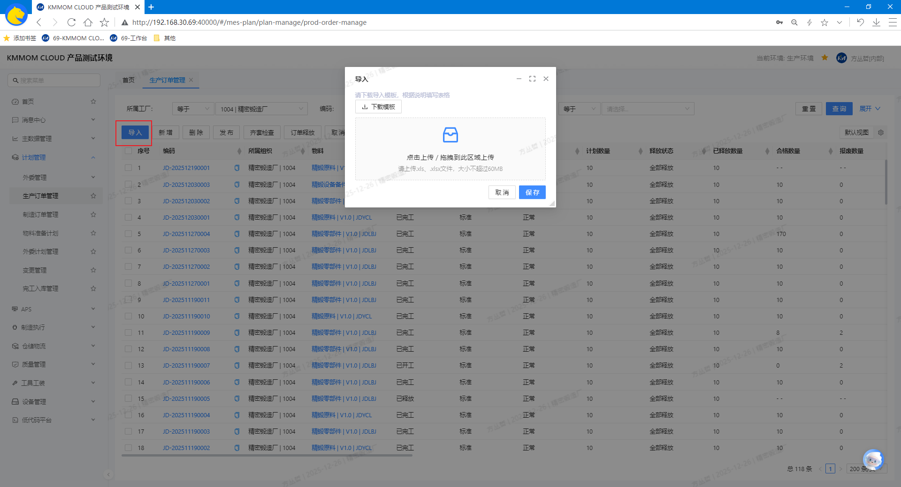
   - **编码**： 生产订单sheet页必填项，订单号唯一标识。
   - **所属组织**： 生产订单sheet页必填项，订单所属的组织。
   - **物料**： 生产订单sheet页必填项，订单计划生产的物料。
   - **数量**： 生产订单sheet页必填项，订单计划生产的物料数量。
   - **计划时间**： 生产订单sheet页必填项，订单计划的开始和结束时间。
   - **计划类型**： 生产订单sheet页必填项（无/零部件生产计划/零部件加工计划）,根据实际选择订单类型：
      - 零部件生产计划： 用于企业级生产管理部协同各制造厂的零部件生产计划，一级工艺展开后生成各制造厂的生产订单（即零部件加工计划）。
      - 零部件加工计划： 各制造厂的零部件加工计划。
   - **工艺路线**： 生产订单sheet页选填项，订单计划类型为 **零部件生产计划** 时，需要匹配当前组织下对应物料的一级工艺路线（也可导入后再手动指定）。
   - **密级**： 生产订单sheet页必填项，根据实际选择等级，用于数据访问权限控制。
   - **备料清单**： 备料清单sheet页，根据实际填写生产订单匹配的零部件物料所需的子物料（即原料）及数量
      - 为防止子物料无库存的情况，可填写可替代的子物料及数量。

#### 1.4. 发布订单
1. **手动发布**：勾选已创建状态的订单，点击 **发布** 按钮，发布状态更新为已发布。
2. **自动发布**：在 **业务组织配置** 中设置自动发布，通过excel文件导入后，生产订单自动发布。

#### 1.5. 齐套检查
1. 勾选需要进行齐套校验的订单，点击 **齐套检查**，在结果对话框查看生产订单备料清单的齐套情况。
   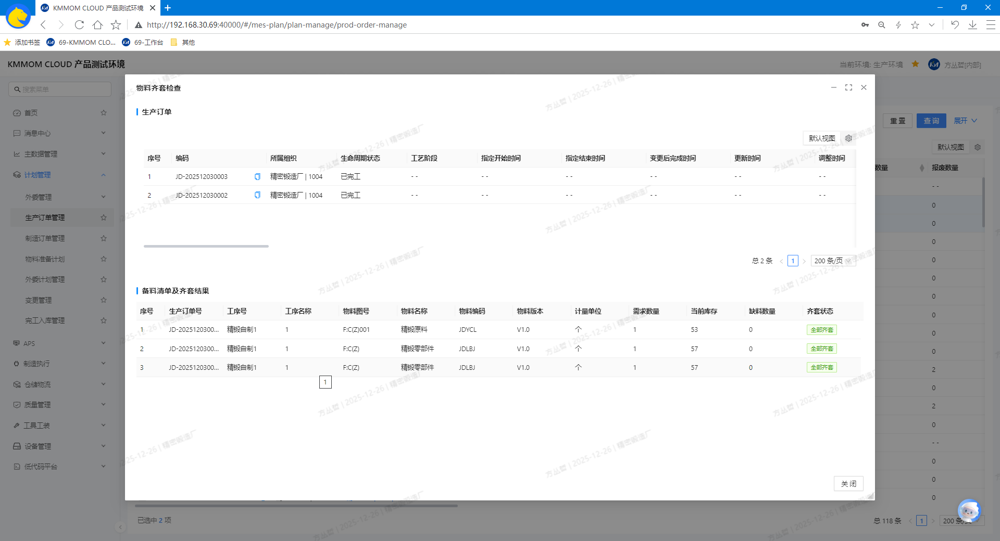

#### 1.6. 订单释放
1. **手动释放**：
   - 勾选单挑或多条已发布且准备下达的 **非零部件生产计划** 类型的订单，点击 **订单释放**，在释放界面核对订单信息，先选择选择释放方式，对单个订单或者多个订单进行 **释放** 操作（预释放）。
      - 释放方式默认上次选择（首次默认为“自由分配策略”），可手动更改为“剩余可释放数量策略”或“经济批量策略”）。
         - **经济批量策略**：根据物料计划参数的经济批量进行释放，不存在经济批量，则释放失败；
         - **剩余可释放数量策略**：根据剩余可释放数量直接生成制造订单；
         - **自由分配策略**：默认按经济批量拆完后进行修改或没维护经济批量时可进行自由拆分释放。
   - 确认预释放数据无误后，点击 **确认**，订单状态变更为已释放，并生成对应的制造订单。
   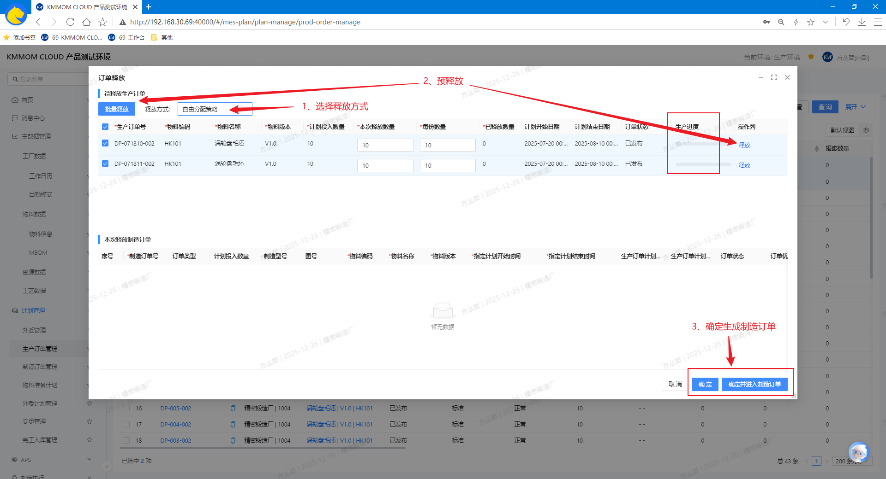
2. **自动释放**：在 **业务组织配置** 中设置自动释放，生产订单发布后自动根据剩余数量进行释放。
3. **自动生成物料准备计划**：
   - 在 **业务组织配置** 中默认设置释放后自动生成物料准备计划，当生产订单释放后，根据订单的备料清单自动生成对应的物料准备计划，后续可针对物料准备计划进行领料；
   - 关闭该配置，则不会生成物料准备计划，后续需要针对订单进行手动领料。

> **注意：**
> - 仅适用 **非零部件生产计划** 类型的订单。
> - 生产订单无物料清单，即使开启了自动生成物料准备计划，也不会生成物料准备计划。

#### 1.7. 取消/暂停/恢复
1. 勾选单个或多个目标订单，点击 **取消** 按钮，订单状态更新为已取消。
2. 勾选单个或多个目标订单，点击 **暂停** 按钮，订单状态更新为暂停，禁止继续派工与执行。
3. 勾选单个或多个暂停状态的订单，点击 **恢复** 按钮，订单状态更新为可执行状态。

#### 1.8. 指定优先级、工艺路线、计划员、计划时间
1. 勾选单条或者多条需指定的订单。
2. 点击 **指定**，在下拉菜单中选择具体操作项：
   - **指定优先级**：选择级别并确认，用于后续依据订单优先级策略排产。
      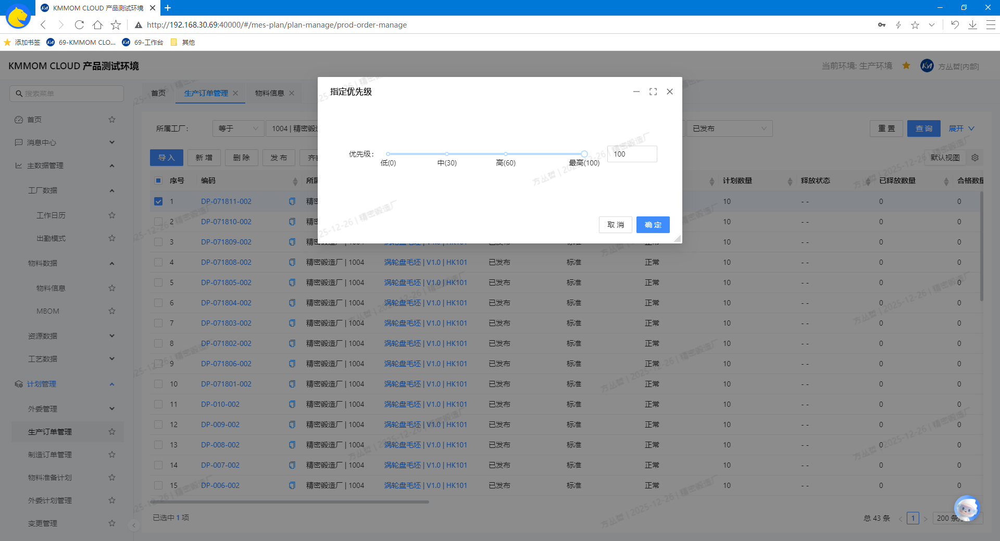
   - **指定工艺路线**：匹配”工厂 + 物料 + 物料版本“一致的工艺路线，根据实际情况选择工艺路线。
      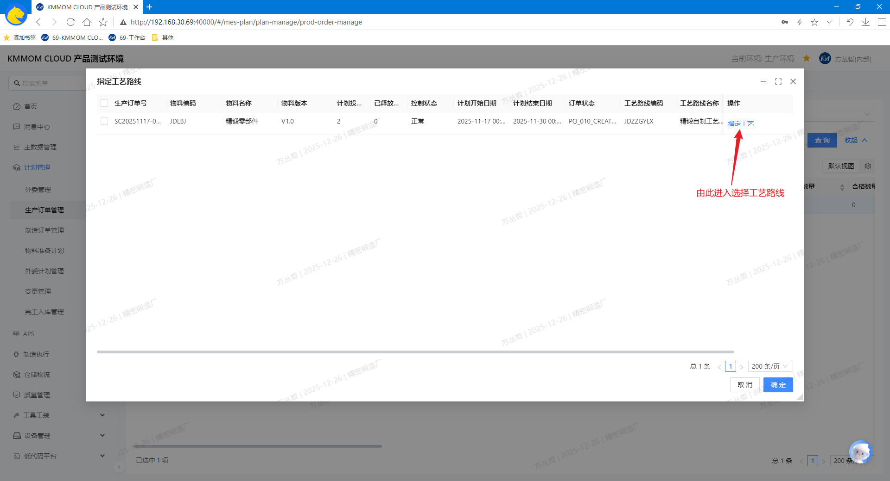
   - **指定计划员**：选择计划员并确认。
      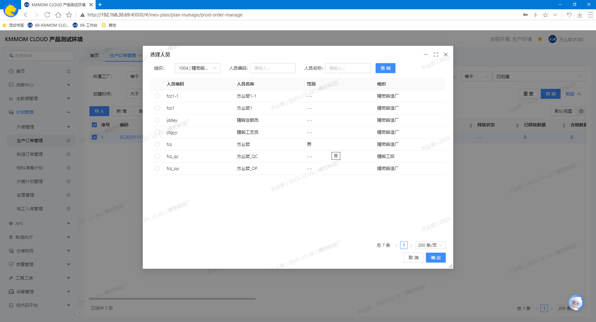
   - **指定计划时间**：设置开始/结束或承诺交期并确认（批量设置时，如果所有订单的计划时间相同，可设置一个后一键同步）。
      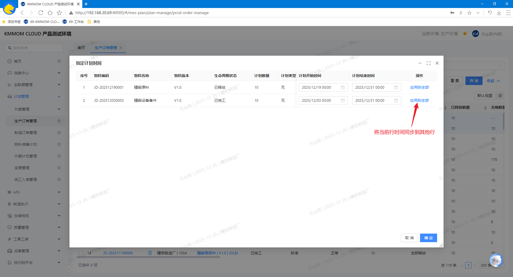

#### 1.9. 注意事项
- 发布与释放的含义不同：**发布**面向计划域；**订单释放**面向车间执行。
- 释放适用于 **非零部件生产计划** 类型的订单，零部件生产计划类型的订单无法释放。
- 批量操作前请务必勾选正确的订单，删除、取消、发布、释放等操作可能影响生产计划与执行。  
- 导入数据需严格遵循模板格式，字段缺失或类型错误将导致导入失败。  
- 暂停状态下的订单不可派工与执行；恢复后请重新校验资源与计划时间。  
- 仅有相应权限的用户可执行发布、释放、删除等敏感操作，如遇权限不足请联系系统管理员。

### 2. 制造订单管理
#### 2.1. 进入页面
1. 在左侧导航点击 **计划管理** → **制造订单管理**。
   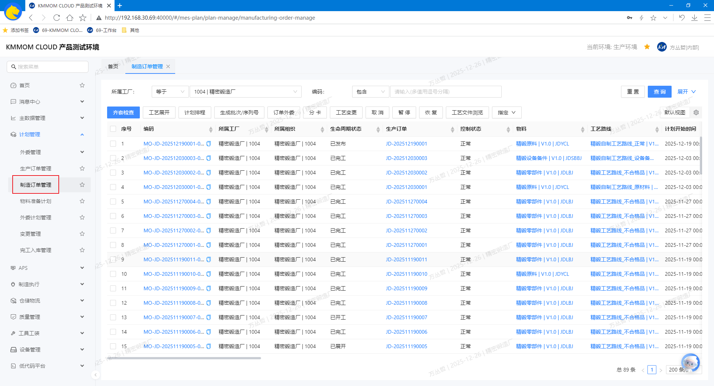

#### 2.2. 查询、查看详情
1. 在页面顶部设置筛选条件，查询目标制造订单数据。
2. 在列表中点击 **编号**，进入详情页面，在详情页中浏览**属性**、**序列号**、**分卡关系**。

#### 2.3. 齐套检查与领料
1. 在列表中勾选单个或者多个需要齐套领料的制造订单，点击 **齐套检查**，在齐套页面查看对应生产订单备料清单的齐套情况，可根据对应的生产订单释放时生成的 `物料准备计划` 进行领料。
   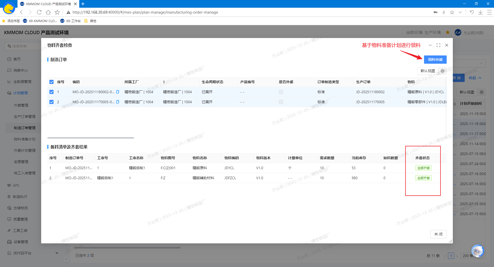

> **注意：**
> - 如果物料库存不足，则无法进行领料，需要先补充库存。
> - 生产订单无物料清单，则无法进行齐套检查与领料。

#### 2.4. 工艺展开
1. 勾选单个或者多个目标制造订单，点击 **工艺展开**，系统生成对应工序的制造任务。

> **注意：**
> - 无工艺路线的订单无法进行工艺展开。
> - 订单的工艺路线的工序无工作中心。

#### 2.5. 计划排程
1. **快捷跳转排程页面**：点击 **计划排程** 跳转到计划排程页面，需要手动添加制造订单。
2. **跳转排程页面自动添加订单**：勾选单个或者多个需排程的制造订单，系统将订单自动带入待排订单列表。

#### 2.6. 生成批次/序列号
1. 前提条件：
   - 编码规则中配置了**批次号**或**序列号**的生成规则；
   - 订单的物料必须启用了对应的**批次/序列号标记**。
2. 勾选单个或者多个目标制造订单，点击 **生成批次/序列号**，系统根据对应的 **批次号/序列号编码规则**，自动生成 **批次号**、**序列号**，也可手动维护。
   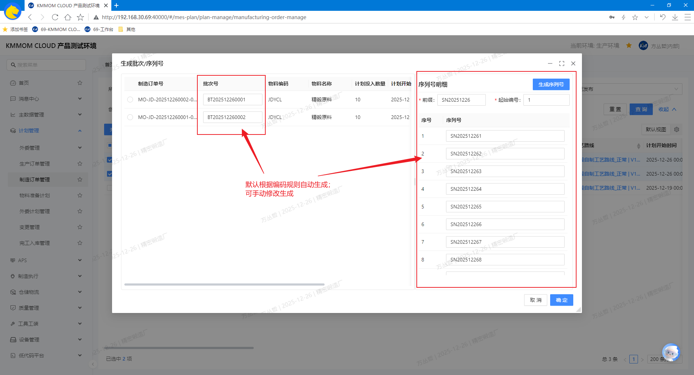

> **注意：**
> - 生成批次/序列号后，后续制造任务执行将会对批次/顺序号进行操作，不再输入执行数量。
> - 生成批次/序列号时，根据实际情况确定跟随系统默认规则，还是需要手动维护，一旦生成无法修改。

#### 2.7. 订单外委
1. 勾选单个或者多个需要外委的已发布的制造订单，点击 **订单外委**，选择外委工作中心、预发发货时间与预计返回时间。
   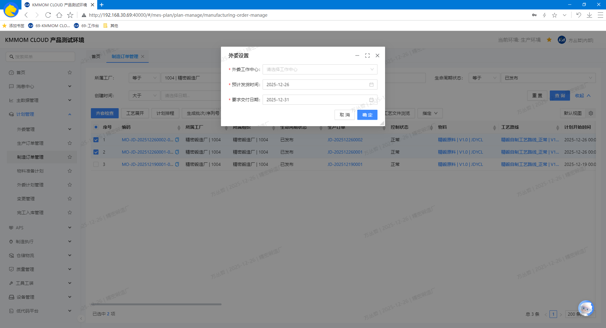

#### 2.8. 分卡
1. 勾选 **一个** 需拆分的制造订单，点击 **分卡**，选择分卡工序和分卡数量。
   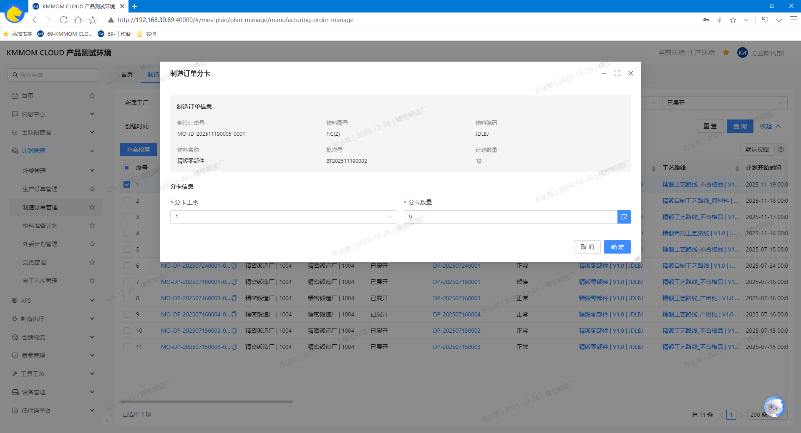

#### 2.9. 工艺变更
1. 勾选 **一个** 目标制造订单，点击 **工艺变更**，在弹窗中选择新的**工艺路线**与**版本**，核对影响工序与在制环节，必要时操作取消开工后再变更。
   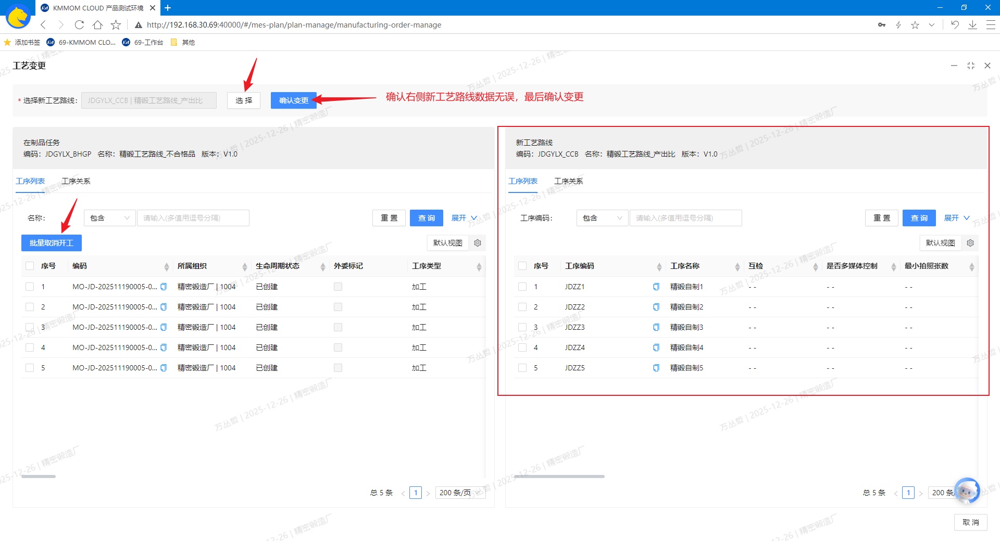

#### 2.10. 取消/暂停/恢复
1. 勾选单个或者多个需取消的制造订单，点击 **取消**，状态更新为已取消，订单将停止后续排程与执行。
2. 勾选单个或者多个需暂停的制造订单，点击 **暂停**，订单状态更新为暂停，禁止派工与报工。
3. 勾选单个或者多个处于暂停状态的制造订单，点击 **恢复**，订单恢复至可执行状态。

#### 2.11. 工艺文件浏览
1. 前提条件：在文件配置中 **配置浏览工具** 和 **配置模型工具**。
2. 在列表或详情中选择制造订单，点击 **工艺文件浏览**，在文件列表弹窗中选择文件浏览。

> **注意**：工艺文件浏览依赖浏览工具，若未配置，将无法查看。

#### 2.12. 指定操作（优先级、工艺路线、计划员）
1. 勾选单个或多个需要指定的制造订单，点击 **指定**，在下拉菜单中选择具体项：
   - **指定优先级**：选择等级并确认，用于后续工序任务依据优先级策略排产。
   - **指定工艺路线**：匹配”工厂 + 物料 + 物料版本“一致的工艺路线，根据实际情况选择工艺路线。
   - **指定计划员**：选择计划员并确认。

#### 2.13. 注意事项 
- **工艺变更** 会影响已展开的工序与在制数据，请在非生产高峰期操作，并通知相关岗位。  
- **取消** 为强制终止动作，已生成的子卡/外委任务需同步处理；**暂停/恢复** 适用于临时调整。  
- 工艺文件浏览依赖有效的文件版本与权限控制，若无法查看，请联系系统管理员。  
- 批量操作（指定、分卡、生成序列号等）请仔细核对勾选范围，避免误操作影响生产。