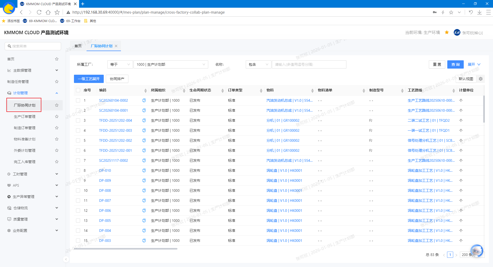
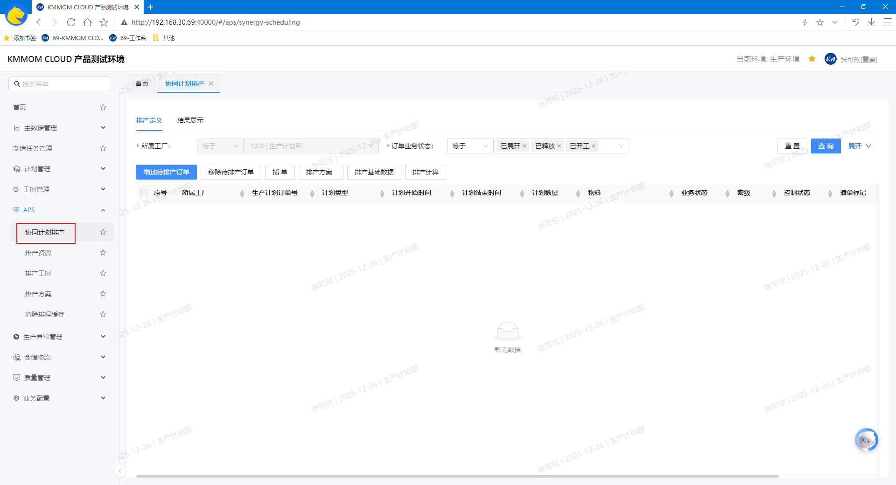

# 协同计划排产（AP）

## 功能概述
协同计划排产（AP）模块面向多工厂协同的离散型制造场景，提供统一排程与结果发布，并配套基础数据与策略管理能力。模块包含：**厂际协同计划**、**协同计划排产**、**工作日历**、**出勤**、**排产资源**、**排产工时**、**排产方案**、**排序规则扩展**，共同支撑跨厂计划的透明度与执行一致性。  
- 适用对象：主生产订单（计划域，对应零部件生产计划）与子生产订单（车间域，对应零部件加工计划）。  
- 排程参考：基于资源、工作日历、出勤、物料、资源能力与零部件加工计划时间锁定，按方案配置的方法/方向/排序规则/分派策略/弱约束优先级执行。

## 核心功能
- **厂际协同计划**：跨厂协调、合作生产计划，协调不同工厂的生产资源、时间与质量。
- **协同计划排产**：依据订单优先级、剩余时间与资源约束，生成零部件加工计划的可执行计划。
- **排程基础数据**：包含**资源**、**日历**、**出勤**、**物料**、**零部件加工计划**、**资源能力**，为排产提供可用性、时长与分派约束的依据。
- **排产资源**：维护工作中心/设备能力参数、效率与优先度，用作资源分派。
- **排产工时**：维护工艺路线工序工时与计算口径，作为排程时长依据。
- **排产方案**：配置排程方法、方向策略与弱约束优先级。
- **排序规则扩展**：按业务自定义订单/任务排序组合，支持扩展与复用。
- **计划排产配置（业务配置）**：在“业务配置”中统一维护排产资源分类、排产锁定规则、排产锁定期限、排产标准时间，排程时引用该配置。

## 前置条件
有 **零部件生产计划** 类型的生产订单，且匹配对应的 **一级工艺** 类型的工艺路线（参考文档： [生产制造计划管理](/view/04-核心模块/02-生产计划/01-生产制造计划管理.md) 下“1.2”、“1.3”、“1.8”的 **新增**、**导入**、**指定工艺路线** 功能）。

## 操作指南

### 1. 排产资源
参考文档： [工序计划排程](/view/04-核心模块/02-生产计划/03-工序计划排程.md) 下的“1. 排产资源”功能。

### 2. 排产工时
参考文档： [工序计划排程](/view/04-核心模块/02-生产计划/03-工序计划排程.md) 下的“2. 排产工时”功能。

### 3. 排产方案
参考文档： [工序计划排程](/view/04-核心模块/02-生产计划/03-工序计划排程.md) 下的“3. 排产方案”功能。

### 4. 排序规则扩展
参考文档： [工序计划排程](/view/04-核心模块/02-生产计划/03-工序计划排程.md) 下的“4. 排序规则扩展”功能。

### 5. 厂际协同计划
#### 5.1. 进入页面
1. 在左侧导航点击 **APS** → **厂际协同计划**。

#### 5.2. 查询
1. 在顶部筛选区输入查询条件，点击 **查询** 按钮，查询目标订单数据。

#### 5.3. 一级工艺展开
1. 在查询结果中勾选一个或者多个订单，点击 **一级工艺展开** 按钮，按照一级工艺路线中的工序生成对应工厂的生产订单（即零部件加工计划）。

#### 5.4. 计划排产
1. 不勾选订单，点击 **计划排产** 按钮，跳转到系统计划排产页面
2. 勾选一个或者多个订单，点击 **计划排产** 按钮，跳转到协同计划排产页面，并将勾选的订单加入待排产列表。

#### 5.5. 注意事项
- “零部件生产计划”类型的生产订单在生产订单管理页面导入，一级工艺展开在厂际协同计划页面操作。
- “零部件生产计划”类型生产订单只能匹配对应的“一级工艺”类型的工艺路线，不能匹配其他类型的工艺路线。

### 6. 协同计划排产
#### 6.1. 进入页面
1. 在左侧导航点击 **APS** → **协同计划排产**。

#### 6.2. 排产定义
1. 设置筛选条件，查询待排产订单中目标订单数据。
2. 增加待排产订单：点击 **增加待排产订单**，在弹窗中再次筛选并勾选单个或多个目标订单加入待排产列表。
3. 移除待排产订单：在订单列表中勾选已加入的待排产订单，点击 **移除待排产订单** 移除目标订单。
4. 插单：勾选单个或多个需紧急插入排产的订单，点击 **插单**，系统对该订单加注插单标记；再次点击可取消标记。
5. 选择排程方案：点击 **排程方案** 打开列表，选择目标方案；如需调整，点击方案后更换为新方案。
6. 维护排程基础数据：
   - 鼠标移至 **排程基础数据**，选择 **资源**、**日历**、**出勤**、**物料**、**资源能力**，跳转到对应的菜单页面：**排产资源**、**工作日历**、**出勤模式**、**物料**、**排产工时**，维护对应数据；
   - 选择 **零部件加工计划**，弹出零部件加工计划 **时间锁定** 窗口，使用 **时间锁定** 固定开始时间和时长。
7. 启动排产计算：确认“待排产订单”、排产方案与基础数据无误，点击 **排产计算**，系统按方案与约束生成结果并切换至 **结果展示**。

#### 6.3. 结果展示
1. 在顶部功能区根据查询条件对结果列表中数据进行筛选。
2. 查看结果标签页：
   1) **零部件生产计划列表（已排产）**：展示成功排产订单。  
   2) **零部件加工计划列表（约束冲突）**：展示未完全满足约束但已计算的订单。  
   3) **零部件加工计划列表（排产失败）**：展示计算失败订单与原因。  
   4) **零部件加工计划列表**：查看子订单的时间、资源分配等。  
   5) **订单甘特图**：查看各订单及子订单的计划时间轴。  
   6) **资源甘特图**：查看资源占用与空闲时间分布。
3. 发布结果：点击 **发布结果**，将排产结果更新到对应的零部件加工计划。

#### 6.4. 注意事项
- 协同计划排产功能可参考 **工序计划排程** 模块排程功能。
- 排产前请确保 **基础数据**（资源、日历、出勤、物料、资源能力、零部件加工计划）和 **排产方案** 完整且最新；数据缺失将导致结果失真或计算失败。
- **插单影响**：插单提升优先级，但仍受时间与资源约束；请评估对在制任务的影响。
- **锁定适度**：过多的时间锁定会降低可行解比例；建议仅对关键任务锁定。
- **资源量一致**：资源量参与甘特与负荷计算；请与资源能力、出勤口径保持一致。
- **跨厂协同**：建议在非生产高峰期执行协同排产，并在发布前完成审批与数据核验。
- **权限控制**：方案编辑、基础数据维护、发布结果等无权限，请联系系统管理员。