# 工序计划排程（AS）

## 功能概述
工序计划排程（AS）模块面向多品种小批量的离散型制造业，统一提供排程计算与基础数据维护能力，模块包含：**工序计划排程**、**工序计划排程**、**排程基础数据（资源、日历、出勤、物料、制造任务、资源能力）**、**排产方案** 与 **排序规则扩展**。支持：**筛选与查询**、**增加/移除待排程订单**、**插单标记**、**排程方案选择与编辑**、**时间/资源锁定**、**排程计算**、**结果发布**，并以 **订单甘特图**、**资源甘特图** 展示结果。
- 适用对象：制造订单与制造任务（车间域）。  
- 排程参考：基于资源、工作日历、出勤、物料、资源能力与制造任务时间锁定，按方案配置的方法/方向/排序规则/分派策略/弱约束优先级执行。

## 核心功能：
- **工序计划排程**：依据订单优先级、剩余时间与资源约束，生成可执行计划。
- **排程基础数据**：包含**资源**、**资源能力**、**日历**、**出勤**、**物料**、**制造任务**，为排程提供可用性、时长与分派约束的依据。
- **排产资源**：维护工作中心/设备能力参数、效率与优先度，用作资源分派。
- **排产工时**：维护工艺路线工序工时与计算口径，作为排程时长依据。
- **排产方案**：配置排程方法、方向策略与弱约束优先级。
- **排序规则扩展**：按业务自定义订单/任务排序组合，支持扩展与复用。
- **计划排产配置（业务配置）**：在“业务配置”中统一维护排产资源分类、排产锁定规则、排产锁定期限、排产标准时间，排程时引用该配置。

## 操作指南

### 1. 排产资源
#### 1.1. 进入页面
1. 在左侧导航点击 **APS** → **排产资源**。
   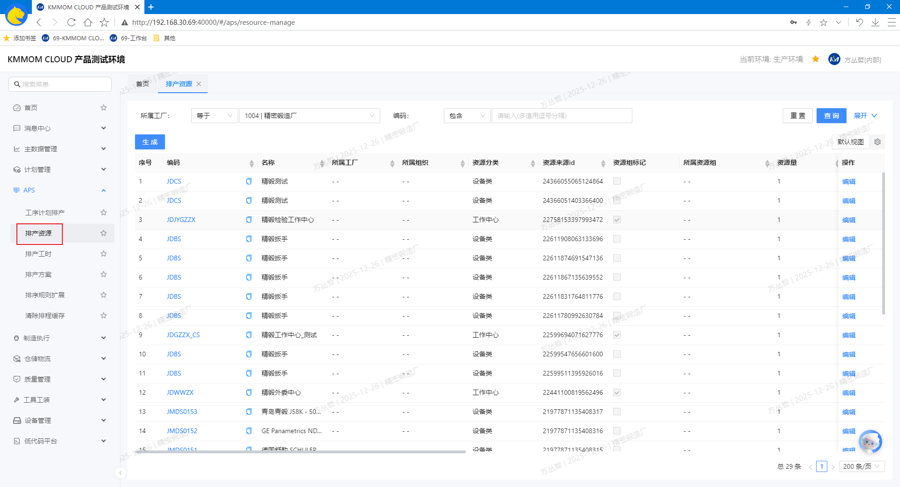

#### 1.2. 生成
1. 点击列表上方 **生成**，生成当前组织下所有资源数据，包括 **工作中心** 和 **设备**。
2. 同时根据当前组织的工作日历自动生成对应的资源日历。

#### 1.3. 查询
1. 在筛选区设置查询条件，查询生成的目标资源数据。

#### 1.4. 编辑（能力参数）
1. 在列表中点击 **编辑**，打开编辑表单，可维护 **资源量** 和 **制造效率(百分比)** 字段。
   - **资源量**：资源的数量。
   - **制造效率(百分比)**：资源在单位时间内的产出效率，范围为0.0-100.0。

#### 1.5. 注意事项
- 生成能力前请确保：**工作中心**、**设备**、**工作日历**、**出勤**已配置并启用；否则生成数据为空。
- **权限控制**：生成与批量编辑为敏感操作，需具备相应权限；无权限请联系系统管理员。
- **数据生效**：编辑保存后即时生效；若排程已在计算中，建议完成编辑后再启动新的排程计算。

### 2. 排产工时
#### 2.1. 进入页面
1. 在左侧导航点击 **APS** → **排产工时**。
   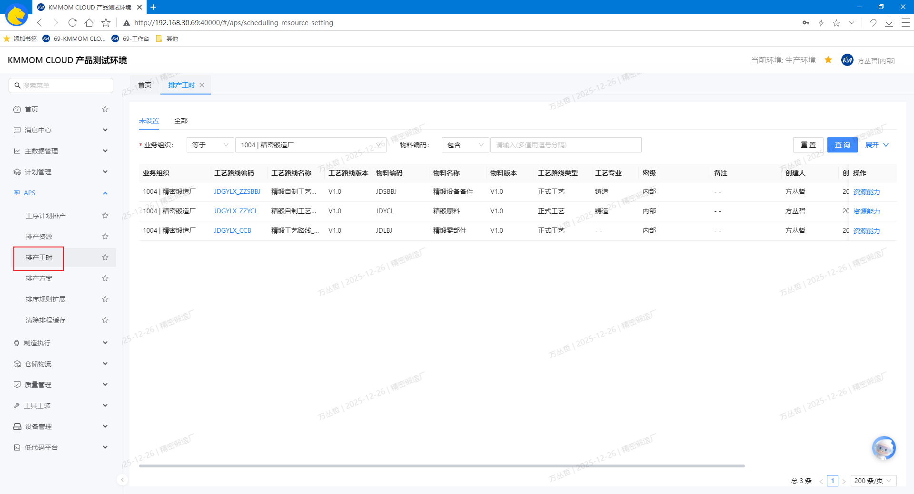

#### 2.2. 查询
1. 在顶部筛选区设置条件，查询目标工艺路线数据。
2. 默认显示工艺路线未设置排产工时的 **未设置** 标签页，可切换到已设置的 **全部** 标签页。

#### 2.3. 编辑
1. 在列表中选择目标工艺路线数据，点击 **资源能力**，弹出排产工时设置弹窗。
   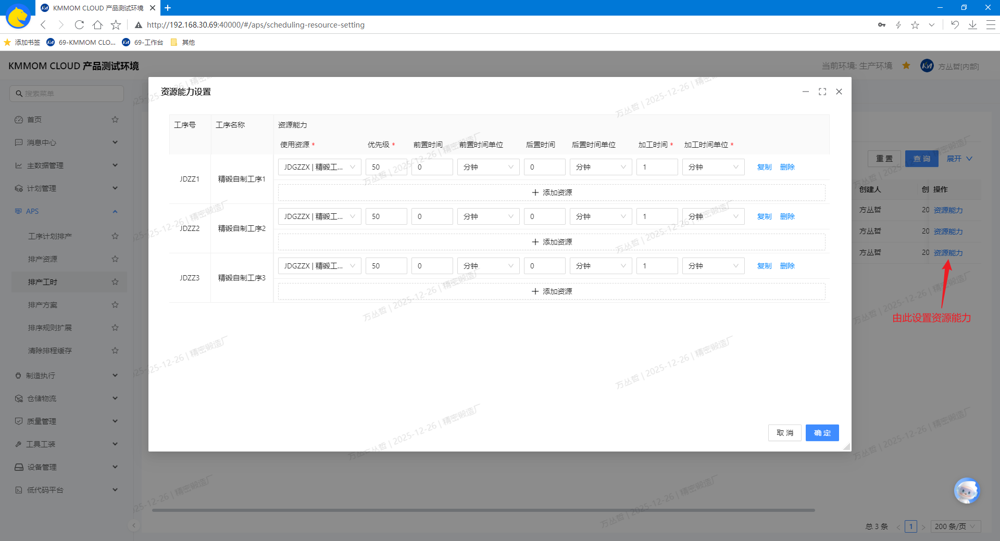
2. 在弹窗中设置每个工序的排产工时，每个工序可设置多个工作中心，根据实际情况选择对应的时间单位（**分钟**、**小时**、**天**、**件/天**、**天/件**等）。

### 3. 排产方案
#### 3.1. 进入页面
1. 在左侧导航点击 **APS** → **排产方案**。
   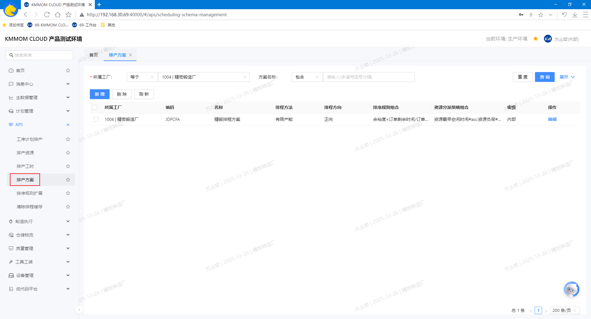

#### 3.2. 增、查、删、改
1. 在顶部筛选区设置条件，查询目标排产方案数据。
2. 点击列表上方 **新增**，打开新增对话框，根据实际情况填写排产方案信息，保存后生效。
   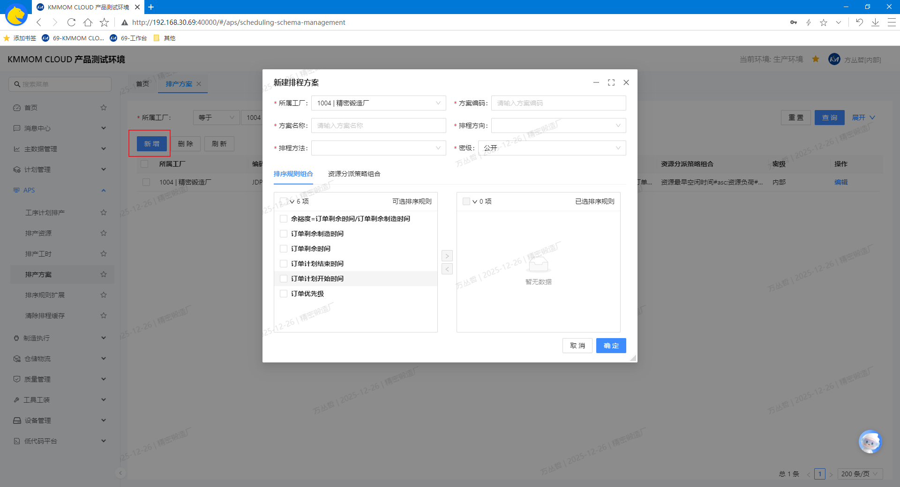
   - **方案编码**（必填，唯一）。  
   - **方案名称**（必填，唯一）。  
   - **排程方法**：选择 “有限产能” 或 “无限产能”。  
   - **排程方向**：选择 “正向” 或 “逆向” 或 “逆向-允许转正向”。  
   - **排序规则组合**：
      - 从左侧系统中存在的排序规则中选择当前方案所需要的排序规则到右侧；
      - 可在右侧调整规则上下位置顺序，设置规则优先级，系统将按顺序应用规则；
      - 未选择规则，则系统默认规则。  
   - **资源分派策略组合**：
      - 从左侧系统中存在的资源分派策略中选择当前方案所需要的策略到右侧；
      - 可在右侧调整策略上下位置顺序，设置策略优先级，系统将按顺序应用策略；
      - 未选择策略，则系统默认策略。
3. 在列表中点击操作列 **编辑**，进入详情编辑，根据需要调整：**排程方法**、**排程方向**、**排序规则组合**、**资源分派策略组合**，保存后生效。
4. 在列表左侧勾选单个或者多个需要删除的方案，点击 **删除** 并二次确认删除成功后列表移除相关方案

### 4. 排序规则扩展
#### 4.1. 进入页面
1. 在左侧导航点击 **APS** → **排序规则扩展**。
   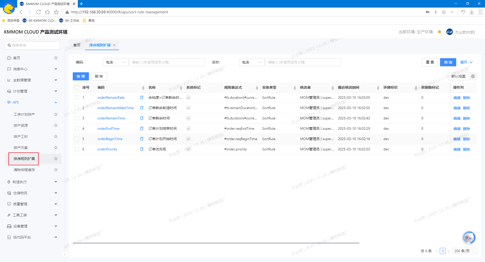

#### 4.2. 增、查、删、改
1. 在顶部筛选区设置条件，查询目标排序规则数据。
2. 点击列表上方 **新增**，打开新增对话框，根据实际情况填写排序规则信息。
   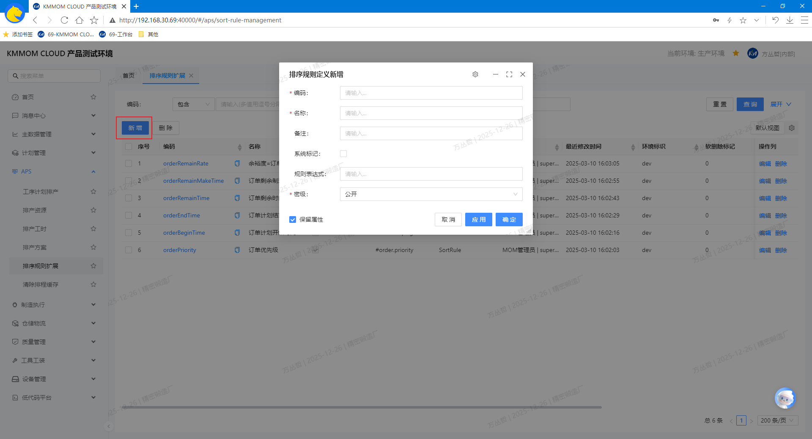
   - **规则编码**（必填，唯一）。   
   - **规则表达式**：根据实际需求，使用 “APS通用语法” 编写当前规则表达式。
3. 在列表中点击操作列 **编辑**，进入详情编辑，根据需要调整各字段信息，保存后生效。
4. 在列表左侧勾选单个或多个需要删除的规则，点击 **删除** 并二次确认，删除成功后列表移除相关记录；或者在目标规则数据行后点击 **删除**，删除当前规则数据。

> **注意**：若规则被 **排程方案** 引用，系统将提示不可删除。

#### 4.3. 注意事项
- 产品会默认自带一些排序规则，不建议删除或修改，如有需要可自定义排序规则。
- 自定义规则表达式需符合 “APS通用语法”，否则系统将视为无效。
- **唯一性校验**：**规则编码** 必须唯一；重复编码将拒绝保存或导入。
- **有效性校验**：规则算法需在系统预设范围内；非法表达式会提示“规则参数无效，请重新填写/选择”。
- **组织适用范围**：默认所有组织共用排序规则，修改规则前需确认达成共识。
- **删除限制**：被**排程方案**引用中的规则不可删除；请先在方案中移除再执行删除。
- **组织权限**：如无法维护排序规则，需联系系统管理员申请权限。

### 5. 工序计划排程
#### 5.1. 进入页面
1. 在左侧导航点击 **APS** → **工序计划排产**。
   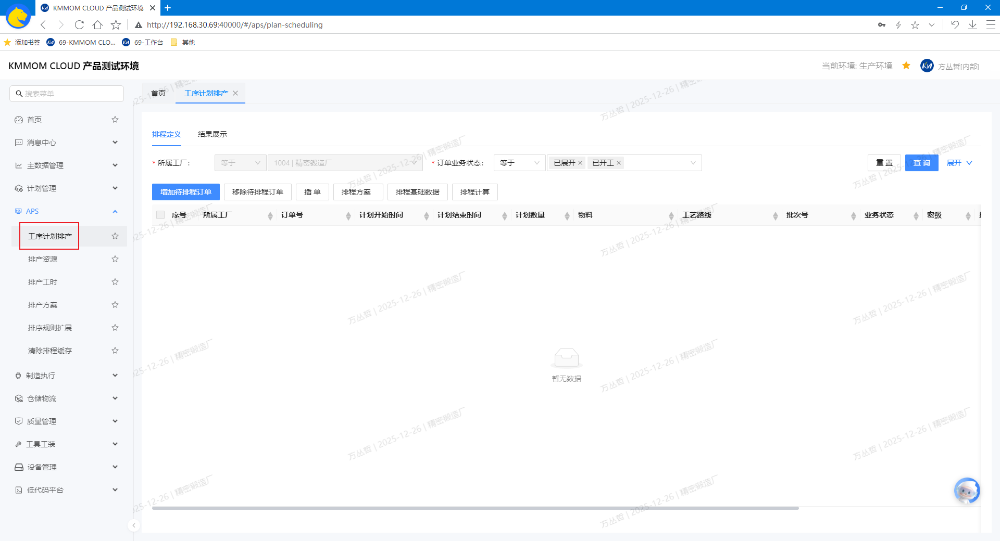

#### 5.2. 排程定义
1. 设置筛选条件，查询待排程订单中目标订单数据。
2. 增加待排程订单：点击 **增加待排程订单**，在弹窗中再次筛选并勾选单个或多个目标订单加入待排程列表。
3. 移除待排程订单：在订单列表中勾选已加入的待排程订单，点击 **移除待排程订单** 移除目标订单。
4. 插单：勾选单个或多个需紧急插入排程的订单，点击 **插单**，系统对该订单加注插单标记；再次点击可取消标记。
5. 选择排程方案：点击 **排程方案** 打开列表，选择目标方案；如需调整，点击方案后更换为新方案。
6. 维护排程基础数据：
   - 鼠标移至 **排程基础数据**，选择 **资源**、**日历**、**出勤**、**物料**、**资源能力**，跳转到对应的菜单页面：**排产资源**、**工作日历**、**出勤模式**、**物料**、**排产工时**，维护对应数据；
   - 选择 **制造任务**，弹出制造任务 **时间、资源锁定** 窗口，使用 **时间锁定** 固定开始时间和时长，或 **资源锁定** 固定使用资源。 
      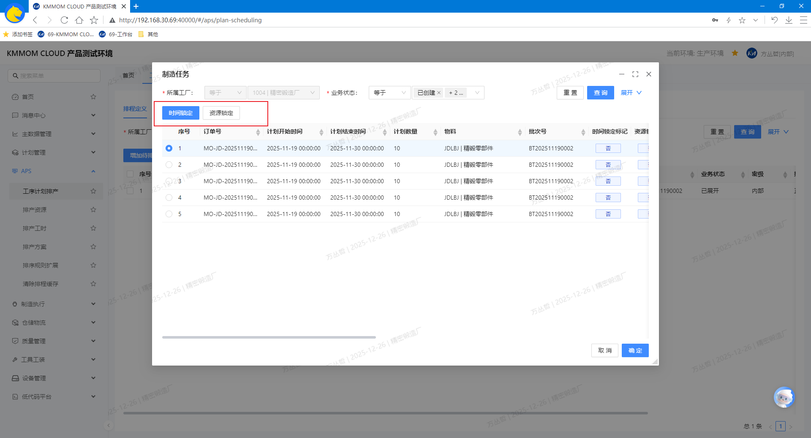
7. 启动排程计算：确认“待排程订单”、排程方案与基础数据无误，点击 **排程计算**，系统按方案与约束生成结果并切换至 **结果展示**。
   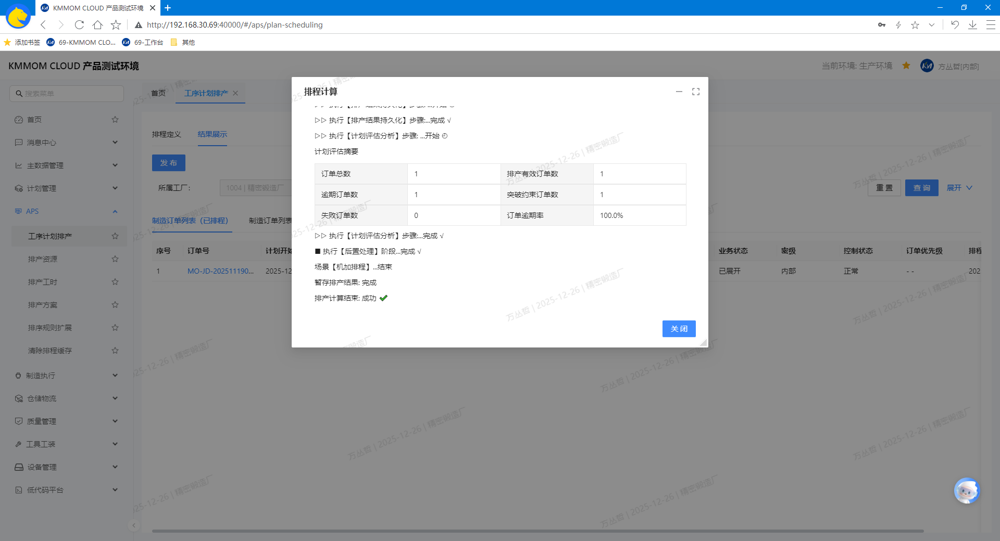

#### 5.3. 结果展示
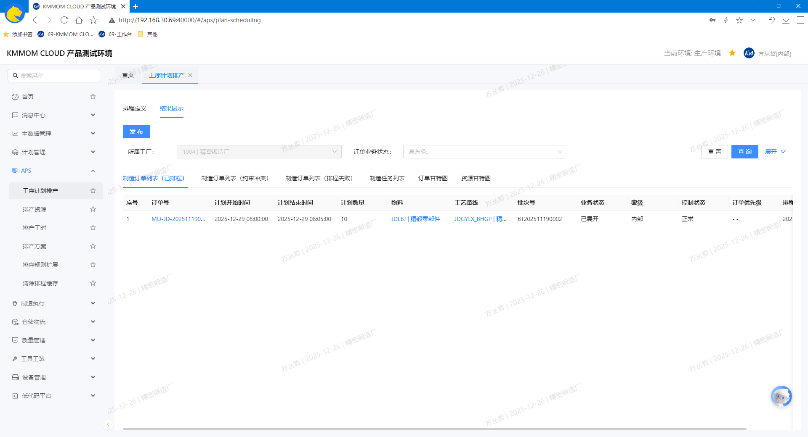
1. 在顶部功能区根据查询条件对结果列表中数据进行筛选。
2. 查看结果标签页：
   1) **制造订单列表（已排程）**：展示成功排程订单。  
   2) **制造订单列表（约束冲突）**：展示未完全满足约束但已计算的订单。  
   3) **制造订单列表（排程失败）**：展示计算失败订单与原因。  
   4) **制造任务列表**：查看任务的时间、资源分配等。  
   5) **订单甘特图**：查看各订单及任务的计划时间轴。  
   6) **资源甘特图**：查看资源占用与空闲时间分布。
3. 发布结果：点击 **发布结果**，选择更新范围（**未派工**、**自动派工**、**手工派工**等派工方式），将排程结果更新到对应派工方式的制造任务。

#### 5.4. 注意事项
- 排程前请确保 “基础数据”（资源、日历、出勤、制造BOM、制造任务）和 “排程方案”（包括排序规则）为最新且有效，数据缺失或异常会导致计算失败或结果失真。  
- 插单标记会提升订单的排程优先级，但仍受资源与时间约束影响；请谨慎使用并评估对在制任务的影响。  
- 时间/资源锁定为强约束，锁定过多会降低解的可行性；建议仅对关键任务进行锁定。  
- 约束冲突结果需人工复核并修正基础数据或方案参数后重新计算，避免直接发布。  
- 发布结果会触发任务时间与资源的回写与下达，请确认更新范围与下游流程设置；必要时先在仿真环境验证。  
- 相关操作受权限控制（方案编辑、结果发布、基础数据修改等），如无法执行请联系系统管理员。
