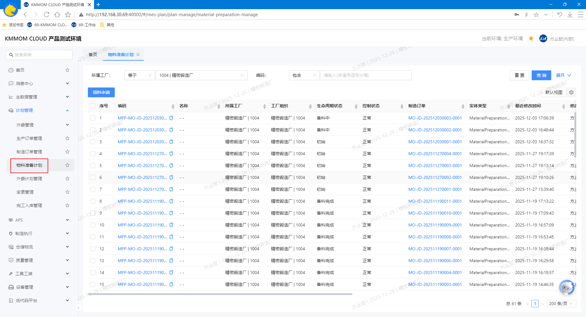
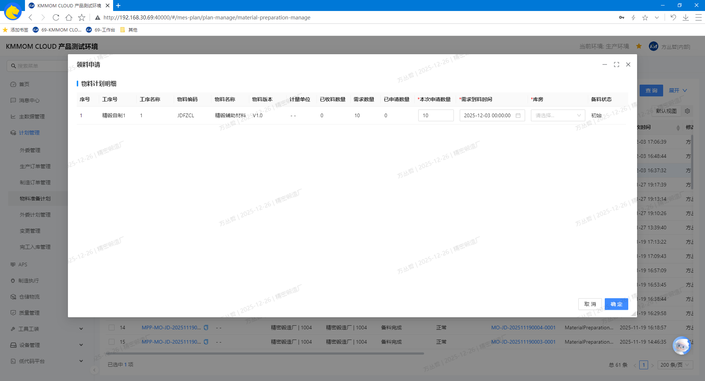

# 物料准备计划

## 功能概述
物料准备计划页面用于在生产前对关键物料进行准备与管控，支持按条件快速查询准备任务，发起 **领料申请** 以满足制造订单的物料需求，并在任务详情页进行跟踪与维护。

## 操作指南

### 1. 进入页面
1. 在左侧导航点击 **计划管理** → **物料准备计划**。  
    

### 2. 查询、查看详情
1. 在页面顶部设置筛选条件，查询目标物料准备计划数据。
2. 在列表中点击物料准备计划的 **编码**，进入详情页面查看 **基础属性**、**物料需求计划明细**、**领料申请明细**、**收料确认明细** 等详细信息。

### 3. 领料申请
1. 在列表中勾选 **一个** 需要发起领料的物料准备计划，点击 **领料申请** 按钮，基于当前计划进行领料。
    

> **注意：**
> - 仅可对状态为 **初始** 的物料准备计划发起领料申请。
> - 申请数量请与制造订单或工序需求保持一致，避免过量或不足导致生产中断。
> - 物料库存不足时，无法发起申请。
> - 对应生产订单无物料清单，无法发起申请。

## 注意事项
- 领料申请需遵循库存与权限管控，若无可用库存或权限不足，将无法申请。   
- 对紧急订单，建议在提交时标注用途说明并与仓库沟通确认发料时效。 
- 不同工厂/车间的仓库配置可能不同，选择仓库与库位时请确认正确性以免造成错发。