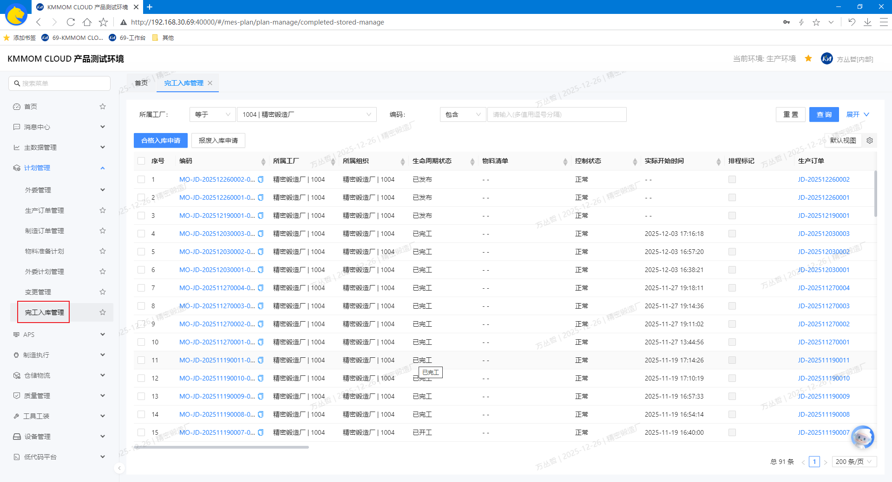
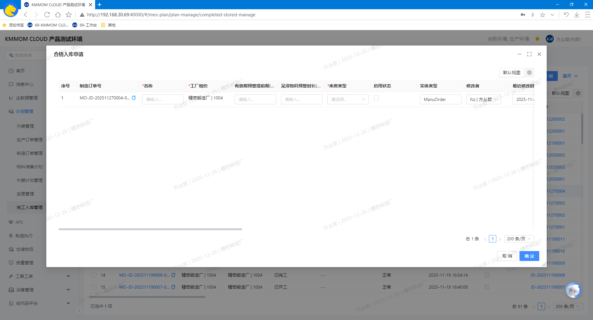

# 完工入库管理

## 功能概述
完工入库管理页面用于对已完工产品或部件进行入库处理与追溯，支持按条件 **查询**，发起 **合格入库申请** 与 **报废入库申请**，并通过 **查看详情** 掌握入库记录、质检结果与关联制造订单信息。  

## 操作指南

### 1. 进入页面
1. 在左侧导航点击 **计划管理** → **完工入库管理**。
    

### 2. 查询、查看详情
1. 在页面顶部设置筛选条件，查询目标制造订单数据。
2. 在列表中点击数据行的 **编码**，可进入对应对象的详情页面查看具体详情。

### 3. 合格入库申请
1. **手动申请**：在列表中勾选单个或者和多个已完工合格的制造订单，点击 **合格入库申请**，系统生成合格入库单。
    
2. **自动申请**：在 **业务配置** 中配置对应物料类别的合格品完工入库库房，系统会在制造订单完成后自动发起合格入库申请。

### 4. 报废入库申请
1. **手动申请**：在列表中勾选单个或者和多个已完工报废的制造订单，点击 **报废入库申请**，系统生成报废入库单。
2. **自动申请**：在 **业务配置** 中配置对应物料类别的废品完工入库库房，系统会在制造订单完成后自动发起报废入库申请。

## 注意事项
- 入库前应确保质检结论是否正确，并与制造订单产出一致；数量与批次信息不一致将导致入库失败。  
- 入库仓库与库位受权限与可用状态限制，若无法选择或提交，请联系仓库管理员确认配置。  
- 批次/序列管理开启时，入库必须关联有效的批次/序列号；重复入库或缺失信息将被系统拦截。  
- 对紧急入库需求，请在申请备注中说明原因并与仓库/质检沟通，避免生产等待。  
