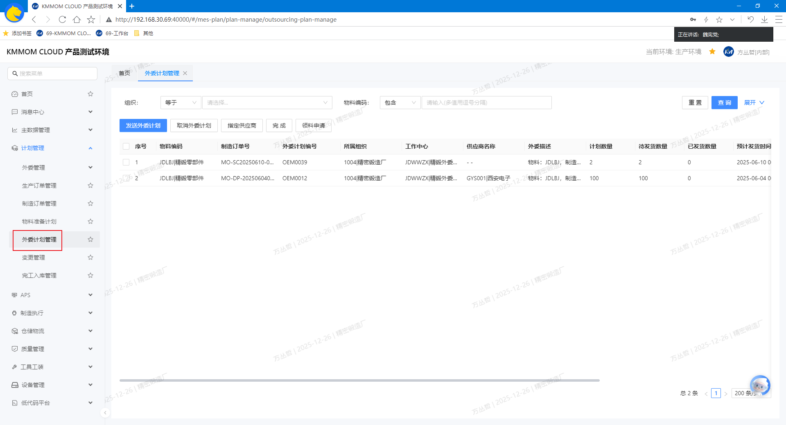
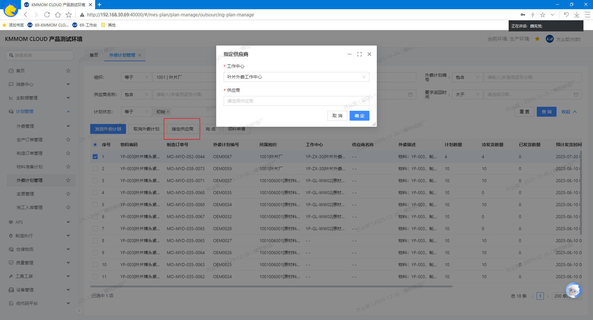
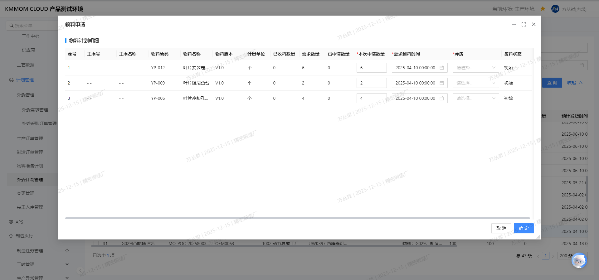

# 外委计划管理

## 功能概述
外委计划管理页面用于对制造订单或工序的外委任务进行统一编排与跟踪。用户可按条件 **查询** 外委计划，执行 **发送外委计划**、**取消外委计划**、**指定供应商**、**完成** 与 **领料申请** 等操作，并可在详情中查看外委进度与相关记录。

## 操作指南

### 1. 进入页面
1. 在左侧导航点击 **计划管理** → **外委计划管理**。
2. 系统打开外委计划列表，默认加载当前工厂的数据。  

### 2. 查询
1. 在页面顶部设置筛选条件（如：**所属工厂**、**车间**、**物料**、**外委类型**、**状态**、**计划时间**）。
2. 在搜索框输入关键词（如：**制造订单号**、**外委单号**、**供应商名称**）。
3. 点击 **查询**，列表展示符合条件的外委计划。
4. 点击 **重置** 清空筛选条件并恢复默认视图。

### 3. 指定供应商
1. 勾选需要指定供应商的外委计划（支持批量）。
2. 点击 **指定供应商**。
3. 在弹窗中选择 **工作中心** 和 **供应商**。
4. 点击 **确认**，系统保存供应商信息并更新计划状态。

### 4. 发送外委计划
1. 勾选已完成供应商指定且准备下发的外委计划。
2. 点击 **发送外委计划**，状态更新为已发送，并生成外委任务与流转记录。

### 5. 取消外委计划
1. 勾选需取消的外委计划（仅支持初始状态或已发送状态）。
2. 点击 **取消外委计划**，状态更新为已取消，相关通知同步发送至供应商与相关岗位。

### 6. 完成
1. 勾选供应商已按要求交付的外委计划。
2. 点击 **完成**，状态更新为已完成。

### 7. 领料申请
1. 勾选需要提供原材料的外委计划（仅支持初始状态或已发送状态）。
2. 点击 **领料申请**。
3. 在申请窗口填写：**库房**、**领料数量**、**需求时间**。
4. 点击 **确定** 生成领料单，状态列显示申请进度。

## 注意事项
- 发送前请确认供应商资质、合同条款与交付能力，避免计划无法执行。  
- 外委取消可能涉及合同与物流变更，请事前沟通并在系统中完整记录原因。  
- 领料申请需遵循库存与权限管控，数量应与外委需求一致，避免过量或不足。  
- 完成验收应依据工艺与检验规范，合格与不合格记录需可追溯。  
- 重复发送同一外委计划会造成冲突，请在列表中核对状态与数量。  
- 部分敏感操作需要相应权限，若无法执行请联系系统管理员。