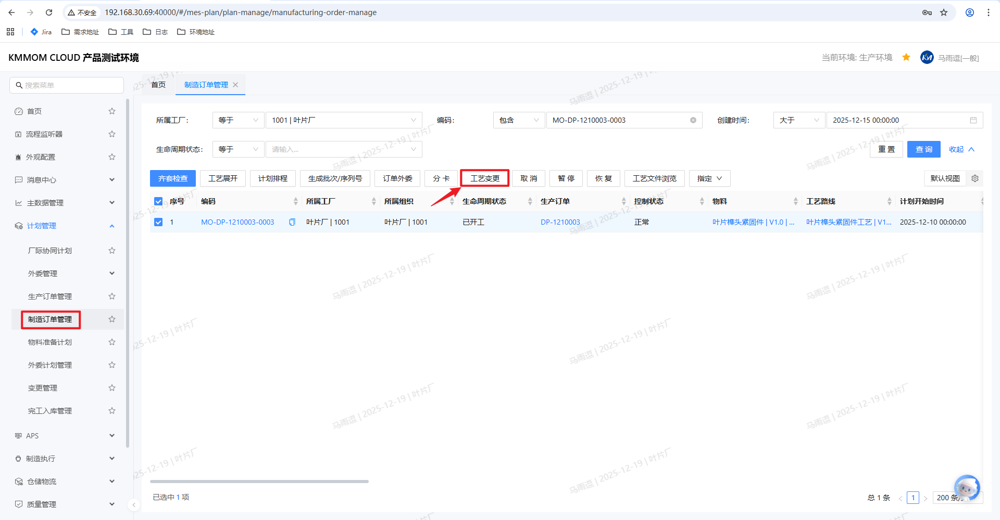
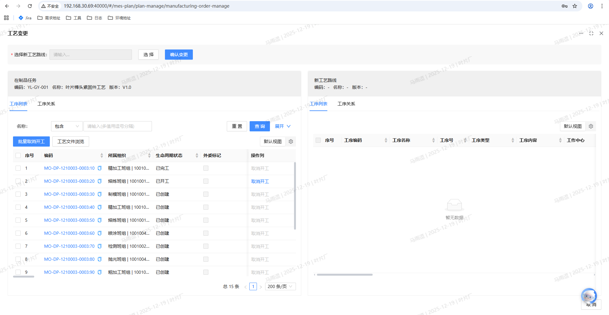
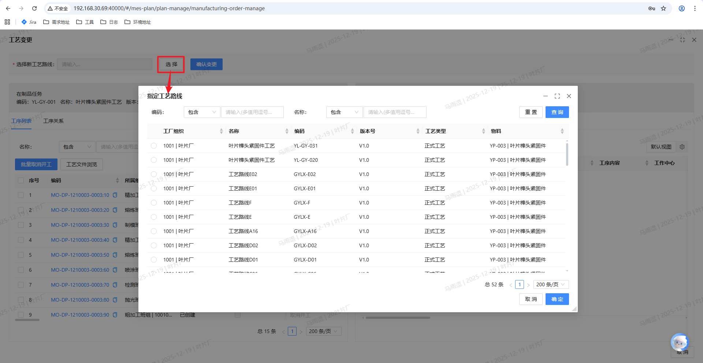
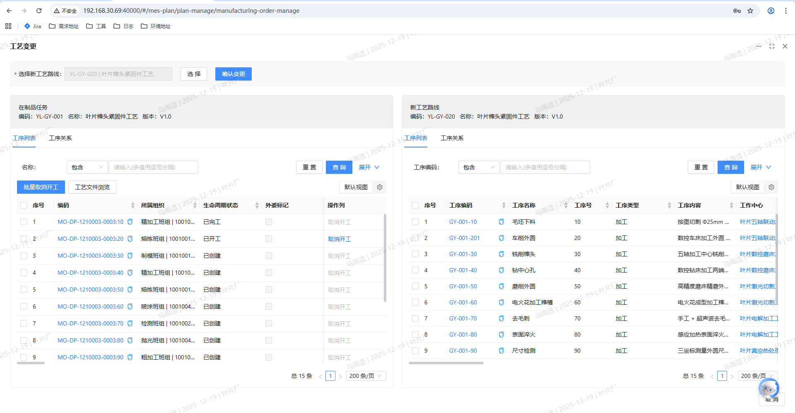
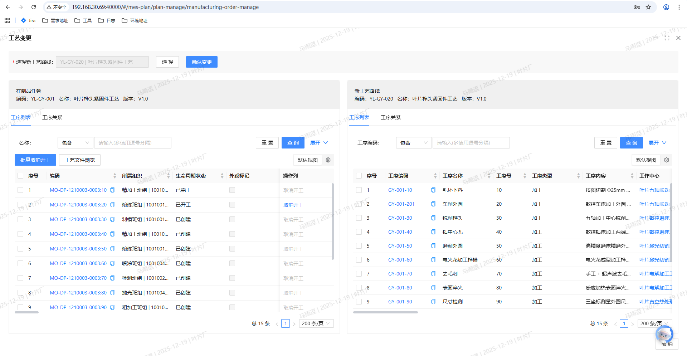
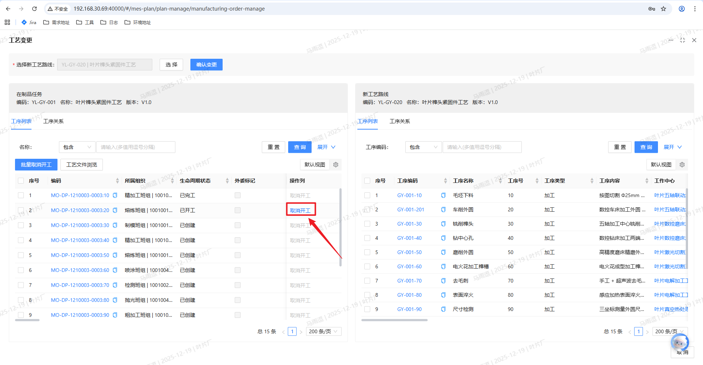
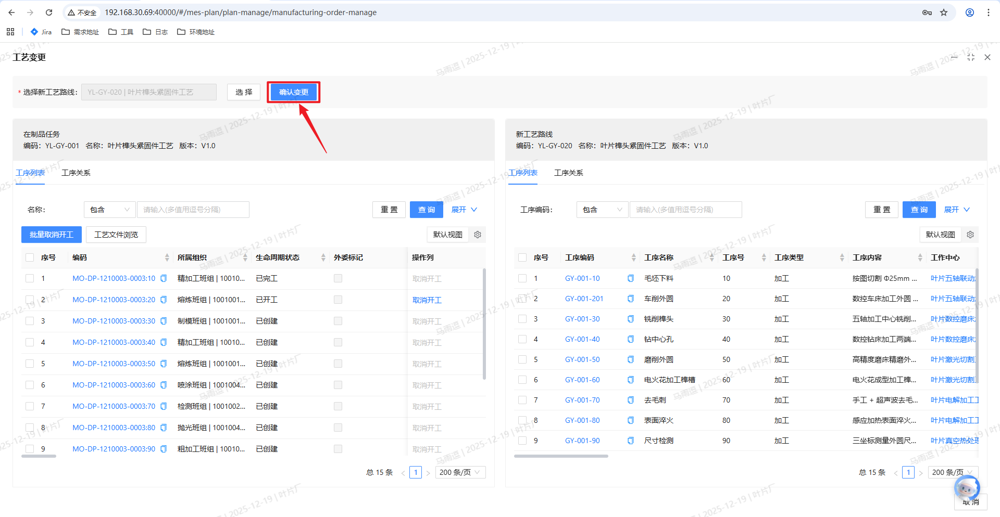

# 工艺变更

## 功能概述
工艺变更功能用于在制造订单已经下达、排产并进入执行过程中，对订单所绑定的工艺路线进行 **版本变更** 或 **临时工艺调整**。  
通过该功能，用户可以在 **保留已生产工序结果** 的前提下，将制造订单切换到新的工艺路线，减少停工和返工风险。  
系统会自动处理相关的制造任务、检验任务等数据，帮助用户在业务上“平滑”完成工艺调整。

> **说明**：工艺变更仅支持对 **单个制造订单** 进行操作，系统会在变更前自动进行多项校验，防止对生产过程造成不必要的影响。

## 核心功能
1. **工艺路线变更**
   - 支持在制造订单执行过程中，选择新的工艺路线版本或不同工艺方案。
   - 自动识别需要保留的已生产工序，并基于此进行工艺变更。

2. **在制品任务联动处理**
   - 对保留工序（已开工/已送检/已完工）的制造任务进行保留与关联。
   - 对保留工序之后尚未执行的工序，自动删除原任务并按新工艺路线重新生成制造任务。
   - 同步处理相关的 **检验任务、外委计划、异常任务** 等，减少人工干预。

3. **工艺变更校验与提示**
   - 对订单状态、工艺路线是否完整、工序关系、外委任务状态、检验配置、产出比等进行多角度校验。
   - 对不满足条件的场景给出清晰的提示信息，引导用户调整后再继续操作。

4. **变更预览与人工调整**
   - 在确认变更前提供变更预览界面，对比变更前后的工序及任务情况。
   - 用户可以在界面中进行 **取消开工** 等人工调整，以改变保留工序范围后重新发起校验与确认。

## 操作前置条件
1. 用户已具备访问生产计划模块及 **工艺变更** 功能的相应权限。
2. 制造订单已在系统中创建，并且处于允许调整工艺的状态.
3. 制造订单的工艺路线已指定（不为空），或已通过其他功能完成工艺指定。
4. 若订单存在外委任务、检验任务等关联业务，需确保相关数据处于可调整状态（如外委计划未发送、无正在执行的关键检验流程等）。

> **注意**：若制造订单状态为 **已完工** 或 **已取消**，系统将不允许进行工艺变更。

## 操作步骤

### 1. 进入工艺变更界面

1. 登录系统后，进入生产计划相关模块。
2. 在功能菜单中找到 **工艺变更** 或在 **制造订单管理** 中选择需要变更的订单。
3. 在制造订单列表中，单选一条目标制造订单。
4. 点击工具栏中的 **工艺变更** 按钮，系统打开工艺变更弹窗。

> **提示**：  
> - 若用户一次选择了多个制造订单，系统将提示：“请选择一个制造订单进行变更。”  
> - 若当前制造订单的工艺路线为空，系统将提示：“当前制造订单的工艺路线为空，请直接指定工艺路线。”

### 2. 选择新的工艺路线

1. 在工艺变更弹窗顶部区域，找到 **工艺路线** 选择按钮。
2. 点击选择按钮，弹出指定工艺路线窗口：
   - 系统默认显示符合条件的 **最新版本工艺路线**。
   - 候选列表与“制造订单指定工艺路线”功能中的查询逻辑保持一致。
3. 选择工艺路线后，下方的 **新工艺路线区域** 会自动刷新，展示对应工序列表和工序关系图。

> **建议**：在选择新工艺路线前，建议确认新工艺已在工艺管理模块中配置完成，并通过相关审核。

### 3. 查看界面结构与在制品任务信息
工艺变更界面下半部分通常分为左右两部分：

1. **左侧：在制品任务（当前工艺路线）**
   - 显示内容包括：
     - 工艺路线编码、名称、版本。
     - 在制品对应的工序列表（序号、工序号、工序名称、生产状态、工序内容、工作中心、外委标记、执行标记、产出比等）。
     - 工序的上下道关系图。
   - 展示形式：
     - 通过标签页在 **工序列表** 与 **工序关系图** 之间切换。
   - 支持操作：
     - **批量取消开工**；
     - **取消开工**；
     - 鼠标悬停在相关按钮上会显示提示：“仅已开工且未报工的任务才允许取消开工”。

2. **右侧：新工艺路线信息**
   - 显示内容包括：
     - 新工艺路线的编码、名称、版本。
     - 新工艺对应的工序列表（序号、工序号、工序名称、工序内容、工作中心、执行标记、产出比等）。
     - 工序上下道关系图。
   - 展示形式：
     - 同样通过标签页在 **工序列表** 和 **工序关系图** 之间切换。

### 4. 调整保留工序（可选）
在变更前，用户可根据需要对**保留工序范围**进行人工调整，以控制变更分割线位置。

1. 在左侧 **在制品任务** 的工序列表中，定位需要调整的工序。
2. 对已开工但希望不作为保留工序的任务，可以执行 **取消开工** 操作：
   - 单击对应行的 **取消开工** 按钮，或使用 **批量取消开工**。
3. 系统校验：
   - 仅当制造任务为 **已开工** 且 **未报工** 时，才允许取消开工。
   - 若不存在任务分割，则回退该制造任务状态至 **已派工**。
   - 若存在任务分割，仅回退当前**子任务**状态至 **已派工**；当所有子任务均回退为已派工时，再回退其**父制造任务**状态为已派工。

> **说明**：  
> - 所有“已开工、已送检、已完工”的工序在变更中视为**保留工序**。  
> - **保留工序之后的第一道工序**即为变更分割线，分割线之后的工序将按新工艺重新展开。

### 5. 确认变更并查看预览

1. 在完成工艺路线选择和保留工序调整后，点击弹窗右下角的 **确认变更** 按钮。
2. 系统首先执行 **变更校验**，若不通过，将弹出提示信息并保持当前界面不变，允许用户继续调整。
3. 校验通过后，系统弹出二级确认提示：
   - 提示内容示例：“变更操作不可逆，是否确认变更？”
4. 用户点击 **确认** 后，系统生成 **变更预览结果**，展示：
   - 哪些制造任务/工序将被保留；
   - 哪些制造任务/工序将被删除并按新工艺重建；
   - 对应的检验任务、外委计划等业务对象的处理方式。

> **提示**：用户可根据预览信息再次评估变更影响，如有问题可关闭界面重新调整保留工序或更换工艺路线。

### 6. 系统变更处理逻辑（用户感知层面）
在用户确认变更后，系统后台自动完成以下处理（用户无需逐项操作，但需要理解结果表现）：

1. **工艺路线替换**
   - 将制造订单原工艺路线替换为新工艺路线。

2. **保留制造任务处理**
   - 若新旧工艺路线的交集 **完全包含** 原工艺路线中的所有保留工序，系统会：
     - 保留这些制造任务，并将其工序ID映射到新工艺路线中的对应工序ID。
     - 对未完工任务，更新其定额加工工时和定额辅制工时等。

3. **删除与重建后续任务**
   - 变更分割线之后的在制品制造任务将被 **删除**。
   - 若删除的工序已派工，系统会先执行取消派工再进行删除。
   - 若删除的工序存在关联的检验任务、外委计划、异常任务等，系统会一并处理（删除或终止流程）。
   - 按新工艺路线在分割线之后的工序重新执行计划展开，创建新的制造任务。
   - 对新工艺中的检验分类、外委标记等配置，系统自动创建对应的检验任务与外委计划。

4. **在制品与订单状态联动**
   - 若保留工序对应的任务已全部完工，且新工艺路线中只包含这些保留工序：
     - 变更完成后，系统会根据工艺变更的操作时间执行订单完工逻辑，将该时间作为订单实际结束时间。

> **说明**：本次工艺变更不处理 **生产准备计划** 和 **外委计划** 中的前期准备类数据，仅处理与工序执行直接相关的计划与任务。

## 注意事项

1. **订单状态限制**
   - 已创建/已发布但未排产的订单，建议直接通过“指定工艺路线”功能选择工艺，而非使用工艺变更。
   - 状态为 **已完工** 或 **已取消** 的制造订单，不允许进行工艺变更。

2. **保留工序与分割线规则**
   - 保留工序定义：在制品任务中所有 **已开工、已送检、已完工** 的工序。
   - 变更分割线定义：区分 **已执行工序** 与 **新工艺路线工序** 的分界点。
   - 分割线前所有工序在新旧工艺路线中必须 **完全一致**，包括但不限于：
     - 工序号、工序名称、顺序；
     - 执行标记、产出比、工序类型；
     - 工序之间的上下道关系；
     - 检验分类配置等。
   - 串行场景：保留工序即为分割线，分割线后的工序全部按新工艺路线执行。
   - 并行场景：所有并行分支必须确定各自的保留工序作为分割点，确保分割线在各分支间对齐。

3. **串并行关系与产出比校验**
   - 原工艺为串行的工序，在新工艺中也必须为串行；原为并行的，在新工艺中也必须保持并行。
   - 若发生串并行关系变化，系统将提示：“工序XX的串并行关系发生改变，不允许变更。”
   - 新工艺路线中：
     - 并行工序中不允许存在产出比。
     - 有产出比的工序必须执行，即 **执行标记为是**。
     - 制造订单的计划投入数量，必须是工艺路线产出比乘积的整倍数。

4. **外委与检验任务限制**
   - 若变更涉及的制造任务存在已发送的外委计划，则不允许变更相关工序。
   - 删除带有外委标记的工序时，系统会同步处理对应的外委计划。
   - 删除带有检验分类的工序时，系统会同步处理对应的检验任务。
   - 删除存在异常任务的工序时，系统会同步删除异常任务，如在流程中还会终止相关流程。