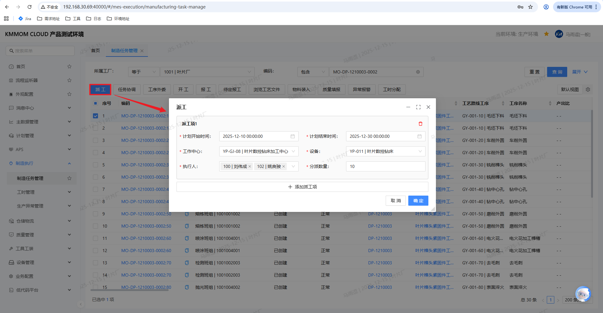
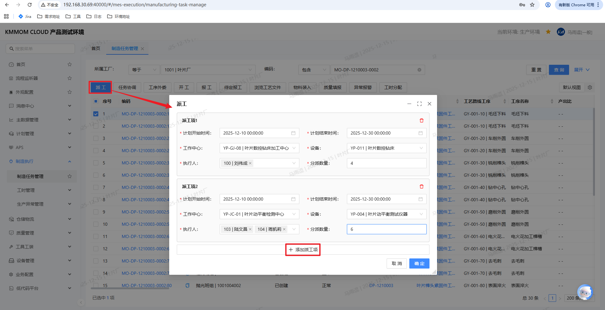
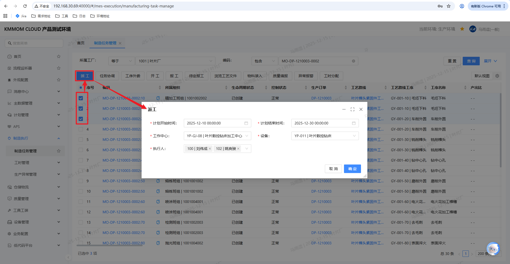
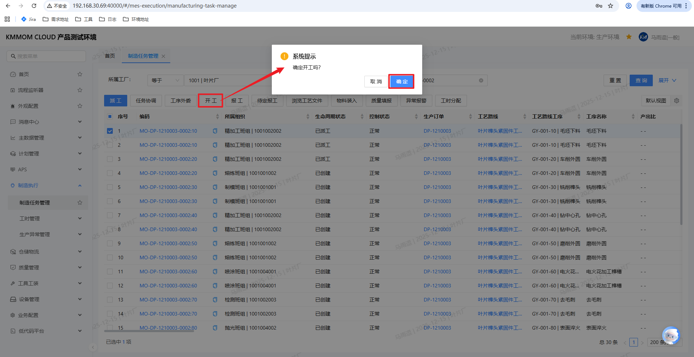
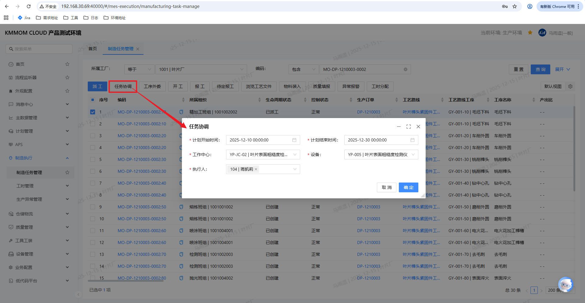
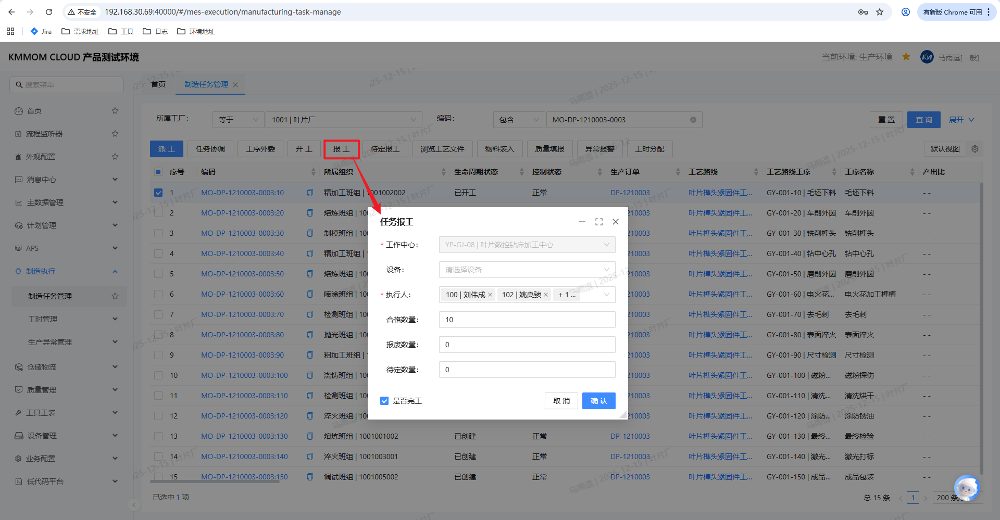
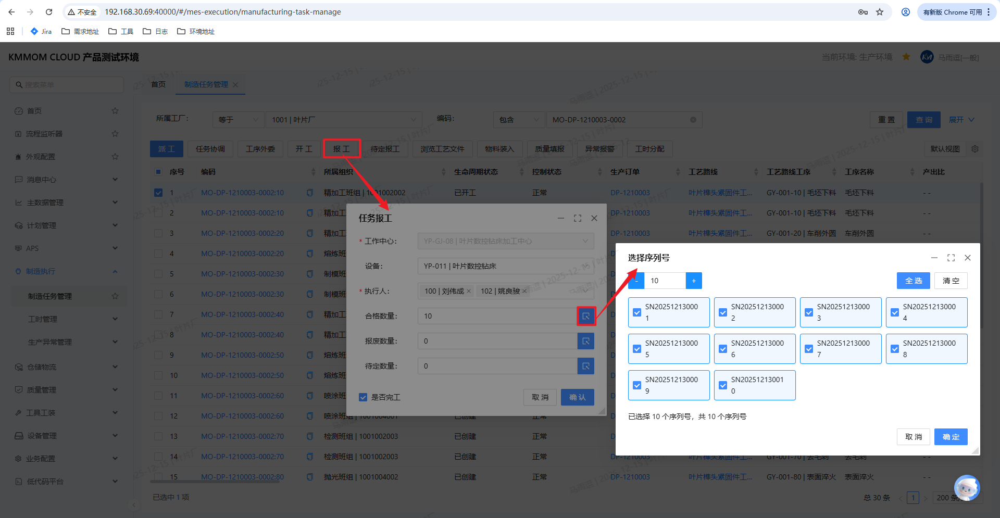
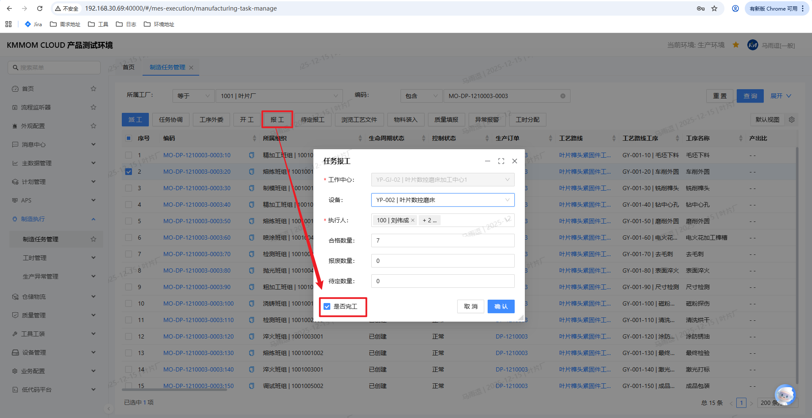

# 任务执行

## 功能概述
任务执行涵盖制造任务的派工、开工、报工、完工流程。管理平台用于计划/调度角色批量处理任务，工作台用于班组现场执行。本手册聚焦 **管理平台** 操作。

## 操作前置条件
1. 已完成工艺展开，生成制造任务，任务状态为【已创建】或【已派工】。
2. 已配置工作中心、设备、执行人，且当前用户具备派工/开工/报工/完工权限。

## 操作指南

### 1. 派工（管理平台）
**业务场景**：计划/调度将待生产任务分配到具体工作中心、设备和执行人，可一次派工或拆分多派工行。
#### 场景A：单个任务派工（单个派工项）

1. 进入：左侧导航 **制造执行** → **制造任务管理**，单选任务，点击 **派工**。
2. 校验：已暂停/已终止/已派工不可派工；不通过则提示并中止。
3. 填写派工信息（单派工行）：
   - **计划开始/结束时间**（必填，默认取排程时间，否则取任务计划时间）
   - **工作中心**（必填，单选，默认排程资源或任务工作中心）
   - **设备**（工作中心类型为设备时必填，默认排程设备或任务设备）
   - **执行人**（必填，多选，来自工作中心/设备下人员去重）
   - **派工数量**（必填，默认为任务计划数量，必须等于计划数量）
4. 点击 **确定**，校验通过后任务状态置为【已派工】，组织同步工作中心组织，派工状态标记为手工派工。

#### 场景B：单个任务派工（多个派工项，任务分割）

1. 单选任务，点击 **派工**。
2. 在派工界面点击 **添加派工项** 复制当前行，按需调整每行的 **执行人/设备/数量/时间**，序号递增。
3. 删除派工项：可删除多余行，但需至少保留一行，否则提示“至少保留一个派工项”。
4. 数量校验：所有派工项的数量之和必须等于任务计划数量。
5. 保存：点击 **确定**，为分割出的派工项创建子任务，子任务编码=父任务编码+两位流水号；父子任务状态均更新为【已派工】，并同步各自派工属性。

#### 场景C：批量任务派工

1. 多选任务，点击 **派工**。已暂停/已终止/已派工任务自动过滤并提示，可选择继续对其余任务派工；若全部不合格则终止。
2. 在批量派工界面：
   - **计划开始/结束时间**（必填，默认取排程时间，否则取任务计划时间）
   - **工作中心**（必填，单选）
   - **设备**（设备型工作中心必填）
   - **执行人**（必填，多选）
   - **派工数量**：批量场景不逐行填写，默认按各任务计划数量派工，不显示数量输入。
3. 点击 **确定**，系统逐任务校验并保存；支持部分成功部分失败，统一提示成功/失败明细。

> **注意**：派工数量（单任务场景）合计必须等于任务计划数量；设备型工作中心必须选择设备；批量派工允许部分成功部分失败，并提示失败原因。

### 2. 开工（管理平台）
**业务场景**：现场确认任务正式开始加工，记录实际开工时间，驱动后续报工与进度跟踪。

1. 进入：**制造任务管理** 勾选一个或多个任务（状态需为【已创建】或【已派工】），点击 **开工**，确认框提示“是否确认开工？”。
2. 点击 **确定** 后，系统执行校验（默认规则+业务配置约束），批量场景支持部分成功部分失败，失败任务跳过并汇总提示；若全部失败则终止。
3. 校验规则：
   - 默认：已暂停/已终止/已开工任务不可再次开工。
   - 动态：读取业务配置【制造执行配置-制造任务开工-制造任务开工约束】，不满足约束则拒绝开工。
4. 通过校验的任务：
   - 更新实际开始时间。
   - 将制造任务状态置为【已开工】。
   - 更新制造订单/生产订单状态为【已开工】并记录时间（若已开工则跳过）。
   - 已创建与已派工任务均可直接开工，无需先自动派工。

> **注意**：已暂停/已终止/已开工/已完工任务不可开工；批量操作可能部分成功，结果将统一提示。

### 3. 任务协调（管理平台）
**业务场景**：任务已派工或已开工后，因资源/计划变化需调整时间、工作中心/设备或执行人。

1. 用户操作：在 **制造任务管理** 勾选一个或多个任务（需已派工或已开工），点击 **任务协调**。
2. 校验规则：  
   - 已暂停/已终止/未派工/已完工任务不可协调。  
   - 批量支持部分成功部分失败，失败任务跳过并汇总提示；若全部失败则终止。
3. 协调界面填写：  
   - **计划开始/结束时间**（必填，默认取排程开始/结束时间，其次任务计划时间）  
   - **工作中心**（必填，单选；默认排程资源工作中心，其次任务工作中心；下拉为当前工厂工作中心）  
   - **设备**（单选；工作中心类型为“设备”时必填，默认排程设备，其次任务设备；下拉为该工作中心下设备）  
   - **执行人**（必填，多选；默认空，下拉为工作中心和设备下执行人去重集合）
4. 点击 **确定** 保存：更新计划开始/结束时间、工作中心、设备、执行人；任务组织同步为工作中心组织，派工状态标记为手工派工。

> **注意**：必填项缺失或校验失败会提示；设备型工作中心必须选择设备。

### 4. 报工（管理平台）
**业务场景**：执行人/班组对已开工任务反馈产出，支持数量报工与序列号报工，可在报工时勾选“是否完工”同步完工。

1. 用户操作：在 **制造任务管理** 勾选一个或多个已开工任务，点击 **报工**。
2. 校验：已暂停/已终止/已完工任务不可报工；批量支持部分成功部分失败，失败任务跳过并汇总提示，若全部失败则终止。
3. 报工界面：
   - **任务信息**：展示任务基本信息。
   - **工作中心**（必填，单选，可编辑）：默认任务工作中心；工作中心类型为设备时需选设备。
   - **设备**（单选，可编辑）：默认任务分派设备，未分派则空；下拉为该工作中心设备。
   - **执行人**（必填，多选）：默认任务分派人员，未分派则当前用户；下拉为工作中心/设备下人员去重。
   - **汇报项**：按业务配置动态生成，优先工作中心级，其次组织级向上查找；缺失时提示“未查找到汇报项，请先配置汇报项。”  
   - **报工数量**：  
     - 无序列号：填写合格/报废/待定数量，支持小数。  
     - 有序列号：需序列号报工，数量只读，选择序列号自动回填；序列号数量可编辑但不支持小数，并按序列号数量分配到汇报项。
   - **是否完工**：勾选后提交即执行完工校验与状态更新（见下方完工逻辑）。
   - **任务流转**：展示工序流转，默认选中当前工序。
4. 批量报工提示：弹窗提示“剩余报工数量将按合格数量完工，是否继续操作？”，点击“是”则执行报工与完工逻辑，支持部分成功部分失败并给出明细。
5. 报工与完工逻辑：  
   - 报工：记录报工结果；按报工序列号生成下道序列号（无产出比则继承，有产出比则乘以产出比，序列号=原序列号-流水号）。  
   - 完工：读取配置“制造执行配置-制造任务报工-制造任务完工约束”，校验已暂停/已终止/已完工不可完工；通过则记录实际结束时间、状态置为【已完工】；支持部分成功部分失败并提示。

> **注意**：有序列号任务必须按序列号报工；设备型工作中心需选设备；报工/完工校验失败会提示具体原因。

### 5. 完工（管理平台）
**业务场景**：在报工同时确认任务已完成，落账实际完工时间并更新任务/订单状态。

1. 在 **报工** 弹窗勾选 **是否完工**，提交后自动执行完工校验与状态更新。
2. 系统校验任务状态与完工约束，更新实际结束时间，任务状态置为【已完工】。

> **注意**：无单独完工按钮；需在报工时勾选“是否完工”。已暂停/已终止任务不可完工；启用序列号时须先完成序列号报工。

## 注意事项
1. 权限：派工/开工/报工/完工需对应功能权限，且可见范围受组织/工厂权限控制。
2. 数量校验：派工数量合计=计划数量；报工数量需合法，序列号报工数量与勾选序列号一致。
3. 状态流转：典型流转为【已创建】→【已派工】→【已开工】→【已报工/已完工】；异常/暂停需先处理后再继续。
4. 序列号/批次：启用序列号时必须按序列号报工；批次/序列号规则请先在基础数据中配置。

