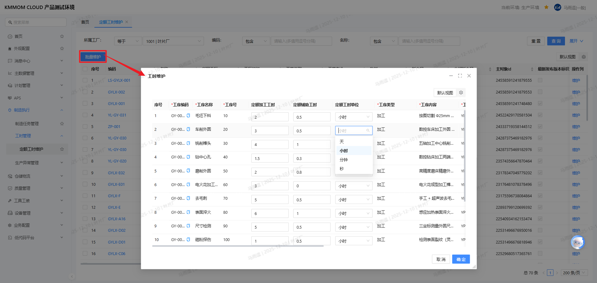
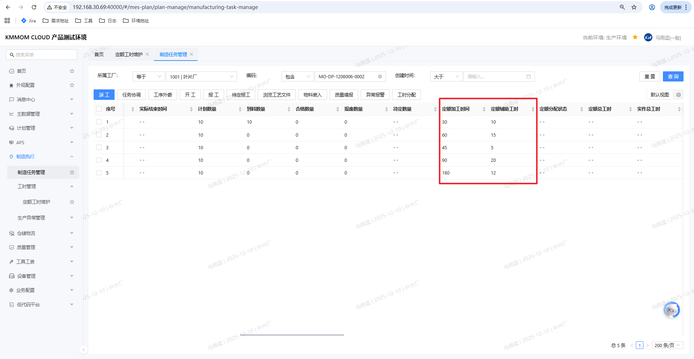
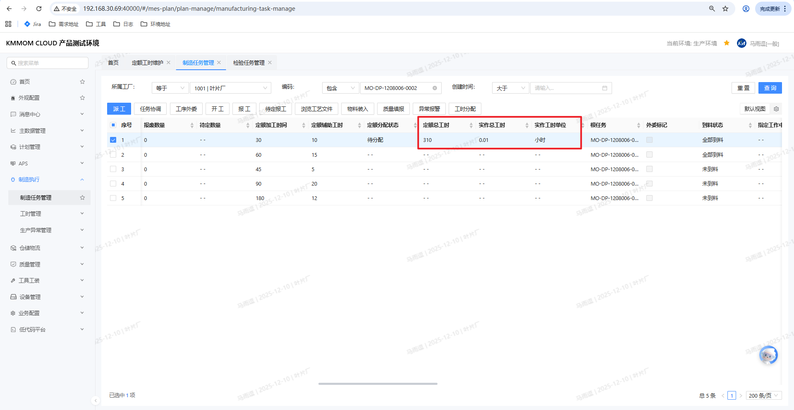
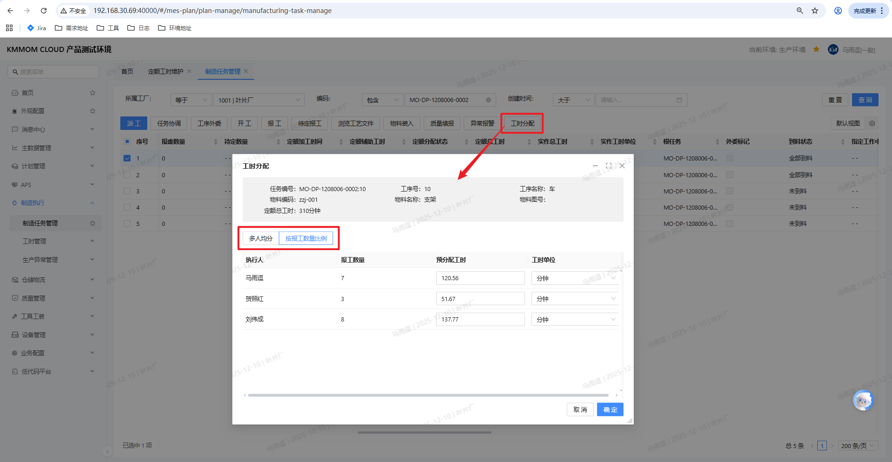
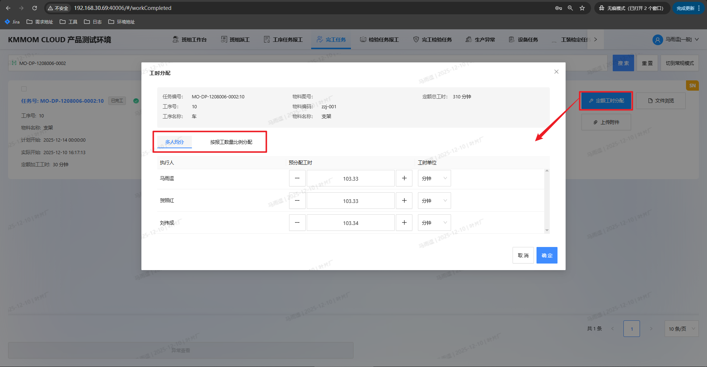
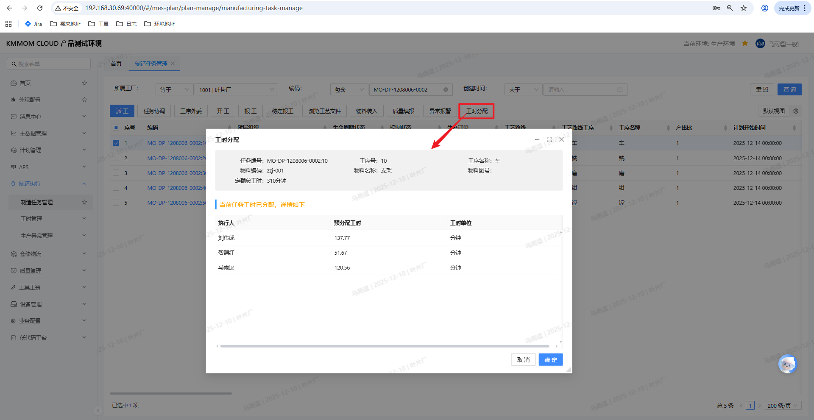
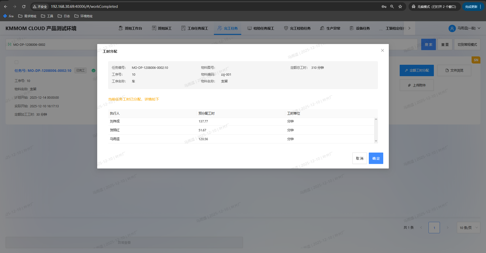

# 工时管理

## 功能概述
工时管理覆盖定额工时维护、制造订单工艺展开、制造任务报工与工时分配，确保定额工时准确下发、实作工时及时回采，并支持按规则分配定额工时到执行人。

## 操作前置条件
1. 已完成物料、工艺路线、制造订单的基础数据配置，并具备工时相关权限。
2. 定额工时来源：工艺路线维护或上游导入。

## 操作步骤

### 1. 定额工时维护
**用途**：维护或批量维护定额加工工时、定额辅助工时。  

1. 打开路径：左侧导航 **工时管理** → **定额工时维护**。
2. 查询：输入 **工艺路线编码/物料名称** 等条件，点击 **查询**。
3. 批量维护：勾选行后点击 **批量维护/维护**，在网格编辑  
   - **定额加工工时** ≥ 0  
   - **定额辅助工时** ≥ 0  
   - **工时单位** 必填  
   完成后点击 **保存**。

> **注意**：仅影响保存后的新任务，不回溯已执行任务；数值需为非负数，单位必填。

### 2. 制造订单工艺展开
**用途**：将工艺路线和定额工时带入制造任务。  

1. 打开路径：左侧导航 **制造执行** → **制造订单管理**。
2. 选择订单，点击 **工艺展开** → 确认。
3. 系统将工序的定额加工/辅助工时与工时单位同步到生成的制造任务。

> **注意**：展开前请先完成工艺路线与定额工时维护。

### 3. 制造任务报工（实作/定额工时计算）
**用途**：任务完工后计算实作工时、定额工时。  

1. 打开路径：左侧导航 **制造执行** → **制造任务管理**。
2. 查询任务，点击 **报工/批量报工**。
3. 提交报工后，系统依据业务配置计算：  
   - **实作工时** = 实际完工 - 实际开工  
   - **定额工时** = 计划数量 × 定额加工 + 定额辅助  
4. 报工成功后，任务的实作总工时、定额总工时更新。

> **注意**：报工信息不合法时系统会提示；计算规则以业务配置为准。

### 4. 工时分配（定额工时）
**用途**：将定额工时分配给执行人，支持多人均分、按报工数量比例。  

1. 入口A（管理平台）：在 **制造任务管理** 勾选已完工任务，点击 **工时分配**。
2. 入口B（工作台）：在 **完工任务** 界面，点击 **定额工时分配**。
3. 弹窗选择分配规则：  
   - **多人均分**：按执行人平均分配，除不尽则最后一人取剩余。  
   - **按报工数量比例分配**：按各执行人报工数量占比分配。
4. 如需，手动微调分配结果（正数），确保分配总和=定额总工时。
5. 点击 **确定** 保存；点击 **取消** 放弃。

> **注意**：未完工/已暂停/已终止或已分配的任务不可再分配；分配合计必须等于定额总工时。

### 5. 完工任务工时查询
**用途**：查看定额分配状态、个人工时，必要时再次进入分配。  

1. 入口A（管理平台）：在 **制造/任务管理** 勾选已完工任务，点击 **工时分配** 查看当前分配结果（只读/可编辑取决于状态）。
2. 入口B（工作台）：在 **完工任务** 界面，点击 **定额工时分配** 查看当前分配结果。
3. 查询：按 **任务号/订单号/状态** 等筛选，查看定额分配状态、我的工时、定额/实作工时。

## 注意事项
> - 定额工时变更仅影响变更后的新任务，不回溯历史。
> - 报工与分配权限需在角色/权限中开通，且执行人必须为实际参与人员。
> - 分配结果校验必须等于定额总工时；权重/数量为正数。 