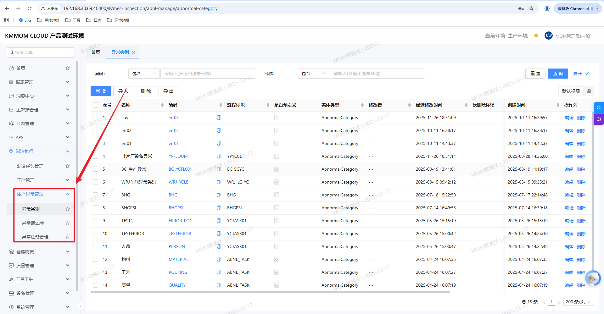
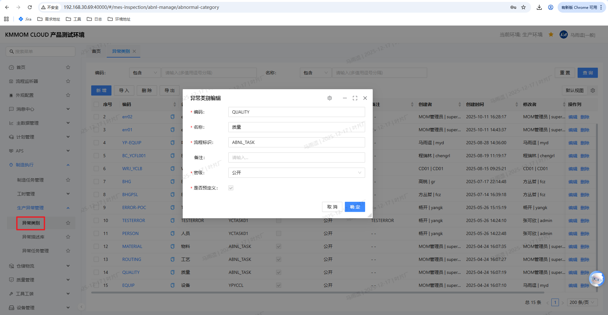
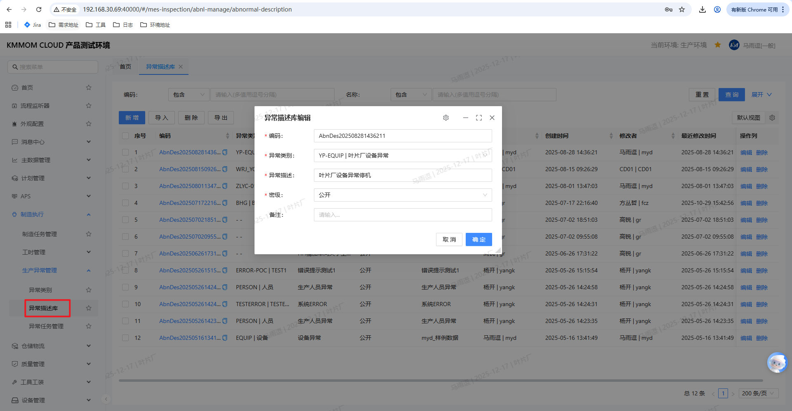
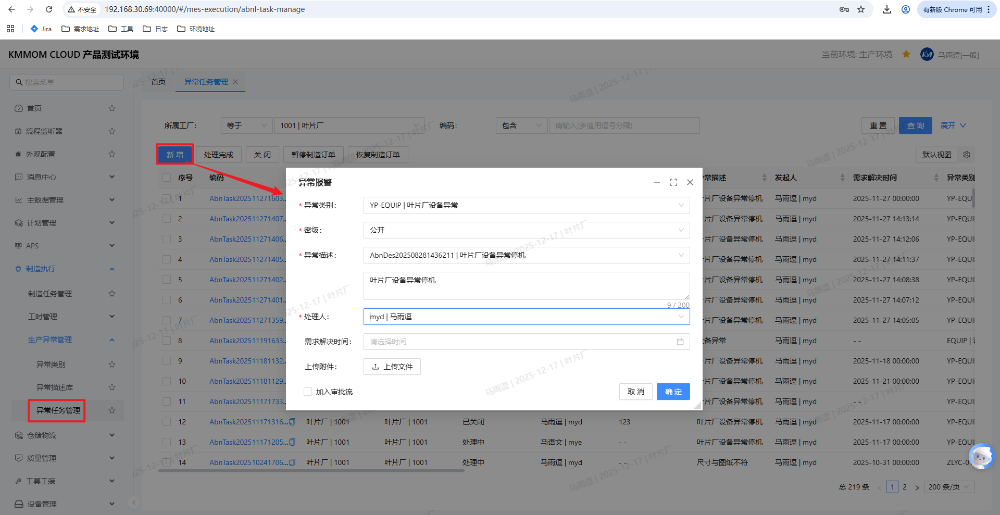
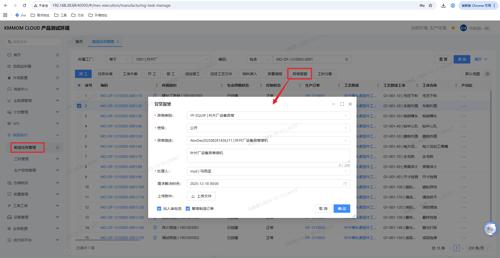
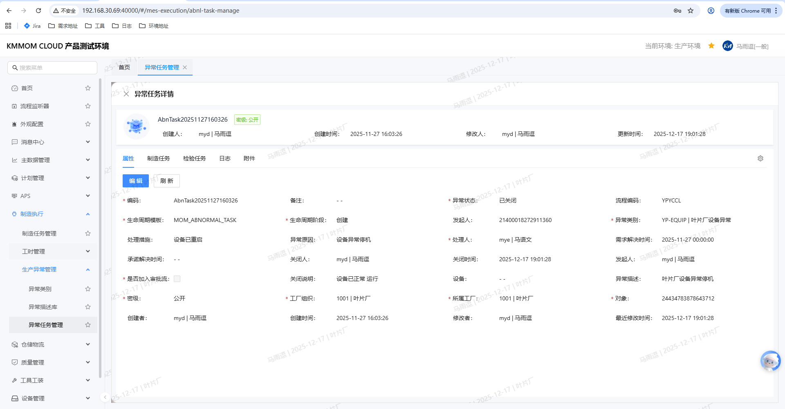
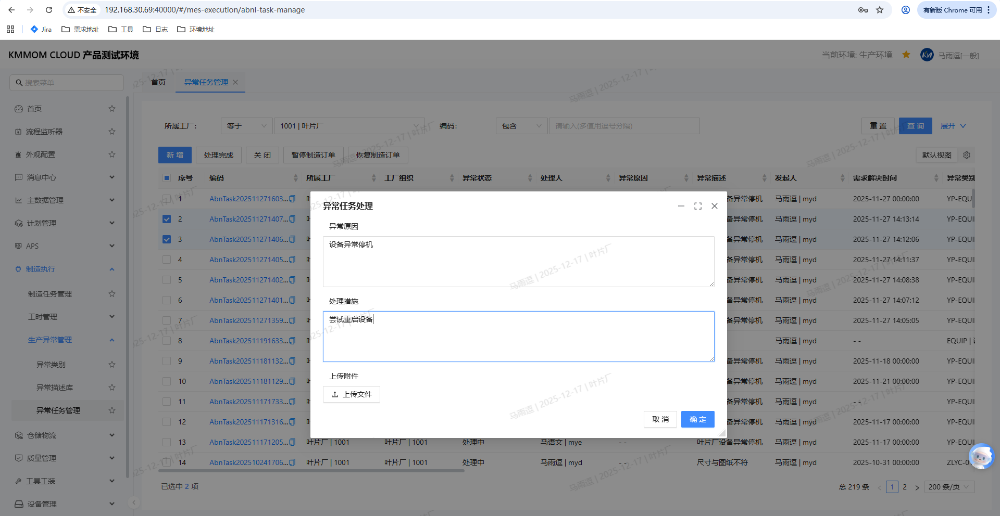
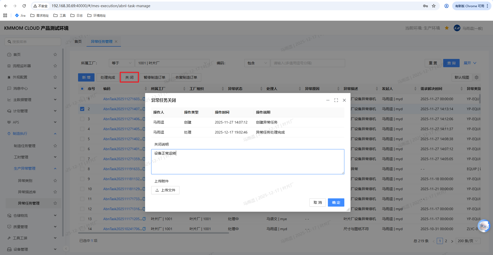
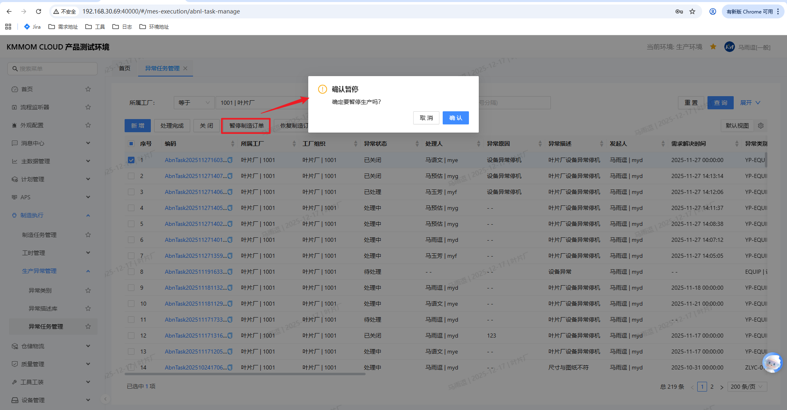
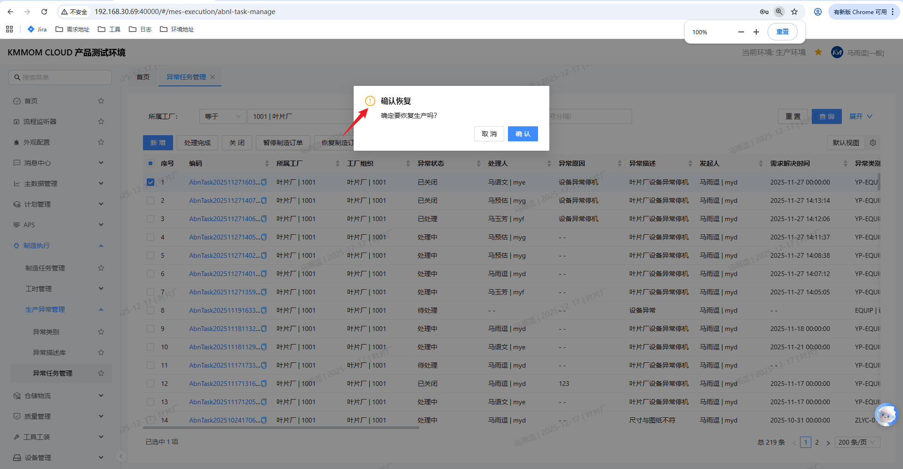

# 异常管理

## 功能概述
异常管理用于在生产过程中统一上报、分类、处理和关闭异常，覆盖设备、物料、工艺、质量、人员等场景。用户可完成异常类别与描述的维护，创建/处理异常任务，并与制造、检验任务联动暂停或恢复生产。

## 核心功能
异常管理模块提供以下核心功能：

1. **主数据维护**：
   - **异常类别管理**：定义异常分类体系（设备、物料、工艺、质量、人员等），配置流程标识用于审批流匹配。
   - **异常描述库管理**：维护常用异常描述模板，支持快速选择或自定义描述，提升异常上报效率。

2. **异常任务全生命周期管理**：
   - **异常报警**：支持在制造任务、检验任务、派工、报工等环节快速上报异常。
   - **异常处理**：记录异常原因、处理措施，支持附件上传，跟踪处理进度。
   - **异常关闭**：记录关闭说明，自动恢复关联制造订单。

3. **生产联动控制**：
   - **暂停/恢复制造订单**：异常影响生产时可暂停关联制造/检验任务及订单，处理完成后恢复。
   - **审批流程集成**：支持自定义审批工作流，不同步骤可编辑不同属性，流程状态驱动任务状态变化。

4. **多场景联动**：
   - 与制造任务管理、检验任务管理、任务台等模块联动，支持在任意环节发起、查看和处理异常。

## 操作前置条件
1. 登录人员具备 **制造执行-生产异常管理** 菜单访问及相应操作权限。
2. 若需走审批流，已配置对应的生产异常审批流程。

## 操作指南

### 1. 进入页面
1. 在左侧菜单展开 **制造执行**，进入 **生产异常管理**。
2. 在子菜单选择 **异常类别**、**异常描述库** 或 **异常任务管理**，进入对应功能页。

### 2. 异常类别维护

**说明**：
异常类别是异常管理的基础主数据，用于对生产异常进行分类管理。系统预定义了设备、质量、工艺、物料等常见类别，企业可根据实际业务需求新增自定义类别。每个异常类别需配置流程标识，用于匹配对应的审批工作流。例如：设备类异常走设备维修审批流程，质量类异常走质量处理审批流程。

**操作步骤**：

1. 在左侧菜单进入 **制造执行 > 生产异常管理 > 异常类别**。

2. 点击 **异常类别** 标签（列表默认展示编码、名称、流程标识、预定义标识、密级等信息）。
3. 查询：输入 **编码/名称**，点击 **查询**。
4. 新增：点击 **新增**，在弹窗填写：
   - **编码**（必填）：类别唯一标识。
   - **名称**（必填）：类别名称。
   - **流程标识**（必填）：用于定义异常任务加入的流程标识，后续审批流匹配该标识。
   - **密级**（必填）、**备注**：按需填写。
   - 可勾选 **保留属性** 保持默认。
   填写完毕后点击 **确定**。
5. 导入：点击 **导入**，上传模板文件，校验通过后确认导入。
6. 编辑：在列表点击 **编辑**，在弹窗更新 **名称/流程标识/备注/密级** 等信息后点击 **确定** 保存。
7. 删除：勾选记录，点击 **删除**，在弹出确认框点击 **确认**。  
> **注意**：预定义类别（设备/质量/工艺/物料等）不可删除；流程标识请与审批配置保持一致。

### 3. 异常描述库维护

**说明**：
异常描述库用于维护常用的异常描述模板，提升异常上报的标准化和效率。当操作员、班组长等角色上报异常时，可从描述库快速选择标准描述，避免描述不规范、信息不完整等问题。例如：设备类异常可预置"设备异常停机"、"设备精度下降"等描述；质量类异常可预置"尺寸与图纸不符"、"表面质量不合格"等描述。描述库支持按异常类别分类管理，便于快速检索和使用。

**操作步骤**：

1. 在左侧菜单进入 **制造执行 > 生产异常管理 > 异常描述库**。
2. 点击 **异常描述库** 标签。
3. 查询：选择 **异常类别**、输入 **异常描述编码**，点击 **查询**。
4. 新增：点击 **新增**，在弹窗填写：
   - **编码**（必填）：系统可自动生成或按需填写。
   - **异常类别**（必填）：下拉选择，需与异常类别维护一致。
   - **异常描述**（必填）：输入具体异常描述。
   - **密级**、**备注**：按需填写；可勾选 **保留属性**。
   完成后点击 **确定**。
5. 导入：点击 **导入**，上传模板文件完成校验与导入。
6. 编辑：在列表点击 **编辑**，可更新 **异常类别/异常描述/密级/备注** 等字段，点击 **确定** 保存。
7. 删除：在列表点击 **删除**，确认弹窗点击 **确认**。  
> **注意**：删除后不可恢复，且会影响引用该描述的异常任务，请谨慎操作。

### 4. 新建异常任务（报警）

**说明**：
当生产过程中发生设备故障、物料短缺、质量异常等情况时，操作员、班组长等角色可通过异常报警功能快速上报异常。创建方式与场景：
1) **异常任务管理直接新增**：在异常任务管理界面点击 **新增**，可独立创建异常任务，不绑定任何订单/任务，便于单独处理。
2) **业务执行界面报警**：在制造/检验/派工/报工等业务界面勾选订单或任务后点击 **异常报警**，在弹窗中可勾选 **暂停制造订单**。暂停后，关联的制造任务、检验任务等同步暂停；异常任务处理完成并关闭后，系统自动恢复。也可通过手动 **暂停/恢复制造任务/订单** 按需控制。
3) **审批与联动**：创建时可选择加入审批流（按流程标识匹配工作流）；暂停/恢复动作联动订单与任务状态，确保生产安全受控。

**操作步骤**：
#### 1. 异常任务管理直接新增

1. 在左侧菜单进入 **制造执行 > 生产异常管理 > 异常任务管理**。
2. 点击页面上方的 **新增** 按钮，弹出异常报警窗口。
3. 选择 **异常类别**（为设备时需选择 **设备**），选择或填写 **异常描述**。
4. 指定 **处理人**，可填写 **需求解决时间**，上传附件（图片/PDF）。
5. 根据需要勾选 **加入审批流**。
6. 点击 **确定**，生成异常任务。该任务不绑定具体订单/任务，默认状态为待处理；进入审批流后状态为处理中。

#### 2. 业务执行界面报警（以工序任务报工为例）

1. 在工序任务报工界面，勾选需要上报异常的工序任务。
2. 点击界面底部的 **异常报警** 按钮，弹出异常报警窗口。
3. 在弹窗中选择 **异常类别**、**异常描述**，指定 **处理人**，可填写 **需求解决时间**，上传附件。
4. 根据需要勾选 **加入审批流**；如需暂停当前制造订单，勾选 **暂停制造订单**。
5. 点击 **确定**，系统自动生成与当前工序任务关联的异常任务；若勾选暂停制造订单，则对应制造订单及其下属制造任务、检验任务同步暂停，后续在异常关闭或恢复操作后自动/手动恢复。

### 5. 查询与查看详情
1. 在 **异常任务管理** 输入 **任务号/类别/状态** 等条件，点击 **查询**。
2. 在列表点击 **异常任务号** 超链接查看详情，查看基本信息、关联任务、操作记录、日志与附件。

### 6. 处理异常任务

1. 勾选待处理/处理中任务，点击 **处理完成**。
2. 填写 **异常原因**、**处理措施**，可上传附件。
3. 点击 **确认**，状态更新为已处理。
> **注意**：非待处理/处理中任务不可执行处理完成。

### 7. 关闭异常任务

1. 勾选未关闭任务，点击 **关闭** 。
2. 可填写 **关闭说明**，上传附件后点击 **确认**。
3. 状态更新为已关闭，并记录关闭时间。
> **注意**：已关闭任务不可再次关闭；关闭后系统会恢复关联制造订单。

### 8. 暂停/恢复制造订单
1. 在异常任务列表勾选任务，点击 **暂停制造订单**，确认后暂停关联的制造/检验任务与订单。

2. 当异常已关闭或确认不影响生产时，勾选任务点击 **恢复制造订单**，确认后恢复关联任务与订单。

> **注意**：未关联制造/检验任务或已在目标状态时，此操作执行无效。

### 9. 典型使用场景
1. **设备故障**：操作员在设备报警时新建异常任务，选择设备类别与设备，勾选审批并暂停订单；维修完成后处理并关闭，系统自动恢复订单。
2. **物料短缺**：班组长选择物料类别，指派物流处理人，不暂停订单；物流补料后处理任务并关闭。
3. **质量异常**：检验人员在检验任务中报警，附上检验结果；质量工程师处理后关闭，并在关闭说明中记录处置结论。

## 注意事项
> - 预定义异常类别不可删除，删除操作会影响关联数据，请谨慎执行。  
> - 加入审批流前需确保已配置对应流程，否则无法提交。  
> - 暂停/恢复操作会联动关联制造/检验任务及订单，请确认业务影响后再执行。  
> - 建议在处理时填写异常原因与处理措施，便于后续追溯与分析。  
> - 上传附件当前优先支持图片与 PDF，其他格式以系统配置为准。
