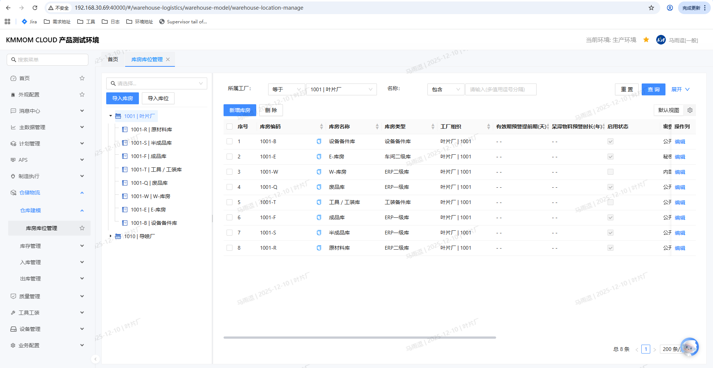
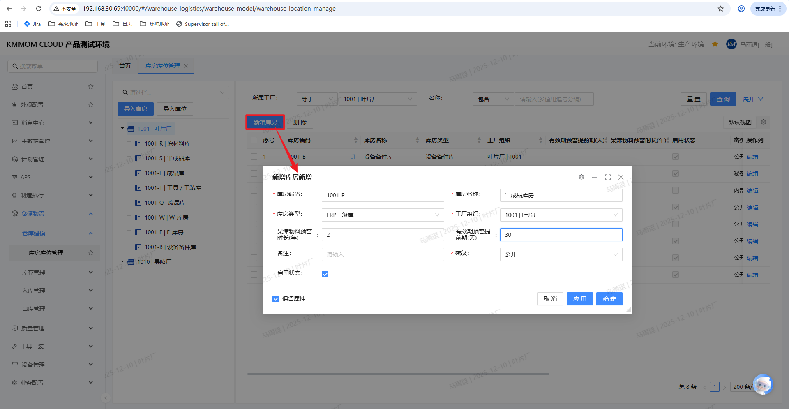
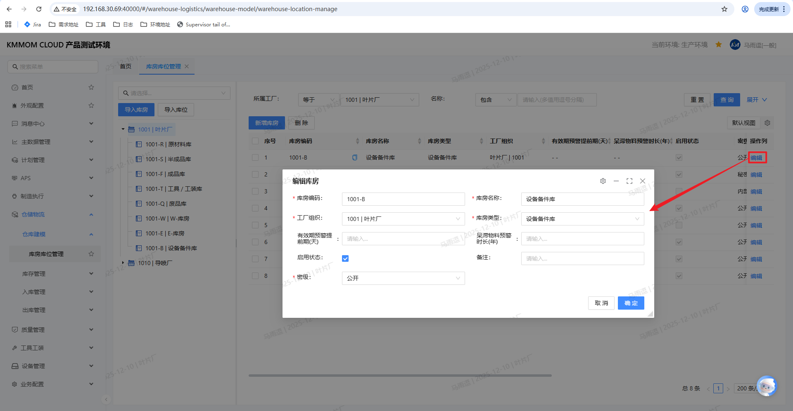
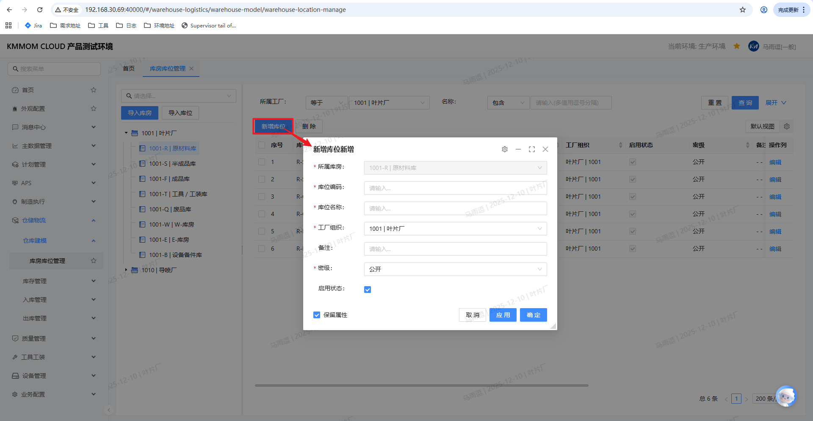
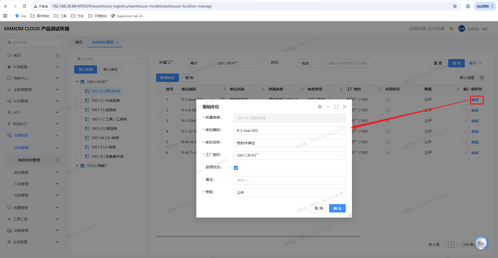
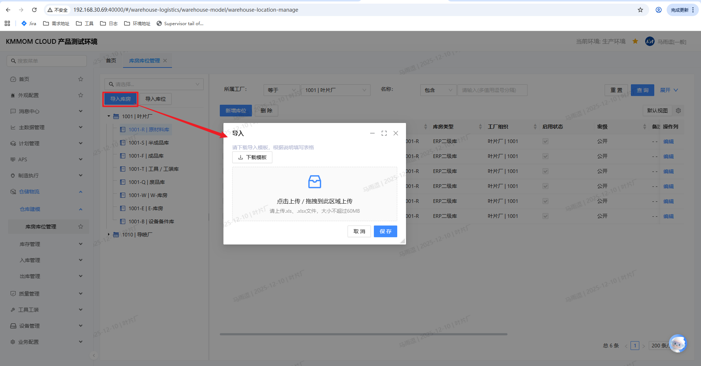
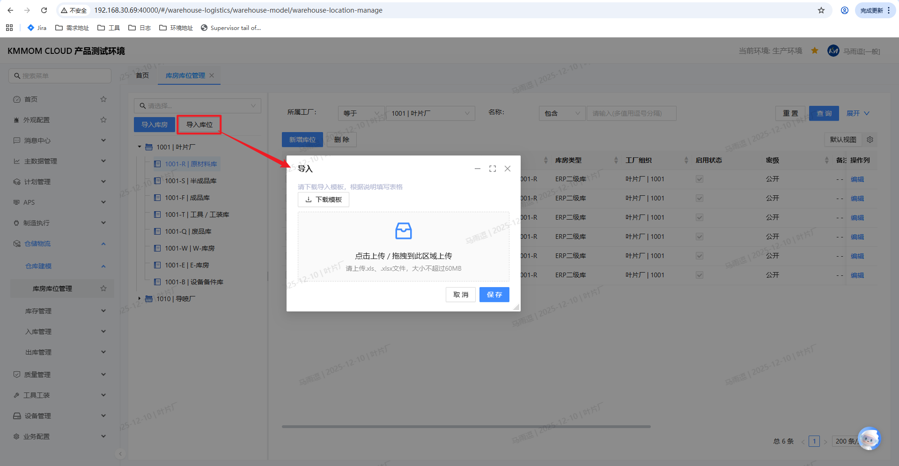

# 库房库位管理

## 功能概述

库房库位管理是仓储管理的基础模块，用于定义和管理仓库的物理空间结构。通过建立"工厂 -> 库房 -> 库位"的层级关系，为物料的存储、定位和追溯提供基础数据支撑。

**核心价值**：
- 建立清晰的仓储空间层级结构
- 支持物料的精准定位和快速查找
- 为出入库操作提供库房库位选择依据
- 支持批量导入，提高数据录入效率

## 界面结构

库房库位管理界面采用左侧树状导航、右侧列表展示的布局：

**左侧树结构**：
- 按层级显示：工厂 -> 库房
- 顶部提供组织（工厂）选择下拉框，默认显示当前用户所属工厂
- 提供 **导入库房** 和 **导入库位** 按钮

**右侧内容区**：
- 当选中工厂节点时，显示该工厂下的所有库房列表
- 当选中库房节点时，显示该库房下的所有库位列表
- 提供查询筛选、新增、编辑、删除等操作功能

## 操作指南

### 1. 进入页面

1. 在左侧导航点击 **仓储物流**。
2. 在子菜单选择 **仓库建模** → **库房库位管理**。
3. 页面左侧显示工厂和库房的树状结构，右侧显示库房或库位列表。

### 2. 查询与筛选

1. 在筛选区设置查询条件：
   - **所属工厂**（下拉选择，如：1001 | 叶片厂）
   - **名称**（文本输入，支持模糊匹配）
2. 点击 **查询**，列表刷新显示符合条件的库房或库位。
3. 在左侧树结构中选中工厂节点，右侧显示该工厂下的库房列表；选中库房节点，右侧显示该库房下的库位列表。

### 3. 新增库房

1. 点击右侧列表上方的 **新增库房**，打开新增窗口。

2. 填写库房基础信息：
   - **库房编码**、**库房名称**、**库房类型**（ERP一级库/ERP二级库/车间二级库）、**工厂组织**（系统自动填充）
   - **有效期预警提前期(天)**、**呆滞物料预警时长(年)**、**密级**、**启用状态**、**备注**等
   - 其他字段按系统实际提供为准

3. 点击 **确定** 完成新增；列表自动刷新显示新库房。

> **注意**：库房编码必须唯一；字段名前带红色星号（*）的为必填项；勾选"保留属性"可保留当前配置，方便批量创建；点击 **应用** 可保存但不关闭窗口，继续创建下一个库房。

### 4. 编辑库房

1. 在左侧树结构中选中目标库房节点，或在右侧库房列表中选中目标库房记录。
2. 点击右侧列表上方的 **编辑** 按钮，或点击操作列中的 **编辑** 链接。
3. 在弹出的编辑窗口中，修改需要变更的库房信息（如库房名称、库房类型、备注等）。
4. 点击 **确定** 保存修改。

> **注意**：库房编码不可修改；库房信息不能为空。

### 5. 删除库房

1. 在左侧树结构中选中目标库房节点，或在右侧库房列表中选中目标库房记录。
2. 点击右侧列表上方的 **删除** 按钮。
3. 系统弹出确认对话框，确认后执行删除操作。

> **注意**：当库房下存在库位等子节点时，系统不允许删除该库房；删除操作不可恢复，请谨慎操作。

### 6. 新增库位

1. 在左侧树结构中选中目标库房节点，点击右侧列表上方的 **新增库位**，打开新增窗口。

2. 填写库位基础信息：
   - **所属库房**（系统自动填充为选中的库房）、**库位编码**、**库位名称**、**工厂组织**（系统自动填充）、**密级**、**启用状态**、**备注**等
   - 其他字段按系统实际提供为准

3. 点击 **确定** 完成新增；列表自动刷新显示新库位。

> **注意**：库位编码必须唯一；字段名前带红色星号（*）的为必填项；勾选"保留属性"可保留当前配置，方便批量创建；点击 **应用** 可保存但不关闭窗口，继续创建下一个库位。

### 7. 编辑库位

1. 在左侧树结构中选中库房节点，然后在右侧库位列表中选中目标库位记录。
2. 点击操作列中的 **编辑** 链接。
3. 在弹出的编辑窗口中，修改需要变更的库位信息（如库位名称、启用状态、备注等）。
4. 点击 **确定** 保存修改。

> **注意**：库位编码不可修改；库位信息不能为空。

### 8. 删除库位

1. 在左侧树结构中选中库房节点，然后在右侧库位列表中选中目标库位记录。
2. 点击操作列中的 **删除** 链接。
3. 系统弹出确认对话框，确认后执行删除操作。

> **注意**：删除操作不可恢复，请谨慎操作。

### 9. 批量导入库房

1. 在左侧树结构顶部，点击 **导入库房** 按钮。
2. 在弹出的"导入"窗口中，点击 **下载模板** 链接，获取标准格式的Excel文件。
3. 打开下载的Excel模板，填写数据：
   - 编码字段是唯一标识，不可重复
   - 列头名称前带 * 的为必填字段
   - 列头名称为红色的属性为引用属性，其值必须填写对应对象的编码
   - 关键字段：*编码、*工厂组织、*库房编码、*名称、*密级等
4. 将填写完毕的模板文件拖拽到上传区域，或点击上传区域选择文件。
5. 点击 **保存** 按钮，系统开始处理文件并显示导入进度。
6. 导入完成后，系统显示导入结果；如有失败数据，可下载失败记录文件，修正后重新导入。

> **注意**：仅支持Excel文件格式；库房编码必须唯一；工厂组织编码必须在系统中已存在；系统反馈的错误文件不能再次导入，请修改源文档后重新导入。

### 10. 批量导入库位

1. 在左侧树结构顶部，点击 **导入库位** 按钮。
2. 在弹出的"导入"窗口中，点击 **下载模板** 链接，获取标准格式的Excel文件。
3. 打开下载的Excel模板，填写数据：
   - 编码字段是唯一标识，不可重复
   - 列头名称前带 * 的为必填字段
   - 列头名称为红色的属性为引用属性，其值必须填写对应对象的编码
   - 关键字段：*编码、*工厂组织、*库房、*库位编码、*名称、*密级等
4. 将填写完毕的模板文件拖拽到上传区域，或点击上传区域选择文件。
5. 点击 **保存** 按钮，系统开始处理文件并显示导入进度。
6. 导入完成后，系统显示导入结果；如有失败数据，可下载失败记录文件，修正后重新导入。

> **注意**：仅支持Excel文件格式；库位编码必须唯一；库位所属的库房必须在系统中已经存在；系统反馈的错误文件不能再次导入，请修改源文档后重新导入。

## 注意事项

1. **权限要求**：库房库位管理功能需要相应的系统权限，如无权限请联系系统管理员。

2. **数据唯一性**：
   - 库房编码在系统内必须唯一
   - 库位编码在同一库房下必须唯一

3. **层级关系**：
   - 库房必须归属于某个工厂
   - 库位必须归属于某个库房
   - 删除库房前，需确保其下无库位或库存数据

4. **启用状态**：
   - 只有启用状态的库房库位才能被用于出入库操作
   - 建议及时启用或停用库房库位，避免误操作

