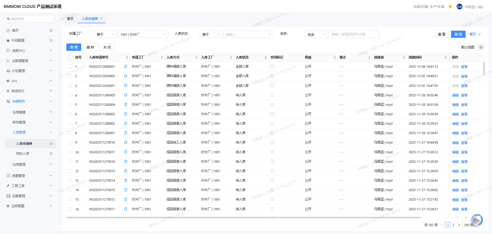
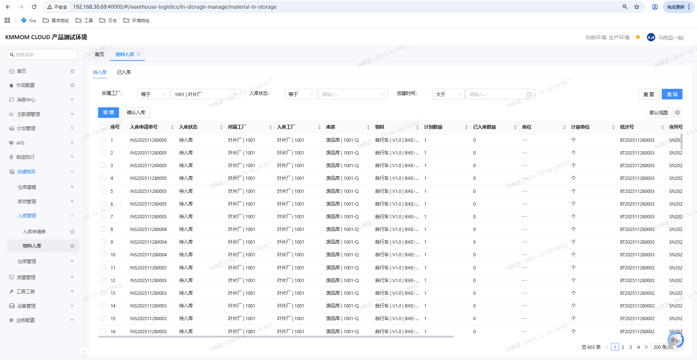
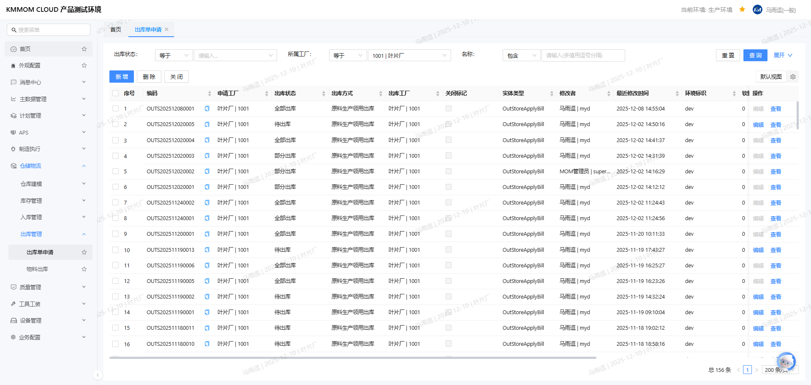
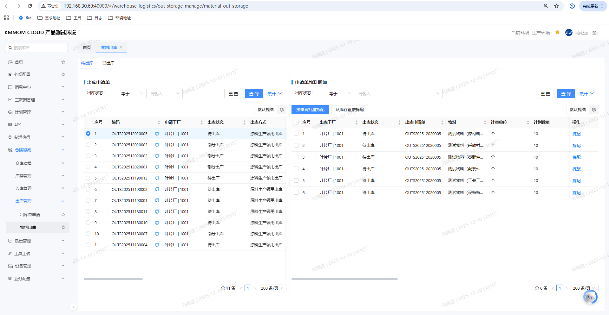

# 出入库

## 功能概述
出入库功能覆盖入库申请、实物入库、出库申请、拣配与出库的全流程，支持查询、批量操作与状态管控，确保账实一致与可追溯。

## 操作前置条件
1. 已在系统中完成工厂、库房、库位、物料主数据配置，并具备相应操作权限。
2. 若启用批次/序列号管理，请提前配置编码规则。
3. 盘点状态为“待盘点”的工厂不允许执行出入库。

## 操作指南

### 1. 入库申请单
**功能描述**：创建并维护入库业务请求，涵盖原料调拨、余料回库、完工入库等，是后续实物入库的来源单据。  
1. 进入：左侧导航 **仓储物流** → **入库管理** → **入库申请单**。  
   
2. 查询：按 **入库工厂/入库方式/入库状态/申请时间/关闭标记** 设置条件，点击 **查询**。
3. 新增：点击 **新增**，填写：  
   - **入库方式**（原料调拨入库/余料入库/成品完工入库等）  
   - **申请工厂**、**入库工厂**（默认当前工厂）  
   - 明细：物料、计划数量、计量单位、库房、库位、批次/序列号、有效期等  
   点击 **确定** 保存。
4. 编辑：状态为“待入库”且未关闭的单据，点击 **入库申请单号** → **编辑**，可调整入库方式、备注及明细；保存后生效。
5. 删除：仅“待入库”状态可删除，选中后点击 **删除**。
6. 关闭：仅“待入库/部分入库”且未关闭可执行，选中后点击 **关闭**。

> **注意**：入库申请单号按规则自动生成（INS+日期+流水）；关闭后不可再入库。

### 2. 物料入库
**功能描述**：执行“待入库/部分入库”的申请明细，完成实物入库并生成入库单；支持直接新增申请并一键入库，以及已入库查询。  
1. 进入：左侧导航 **仓储物流** → **入库管理** → **物料入库**。  
   
2. 查询待入库：按 **入库工厂/入库方式/入库状态/申请时间** 设置条件，点击 **查询**。
3. 确认入库：勾选待入库行，点击 **确定入库**，在二次确认中填写/确认：  
   - **本次入库数量**（≤ 计划数量-已入库数量）  
   - **库房/库位**（可编辑；默认取申请单或最近一次入库规则）  
   - 批次/序列号、有效期等（如启用）  
   点击 **确定** 完成入库。
4. 入库结果：系统生成入库单，更新库存与入库申请单状态（全部入库/部分入库/未入库）。
5. 快捷新增申请：在待入库页点击 **新增申请单**，可直接创建入库申请，填写入库方式、工厂及明细后点击 **保存** 或 **保存并入库**（一键生成申请并立即入库）。
6. 查看已入库：切换页签 **已入库**，可按记录编号、工厂、库房、物料等条件查询历史入库记录。

> **注意**：当工厂存在“待盘点”清单时，不允许入库，盘点完成后可操作。

### 3. 出库申请单
**功能描述**：创建并维护出库业务请求，覆盖生产领用、退料、报废、成品调拨等，是拣配与出库的前置单据。  
1. 进入：左侧导航 **仓储物流** → **出库管理** → **出库申请单**。  
   
2. 查询：按 **出库工厂/出库方式/出库状态/申请时间/关闭标记** 设置条件，点击 **查询**。
3. 新增：点击 **新增**，填写：  
   - **出库方式**（原料生产领用/过期退料/报废/成品调拨等）  
   - **申请工厂**、**出库工厂**（默认当前工厂）  
   - 明细：物料、计划数量、计量单位、库房、库位、批次/序列号、有效期等  
   点击 **确定** 保存。
4. 编辑：状态为“待出库”且未关闭的单据，点击 **出库申请单号** → **编辑**，可调整出库方式、备注与明细；保存后生效。
5. 删除：仅“待出库”状态可删除，选中后点击 **删除**。
6. 关闭：仅“待出库/部分出库”且未关闭可执行，选中后点击 **关闭**。

> **注意**：出库申请单号按规则自动生成（OUTS+日期+流水）；关闭后不可再出库。

### 4. 物料出库（拣配与出库）
**功能描述**：根据出库申请执行拣配与出库，支持按申请联动批量拣配和直接从库存拣配，并可查询已出库明细。  
1. 进入：左侧导航 **仓储物流** → **出库管理** → **物料出库**。  
   
2. 查询与筛选：顶部可按 **出库申请单号/物料/拣配状态/制造订单/需求到料时间** 等条件，点击 **查询**。
3. 选择申请单联动明细：左侧主列表勾选出库申请单，右侧“申请单物料明细”自动联动展示该单的物料明细。
4. 按申请批量拣配：在右侧明细勾选物料，点击 **按申请批量拣配**，弹出“选择物料库存”窗口，系统按申请明细自动查询可用库存；选择库存，填写 **出库数量**（≤可用库存且≤待出库数量），点击 **确定**，系统自动执行拣配并生成出库记录。
5. 从库存直接拣配：点击 **从库存直接拣配**，在弹窗选择 **出库类型**、筛选库存（工厂/库房/库位/物料/批次/序列号等），填写本次出库数量，点击 **确定**，系统直接出库并生成记录。
6. 拣货篮管理：如启用拣货篮，可在拣货篮中 **移除** 或 **清空**；清空会将数量退回主列表。
7. 查看已出库：切换页签 **已出库**，可按记录编号、工厂、库房、物料、批次/序列号等查询历史出库明细。

> **注意**：当工厂存在“待盘点”清单时，不允许出库，盘点完成后可操作。

## 注意事项
1. 编码唯一：入库/出库申请单号自动生成且唯一；库房、库位、批次/序列号需符合唯一性和规则要求。
2. 状态管控：仅“待入库/待出库”允许删除；仅“待入库/部分入库”或“待出库/部分出库”允许关闭。
3. 盘点冲突：工厂有“待盘点”时禁止出入库；完成盘点后再操作。
4. 数据校验：入库数量不得超出计划-已入库；出库拣配数量不得超出待出库。
