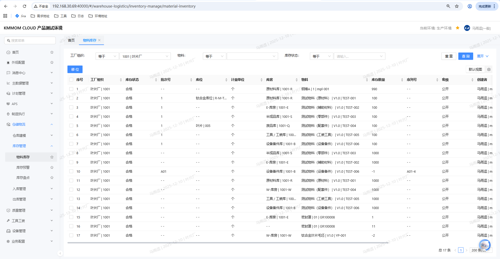
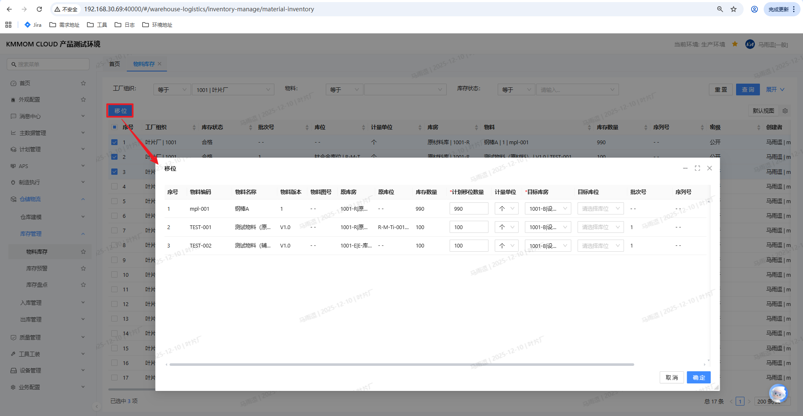
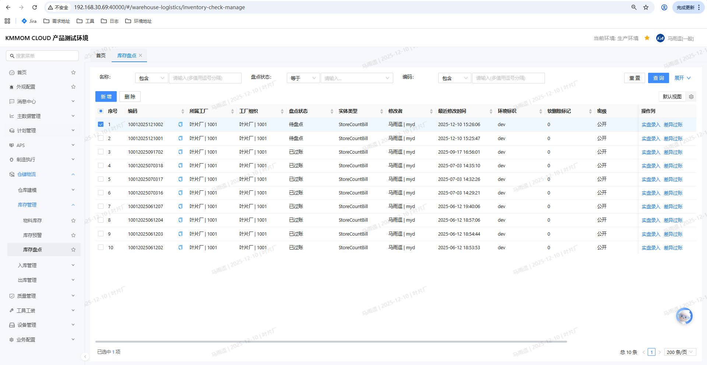
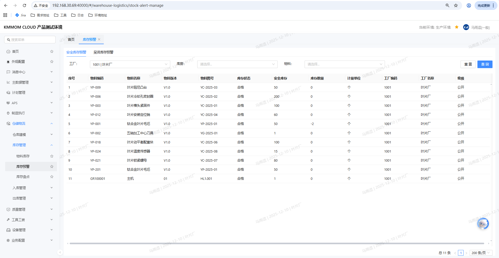

# 库存管理

## 功能概述
库存管理用于查询、监控和维护物料在库信息，支持多条件筛选、快速定位批次/序列号、查看库存状态，并提供库存移位以更新库房/库位归属。

## 操作指南

### 1. 进入与查询
1. 进入：左侧导航 **仓储物流** → **库存管理** → **物料库存**。  
   
2. 设置筛选条件（可多选/多条件组合）：  
   - **工厂**（必填，默认当前工厂）  
   - **库房**、**库位**  
   - **库存类型**（如：自有、外委、寄售、共享等）  
   - **库存状态**（如：合格、不合格、报废等）
3. 点击 **查询** 获取结果；点击 **重置** 清空条件；点击 **展开** 显示更多筛选项（如需）。
4. 查看列表：支持按物料、批次/序列号、库房/库位、库存状态、数量等字段浏览与排序。

### 2. 库存明细查看
1. 在列表中定位目标物料/批次，查看关键字段：  
   - **物料编码/名称/版本/图号**  
   - **库存状态、库存数量、计量单位**  
   - **工厂、库房、库位**  
   - **批次号/序列号、有效期、项目号/型号（如有）**
2. 如需更精确定位，可叠加库房、库存状态、批次或序列号过滤。

### 3. 库存移位
1. 在库存列表勾选需要移位的行，点击 **移位**（或对应入口）。

2. 在移位弹窗填写：  
   - **计划移位数量**（默认等于库存数量，可修改，必须为正数且不超可用量）  
   - **目标库房**（必填）  
   - **目标库位**（必填）  
3. 确认信息后点击 **确定**，系统更新该库存行的库房/库位归属。

## 注意事项
1. 工厂为必填筛选，确保查询范围正确；无权限的工厂/库房/库位将不可见。
2. 批次/序列号管理启用时，移位会保留原批次/序列号，确保追溯一致。
3. 计划移位数量不得超过可用库存；移位后请复核目标库房/库位是否有效。
4. 若工厂处于盘点锁定状态，相关库存可能限制移位或变更，请先完成盘点流程。

# 库存盘点与预警

## 功能概述

库存盘点用于生成盘点清单、录入实盘并进行差异过账，确保账实一致；库存预警当前提供安全库存、呆滞物料的风险提示，便于及时补货或处置。

## 操作前置条件

1. 已维护工厂、库房、库位、物料主数据，且用户具备盘点/预警相关权限。
2.盘点期间，被锁定的范围内不允许出入库（待盘点状态下）。

## 操作指南

### 1. 库存盘点

1. 进入：左侧导航 **仓储物流** → **库存管理** → **库存盘点**。  
   
2. 查询盘点清单：按 **工厂**、**盘点状态**（待盘点/已过账）、**盘点清单号** 等条件点击 **搜索**；**重置** 清空条件。
3. 新增盘点清单：点击 **新增**，选择盘点范围（工厂/库房/库位/库存状态），系统生成盘点清单号，状态为【待盘点】，并冻结对应库存。
4. 实盘录入/编辑：打开待盘点清单，点击 **编辑**，录入或调整实盘数量及备注，保存后状态仍为【待盘点】。
5. 差异过账：在待过账清单中点击 **差异过账**，系统将账面数量更新为实盘数量，清单状态变为【已过账】，解除冻结。
6. 删除：仅【待盘点】清单可删除；删除后冻结解除。

### 2. 库存预警

1. 进入：左侧导航 **仓储物流** → **库存预警**，包含 **安全库存预警**、**呆滞物料预警** 两个页签。  
   
2. 查询：按 **工厂**（必填）、**库房/库位**、**库存类型/库存状态** 等条件点击 **查询**；**重置** 清空。
3. 安全库存预警：系统按工厂汇总物料库存，当库存数量低于安全库存（物料主数据上配置的安全库存参数）时触发预警，列表展示物料、库存数量、安全库存等信息。  
   - 示例：物料A安全库存=500，当前库存=480，则在安全库存预警列表中显示预警。
4. 呆滞物料预警：系统读取“呆滞预警时长”（读取库房上配置的呆滞物料预警时长参数），当物料在配置周期内无出入库（不含盘点）则预警。  
   - 示例：库房A配置呆滞预警时长=1年，物料B存在库房A中，且最近一次出入库为15个月前，则在呆滞物料预警列表中显示预警。

## 注意事项

1. 盘点锁控：待盘点范围内禁止出入库，过账后自动解锁。
2. 数据准确性：实盘数量必须为非负数；过账后账面数量以实盘为准。