# 质量定义

## 功能概述

质量定义模块是质量工程师进行质量管理标准配置的核心模块，用于建立质量管理的标准体系。通过本模块，质量工程师可以设计质量报告模板、配置过程检质量标准，为后续的检验任务执行和质量数据填报提供标准依据。

质量定义模块主要服务于质量工程师，涵盖以下工作内容：
- **质量报告模板设计**：设计并维护质量填报模板，定义质量数据的格式、字段和填报规则
- **过程检质量配置**：配置工艺路线、工序或物料与检验分类、质量报告模板的关联关系，定义检验执行标准

> **说明**：质量定义模块完成配置后，系统会根据配置在制造订单工艺展开时自动生成检验任务，检验员在检验任务执行时使用已配置的标准和模板进行质量填报。

## 核心功能

### 1. 质量报告模板管理
- **模板设计**：支持所见即所得的设计方式，可设计复杂的质量报告格式
- **模板维护**：支持新增、复制、编辑、删除等操作
- **数据源绑定**：支持绑定数据源、设置传参变量、配置单元格权限
- **布局控制**：支持表头表尾固定、动态行填充、翻页保留内容等

### 2. 过程检质量标准配置
- **检验分类配置**：定义自检、互检、专检、客户检、首检等检验分类的执行顺序和工作中心
- **模板关联**：将质量报告模板关联到工艺路线、工序或物料
- **多维度配置**：支持工艺路线、物料、通用三个维度的标准配置

## 操作前置条件

1. **权限要求**：已具备质量管理相关菜单权限（质量定义、质量报告模板、过程检质量标准）
2. **基础数据**：已完成必要的基础数据配置：
   - 组织、工厂、工作中心已建立
   - 工艺路线已发布
   - 检验工作中心已配置
3. **编码规则**（可选）：如需使用编码自动生成，已在 **编码规则定义** 中配置对应规则：
   - 质量报告模板：前缀 RT
   
## 操作指南

### 质量报告模板

#### 1. 进入质量报告模板页面
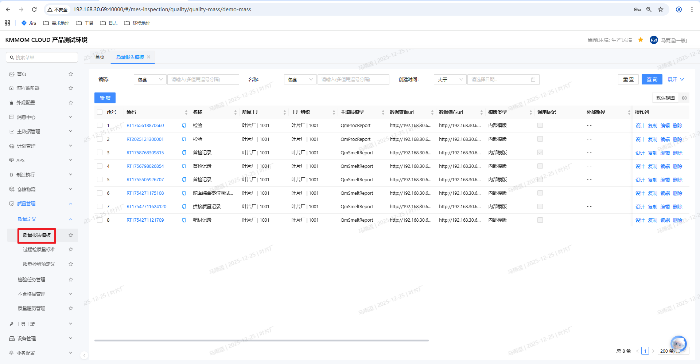
在系统主菜单中，依次点击 **质量管理  > 质量定义 > 质量报告模板**，进入模板列表页面。

#### 2. 查询模板

在查询区域输入以下条件（可选）：
- **业务组织**：选择组织范围
- **模板编码**：输入模板编码，支持多值查询（用逗号分隔）
- **模板名称**：输入模板名称，支持多值查询（用逗号分隔）
- **创建时间**：选择创建时间范围

点击 **查询** 按钮，系统显示符合条件的模板列表。

#### 3. 新增模板
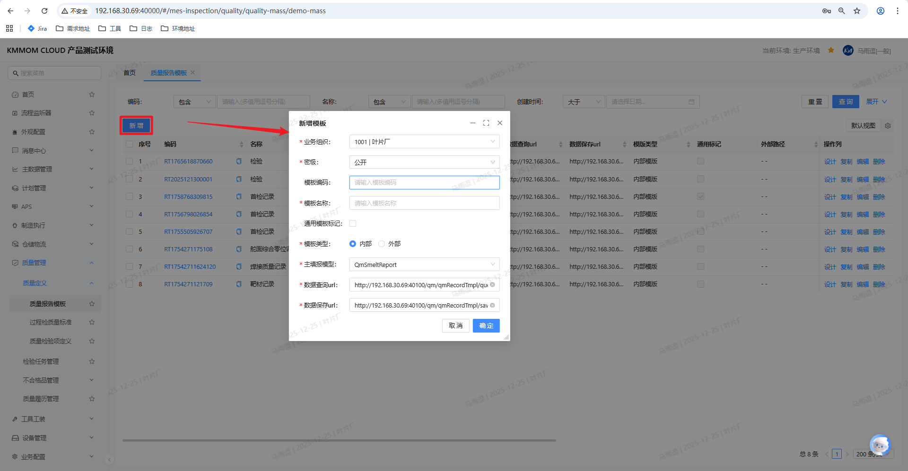
1. 点击列表上方的 **新增** 按钮
2. 在弹出的新增对话框中填写：
   - **模板名称**：必填，模板的唯一名称
   - **模板编码**：必填，可手动输入或由系统按编码规则自动生成
3. 点击 **保存**，系统创建模板记录并返回列表

> **提示**：模板编码默认规则为"RT + 年月日（6位）+ 流水号（5位）"，例如：RT25030100001

#### 4. 复制模板
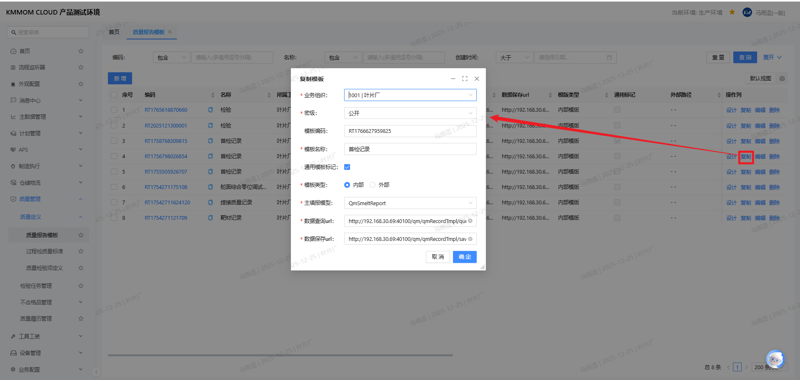
1. 在模板列表中，勾选一条需要复制的模板记录（仅支持单选）
2. 点击 **复制** 按钮
3. 系统弹出复制对话框，默认带入原模板的名称和编码（名称后缀"的副本"）
4. 可修改模板名称和编码
5. 点击 **确认**，系统复制模板及其设计内容，生成新记录

> **注意**：复制操作会同时复制模板的设计信息，适用于基于现有模板创建相似模板的场景

#### 5. 编辑模板基础信息
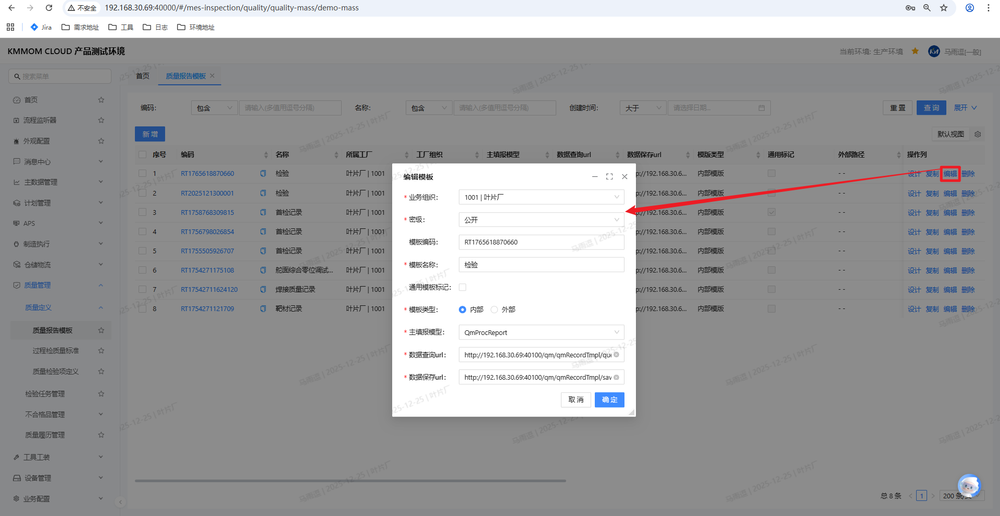
1. 在模板列表的操作列中，点击 **编辑** 按钮
2. 在弹出的编辑对话框中修改模板名称或编码
3. 点击 **保存** 完成修改

> **注意**：模板编码和名称必须唯一，修改时请确保不与现有模板冲突

#### 6. 设计模板
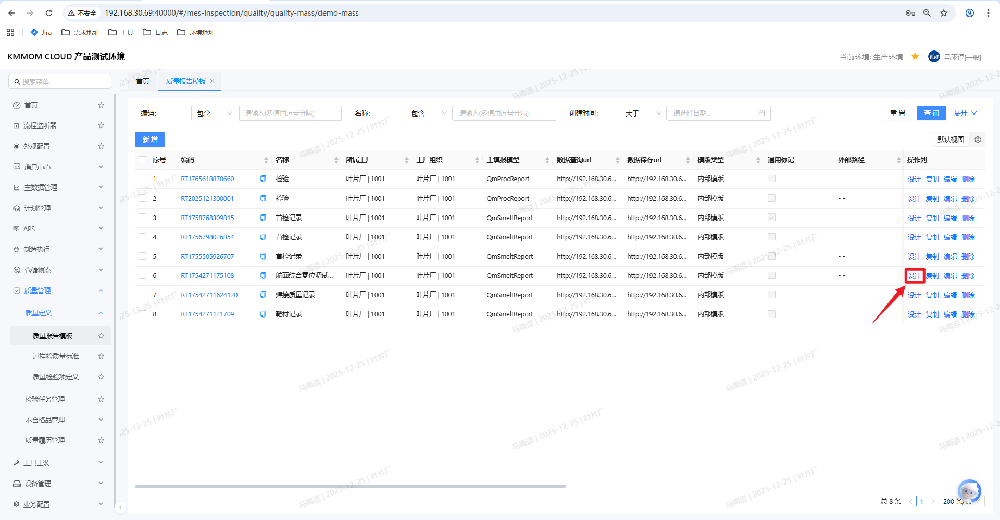
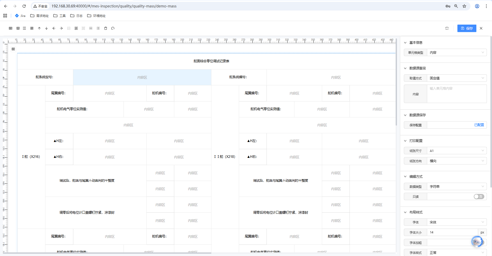
1. 在模板列表的操作列中，点击 **设计** 按钮
2. 系统打开全屏模板设计器界面
3. 在设计器中完成以下操作：
   - **添加元素**：拖拽文本、表格、图片等元素到设计区域
   - **数据源绑定**：为单元格或元素绑定数据源，支持传参变量
   - **设置属性**：配置单元格的数据类型、编辑方式、默认值、是否必填、是否只读等
   - **权限控制**：设置单元格级别的权限控制
   - **布局设置**：配置表头表尾固定、中间区域扩展、翻页保留内容等
   - **表达式**：使用表达式实现计算或条件显示
4. 设计完成后，点击设计器右上角的 **保存** 按钮
5. 关闭设计器，返回模板列表

> **提示**：设计器支持表头表尾固定、动态行填充、单元格权限控制、表达式等高级功能。如需跨页保留页眉内容，请在固定区域设置中配置

#### 7. 删除模板
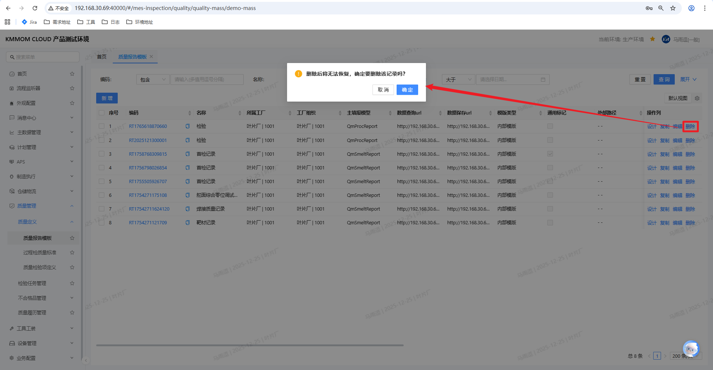
1. 在模板列表的操作列中，点击 **删除** 按钮
2. 系统弹出确认提示
3. 确认后，模板被删除

> **警告**：删除模板前，请确认该模板未被过程检质量标准关联，且未被检验任务使用。删除后无法恢复

### 过程检质量标准

#### 1. 进入过程检质量标准页面
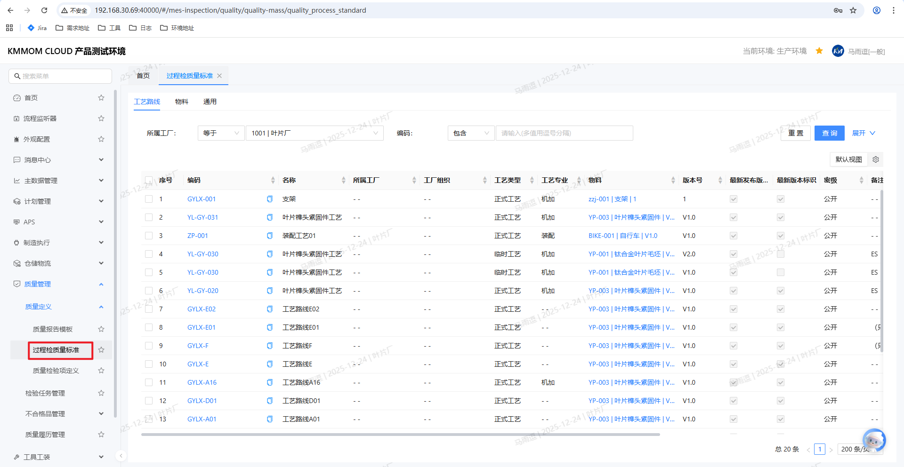
在系统主菜单中，依次点击 **质量管理 > 质量定义 > 过程检质量标准**，进入标准配置页面。

#### 2. 选择配置维度
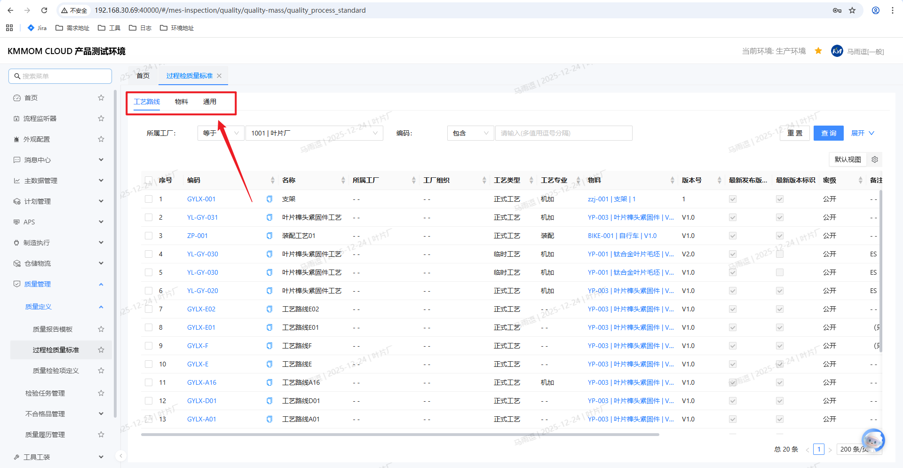
页面顶部有三个标签页：
- **工艺路线**：配置工艺路线和工序的检验分类配置、质量报告模板
- **物料**：配置物料的质量报告模板
- **通用**：查看通用质量报告模板

根据实际需求选择对应的标签页。

#### 3. 工艺路线（工艺路线维度）
1. 切换到 **工艺路线** 标签页
2. 在查询区域输入以下条件（可选）：
   - **所属工厂**：选择工厂，支持等于条件
   - **编码**：输入工艺路线编码，支持多值查询（用逗号分隔）
   - **名称**：输入工艺路线名称，支持多值查询（用逗号分隔）
3. 点击 **查询** 按钮，系统显示已发布的工艺路线列表

> **提示**：过程检质量标准仅显示已发布状态的工艺路线

#### 3.1 进入工艺质量基础配置
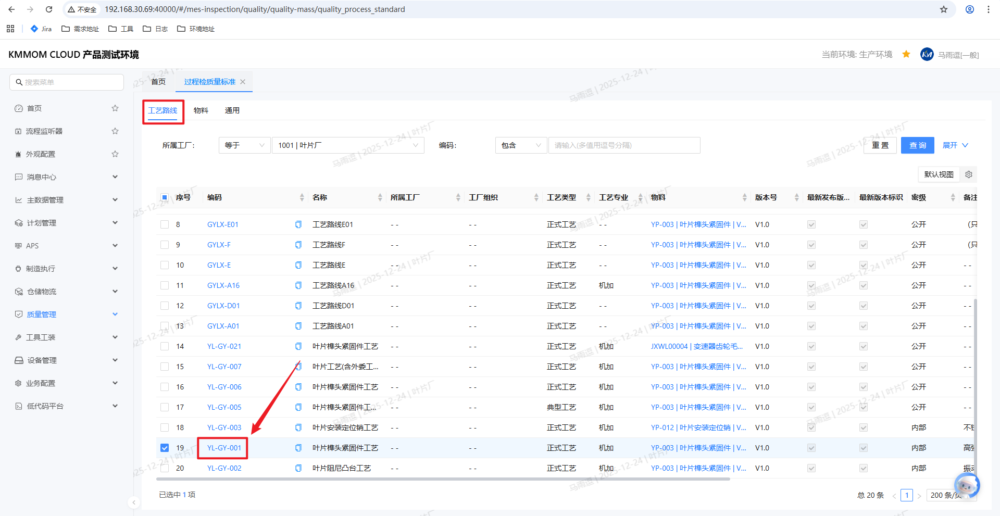
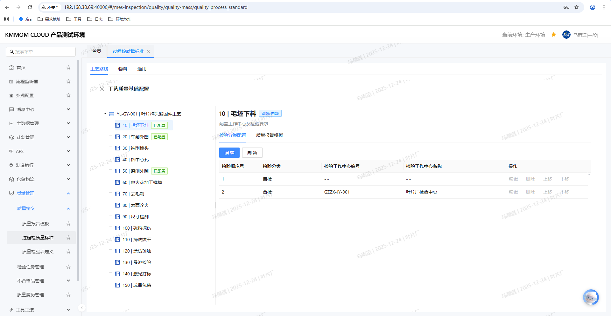
1. 在工艺路线列表中，点击目标工艺路线的 **编码** 链接（蓝色超链接）
2. 系统打开 **工艺质量基础配置** 页面
3. 页面左侧显示工艺路线树形结构，右侧显示配置详情区域

#### 3.2 配置检验分类

##### 3.2.1 选择配置节点
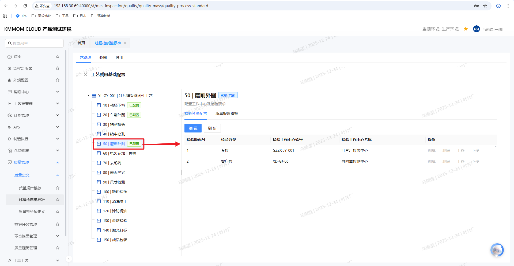
1. 在左侧工艺路线树中，选择需要配置的节点：
   - **工艺路线节点**：配置后，该工艺路线下所有工序任务都会生成对应的检验任务
   - **工序节点**：配置后，对应的工序任务会生成对应的检验任务
2. 系统默认选择第一个子节点（工序），右侧显示该节点的配置信息

##### 3.2.2 进入编辑模式
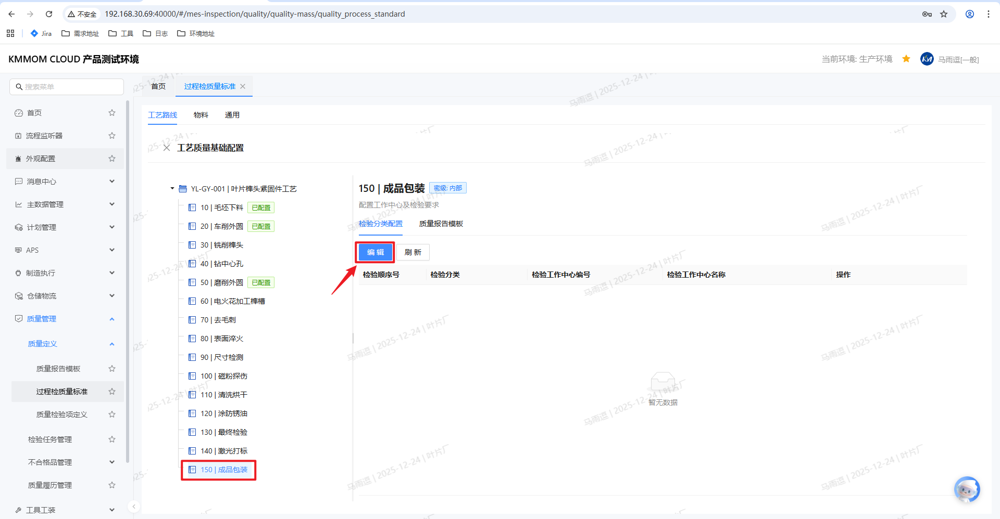
1. 在右侧配置区域，切换到 **检验分类配置** 标签页
2. 点击 **编辑** 按钮，进入编辑模式
3. 编辑模式下，**编辑** 按钮切换为 **保存** 和 **取消** 按钮

##### 3.2.3 新增检验分类配置
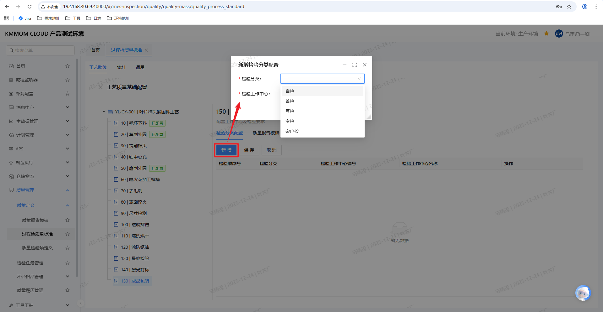
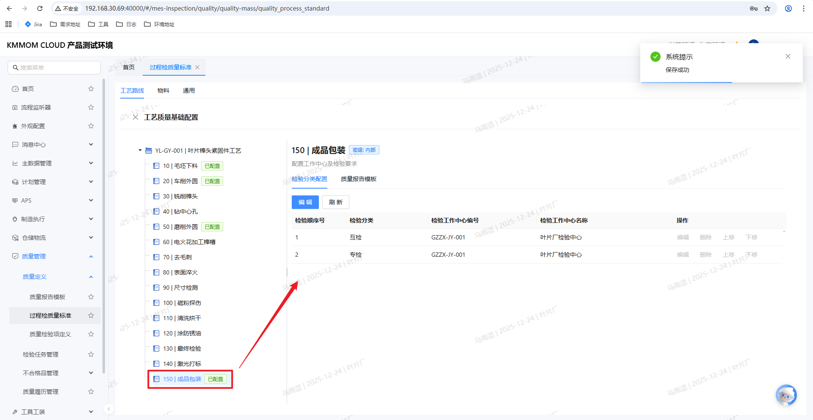
1. 点击 **新增** 按钮
2. 系统弹出 **新增检验分类配置** 对话框
3. 在对话框中配置：
   - **检验分类**：必填，从下拉列表中选择，可选值包括：
     - 自检
     - 互检
     - 专检
     - 客户检
     - 首检
   - **检验工作中心**：根据检验分类类型决定是否必填
     - **自检**：不需要选择检验工作中心（系统自动处理）
     - **其他类型**（互检、专检、客户检、首检）：必填，选择对应的检验工作中心
4. 点击 **确认**，系统添加检验分类配置到列表中

##### 3.2.4 调整检验顺序
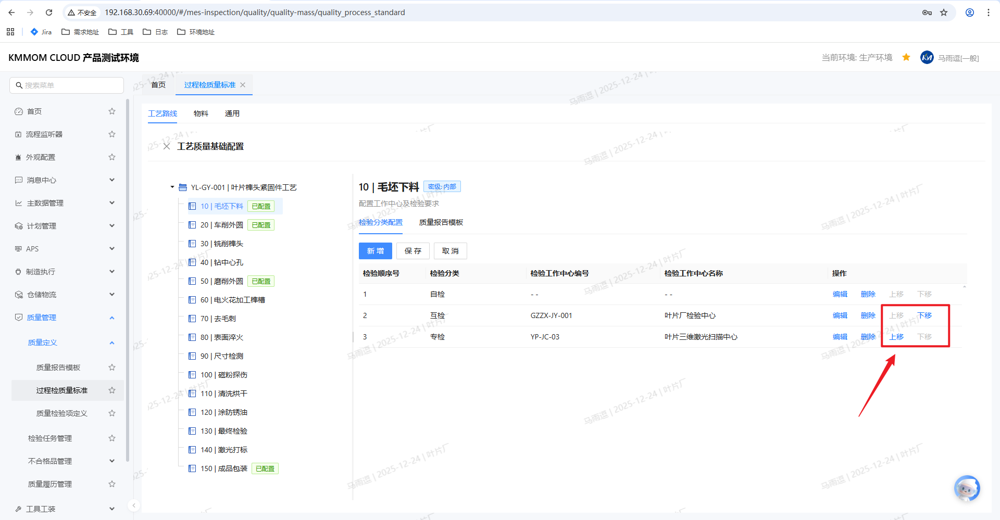
1. 在检验分类配置列表中，使用 **上移** 或 **下移** 按钮调整检验顺序号
2. 检验顺序号决定检验任务的执行顺序，系统按顺序号从小到大执行
3. **重要规则**：
   - 如果存在自检，自检的检验顺序号必须为 1，且不能修改
   - 检验顺序号不能相同

   > **配置影响说明**：
> - **工艺路线节点配置**：在工艺路线节点上配置检验分类后，制造订单工艺展开时，该工艺路线下所有工序任务均会生成对应的检验任务，且按照检验顺序号顺序生成
> - **工序节点配置**：在工序节点上配置检验分类后，制造订单工艺展开时，仅该工序任务会生成对应的检验任务，且按照检验顺序号顺序生成

##### 3.2.5 编辑或删除配置

1. 在列表中，点击某条配置的 **编辑** 按钮，可修改检验分类和检验工作中心
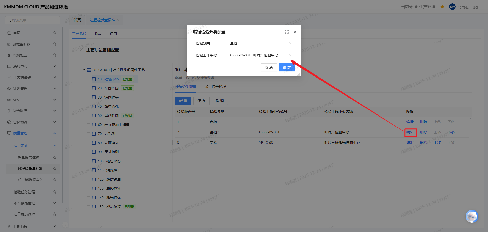
2. 点击 **删除** 按钮，可移除该配置
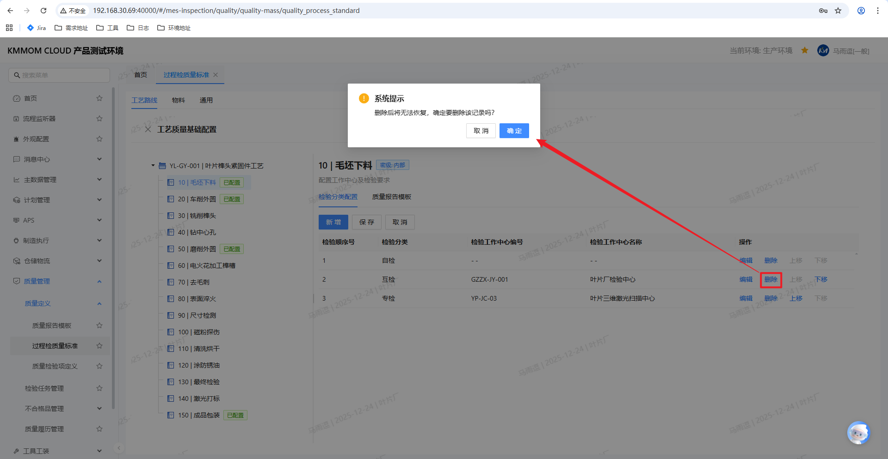
##### 3.2.6 保存配置
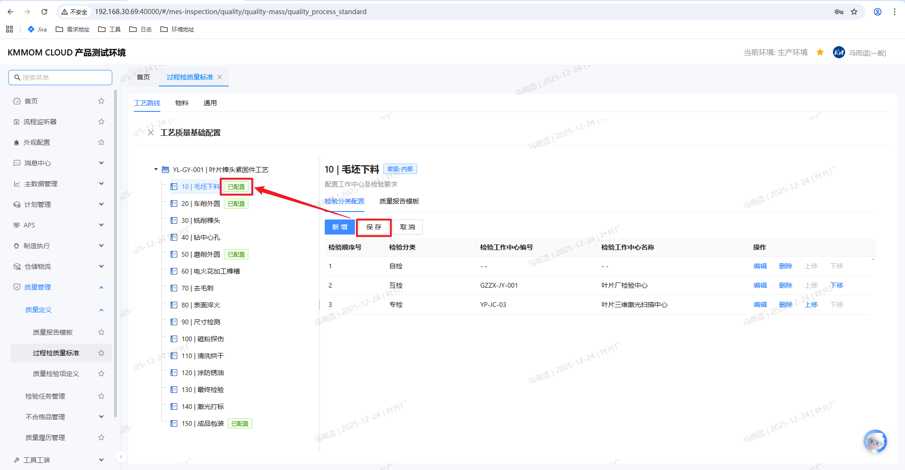
1. 完成所有配置后，点击 **保存** 按钮
2. 系统保存配置数据
3. 保存成功后，左侧工艺路线树中对应的节点会显示 **已配置** 标识（绿色标签）

> **提示**：配置检验分类后，对应的工艺路线/工序节点上会自动生成显示"已配置"标识

#### 3.3 关联质量报告模板（可选）

##### 3.3.1 引入质量报告模板

1. 在右侧配置区域，切换到 **质量报告模板** 标签页
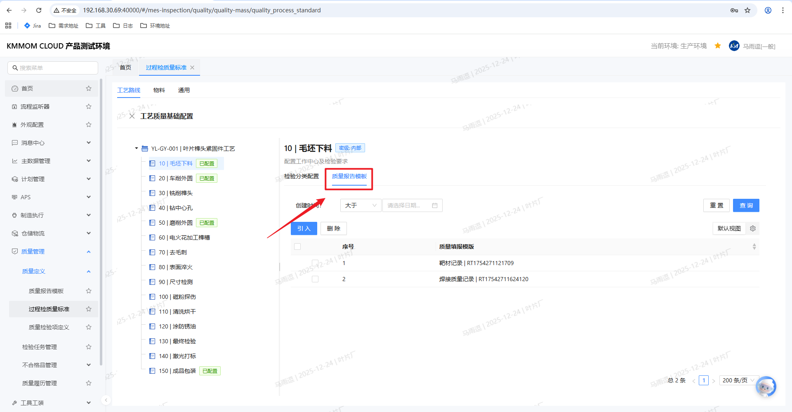
2. 点击 **引入** 按钮
3. 系统弹出 **质量报告模板引入** 对话框
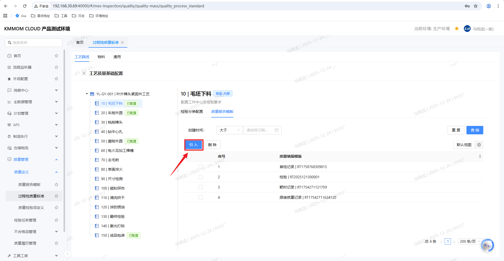
4. 在对话框中：
   - 可以通过 **所属工厂**、**编码** 等条件查询和筛选模板
   - 勾选需要关联的质量报告模板（支持多选）
   - 点击 **确认** 按钮，系统将选中的模板关联到当前工艺路线或工序
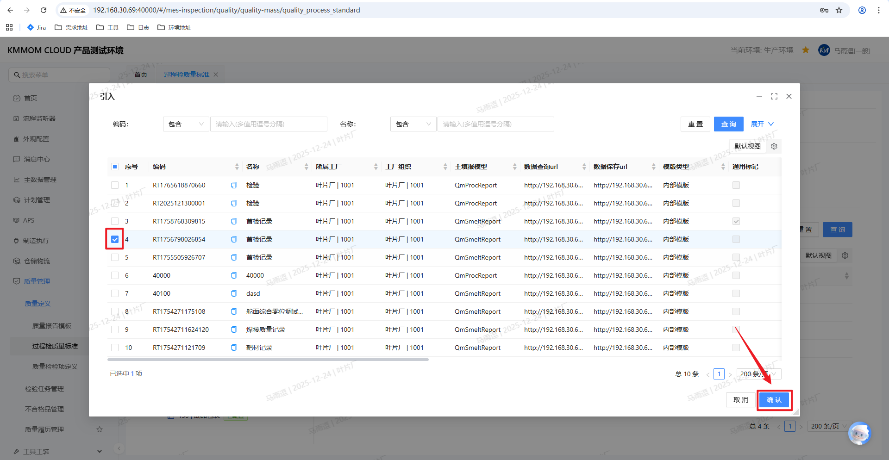
5. 返回工艺质量基础配置界面，可以看到已关联的质量报告模板列表

> **说明**：质量报告模板关联后，在检验任务执行时，检验员可以使用该模板进行质量填报

##### 3.3.2 删除已关联的质量报告模板
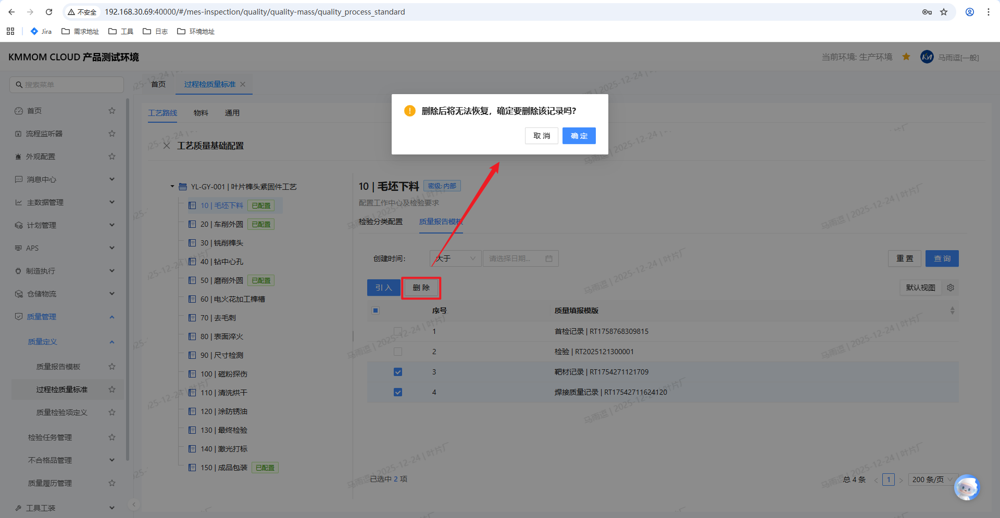
1. 在质量报告模板列表中，勾选需要删除的模板（支持多选）
2. 点击 **删除** 按钮
3. 系统弹出确认提示："删除后将无法恢复，确定要删除该记录吗？"
4. 点击 **确定**，系统删除该模板与工艺路线或工序的关联关系

> **注意**：删除操作仅移除模板与工艺路线或工序的关联关系，不会删除模板本身

#### 4. 配置物料标准

##### 4.1 查询物料
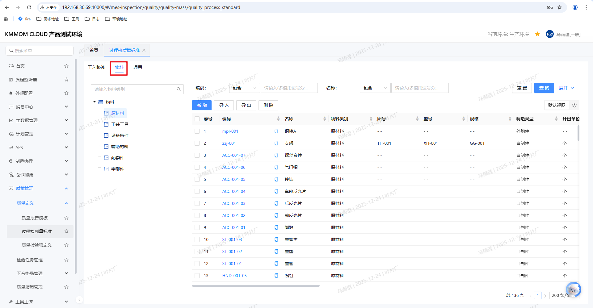
1. 切换到 **物料** 标签页
2. 在查询区域输入以下条件（可选）：
   - **物料类别**：输入物料类别进行查询
   - **编码**：输入物料编码，支持多值查询（用逗号分隔）
   - **名称**：输入物料名称，支持多值查询（用逗号分隔）
3. 点击 **查询** 按钮，系统显示符合条件的物料列表

##### 4.2 关联质量报告模板

1. 在物料列表中，点击目标物料的 **编码** 链接（蓝色超链接）
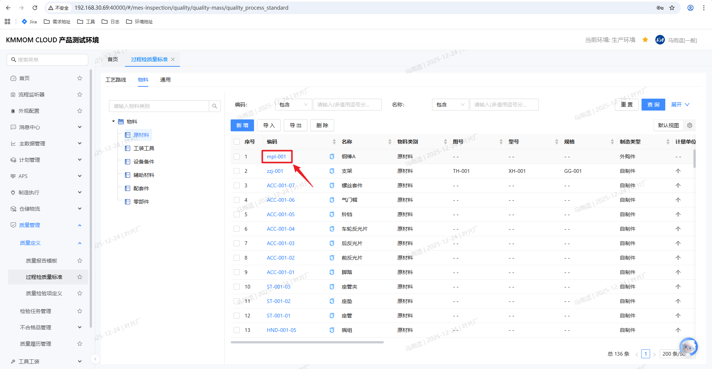
2. 系统打开 **物料信息详情** 界面
3. 在物料信息详情界面中，切换到 **质量报告模板** 标签页
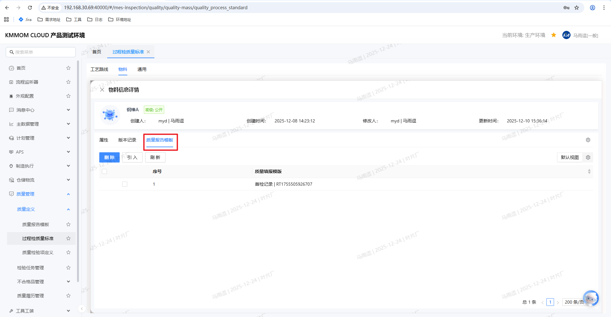
4. 点击 **引入** 按钮，系统弹出 **质量报告模板引入** 对话框
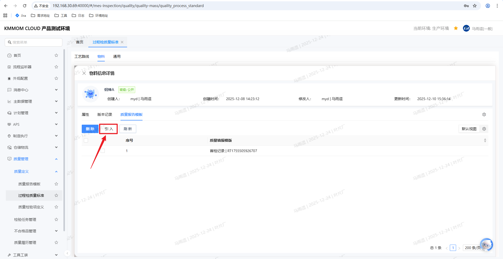
5. 在对话框中：
   - 可以通过 **所属工厂**、**编码** 等条件查询和筛选模板
   - 勾选需要关联的质量报告模板（支持多选）
   - 点击 **确认** 按钮，系统将选中的模板关联到该物料
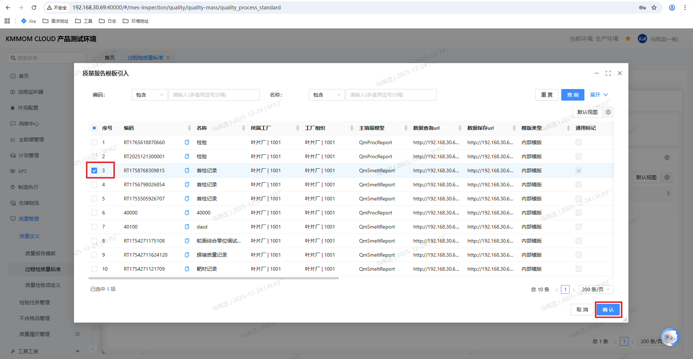
6. 返回物料信息详情界面，可以看到已关联的质量报告模板列表

##### 4.3 删除已关联的模板
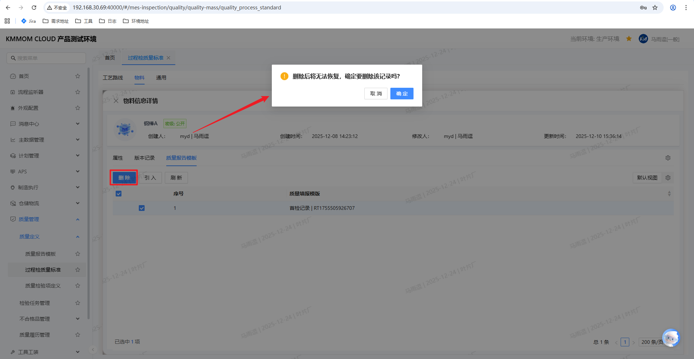
1. 在质量报告模板列表中，勾选需要删除的模板（支持多选）
2. 点击 **删除** 按钮
3. 系统弹出确认提示："删除后将无法恢复，确定要删除该记录吗？"
4. 点击 **确定**，系统删除该模板与物料的关联关系

> **说明**：质量报告模板关联后，在检验任务执行时，检验员可以使用该模板进行质量填报

#### 5. 查看通用标准（通用维度）

通用标准用于查看和管理标记为"通用"的质量报告模板。这些模板具有通用性，可以在检验任务中直接使用，无需关联到具体的工艺路线或物料。

##### 5.1 查询通用模板
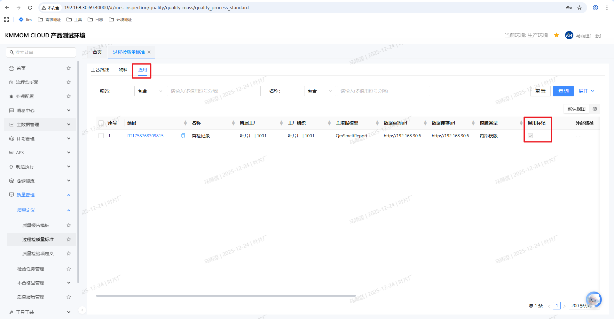
1. 切换到 **通用** 标签页
2. 在查询区域输入以下条件（可选）：
   - **编码**：输入模板编码，支持多值查询（用逗号分隔）
   - **名称**：输入模板名称，支持多值查询（用逗号分隔）
3. 点击 **查询** 按钮，系统显示符合条件的质量报告模板列表

> **说明**：通用标签页仅显示"通用标记"为"是"的质量报告模板。如果需要在通用标准中使用某个模板，需要在质量报告模板管理中将该模板的"通用标记"设置为"是"；通用标准主要用于查看和查询，模板的"通用标记"需要在质量报告模板管理界面中设置

## 注意事项

### 质量报告模板

> **编码规则**：模板编码遵循"前缀 RT + 年月日（6位）+ 流水号（5位）"的规则，系统支持编码规则自定义配置

> **唯一性要求**：模板名称和编码必须唯一，系统会在保存时进行校验

> **设计器功能**：设计器支持单值、表格等多种元素类型，支持文本、数值、日期、图片、视频等数据类型，支持输入框、下拉单选、下拉多选、日期选择等编辑方式

> **使用建议**：
> - 模板被过程检质量标准关联后，不建议频繁删除或大幅修改
> - 如需调整，建议先使用 **复制** 功能创建新版本，在测试环境验证后再替换
> - 避免影响已上线的检验任务

> **删除限制**：删除模板前，请确认该模板未被过程检质量标准关联，且未被检验任务使用。删除后无法恢复

### 过程检质量标准

> **发布状态要求**：仅支持已发布的工艺路线配置检验标准。未发布的数据不会在配置界面中显示

> **检验顺序规则**：
> - 自检的检验顺序号必须为 1，且不能修改
> - 其他检验分类的检验顺序号可以调整，但不能相同
> - 检验任务按照检验顺序号顺序执行

> **工作中心配置**：
> - 自检不需要配置检验工作中心
> - 互检、专检、客户检、首检必须配置检验工作中心

> **配置影响范围**：
> - 在工艺路线上配置检验后，该工艺路线下所有工序任务都会生成对应的检验任务
> - 在工序上配置检验后，仅对应的工序任务会生成对应的检验任务
> - 配置完成后，系统会在制造订单工艺展开时自动生成检验任务

> **配置顺序建议**：
> - 建议先完成质量报告模板的设计和发布
> - 再进行过程检质量标准的配置
> - 确保模板和标准配置完成后再进行制造订单的工艺展开