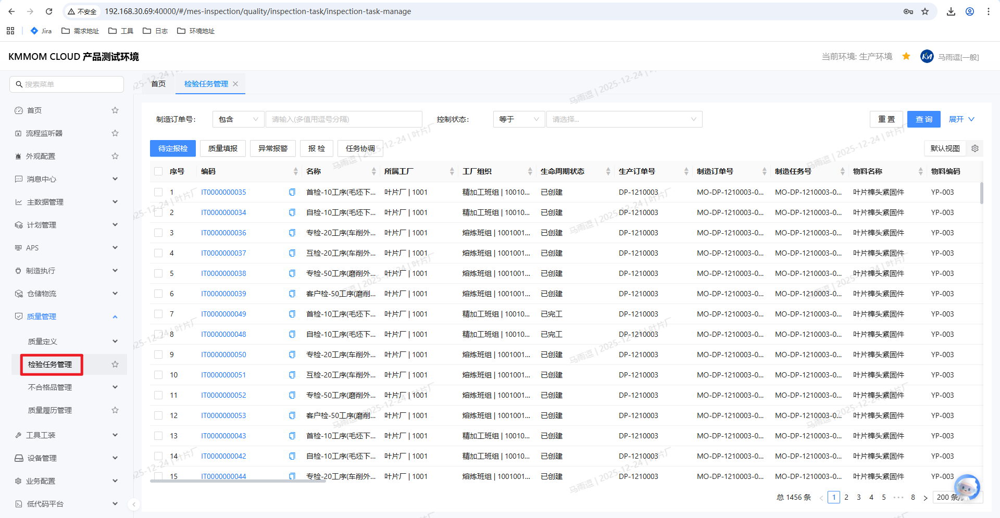
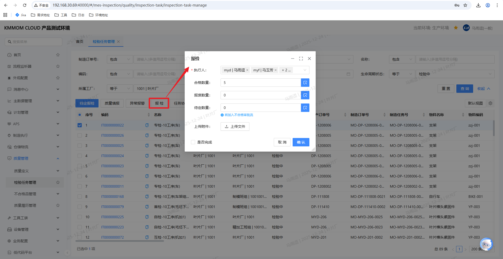
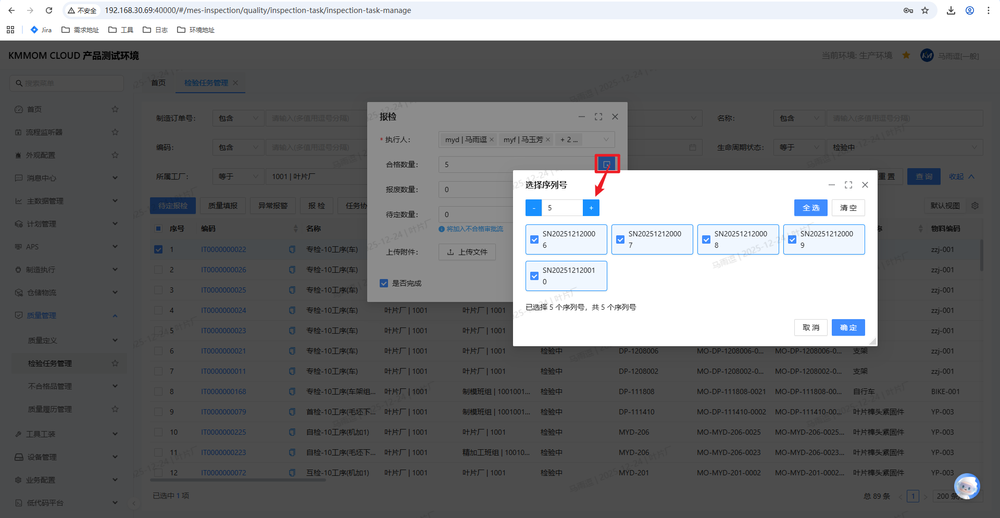
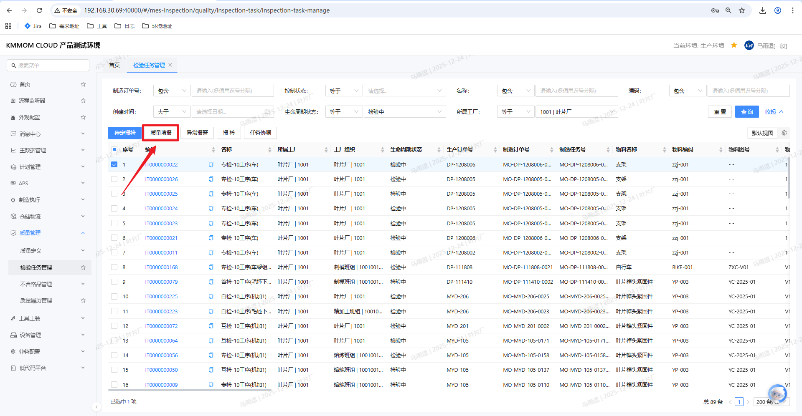
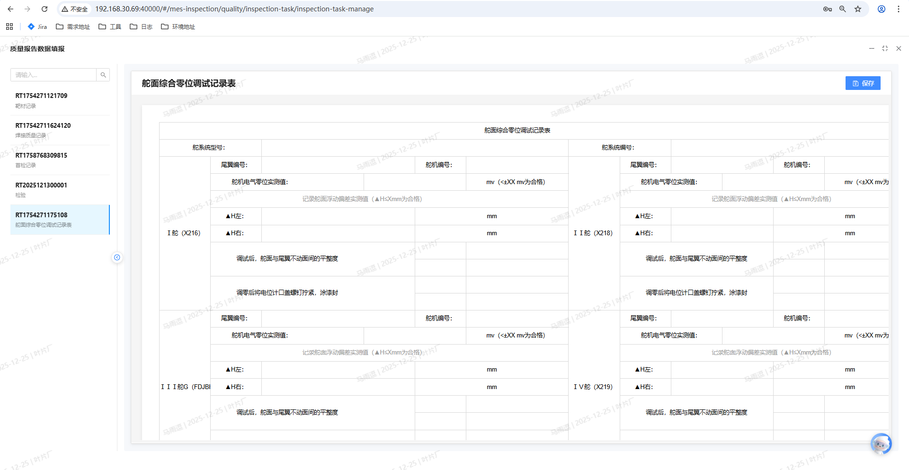
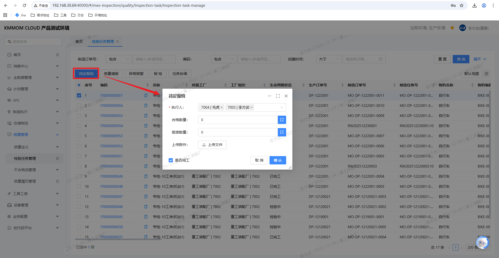
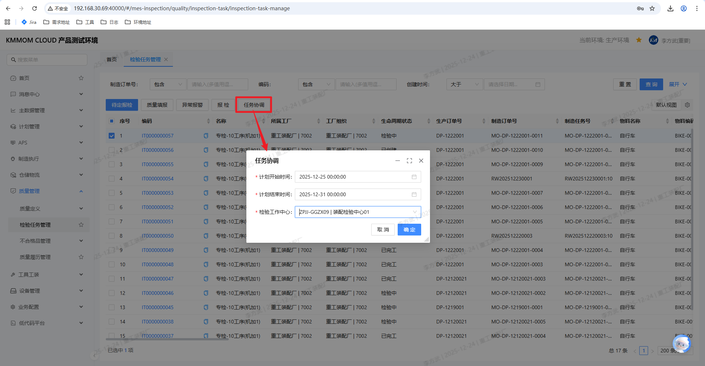
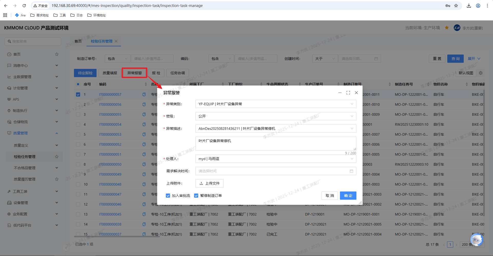

# 检验任务

## 功能概述

检验任务模块用于管理生产过程中的各类质量检验任务，包括自检、互检、专检、首检等。系统在制造订单工艺展开后，根据过程检质量标准中的检验分类配置自动生成检验任务，用户可在本模块中完成报检、质量填报、待定报检、任务协调及异常报警等操作，实现检验任务的全流程闭环管理。

检验任务的状态流转示例：
- **已创建**：工艺路线展开后，根据检验分类配置自动生成的初始状态。
- **检验中**：当上道工序任务 / 上道检验任务的合格数量流转到当前工序时，任务状态自动变为 **检验中**。
- **完工**：检验报工完成并满足完工条件后，任务状态变为 **完工**。

## 操作前置条件

1. 已完成以下配置：
   1. 在 **质量定义 > 过程检质量标准** 中配置好工艺路线、工序的检验分类及质量报告模板。
   2. 已在 **质量定义 > 质量报告模板** 中设计并发布相关质量报告模板。
2. 制造订单已在 **制造执行** 模块中进行工艺展开，使系统自动生成对应的检验任务。
3. 当前登录用户具备 **检验任务管理** 菜单权限及相应的工作中心权限。

## 核心功能

- **检验任务列表**：按条件查询待检 / 检验中 / 完工等状态的检验任务。
- **检验报检**：对处于 **检验中** 状态的任务进行数量报检，并决定是否完工。
- **质量填报**：基于已配置的质量报告模板进行质量数据填写与保存。
- **待定报检**：针对已发起不合格审理的检验任务，在审理完成后对待定数量进行最终报检。
- **任务协调**：在需要变更检验执行安排时发起任务协调。
- **异常报警**：在检验过程中发现重大异常时，发起异常报警并记录原因。
- **附件管理**：在报检、质量填报、异常报警等环节上传附件（如检验报告、照片等）。

## 操作指南

### 1. 进入检验任务管理

1. 在系统主菜单中，依次点击 **质量管理 > 质量定义 > 检验任务管理**。
2. 在检验任务列表上方的功能按钮区域，用户可以根据业务需要选择不同的功能按钮，例如：
   - **报检**
   - **待定报检**
   - **质量填报**
   - **异常报警**
   - **任务协调**
3. 在页面顶部设置查询条件，例如：
   1. **制造订单号**
   2. **控制状态**（如：正常、暂停、取消）
   3. **检验任务状态**（如：已创建、检验中、完工）
4. 点击 **查询** 按钮，系统显示符合条件的检验任务列表。

> **提示**：检验任务列表通常按检验工作中心过滤，仅显示当前登录用户所在工作中心的相关任务。

### 2. 检验任务生成规则（只读说明）

1. 用户在 **制造订单管理** 中对制造订单执行 **工艺展开** 操作。
2. 系统根据 **过程检质量标准** 中配置的检验分类，在对应工序上自动生成检验任务：
   1. 工艺路线节点配置的检验分类，会在该工艺路线下所有工序生成对应检验任务。
   2. 工序节点配置的检验分类，只在该工序生成对应检验任务。
3. 新生成的检验任务状态为 **已创建**。
4. 当上道工序任务或上道检验任务的合格数量流转到当前工序时，对应检验任务状态自动由 **已创建** 变为 **检验中**。

> **注意**：检验任务状态由系统根据任务流转规则自动更新，用户无需手动变更状态。

### 3. 特殊任务说明：自检与首检

#### 3.1 自检任务
1. 生成方式：工艺展开时按检验分类配置生成，自检任务随制造任务生成。
2. 执行特点：自检任务无需手动报检，对应的制造任务在制造任务台报工后，自检任务自动完成报检与数量流转。
3. 状态流转：制造任务报工成功后，自检任务从 **检验中** 自动变为 **完工**，无需人工操作。

#### 3.2 首检任务
1. 计划数量：首检任务固定计划数量为 **1**。
2. 流转规则：
   - 当制造任务存在首检任务时，制造任务初次报工只能报 **1** 个数量，该数量流转到首检任务。
   - 首检任务报检并完工后，制造任务剩余数量才允许继续报工并完工。
3. 状态流转：
   - 初次报工：制造任务数量=1 流转至首检任务，首检任务状态变为 **检验中**。
   - 首检报检完工：首检任务状态变为 **完工**，制造任务剩余数量可继续报工，后续检验任务按正常规则生成与执行。

### 4. 报检操作

#### 4.1 打开报检界面

1. 进入 **检验任务管理** 页面，在查询区域设置条件（如：制造订单号、物料编码、检验任务状态为“检验中”等），点击 **查询**。
2. 在任务列表中勾选一个或多个处于 **检验中** 状态的检验任务。
3. 点击 **报检** 按钮，系统弹出 **报检** 窗口。  

> **说明**：只有状态为 **检验中** 的任务允许报检，已创建或完工任务不能执行报检操作。

#### 4.2 填写报检信息

1. 在 **报检** 窗口中填写以下字段：
   1. **执行人**：默认当前登录用户，可下拉选择其他具有权限的检验人员。
   2. **合格数量**：本次检验判定为合格的数量。
   3. **报废数量**：本次检验判定为报废的数量（如有）。
   4. **待定数量**：对于暂无法判定合格 / 不合格的在制品，可填写为待定数量。
   5. **上传附件**（可选）：点击 **上传文件** 按钮，选择并上传相关检验报告。
   6. **是否完成**：勾选表示本次报检后任务将按完工逻辑处理；不勾选则任务保持 **检验中** 状态，可后续继续报检。
2. 点击 **确认** 按钮提交报检信息。
3. 系统校验数量之和不超过任务待检数量，如不合法会提示用户修改。

> **提示**：当检验任务配置了发起不合格审理的规则时，待定数量会进入不合格审理流程，后续需通过“待定报检”完成最终报检。

### 5. 质量填报

#### 5.1 进入质量填报界面

1. 在 **检验任务管理** 页面，查询到目标检验任务后，勾选需要进行质量填报的检验任务（通常状态为 **检验中** 或已完成数量录入的任务）。  

2. 点击 **质量填报** 按钮，系统打开所关联的质量报告模板界面。

#### 5.2 填写质量报告

1. 在质量报告界面中，根据模板结构填写相应字段，例如：
   1. 任务单号、物料名称、批次号等基本信息。
   2. 检验项目项下的实测值、判定结果、备注等。
2. 如有多条记录（例如多炉次、多序列号），用户可以逐条录入。
3. 填写完成后，点击右上角 **保存** 按钮。  

4. 系统提示保存成功，并将填报数据与当前检验任务建立关联。

> **说明**：质量填报不会直接改变检验任务状态，其作用是为报检及后续质量分析提供详细的检验数据记录。

### 6. 待定报检

#### 6.1 业务场景说明

当检验任务报工时选择了 **发起不合格审理**，系统会将存在疑问的数量以 **待定数量** 的形式冻结在当前检验任务中，等待不合格审理结论。典型业务场景如下：
- **装配业务场景**：  
  1. 装配检验任务中发现总成不合格，检验员在报检时勾选“发起不合格审理”，对应数量形成待定数量；  
  2. 在不合格审理过程中，经分析确认问题根因为某个子件不合格，而总成本身并无质量问题；  
  3. 对问题子件执行返工 / 返修 / 报废等处理，处理过程多在现场线下完成（如拆卸、重新装配、替换零件等），系统中仅记录不合格审理结论；  
  4. 线下处理完成、总成满足要求后，需要由质量人员在系统中对原装配检验任务的待定数量进行 **手工待定报检**，按照审理结论将冻结的待定数量转为最终的合格、报废、返工或返修数量。
因此，待定报检的作用是：在不合格审理完成后，将原先因复杂原因暂缓处理的待定数量，按照审理结论在系统中进行最终数量划分和结案，保证在制品账面数量与现场实物状态一致。

#### 6.2 待定报检操作步骤

1. 在 **检验任务管理** 页面，根据需要在查询区域输入检验任务编号、制造任务号等条件，点击 **查询**。
2. 在任务列表中勾选存在待定数量且已完成不合格审理的检验任务。
3. 点击**待定报检** 按钮，系统弹出待定报检窗口。
4. 在待定报检窗口中，填写报工数量。
6. 点击 **确认** 提交，系统同步更新检验任务的数量及状态。

> **注意**：只有已完成不合格审理反馈的待定数量才能进行待定报检；否则系统会提示“未完成不合格审理，无法进行待定报检”。

### 7. 任务协调

#### 7.1 任务协调业务说明

当检验任务在执行中需要调整执行时间、执行工作中心或协调其他资源时，可通过 **任务协调** 功能进行记录与跟踪。任务协调不会直接修改任务的技术配置，但会形成协调记录，便于后续追溯。

#### 7.2 任务协调操作步骤

1. 在 **检验任务管理** 页面，根据需要在查询区域筛选出需要协调的检验任务。  
2. 在任务列表中勾选需要协调的检验任务。
3. 点击 **任务协调** 按钮，系统弹出任务协调窗口。
4. 在窗口中填写：
   1. **计划开始时间 / 计划结束时间**
   2. **检验工作中心**：选择协调后的目标检验工作中心。
   3. **协调说明**：简要说明协调原因和要求。
5. 点击 **确认** 提交，系统生成任务协调记录。

> **说明**：任务协调功能的具体约束（如是否允许跨工厂协调）取决于项目实施配置。

### 8. 异常报警

#### 8.1 异常报警业务说明

在检验过程中，若发现严重影响产品质量或生产安全的异常情况（如设备异常、批量不合格等），用户可发起 **异常报警**，系统会记录异常原因并可触发后续处理流程。

#### 8.2 异常报警操作步骤

1. 在 **检验任务管理** 页面，根据需要在查询区域筛选出需要发起异常报警的检验任务。  
2. 在任务列表中勾选需要发起异常报警的检验任务。
3. 点击 **异常报警** 按钮，系统弹出异常报警窗口。
4. 在窗口中填写：
   1. **异常类别**：从下拉列表中选择，如“设备异常”、“工艺异常”等。
   2. **密级**：选择异常信息的密级（如：公开 / 内部）。
   3. **异常描述**：详细描述异常情况及影响范围。
   4. **处理人**（如配置）：选择后续处理责任人。
   5. **上传附件**（可选）：上传异常照片、记录表等。
   6. **加入审批流**（可选）：勾选后，系统将异常信息提交至配置的不合格或异常处理流程。
   7. **暂停制造任务**（可选）：勾选后，对应的制造任务和制造订单均暂停，异常处理完成后，自动恢复。
5. 点击 **确认** 提交异常报警。

> **提示**：异常报警记录可在后续的异常分析、质量改进等功能中进行查询和统计。

## 注意事项

### 1. 状态与权限

> **状态约束**：  
> - **已创建**：仅可查看，不可报检、待定报检。  
> - **检验中**：允许报检、质量填报、异常报警、任务协调。  
> - **完工**：仅允许查看历史记录和质量报告，不可再次报检。  
>
> **权限建议**：  
> - 仅授权质量检验人员和相关管理人员使用报检、质量填报、待定报检、异常报警功能。  
> - 普通操作员如需查看检验结果，应通过只读界面或报表查看。

### 2. 数量校验

> - 报检时，合格 / 报废 / 待定等数量之和不得超过任务待检数量。  
> - 待定报检时，必须完全消化待定数量，避免长期存在未结清的待定数量。  
> - 对于需要分批检验的任务，应根据项目配置合理规划每次报检数量。

### 3. 质量报告模板使用

> - 质量填报依赖于 **质量定义 > 质量报告模板** 中的模板配置，如无可用模板，质量填报按钮可能不可用或仅支持附件上传。  
> - 建议在上线前通过测试环境验证各类检验任务与对应质量报告模板的匹配关系。

### 4. 异常与不合格处理衔接

> - 在报检或异常报警中勾选“发起不合格审理”或“加入审批流”后，对应的数量或记录会进入不合格 / 异常处理流程。  
> - 不合格审理完成后，质量人员需尽快通过 **待定报检** 完成数量结算，保证在制品账实一致。
