# 不合格品审理

## 1. 功能概述

不合格品审理功能用于对生产过程中产生的**待定在制品**进行统一评审和处置决策。  
当制造任务或检验任务在报工 / 报检时上报**待定数量**，系统会根据配置自动生成**不合格品审理单**，并可将其加入不合格审理流程，由相关人员给出**合格、报废、让步接收、返工、返修**等审理结论，最终将处理结果回写到原始任务，实现质量闭环管理。

> **说明**：本功能主要面向质量工程师、生产主管等角色，用于规范不合格品处理流程，减少线下纸质单据和口头沟通带来的遗漏与错误。

## 2. 核心功能

1. **不合格品审理单自动生成**
   - 制造任务报工或检验任务报检时，若上报待定数量，系统可自动生成不合格品审理单。
   - 支持根据业务配置自动将审理单加入不合格审理流程。
2. **不合格品审理单生命周期管理**
   - 支持状态管理：**待审理**、**审理中**、**审理完成**。
   - 支持在不同状态下执行对应操作（加入流程、编制结论、处理不合格、审理完成）。
3. **审理结论编制**
   - 当专业类型为**机加专业**时，仅支持对主件进行审理。
   - 当专业类型为**装配专业**时，支持对子件进行审理。
   - 支持配置多种审理结论：**合格、报废、让步接收、返工、返修**。
4. **不合格处理执行**
   - 根据审理结论，对原始制造任务 / 检验任务的待定数量进行数量拆分和状态更新。
   - 可触发后续返工返修订单、报废入库申请等处理（由其他业务模块承接）。
5. **与报工 / 报检联动**
   - 与**制造任务报工**、**检验任务管理-报检**功能联动，支持一线人员在报工 / 报检时仅录入数量，由系统自动驱动后续不合格品审理流程。

## 3. 操作前置条件

1. 用户已开通以下菜单权限：
   1. **质量管理 > 不合格品审理单管理**
2. 系统已完成以下业务配置：
   1. 报工策略中已配置**待定**类型汇报项。
   2. 在系统管理的业务配置中，为对应的**业务组织**配置默认的不合格审理流程标识（用于自动加入流程）：
      1. 进入 **系统管理 > 业务配置 > 业务组织配置**。
      2. 在左侧选择具体的**业务组织 / 车间**，在右侧 **不合格品审理** 区域维护 **默认加入的不合格品审理流程标识**。
      3. 填写的流程标识必须与工作流中实际存在的不合格审理流程标识一致。
      4. 配置完成后，制造任务 / 检验任务在报工 / 报检生成不合格品审理单时，系统即可根据该标识自动将审理单加入对应流程。
      5. 如需图示，可参考：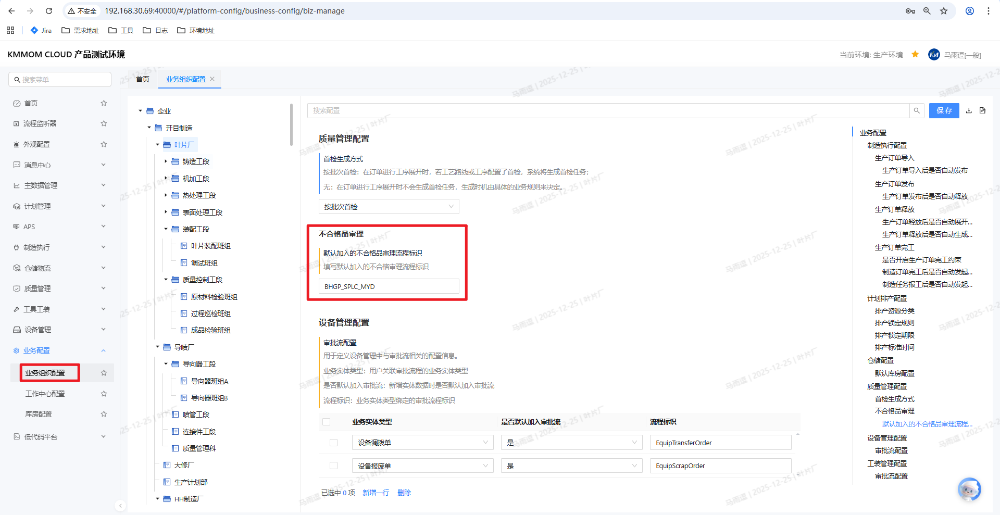
3. 制造任务 / 检验任务处于允许报工 / 报检的状态，且存在可报工（可报检）数量。

> **注意**：若当前工厂或业务组织未配置默认不合格审理流程，系统仍会生成不合格品审理单，但不会自动加入流程，需要用户在审理单列表中手工执行 **加入流程** 操作。

## 4. 操作指南

### 4.1 进入不合格品审理单管理

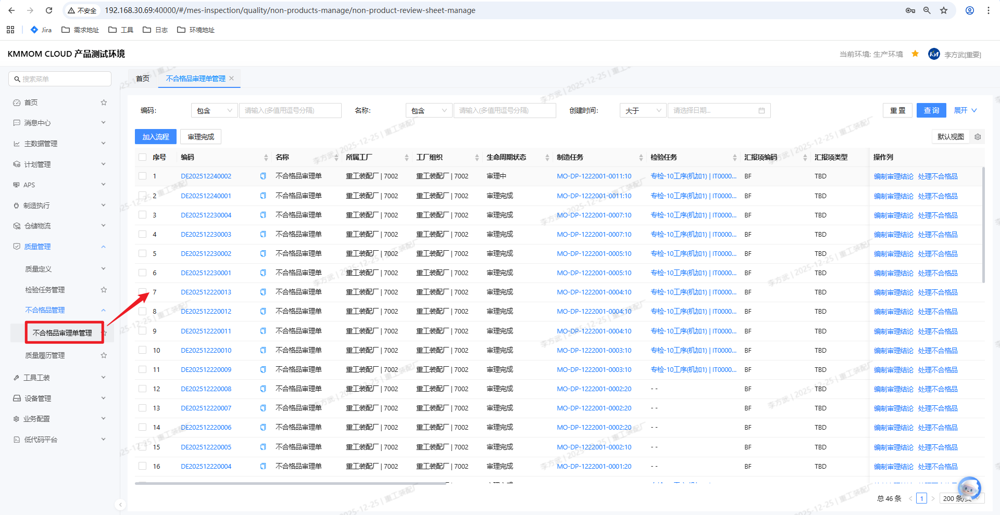
1. 在系统主菜单中，依次点击 **质量管理 > 不合格品管理 > 不合格品审理单管理**。
2. 系统打开 **不合格品审理单管理** 页面，上方为查询条件区域，下方为审理单列表。
3. 在查询条件中可按 **编码**、**审理状态**、**所属组织** 等条件进行筛选。
4. 点击 **查询** 按钮，系统显示符合条件的不合格品审理单列表。

> **建议**：日常操作建议以 **审理状态=待审理 / 审理中** 为主进行筛选，方便快速处理未完成的审理单。

### 4.2 不合格品审理单自动生成规则

#### 4.2.1 制造任务报工场景

1. 用户在 **制造任务报工** 界面中，对任务进行报工：
   1. 若任务**不存在关联的检验任务**：
      1. 在报工界面中录入 **待定数量**。
      2. 报工保存后，系统自动创建一张**不合格品审理单**，并根据业务配置判断是否自动加入不合格审理流程。
   2. 若任务**存在关联的检验任务**：
      1. 制造任务报工时仅记录待定数量，不会生成不合格品审理单。
      2. 对应的检验任务在后续 **报检** 时，若上报待定数量，才会触发不合格品审理单的生成。

#### 4.2.2 检验任务报检场景

1. 用户在 **检验任务管理** 页面中执行报检：
   1. 在报检对话框中录入 **待定数量**。
   2. 点击 **确认** 后，系统自动生成不合格品审理单。
   3. 是否自动将新建审理单加入不合格审理流程，由业务组织上的配置决定：当 **系统管理 > 业务配置 > 业务组织配置** 中维护了 **默认加入的不合格品审理流程标识** 且流程有效时，系统会自动将审理单加入对应审批流程；未配置或流程无效时，仅生成审理单，不自动加入流程。

#### 4.2.3 审理单生命周期说明

1. **待审理**：系统已生成审理单，但尚未加入流程或未开始审理。
2. **审理中**：审理单已加入不合格审理流程，当前正在流程中流转或处于人工审理阶段。
3. **审理完成**：已完成审理结论处理，对应的不合格品已根据结论执行完毕（如数量分配、返工返修、报废等），审理单进入只读状态。

### 4.3 查询与查看审理单

1. 在 **不合格品审理单管理** 页面上方输入查询条件，例如：
   1. **业务组织**
   2. **编码**
   3. **审理状态**（待审理、审理中、审理完成）
2. 点击 **查询** 按钮。
3. 在列表中双击审理单编码，或点击编码超链接，进入审理单详情页。
4. 在详情页中查看：
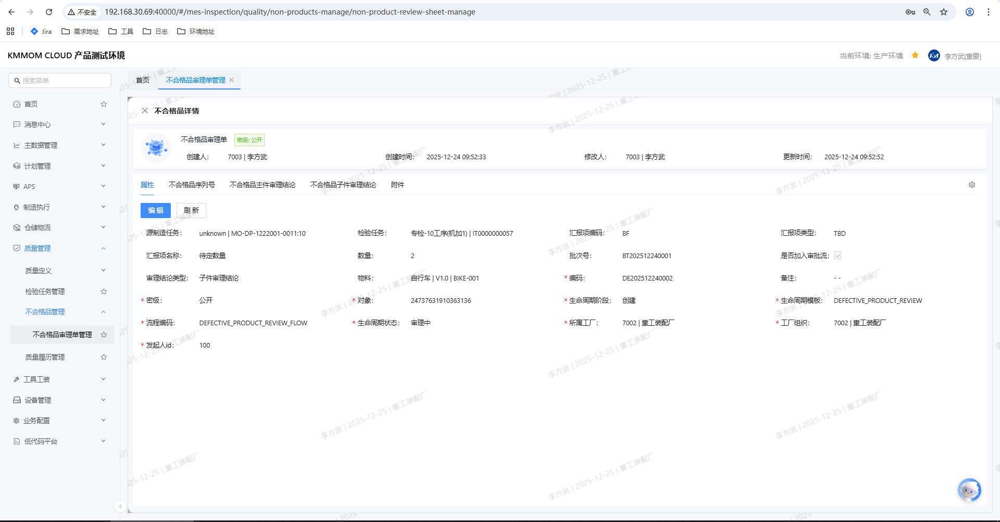
   1. 不合格品基本信息（物料、批次、来源制造任务 / 检验任务等）。
   2. 当前待审理数量。
   3. 已编制的主件 / 子件审理结论。

> **说明**：处于 **审理完成** 状态的审理单仅支持浏览，不允许再编辑或重复处理。

### 4.4 加入不合格审理流程

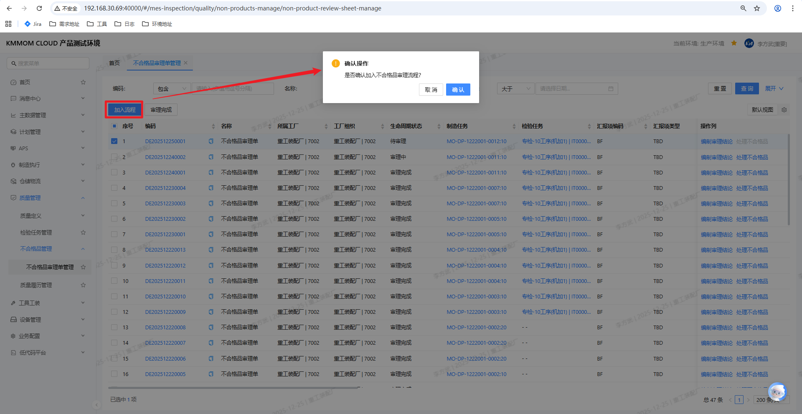
1. 在 **不合格品审理单管理** 列表中，勾选一条或多条状态为 **待审理** 的审理单。
2. 点击 **加入流程** 按钮。
3. 系统弹出二次确认窗口，提示"是否确认将选中的不合格品审理单加入流程？"。
4. 点击 **确认**：
   1. 系统校验当前工厂是否配置了默认的不合格品审理流程标识。
   2. 若配置有效，则将审理单加入对应的审批流程，并将审理状态更新为 **审理中**。
   3. 若配置缺失或流程标识无效，系统提示加入流程失败，审理单状态保持为 **待审理**，用户可后续手动处理或修正配置后重试。

> **注意**：仅 **待审理** 状态的审理单允许加入流程；审理中或审理完成的审理单不再允许重复加入流程。

### 4.5 编制审理结论

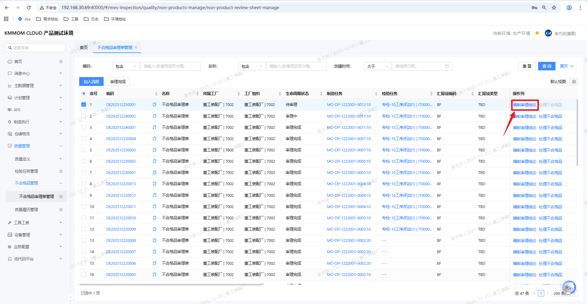
1. 在 **不合格品审理单管理** 列表中，定位需要处理的审理单，在右侧 **操作列** 中点击 **编制审理结论** 超链接。
2. 系统弹出 **审理结论编制** 窗口，在该窗口中编辑审理结论。
3. 选择审理对象类型（主件审理或子件审理）：
   1. 当**专业类型为机加专业**时：
      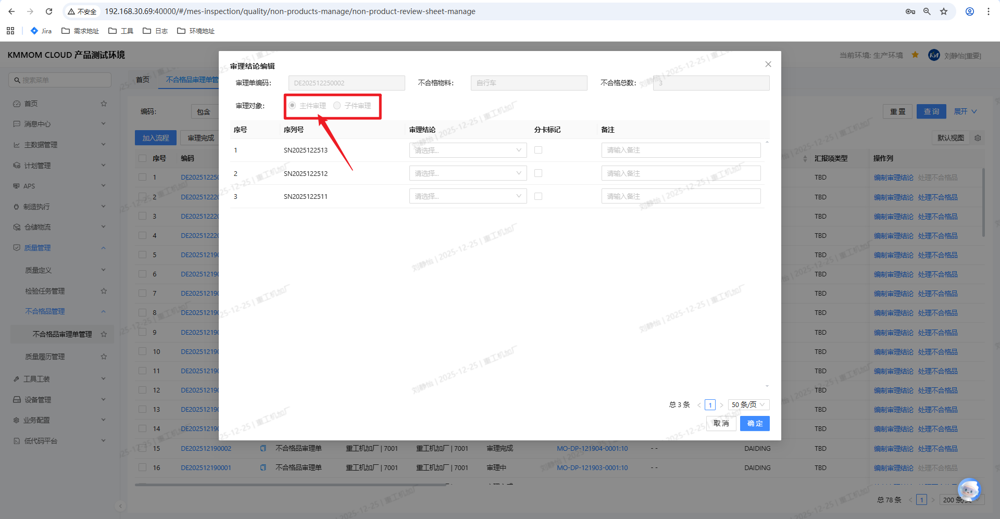
      1. 仅支持**主件审理**，系统仅展示主件相关信息。
      2. 用户只能基于主件维度录入审理结论。
   2. 当**专业类型为装配专业**时：
      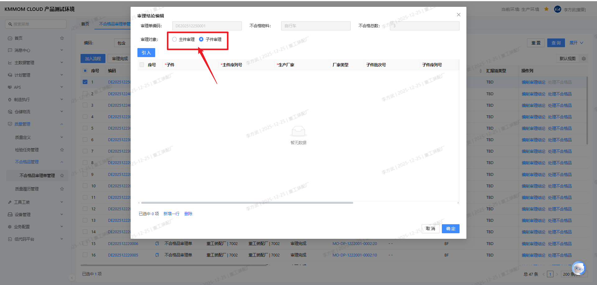
      1. 页面支持选择**主件审理**或**子件审理**。
      2. **装配业务场景说明**：当装配检验任务中发现总成不合格，检验员在报检时勾选"发起不合格审理"，对应数量形成待定数量。在不合格审理过程中，经分析确认问题根因为某个子件不合格，而总成本身并无质量问题。此时需对问题子件执行返工 / 返修 / 报废等处理。
4. 根据审理对象类型录入审理结论：

   **主件审理**：
   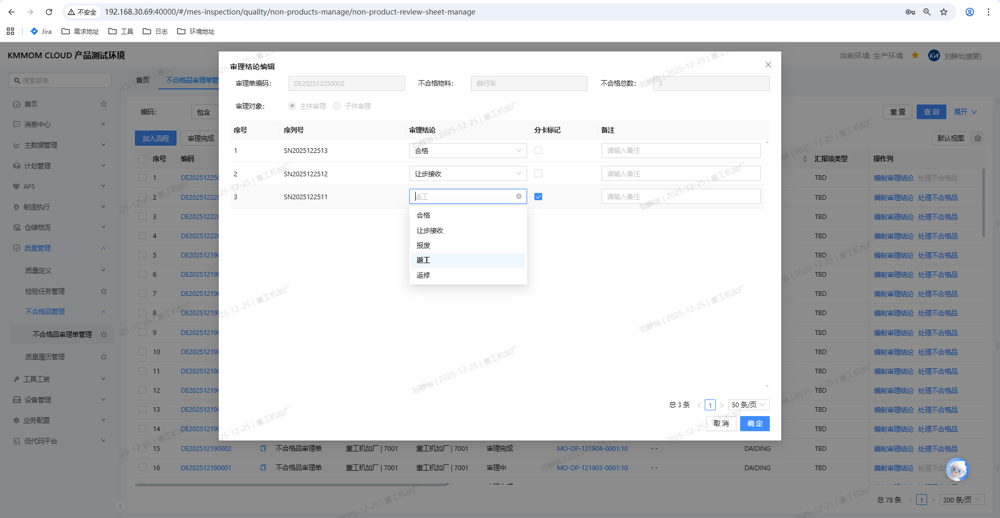
   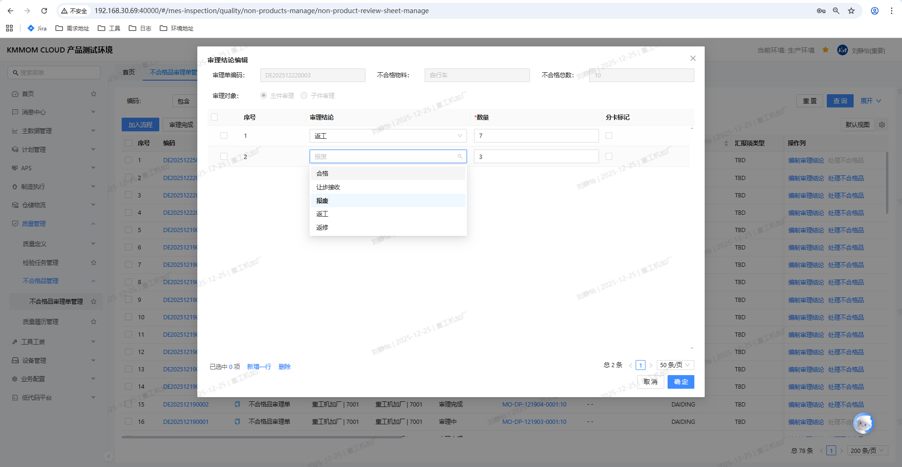
   1. **若存在序列号不合格**：
      1. 系统自动展示序列号列表，直接输入对应序列号的**审理结论**（从下拉框中选择 **合格、报废、让步接收、返工、返修** 之一）。
      2. 设置**是否分卡**标记。
   2. **若不存在序列号**：
      1. 输入**审理结论**（从下拉框中选择 **合格、报废、让步接收、返工、返修** 之一）。
      2. 输入对应的**审理数量**。
      3. 设置**是否分卡**标记。

   **子件审理**：
   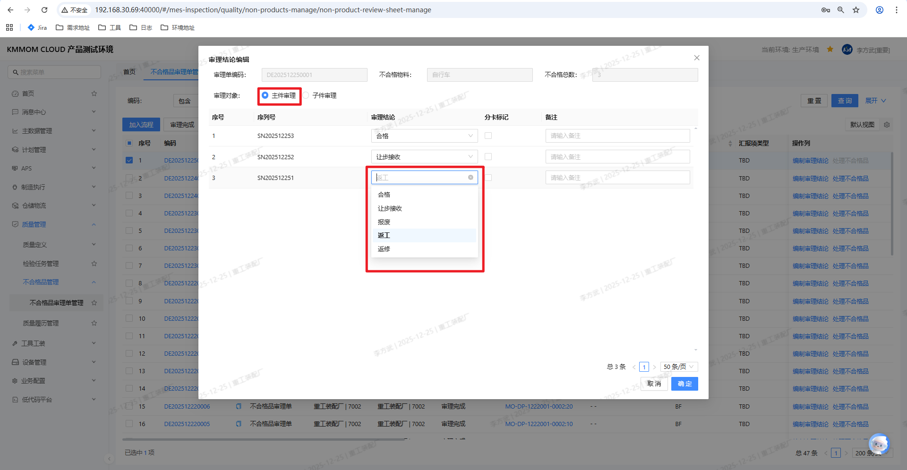
   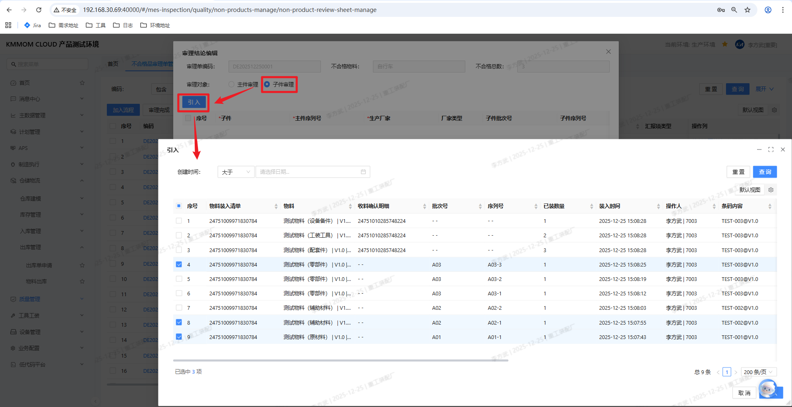
   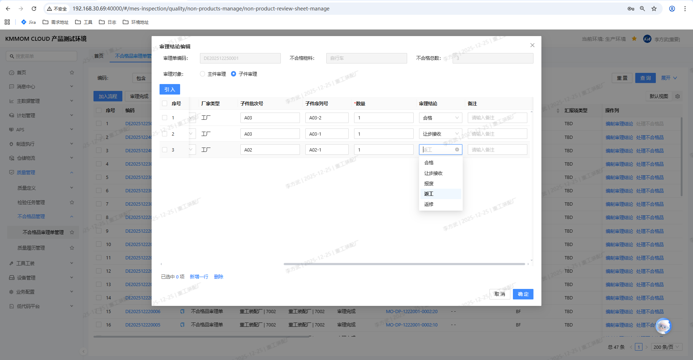
   1. 选择**子件审理**后，点击 **引入** 按钮，系统自动引入已装入的子件内容。
   2. 引入子件后，系统自动带出子件的基本属性（子件、主件序列号、生产厂家、子件批次号、子件序列号、数量等）。
   3. 用户只需在子件列表中修改**审理结论**（从下拉框中选择 **合格、报废、让步接收、返工、返修** 之一）即可，可为不同子件逐一录入不同审理结论，实现对不同子件的差异化处理。
5. 点击 **确定** 或 **保存** 按钮，系统根据审理对象类型进行校验：
   1. **主件审理**：
      1. 各结论数量之和必须等于待审理数量。
      2. 必填字段必须完整。
   2. **子件审理**：
      1. 必填字段必须完整（子件、主件序列号、生产厂家等）。
      2. **系统不会校验各结论数量之和是否等于待审理数量**。
6. 校验通过后，系统保存审理结论并关闭窗口，审理单保持 **审理中** 状态，等待后续不合格处理执行。

> **提示**：在装配子件场景下，可为不同子件录入不同审理结论，例如部分子件返工、部分报废、部分让步接收，以满足复杂装配返工需求。子件的不合格审理过程（如拆卸、重新装配、替换零件等）多在现场线下完成，系统中仅记录不合格审理结论。线下处理完成后，需通过待定报工/待定报检操作完成最终的数量划分和结案。

### 4.6 处理不合格（确认审理结论）

> 该步骤用于逐条确认已编制的审理结论，并在确认过程中根据审理结论类型执行相应操作（如创建返工返修订单等）。

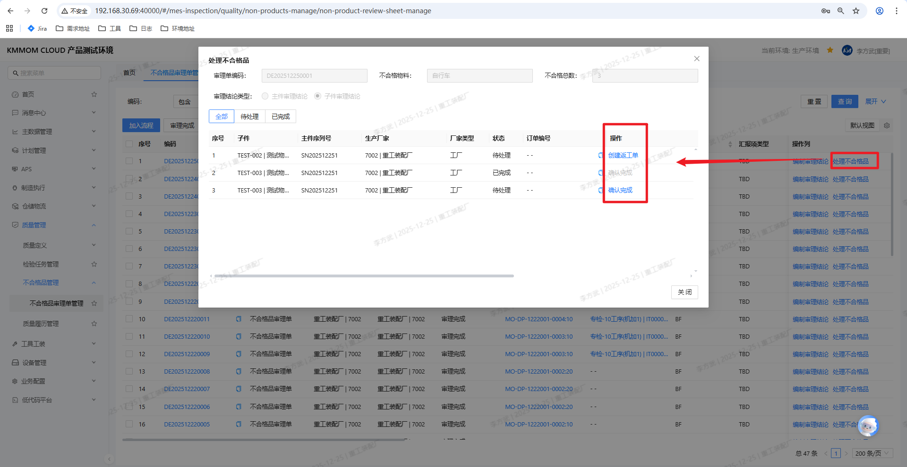
1. 在 **不合格品审理单管理** 列表中，定位需要处理的审理单，在右侧 **操作列** 中点击 **处理不合格品** 链接。
2. 系统弹出 **处理不合格品** 窗口，按明细行列出所有待处理对象。
3. 在窗口中，逐行查看审理对象、审理结论、数量等信息，根据审理结论类型执行相应操作：
   **审理结论为合格、报废、让步接收时**（主件审理和子件审理处理方式相同）：
   1. 点击对应行的 **确认完成** 按钮。
   2. 系统将该行状态由"待处理"更新为"已完成"，表示该审理结论已确认。
   3. 此时系统仅记录确认状态，不会立即执行数量及状态处理，也不会更新原始制造任务 / 检验任务的待定、合格、报废等数量。
   4. 实际的数量及状态处理将在执行 **审理完成** 操作时由系统统一执行。
   **审理结论为返工、返修时**（主件审理和子件审理处理方式相同）：
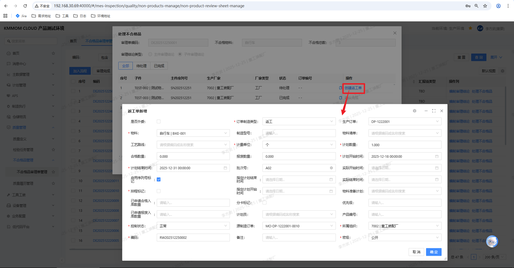
   1. 点击对应行的 **创建返工单** 或 **创建返修单** 按钮，手动创建对应的返工返修订单。
   2. 返工返修订单创建完成后，系统将该行状态由"待处理"更新为"已完成"，表示该审理结论已确认，返工返修订单已创建。
   3. 此时系统不会立即更新原始制造任务 / 检验任务的数量字段，具体处理逻辑见 **审理完成** 操作说明。
4. 所有明细行均确认完成后，点击窗口底部的 **关闭** 按钮，关闭处理不合格品窗口。
> **说明**：
> - **确认完成** 操作是对不合格品审理结论的确认过程。对于合格、报废、让步接收结论，点击确认完成后，状态由"待处理"变为"已完成"。
> - **创建返工返修订单** 操作：对于返工、返修结论，需要手动点击"创建返工单"或"创建返修单"按钮创建返工返修订单，创建完成后，状态由"待处理"变为"已完成"。
> - 对于子件审理，所有结论的确认过程均需配合线下确认（子件的处理过程如拆卸、重新装配、替换零件等多在现场线下完成）。
> - 实际的数量及状态处理将在执行 **审理完成** 操作时由系统统一执行。  

### 4.7 审理完成

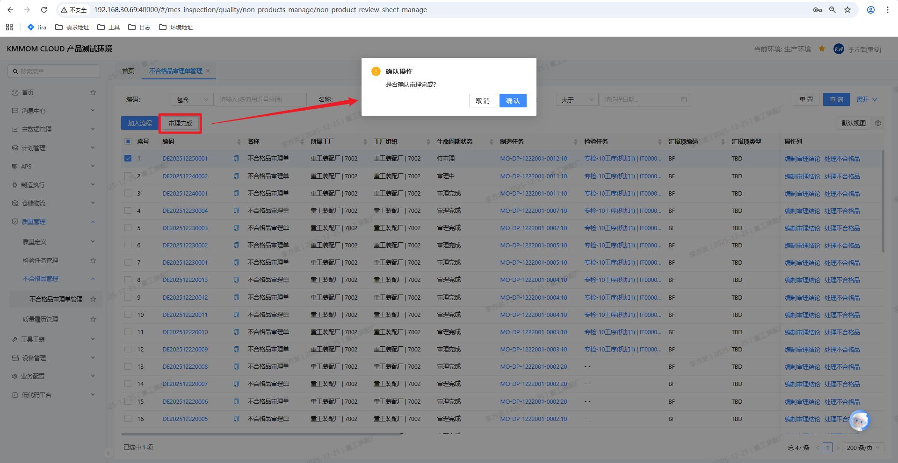
1. 在审理单详情页中，确认以下条件已满足：
   1. 所有待审理数量均已分配到具体审理结论。
   2. 所有审理结论已通过 **处理不合格品** 操作完成确认。
2. 在列表中勾选目标审理单，点击 **审理完成** 按钮。
3. 系统进行校验：
   1. 审理结论数量之和 = 待审理数量。
   2. 审理状态当前为 **审理中**。
4. 校验通过后，系统将根据审理对象类型（主件或子件）执行以下处理：
#### 4.7.1 主件审理处理

**主件审理（合格、报废、让步接收）**：
1. **数量及状态处理**：
   1. **合格 / 让步接收**：将对应待定数量转为合格数量，按原工艺路线继续流转。
   2. **报废**：将对应待定数量转为报废数量，并按配置触发报废入库申请。
2. **自动更新原始制造任务 / 检验任务的数量字段**：系统自动更新原始制造任务 / 检验任务的 **待定数量、合格数量、报废数量** 等关键字段（仅处理本次审理数量对应的待定数量）。
3. **更新审理单状态**：将不合格品审理单状态更新为 **审理完成**，并锁定为只读。

**主件审理（返工、返修）**：
1. 系统不会在审理完成时处理返工、返修数量，也不会更新原始制造任务 / 检验任务的数量字段。
2. 返工返修订单已在 **处理不合格品** 操作时手动创建完成。
3. 当返工返修订单全部完工后，系统会自动根据返工返修订单的报工结果（合格、报废数量）更新原始制造任务 / 检验任务的待定、合格、报废等数量字段。
4. **更新审理单状态**：将不合格品审理单状态更新为 **审理完成**，并锁定为只读。

#### 4.7.2 子件审理处理

子件审理时，无论审理结论是合格、报废、让步接收、返工或返修，处理逻辑统一如下：

1. **自动写回待定数量**：系统自动将所有审理结论对应的数量写回到原始制造任务 / 检验任务的 **待定报工数量** 或 **待定报检数量** 字段。
2. **返工返修订单处理**：
   - 若审理结论包含返工、返修，对应的返工返修订单已在 **处理不合格品** 操作时手动创建完成，用于对子件进行返工返修处理。
   - 子件的不合格审理过程（如拆卸、重新装配、替换零件等）多在现场线下完成，系统中仅记录不合格审理结论。
3. **更新审理单状态**：将不合格品审理单状态更新为 **审理完成**，并锁定为只读。
4. **待定报工 / 待定报检操作**：
  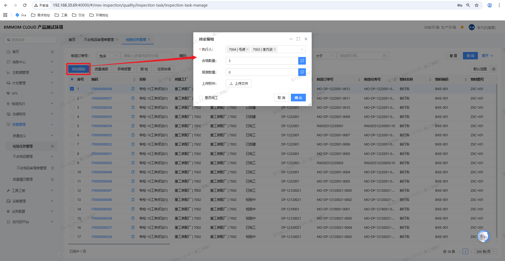
  
   - 审理完成后，对应的制造任务 / 检验任务即可进行 **待定报工** 或 **待定报检** 操作。
   - **待定报工 / 待定报检的作用**：在不合格审理完成后，将原先因复杂原因暂缓处理的待定数量，按照审理结论在系统中进行最终数量划分和结案，保证在制品账面数量与现场实物状态一致。
   - 质量人员需要手动执行该操作，按照审理结论将冻结的待定数量转为最终的合格、报废、返工或返修数量。

> **注意**：
> - 审理完成后，不再允许修改审理结论和重复处理不合格品；如需更改，应通过新增审理单或流程退回方式处理。
> - 主件审理时，合格、报废、让步接收结论在审理完成后立即更新原始任务数量；返工返修结论需等待返工返修订单全部完工后，系统才会自动更新原始任务数量。
> - 子件审理时，无论审理结论类型，审理完成后系统都会将数量写回到待定报工/待定报检数量，需手动执行待定报工/待定报检操作才能完成最终的数量处理。子件的不合格审理过程（如拆卸、重新装配、替换零件等）多在现场线下完成，系统中仅记录不合格审理结论。待定报工/待定报检的作用是将原先因复杂原因暂缓处理的待定数量，按照审理结论在系统中进行最终数量划分和结案，保证在制品账面数量与现场实物状态一致。

## 5. 注意事项

### 1. 关于审理单生成
   > - 制造任务存在检验任务时，请以检验任务的报检待定为准触发不合格品审理，避免在制造任务和检验任务上重复生成审理单。
### 2. 关于专业类型限制
   > - 机加专业仅支持主件审理，若存在子件问题，应通过其他质量异常或不合格流程处理。
   > - 装配专业支持对子件下发独立处置结论，请在录入结论时准确选择子件物料和数量。
   > - **装配业务场景**：当装配检验任务中发现总成不合格，但经分析确认问题根因为某个子件不合格时，需对问题子件执行返工 / 返修 / 报废等处理。子件的处理过程（如拆卸、重新装配、替换零件等）多在现场线下完成，系统中仅记录不合格审理结论。线下处理完成、总成满足要求后，需要由质量人员在系统中对原装配检验任务的待定数量进行手工待定报检，按照审理结论将冻结的待定数量转为最终的合格、报废、返工或返修数量。
### 3. 关于流程配置
   > - 若期望不合格审理单自动进入审批流，务必在系统管理中维护好默认不合格审理流程标识，并保证流程处于有效状态。
### 4. 关于数量一致性
   > - 编制审理结论和执行审理完成前，请务必核对**审理数量之和 = 待审理数量**，否则系统将拒绝保存或完成操作。
### 5. 关于数据追溯
   > - 不合格品审理单与原始制造任务 / 检验任务、返工返修订单、报废入库申请等都存在关联关系，请尽量通过系统跳转查看，不建议在线下手工修改相关单据数量，以免破坏系统数据闭环。
