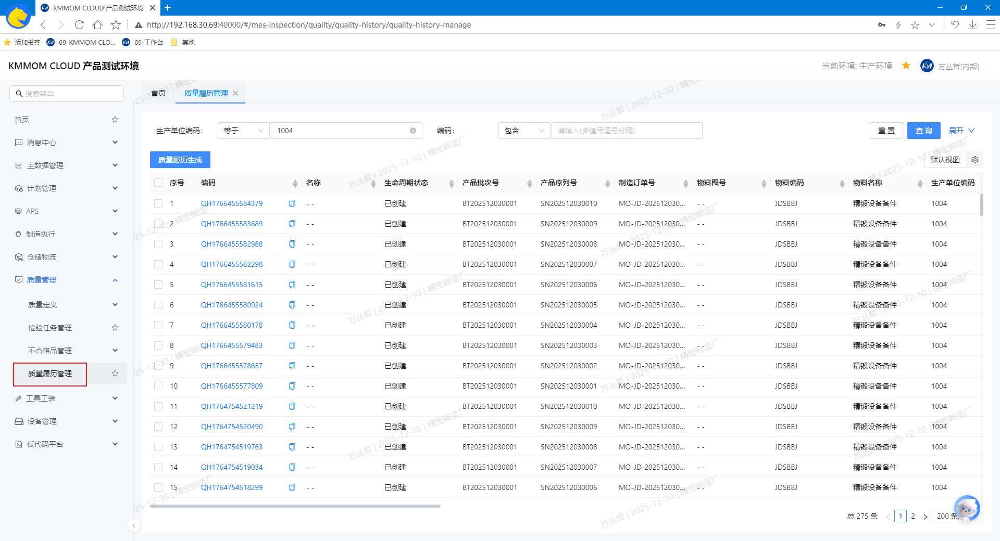
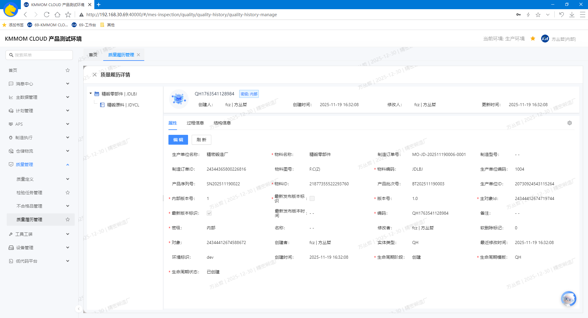
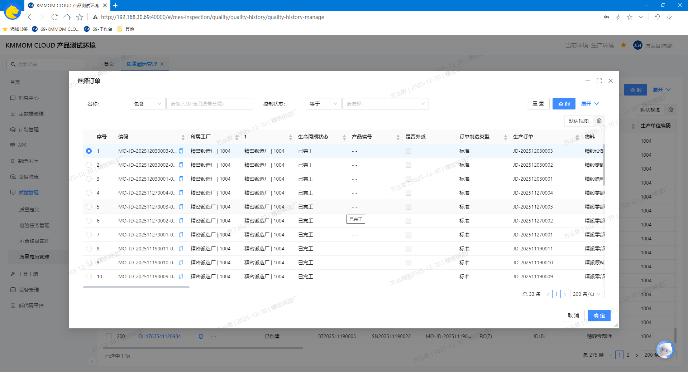

# 质量履历

## 功能概述
质量履历用于将产品从原料到成品的关键质量数据（检验记录、工艺参数、人员/设备、实物BOM及供应商履历等）进行统一整合与结构化呈现，支撑质量追溯与分析。履历生成基于标准模板整合MOM系统中生产与检验过程数据；可在返修完工场景触发履历升版，或物料更换后手动触发履历升版，保持履历的完整性与可追溯性。生成后的履历支持详情查看与检索；所有关键操作均记录审计日志，确保合规。

## 核心功能
1. **质量履历管理**：
    - **查询**：
        - 支持按关键字进行条件检索；提供 **查询/重置** 按钮，快速定位已生成或待生成的履历记录。
        - 支持进入质量履历详情页面查看具体生产过程数据。
    - **质量履历生成**：将检验记录、工艺参数、人员/设备、实物BOM及供应商履历统一整合并生成标准模板的质量履历；返修完工自动触发履历升版；生成过程包含数据完整性校验与审计记录。

## 操作指南

### 1. 进入页面
1. 点击左侧导航 **质量管理** → **质量履历管理**，进入质量履历管理页面，展示已生成的履历数据。

### 2. 查询
1. 在筛选区选择查询条件，点击 **查询** 按钮，查询目标质量履历数据。
2. 点击质量履历数据行的 **编码** 可进入详情页面查看整个生产过程物料节点（父子物料层级）详细信息：**基础属性**、**过程信息**、**结构信息**。

    - **基础属性**：显示各父子节点物料的基本信息和关联的制造订单信息，包括物料编码、批次号、序列号、制造订单号等；
    - **过程信息**：显示当前节点物料生产过程中从制造订单到任务执行的过程信息，如制造订单号、任务号、操作人、合格数量、工艺路线等；
    - **结构信息**：展示当前节点物料生产中，装入的子物料信息，包括子物料编码、使用数量、子物料批次号、子物料序列号、子物料质量履历等。

### 3. 质量履历生成
#### 3.1. 自动生成
1. 制造订单下的所有制造任务完工后，自动生成质量履历（具体生成信息参考 **2. 查询**）。
2. 若存在返修制造订单，则返修制造订单完工后，在父制造订单的质量履历版本基础上，自动生成 **新版本** 质量履历（升版）。

#### 3.2. 手动生成
1. 点击 **质量履历生成** 按钮，在弹窗中选择目标制造订单（状态为”已完工“），点击 **确定** 生成对应的质量履历，如若已有质量履历，则在已有版本基础上进行升版，生成新版质量履历。

    - 若制造订单已完工，更换了子物料，则需要手动触发生成新版本的质量履历，以确保记录最新的子物料信息。

> **注意：**
> - 仅对已完成的制造订单/返修订单触发生成。
> - 手动生成可视为自动生成失败后的补救措施，自动生成失败后建议手动触发。
> - 任务执行过程中未装入子物料，则生成的质量履历无子物料节点。
> - 手动生成质量履历时无法批量生成，仅能单个完工制造订单进行生成操作。

## 注意事项
- 权限控制：查询对具备质量数据访问权限的用户开放；**质量履历生成**通常仅限质量工程师或生产管理者；具体范围由组织权限配置决定。
- 触发时机：履历生成建议在制造订单/返修订单完工后进行；未完工或数据未入库可能导致生成失败。
- 升版规则：返修完工触发履历升版；升版后保留历史版本并建立关联，以支持完整追溯。
- 数据一致性：生成过程会聚合检验、工艺、人员/设备、BOM与供应商履历等数据；如存在缺失，请先完成数据归档再生成。
- 审计追溯：所有生成与查看操作均记录操作者、时间与差异项；建议在生成前核对筛选条件避免误操作。