# 设备台账

## 功能概述

设备台账是设备管理的基础模块，用于记录和管理企业所有设备资产的全生命周期信息。通过设备台账，您可以：

- 建立完整的设备档案，包括设备编码、名称、规格、位置等基础信息
- 跟踪设备状态变化，从引进、使用到报废的全过程
- 管理设备的点检策略和维保策略配置
- 处理设备的调拨和报废流程
- 为后续的点检计划、维护计划、故障处理等业务提供数据基础，是设备管理系统的核心数据源。

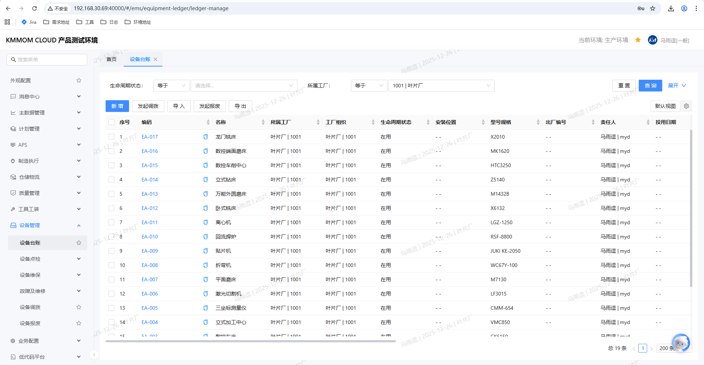

## 操作前置条件

在使用设备台账功能前，请确保：

1. 您已登录系统并具有设备管理相关权限
2. 已完成设备类型、工厂组织等基础数据配置
3. 如需发起调拨或报废，需确保相关审批流程已配置

## 核心功能

### 设备台账列表

设备台账列表页面集中展示所有设备的关键信息，支持多条件查询、排序和批量操作。

**主要功能**：
- 设备信息查询与筛选
- 新增设备
- 导入/导出设备数据
- 查看设备详情
- 编辑设备信息
- 发起设备调拨
- 发起设备报废

### 设备详情管理

设备详情页面采用页签式布局，全面展示设备的各类信息：

- **属性**：设备基础信息、技术参数、供应商信息等
- **点检策略配置**：关联的点检模板配置
- **维保策略配置**：关联的维护模板配置
- **附件**：设备相关的文档、图片等附件

### 设备调拨

支持将设备从一个部门或位置调拨到另一个部门或位置，包含完整的审批流程。

### 设备报废

支持对达到报废条件的设备发起报废申请，包含评估、审批和资产处置流程。

### 设备故障上报

支持对设备故障进行上报，生成故障处理任务，并自动更新设备状态。（**详见后文操作指南第12节**）

## 操作指南

### 1. 查询设备

**操作步骤**：

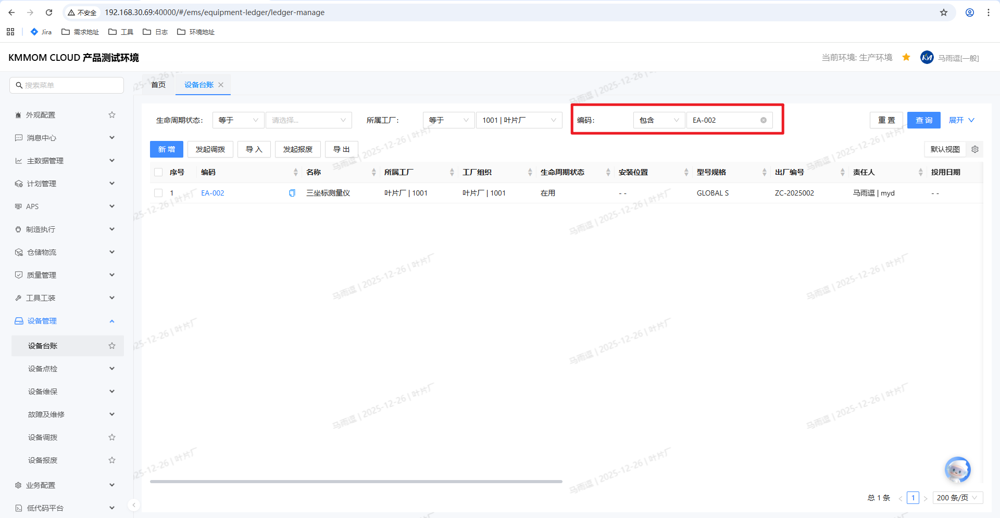

1. 进入 **设备管理** > **设备台账** 页面
2. 在查询区域，输入以下任一或组合条件：
   - **所属工厂**：选择设备所属的工厂
   - **编码**：输入设备编码（支持多值，用逗号分隔）
   - **生命周期状态**：选择设备状态（如：在用、故障、报废等）
3. 点击 **查询** 按钮
4. 系统显示符合条件的设备列表

> **提示**：点击 **重置** 可清空所有查询条件，显示全部设备。

### 2. 新增设备

**操作步骤**：

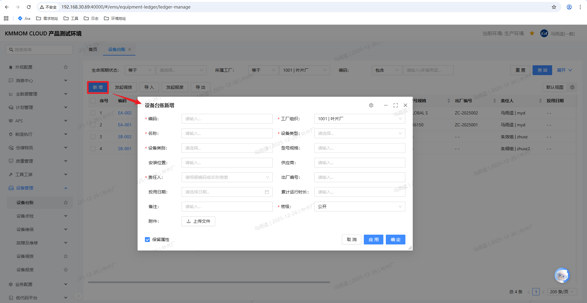

1. 在设备台账列表页面，点击 **新增** 按钮
2. 在弹出的"设备台账新增"窗口中，填写以下信息：

   **必填项**（标有红色星号）：
   - **编码**：输入设备编码（需全局唯一）
   - **工厂组织**：显示设备所属的工厂组织（只读，系统自动填充当前用户所属工厂，不可修改）
   - **名称**：输入设备名称
   - **设备类型**：选择设备类型
   - **设备类别**：选择设备类别（可多选，支持多级分类）
     - 设备类别支持树形结构选择，可展开查看子类别
     - 可选择多个类别，系统会根据所选类别自动匹配对应的点检策略和维保策略
   - **责任人**：选择设备责任人
   - **密级**：选择信息密级（默认：公开）

   **选填项**：
   - **型号规格**：输入设备型号规格
   - **安装位置**：输入设备安装位置
   - **供应商**：输入或选择供应商
   - **出厂编号**：输入设备出厂编号
   - **投用日期**：选择设备投用日期
   - **累计运行时长**：输入累计运行时长
   - **备注**：输入备注信息
   - **附件**：上传设备相关附件

3. 如需保留属性信息，勾选 **保留属性** 复选框
4. 点击 **确定** 按钮保存，或点击 **应用** 保存并继续添加

> **重要提示**：
> - **自动策略绑定**：选择设备类别后，系统会根据所选类别自动查找并绑定对应的点检策略和维保策略。例如：
>   - 选择"车床"类别，系统会自动绑定适用于"车床"的点检模板和维保模板
>   - 选择"温度计"类别，系统会自动绑定适用于"温度计"的点检模板和维保模板
> - 设备保存成功后，可在设备详情的"点检策略配置"和"维保策略配置"页签中查看自动绑定的策略
> - 如需调整策略，可在设备详情页面手动引入或删除策略模板

> **注意**：
> - 设备编码必须全局唯一，系统会自动校验
> - 新增设备后，设备状态默认为"在用"
> - 工厂组织字段为只读，显示当前用户所属的工厂组织

### 3. 导入设备数据

**操作步骤**：

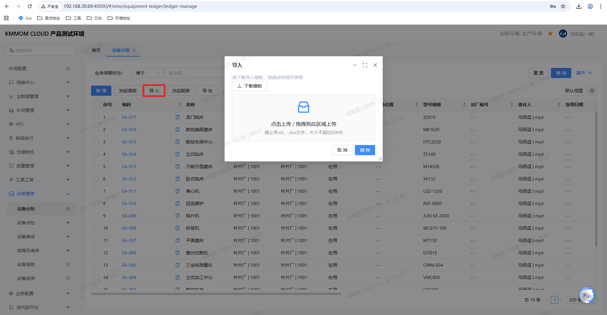

1. 在设备台账列表页面，点击 **导入** 按钮
2. 下载导入模板
3. 按照模板格式填写设备信息
4. 点击 **导入** 按钮，选择填写好的Excel文件
5. 系统校验数据格式和必填项
6. 校验通过后，系统批量导入设备数据
7. 查看导入结果报告

> **注意**：
> - 导入前请仔细检查数据格式，确保编码唯一性
> - 导入失败的数据会在报告中标注原因
> - 建议先小批量测试导入，确认无误后再大批量导入

### 4. 导出设备数据

**操作步骤**：

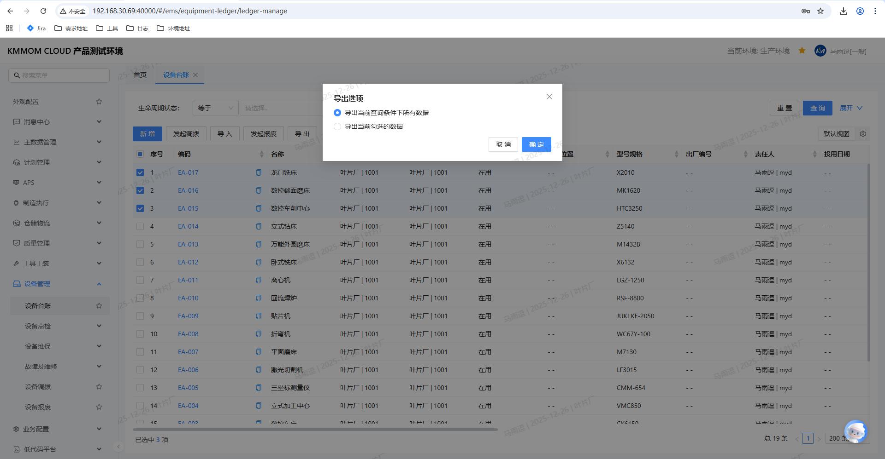

1. 在设备台账列表页面，设置查询条件或勾选特定设备
2. 点击 **导出** 按钮
3. 在弹出的 **导出选项** 对话框中选择导出范围：
   - **导出当前查询条件下所有数据**：导出符合当前搜索条件的所有设备记录
   - **导出当前勾选的数据**：仅导出列表中已手动勾选的设备记录
4. 点击 **确定**，系统生成Excel文件并自动下载
5. 打开导出的Excel文件查看设备数据

> **提示**：导出的数据可用于离线分析和归档。

### 5. 查看设备详情

**操作步骤**：

1. 在设备台账列表中，找到目标设备
2. 点击设备列表中的 **设备编码**（编码列显示为蓝色超链接，如：EA-002、SB-001）
3. 系统打开设备详情页面，在右侧显示设备详情面板

**设备详情页面说明**：

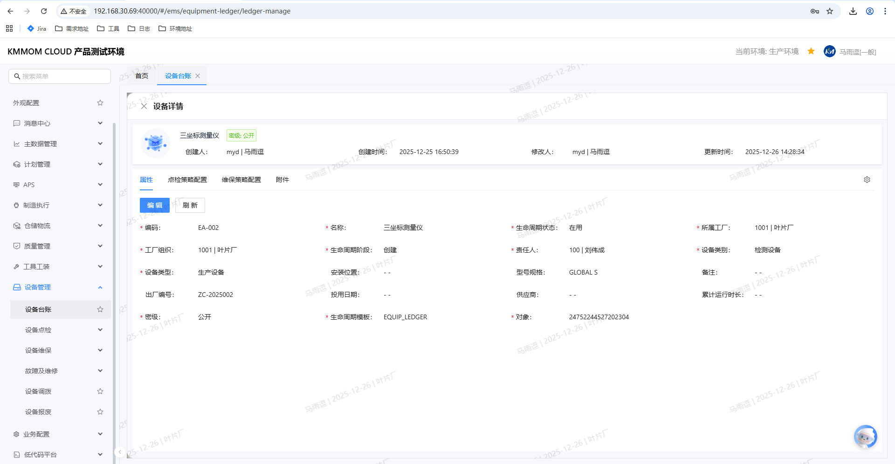

设备详情页面采用页签式布局，包含以下四个页签：

   **属性页签**：
   - 显示设备基础信息（编码、名称、类型、工厂组织等）
   - 显示技术参数、型号规格等详细信息
   - 显示供应商与维保信息
   - 显示创建人、创建时间、修改人、更新时间等审计信息
   - 提供 **编辑** 按钮，点击后可进入编辑模式修改设备信息
   - 编辑模式下提供 **保存**、**重置**、**取消** 按钮

   **点检策略配置页签**：
   - 以表格形式显示已关联的点检模板列表
   - 显示点检模板编码、名称、创建者、创建时间等信息
   - 支持通过 **引入** 按钮添加新的点检模板
   - 支持勾选记录后通过 **删除** 按钮移除点检模板

   **维保策略配置页签**：
   - 以表格形式显示已关联的维护模板列表
   - 显示维护模板编码、名称、创建者、创建时间等信息
   - 支持通过 **引入** 按钮添加新的维护模板
   - 支持勾选记录后通过 **删除** 按钮移除维护模板

   **附件页签**：
   - 以表格形式显示设备相关附件列表
   - 显示附件名称、创建者、创建时间等信息
   - 支持通过 **上传** 按钮添加新附件
   - 支持勾选记录后通过 **删除** 按钮移除附件

> **提示**：
> - 设备编码在列表中显示为蓝色超链接样式，点击编码即可进入设备详情
> - 设备详情面板可以通过左上角的 **×** 按钮关闭
> - 在设备详情面板中，可以切换不同页签查看设备的各类信息

### 6. 编辑设备信息

**操作步骤**：

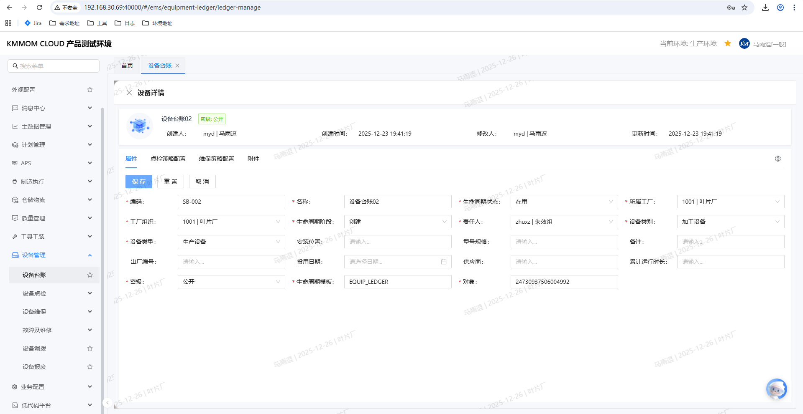

1. 在设备台账列表中，找到目标设备
2. 点击设备列表中的 **设备编码**（蓝色超链接），进入设备详情页面
3. 在设备详情页面的 **属性** 页签中，点击 **编辑** 按钮
4. 系统进入编辑模式，表单字段变为可编辑状态
5. 修改需要更新的信息（如：名称、设备类型、设备类别、责任人、安装位置、型号规格等）
6. 点击 **保存** 按钮提交修改
7. 系统保存修改并提示成功

> **注意**：
> - 如需放弃修改，可点击 **重置** 按钮恢复原始值，或点击 **取消** 按钮退出编辑模式

### 7. 配置点检策略

**操作步骤**：

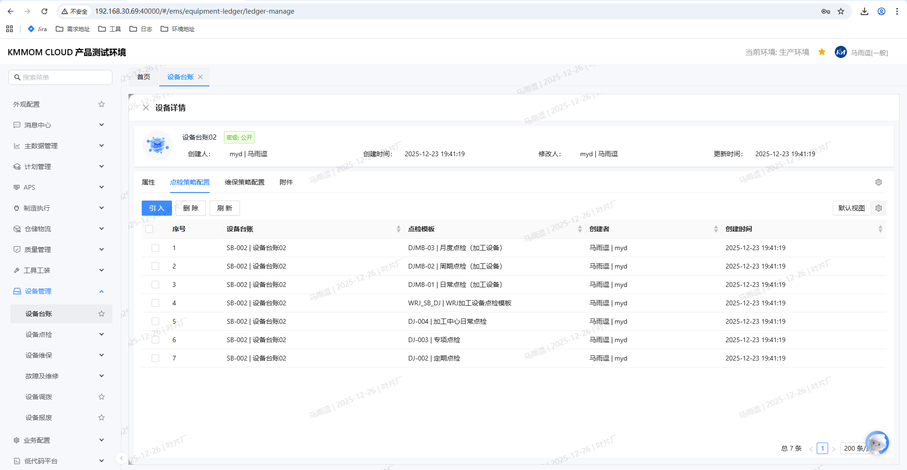
1. 打开设备详情页面
2. 切换到 **点检策略配置** 页签
3. 查看已关联的点检模板列表（包括自动绑定和手动引入的模板）
4. **引入新模板**：
   - 点击 **引入** 按钮
   - 在弹出的点检模板选择窗口中，选择需要关联的点检模板
   - 点击 **确定** 完成引入
5. **删除模板**：
   - 勾选要删除的模板记录
   - 点击 **删除** 按钮
   - 确认删除操作

> **提示**：
> - 点检策略配置后，系统会根据模板的周期设置自动生成点检计划
> - 新增设备时，系统会根据设备类别自动绑定对应的点检策略，您可以在本页签中查看和管理
> - 一个设备可以关联多个点检模板，系统会为每个模板分别生成点检计划

### 8. 配置维保策略

**操作步骤**：

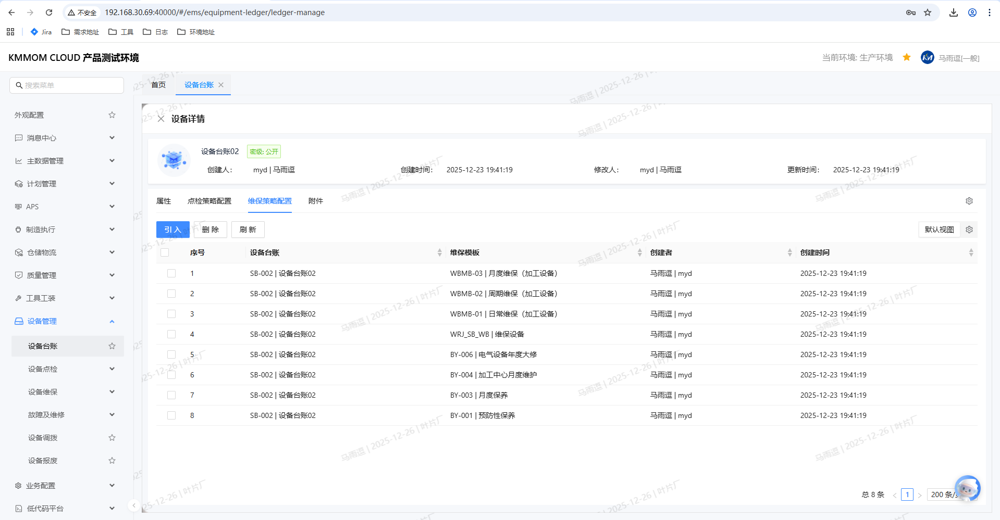

1. 打开设备详情页面
2. 切换到 **维保策略配置** 页签
3. 查看已关联的维护模板列表（包括自动绑定和手动引入的模板）
4. **引入新模板**：
   - 点击 **引入** 按钮
   - 在弹出的维护模板选择窗口中，选择需要关联的维护模板
   - 点击 **确定** 完成引入
5. **删除模板**：
   - 勾选要删除的模板记录
   - 点击 **删除** 按钮
   - 确认删除操作

> **提示**：
> - 维保策略配置后，系统会根据模板的周期设置自动生成维护计划
> - 新增设备时，系统会根据设备类别自动绑定对应的维保策略，您可以在本页签中查看和管理
> - 一个设备可以关联多个维护模板，系统会为每个模板分别生成维护计划

### 9. 管理设备附件

**操作步骤**：

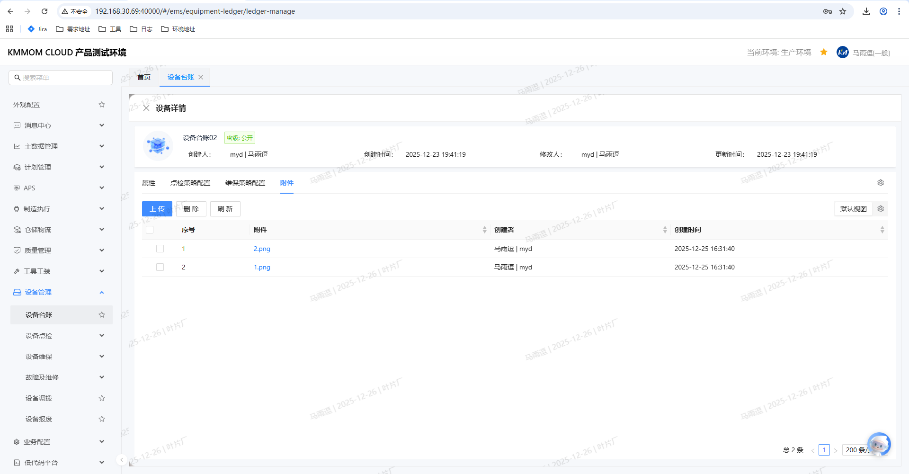

1. 打开设备详情页面
2. 切换到 **附件** 页签
3. **上传附件**：
   - 点击 **上传** 按钮
   - 选择要上传的文件
   - 系统自动上传并显示在附件列表中
4. **删除附件**：
   - 勾选要删除的附件记录
   - 点击 **删除** 按钮
   - 确认删除操作

> **注意**：附件上传有大小限制，请参考系统提示。

### 10. 发起设备调拨

**操作步骤**：

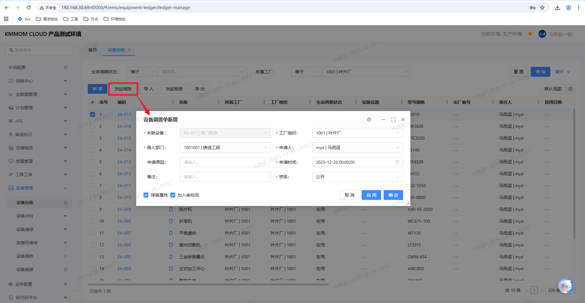

1. 在设备台账列表中，勾选需要调拨的设备
2. 点击 **发起调拨** 按钮
3. 在弹出的"设备调拨单新增"窗口中，填写以下信息：
   **必填项**：
   - **关联设备**：系统自动填充已选设备
   - **工厂组织**：默认显示当前设备的工厂组织
   - **调入部门**：选择目标部门
   - **申请人**：选择申请人
   - **申请时间**：选择申请时间
   - **密级**：选择信息密级
   **选填项**：
   - **申请原因**：输入调拨原因
   - **备注**：输入备注信息
4. 如需保留属性信息，勾选 **保留属性** 复选框
5. 根据需要勾选或取消勾选 **加入审批流** 复选框
6. 点击 **确定** 提交调拨申请

**业务逻辑说明**：

设备发起调拨后，系统会自动生成设备调拨单，用户可进入 **设备调拨** 界面查看。
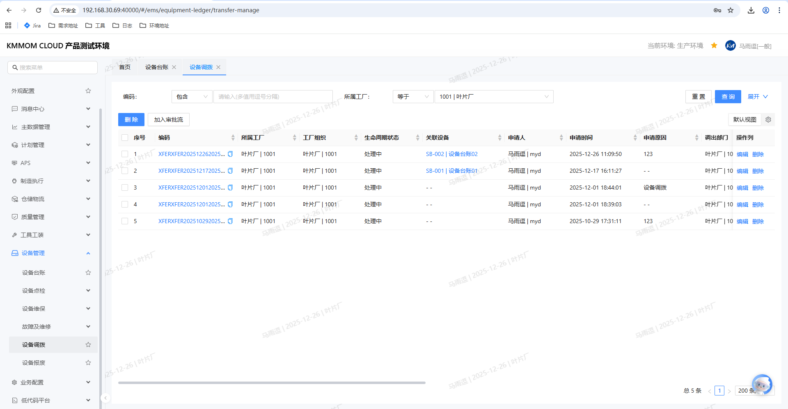

- **审批流配置逻辑**：

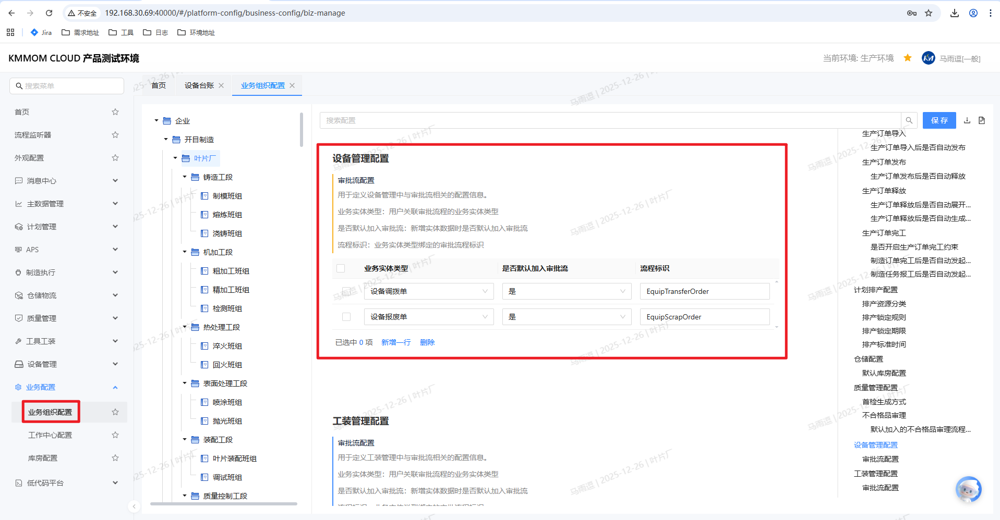

  - 系统在 **业务配置 > 设备审批流配置** 中定义了是否默认加入审批流。
  - **配置为是**：发起调拨窗口中的 **加入审批流** 标识默认勾选。
  - **配置为否**：发起调拨窗口中的 **加入审批流** 标识默认不勾选，用户可手动勾选。
  - **自动加入流程**：若勾选了 **加入审批流**，且系统配置了对应的流程标识，系统会自动将单据加入审批流。

- **流程状态**：
  - **已配置流程**：若系统配置了对应的流程配置，生成的调拨单默认为 **处理中** 状态。
  - **未配置流程**：若没有配置对应的流程配置，生成的调拨单默认为 **已创建** 状态。此时，用户可以通过界面上的 **加入审批流** 按钮将单据加入流程。
- **结果更新**：
  - 流程审理完成后，调拨单的生命周期状态变为 **处理完成**。
  - 此时，对应设备的 **工厂组织** 将自动更新为目标工厂组织。

### 11. 发起设备报废

**操作步骤**：

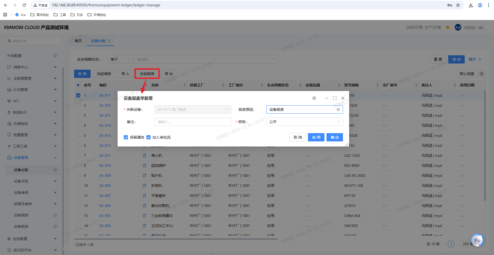

1. 在设备台账列表中，勾选需要报废的设备（可多选）
2. 点击 **发起报废** 按钮
3. 在弹出的"设备报废单新增"窗口中，填写以下信息：
   **必填项**：
   - **关联设备**：系统自动填充已选设备（可修改）
   - **密级**：选择信息密级
   **选填项**：
   - **报废原因**：输入报废原因
   - **备注**：输入备注信息
4. 如需保留属性信息，勾选 **保留属性** 复选框
5. 根据需要勾选或取消勾选 **加入审批流** 复选框
6. 点击 **确定** 提交报废申请

**业务逻辑说明**：

新增设备报废后，在设备报废界面可看到新增的设备报废单。
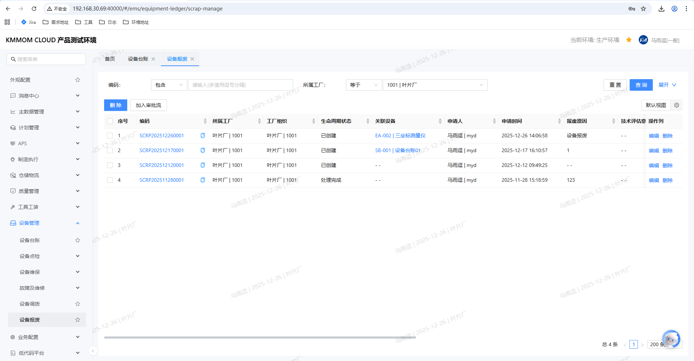

- **审批流配置逻辑**：

  - 系统在 **业务配置 > 设备审批流配置** 中定义了是否默认加入审批流。
  - **配置为是**：发起报废窗口中的 **加入审批流** 标识默认勾选。
  - **配置为否**：发起报废窗口中的 **加入审批流** 标识默认不勾选，用户可手动勾选。
  - **自动加入流程**：若勾选了 **加入审批流**，且系统配置了对应的流程标识，系统会自动将单据加入审批流。

- **流程状态**：
  - **自动加入审批流**：若自动加入审批流，状态默认为 **处理中**。
  - **未自动加入审批流**：若没有自动加入审批流，状态默认为 **已创建**。此时可以通过界面上的 **加入审批流** 按钮加入配置的审批流程。

- **结果更新**：
  - 流程审理完成后，报废单的生命周期状态变为 **处理完成**。
  - 此时，对应设备的状态变为 **报废**。

### 12. 设备故障上报

当设备发生故障无法正常工作时，需要进行故障上报，系统会生成对应的故障处理任务。

**操作步骤**：

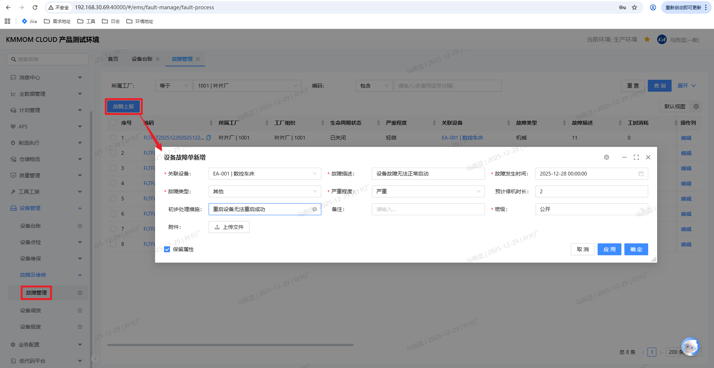

1. 进入 **设备管理** > **故障及维修** > **故障管理** 页面。
2. 点击 **故障上报** 按钮。
3. 在弹出的“设备故障单新增”窗口中，填写以下信息：
   **必填项**：
   - **关联设备**：选择发生故障的设备。
   - **故障描述**：简要描述故障现象。
   - **故障发生时间**：实际发生故障的时间。
   - **故障类型**：选择故障分类（如：机械、电气等）。
   - **严重程度**：选择故障严重程度（如：一般、严重）。
   - **密级**：选择信息密级。
   **选填项**：
   - **预计停机时长**：预计设备停机的时间。
   - **初步处理措施**：已采取的临时措施。
   - **备注**：其他补充信息。
   - **附件**：上传故障现场照片或视频。
4. 点击 **确定** 提交故障报告。

**业务逻辑说明**：

1. **任务状态流转**：
   - **已创建**：故障上报后，生成的故障任务默认为 **已创建** 状态。
   - **处理完成**：故障处理完成后，任务状态变为 **处理完成**。
   - **已关闭**：故障验证通过后，任务状态变为 **已关闭**。
   - **已创建**（回退）：若故障验证不通过，任务状态回退为 **已创建**，需重新处理。

2. **设备状态联动**：
   - **故障**：故障上报后，对应设备在设备台账中的状态会自动变更为 **故障**。
   - **在用**：故障处理完成且验证通过后，设备状态会自动恢复为 **在用**。

3. **任务执行**：
   - 故障的处理及验证操作均在 **工作台** > **设备任务** 界面执行，详情可见 **工作台操作手册**。

## 注意事项

### 数据管理

1. **设备编码唯一性**：
   > -设备编码必须在系统内全局唯一
   > -新增设备时，系统会自动校验编码是否重复
   > -建议使用规范的编码规则，便于管理

2. **设备状态管理**：
   > -设备状态包括：在用、故障、报废等
   > -不同状态下的设备可执行的操作不同

3. **数据完整性**：
   > -必填项必须填写完整，否则无法保存
   > -建议填写尽可能完整的设备信息，便于后续管理和分析

### 审批流程

1. **审批流配置**：
   > -调拨和报废流程是否启用审批，由系统管理员在"业务组织配置"中配置
   > -配置路径：**业务配置** > **业务组织配置** 【 **设备管理配置** > **审批流配置**】

2. **审批状态跟踪**：
   > -已提交的调拨或报废申请，可在对应的管理模块中查看审批进度
   > -审批通过后，相关设备信息会自动更新

### 策略配置

1. **自动策略绑定机制**：
   > -新增设备时，系统会根据所选设备类别自动查找并绑定对应的点检策略和维保策略
   > -系统会匹配设备类别与点检/维保模板中"适用设备类别"字段一致的模板
   > -自动绑定的策略可在设备详情的"点检策略配置"和"维保策略配置"页签中查看

2. **点检策略配置**：
   > -一个设备可以关联多个点检模板
   > -关联模板后，系统会根据模板周期自动生成点检计划
   > -删除模板关联不会影响已生成的计划
   > -可以手动引入或删除策略模板，灵活调整设备的管理策略

3. **维保策略配置**：
   > -一个设备可以关联多个维护模板
   > -关联模板后，系统会根据模板周期自动生成维护计划
   > -删除模板关联不会影响已生成的计划
   > -可以手动引入或删除策略模板，灵活调整设备的管理策略

4. **策略匹配规则**：
   > -系统根据设备类别与点检/维保模板的"适用设备类别"进行精确匹配
   > -如果某个设备类别没有配置对应的策略模板，系统不会自动绑定，需要手动引入
   > -建议在配置点检/维保模板时，正确设置"适用设备类别"，确保自动绑定功能正常工作

### 权限控制

1. **操作权限**：
   > -不同角色的用户可执行的操作不同
   > -设备管理员拥有完整的增删改查权限
   > -普通用户可能只能查看设备信息

2. **数据权限**：
   > -用户只能查看和操作有权限的工厂/部门下的设备
   > -跨部门操作需要相应权限

### 常见问题

1. **无法新增设备**：
   > -检查是否具有设备管理员权限
   > -确认必填项是否已填写完整
   > -检查设备编码是否重复

2. **无法发起调拨/报废**：
   > -确认设备状态是否允许（如：已报废的设备不能再次报废）
   > -检查是否具有相应操作权限
   > -确认设备是否已被其他流程占用

3. **点检/维保策略不生效**：
   > - 确认模板是否已正确关联到设备
   > - 检查模板的周期配置是否正确
   > - 确认设备状态是否允许生成计划

4. **新增设备后没有自动绑定点检/维保策略**：
   > - 检查所选设备类别是否在点检/维保模板的"适用设备类别"中配置
   > - 如果设备类别没有匹配的策略模板，需要手动在设备详情中引入策略
   > - 可以在"设备点检策略"和"设备维保策略"管理页面查看各设备类别对应的策略配置

5. **导入失败**：
   > - 检查Excel文件格式是否符合模板要求
   > - 确认必填项是否已填写
   > - 检查设备编码是否重复或格式错误
   > - 查看导入报告了解具体失败原因
