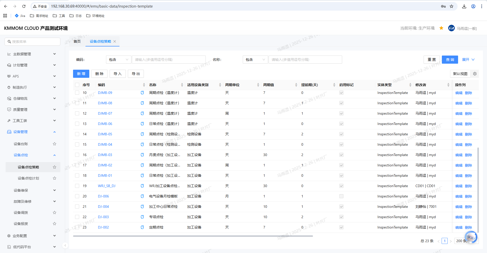
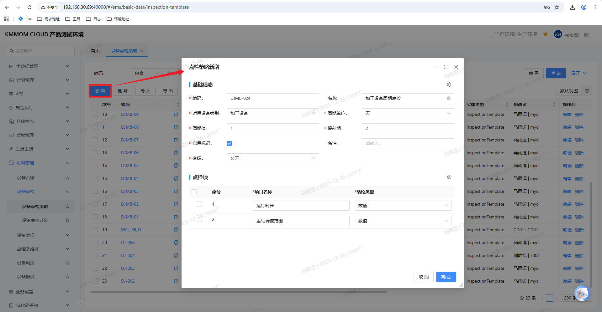
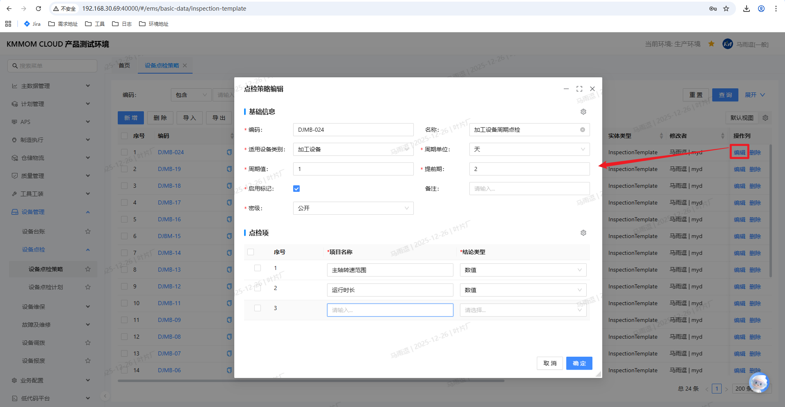
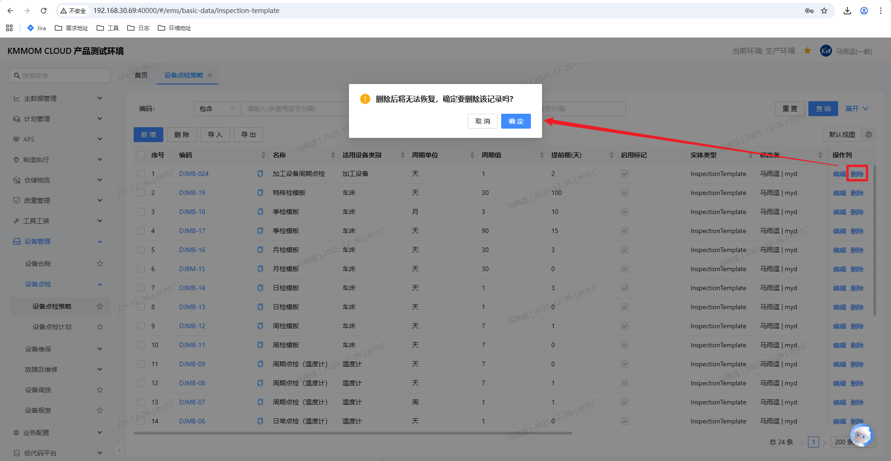
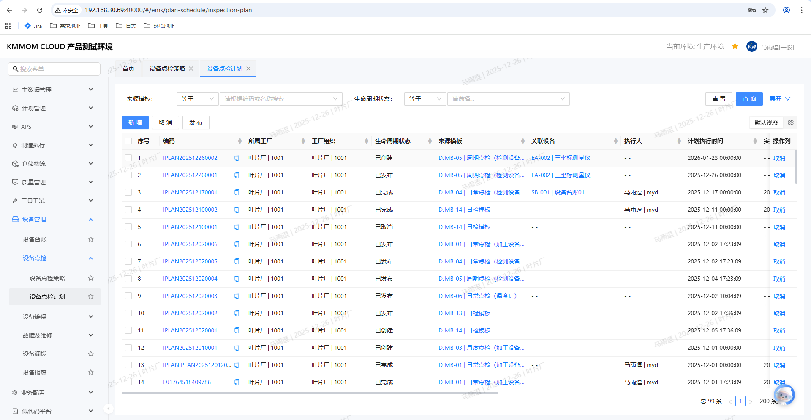
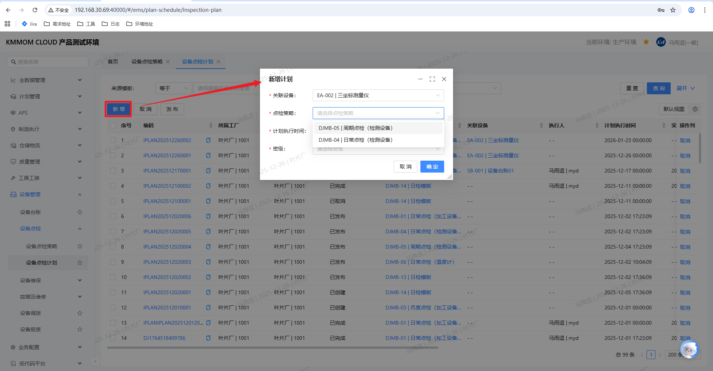
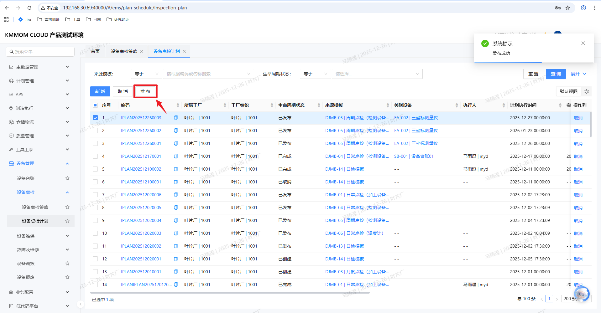
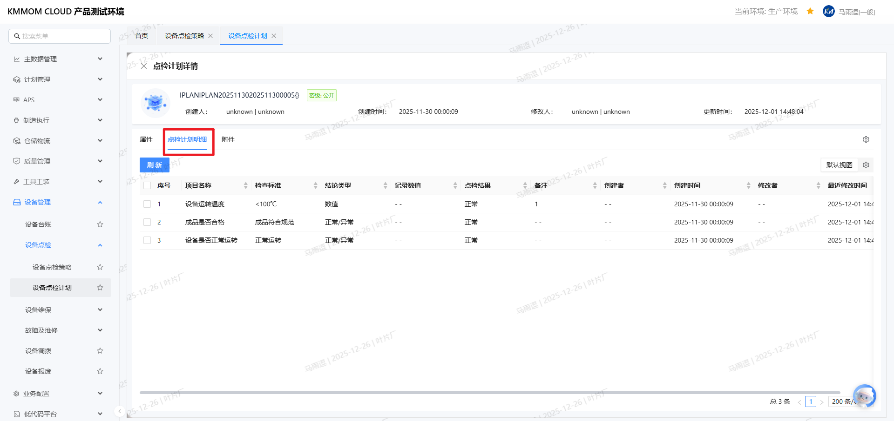
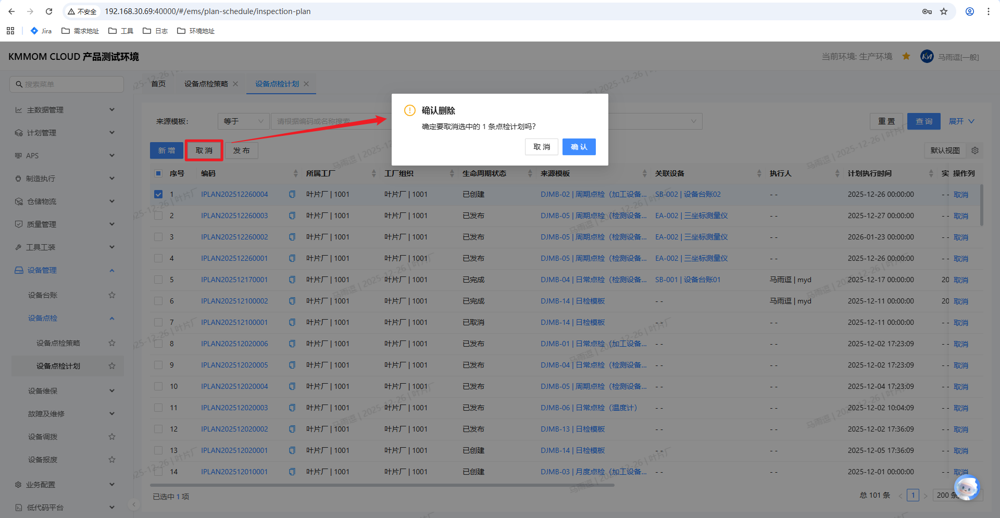

# 设备点检管理

设备点检管理是预防性维护的核心模块，旨在通过周期性的检查活动，及时发现设备异常，防止故障发生。本模块提供从点检策略制定到计划生成、发布及执行的全流程管理功能。

## 功能概述

该模块主要包含以下核心功能：
- **点检策略管理**：定义标准化的点检模板，包括点检周期、提前期及具体的点检项目。
- **点检计划管理**：支持系统自动生成和人工手动创建点检计划，并对计划进行发布或取消管理。

## 1. 设备点检策略

点检策略是生成点检计划的基础依据，规定了“检查什么”、“多久检查一次”以及“如何判定结果”。

### 1.1 新增点检策略

**操作步骤**：

1. 进入 **设备点检策略** 页面。
2. 点击 **新增** 按钮，弹出“点检策略新增”窗口。
3. 填写 **基础信息**：
   - **编码/名称**：输入策略的唯一标识和名称。
   - **适用设备类别**：选择该策略适用的设备类型。
   - **周期设置**：设置 **周期值** 和 **周期单位**（如：1天、1周），决定计划生成的频率。
   - **提前期**：设置计划生成的提前天数（例如：提前3天生成下个月的计划）。
   - **启用标记**：勾选后策略才会生效。
4. 配置 **点检项**：
   - 点击点检项列表下方的行新增。
   - 输入 **项目名称**（如：油温检查、异响检查）。
   - 选择 **结论类型**（如：正常/异常、数值、文本）。
5. 点击 **确定** 保存策略。

### 1.2 编辑点检策略

对于已存在的策略，可以修改其周期或点检项目。

**操作步骤**：

1. 在策略列表中选择一条记录。
2. 点击 **编辑** 按钮。
3. 在弹出的编辑窗口中修改相关信息。
4. 点击 **确定** 保存更改。

### 1.3 删除点检策略

不再使用的策略可以进行删除。

**操作步骤**：

1. 勾选需要删除的策略记录。
2. 点击 **删除** 按钮。
3. 在弹出的确认提示框中点击 **确定**。

> **注意**：
> - **若该策略已与设备关联，则无法删除**。

## 2. 设备点检计划

点检计划是具体的执行任务，系统依据点检策略自动生成计划，同时也支持人工临时新增计划。

### 2.1 计划生成逻辑

系统支持两种计划生成方式：

1.  **自动生成**：系统后台根据设备绑定的点检策略，依据配置的 **周期值**、**周期单位** 和 **提前期** 自动计算并生成计划。
2.  **手动新增**：用于临时性检查或补充计划。

### 2.2 自动生成计划

系统后台定时任务会自动根据点检策略生成未来的点检计划。

**计划执行时间计算规则**（以当前日期为 **1号** 为例）：
1.  **非首次执行**
    *   **逻辑**：计划执行时间 = 上一次计划执行时间 + 周期值。

2.  **首次执行（或无历史记录）**
    根据 **提前期** 与 **周期值** 的关系，分为以下情况：

    *   **情况一：无提前期**
        *   **逻辑**：计划执行时间 = 当前日期 + 周期值。
        *   **示例**：周期3天。1号计算，生成 **4号** 的计划。

    *   **情况二：提前期 ≤ 周期值**
        *   **逻辑**：计划执行时间 = 当前日期 + 周期值。
        *   **示例**：提前期1天，周期3天。1号计算，生成 **4号** 的计划。

    *   **情况三：提前期 > 周期值**
        *   **逻辑**：系统会一次性生成覆盖提前期范围内的多个计划。
        *   **示例**：提前期3天，周期1天。
            - **1号** 运行时，生成 **2号、3号、4号** 的计划。
            - **2号** 运行时，系统依据提前期（3天）向后推算，补充生成 **5号** 的计划。

### 2.3 手动新增计划

**操作步骤**：

1. 进入 **设备点检计划** 页面。
2. 点击 **新增** 按钮，进入新增界面。
3. 在弹出的窗口中进行配置：
   - **选择设备**：从设备台账中选择目标设备。
   - **选择策略**：系统会自动过滤出与该设备关联的点检策略，用户从下拉列表中选择。
   - **计划时间**：设置计划的执行日期。
4. 点击 **确定** 生成计划。

### 2.4 发布计划

新生成的计划（无论是自动还是手动）默认状态为 **已创建**，需要发布后执行人员才能看到并执行。

**操作步骤**：

1. 在点检计划列表中，勾选状态为“已创建”的计划。
2. 点击 **发布** 按钮。
3. 确认后，计划状态变更为 **已发布**。

> **说明**：
> - 计划发布后（代表点检计划已下发），对应点检计划执行人可在 **工作台** > **设备点检任务** 看到对应的任务并执行。
> - 点检计划的具体执行操作详见 **工作台设备任务** 模块。

### 2.5 计划完成

点检计划发布后，执行人员在工作台或移动端完成点检任务提交，系统会自动更新计划状态及相关执行信息。

**逻辑说明**：
- **状态更新**：当关联的点检任务执行完成后，该点检计划的状态会自动变更为 **已完成**。
- **信息回写**：系统会自动更新点检计划列表中的 **执行人**、**实际执行时间** 和 **结果描述**。
- **详情查看**：
  点击计划列表中的 **计划编码** 超链接，可进入 **点检计划详情** 界面，查看执行详情：
  - **点检计划明细**：在 **点检计划明细** 页签下，可以查看具体的点检内容，包括 **记录数值**、**点检结果** 等详细信息。
  - **附件**：切换至 **附件** 页签，可查看执行点检计划时上传的相关附件（如：现场照片等）。
  
  

### 2.6 取消计划

对于尚未执行或无需执行的计划，可以进行取消操作。

**操作步骤**：

1. 勾选状态为“已创建”的计划。
2. 点击 **取消** 按钮。
3. 操作完成后，计划状态变更为 **已取消**。
4. **注意**：已发布的计划无法取消。

## 3. 注意事项

1. **策略绑定**：
> - 点检策略必须与设备类别或具体设备绑定后，才能自动生成计划。
2. **提前期设置**：
> - 建议合理设置提前期，以便给执行人员预留足够的准备时间。
3. **计划状态流转**：
> - **已创建** -> **已发布** -> **已完成**（执行后）
> - **已创建** -> **已取消**
