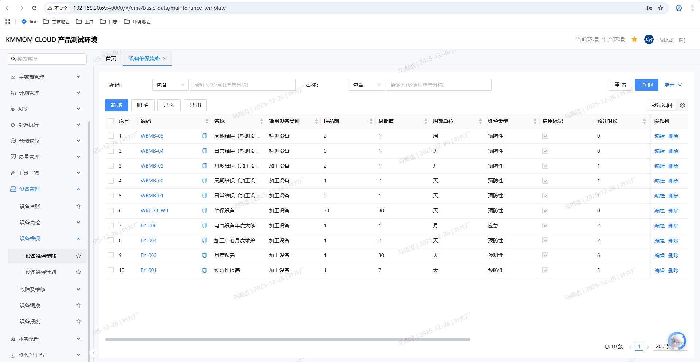
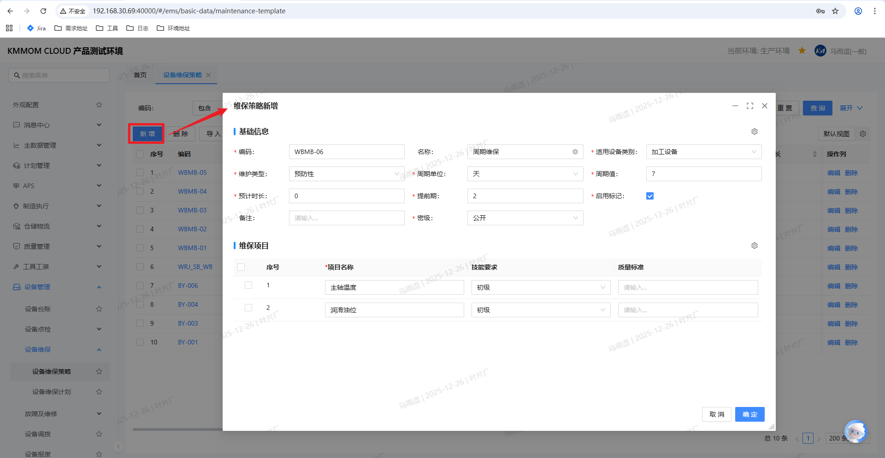
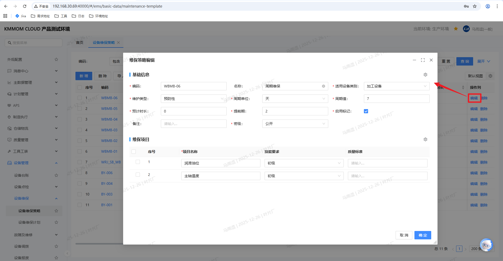
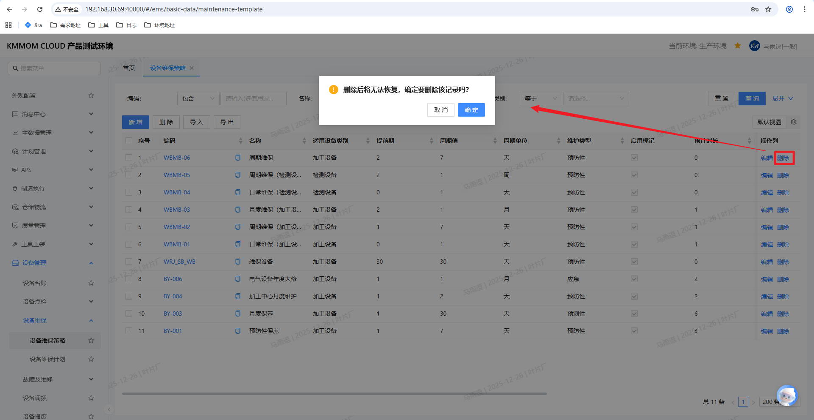
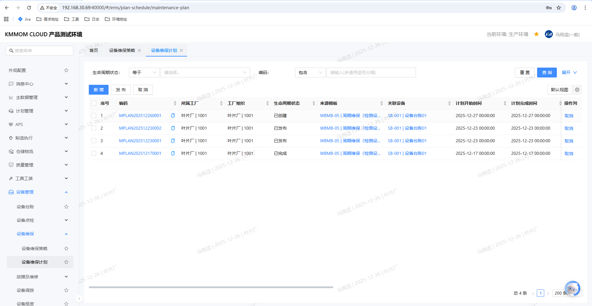
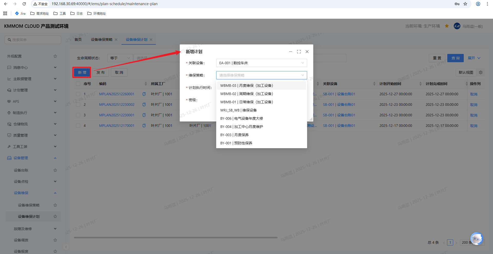
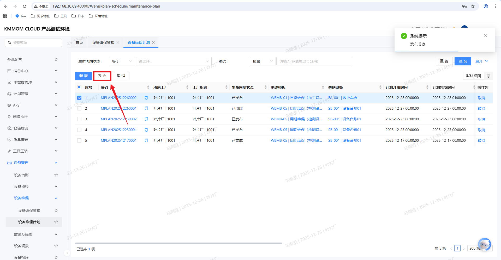
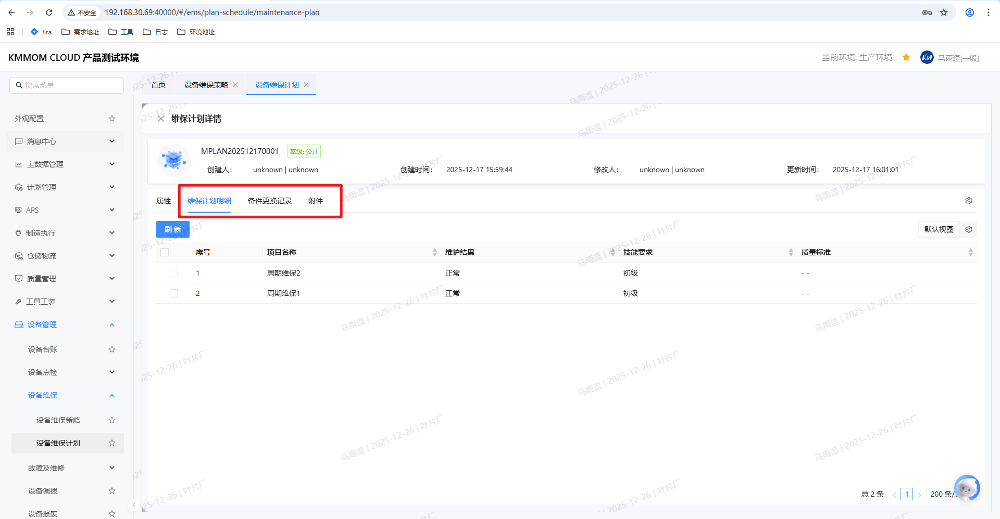
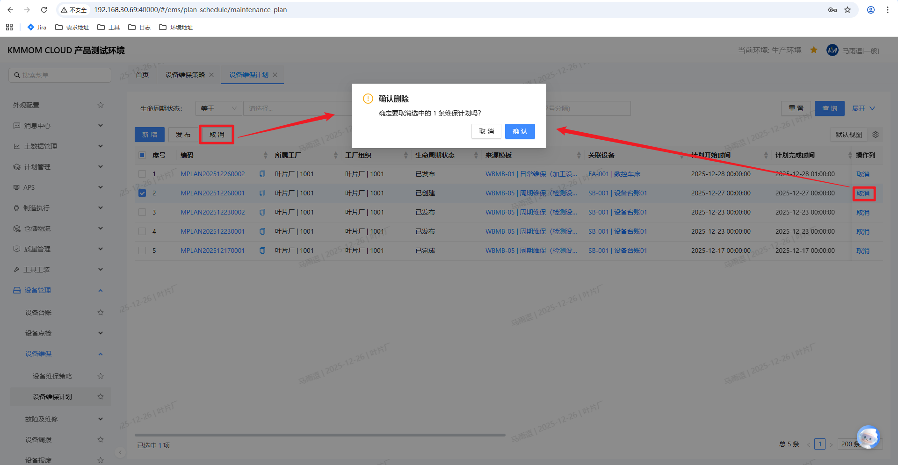

# 设备维保管理

设备维保管理是保障设备长期稳定运行的关键环节。通过制定科学的维护保养策略和计划，定期对设备进行清洁、润滑、调整和更换磨损部件，可以有效延长设备寿命，降低故障率。

## 功能概述

该模块主要包含以下核心功能：
- **维保策略管理**：定义标准化的维保模板，包括维保周期、提前期、具体的维保项目以及**备件需求**。
- **维保计划管理**：支持系统自动生成和人工手动创建维保计划，全流程跟踪计划的发布、执行、完成及取消。

## 1. 设备维保策略

维保策略是生成维保计划的基础，规定了“保养什么”、“多久保养一次”、“需要什么备件”以及“验收标准”。

### 1.1 新增维保策略

**操作步骤**：

1. 进入 **设备维保策略** 页面。
2. 点击 **新增** 按钮，弹出“维保策略新增”窗口。
3. 填写 **基础信息**：
   - **编码/名称**：输入策略的唯一标识和名称。
   - **适用设备类别**：选择该策略适用的设备类型。
   - **维护类型**：选择维护类型（如：周期维保、日常维保）。
   - **周期设置**：设置 **周期值** 和 **周期单位**（如：1天、1周），决定计划生成的频率。
   - **提前期**：设置计划生成的提前天数。
   - **预计时长**：设置预计完成维保所需的时间。
   - **启用标记**：勾选后策略才会生效。
4. 配置 **维保项目**：
   - 点击维保项目列表下方的行新增。
   - 输入 **项目名称**、**技能要求** 和 **质量标准**。
5. 配置 **预估备件需求**（**关键差异点**）：
   - 在 **预估备件需求** 页签下，点击新增。
   - 从备件库中选择该维保任务可能需要的 **备件**。
   - 输入 **需求数量** 和 **必须件标识**。
   
   

6. 点击 **确定** 保存策略。

### 1.2 编辑维保策略

对于已存在的策略，可以修改其周期、维保项目或备件需求。

**操作步骤**：

1. 在策略列表中选择一条记录。
2. 点击 **编辑** 按钮。
3. 在弹出的编辑窗口中修改相关信息。
4. 点击 **确定** 保存更改。

### 1.3 删除维保策略

不再使用的策略可以进行删除。

**操作步骤**：

1. 勾选需要删除的策略记录。
2. 点击 **删除** 按钮。
3. 在弹出的确认提示框中点击 **确定**。

> **注意**：
> - 删除后将无法恢复，且基于该策略的自动计划生成将停止。
> - **若该策略已与设备关联，则无法删除**。

## 2. 设备维保计划

维保计划是具体的执行任务，系统依据维保策略自动生成计划，同时也支持人工临时新增计划。

### 2.1 计划生成逻辑

系统支持两种计划生成方式：

1.  **自动生成**：系统后台根据设备绑定的维保策略，依据配置的 **周期值**、**周期单位** 和 **提前期** 自动计算并生成计划。
2.  **手动新增**：用于临时性维护或补充计划。

### 2.2 自动生成计划

系统后台定时任务会自动根据维保策略生成未来的维保计划。

**计划执行时间计算规则**（以当前日期为 **1号** 为例）：

1.  **非首次执行**
    *   **逻辑**：计划执行时间 = 上一次计划执行时间 + 周期值。

2.  **首次执行（或无历史记录）**
    根据 **提前期** 与 **周期值** 的关系，分为以下情况：

    *   **情况一：无提前期**
        *   **逻辑**：计划执行时间 = 当前日期 + 周期值。
        *   **示例**：周期3天。1号计算，生成 **4号** 的计划。

    *   **情况二：提前期 ≤ 周期值**
        *   **逻辑**：计划执行时间 = 当前日期 + 周期值。
        *   **示例**：提前期1天，周期3天。1号计算，生成 **4号** 的计划。

    *   **情况三：提前期 > 周期值**
        *   **逻辑**：系统会一次性生成覆盖提前期范围内的多个计划。
        *   **示例**：提前期3天，周期1天。
            - **1号** 运行时，生成 **2号、3号、4号** 的计划。
            - **2号** 运行时，系统依据提前期（3天）向后推算，补充生成 **5号** 的计划。

### 2.3 手动新增计划

**操作步骤**：

1. 进入 **设备维保计划** 页面。
2. 点击 **新增** 按钮。
3. 在弹出的窗口中进行配置：
   - **关联设备**：从设备台账中选择目标设备。
   - **维保策略**：从下拉列表中选择与该设备关联的维保策略（如：周期维保、日常维保）。
   - **计划执行时间**：设置计划的执行日期。
   - **密级**：设置计划的保密等级。
4. 点击 **确定** 生成计划。

### 2.4 发布计划

新生成的计划默认状态为 **已创建**，需要发布后执行人员才能看到并执行。

**操作步骤**：

1. 在维保计划列表中，勾选状态为“已创建”的计划。
2. 点击 **发布** 按钮。
3. 确认后，计划状态变更为 **已发布**。

> **说明**：
> - 计划发布后，对应维保执行人可在 **工作台** > **设备维保任务** 看到对应的任务并执行。
> - 维保计划的具体执行操作详见 **工作台设备任务** 模块。

### 2.5 计划完成

维保计划发布后，执行人员在工作台或移动端完成维保任务提交，系统会自动更新计划状态及相关执行信息。

**逻辑说明**：
- **状态更新**：当关联的维保任务执行完成后，该维保计划的状态会自动变更为 **已完成**。
- **信息回写**：系统会自动更新维保计划列表中的 **执行人**、**实际执行时间** 和 **结果描述**。
- **详情查看**：
  点击计划列表中的 **计划编码** 超链接，可进入 **维保计划详情** 界面，查看执行详情：
  - **维保计划明细**：查看具体的维保项目、维护结果等。
  - **备件更换记录**：切换至 **备件更换记录** 页签，可查看执行维保计划时实际更换的备件详情（系统会自动记录在任务执行过程中消耗的备件）。
  - **附件**：切换至 **附件** 页签，可查看执行维保计划时上传的相关附件（如：现场照片、维修报告等）。
  
  

### 2.6 取消计划

对于尚未执行或无需执行的计划，可以进行取消操作。

**操作步骤**：

1. 勾选状态为“已创建”的计划。
2. 点击 **取消** 按钮。
3. 操作完成后，计划状态变更为 **已取消**。
4. **注意**：已发布的计划无法取消。

---

## 3. 注意事项

1. **策略绑定**：
   - 维保策略必须与设备类别或具体设备绑定后，才能自动生成计划。
2. **备件管理**：
   - 在制定维保策略时，准确配置 **预估备件需求** 有助于提前进行备件采购和库存预警。
3. **计划状态流转**：
   - **已创建** -> **已发布** -> **已完成**（执行后）
   - **已创建** -> **已取消**
