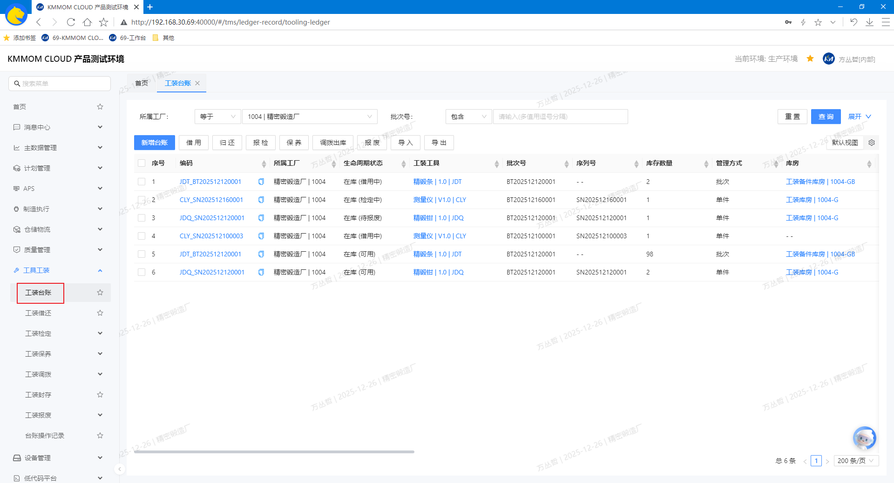
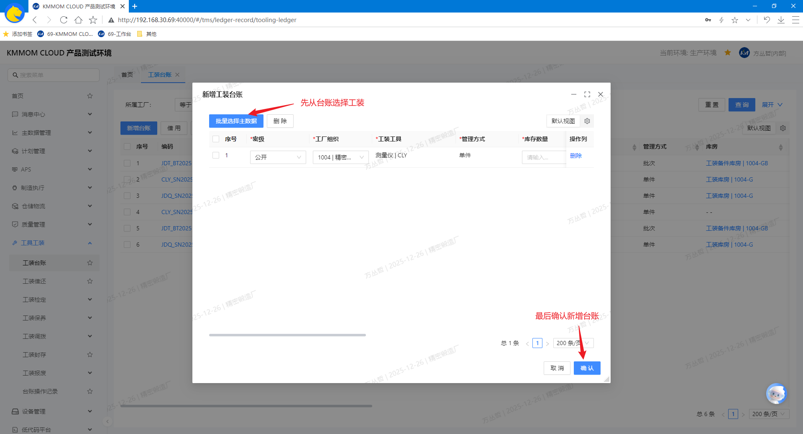
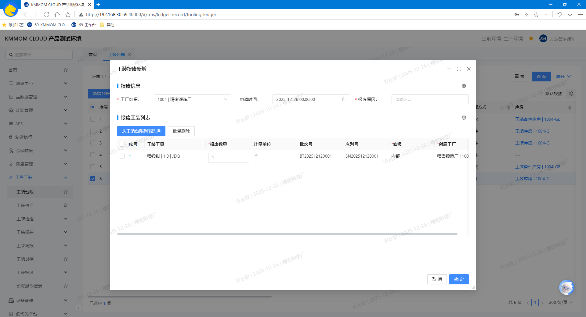
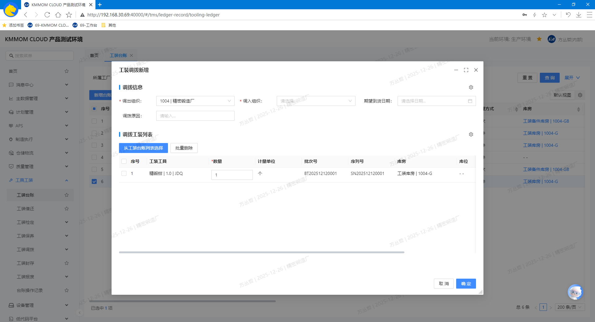
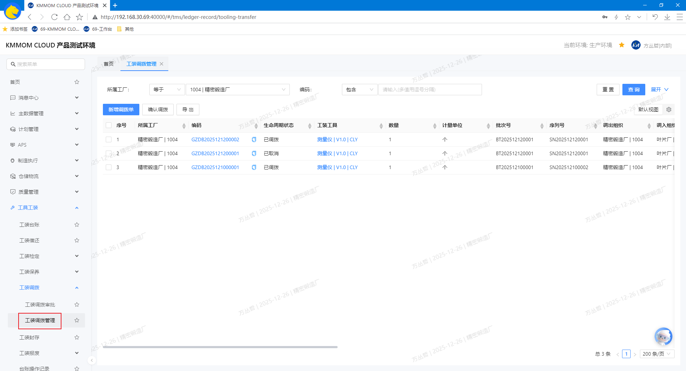
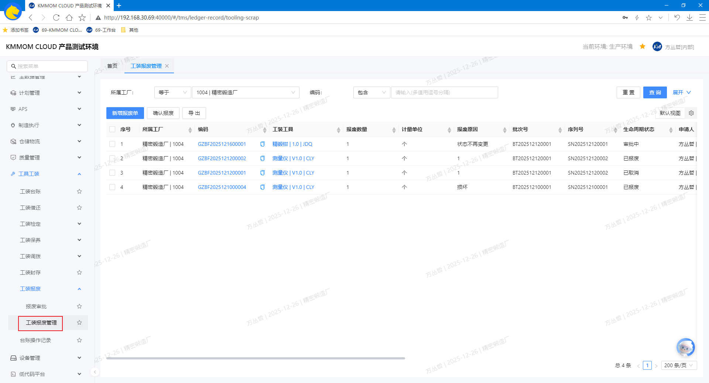
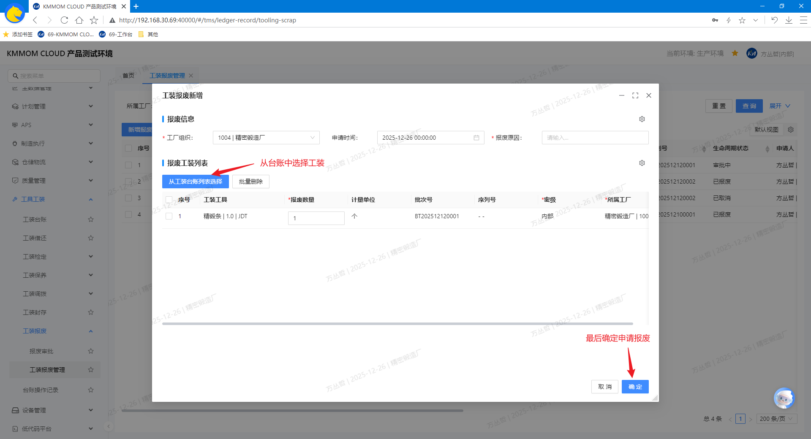

# 工装工具台账

## 功能概述
工装工具模块面向离散型制造业的工装管理与使用场景，提供台账、调拨、报废及操作记录的统一管理能力。模块包含：**工装台账**、**工装调拨管理**、**工装报废管理**、**台账操作记录**。

## 核心功能
- **工装台账**：
    - 以“单件/批次”两种管理方式展示工装实例的档案信息与业务状态
    - 支持工装台账新增、借用、归还、报检、保养、调拨出库、报废、导入、导出、查看详情等操作；
- **工装调拨**：跨组织调拨工装，确保批次/数量口径一致。
- **工装报废**：对不可用工装执行处置流程，受审批控制，并对审批后做最终确认，结果不可逆
- **台账操作记录**：集中展示借用、归还、报检、保养、调拨、报废等操作，用于追溯；可查询导出记录。

## 前提条件
具有工装主数据（参考文档： [资源数据](/view/04-核心模块/01-主数据/03-资源数据.md) 下的 **3. 工装定义** 功能）。

## 操作指南

### 1. 工装台账
#### 1.1. 进入页面
1. 在左侧导航点击 **工具工装** → **工装台账**。
2. 系统默认执行一次查询并展示台账数据的第一页。

#### 1.2. 增、查
1. 在顶部查询区域，按需填写筛选条件，查询目标工装台账数据。
2. 在列表中点击台账行的 **编码**，进入台账详情页面，查看台账基础属性信息。
3. 点击列表上方的 **新增台账**，在弹窗中从工装主数据中选择要登记的工装，根据实际情况填写 **库存数量**、**批次号**、**序列号**、**库房**、**库位** 等信息，点击 **确认** 保存。

> **注意：**
> - 台账编码系统自动生成且唯一；新增台账的初始状态默认为“在库(可用)”。  
> - 单件台账必须包含唯一的序列号；批次台账必须包含批次号且数量大于0。

#### 1.3. 借用
参考文档： [工装工具借用归还](/view/04-核心模块/07-工装管理/01-工装工具借用归还.md) 下的 **2.1. 借用** 功能。

#### 1.4. 归还
参考文档： [工装工具借用归还](/view/04-核心模块/07-工装管理/01-工装工具借用归还.md) 下的 **2.2. 归还** 功能。

#### 1.5. 报废
1. 前提条件：配置报废审批流程（参考审批流配置功能）。
2. 在列表中勾选一个或多个状态为“在库(可用)”的台账，点击 **报废**，提示过滤不可报废的台账数据；

3. 确认继续后，在弹窗中根据实际情况填写 **工厂组织**、**报废原因**、**报废数量** 等信息，点击 **确定** 生成报废申请单：
   - 报废数量默认为1且可编辑（不得超过“在库(可用)”数量）；
   - 点击 **从工装台账列表选择**，继续选择需要报废的其他工装实例，并填写对应信息；
   - 在待报废列表中选择不报废的台账数据，点击 **批量删除**，从待报废列表中移除。
4. 申请报废后，进入审批流程，审批通过后，需要在 **工装报废管理** 页面，进行最终 **确认报废** 后生效（参考 **3. 工装报废管理** 功能）。

> **注意**：报废不可逆，请谨慎操作。

#### 1.6. 导入、导出
1. 点击 **导入**，下载或查看标准模板。
2. 按模板填根据实际情况写台账数据，导入文件成功后，列表数据刷新。
3. 在查询区域设置筛选条件（可选），点击 **导出**，选择导出范围，导出为excel文件。

> **注意**：导入前系统会进行字段完整性与唯一性校验；若发现重复编码、序列号或非法数量，将阻止导入并给出错误提示。

#### 1.7. 调拨出库
1. 前提条件：配置调拨审批流程（参考审批流配置功能）。
2. 在列表中勾选一个或多个状态为“在库(可用)”的台账，点击 **调拨出库**，提示过滤不可调拨的台账数据；

3. 确认继续后，在弹窗中根据实际情况填写 **调出/调入组织**、**数量** 等信息，点击 **确定** 生成调拨申请单：
   - 调拨数量默认为1且可编辑（不得超过“在库(可用)”数量）；
   - 点击 **从工装台账列表选择**，继续选择需要调拨的其他工装实例，并填写对应信息；
   - 在待调拨列表中选择不调拨的台账数据，点击 **批量删除**，从待调拨列表中移除。
4. 申请调拨后，进入审批流程，审批通过后，需要在 **工装调拨管理** 页面，进行最终 **确认调拨** 后生效（参考 **2. 工装调拨管理** 功能）。

#### 1.8. 报检
- 前提条件：配置工装检定策略；
- 参考文档： [工装工具检定管理](/view/04-核心模块/07-工装管理/02-工装工具检定管理.md) 下的 **3.1. 报检** 功能。

#### 1.9. 保养
- 前提条件：配置工装保养策略；
- 参考文档： [工装保养管理](/view/04-核心模块/07-工装管理/03-工装保养管理.md) 下的 **3.1. 保养** 功能。

#### 1.10. 注意事项
- 业务约束：借用与归还需匹配数量范围；报废不可逆且可能需要审批。
- 权限控制：新增、借用、归还、报废、导入、删除等为敏感操作；无权限请联系系统管理员。
- 导入模板：请严格按模板字段与格式填写，避免编码、序列号、数量等字段不合法。

### 2. 工装调拨管理
#### 2.1. 进入页面
1. 在左侧导航点击 **工装管理** → **工装调拨** → **工装调拨管理**。
2. 系统默认执行一次查询并展示调拨数据的第一页。

#### 2.2. 增、查
1. 在顶部查询区域，按需填写筛选条件，查询目标调拨单数据，点击 **编码** 列可查看详情。
2. 点击页面右上角 **新增**，在弹窗中录入调拨信息，新增完成后，系统会自动生成对应的调拨单。

   - 点击 **从工装台账列表选择** ，从台账中选择需要调拨的工装实例；
   - 在明细表中填写 **调出组织**、**调入组织**、需要调拨的 **数量**（默认为1，可编辑）等信息。

> **注意：**
> - 调拨前配置调拨审批流程，申请调拨后进入审批流程。
> - 调拨数量不得超过来源库位的可用数量。

#### 2.3. 确认调拨
1. 在列表勾选状态为 **审批完成** 的调拨单，点击 **确认调拨**，在弹窗中填写 **接收库房** 和 **接收库位**，点击 **确定** 执行：
   - 系统扣减来源库位的可用数量。
   - 系统在目标库位增加对应数量（单件按序列号、批次按批次号）。
   - 更新调拨单状态为“已调拨”，记录调拨人与时间。

#### 2.4. 导出
1. 查询列表数据，点击 **导出**，选择导出范围，导出为Excel文件。

#### 2.5. 注意事项
- 为保障账实一致，调拨仅对“在库(可用)”数量生效；存在维修/待检状态的工装不可被调拨。

### 3. 工装报废管理
#### 3.1. 进入页面
1. 在左侧导航点击 **工装管理** → **工装报废** → **工装报废管理**。
2. 系统默认执行一次查询并展示报废数据的第一页。

#### 3.2. 增、查
1. 在顶部查询区域，按需填写筛选条件，查询目标报废单数据，点击 **编码** 列可查看详情。
2. 点击页面右上角 **新增**，在弹窗中录入报废信息，新增完成后，系统会自动生成对应的报废单。

   1. 点击 **从工装台账列表选择**，从台账中选择需要报废的工装实例；
   2. 在明细表中填写 **工厂组织**、**报废原因**、**报废数量**（默认为1，可编辑）。

> **注意：**
> - 报废前配置报废审批流程，申请报废后进入审批流程。
> - 报废数量不得超过当前在库(可用)数量。

#### 3.3. 确认报废
1. 在列表勾选状态为 **审批完成** 的报废单，点击 **确认报废** 执行：
   1. 系统从在库可用台账扣减相应数量（单件按序列号、批次按批次号）。
   2. 更新报废单状态为“已报废”，记录操作人与时间。

#### 3.4. 导出
1. 查询列表数据，点击 **导出**，选择导出范围，导出为Excel文件。

#### 3.5. 注意事项
- 报废为不可逆操作，请在确认前完成现场核验与审批。
- 适用状态：仅对“在库(可用)”数量生效；维修/待检状态的工装不可直接报废。