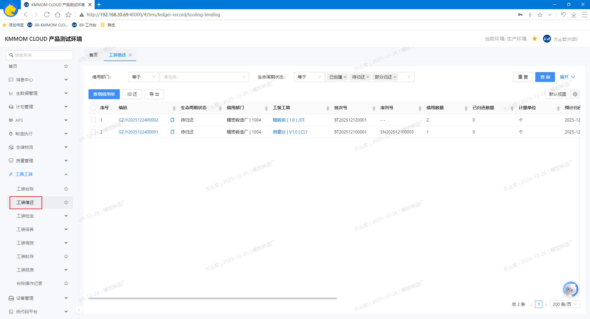
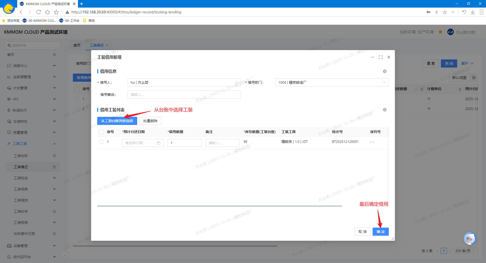
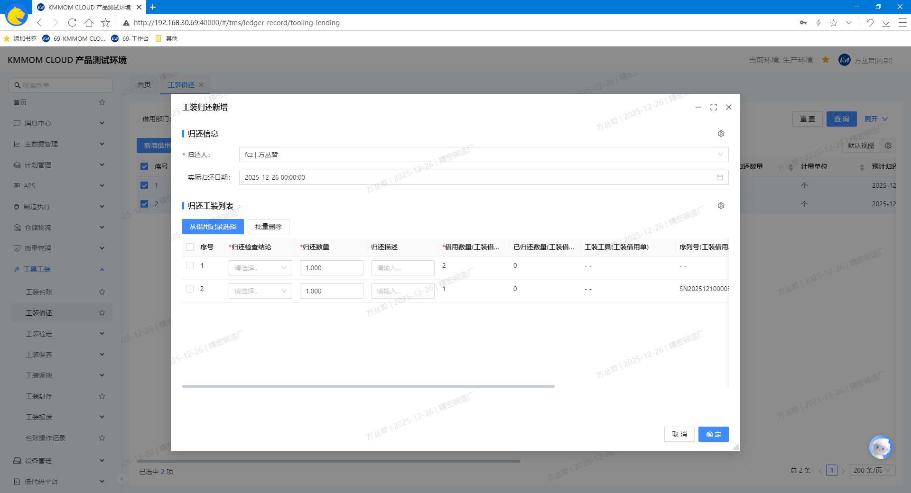
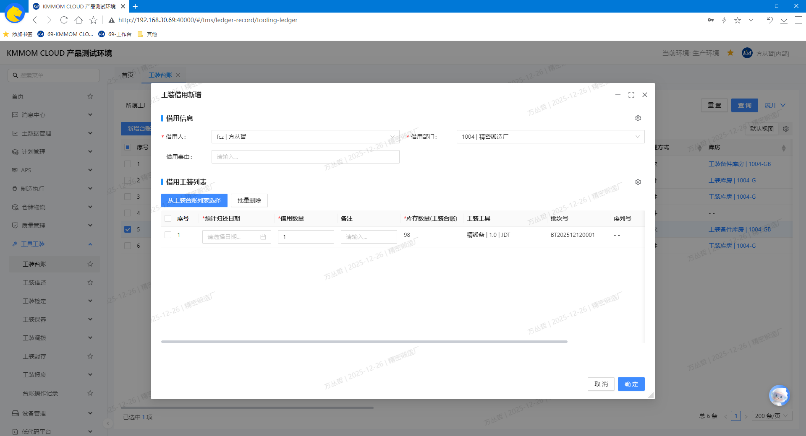
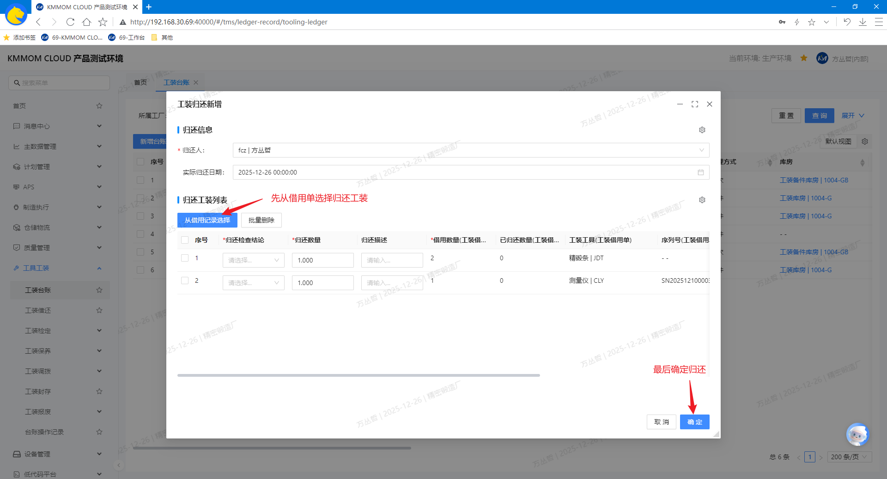

# 工装工具借用归还

## 功能概述
工装工具借用归还模块面向离散型制造业的工装使用与周转管理，统一支撑借用、归还与履历追溯。模块包含：**工装台账** 与 **工装借用归还** 两个页面。
- 适用场景：生产现场短期领用工装、跨班组借用、工装归还入库与状态更新（完好/待修/待检）。

## 核心功能
- **工装台账**：以“单件/批次”管理方式展示工装实例档案与状态，支持直接执行 **借用** 与 **归还**。  
- **工装借还**：集中办理工装借用与归还，工装借用单查询、详情查看及导出，并对数量范围、状态口径、序列号/批次号进行严格校验，确保账实一致与可追溯。

## 操作指南

### 1. 工装借还
#### 1.1. 进入页面
1. 在左侧导航点击 **工具工装** → **工装借还**。
2. 系统默认加载当前工厂的数据列表，可通过筛选区精确查询。

#### 1.2. 查询
1. 在顶部筛选区设置条件，点击 **查询**，系统根据条件查询出目标工装借用单数据。
2. 在列表中点击借用单的 **编码** 可进入详情页面查看 **基础属性** 和 **归还明细**。

#### 1.3. 借用
1. 点击 **新增借用单**，在借用弹窗中选择状态为“在库(可用)”的可借用工装，填写对应借用信息：**借用人**、**借用部门**、**预计归还日期**、**借用数量** 等，点击 **确定** 借用。

   - 单件台账：状态由”在库(可用)”变更为“在库(借用中)”。
   - 批次台账：从“在库(可用)”子台账扣减数量，并在“在库(借用中)”子台账增加或创建对应数量。

> **注意**：若填写数量超过可借用数量或缺少必填项（如预计归还日期），系统将阻止提交并提示。

#### 1.4. 归还
1. 在列表勾选一个或多个状态为“待归还”的借用单，点击 **归还**，系统自动将借用单带入归还弹窗中，填写每行借用单的归还信息：**归还人**、**归还结论**、**归还数量**、**工装借用单** 等，点击 **确定** 归还。

   - 从“在库(借用中)”台账扣减归还数量。
   - 根据归还后状态，数量累加至对应的在库子台账（“在库(可用)”）。

> **注意：**
> - **工装借用单** 要与当前归还的工装批次/序列号匹配，确保归还正确。
> - 支持同一批次的拆分归还（即部分归还）。

#### 1.5. 导出
1. 点击 **导出**，选择导出范围，导出数据为excel文件。

#### 1.6. 注意事项
- 状态约束：借用仅对“在库(可用)”状态的台账生效；归还仅对“在库(借用中)”状态的台账生效。
- 数量校验：批次按“可借用/领用数量”范围校验；单件严格按序列号唯一性校验。

### 2. 工装台账
#### 2.1. 借用
1. 在 **工装台账** 页面，查询列表中勾选一个或多个状态为“在库(可用)”的台账，点击 **借用**，提示过滤不可借用的台账数据；
2. 确认继续后，在弹窗中核对待借用工装列表中自动带入的可借用台账数据；

3. 根据实际情况填写对应信息 **借用人**、**借用部门**、**预计归还日期**、**借用数量**，点击 **确认** 生成借用单：
   - 借用数量默认为1且可编辑（不得超过“可借用”数量）；
   - 点击 **从工装台账列表选择**，继续选择需要借用的其他工装实例，并填写对应信息；
   - 在待借用列表中选择不借用的台账数据，点击 **批量删除**，从待借用列表中移除。

> **注意：**
> - 仅“在库(可用)”的台账允许借用；
> - 批次台账的借用会在“在库(可用)”子台账中扣减数量，并在“在库(借用中)”子台账中增加或创建对应数量。

#### 2.2. 归还
1. 在 **工装台账** 页面，查询列表中勾选一个或多个状态为“在库(借用中)”的台账，点击 **归还**，提示过滤不可归还的台账数据；
2. 确认继续后，在弹窗中点击 **从借用记录选择**，选择需要归还的工装；

3. 根据实际情况填写 **归还检查结论**、**归还数量**、**工装借用单**等信息，点击 **确认** 归还：
   - 归还数量默认为1且可编辑（不得超过“借用”数量）；
   - 点击 **从借用记录列表选择**，继续选择需要归还的其他工装实例，并填写对应信息；
   - 在待归还列表中选择不归还的台账数据，点击 **批量删除**，从待归还列表中移除。

> **注意**：系统会从原“在库(借用中)”台账扣减归还数量，并在对应的“在库(可用)”子台账中累加或创建记录。