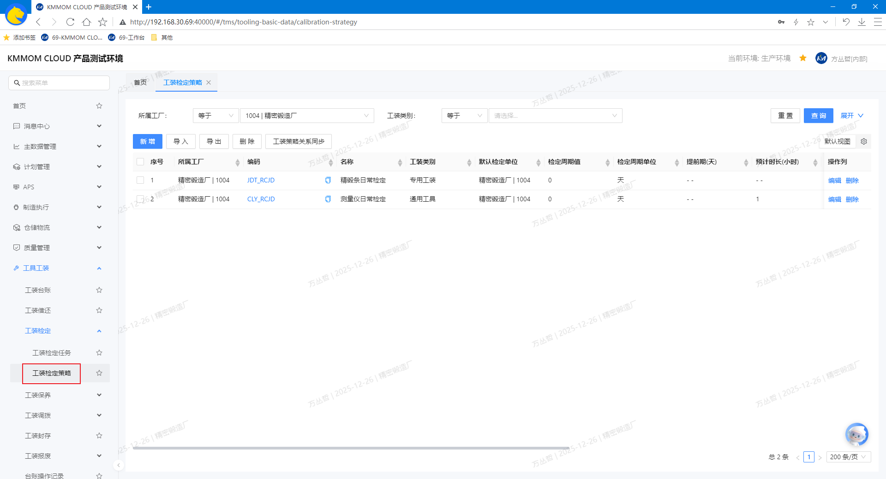
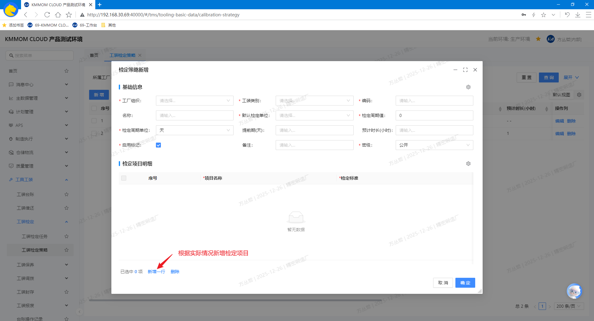
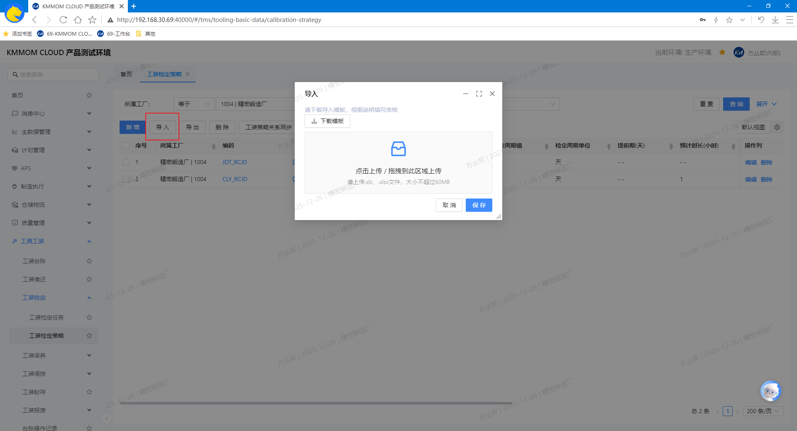
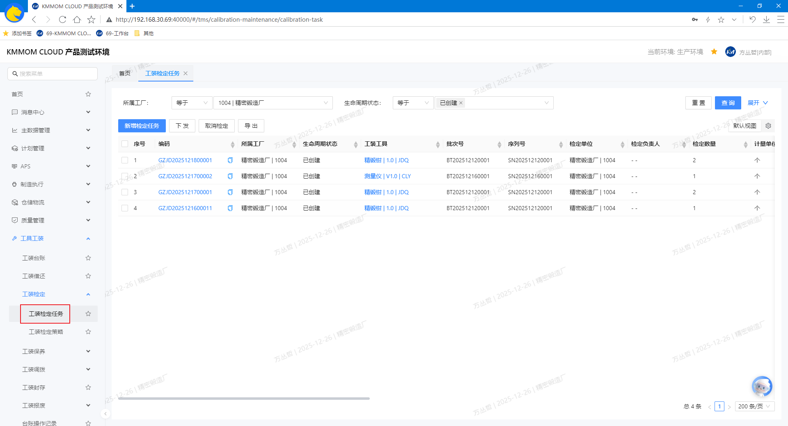
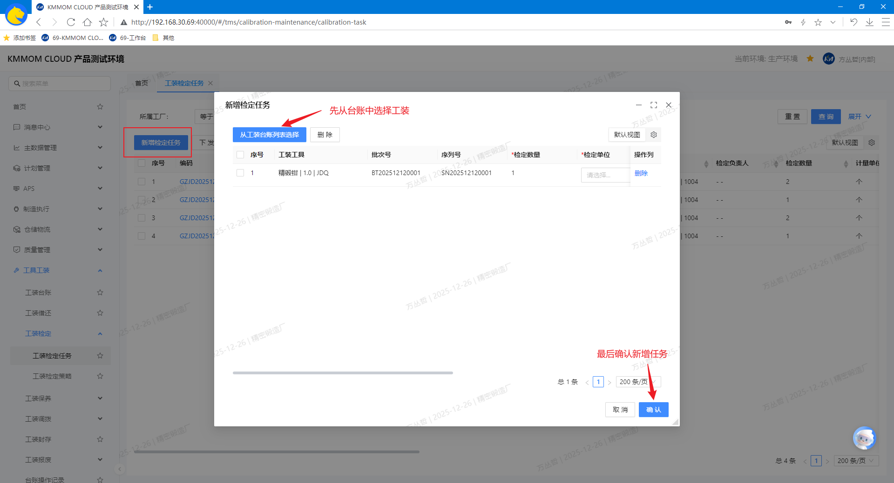
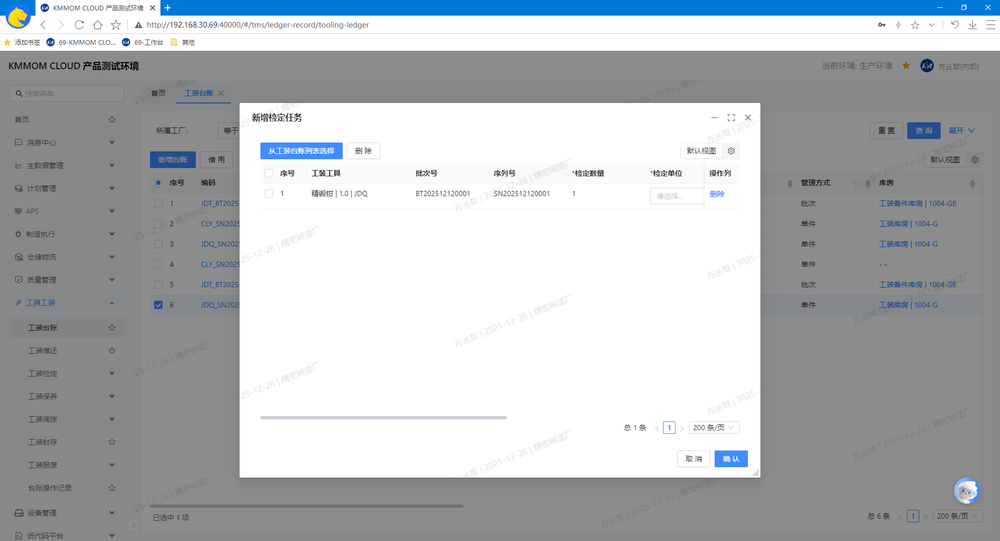
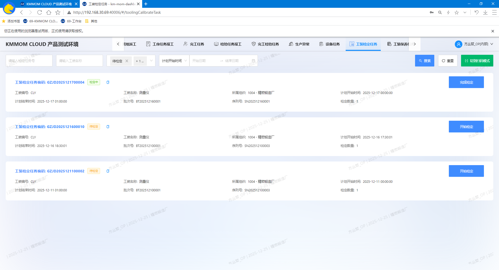
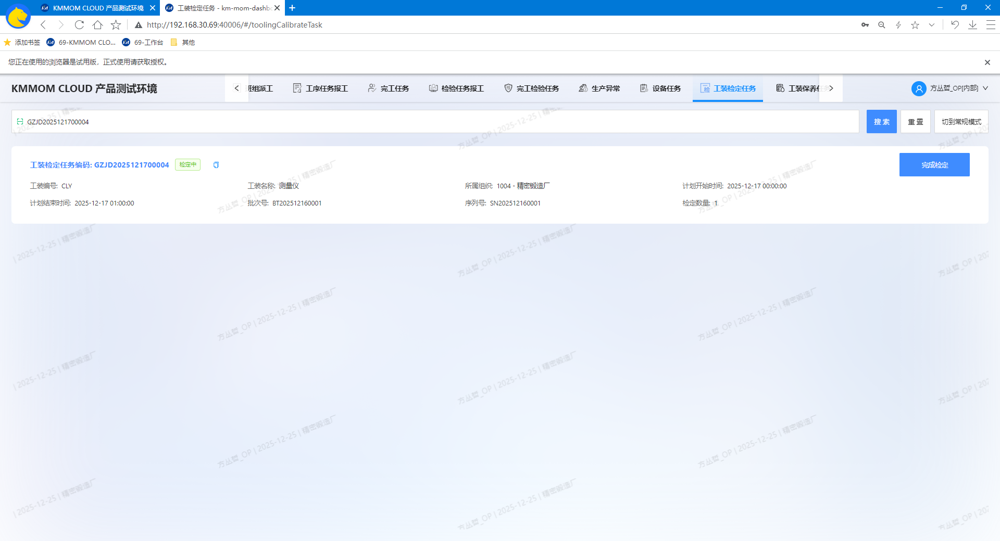
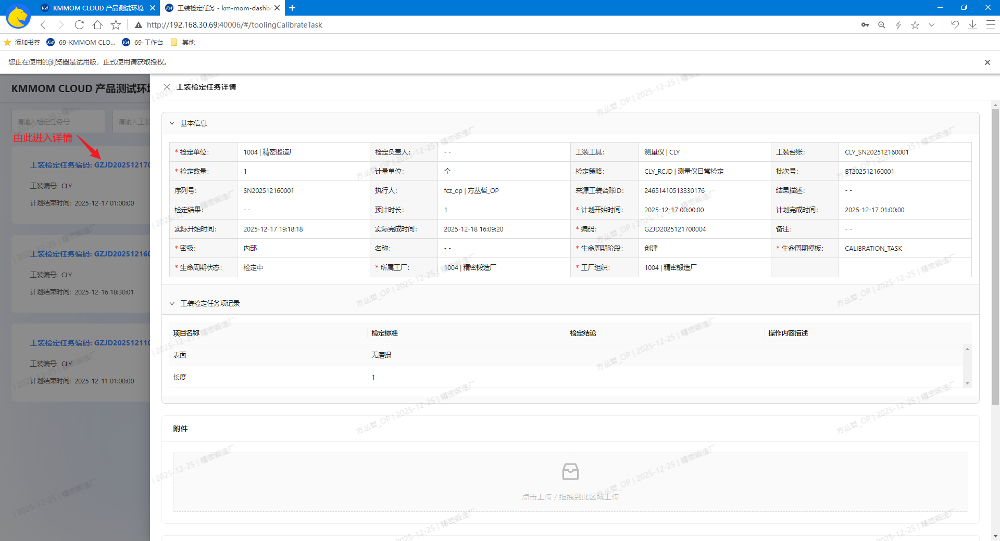

# 工装工具检定管理

## 功能概述
工装工具检定管理面向离散型制造企业的计量类工装，覆盖“策略配置—台账报检—任务执行—结果闭环”的全流程；同时可通过定时任务执行器按检定策略自动生成检定任务（支持周期与时间窗配置、策略有效期与对象范围校验），以减少人工创建与遗漏。通过策略与任务的闭环，系统对工装的状态进行约束更新（如“在库(可用)”→“在库(待检中)”），并将结果沉淀到台账与任务，确保审计追溯与质量合规。
- 适用对象：管理方式为单件的工装台账

## 核心功能
1. **工装检定策略**
   - 定义检定规则、检定单位、负责人、完成日期等。
   - 支持策略模板，批量配置。
2. **工装检定任务**
   - 查看、新增检定任务。
   - 通过定时任务执行器，根据策略配置自动生成检定任务。
   - 记录任务执行结果。
3. **工装台账**：手动对状态为“在库(可用)”的工装生成检定任务。
4. **工作台 - 工装检定任务**（个人任务视角）
   - 查看待执行的检定任务。
   - 执行检定任务，记录结果。
   - 完成检定任务，更新工装台账状态。

## 操作指南

### 1. 工装检定策略
#### 1.1. 进入页面
1. 在左侧导航点击 **工具工装** → **工装检定** → **工装检定策略**。
2. 系统默认加载当前工厂的数据列表，可通过筛选区精确查询。

#### 1.2. 增、删、改、查
1. 在顶部筛选区设置条件，点击 **查询**，系统根据条件查询出目标检定策略数据。
2. 在列表中点击策略的 **编码** 可进入详情页面查看 **基本信息** 和 **检定项目明细**。
3. 点击 **新增**，打开“新增检定策略”对话框，根据实际情况填写对应策略信息，启用保存后生效。

   - 在“基础信息”页签填写 **工厂组织**、**工装类别**、**编码**、**名称**、**检定周期**、**启用**、**密级**等；
      - **检定周期值** 和 **检定周期单位**（可选值：“天”、“周”、“月”）：用于定义自动生成检定任务的执行周期，如“3个月”表示每3个月生成自动生成一次检定任务、“7天”表示每7天生成一次检定任务。
      - **提前期(天)**：用于定义任务生成时间与检定周期的偏移量，如“3”表示任务在每次检定周期开始前3天生成。
   - 在“检定项目明细”页签，可编辑表格新增项目（项目名称、检定标准）；
   - 可通过 **启用** 复选框控制策略是否启用。
4. 在策略列表点击行尾 **编辑**，可维护当前策略信息；策略编号只读不可修改。
5. 在策略列表点击行尾 **删除**，进行单个删除；或者选择需要删除的策略数据，点击列表上方 **删除** 按钮，进行批量删除。

> **注意：**
> - 策略数据删除前，确认未与工装数据关联，否则删除后将导致相关数据异常
> - 启用策略前，确认配置的 **检定周期**、**提前期(天)** 和 **检定项目明细** 均符合预期。
> - 检定任务下一个自动生成时间，将自动根据工装关联的检定策略的“最后执行时间”（上次任务生成时间）和 策略的“检定周期”、“提前期(天)”计算。

#### 1.3. 导入、导出
1. 点击 **导入**，打开导入弹窗，下载导入模板。

2. 按照模板根据实际填写文件内容，包含 **工装检定策略** 和 **工装检定项** 2个sheet页（参考 **1.2. 增、删、改、查** 新增功能部分对字段的说明），导入excel文件成功后，列表数据刷新。
3. 点击 **导出**，选择导出数据范围，导出数据为Excel文件

> **注意**：确保“工装检定项”与“工装检定策略”数据关联正确。

### 2. 工装检定任务
#### 2.1. 进入页面
1. 在左侧导航点击 **工具工装** → **工装检定** → **工装检定任务**。
2. 系统默认加载当前工厂的数据列表，可通过筛选区精确查询。

#### 2.2. 查询
1. 进入“工装检定任务管理”页面，在查询表单输入或选择查询条件，点击 **查询**，查询出目标检定任务数据。

#### 2.3. 新增检定任务
1. 点击 **新增**，打开“新增检定任务”对话框，从台账中选择“在库(可用)”和“在库(借用中)”状态的工装，在弹窗中根据实际情况填写 **检定单位**、**计划开始时间**、**检定策略**、**检定负责人**、**预计时长** 等信息，点击 **确定** 根据工装对应的检定策略生成检定任务：

   - 点击 **从工装台账列表选择**，继续选择需要报检的其他工装实例，并填写对应信息；
   - 在待报检列表中选择不需要报检的台账数据，点击 **批量删除**，从待报检列表中移除。

> **注意：**
> - 如果未选择检定策略，则检定任务无关联的检定策略；
> - 如果选择的检定策略无检定项目明细，则检定任务无检定项目
> - 手动新增检定任务可作为自动生成检定任务失败情况下的备用方案。

#### 2.4. 下发
1. 在任务列表选择一个或多个状态为“已创建”的任务，点击 **下发**，系统将任务下发到车间工作台，任务状态变更为“待检定”。

#### 2.5. 取消检定
1. 在任务列表选择一个或多个非“检定完成”和“已取消”的检定任务，点击 **取消检定**，系统将任务状态变更为“已取消”。

> **注意：**
> - 取消检定任务后，相关工装状态将恢复为“在库(可用)”或“在库(借用中)”。
> - 已完成或已取消的检定任务无法再次取消。
> - 取消检定任务后，车间工作台不再显示已取消的检定任务。

#### 2.6. 导出
1. 点击 **导出**，选择导出范围，导出数据为Excel文件。

### 3. 工装台账
#### 3.1. 报检
1. 在列表中勾选一个或多个状态为“在库(可用)”的台账，点击 **报检**，提示过滤不可报检的台账数据；

2. 确认继续后，在弹窗中根据实际情况填写 **检定单位**、**计划开始时间**、**检定策略**、**检定负责人**、**预计时长** 等信息，点击 **确定** 根据工装对应的检定策略生成检定任务：
   - 点击 **从工装台账列表选择**，继续选择需要报检的其他工装实例，并填写对应信息；
   - 在待报检列表中选择不需要报检的台账数据，点击 **批量删除**，从待报检列表中移除。

> **注意：**
> - 如果未选择检定策略，或者选择的检定策略无检定项目明细，则检定任务无关联的检定策略；
> - 如果选择的检定策略无检定项目明细，则检定任务无检定项目。

### 4. 工作台 - 工装检定任务
#### 4.1. 进入页面
1. 在顶部导航点击 **工装检定任务**。
2. 系统默认加载当前工厂的任务数据卡片，可通过筛选区精确查询。

#### 4.2. 查询
1. 顶部筛选区，默认显示常规模式，通过多条件组合查询；
2. 支持切换扫码模式，通过检定任务号查询。

3. 可通过任务卡片上的 **编码** 进入详情弹窗查看 **基础属性**、**检定项目记录** 和 **附件**。

#### 4.3. 执行检定
1. 点击状态为“待检定”的检定任务卡片右侧的 **开始检定** 按钮，任务状态变更为“检定中”；
2. 点击状态为“检定中”的检定任务卡片右侧的 **完成检定** 按钮，弹出任务填报窗，根据实际情况填写检定结论，提交后任务状态变更为“已完成”。
    - 有检定策略，则对策略中的每个检定项目明细填写检定结论和描述；
    - 填写检定结果。
    - 可上传检定附件（如检定报告、图片等）和结果描述。
    - 可将当前填写信息保存为草稿，待后续确认完善后再提交。

> **注意：**
> - 车间工作台完成检定任务上传的附件，可在管理端系统的 **工装检定任务** 页面中对应的检定任务详情页面中查看和下载；同时可查看检定任务项记录。
> - 如果工装台账当前状态为非“在库(可用)”，则无法开始检定，需先将工装归还后，方可开始检定。

#### 4.4. 注意事项
- 工作台仅显示下发到车间，且未完成，未取消的任务。