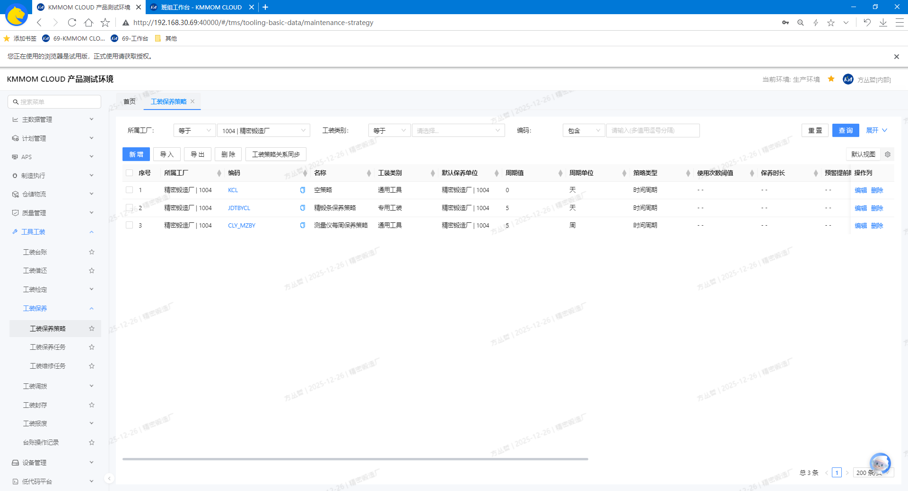
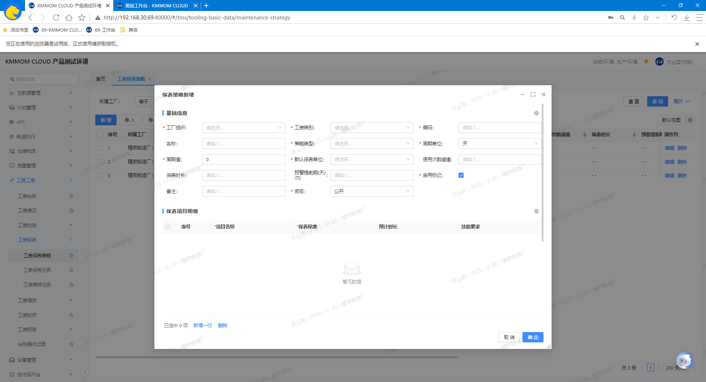
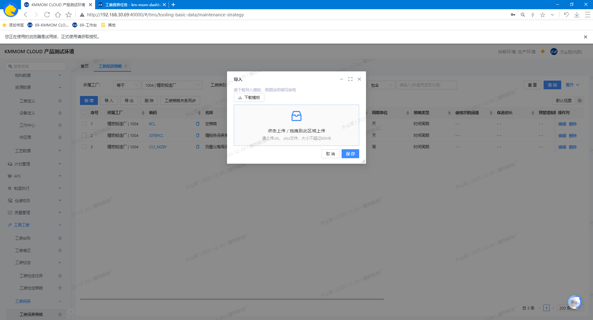
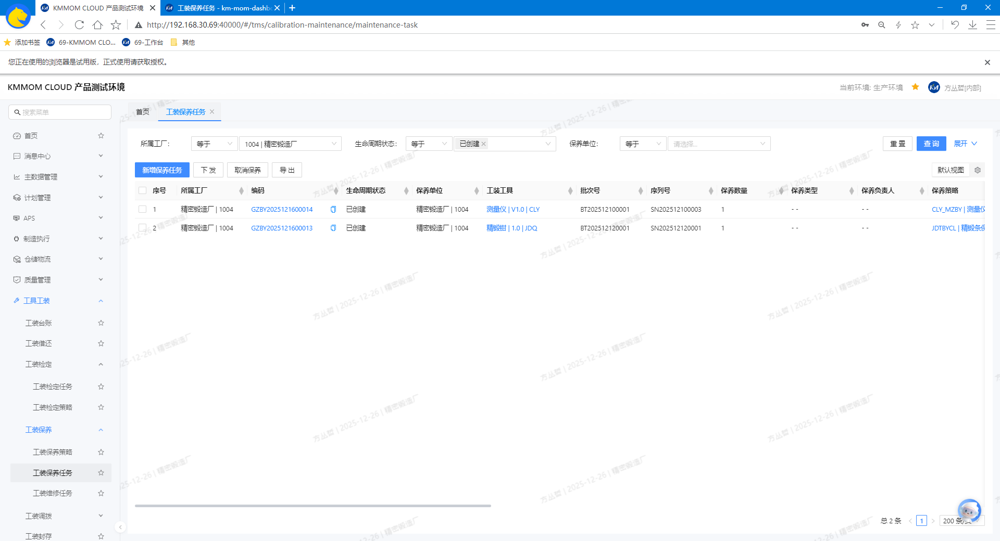
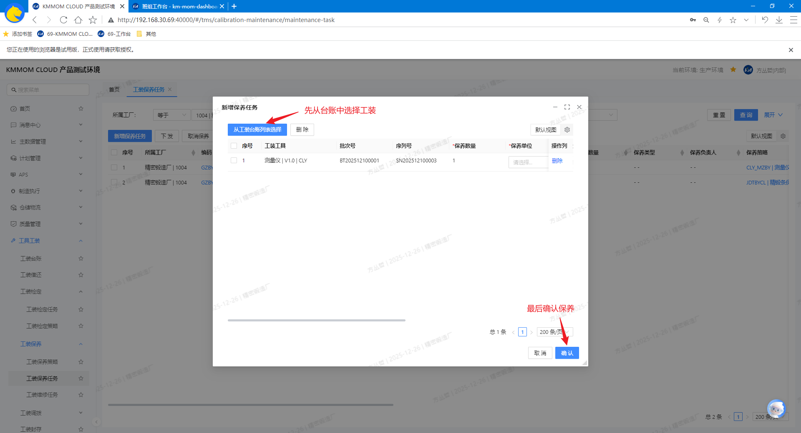
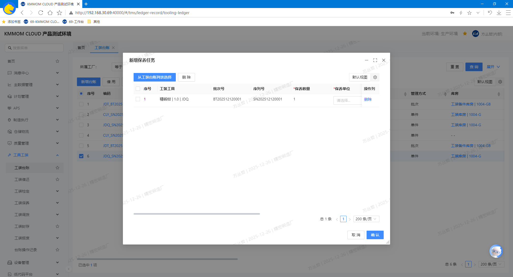
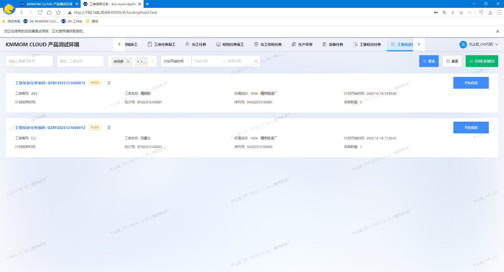
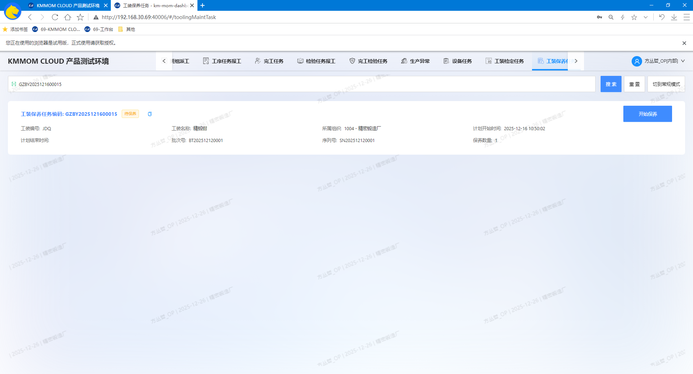
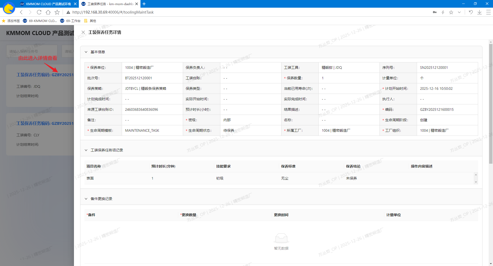

# 工装工具保养管理

## 功能概述
工装工具保养管理面向离散型制造企业的工装与量具，覆盖“策略配置—台账保养—任务执行—结果闭环”的全流程。系统可通过定时任务执行器按保养策略自动生成保养任务（支持时间周期与使用量阈值、时间窗与策略有效期），减少人工创建与遗漏。通过策略与任务的闭环，系统对工装状态进行约束更新（如“在库(可用)”→“在库(保养中)”），并将结果沉淀到台账与任务，确保审计追溯与质量合规。
- 适用对象：管理方式为单件的工装台账

## 核心功能
- **工装保养策略**
    - 定义保养规则、保养单位、负责人、完成日期等。
    - 支持策略模板，批量配置。
- **工装保养任务**
   - 查看、新增保养任务。
   - 通过定时任务执行器，根据策略配置自动生成保养任务。
   - 记录任务执行结果。
- **工装台账**：手动对状态为“在库(可用)”的工装生成保养任务。
- **工作台 - 工装保养任务**（个人任务视角）
   - 查看待执行的保养任务。
   - 执行保养任务，记录结果。
   - 完成保养任务，更新工装台账状态。

## 操作指南

### 1. 工装保养策略
#### 1.1. 进入页面
1. 在左侧导航点击 **工装工具** → **工装保养** → **工装保养策略**。
2. 系统默认加载当前工厂的数据列表，可通过筛选区精确查询。

#### 1.2. 增、删、改、查
1. 在顶部筛选区设置条件，点击 **查询**，系统根据条件查询出目标保养策略数据。
2. 在列表中点击策略的 **编码** 可进入详情页面查看 **基本信息**、**保养项目明细** 和 **保养项目备件明细**。
3. 点击 **新增**，打开“新增保养策略”对话框，根据实际情况填写对应策略信息，启用保存后生效。

   - 在“基础信息”页签填写 **工厂组织**、**工装类别**、**编码**、**名称**、**策略类型**、**保养周期**、**默认保养单位**、**启用**、**密级**等；
      - **保养周期值** 和 **保养周期单位**：用于定义自动生成保养任务的执行周期，如“3个月”代表每3个月自动生成一次保养任务、“7天”代表每7天自动生成一次保养任务。
      - **预警提前期(天/次)**：用于定义保养任务生成时间与保养周期的偏移量，如“3”表示任务在每次保养周期开始前3天生成。
   - 在“保养项目明细”页签，可编辑表格新增项目（项目名称、保养标准）；
   - 在“保养项目备件明细”页签，可编辑表格新增 **工装备件** 类型的工装；
   - 可通过 **启用** 复选框控制策略是否启用。
4. 在策略列表点击行尾 **编辑**，可维护当前策略信息；策略编号只读不可修改。
5. 在策略列表点击行尾 **删除**，进行单个删除；或者选择需要删除的策略数据，点击列表上方 **删除** 按钮，进行批量删除。

> **注意：**
> - 策略数据删除前，确认未与工装数据关联，否则删除后将导致相关数据异常。
> - 启用策略前，确认配置的 **保养周期**、**预警提前期(天/次)**、**保养项目明细** 和 **保养项目备件明细** 均符合预期。
> - 保养任务下一个自动生成时间，将自动根据工装关联的保养策略的“最后执行时间”（上次任务生成时间）和策略的“保养周期”、“预警提前期(天/次)”计算。

#### 3. 导入、导出
1. 点击 **导入**，打开导入对话框，下载模板文件。

2. 按照模板根据实际填写文件内容，包含 **工装保养策略**、**工装保养项** 和 **工装保养备件明细** 3个sheet页（参考 **1.2. 增、删、改、查** 新增功能部分对字段的说明），导入excel文件成功后，列表数据刷新。
3. 点击 **导出**，选择导出数据范围，导出数据为Excel文件。

### 2. 工装保养任务
#### 2.1. 进入页面
1. 在左侧导航点击 **工装工具** → **工装保养** → **工装保养任务**。
2. 系统默认加载当前工厂的数据列表，可通过筛选区精确查询。

#### 2.2. 查询
1. 进入“工装保养任务管理”页面，在查询表单输入或选择查询条件，点击 **查询**，查询出目标保养任务数据。

#### 2.3. 新增保养任务
1. 点击 **新增**，打开“新增保养任务”对话框，从台账中选择“在库(可用)”和“在库(借用中)”状态的工装，在弹窗中根据实际情况填写 **保养单位**、**计划开始时间**、**保养策略**、**保养负责人**、**预计时长** 等信息，点击 **确定** 根据工装对应的保养策略生成保养任务：

   - 点击 **从工装台账列表选择**，继续选择需要保养的其他工装实例，并填写对应信息；
   - 在待保养列表中选择不需要保养的台账数据，点击 **批量删除**，从待保养列表中移除。

> **注意：**
> - 如果未选择保养策略，则保养任务无关联的保养策略；
> - 如果选择的保养策略无 **保养项目明细**、**保养项目备件明细**，则保养任务无保养项目和备件明细；
> - 手动新增保养任务可作为自动生成保养任务失败情况下的备用方案。

#### 2.4. 下发
1. 在任务列表选择一个或多个状态为“已创建”的任务，点击 **下发**，系统将任务下发到车间工作台，任务状态变更为“待保养”。

#### 2.5. 取消保养任务
1. 在任务列表选择一个或多个非 **保养完成** 和 **已取消** 的保养任务，点击 **取消保养**，系统将任务状态变更为“已取消”。

> **注意：**
> - 取消保养任务后，相关工装状态将恢复为“在库(可用)”或“在库(借用中)”。
> - 已完成或已取消的保养任务无法再次取消。
> - 取消保养任务后，车间工作台不再显示已取消的保养任务。

#### 2.6. 导出
1. 点击 **导出**，选择导出范围，导出数据为Excel文件。

### 3. 工装台账
#### 3.1. 保养
1. 在列表中勾选一个或多个状态为“在库(可用)”的台账，点击 **保养**，提示过滤不可保养的台账数据；

2. 确认继续后，在弹窗中根据实际情况填写 **保养单位**、**计划开始时间**、**保养负责人**、**预计时长** 等信息，点击 **确定** 根据工装对应的保养策略生成保养任务：
   - 点击 **从工装台账列表选择**，继续选择需要保养的其他工装实例，并填写对应信息；
   - 在待保养列表中选择不需要保养的台账数据，点击 **批量删除**，从待保养列表中移除。

> **注意：**
> - 如果未选择保养策略，或者选择的保养策略无保养项目明细，则保养任务无关联的保养策略；
> - 如果选择的保养策略无保养项目明细，则保养任务无保养项目。

### 4. 工作台 - 工装保养任务
#### 4.1. 进入页面
1. 在顶部导航点击 **工装保养任务**。
2. 系统默认加载当前工厂的任务数据卡片，可通过筛选区精确查询。

#### 4.2. 查询
1. 顶部筛选区，默认显示常规模式，通过多条件组合查询；
2. 支持切换扫码模式，通过保养任务号查询。

3. 可通过任务卡片上的 **编码** 进入详情弹窗查看 **基础属性**、**保养项目记录**、**备件更换记录** 和 **附件**。

#### 4.3. 执行保养
1. 点击状态为 **待保养** 的保养任务卡片右侧的 **开始保养** 按钮，任务状态变更为“保养中”；
2. 点击状态为 **保养中** 的保养任务卡片右侧的 **完成保养** 按钮，弹出任务填报窗，根据实际情况填写保养结论，提交后任务状态变更为“保养完成”。
    - 有保养策略，则对策略中的每个保养项目明细填写保养结论和描述；
    - 填写保养结果。
    - 可上传检定附件（如检定报告、图片等）和结果描述。
    - 可将当前填写信息保存为草稿，待后续确认完善后再提交。

> **注意：**
> - 车间工作台完成保养任务上传的附件，可在管理端系统的 **工装保养任务** 页面中对应的保养任务详情页面中查看和下载；同时可查看保养任务项记录。
> - 如果工装台账当前状态为非“在库(可用)”，则无法开始保养，需先将工装归还后，方可开始保养。

#### 4.4. 注意事项
- 工作台仅显示下发到车间，且未完成，未取消的任务。