# 生产工作台

生产工作台是车间生产执行的核心作业平台，集成了班组管理、任务派工、生产报工和任务查询等功能。通过生产工作台，班组长可以高效地进行生产指挥和资源调度，一线员工可以便捷地接收任务并汇报生产进度，确保生产计划的顺利落地。

## 功能概述

生产工作台主要包含以下核心模块：
1. **班组工作台**：提供生产数据的可视化看板，帮助管理人员实时监控生产进度、质量状况和人员负载。
2. **班组派工**：支持将生产任务分配给具体的人员或设备，实现任务的精细化管理。
3. **工序任务报工**：一线员工接收任务、执行生产并汇报完工数量和质量数据的操作界面。
4. **完工任务**：用于查询和回顾历史完工任务的详细记录。

---

## 1. 班组工作台

班组工作台是生产现场的“指挥驾驶舱”，通过可视化的图表和指标，集中展示班组的生产态势。

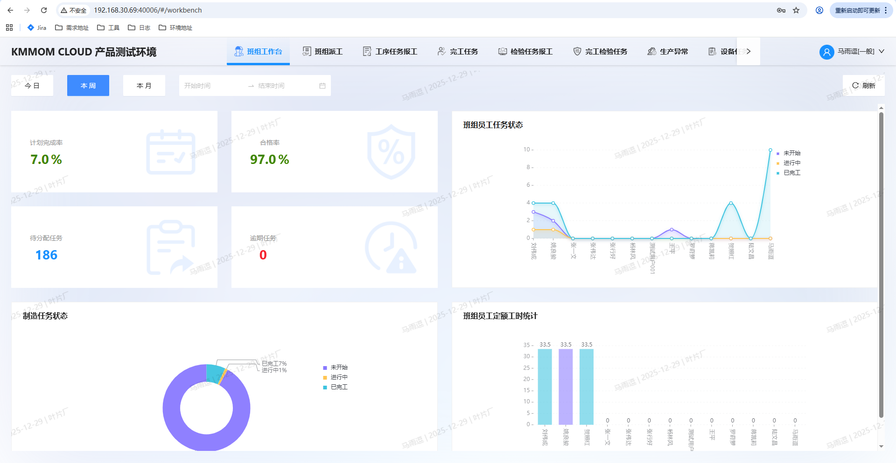

### 界面结构与交互

- **日期查询**：位于界面左上角。
    - **默认值**：本周。
    - **筛选范围**：支持切换 **今日**、**本周**、**本月** 或 **指定区间**。
    - **查询逻辑**：筛选 **计划完成时间** 在所选日期范围内的制造任务。
- **指标统计区**：位于界面顶部，展示计划完成率、合格率、待分派任务数、逾期任务数。
- **图表统计区**：位于界面下部，展示制造任务状态、班组员工任务及状态、班组员工工时统计。
- **交互说明**：本页面仅提供数据查询与展示功能，不支持直接编辑。

### 核心指标说明

#### 1. 计划完成率
衡量车间生产计划执行情况的关键指标，反映规定时间内实际完成任务与计划任务的比例，体现生产效率和计划合理性。
- **公式**：`计划完成率 =（已完成任务数 ÷ 计划任务总数）× 100%`
- **示例**：若本周计划生产 100 个产品，实际完成了 90 个，则计划完成率 = (90 ÷ 100) × 100% = 90%。

#### 2. 合格率
产品质量的重要衡量标准，反映产品在生产过程中符合质量要求的程度，对于把控质量、降低废品率具有关键作用。
- **公式**：`合格率 =（合格产品数 ÷ 产品总计划产出数）× 100%`
- **示例**：一批产品共 1000 个，经检验有 950 个合格，则合格率 = (950 ÷ 1000) × 100% = 95%。

#### 3. 待分派任务数
反映当前需要处理和分配的工作量，帮助班组长及时了解任务积压情况，合理安排人力资源。
- **公式**：`待分派任务数 = 任务总数量 - 已分配任务数`
- **示例**：车间当前共有任务 100 项，已分配出去 60 项，则待分派任务数 = 100 - 60 = 40 项。

#### 4. 逾期任务数
衡量车间生产进度控制的重要指标，反映未能按时完成的任务数量，用于识别生产瓶颈。
- **公式**：`逾期任务数 = 截至当前日期应完成任务数 - 已完成任务数`
- **示例**：到今天为止，应完成的任务有 50 项，实际只完成了 30 项，则逾期任务数 = 50 - 30 = 20 项。

### 图表统计说明

#### 1. 制造任务状态
直观展示车间内所有任务的进展情况，包括 **未开始**、**进行中** 和 **已完工** 三种状态，有助于掌握生产动态。
- **公式**：`各状态任务占比 =（各状态任务数 ÷ 任务总数）× 100%`
- **示例**：车间共有任务 100 项，其中未开始 20 项（占比 20%）、进行中 50 项（占比 50%）、已完工 30 项（占比 30%）。

#### 2. 班组员工任务及状态
用于了解每个员工的任务分配情况和任务执行状态（未开始、进行中、已完成），辅助精细化的人员管理。
- **统计逻辑**：按员工维度统计各状态的任务数量。
- **示例**：某员工共分配到 10 项任务，其中未开始 2 项、进行中 5 项、已完成 3 项。

#### 3. 班组员工定额工时统计
通过 **定额工时** 衡量员工在标准时间内的工作产出，评估工作效率和工作强度。
- **公式**：`定额工时 = ∑（各任务标准工时）`
- **示例**：某员工在本周内共完成 3 项任务，定额工时分别为 5、6、4 小时，则本周总定额工时 = 5 + 6 + 4 = 15 小时。

### 操作指南

1. **进入模块**：在系统导航栏选择 **生产工作台** > **班组工作台**。
2. **切换时间范围**：
   - 点击页面顶部的 **今日**、**本周**、**本月** 按钮快速切换统计周期。
   - 也可以在日期选择框中手动指定开始和结束日期。
3. **查看数据**：根据上述指标和图表说明，分析班组生产情况。

### 注意事项

- 数据统计依赖于现场的及时报工，请确保报工数据的实时性和准确性。
- 单一指标无法完全反映真实情况，例如，高“计划完成率”可能伴随着低“合格率”。建议综合所有指标进行全面分析。
- 建议班组长每日晨会时查看工作台数据，及时调整当日生产安排。

---

## 2. 班组派工

班组派工是将生产计划转化为具体执行指令的关键环节。支持班组长对制造任务进行单个或批量派工，并支持将单个任务分割给多个人员或设备并行执行。

### 核心功能

- **单个派工**：支持对单个任务进行派工，并支持**任务分割**（将一个任务拆分为多个派工项）。
- **批量派工**：支持同时对多个任务进行统一派工，但**不支持任务分割**。
- **状态更新**：派工完成后，系统自动更新制造任务的业务状态、派工状态及相关属性。
- **辅助功能**：支持在派工环节直接查看图纸文档或发起领料申请。

### 操作指南

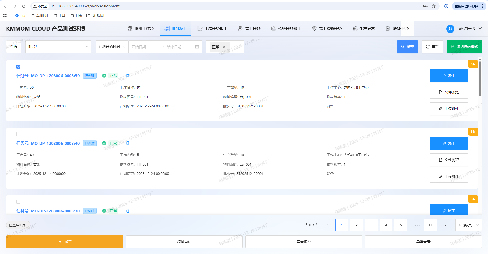

#### 1. 发起派工
- 进入 **生产工作台** > **班组派工**。
- 在列表中勾选一个或多个任务。
- **单个派工**：勾选单个任务后，点击 **派工** 按钮。
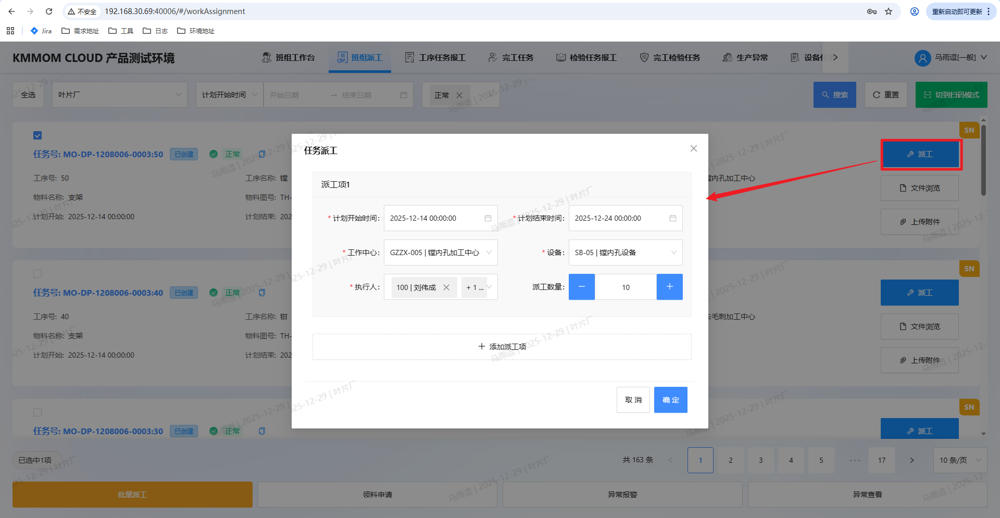
- **批量派工**：勾选多个任务后，点击 **批量派工** 按钮。
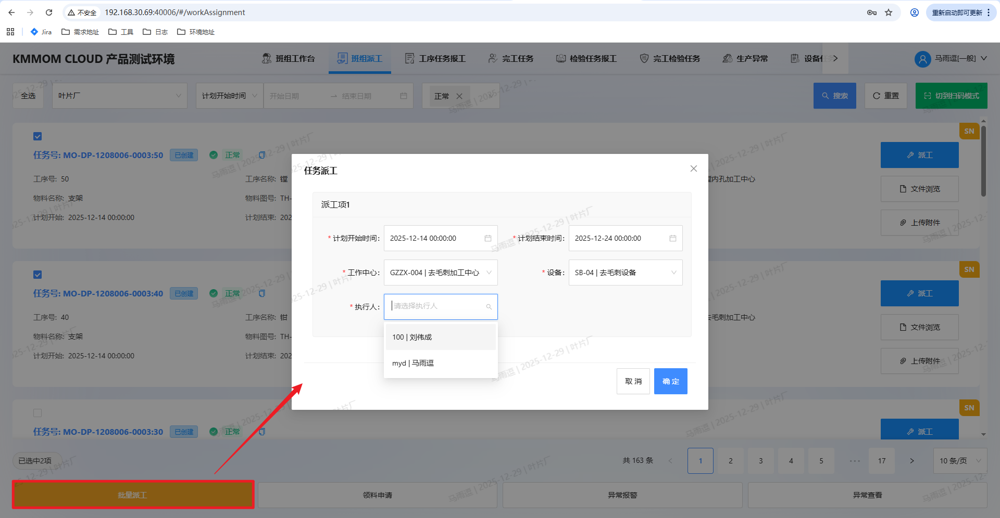
#### 2. 填写派工信息
在弹出的“任务派工”窗口中，填写以下信息：

- **计划开始/结束时间**（必填）：
  - 默认值优先取排程结果的开始/结束时间，若无排程结果则取制造任务的计划时间。
- **工作中心**（必填，单选）：
  - 默认值优先取排程资源的工作中心，若无则取制造任务的工作中心。
  - 下拉选项为当前用户所属工厂下的所有工作中心。
- **设备**（条件必填，单选）：
  - 当工作中心类型为“设备”时，此项必填。
  - 默认值优先取排程资源的设备，若无则取制造任务的设备。
- **执行人**（必填，多选）：
  - 默认为空，下拉选项为所选工作中心和设备下的关联人员。
- **派工数量**：
  - **单个派工**：必填，默认为当前任务的计划数量。
  - **批量派工**：不显示，系统默认按各任务的计划数量进行派工。

#### 3. 任务分割（仅单个派工）
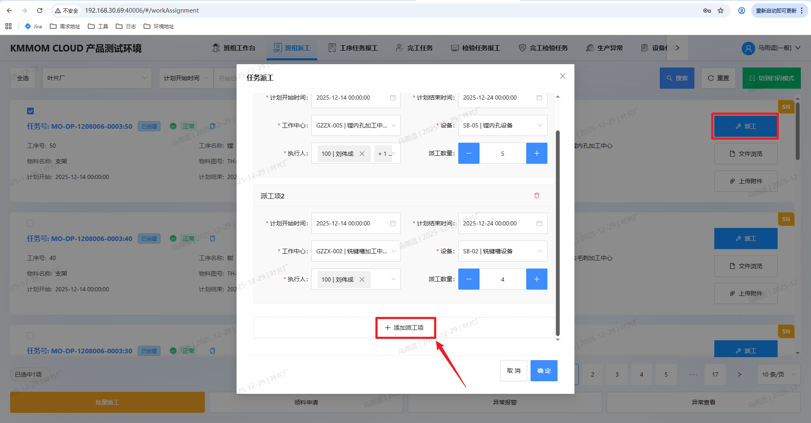
- 点击 **+** 号（添加派工项）将当前任务拆分。
- 系统会自动复制当前派工项内容生成新项，序号递增（如派工项1、派工项2）。
- **删除派工项**：点击派工项右上角的删除按钮可移除，但必须保留至少一个派工项。
- **注意**：所有派工项的“派工数量”之和必须等于原任务的计划数量。

#### 4. 辅助功能
除了常规派工外，班组派工界面还支持以下业务操作：

- **领料申请**：
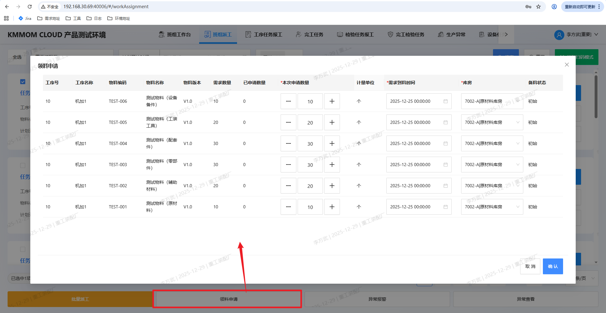
  - 选中一条或多条任务，点击底部的 **领料申请** 按钮。
  - 在弹出的“领料申请”窗口中，确认物料信息（物料编码、名称、需求数量等）。
  - 输入 **本次申请数量**，选择 **需求到料时间** 和 **库房**。
  - 点击 **确认** 提交申请，系统将自动生成领料单。

- **异常报警**：
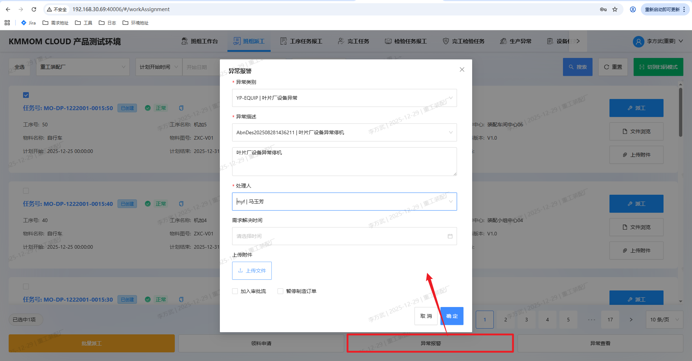
  - 若发现生产条件不满足（如设备故障、缺料），选中任务点击底部的 **异常报警** 按钮。
  - 在弹窗中填写 **异常类别**、**异常描述**、**处理人** 等信息。
  - 可上传附件（如现场照片），并选择是否“加入审批流”或“暂停制造订单”。
  - 点击 **确定** 发起报警，相关人员将收到异常通知。

- **异常查看**：
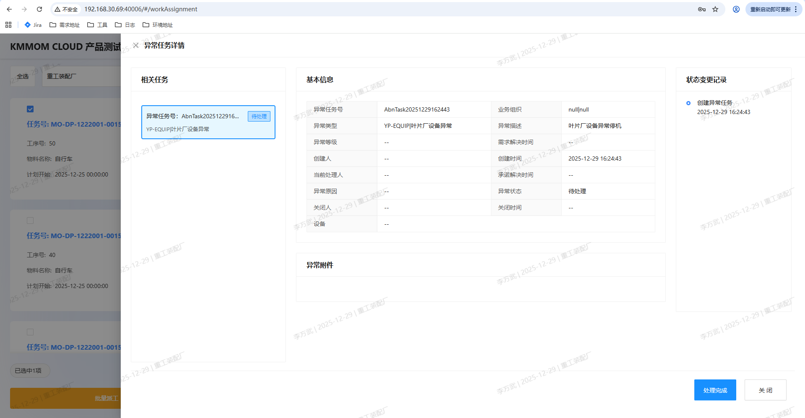
  - 选中任务点击底部的 **异常查看** 按钮。
  - 系统展示该任务关联的异常详情，包括异常类型、等级、处理状态及历史记录。
  - 支持查看异常附件和处理进度，点击 **处理完成** 或 **关闭** 可更新异常状态。

- **文件浏览**：
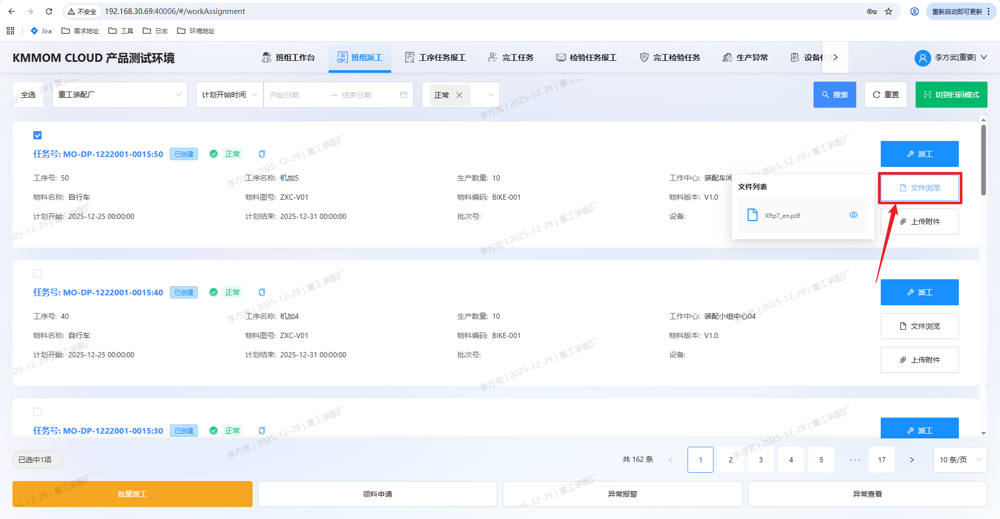
  - 点击任务列表右侧的 **文件浏览** 按钮。
  - 在弹出的“文件列表”窗口中，查看该任务关联的工艺文档、图纸等文件。
  - 支持预览 PDF、图片等格式文件，辅助现场作业。

- **上传附件**：
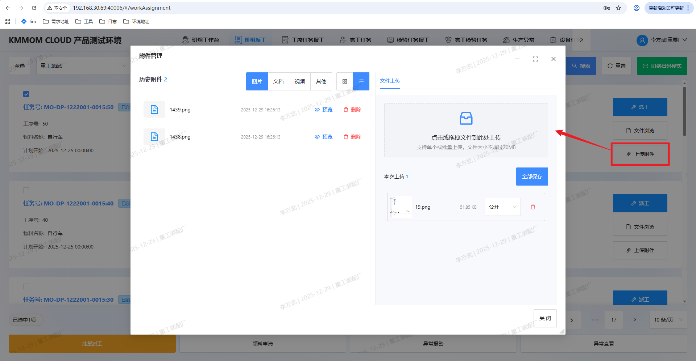
  - 点击任务列表右侧的 **上传附件** 按钮。
  - 在“附件管理”弹窗中，点击 **文件上传** 区域，或直接拖拽文件到指定区域。
  - 支持上传图片、文档、视频等多种格式，单次可上传多个文件（大小不超过 20MB）。
  - 上传成功后，点击 **全部保存** 完成操作。

### 业务规则与逻辑

#### 校验规则
1. **状态限制**：状态为 **已暂停**、**已终止**、**已派工** 的任务不允许进行派工操作。
2. **批量校验**：
   - 若选中任务中包含不可派工的任务，系统会提示：“以下任务因 [原因] 未能派工... 是否继续？”
   - 点击“是”则继续对其他任务进行派工；点击“否”则取消操作。
3. **参数校验**：
   - 派工数量必须为正整数。
   - 派工时间必须符合逻辑（结束时间晚于开始时间）。
   - 任务分割时，各分项数量之和必须严格等于任务计划数量。

#### 派工结果处理
1. **无分割派工**：
   - 更新制造任务状态为 **已派工**。
   - 更新派工状态为 **手工派工**。
   - 将执行人、设备、时间、工作中心等信息回写至制造任务。
2. **有分割派工**：
   - 系统自动创建子任务（编码规则：父任务编码 + 两位流水号）。
   - 将派工信息分别保存至各子任务。
   - 父任务和子任务状态均更新为 **已派工**。
3. **批量处理反馈**：
   - 系统会反馈派工结果，显示成功和失败的任务数量及具体信息。
4. **任务下发**：
   - 任务派工成功后，系统会自动将任务推送至指定执行人的 **生产工作台** > **工序任务报工** 界面。
   - 执行人登录系统后，即可在“我的任务”列表中查看并执行该任务。

### 注意事项

- 派工时请务必确认执行人的当前负载，避免任务堆积。
- 若任务需要特定设备资质，请确保指派的员工具备相应资格。
- 批量派工操作一旦确认，不支持撤销，请谨慎核对信息。

---

## 3. 工序任务报工

工序任务报工是一线员工日常工作的核心界面，支持任务的接收、开工、报工、物料管理及异常处理等全流程操作。

### 核心功能

- **任务执行**：支持开工、报工、待定报工及任务协调。
- **批量操作**：支持批量开工、批量报工和批量协调，提高操作效率。
- **物料管理**：集成领料申请、收料确认及物料装入功能。
- **质量与文档**：支持质量填报、工艺文件浏览及附件上传。
- **异常管理**：支持快速发起异常报警及查看异常处理进度。

### 操作指南

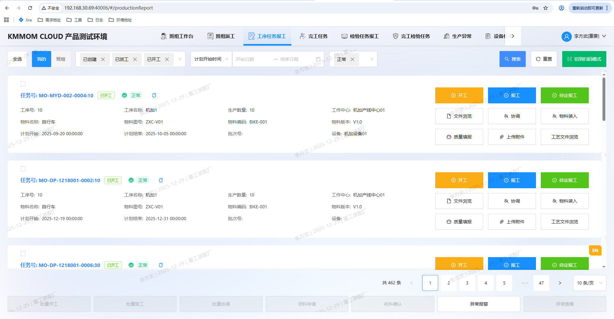

#### 1. 任务筛选与查询
- **视图切换**：点击左上角 **我的** / **班组** 切换个人任务或班组任务。
- **状态筛选**：通过 **已创建**、**已派工**、**已开工** 等标签快速筛选任务。
- **高级查询**：支持按计划开始时间、工单号等条件进行检索。

#### 2. 任务开工（单个/批量）

任务开工是生产执行的第一步，系统支持对单个或多个任务进行开工操作，并内置了严格的校验逻辑以确保生产顺序的正确性。

**操作步骤**：
1. **选择任务**：在任务列表中勾选一个或多个制造任务。
2. **点击开工**：
   - **单个开工**：点击任务卡片右侧的 **开工** 按钮。
   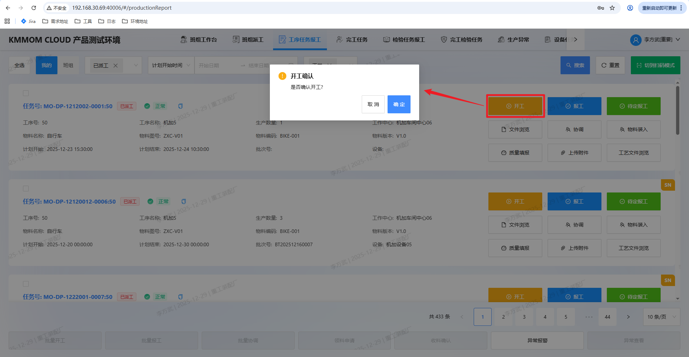
   - **批量开工**：勾选多个任务后，点击底部的 **批量开工** 按钮。
   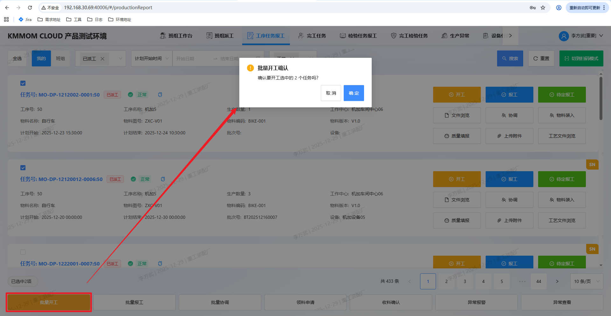
3. **确认操作**：在弹出的提示框“是否确认开工？”中点击 **确定**。
4. **查看结果**：
   - 若校验通过，系统提示操作成功，任务状态更新为 **已开工**。
   - 若校验失败（如前置工序未完成），系统将反馈具体失败原因（批量操作时支持部分成功）。

**校验规则与逻辑**：
- **默认校验**：
  - 状态为 **已暂停**、**已终止**、**已开工** 的任务不允许再次开工。
  - **已创建** 和 **已派工** 状态的任务均可直接开工（已创建任务开工时自动跳过派工环节）。
- **动态校验（工艺路线约束）**：
  - 系统会根据配置的工艺约束类型（SSEE 或 ES）自动检查上道工序状态：
    - **SSEE（Start-Start）**：要求上道工序 **已开工**，本工序才允许开工。
    - **ES（End-Start）**：要求上道工序 **已完工**，本工序才允许开工。
  - 若不满足约束条件，系统将拦截开工请求并提示原因。

**开工后续处理**：
- **状态更新**：
  - 更新 **制造任务** 状态为 **已开工**，并记录实际开始时间。
  - 级联更新关联的 **制造订单** 和 **生产订单** 业务状态为 **已开工**（若尚未开工）。

#### 3. 任务报工（单个/批量）

任务报工是生产进度的核心反馈环节，支持无序列号报工、有序列号报工及批量报工，系统根据业务配置自动校验并处理报工逻辑。

**操作步骤**：
1. **选择任务**：
   - **单个报工**：点击任务卡片右侧的 **报工** 按钮。
    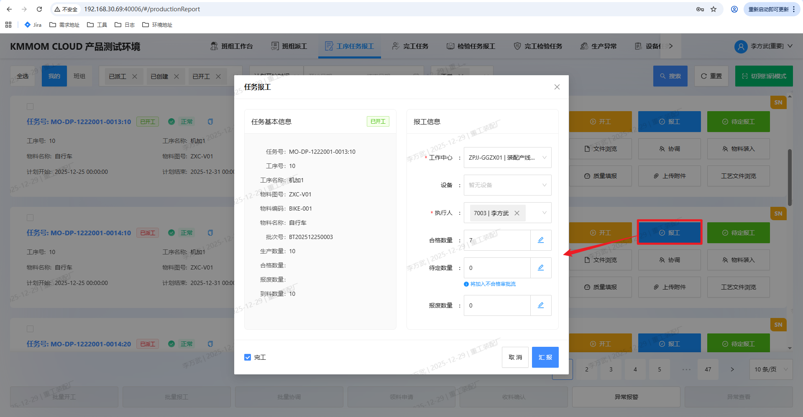
   - **批量报工**：勾选多个任务后，点击底部的 **批量报工** 按钮。
    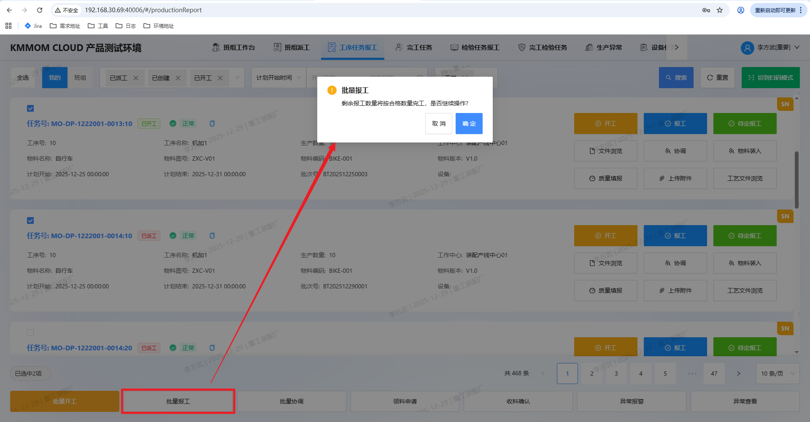
2. **填写报工信息**（系统弹出“任务报工”窗口）：
   - **基本信息**：自动显示任务号、物料、工序等基础信息。
   - **报工参数**：
     - **工作中心**（必填）：默认为制造任务分派的工作中心，支持编辑。
     - **设备**：若工作中心类型为“设备”，则必填；下拉仅显示该工作中心下的设备。
     - **执行人**（必填）：默认为分派的执行人或当前用户；支持多选。
   - **汇报项与数量**：
     - **无序列号报工**：直接输入 **合格数量** 和 **不合格数量**（支持小数）。
    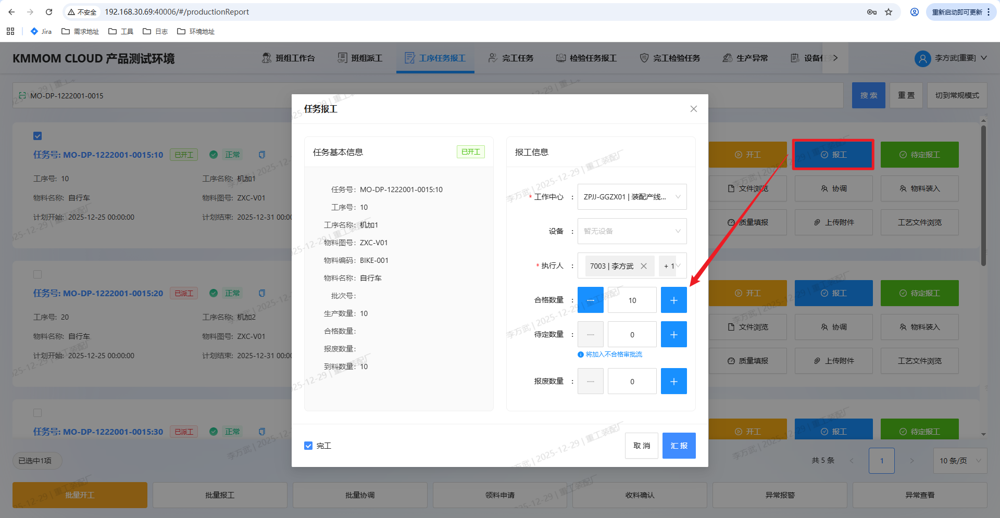
     - **有序列号报工**：点击数量输入框旁的 **选择序列号** 按钮，勾选已完成的序列号，系统自动计算数量填入（数量只读）。
    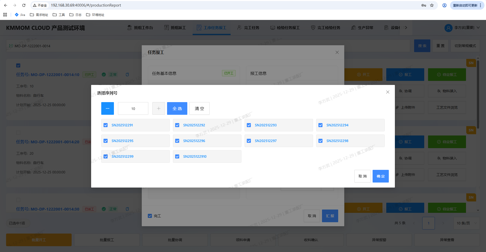
   - **完工标记**：若任务全部完成，勾选底部 **完工** 复选框。
   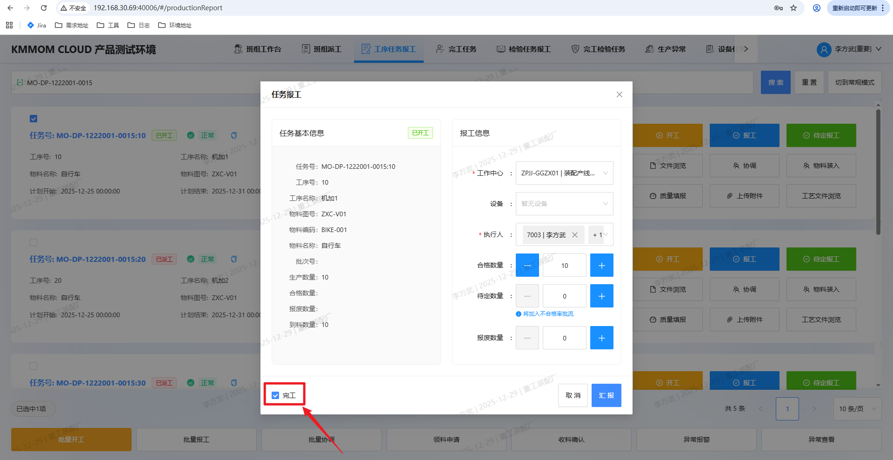
3. **提交确认**：点击 **汇报** 按钮提交。
   - **批量报工提示**：若进行批量报工，系统将提示“剩余报工数量将按合格数量完工”，点击 **确定** 继续。

**校验规则与逻辑**：
- **前置校验**：
  - 状态为 **已暂停**、**已终止**、**已完工** 的任务不允许报工。
  - 批量操作时支持部分成功，校验失败的任务将自动跳过并提示原因。
- **汇报项动态获取**：
  - 系统按照 **工作中心级 > 组织级 > 父组织级** 的顺序逐级查找“制造任务汇报项配置”，若未配置将提示错误。
- **完工校验（勾选“完工”时触发）**：
  - **默认规则**：已暂停/终止/完工的任务不可再次完工。
  - **动态约束**：系统读取“制造任务完工约束”配置，检查是否满足完工条件（如质量检验是否通过）。

**报工后续处理**：
- **序列号流转**：
  - 根据产出比生成下道工序序列号（新序列号 = 原序列号 - 流水号）。
  - 若无产出比，下道工序序列号保持不变。
- **状态更新**：
  - 更新 **制造任务** 的实际结束时间。
  - 若勾选完工且校验通过，更新业务状态为 **已完工**。

#### 4. 任务协调

任务协调用于在任务分派后调整执行计划，支持对计划时间、工作中心、设备及执行人进行重新指定。支持对单个或多个任务进行批量协调。

**操作步骤**：
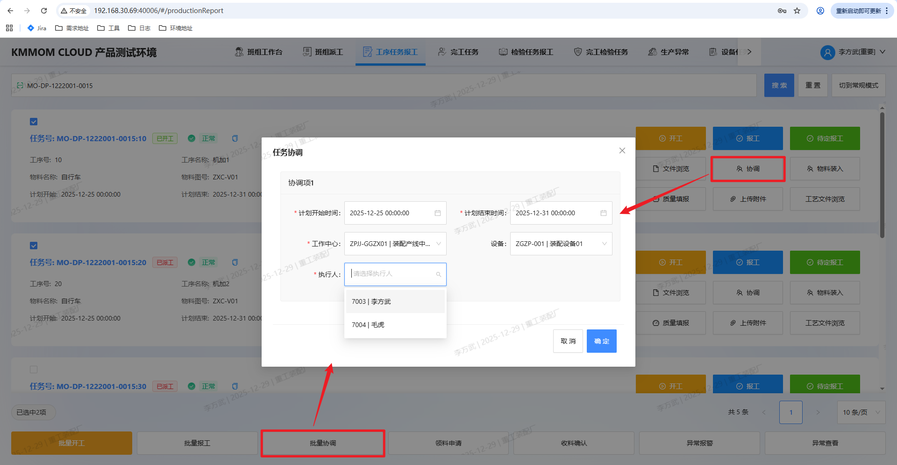
1. **选择任务**：在“工序任务报工”列表中，勾选一个或多个制造任务。
2. **触发协调**：点击列表上方的 **任务协调** 按钮（或批量操作栏中的 **批量协调**）。
3. **填写协调信息**（系统弹出“任务协调”窗口）：
   - **计划开始/结束时间**（必填）：默认显示排程结果时间；若无排程，显示原制造任务计划时间。
   - **工作中心**（必填，单选）：
     - 下拉选择当前用户所属工厂下的工作中心。
     - 默认优先显示排程资源的工作中心。
   - **设备**（条件必填，单选）：
     - 若所选工作中心类型为“设备”，则此项必填。
     - 下拉显示该工作中心下的所有设备。
   - **执行人**（必填，多选）：下拉显示所选工作中心和设备下的关联人员（自动去重）。
4. **提交确认**：点击 **确定** 按钮，系统将更新任务属性及归属组织。

**校验规则与逻辑**：
- **状态限制**：
  - 状态为 **已暂停**、**已终止**、**未派工**、**已完工** 的任务不允许进行协调。
  - 若所有选中任务均校验失败，无法进入协调界面。
- **批量处理**：
  - 支持批量操作，部分校验失败的任务将被跳过，系统统一提示操作结果。
- **数据更新**：
  - 协调成功后，任务的 **计划时间**、**工作中心**、**设备**、**执行人** 及 **所属组织** 将被更新为协调后的值。

#### 5. 待定报工

待定报工主要用于**不合格品审理完成后的最终数量确认**。

**核心作用**：
- **审理结案**：在不合格审理完成后，将线下处理的待定数量，按照审理结论在系统中进行最终数量划分和结案，保证在制品账面数量与现场实物状态一致。

**操作步骤**：
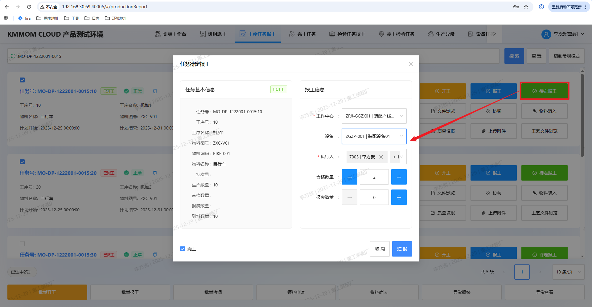
1. **选择任务**：在任务列表中勾选目标任务。
2. **点击待定报工**：点击任务卡片右侧或批量操作栏的 **待定报工** 按钮。
3. **填写信息**（系统弹出“任务待定报工”窗口）：
   - **基本信息**：自动显示任务号、物料、工序等。
   - **报工参数**：
     - **工作中心**、**设备**、**执行人**：默认为当前任务分派信息。
   - **待定数量**：输入本次汇报的待定数量（支持小数）。
4. **提交**：点击 **汇报** 按钮完成操作。

**业务逻辑说明**：
- **子件审理联动**：
  - 子件审理时，无论审理结论类型（合格/报废/返工/返修），审理完成后系统都会将数量写回到 **待定报工** 数量。
  - 用户需手动执行 **待定报工** 操作，将这部分数量划分为最终的合格或报废数量，以完成最终的数量处理。
  - **注意**：子件的不合格审理过程（如拆卸、重新装配、替换零件等）多在现场线下完成，系统中仅记录不合格审理结论。
- **关联功能**：
  - 关于不合格品审理的详细流程，详见 [不合格品审理](/view/04-核心模块/05-质量管理/03-不合格品.md)。

#### 6. 领料申请

领料申请是生产准备和执行过程中的关键环节，工序任务报工界面的领料申请一般由**操作者**发起，通常负责生产过程中的物料补领或分批领用。

**核心业务规则**：
- **角色分工**：
  - **计划员**：通常负责开工前亟须备齐的物料申请。
  - **操作者**：在工序任务报工界面发起，主要应对过程中的补领或分批需求。
- **流程流转**：申请提交后，系统自动生成 **出库申请单**，由仓储管理员进行后续出库操作。

**操作步骤**：
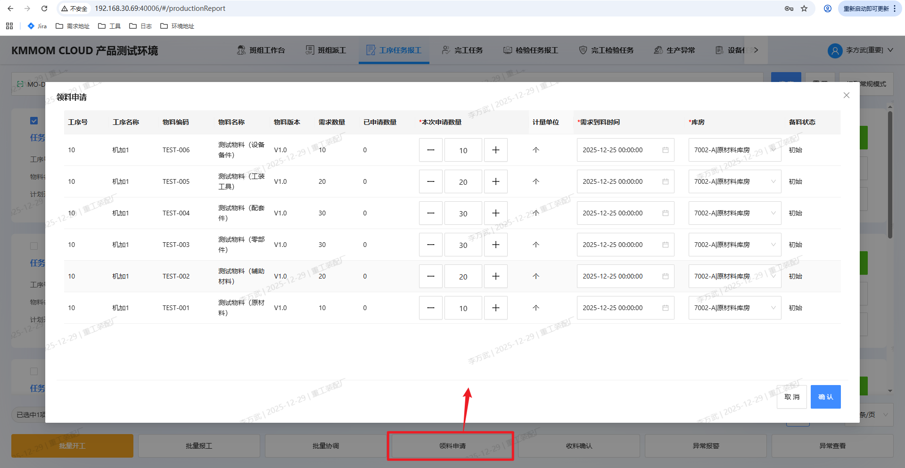
1. **选择任务**：在任务列表中勾选一条制造任务。
2. **发起申请**：点击底部批量操作栏的 **领料申请** 按钮。
3. **填写申请信息**（系统弹出“领料申请”窗口）：
   - **物料信息**：系统自动带出任务关联的物料编码、名称、需求数量及已申请数量。
   - **本次申请数量**：输入本次需要领用的数量。
   - **需求到料时间**：指定期望物料送达现场的时间。
   - **库房**：选择发料库房（支持自动带出默认值）。
4. **提交**：点击 **确认** 按钮完成申请。

**配置说明（库房默认值）**：
- **配置路径**：系统管理 > 业务配置 > 业务组织配置 > 仓储配置。
- **功能作用**：可为不同物料类别（如原材料、零部件）预设 **默认合格库房** 和 **默认废品库房**。配置后，领料申请界面将自动填充默认库房，提高操作效率。

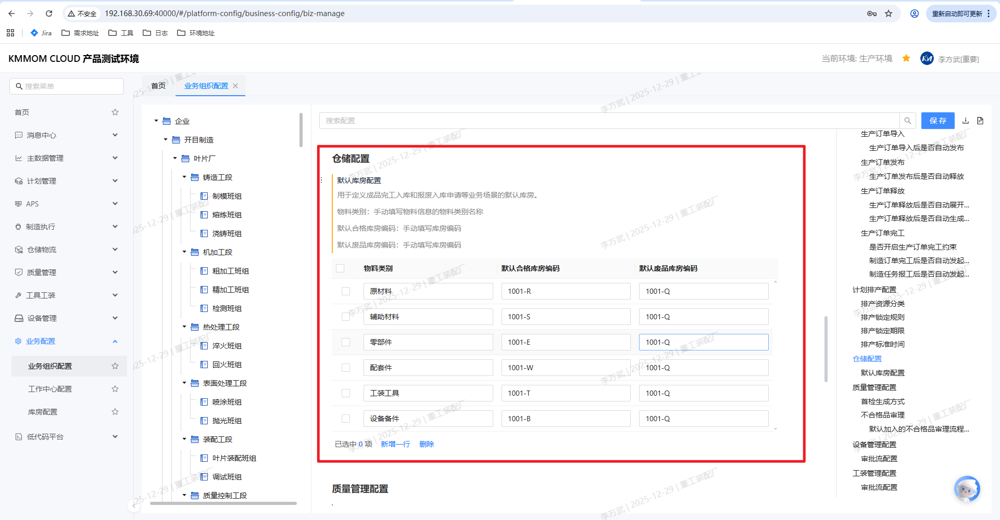

#### 7. 收料确认

收料确认是物料入库交接的关键环节。操作者在物料送达现场后，需在系统中对实际收到的物料进行核对与确认，确保账实一致。

**核心功能**：
- **输入业务对象**：物料准备计划。
- **输出业务对象**：收料确认明细表。
- **界面结构**：
  - **上方**：物料需求清单（展示任务关联的物料需求概况）。
  - **下方**：包含 **待收料** 和 **已收料** 两个页签。
    - **待收料**：展示工序号、工序名称、物料信息（编码/名称/版本）、待收料数量（对应出库数量）、已收料数量、本次收料数量（可编辑）、批次号/序列号、出库单信息（单号/人/时间）等。
    - **已收料**：展示实际收料的历史明细。

**操作步骤**：
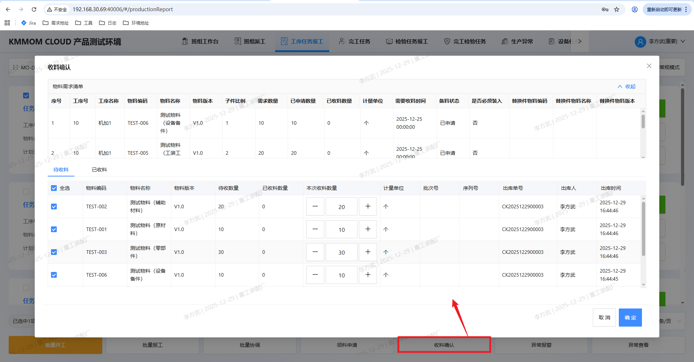
1. **选择任务**：在任务列表中勾选一个或多个制造任务（支持多选）。
2. **发起确认**：点击底部批量操作栏的 **收料确认** 按钮。
3. **核对与确认**（系统弹出“收料确认”窗口）：
   - **核对明细**：系统根据 **物料准备计划** 自动匹配出库单数据，过滤掉已收料确认的物料。
   - **录入数量**：在 **待收料** 列表中，核对并修改 **本次收料数量**。
     - **默认值**：等于关联出库单的出库数量。
     - **校验规则**：`0 ≤ 本次收料数量 ≤ (待收料数量 - 已收料数量)`。
4. **提交**：点击 **确定** 按钮。
   - 校验通过后，系统记录收料确认明细，并提示“推送成功”。
**业务逻辑说明**：
- **状态更新**：
  - **明细更新**：确认后，系统更新物料计划明细的 **已收料数量**（=原数量+本次收料数量）。
  - **备料状态**：若某物料的 `已收料数量 ≥ 需求数量`，系统更新该物料的备料状态为 **【已收料】**。
  - **计划状态**：当且仅当物料准备计划下的所有明细备料状态均为 **【已收料】** 时，系统将 **物料准备计划** 的状态更新为 **【备料完成】**。
- **特殊处理**：
  - **替换件**：若是替换件，系统会自动追溯原物料的明细表进行属性和状态更新。

#### 8. 物料装入

物料装入是对加工原料进行记录的关键操作，实现了物料使用过程的全程追溯。
**注意**：系统根据制造任务是否**存在序列号**，提供两种不同的操作界面。

**核心功能**：
- **装入模式**：支持 **有序列号装入** 和 **无序列号装入** 两种场景。
- **操作方式**：支持扫码装入、单个装入、批量装入及拆卸操作。
- **状态追踪**：实时展示产品序列号的装配状态（待装入/装入完成/部分装入）。

**界面结构与操作**：

##### 场景一：有序列号装入

适用于制造任务关联了具体产品序列号的场景。界面分为左侧（序列号列表）和右侧（装入操作区）两部分。

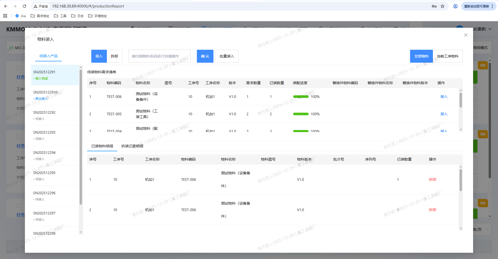

**1. 左侧区域：产品序列号与状态**
- **显示内容**：展示当前任务下的所有产品序列号及其装配状态。
- **状态说明**：
  - **待装入**：该序列号关联的物料计划中存在必须装入的物料，且尚未进行任何实物装入。
  - **装入完成**：该序列号关联的所有必须装入物料（含替换件）均已全部装入。
  - **部分装入**：介于“待装入”和“装入完成”之间的中间状态。

**2. 右侧区域：装入操作区**

- **A. 待装物料需求清单（右上）**
  - **联动显示**：点击左侧某个序列号，右上列表仅显示该序列号对应的物料需求。
  - **列表信息**：包含序号、物料编码/名称/图号/版本、需求数量、已装数量、已退数量、装配进度、替换件信息等。
    - **需求数量计算**：`需求数量 = 物料备料计划明细中的子件比例`。
    - **装配进度**：`已装数量 / 需求数量`。
  - **单个装入**：点击操作列的 **装入** 按钮。
    - **物料选择**：默认选中原件，支持切换为 **替换件物料**。
    - **录入信息**：编辑批次号、序列号（如有）及装入数量（必填，默认1）。
    - **校验规则**：
      - `0 < 装入数量 ≤ (需求数量 - 已装数量 - 已退数量)`。
      - 若指定了序列号，装入数量只能为 1。

- **B. 扫码与批量装入区（操作栏）**
  - **扫码操作**：
  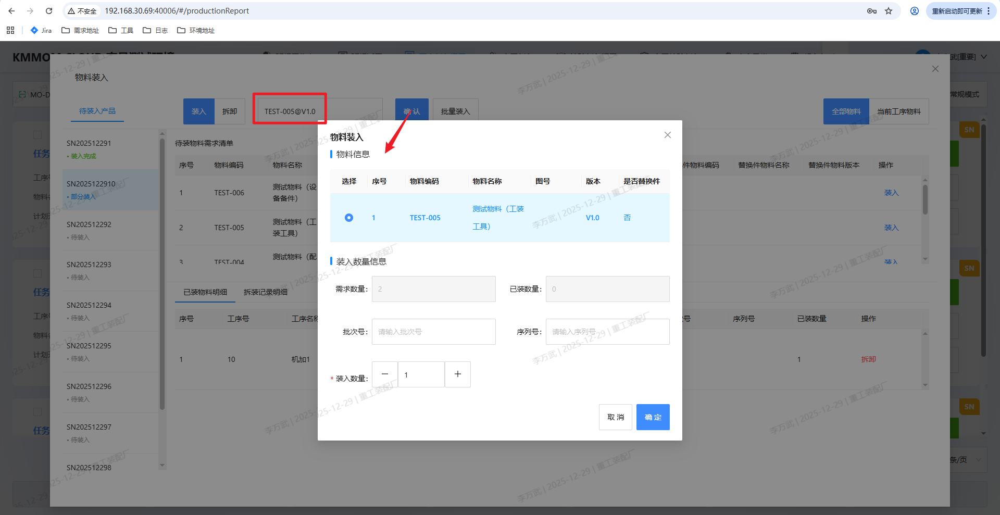
    - **操作类型**：支持切换 **装入** 或 **拆卸**。
    - **范围筛选**：默认 **全部物料**，可切换为 **当前工序物料**（按工序号过滤）。
    - **搜索/扫码**：扫描物料条码，系统按配置解析并自动执行装入/拆卸；若无配置则提示错误。
  - **批量装入**：
  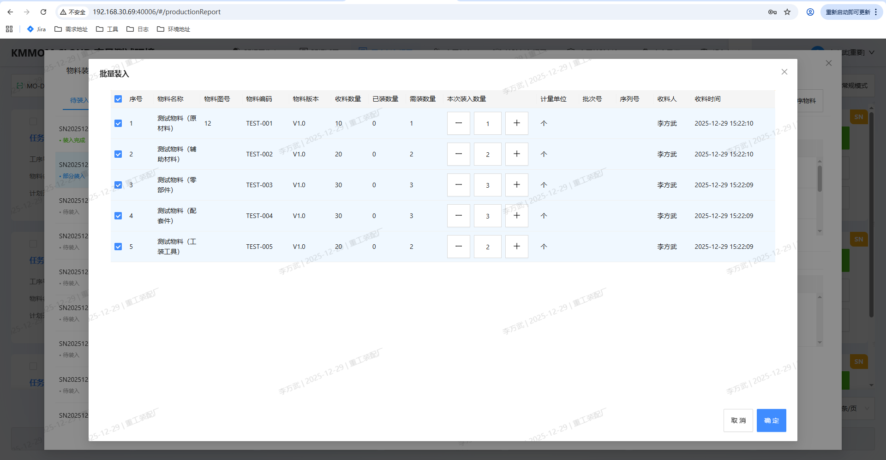
    - 点击 **批量装入** 按钮，弹出编辑网格。
    - **网格列**：物料基础信息、收料数量、已装/已退数量、本次装入数量（可编辑）、批次号、序列号等。
    - **本次装入数量**：`默认值 = 收料数量 - 已装数量`。
    - **校验规则**：`0 < 本次装入数量 ≤ (收料数量 - 已装数量 - 已退数量)`。
    - **数据源**：基于物料准备计划的已收料明细，结合实际装入记录动态计算已装数量。

- **C. 已装物料与拆装记录（右下）**
  - **已装物料明细**：
  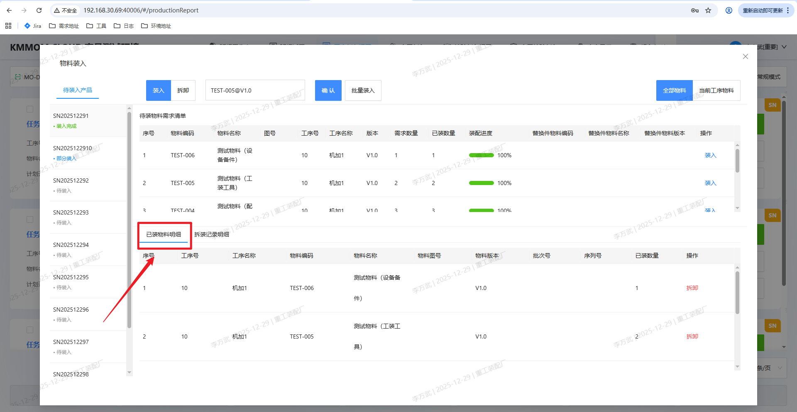
    - 展示已装入的物料详情（含批次/序列号、操作人、时间）。
    - **拆卸操作**：点击 **拆卸**，弹出二级弹窗。
      - 输入 **本次拆卸数量**（`0 < 数量 ≤ 已装数量`）和 **拆卸原因**（多行文本）。
  - **拆装记录明细**：
  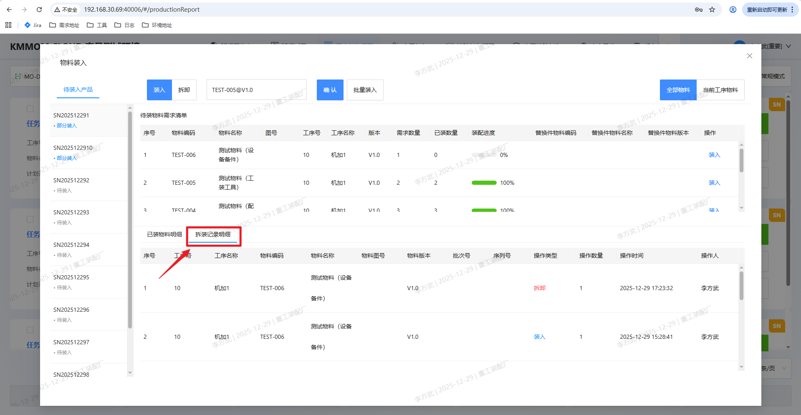
    - 完整记录装入和拆卸的操作流水（含操作类型、数量、时间、人员）。

##### 场景二：无序列号装入

适用于批量生产且不管理单件序列号的场景。

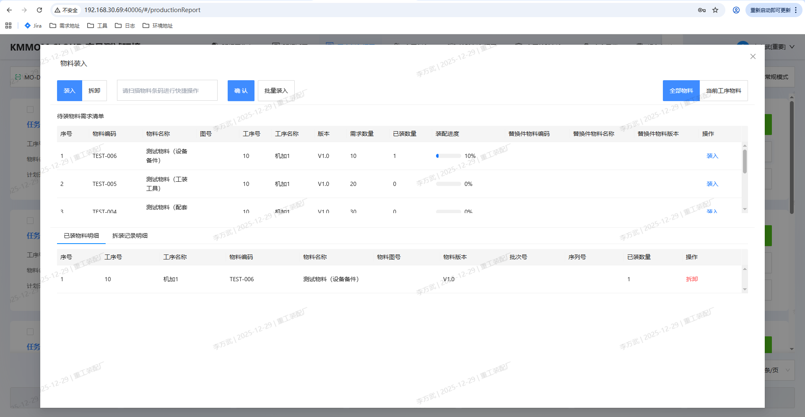

**界面结构**：

- **上方：待装物料需求清单**
  - 展示当前任务整体的物料需求情况。
  - **需求数量计算**：`需求数量 = 物料备料计划明细中的需求数量`。
  - 操作逻辑与有序列号场景一致（支持单个装入）。
- **下方：已装物料与拆装记录**
  - 展示整体已装入物料明细及操作记录。
- **操作功能**：同样支持扫码装入和批量装入（逻辑同上）。

#### 9. 其他任务操作

- **质量填报**：点击 **质量填报**，录入产品过程检验数据（如尺寸、外观等）。
- **文件/附件**：
  - **文件浏览**：查看任务关联的通用图纸或文档。
  - **工艺文件浏览**：查看特定的工艺指导书（SOP）。
  - **上传附件**：现场拍照或上传文件作为生产记录。
- **异常管理**：
  - **异常报警**：勾选任务发起设备、物料或质量异常呼叫。
  - **异常查看**：查看已发起的异常处理状态。

### 注意事项

- 只有 **已派工** 或 **已创建** 状态的任务才能进行开工操作。
- 遇到生产阻碍请立即发起异常报警，而不是等待任务延期。

---

## 4. 完工任务

完工任务模块用于查询个人或班组的历史完工记录，支持追溯报工详情。

### 核心功能

- **完工记录查询**：支持按时间段查询历史完工任务。
- **报工详情追溯**：查看每次报工的具体数量、时间、人员和质量数据。
- **定额工时分配**：支持对已完工任务的定额工时进行分配。
- **数据导出**：支持导出完工记录用于线下分析（如有配置）。

### 操作指南

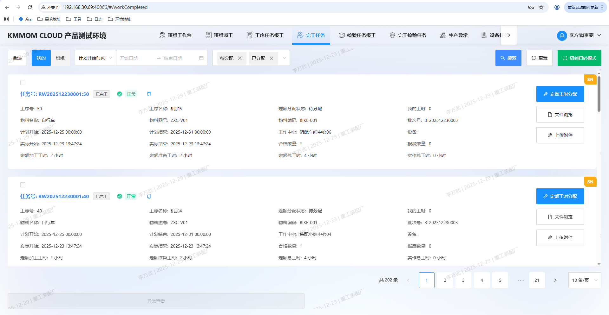

#### 1. 查询与查看
1. **查询记录**：
   - 进入 **生产工作台** > **完工任务**。
   - 选择查询范围（**我的** 或 **班组**）。
   - 设置 **完工时间** 范围（如本月），点击 **搜索**。
2. **查看详情**：
   - 在列表中查看任务的计划时间、实际开始/结束时间、定额工时等信息。
   - 关注 **合格数量** 和 **不合格数量**，确保数据准确。

#### 2. 定额工时分配
用于将定额工时分配给执行人，支持多人均分或按报工数量比例分配。
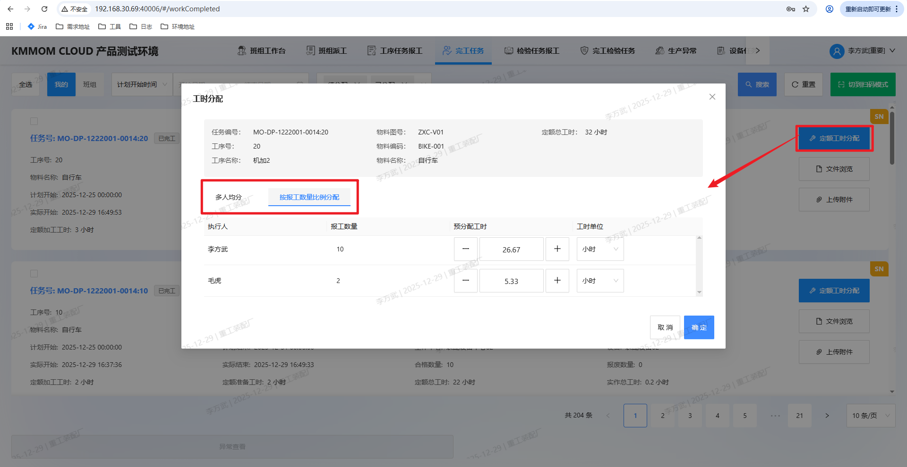
**操作步骤**：
1. **选择任务**：在完工任务列表中，找到待分配的任务。
2. **发起分配**：点击任务卡片右侧的 **定额工时分配** 按钮。
3. **选择规则**（系统弹出“工时分配”窗口）：
   - **多人均分**：按执行人平均分配，除不尽的余数由最后一人承担。
   - **按报工数量比例分配**：根据各执行人的实际报工数量占比进行分配。
4. **微调与提交**：
   - 如需人工干预，可手动微调各执行人的 **预分配工时**（必须为正数）。
   - 确认分配总和等于定额总工时后，点击 **确定** 保存。

### 注意事项

- **分配限制**：未完工、已暂停、已终止或已分配的任务不可再次分配。
- **数据修正**：完工任务仅供查询，不支持修改报工数据。如发现报工错误，请联系班组长或调度员进行处理。
- **工时核对**：建议定期核对完工记录与工时分配结果，确保个人绩效统计无误。
