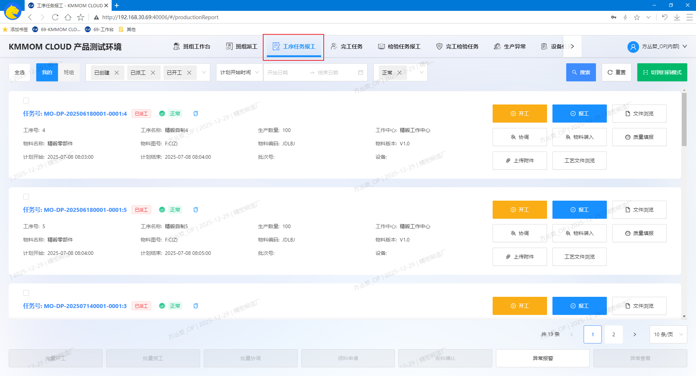
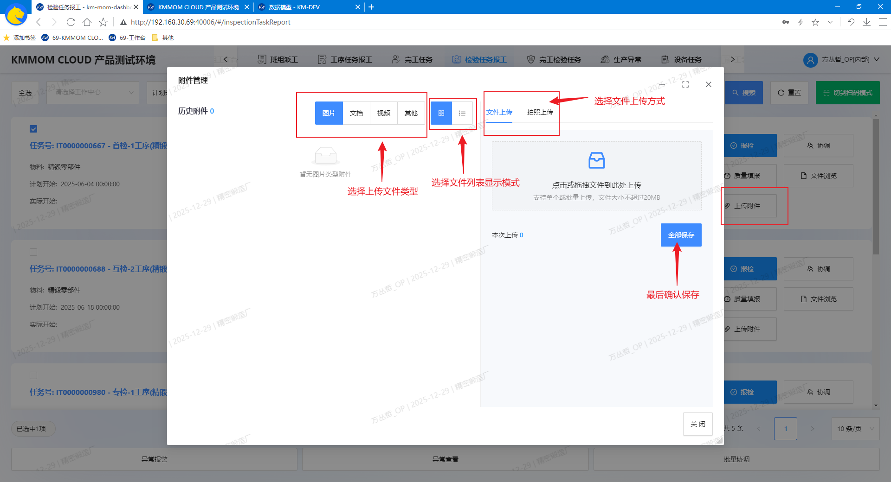
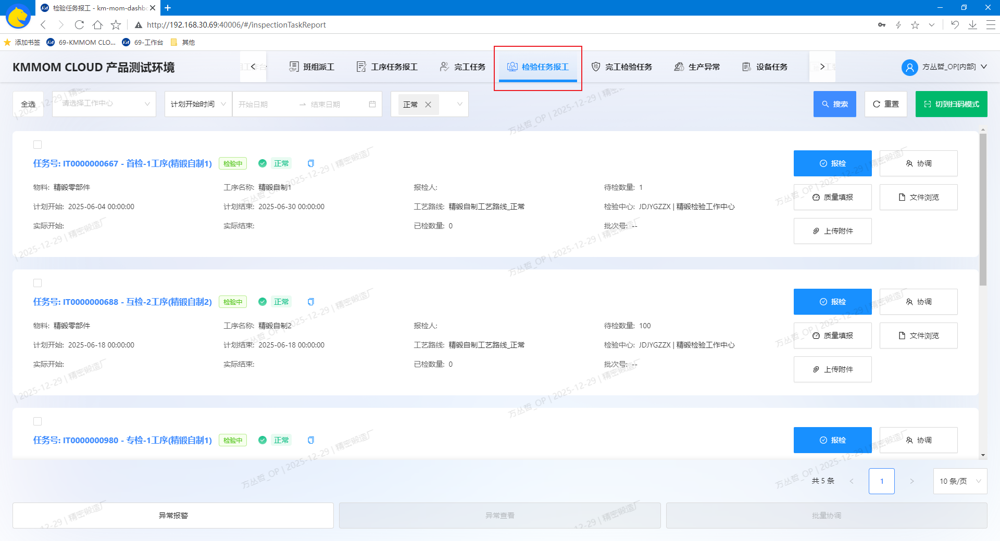
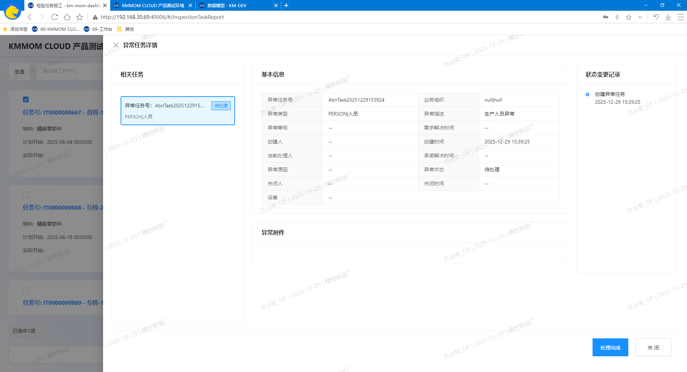

# 质量工作台

## 功能概述
质量工作台面向离散型制造企业的生产与检验场景，提供“工序任务报工”和“检验任务报工”两类页面，用于在任务执行现场快速完成质量数据的采集与提交。工序任务报工中的质量填报与检验任务质量填报一致，以保证数据口径统一。

## 核心功能
- **工序任务报工**：用于在生产过程中，对每个工序的任务进行质量数据的采集与提交。
- **检验任务报工**：检验过程中对检验任务进行跟踪：查询、协调、异常报警等，记录检验结果：报检、质量填报等。

## 操作指南

### 1. 工序任务报工
#### 1.1. 进入页面
1. 在工作台顶部导航栏点击 **工序任务报工**。

#### 1.2. 质量填报
1. 在列表定位目标任务卡片，点击右侧 **质量填报**，在弹窗中填写质量数据（参考文档： [检验任务](/view/04-核心模块/05-质量管理/02-检验任务.md) 下的 **4.2. 填写报检信息**）。

> **注意**：若未配置检验模板，无法进行质量填报，请联系质量员进行配置。

#### 1.3. 上传附件
1. 在任务卡片点击 **上传附件**，选择质量相关附件并上传；完成后可在任务明细中查看附件列表。

### 2. 检验任务报工
#### 2.1. 进入页面
1. 在工作台顶部导航栏点击 **检验任务报工**。

#### 2.1. 查询
1. 进入“检验任务报工”页面，默认显示常规模式，通过条件组合查询数据；可手动切换到扫码模式，通过检验任务号查询。

#### 2.2. 报检
1. 在列表定位目标任务卡片，点击右侧 **质量填报**，在弹窗中填写质量数据（参考文档： [检验任务](/view/04-核心模块/05-质量管理/02-检验任务.md) 下的 **4.2. 填写报检信息**）。

> **注意：**
> - 自检无需手动报检，系统会根据制造任务汇报自动完成
> - 除自检任务外，首检、互检、专检等检验任务需手动报检。

#### 2.3. 协调
1. 在列表定位目标任务卡片，点击右侧 **协调**，在弹窗中填写协调信息（参考文档： [检验任务](/view/04-核心模块/05-质量管理/02-检验任务.md) 下的 **7.2 任务协调操作步骤**）。

#### 2.4. 质量填报
1. 在列表定位目标任务卡片，点击右侧 **质量填报**，在弹窗中填写质量数据（参考文档： [检验任务](/view/04-核心模块/05-质量管理/02-检验任务.md) 下的 **4.2. 填写报检信息**）。

> **注意**：若未配置检验模板，无法进行质量填报，请联系质量员进行配置。

#### 2.5. 文件浏览
1. 前提条件：检验任务对应的工艺路线已上传相关技术文件
2. 在列表中定位目标任务卡片，点击右侧 **文件浏览**，弹出文件列表，可查看已上传的技术文件。

#### 2.6. 上传附件
参考 **1.3. 上传附件** 功能说明

#### 2.7 异常报警
1. 在列表中勾选一个或者多个任务卡片，点击底部 **异常报警**，在弹窗中填写异常信息（参考文档： [检验任务](/view/04-核心模块/05-质量管理/02-检验任务.md) 下的 **8.2 异常报警操作步骤**）。

#### 2.8. 异常查看
1. 在列表中勾选一个或多个任务卡片，点击底部 **异常查看**，弹出报检任务对应的异常任务列表弹窗，可查看异常任务详情并处理异常任务

> **注意**：仅可跟踪状态为未报检完成的报检任务的异常任务。

#### 2.9. 批量协调
1. 在列表中勾选一个或多个任务卡片，点击底部 **批量协调**，在弹窗中填写协调信息（参考文档： [检验任务](/view/04-核心模块/05-质量管理/02-检验任务.md) 下的 **7.2 任务协调操作步骤**）。

#### 2.10. 注意事项
- 检验任务应按照“过程质量标准”中配置的检验项顺序进行报检。
- 若检验任务中包含异常任务，应先处理异常任务后再进行报检。