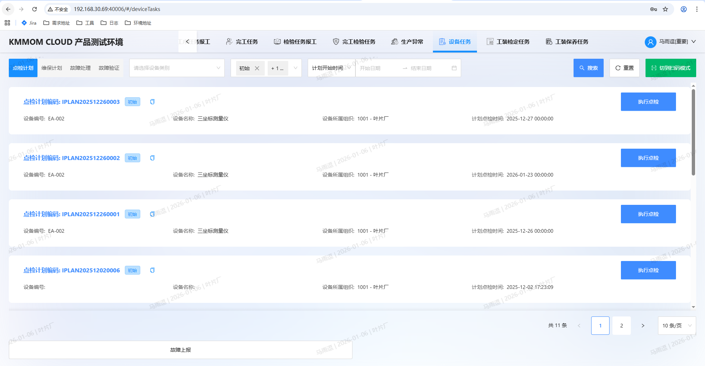
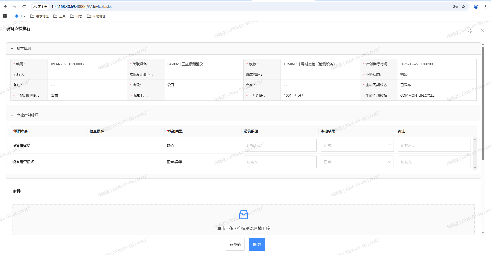
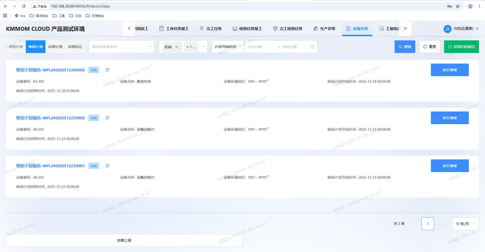
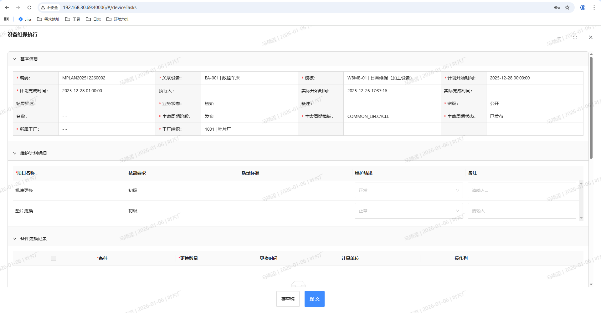
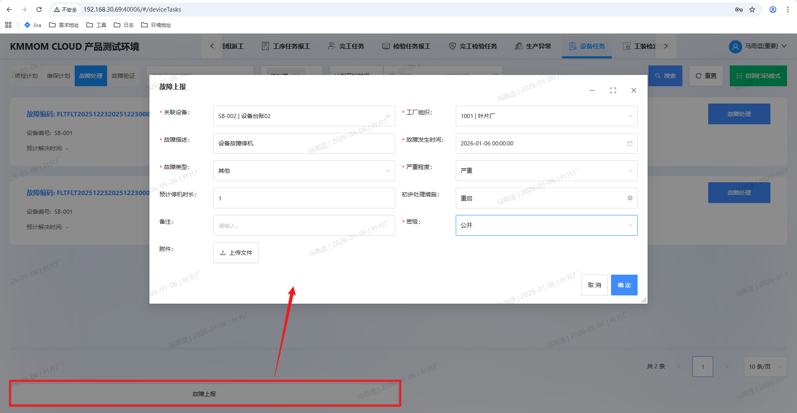
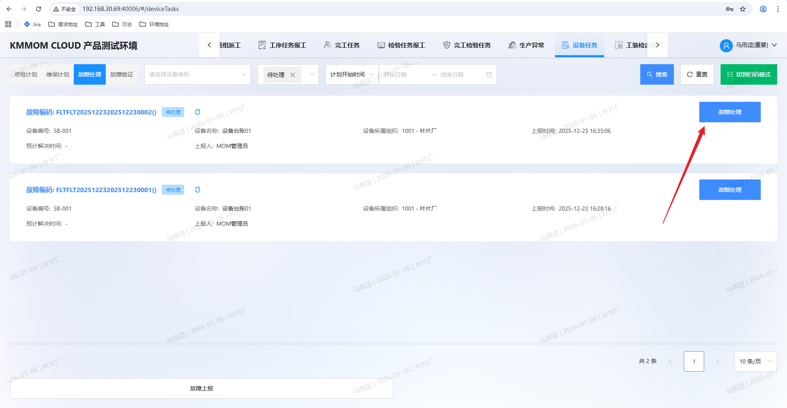
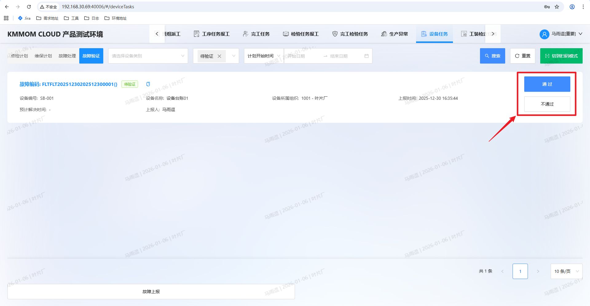

# 维修工作台

## 1. 功能概述
维修工作台是设备管理人员进行日常设备维护的核心作业场所。集中展示了需要执行的设备相关任务，包括点检计划、维保计划、故障处理及故障验证等。通过移动化或PC端的便捷操作，帮助维修人员高效完成设备运维工作，确保生产设备的稳定运行。

## 2. 设备任务

设备任务模块主要包含四个维度的任务管理：
*   **点检计划**：执行设备的日常或定期点检任务。
*   **维保计划**：执行设备的定期维护保养任务。
*   **故障处理**：处理设备突发的故障报修任务。
*   **故障验证**：对维修完成后的设备进行验证确认。

### 2.1 点检计划

#### 2.1.1 功能界面
进入“维修工作台 > 设备任务”页面，默认选中“点检计划”页签。
*   **业务场景**：适用于车间设备操作员或专职点检员，按照规定的周期（如每日、每周）和标准，对设备的关键部位（如油位、温度、异响等）进行例行检查，目的是早期发现潜在隐患，防止设备带病运行。
*   **查询筛选**：支持按设备类别、单据状态（如：已发布）、计划开始时间范围进行筛选。支持“重置”查询条件及“切换到扫码模式”（用于现场扫码执行）。
*   **任务列表**：展示待执行的点检计划卡片，包含计划编码、设备编号、设备名称、所属组织、计划点检时间等关键信息。
*   **快速操作**：每个任务卡片右侧提供“执行点检”按钮，点击即可开始任务。此外，页面底部提供“故障上报”入口，便于快速发起非计划性的故障报修。

#### 2.1.2 操作指南

**步骤1：进入执行页面**
在点检计划列表中，找到目标任务，点击“执行点检”按钮，系统弹出“设备点检执行”窗口。

**步骤2：填写点检明细**
在“点检计划明细”区域，根据预设的点检标准逐项检查：
*   **记录数值**：对于数值类型的检查项（如温度、压力），输入实际读数。
*   **点检结果**：对于判断类型的检查项（如是否磨损），选择“正常”或“异常”。
*   **备注**：如有特殊情况，可在备注栏进行说明。

**步骤3：上传附件（可选）**
如有现场照片或文档需要留档，可在“附件”区域点击上传或拖拽文件上传。

**步骤4：填写结果描述**
在“结果描述”文本域中，输入本次点检的总体情况说明。

**步骤5：提交或保存**
*   **存草稿**：如果任务未完成，可点击“存草稿”暂时保存当前进度，稍后继续执行。
*   **提交**：确认所有信息填写无误后，点击“提交”按钮，完成本次点检任务。提交后任务状态将更新，且不可再次修改。

### 2.2 维保计划

#### 2.2.1 功能界面
进入“维修工作台 > 设备任务”页面，点击切换至“维保计划”页签。
*   **业务场景**：适用于设备维修人员，根据设备保养手册或预防性维护策略，定期（如月度、季度、年度）对设备进行深度的清洁、紧固、润滑、调整或部件更换，以维持设备的最佳性能，延长使用寿命。
*   **任务列表**：展示待执行的维保计划卡片，信息包括计划编码、设备编号、设备名称、所属组织、计划开始时间等。
*   **执行操作**：点击任务卡片右侧的“执行维保”按钮，即可进入详细执行界面。

#### 2.2.2 操作指南

**步骤1：进入执行页面**
在维保计划列表中，点击目标任务的“执行维保”按钮，打开“设备维保执行”窗口。

**步骤2：确认基本信息**
查看“基本信息”区域，核对维保单号、关联设备、定规、计划开始时间等信息，确保操作对象无误。

**步骤3：填写维保计划明细**
在“维保计划明细”区域，根据预设的维保项目（如：传动模块、垫片更换等）进行操作并记录：
*   **维护结果**：选择“正常”或“异常”。
*   **备注**：输入具体的维护情况说明。

**步骤4：记录备件消耗（可选）**
如果在维保过程中消耗了备件，需在“备件消耗记录”区域进行登记：
*   **添加备件**：点击“引入备件”或“从BOM引入”按钮，选择使用的备件。
*   **填写数量**：输入实际消耗的备件数量。
*   **操作**：支持删除误添加的备件记录。

**步骤5：上传附件与描述**
*   **附件上传**：支持分别上传“保养前”和“保养后”的照片或文件，以便对比维保效果。
*   **结果描述**：在“结果描述”文本框中输入本次维保的总结性说明。

**步骤6：提交或保存**
*   **存草稿**：点击“存草稿”保存当前录入信息，便于后续继续处理。
*   **提交**：确认所有维护项及备件信息填写无误后，点击“提交”按钮，完成维保任务。

### 2.3 故障上报

#### 2.3.1 功能界面
进入“维修工作台 > 设备任务”页面，在页面的底部操作栏中，点击“故障上报”按钮。
*   **业务场景**：当设备发生突发故障（非计划内），且不在当前的点检或维保任务列表中时，可通过此入口主动发起报修，通知维修人员及时处理。

#### 2.3.2 操作指南

**步骤1：发起上报**
点击页面底部的“故障上报”按钮，系统弹出“故障上报”填写窗口。

**步骤2：填写故障信息**
在弹窗中录入详细的故障情况，带 "*" 号为必填项：
*   **基础信息**：
    *   **工厂组织**：选择故障设备所属的工厂区域。
    *   **关联设备**：从设备列表中选择发生故障的具体设备。
    *   **上报人员**：默认为当前登录用户，可根据实际情况调整。
    *   **上报时间/故障发生时间**：记录故障发现及发生的具体时间。
*   **故障详情**：
    *   **故障描述**：简要描述故障现象（如：异响、停机、漏油等）。
    *   **故障类型**：选择故障的分类（如：机械故障、电气故障等）。
    *   **严重程度**：评估故障的影响等级（一般/严重/紧急）。
    *   **预计停机时长**：预估维修所需的停机时间。
*   **处理建议（可选）**：
    *   **初步处理措施**：如有临时处置（如：紧急停机），可在此记录。
    *   **处理人/处理时间**：指派或记录初步处理的相关人员及时间。

**步骤3：上传附件**
点击“上传文件”按钮，上传故障现场的照片或视频证据，帮助维修人员快速判断问题。

**步骤4：提交上报**
确认所有信息填写无误后，点击“确定”按钮。
*   **结果**：系统将生成一条新的故障处理任务，并流转至“故障处理”列表，等待维修人员接单。

### 2.4 故障处理

#### 2.4.1 功能界面
进入“维修工作台 > 设备任务”页面，切换至“故障处理”页签。
*   **业务场景**：适用于设备维修工程师，接收到故障报修任务后，携带维修工具前往现场进行故障诊断、维修作业、更换备件等操作，并记录维修过程和结果，直至设备恢复正常。
*   **任务列表**：展示待处理的故障报修任务。卡片信息包含故障编码、设备编号、设备名称、上报时间、上报人及预计解决时间等。
*   **执行操作**：点击任务卡片右侧的“故障处理”按钮，进入故障维修执行界面。

#### 2.4.2 操作指南

**步骤1：进入执行页面**
在故障处理任务列表中，点击目标任务的“故障处理”按钮，系统弹出“设备故障处理”窗口。

**步骤2：查看基本信息**
在“基本信息”区域，仔细阅读故障描述、故障类型、严重程度及上报人员信息，了解故障背景。

**步骤3：记录备件消耗（可选）**
如维修过程中更换了零部件，需在“备件更换记录”区域进行登记：
*   **引入备件**：点击“引入备件”按钮，从备件库中选择所用配件。
*   **填写数量**：准确记录消耗数量。
*   **操作**：支持对已添加的记录进行删除。

**步骤4：上传附件**
*   **故障上报附件**：查看报修人上传的故障现场照片或视频。
*   **故障处理附件**：维修完成后，上传维修后的现场照片或凭证，作为处理依据。

**步骤5：记录工时与描述**
*   **工时消耗**：填写本次维修消耗的实际工时（单位：小时）。
*   **处理步骤描述**：详细记录故障排查过程、原因分析及具体的维修措施，形成维修知识沉淀。

**步骤6：提交或保存**
*   **存草稿**：暂存当前维修记录，以便稍后补充。
*   **提交**：确认维修工作已完成且信息填写无误后，点击“提交”按钮。提交后任务将流转至“故障验证”环节。

### 2.5 故障验证

#### 2.5.1 功能界面
进入“维修工作台 > 设备任务”页面，切换至“故障验证”页签。
*   **业务场景**：适用于设备使用部门负责人或生产班组长，在维修人员完成故障处理后，对设备的运行状态进行现场确认和验收。验证通过则设备恢复生产，不通过则退回重新维修，确保故障真正得到解决。
*   **任务列表**：展示待验证的故障维修任务。只有在“故障处理”环节提交的任务才会流转至此。
*   **执行操作**：列表右侧提供“通过”和“不通过”两个快捷操作按钮。

#### 2.5.2 操作指南

**步骤1：进入执行页面**
在故障验证任务列表中，找到需要验收的任务。

**步骤2：验证操作**
根据现场设备的实际修复情况，点击相应的按钮进行确认：
*   **验证通过**：
    *   点击“通过”按钮，系统弹出确认提示框。
    *   点击“确定”后，该故障任务流程结束。
    *   **结果**：设备台账状态将自动由“故障”更新为“再用”，设备恢复正常生产能力。
*   **验证不通过**：
    *   点击“不通过”按钮，系统弹出确认提示框。
    *   点击“确定”后，该任务将被驳回。
    *   **结果**：任务状态回退，需要维修人员重新进行“故障处理”。

## 3. 注意事项
1.  **及时性**：请务必在“计划点检时间”要求的时间窗口内完成点检，避免任务逾期影响设备考核。
2.  **准确性**：数值类记录请严格按照测量工具读数填写，确保数据真实反映设备状态，为后续设备分析提供依据。
3.  **异常处理**：若点检结果发现“异常”，建议在结果描述中详细说明，并及时发起故障报修流程，以免带病作业引发安全事故。
