# 生命周期状态模板定义文档

## 文档说明

**基本信息**
- 文档版本:v1.0 | 更新日期:2025-12-29 | 维护团队:产品研发团队
- 目标受众:产品研发团队

**文档定位**

本文档集中定义KMMOM3.x系统中所有生命周期状态模板,包括状态列表、状态流转图和流转规则,作为实现`LifecycleManaged`接口的数据模型的状态定义标准。数据模型定义时,在生命周期状态说明中引用模板编码即可(格式:`引用状态模板:模板编码`),无需重复定义状态列表。

---

## 一、WMS模块生命周期状态

### 入库申请单状态模板(IN_STORE_APPLY_BILL)

**模板编码:** `IN_STORE_APPLY_BILL` | **模板说明:** 入库申请单的生命周期状态定义

| 状态编码 | 状态名称 | 顺序 | 是否初始状态 | 是否终态 | 说明 |
|---------|---------|------|------------|---------|------|
| INS_010_NO | 待入库 | 1 | 是 | 否 | 申请单已创建,等待入库 |
| INS_020_PART | 部分入库 | 2 | 否 | 否 | 部分物料已入库 |
| INS_030_ALL | 全部入库 | 3 | 否 | 是 | 所有物料已入库 |

**状态流转图:**

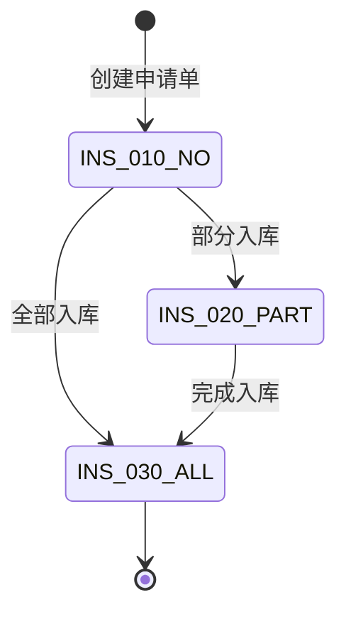

**状态流转规则:**

| 起始状态 | 目标状态 | 触发条件 | 说明 |
|---------|---------|---------|------|
| INS_010_NO | INS_020_PART | 部分物料入库 | 当部分物料完成入库时 |
| INS_010_NO | INS_030_ALL | 全部物料入库 | 当所有物料一次性完成入库时 |
| INS_020_PART | INS_030_ALL | 剩余物料入库 | 当剩余物料全部完成入库时 |

---

### 出库申请单状态模板(OUT_STORE_APPLY_BILL)

**模板编码:** `OUT_STORE_APPLY_BILL` | **模板说明:** 出库申请单的生命周期状态定义

| 状态编码 | 状态名称 | 顺序 | 是否初始状态 | 是否终态 | 说明 |
|---------|---------|------|------------|---------|------|
| OUTS_010_NO | 待出库 | 1 | 是 | 否 | 申请单已创建,等待出库 |
| OUTS_020_PART | 部分出库 | 2 | 否 | 否 | 部分物料已出库 |
| OUTS_030_ALL | 全部出库 | 3 | 否 | 是 | 所有物料已出库 |

**状态流转图:**

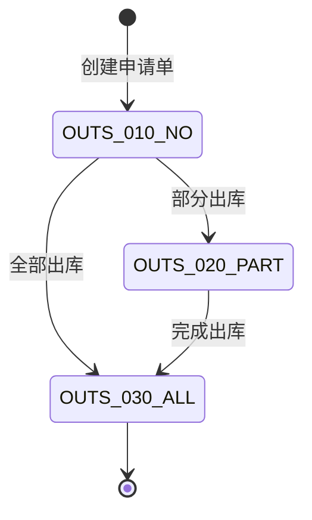

**状态流转规则:**

| 起始状态 | 目标状态 | 触发条件 | 说明 |
|---------|---------|---------|------|
| OUTS_010_NO | OUTS_020_PART | 部分物料出库 | 当部分物料完成出库时 |
| OUTS_010_NO | OUTS_030_ALL | 全部物料出库 | 当所有物料一次性完成出库时 |
| OUTS_020_PART | OUTS_030_ALL | 剩余物料出库 | 当剩余物料全部完成出库时 |

---

### 库存状态模板(INVENTORY)

**模板编码:** `INVENTORY` | **模板说明:** 库存的生命周期状态定义

| 状态编码 | 状态名称 | 顺序 | 是否初始状态 | 是否终态 | 说明 |
|---------|---------|------|------------|---------|------|
| STOCK_010_QUALIFIED | 合格 | 1 | 是 | 否 | 合格库存 |
| STOCK_030_SCRAPPED | 报废 | 2 | 否 | 是 | 报废库存 |

**状态流转图:**

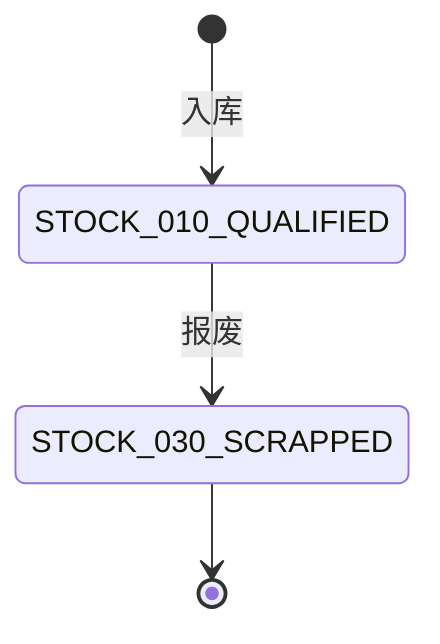

**状态流转规则:**

| 起始状态 | 目标状态 | 触发条件 | 说明 |
|---------|---------|---------|------|
| STOCK_010_QUALIFIED | STOCK_030_SCRAPPED | 报废操作 | 库存物料报废 |

---

### 盘点单状态模板(STORE_COUNT_BILL)

**模板编码:** `STORE_COUNT_BILL` | **模板说明:** 盘点单的生命周期状态定义

| 状态编码 | 状态名称 | 顺序 | 是否初始状态 | 是否终态 | 说明 |
|---------|---------|------|------------|---------|------|
| SCB_010_TO_CHECK | 待盘点 | 1 | 是 | 否 | 盘点单已创建,待盘点 |
| SCB_020_POSTED | 已过账 | 2 | 否 | 是 | 盘点结果已过账 |

**状态流转图:**

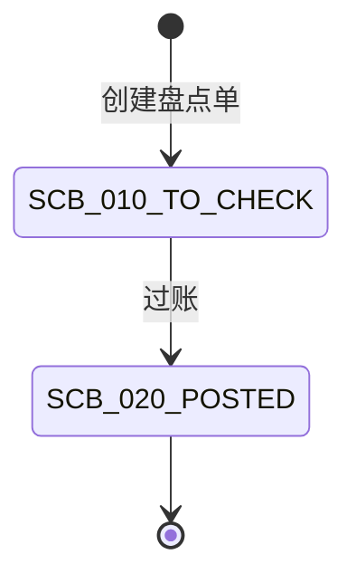

**状态流转规则:**

| 起始状态 | 目标状态 | 触发条件 | 说明 |
|---------|---------|---------|------|
| SCB_010_TO_CHECK | SCB_020_POSTED | 盘点完成过账 | 盘点结果审核通过并过账 |

---

## 二、EMS模块生命周期状态

### 设备台账状态模板(EQUIP_LEDGER)

**模板编码:** `EQUIP_LEDGER` | **模板说明:** 设备台账的生命周期状态定义

| 状态编码 | 状态名称 | 顺序 | 是否初始状态 | 是否终态 | 说明 |
|---------|---------|------|------------|---------|------|
| RS_010_RUNNING | 在用 | 1 | 是 | 否 | 设备正常运行中 |
| RS_020_STOPPED | 停机 | 2 | 否 | 否 | 设备临时停机 |
| RS_030_MAINTENANCE | 维护中 | 3 | 否 | 否 | 设备正在进行维护保养 |
| RS_040_FAULT | 故障 | 4 | 否 | 否 | 设备发生故障 |
| RS_050_SCRAPPED | 报废 | 5 | 否 | 是 | 设备已报废 |

**状态流转图:**

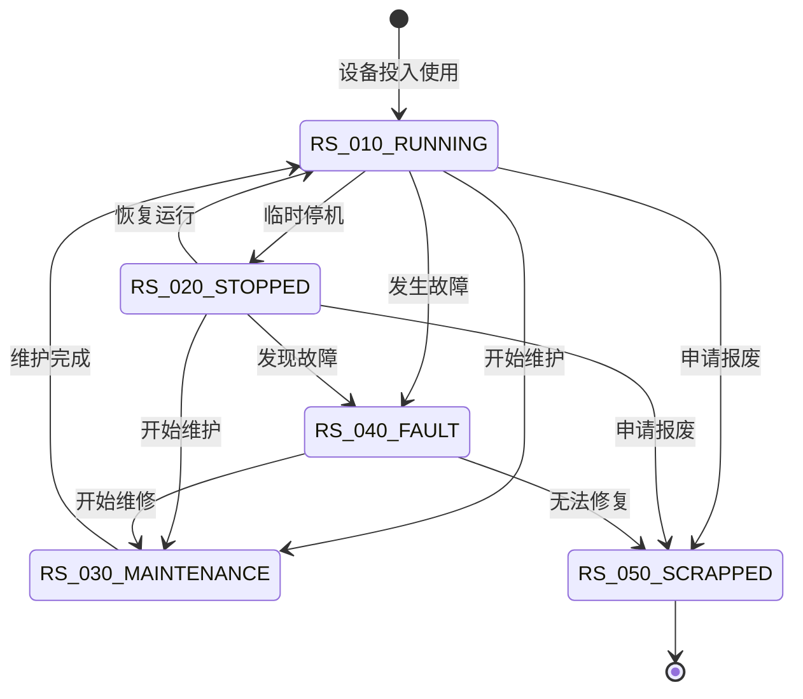

**状态流转规则:**

| 起始状态 | 目标状态 | 触发条件 | 说明 |
|---------|---------|---------|------|
| RS_010_RUNNING | RS_020_STOPPED | 手动停机 | 操作人员手动停机 |
| RS_010_RUNNING | RS_030_MAINTENANCE | 开始维护 | 进入维护保养流程 |
| RS_010_RUNNING | RS_040_FAULT | 故障上报 | 检测到设备故障 |
| RS_020_STOPPED | RS_010_RUNNING | 恢复运行 | 停机结束,恢复生产 |
| RS_020_STOPPED | RS_030_MAINTENANCE | 开始维护 | 利用停机时间进行维护 |
| RS_020_STOPPED | RS_040_FAULT | 发现故障 | 停机期间发现故障 |
| RS_030_MAINTENANCE | RS_010_RUNNING | 维护完成 | 维护保养完成并验收通过 |
| RS_040_FAULT | RS_030_MAINTENANCE | 开始维修 | 开始故障维修流程 |
| RS_040_FAULT | RS_050_SCRAPPED | 无法修复 | 故障无法修复,决定报废 |
| RS_010_RUNNING | RS_050_SCRAPPED | 报废申请通过 | 正常设备报废申请审批通过 |
| RS_020_STOPPED | RS_050_SCRAPPED | 报废申请通过 | 停机设备报废申请审批通过 |

---

### 设备故障单状态模板(EQUIP_FAULT)

**模板编码:** `EQUIP_FAULT` | **模板说明:** 设备故障单的生命周期状态定义

| 状态编码 | 状态名称 | 顺序 | 是否初始状态 | 是否终态 | 说明 |
|---------|---------|------|------------|---------|------|
| PS_010_CREATED | 已创建 | 1 | 是 | 否 | 故障单已创建 |
| PS_020_COMPLETED | 处理完成 | 2 | 否 | 否 | 故障已处理完成 |
| PS_030_CLOSED | 已关闭 | 3 | 否 | 是 | 故障单已关闭 |

**状态流转图:**

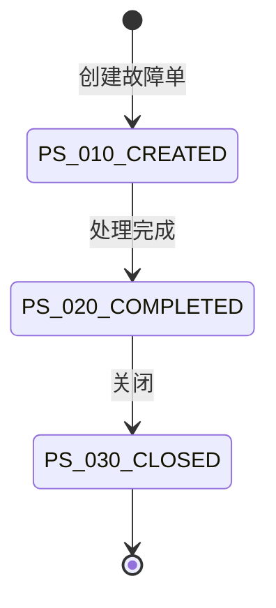

**状态流转规则:**

| 起始状态 | 目标状态 | 触发条件 | 说明 |
|---------|---------|---------|------|
| PS_010_CREATED | PS_020_COMPLETED | 故障处理完成 | 故障维修完成 |
| PS_020_COMPLETED | PS_030_CLOSED | 验收通过 | 故障处理验收通过,关闭单据 |

---

### 设备维保计划状态模板(EQUIP_MAINTENANCE_PLAN)

**模板编码:** `EQUIP_MAINTENANCE_PLAN` | **模板说明:** 设备维保计划的生命周期状态定义

| 状态编码 | 状态名称 | 顺序 | 是否初始状态 | 是否终态 | 说明 |
|---------|---------|------|------------|---------|------|
| ST_010_CREATED | 已创建 | 1 | 是 | 否 | 维保计划已创建 |
| ST_020_RELEASED | 已发布 | 2 | 否 | 否 | 维保计划已发布 |
| ST_030_COMPLETED | 已完成 | 3 | 否 | 是 | 维保已完成 |
| ST_040_CANCELLED | 已取消 | 4 | 否 | 是 | 维保计划已取消 |

**状态流转图:**

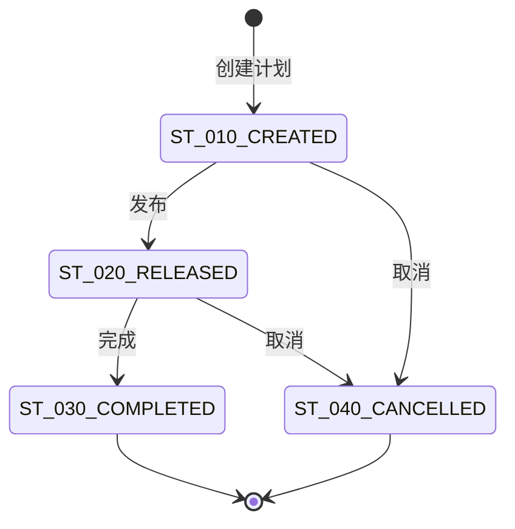

**状态流转规则:**

| 起始状态 | 目标状态 | 触发条件 | 说明 |
|---------|---------|---------|------|
| ST_010_CREATED | ST_020_RELEASED | 发布计划 | 维保计划审核通过并发布 |
| ST_010_CREATED | ST_040_CANCELLED | 取消计划 | 未发布的计划取消 |
| ST_020_RELEASED | ST_030_COMPLETED | 完成维保 | 维保工作完成并验收通过 |
| ST_020_RELEASED | ST_040_CANCELLED | 取消计划 | 已发布的计划取消 |

---

### 设备点检计划状态模板(EQUIP_INSPECTION_PLAN)

**模板编码:** `EQUIP_INSPECTION_PLAN` | **模板说明:** 设备点检计划的生命周期状态定义(与维保计划状态相同)

参见`EQUIP_MAINTENANCE_PLAN`(设备维保计划状态模板)。

---

## 三、TMS模块生命周期状态

### 工装台账状态模板(TOOLING_LEDGER)

**模板编码:** `TOOLING_LEDGER` | **模板说明:** 工装台账的生命周期状态定义

| 状态编码 | 状态名称 | 顺序 | 是否初始状态 | 是否终态 | 说明 |
|---------|---------|------|------------|---------|------|
| RS_001_CREATED | 已创建 | 1 | 是 | 否 | 工装台账已创建 |
| RS_010_AVAILABLE | 在库(可用) | 2 | 否 | 否 | 在库可用状态 |
| RS_020_IN_USE | 领用中 | 3 | 否 | 否 | 已领用使用中 |
| RS_030_BORROWED | 在库(借用中) | 4 | 否 | 否 | 借给他人使用中 |
| RS_040_CALIBRATING | 在库(检定中) | 5 | 否 | 否 | 检定中 |
| RS_050_MAINTAINING | 在库(保养中) | 6 | 否 | 否 | 保养中 |
| RS_060_REPAIRING | 在库(维修中) | 7 | 否 | 否 | 维修中 |
| RS_070_PENDING_STORAGE | 在库(待封存) | 8 | 否 | 否 | 待封存 |
| RS_080_STORED | 在库(已封存) | 9 | 否 | 否 | 已封存 |
| RS_090_PENDING_UNSTORAGE | 在库(待启封) | 10 | 否 | 否 | 待启封 |
| RS_100_PENDING_DISPOSAL | 在库(待处置) | 11 | 否 | 否 | 待处置 |
| RS_110_PENDING_SCRAP | 在库(待报废) | 12 | 否 | 否 | 待报废 |
| RS_120_SCRAPPED_IN_STORAGE | 在库(已报废) | 13 | 否 | 是 | 在库已报废 |
| RS_130_PENDING_TRANSFER | 在库(待调拨) | 14 | 否 | 否 | 待调拨 |
| RS_140_TRANSFERRED | 已调拨 | 15 | 否 | 是 | 已调拨 |
| RS_150_SCRAPPED | 已报废 | 16 | 否 | 是 | 已报废 |

**状态流转图:**

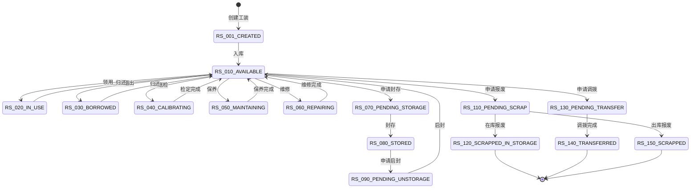

**状态流转规则:**

| 起始状态 | 目标状态 | 触发条件 | 说明 |
|---------|---------|---------|------|
| RS_001_CREATED | RS_010_AVAILABLE | 入库操作 | 新建工装入库 |
| RS_010_AVAILABLE | RS_020_IN_USE | 领用操作 | 工装被领用 |
| RS_010_AVAILABLE | RS_030_BORROWED | 借用操作 | 工装被借出 |
| RS_020_IN_USE | RS_010_AVAILABLE | 归还操作 | 领用归还 |
| RS_030_BORROWED | RS_010_AVAILABLE | 归还操作 | 借用归还 |
| RS_010_AVAILABLE | RS_040_CALIBRATING | 送检操作 | 工装送检定 |
| RS_040_CALIBRATING | RS_010_AVAILABLE | 检定完成 | 检定完成入库 |
| RS_010_AVAILABLE | RS_050_MAINTAINING | 保养操作 | 工装保养 |
| RS_050_MAINTAINING | RS_010_AVAILABLE | 保养完成 | 保养完成入库 |
| RS_010_AVAILABLE | RS_060_REPAIRING | 维修操作 | 工装维修 |
| RS_060_REPAIRING | RS_010_AVAILABLE | 维修完成 | 维修完成入库 |
| RS_010_AVAILABLE | RS_070_PENDING_STORAGE | 封存申请 | 申请封存 |
| RS_070_PENDING_STORAGE | RS_080_STORED | 执行封存 | 封存完成 |
| RS_080_STORED | RS_090_PENDING_UNSTORAGE | 启封申请 | 申请启封 |
| RS_090_PENDING_UNSTORAGE | RS_010_AVAILABLE | 执行启封 | 启封完成 |
| RS_010_AVAILABLE | RS_110_PENDING_SCRAP | 报废申请 | 申请报废 |
| RS_110_PENDING_SCRAP | RS_120_SCRAPPED_IN_STORAGE | 在库报废 | 在库状态下报废 |
| RS_110_PENDING_SCRAP | RS_150_SCRAPPED | 出库报废 | 出库后报废 |
| RS_010_AVAILABLE | RS_130_PENDING_TRANSFER | 调拨申请 | 申请调拨 |
| RS_130_PENDING_TRANSFER | RS_140_TRANSFERRED | 调拨完成 | 调拨完成 |

---

### 工装借用单状态模板(TOOLING_BORROW_ORDER)

**模板编码:** `TOOLING_BORROW_ORDER` | **模板说明:** 工装借用单的生命周期状态定义

| 状态编码 | 状态名称 | 顺序 | 是否初始状态 | 是否终态 | 说明 |
|---------|---------|------|------------|---------|------|
| BO_010_PENDING_RETURN | 待归还 | 1 | 是 | 否 | 借用单已创建,待归还 |
| BO_020_PARTIALLY_RETURNED | 部分归还 | 2 | 否 | 否 | 部分工装已归还 |
| BO_030_FULLY_RETURNED | 全部归还 | 3 | 否 | 是 | 所有工装已归还 |
| BO_040_CANCELED | 已取消 | 4 | 否 | 是 | 借用单已取消 |

**状态流转图:**

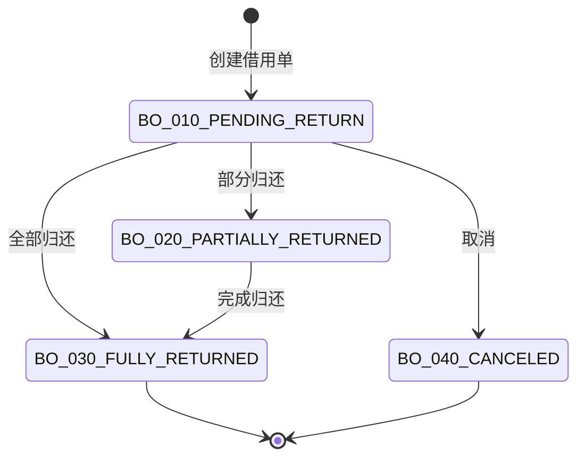

**状态流转规则:**

| 起始状态 | 目标状态 | 触发条件 | 说明 |
|---------|---------|---------|------|
| BO_010_PENDING_RETURN | BO_020_PARTIALLY_RETURNED | 部分归还 | 部分工装已归还 |
| BO_010_PENDING_RETURN | BO_030_FULLY_RETURNED | 全部归还 | 所有工装一次性归还 |
| BO_020_PARTIALLY_RETURNED | BO_030_FULLY_RETURNED | 完成归还 | 剩余工装全部归还 |
| BO_010_PENDING_RETURN | BO_040_CANCELED | 取消借用 | 借用单取消 |

---

## 四、MES模块生命周期状态

### 生产订单状态模板(PROD_ORDER)

**模板编码:** `PROD_ORDER` | **模板说明:** 生产订单的生命周期状态定义

| 状态编码 | 状态名称 | 顺序 | 是否初始状态 | 是否终态 | 说明 |
|---------|---------|------|------------|---------|------|
| PO_010_CREATED | 已创建 | 1 | 是 | 否 | 订单已创建 |
| PO_020_PUBLISHED | 已发布 | 2 | 否 | 否 | 订单已发布 |
| PO_030_EXPANDED | 已展开 | 3 | 否 | 否 | 订单已展开成制造订单 |
| PO_040_RELEASED | 已释放 | 4 | 否 | 否 | 订单已释放 |
| PO_050_STARTED | 已开工 | 5 | 否 | 否 | 订单已开工 |
| PO_060_FINISHED | 已完工 | 6 | 否 | 否 | 订单已完工 |
| PO_070_CLOSED | 已关闭 | 7 | 否 | 是 | 订单已关闭 |

**状态流转图:**

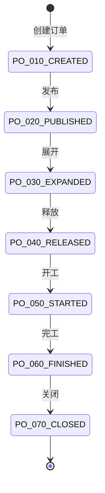

**状态流转规则:**

| 起始状态 | 目标状态 | 触发条件 | 说明 |
|---------|---------|---------|------|
| PO_010_CREATED | PO_020_PUBLISHED | 发布订单 | 订单审核通过并发布 |
| PO_020_PUBLISHED | PO_030_EXPANDED | 展开订单 | 订单展开成制造订单 |
| PO_030_EXPANDED | PO_040_RELEASED | 释放订单 | 订单释放到车间 |
| PO_040_RELEASED | PO_050_STARTED | 开工 | 订单开始生产 |
| PO_050_STARTED | PO_060_FINISHED | 完工 | 订单生产完成 |
| PO_060_FINISHED | PO_070_CLOSED | 关闭订单 | 订单入库后关闭 |

---

### 制造订单状态模板(MANU_ORDER)

**模板编码:** `MANU_ORDER` | **模板说明:** 制造订单的生命周期状态定义

| 状态编码 | 状态名称 | 顺序 | 是否初始状态 | 是否终态 | 说明 |
|---------|---------|------|------------|---------|------|
| MO_010_CREATED | 已创建 | 1 | 是 | 否 | 制造订单已创建 |
| MO_020_PUBLISHED | 已发布 | 2 | 否 | 否 | 制造订单已发布 |
| MO_030_EXPANDED | 已展开 | 3 | 否 | 否 | 展开成制造任务 |
| MO_040_SCHEDULED | 已排产 | 4 | 否 | 否 | 已排产 |
| MO_050_STARTED | 已开工 | 5 | 否 | 否 | 已开工 |
| MO_060_FINISHED | 已完工 | 6 | 否 | 否 | 已完工 |
| MO_070_STORED | 已入库 | 7 | 否 | 否 | 已入库 |
| MO_080_CLOSED | 已关闭 | 8 | 否 | 是 | 已关闭 |

**状态流转图:**

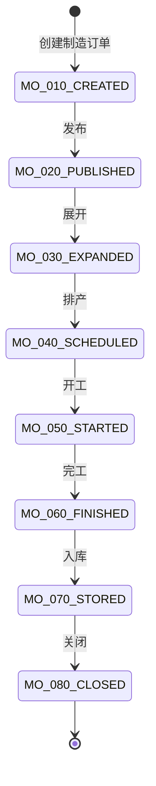

**状态流转规则:**

| 起始状态 | 目标状态 | 触发条件 | 说明 |
|---------|---------|---------|------|
| MO_010_CREATED | MO_020_PUBLISHED | 发布订单 | 制造订单发布 |
| MO_020_PUBLISHED | MO_030_EXPANDED | 展开订单 | 展开成制造任务 |
| MO_030_EXPANDED | MO_040_SCHEDULED | 排产 | APS排产完成 |
| MO_040_SCHEDULED | MO_050_STARTED | 开工 | 制造订单开工 |
| MO_050_STARTED | MO_060_FINISHED | 完工 | 制造订单完工 |
| MO_060_FINISHED | MO_070_STORED | 入库 | 完工产品入库 |
| MO_070_STORED | MO_080_CLOSED | 关闭 | 制造订单关闭 |

---

### 制造任务状态模板(MANU_TASK)

**模板编码:** `MANU_TASK` | **模板说明:** 制造任务的生命周期状态定义

| 状态编码 | 状态名称 | 顺序 | 是否初始状态 | 是否终态 | 说明 |
|---------|---------|------|------------|---------|------|
| MT_010_CREATED | 已创建 | 1 | 是 | 否 | 任务已创建 |
| MT_020_DISPATCHED | 已派工 | 2 | 否 | 否 | 任务已派工 |
| MT_030_CONFIRMED | 已确认 | 3 | 否 | 否 | 任务已确认 |
| MT_040_STARTED | 已开工 | 4 | 否 | 否 | 任务已开工 |
| MT_050_INSPECTED | 已送检 | 5 | 否 | 否 | 任务已送检 |
| MT_060_FINISHED | 已完工 | 6 | 否 | 是 | 任务已完工 |

**状态流转图:**

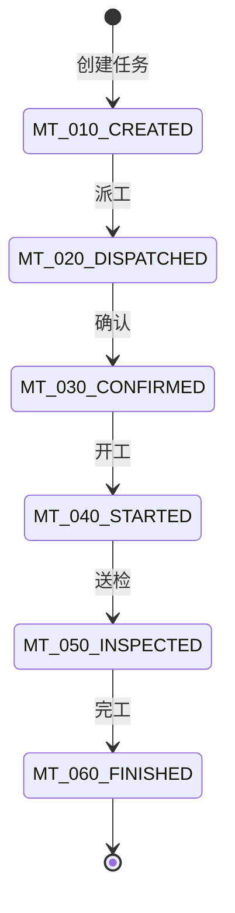

**状态流转规则:**

| 起始状态 | 目标状态 | 触发条件 | 说明 |
|---------|---------|---------|------|
| MT_010_CREATED | MT_020_DISPATCHED | 派工 | 任务派工到工作中心 |
| MT_020_DISPATCHED | MT_030_CONFIRMED | 确认 | 工作中心确认任务 |
| MT_030_CONFIRMED | MT_040_STARTED | 开工 | 任务开始执行 |
| MT_040_STARTED | MT_050_INSPECTED | 送检 | 任务送检 |
| MT_050_INSPECTED | MT_060_FINISHED | 完工 | 检验通过完工 |

---

### 检验任务状态模板(INSPECT_TASK)

**模板编码:** `INSPECT_TASK` | **模板说明:** 检验任务的生命周期状态定义

| 状态编码 | 状态名称 | 顺序 | 是否初始状态 | 是否终态 | 说明 |
|---------|---------|------|------------|---------|------|
| IT_100_CREATED | 已创建 | 1 | 是 | 否 | 检验任务已创建 |
| IT_200_PROCESS | 检验中 | 2 | 否 | 否 | 检验中 |
| IT_300_FINISHED | 已完工 | 3 | 否 | 是 | 检验完工 |
| IT_400_OBSOLETE | 已废弃 | 4 | 否 | 是 | 检验任务废弃 |

**状态流转图:**

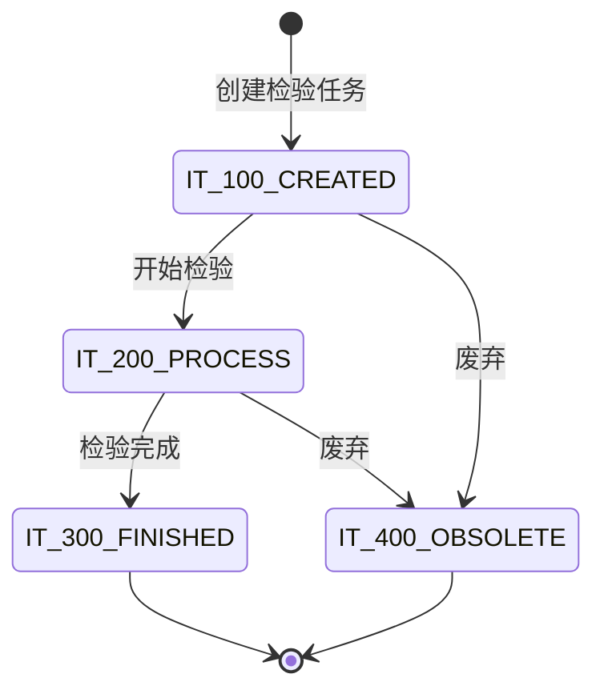

**状态流转规则:**

| 起始状态 | 目标状态 | 触发条件 | 说明 |
|---------|---------|---------|------|
| IT_100_CREATED | IT_200_PROCESS | 开始检验 | 检验员开始检验 |
| IT_200_PROCESS | IT_300_FINISHED | 检验完成 | 检验完成并录入结果 |
| IT_100_CREATED | IT_400_OBSOLETE | 废弃任务 | 检验任务作废 |
| IT_200_PROCESS | IT_400_OBSOLETE | 废弃任务 | 检验中作废 |

---

## 变更记录

| 日期 | 版本 | 变更内容 | 变更人 |
|-----|------|---------|--------|
| 2025-12-29 | v1.0 | 创建文档,定义主要模块生命周期状态模板 | 王晴 |
