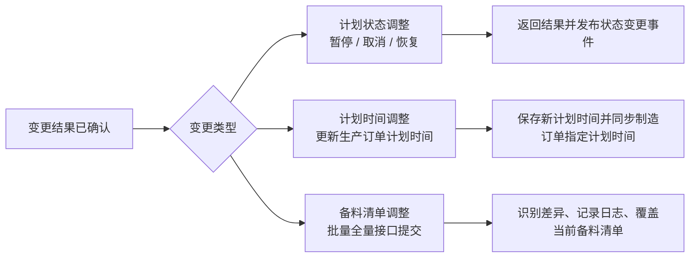

# DNW35112-变更管理-计划状态、计划时间与备料清单调整需求规格说明书

## 文档信息

- 需求编号：`DNW35112`
- 版本号：`V1.0`
- 编制人：`Codex`
- 编制日期：`2026-06-03`

## 历史修改记录

| 版本 | 日期 | 作者 | 修改说明 |
| --- | --- | --- | --- |
| V0.1 | 2026-06-01 | Codex | 初稿，仅覆盖场景 1/2/4 |

## 1. 概述

### 1.1 原始需求

本需求用于沉淀变更结果确认后的三类标准能力：

- 支持计划员对零部件交付计划或生产订单执行暂停、取消、恢复
- 支持计划员调整生产订单计划开始时间、计划结束时间，并同步处理关联制造订单指定计划时间
- 支持通过标准接口批量提交生产订单备料清单全量变更，完成差异识别、日志记录和当前清单覆盖

本需求只解决标准产品能力，不处理审批、会签、项目化联动编排，也不处理工艺路线调整和自动重排程。

### 1.2 需求来源

| 来源类型 | 关联编号 | 来源说明 |
| --- | --- | --- |
| 产品业务方案 | `DNW35112` | `../km-mom-docs/02-plan/solutions/03-mes/DNW35112-变更管理业务方案.md` |
| 拆分需求条目 | `DNW35112` | `ms-prd-split-user-story-results/DNW35112-用户故事导入-2.2场景1_2_4.csv` |

### 1.3 涉及的开目软件版本

| 版本类型 | 版本号 | 说明 |
| --- | --- | --- |
| MOM 产品版本 | `v3.5` | 结合 `../km-mom-docs/02-plan/version-planning/2026/KMMOM-v3.5版本计划.md` 判断 |
| 产品包版本 | 待确认 | 来源材料未明确 |

### 1.4 术语与缩写解释

| 术语/缩写 | 说明 |
| --- | --- |
| `PO` | 生产订单（`ProdOrder`） |
| `MO` | 制造订单（`ManuOrder`） |
| 零部件交付计划 | `ProdOrder` 的零部件交付计划类型生产订单，需进行一级工艺展开 |
| 生产订单 | `ProdOrder` 的零部件加工计划类型生产订单，不进行一级工艺展开 |

### 1.5 参考文献

| 文档名称 | 编号/版本 | 说明 |
| --- | --- | --- |
| 变更管理业务方案 | `DNW35112` | `../km-mom-docs/02-plan/solutions/03-mes/DNW35112-变更管理业务方案.md` |
| MES 数据模型 | `v1.12` | `../km-mom-docs/03-development/datamodel-design/km-mom-mes-datamodel.md` |
| 变更管理拆分条目 | 当前仓库生成结果 | `ms-prd-split-user-story-results/DNW35112-用户故事导入-2.2场景1_2_4.csv` |

## 2. 需求描述

### 2.1 业务描述

计划员在变更结果确认后，需要基于对象当前状态和已发生业务事实，选择合适的原子化变更能力处理计划变化。产品侧负责标准对象上的直接调整、校验、接口与事件输出；项目侧如需跨对象联动、审批或后续编排，应基于本需求提供的标准 API 或事件自行扩展。

其中：

- 计划状态调整、计划时间调整通过现有页面入口发起
- 备料清单调整仅通过标准接口发起，不新增产品页面
- 本轮业务方案对应场景为状态调整、时间调整、备料清单调整以及对应标准输出能力



关键业务约束：

- 本轮保留现有服务端状态校验规则，不额外放宽或收紧
- 状态调整只处理当前生产订单本身，不自动联动父子订单，也不自动联动制造订单状态
- 时间调整只同步制造订单指定计划时间，不扩展为自动重排程
- 备料清单调整采用“全量覆盖 + 下游同步 + 结果留痕”口径，需同时保留单条变更记录和差异摘要日志

### 2.2 需求边界及验收条件

#### 2.2.1 需求边界

| 类别 | 内容 |
| --- | --- |
| 包含范围 | `1.` 零部件交付计划和生产订单的暂停、取消、恢复处理。`2.` 生产订单计划开始时间、计划结束时间调整，并同步关联制造订单指定计划时间。`3.` 通过标准接口批量提交生产订单备料清单全量变更，完成差异识别、日志记录、当前清单覆盖及下游结果同步。`4.` 对应标准 API 与变更后事件输出。 |
| 不包含范围 | `1.` 工艺路线调整。`2.` 审批、会签、消息通知。`3.` 父子订单状态自动联动。`4.` 生产订单与制造订单状态自动联动。`5.` 自动重排程。`6.` 低代码或项目专属后续编排。 |
| 关联需求边界 | 本轮提供状态、时间、备料三类原子能力，跨对象联动和项目化流程由外部系统基于 API 或事件承接。 |
| 独立测试说明 | 本轮可围绕状态调整、时间调整、备料清单调整三个主题独立测试并独立验收。 |

#### 2.2.2 验收条件

| 验收项 | 验收条件 | 备注 |
| --- | --- | --- |
| 计划状态调整-功能验收 | 计划员可对符合现有规则的零部件交付计划或生产订单执行暂停、取消、恢复；不符合规则的对象按原有口径拒绝处理。 | 本轮实现 |
| 计划状态调整-边界验收 | 状态变更成功后，仅更新当前目标订单状态，不自动联动父子订单状态，也不自动联动制造订单状态。 | 本轮实现 |
| 计划状态调整-输出验收 | 对外提供制造订单状态变更标准接口；状态变更成功后，可发布统一的生产订单状态变更事件，供外部系统订阅后继续处理。 | 本轮实现 |
| 计划时间调整-功能验收 | 计划员可更新生产订单计划开始时间、计划结束时间，并同步处理关联制造订单的指定计划开始时间、指定计划结束时间。 | 本轮实现 |
| 计划时间调整-边界验收 | 计划时间调整仅处理生产订单计划时间及关联制造订单指定计划时间，不扩展为自动重排程，也不改变父子订单的状态 | 本轮实现 |
| 计划时间调整-输出验收 | 处理完成后，生产订单和关联制造订单按规则保存新的计划时间，并返回明确的处理结果。 | 本轮实现 |
| 备料清单调整-功能验收 | 系统可基于全量目标清单识别新增、删除、数量变化和属性变化等差异，生成变更记录，记录日志，覆盖当前备料清单，并同步关联计划层结果对象。 | 本轮实现 |
| 备料清单调整-边界验收 | 系统不自动执行领料、收料、装入、拆卸等执行动作，不强行迁移旧物料的历史业务数据；执行侧后续处理由业务人员按变更后要求办理。 | 本轮实现 |
| 备料清单调整-输出验收 | 每张成功处理的生产订单均生成一条可追溯的物料准备计划关联变更记录，并记录对应差异摘要系统日志，支持后续查询与排查。 | 本轮实现 |

### 2.3 功能描述

#### 2.3.0 界面 UI 示意

```text
┌──────────────────────────────────────────────────────────────┐
│ 生产订单 / 零部件交付计划管理界面                            │
├──────────────────────────────────────────────────────────────┤
│ 对象类型:[零部件交付计划/生产订单] 对象编码:[____]          │
│ 变更类型:[状态调整/时间调整]                                │
│ [加载当前状态] [执行校验] [保存变更]                         │
├──────────────────────────────────────────────────────────────┤
│ 当前信息                                                     │
│ - 当前计划状态 / 当前业务状态 / 排程标记 / 计划时间          │
│ - 已发生业务事实摘要：领料、开工、检验、外委                │
├──────────────────────────────────────────────────────────────┤
│ 变更明细                                                     │
│ - 状态调整：目标动作、处理结果                               │
│ - 时间调整：新计划开始时间、新计划结束时间                   │
│ - 备料调整：通过标准接口处理，不在本页面提供入口             │
└──────────────────────────────────────────────────────────────┘
```

#### 2.3.1 计划状态调整

- 功能目标：提供零部件交付计划、生产订单的暂停、取消、恢复原子化处理能力。
- 适用角色：计划员。
- 前置条件：变更结果已确认；已定位目标对象；目标对象满足现有服务端校验规则。
- 触发方式/操作步骤：计划员在零部件交付计划或生产订单管理界面选择暂停、恢复或取消动作，系统按现有规则校验后执行状态变更。
- 系统处理逻辑：
  1. 识别目标对象并完成现有规则校验。
  2. 校验通过后，仅更新当前生产订单本身的控制状态。
  3. 不自动联动父子订单状态。
  4. 不自动联动生产订单与制造订单状态。
  5. 记录系统日志并返回处理结果。
  6. 发布统一的生产订单控制状态变更 `Webhook` 事件。
- 输出结果：当前生产订单状态更新成功；系统日志可追溯；标准 API 返回成功结果；状态变更事件已触发。
- 异常处理/边界处理：目标对象不满足现有规则时按原有口径拒绝处理；不因关联对象状态自动追加处理。
- 涉及页面/入口：零部件交付计划管理界面；生产订单管理界面；制造订单状态变更标准 API、子生产订单变更更标准 API。
- 补充说明：零部件交付计划和生产订单均复用 `ProdOrder`，通过订单类型区分。

#### 2.3.2 计划时间调整

- 功能目标：在变更结果确认后，生产订单计划开始时间、计划结束时间，并同步处理受影响制造订单的指定计划时间。
- 适用角色：计划员。
- 前置条件：已确认新的计划时间要求；已定位目标零部件交付计划或生产订单。
- 触发方式/操作步骤：计划员在现有界面录入新的计划开始时间和计划结束时间，提交后完成校验、保存和制造订单同步。
- 系统处理逻辑：
  1. 校验目标生产订单是否允许调整，已取消和已完工订单不能变更。
  2. 校验时间格式是否合法，且开始时间不得晚于结束时间。
  3. 更新生产订单 `计划开始时间`、`计划结束时间`。
  4. 按设计规则同步处理关联制造订单 `指定计划开始时间`、`指定计划结束时间`。
  5. 返回处理结果。
- 输出结果：生产订单记录新的计划时间；制造订单指定计划时间按新计划时间同步完成。
- 异常处理/边界处理：时间格式非法、开始时间晚于结束时间、目标不存在或不满足可调整条件时，系统拒绝处理并返回明确原因。
- 涉及页面/入口：零部件交付计划管理界面；生产订单管理界面中的计划时间调整入口。
- 补充说明：本轮只调整计划时间，不扩展为排程能力。

#### 2.3.3 备料清单差异识别与处置

- 功能目标：支持调用方通过标准接口批量提交生产订单备料清单全量变更，系统识别基础差异后生成变更记录、记录日志，并直接覆盖当前生产订单备料清单。
- 适用角色：项目实施人员、外围系统集成调用方。
- 前置条件：已拿到每个生产订单的目标全量备料清单。
- 触发方式/操作步骤：调用方按批次提交多个生产订单的备料清单变更请求；每个生产订单都必须带完整目标备料清单。
- 系统处理逻辑：
  1. 接口按批量模式接收多张生产订单的备料清单变更请求；支持部分成功部分失败。
  2. 先校验生产订单本身是否允许变更；生产订单已取消、已完工时，该生产订单本次备料清单变更直接失败。
  3. 系统以当前 `备料清单` 为基线，与目标全量清单逐项比对。
  4. 同一生产订单内，一条备料行唯一键为 `物料+ 工序编码 + 工序名称`。
  5. 本轮识别新增、删除、数量变化和属性变化四类差异；`替换物料`、`是否必须装入` 等字段作为属性参与属性变化判断，但不参与唯一键判定。
  6. 删除该生产订单当前全部 `备料清单`，再批量写入目标全量备料清单。
  7. 覆盖完成后，同步关联 `物料准备计划明细`、`物料装入清单` 等结果对象；生产订单下已取消、已完工的制造订单不参与本次联动，直接跳过；其余满足条件的制造订单继续按规则同步。同键行更新当前字段并保留既有累计业务数据，旧键软删旧结果行，新键新增结果行。
  8. 为每张成功处理的生产订单所关联、且参与本次联动处理的每个 `物料准备计划` 各生成一条物料准备计划关联变更记录；该记录至少包含生产订单、物料准备计划、旧清单条数、新清单条数、新增条数、删除条数、数量变化条数、属性变化条数、差异摘要说明，以及“变更项明细”字段。
  9. “变更项明细”字段按结构化内容保存本次变更涉及的所有物料项，采用英文 `key` 的 JSON 结构；每个变更项至少包含主物料、主物料版本号、工序、变更类型、变更内容、变更前数据、变更后数据；其中 `changedContents` 仅记录本变更项实际发生变化的字段标识，不要求额外分类或预定义枚举，`beforeData / afterData` 需包含主物料版本号、需求数量、是否必须装入、替换件物料及其版本号等字段。新增项允许 `beforeData = null`，删除项允许 `afterData = null`。
  10. 同时记录本次生产订单调整的差异摘要系统日志，至少包含订单标识、物料准备计划标识、旧清单条数、新清单条数、新增条数、删除条数、数量变化条数和属性变化条数，作为操作留痕和问题排查辅助信息。
  11. 本轮不做版本管理、回滚和待人工确认。
  12. 本轮不因已发生的领料、收料、退料、装入等执行事实报错拦截，只记录差异和影响，不直接落执行层动作。
- 差异场景与计划层/执行层处理口径：

| 差异场景 | 判定口径 | 计划层处理 | 执行层处理 | 结果留痕 |
| --- | --- | --- | --- | --- |
| 新增物料 | 目标清单有、当前清单无 | 新增备料清单行及对应计划层关联结果 | 后续执行环节按新增后的目标要求办理领料、收料、装入；本次变更接口不自动生成执行单据 | 在单条变更记录的变更项明细中记录新增项，同时记录差异摘要系统日志 |
| 数量增加 | 同键存在，目标数量大于当前数量 | 更新计划层目标数量及关联结果数量；保留现有已申请数量、已收料数量等已发生执行数据 | 后续执行环节仅按增加后的目标继续办理，不影响已申请、已收料部分；本次变更接口不自动补建执行单据 | 在单条变更记录的变更项明细中记录数量增加项，同时记录差异摘要系统日志 |
| 删除物料 | 当前清单有、目标清单无 | 当前备料清单不再保留该目标项；对应计划层关联结果统一按软删处理；保留现有已申请数量、已收料数量和历史引用 | 后续执行环节不得再按该物料继续新增办理；已申请、已收料、已装入部分由业务人员按现场规则人工退料、拆卸或终止后续处理；本次变更接口不自动回退执行单据 | 在单条变更记录的变更项明细中记录删除项，同时记录差异摘要系统日志 |
| 数量减少 | 同键存在，目标数量小于当前数量 | 调减计划层目标数量；保留现有已申请数量、已收料数量等已发生执行数据 | 后续执行环节按变更后目标数量执行；超出新目标数量的已申请、已收料、已装入部分，由业务人员按现场规则人工退料、拆卸或消化；本次变更接口不自动回退执行单据 | 在单条变更记录的变更项明细中记录数量减少项，同时记录差异摘要系统日志 |
| 属性变化 | 同键存在、数量不变，但替换件物料、是否必须装入或其他影响执行判断的属性发生变化 | 更新计划层对应属性；不改变数量；保留现有已申请数量、已收料数量等已发生执行数据；按属性变化生成独立变更结果 | 后续执行环节按更新后的属性要求进行提醒、校验和办理；如影响既有执行安排，由业务人员按新口径人工处理；本次变更接口不自动生成或回退执行单据 | 在单条变更记录的变更项明细中记录属性变化项，同时记录差异摘要系统日志 |

- 输出结果：按生产订单返回成功失败结果；成功订单完成当前备料清单覆盖并同步关联结果，同时按实际参与联动的物料准备计划生成对应的可追溯变更记录，并记录对应差异摘要系统日志。
- 异常处理/边界处理：生产订单不存在、目标清单唯一键重复、生产订单已取消、生产订单已完工、批次内单订单处理失败时，应按订单返回失败结果，不阻塞其他订单处理；制造订单已取消、已完工时仅跳过该制造订单相关联动，不追加整单失败。
- 涉及页面/入口：标准开放接口，不提供产品页面入口。
- 补充说明：本节采用“全量覆盖 + 下游同步 + 结果留痕”的业务口径；按物料准备计划粒度生成的变更记录承载标准追溯信息，系统日志承载操作留痕。

#### 2.3.4 物料准备计划关联变更追溯口径

- 功能目标：在备料清单变更后，为计划侧和执行侧提供标准化可追溯信息，重点承载按物料准备计划粒度生成的变更记录，帮助说明后续业务对象为何需要按新清单处理。
- 适用角色：计划员、仓库人员、物料准备执行人员、装入执行人员。
- 前置条件：备料清单变更已完成差异识别并完成当前清单覆盖。
- 触发方式/操作步骤：系统在备料清单变更完成后自动生成变更记录并记录差异摘要；业务人员在相关查询或日志入口查看。
- 系统处理逻辑：
  1. 系统需新增 `MaterialPreparationPlanChangeRecordLink` 模型，作为备料清单变更后追溯信息的主载体。
  2. 每次备料清单变更，针对一张生产订单所关联的每个 `物料准备计划` 各生成一条变更记录；该记录需至少覆盖生产订单、物料准备计划、旧清单条数、新清单条数、新增条数、删除条数、数量变化条数、属性变化条数和差异摘要说明等关键信息。
  3. 变更记录中需增加 `changeItemDetails` 字段，用于按结构化内容保存本次变更涉及的所有物料项；该字段采用英文 `key` 的 JSON 结构，不要求直接向用户展示原始 JSON，由查询界面解析后格式化展示。
  4. `changeItemDetails` 中每个变更项至少包含：`materialId`、`materialCode`、`materialName`、`materialVersion`、`processNum`、`processName`、`changeType`、`changedContents`、`beforeData`、`afterData`；其中 `changedContents` 仅记录本变更项实际发生变化的字段标识，例如 `requireQty`、`mustReceiveFlag`、`materialVersion`、`replacementMaterialVersion`，不要求额外分类或预定义枚举；`beforeData / afterData` 至少包含 `materialVersion`、`requireQty`、`mustReceiveFlag`、`replacementMaterialId`、`replacementMaterialCode`、`replacementMaterialName`、`replacementMaterialVersion`。
  5. 对新增项，允许 `beforeData = null`；对删除项，允许 `afterData = null`；对数量变化和属性变化项，`beforeData` 与 `afterData` 均需保留。
  6. 差异摘要系统日志作为辅助留痕，与变更记录共同支撑查询和排查。
  7. 执行环节可基于该变更记录中的变更项明细进行提醒和校验。
  8. 该追溯信息仅用于解释和查询，不替代领料、收料、装入等执行单据。
- `changeItemDetails` 结构示例：
```json
[
  {
    "materialId": "MAT-001",
    "materialCode": "MAT-001",
    "materialName": "示例物料",
    "materialVersion": "A",
    "processNum": "10",
    "processName": "装配",
    "changeType": "quantityDecrease",
    "changedContents": ["requireQty"],
    "beforeData": {
      "materialVersion": "A",
      "requireQty": 10,
      "mustReceiveFlag": true,
      "replacementMaterialId": "RM-001",
      "replacementMaterialCode": "RM-001",
      "replacementMaterialName": "示例替换件",
      "replacementMaterialVersion": "R1"
    },
    "afterData": {
      "materialVersion": "A",
      "requireQty": 8,
      "mustReceiveFlag": true,
      "replacementMaterialId": "RM-001",
      "replacementMaterialCode": "RM-001",
      "replacementMaterialName": "示例替换件",
      "replacementMaterialVersion": "R1"
    }
  }
]
```
- 输出结果：业务人员可通过物料准备计划关联变更记录及其中的变更项明细、差异摘要日志追溯本次变更背景，并理解后续业务应按新清单继续处理。
- 异常处理/边界处理：若变更未对后续执行产生明显影响，仍需保留基础变更记录；若已影响执行判断，则变更项明细中必须可查看对应影响说明。
- 涉及页面/入口：物料准备计划关联变更记录查询入口、系统日志、相关查询入口或后续执行侧关联查看入口。
- 补充说明：本节定义追溯模型和追溯口径，不强制要求本轮新增独立产品页面；查询时按物料准备计划查看其关联的所有变更记录，界面以格式化方式展示 `changeItemDetails`，不要求直接裸展示原始 JSON。

### 2.4 数据描述

#### 2.4.1 数据模型引用

| 数据模型文档 | 章节/模型 | 与本需求关系 |
| --- | --- | --- |
| `../km-mom-docs/03-development/datamodel-design/km-mom-mes-datamodel.md` | `2.1 生产订单（ProdOrder）` | 承载零部件交付计划、生产订单的状态、类型和计划时间 |
| `../km-mom-docs/03-development/datamodel-design/km-mom-mes-datamodel.md` | `2.2 生产订单一级工艺展开结构表（ProdOrderPrExpandLink）` | 描述父子订单结构关系 |
| `../km-mom-docs/03-development/datamodel-design/km-mom-mes-datamodel.md` | `2.4 备料清单（ProdOrderPreparationLink）` | 承载生产订单备料清单原始项与目标项 |
| `../km-mom-docs/03-development/datamodel-design/km-mom-mes-datamodel.md` | `物料准备计划明细关联模型` | 承载备料清单变更后同步的计划明细结果 |
| `../km-mom-docs/03-development/datamodel-design/km-mom-mes-datamodel.md` | `投料清单关联模型` | 承载备料清单变更后同步的投料清单结果 |
| `../km-mom-docs/03-development/datamodel-design/km-mom-mes-datamodel.md` | `2.6 制造订单（ManuOrder）` | 承载制造订单指定计划时间 |

#### 2.4.2 本需求涉及的数据模型

| 模型 | 属性 | 属性名称 | 与本需求关系 | 说明 |
| --- | --- | --- | --- | --- |
| `ProdOrder` | `orderType` | 订单类型 | 区分零部件交付计划与生产订单 | 两类对象共用模型 |
| `ProdOrder` | `controlStatus` | 控制状态 | 暂停、取消、恢复的直接落库字段 | 本轮核心处理字段 |
| `ProdOrder` | `bizStatus` | 业务状态 | 参与现有服务端状态校验 | 本轮不改校验规则 |
| `ProdOrder` | `plannedStartTime` | 计划开始时间 | 时间调整目标字段 | 本轮实现 |
| `ProdOrder` | `plannedEndTime` | 计划结束时间 | 时间调整目标字段 | 本轮实现 |
| `ProdOrderPrExpandLink` | `parentOrder` | 父订单 | 描述父子订单关系 | 本轮不自动联动 |
| `ProdOrderPrExpandLink` | `childOrder` | 子订单 | 描述父子订单关系 | 本轮不自动联动 |
| `ProdOrderPreparationLink` | `material` | 物料 | 备料差异识别主体 | 本轮实现 |
| `ProdOrderPreparationLink` | `requireQty` | 需求数量 | 判断数量变化差异 | 本轮实现 |
| `MaterialPreparationPlanChangeRecordLink` | `preparationPlan` | 物料准备计划 | 标识该记录归属的物料准备计划 | 本轮新增标准追溯模型 | 一张生产订单针对每个物料准备计划各生成一条记录 |
| `MaterialPreparationPlanChangeRecordLink` | `prodOrder` | 生产订单 | 标识该记录归属的生产订单 | 本轮新增标准追溯模型 | 支撑按订单和按计划双维度追溯 |
| `MaterialPreparationPlanChangeRecordLink` | `oldItemCount` | 旧清单条数 | 标识变更前清单条数 | 本轮新增标准追溯模型 | 支撑差异摘要展示 |
| `MaterialPreparationPlanChangeRecordLink` | `newItemCount` | 新清单条数 | 标识变更后清单条数 | 本轮新增标准追溯模型 | 支撑差异摘要展示 |
| `MaterialPreparationPlanChangeRecordLink` | `addItemCount` | 新增条数 | 标识本次新增项数量 | 本轮新增标准追溯模型 | 支撑差异摘要展示 |
| `MaterialPreparationPlanChangeRecordLink` | `deleteItemCount` | 删除条数 | 标识本次删除项数量 | 本轮新增标准追溯模型 | 支撑差异摘要展示 |
| `MaterialPreparationPlanChangeRecordLink` | `qtyChangeCount` | 数量变化条数 | 标识本次数量变化项数量 | 本轮新增标准追溯模型 | 支撑差异摘要展示 |
| `MaterialPreparationPlanChangeRecordLink` | `attributeChangeCount` | 属性变化条数 | 标识本次属性变化项数量 | 本轮新增标准追溯模型 | 支撑差异摘要展示 |
| `MaterialPreparationPlanChangeRecordLink` | `changeSummary` | 差异摘要说明 | 承载本次变更的总体摘要 | 本轮新增标准追溯模型 | 支撑查询和排查 |
| `MaterialPreparationPlanChangeRecordLink` | `changeItemDetails` | 变更项明细 | 以结构化 JSON 保存本次变更涉及的所有物料项，`key` 使用英文 | 本轮新增标准追溯模型 | 支撑追溯、提醒、校验和界面格式化展示 |
| `MaterialPreparationPlanDetailLink` | `requireQty` | 需求数量 | 承载变更后同步的计划明细当前数量 | 本轮实现 |
| `MaterialPreparationPlanDetailLink` | `requestQty / receiveQty` | 请料数量 / 收料数量 | 同键更新时保留既有累计业务数据 | 本轮实现 |
| `MaterialLoadList` | `requireQty` | 需求数量 | 承载变更后同步的投料清单当前数量 | 本轮实现 |
| `MaterialLoadList` | `actualQty` | 实际数量 | 同键更新时保留既有累计业务数据 | 本轮实现 |
| `ManuOrder` | `specifiedPlannedStartTime` | 指定计划开始时间 | 时间调整联动目标字段 | 本轮实现 |
| `ManuOrder` | `specifiedPlannedEndTime` | 指定计划结束时间 | 时间调整联动目标字段 | 本轮实现 |

#### 2.4.3 产品类需求的数据模型增量

| 模型 | 属性 | 属性名称 | 业务含义 | 使用场景 | 说明 |
| --- | --- | --- | --- | --- | --- |
| `ProdOrderControlStatusChangeAfterItem` | `prodOrderId` | 生产订单 ID | 标识本次状态变更对应的生产订单 | `Webhook` 事件 `item` | 本轮新增事件载荷模型 |
| `ProdOrderControlStatusChangeAfterItem` | `action` | 变更动作 | 标识本次执行的是暂停、恢复还是取消 | `Webhook` 事件 `item` | 取值 `pause / resume / cancel` |
| `ProdOrderControlStatusChangeAfterItem` | `beforeControlStatus` | 变更前控制状态 | 记录变更前状态 | `Webhook` 事件 `item` | 本轮实现 |
| `ProdOrderControlStatusChangeAfterItem` | `afterControlStatus` | 变更后控制状态 | 记录变更后状态 | `Webhook` 事件 `item` | 本轮实现 |
| `MaterialPreparationPlanChangeRecordLink` | `preparationPlan` | 物料准备计划 | 标识该记录归属的物料准备计划 | 变更记录追溯、执行环节查询 | 引用 `MaterialPreparationPlan` |
| `MaterialPreparationPlanChangeRecordLink` | `prodOrder` | 生产订单 | 标识该记录归属的生产订单 | 变更记录追溯、执行环节查询 | 引用 `ProdOrder` |
| `MaterialPreparationPlanChangeRecordLink` | `oldItemCount / newItemCount` | 旧清单条数 / 新清单条数 | 标识本次变更前后条目规模 | 摘要展示、历史追溯 | 支撑差异摘要展示 |
| `MaterialPreparationPlanChangeRecordLink` | `addItemCount / deleteItemCount / qtyChangeCount / attributeChangeCount` | 新增 / 删除 / 数量变化 / 属性变化条数 | 标识本次变更的差异统计 | 摘要展示、历史追溯 | 支撑差异统计 |
| `MaterialPreparationPlanChangeRecordLink` | `changeSummary` | 差异摘要说明 | 承载本次变更的总体说明 | 结果展示、排查定位 | 支撑摘要展示 |
| `MaterialPreparationPlanChangeRecordLink` | `changeItemDetails` | 变更项明细 | 以结构化 JSON 保存所有变更项及其前后值，采用英文 `key` | 结果展示、执行提示、提醒或校验 | 前端解析后格式化展示 |

#### 2.4.4 配置及预定义数据

| 类别 | 名称 | 载体 | 用途 | 是否必需 | 说明 |
| --- | --- | --- | --- | --- | --- |
| 业务配置 | 状态变更动作映射 | 后端枚举/预定义数据 | 统一暂停、恢复、取消动作的事件取值 | 是 | 本轮实现 |
| 业务配置 | 时间调整规则 | 后端配置或枚举映射 | 统一时间变更处理边界 | 否 | 本轮优先复用现有规则 |

### 2.5 性能要求

- 单对象状态调整、时间调整应满足普通交互式操作响应要求。
- 备料清单差异识别需支持批量接口逐单处理及常规备料项规模下的在线计算。

### 2.6 约束

- 仅在变更结果已确认后使用本需求能力，不承担变更评审流程。
- 调整过程中不得抹除已发生业务事实。
- 本轮不改现有服务端校验规则。
- 本轮不自动联动父子订单和制造订单状态。
- 接口和事件输出为标准能力，项目化联动逻辑由外部承接。

### 2.7 接口需求

| 接口名称 | 调用关系 | 用途 | 输入/输出要求 | 版本/兼容要求 | 备注 |
| --- | --- | --- | --- | --- | --- |
| `pauseProdOrder` | 前端/外部系统 -> MES | 对生产订单执行暂停 | 输入生产订单 ID 列表；输出当前生产订单本身的处理结果 | 保持现有入口语义 | 保持现有风格 |
| `resumeProdOrder` | 前端/外部系统 -> MES | 对生产订单执行恢复 | 输入生产订单 ID 列表；输出当前生产订单本身的处理结果 | 保持现有入口语义 | 保持现有风格 |
| `cancelProdOrder` | 前端/外部系统 -> MES | 对生产订单执行取消 | 输入生产订单 ID 列表；输出当前生产订单本身的处理结果 | 保持现有入口语义 | 保持现有风格 |
| `ProdOrderApi` 状态变更入口 | 外部系统 -> MES | 按现有风格调用生产订单状态变更能力 | 与本地 `Controller` 保持同样的请求/响应风格 | 本轮新增标准出口 | 本轮补齐 |
| 制造订单状态变更标准 API | 外部系统/项目扩展 -> MES | 由项目方自主调用制造订单暂停、恢复、取消能力 | 输入制造订单 ID 列表和目标动作；输出制造订单本身的处理结果 | 本轮新增或补齐 | 作为自动联动替代能力 |
| 生产订单计划时间调整 API | 前端/外部系统 -> MES | 更新生产订单计划开始时间、计划结束时间 | 输入生产订单 ID、新开始时间、新结束时间；输出处理结果 | 本轮新增能力 | 本轮实现 |
| 备料清单批量变更处理 API | 外围系统/项目扩展 -> MES | 批量提交生产订单备料清单全量变更 | 输入批量订单列表和目标全量清单；输出成功失败结果、物料准备计划关联变更记录标识列表及差异摘要 | 本轮新增能力 | 本轮实现 |
| 生产订单状态变更后事件 | MES -> 订阅方 | 传递生产订单状态变更结果 | 事件 `item` 仅包含 `prodOrderId`、`action`、`beforeControlStatus`、`afterControlStatus` | 新增事件，不影响既有入口 | 事件编码 `mom.mes.prod_order.control_status_change.after` |

## 3. 影响范围分析

| 影响对象 | 影响内容 | 是否兼容 | 处理说明 |
| --- | --- | --- | --- |
| 零部件交付计划/生产订单管理界面 | 继续使用现有状态调整和时间调整入口 | 是 | 本轮不新增独立页面 |
| `ProdOrderController` | 保留现有 `pause/resume/cancel` 风格入口 | 是 | 原有调用方式不变 |
| `ProdOrderApi` | 补充对应状态变更 API 入口 | 否 | 本轮新增标准能力出口 |
| 制造订单状态变更标准 API | 新增或补充制造订单标准状态变更出口 | 否 | 供项目方自主调用 |
| `ProdOrderAppService` | 状态变更只处理当前生产订单本身 | 否 | 本轮核心改造点 |
| 父子订单处理链路 | 取消自动状态联动 | 否 | 需明确清理隐藏调用链 |
| 生产订单与制造订单状态联动链路 | 取消自动状态联动 | 否 | 由项目方按需调用标准 API |
| `Webhook` 定义与触发 | 新增统一状态变更后事件 | 否 | 本轮新增 |
| 计划时间调整链路 | 新增时间调整能力并同步制造订单指定计划时间 | 否 | 本轮实现 |
| 备料清单调整链路 | 新增差异识别、日志记录、清单覆盖与下游同步能力 | 否 | 本轮实现 |
| `MaterialPreparationPlanChangeRecordLink` | 新增物料准备计划关联变更记录追溯模型 | 否 | 挂在物料准备计划上的变更记录 Link 模型 |

## 4. 测试要点及典型样例

### 4.1 测试要点

| 类别 | 测试要点 | 说明 |
| --- | --- | --- |
| 正常场景 | 对符合现有规则的零部件交付计划/生产订单执行暂停、取消、恢复成功 | 验证当前生产订单本身状态更新 |
| 正常场景 | 状态变更成功后发布统一 `Webhook` 事件 | 验证事件编码和载荷字段 |
| 正常场景 | `ProdOrderApi` 可按现有风格调用状态变更能力 | 验证 API 与本地入口语义一致 |
| 正常场景 | 制造订单状态变更标准 API 可独立调用 | 验证项目方可自主控制制造订单状态变更 |
| 异常场景 | 不符合现有规则的对象被原有口径拒绝处理 | 验证本轮未破坏现有校验规则 |
| 边界场景 | 状态变更成功后不自动联动父子订单状态 | 验证自动联动已移除 |
| 边界场景 | 状态变更成功后不自动联动制造订单状态 | 验证自动联动已移除 |
| 正常场景 | 成功更新生产订单计划时间并同步制造订单指定计划时间 | 验证时间调整主流程 |
| 异常场景 | 时间格式非法、开始时间晚于结束时间、目标不可调整时拒绝处理 | 验证时间调整边界 |
| 正常场景 | 识别新增、删除、数量变化、属性变化四类备料差异，覆盖当前备料清单并同步关联结果 | 验证备料主流程 |
| 边界场景 | 生产订单已取消或已完工时拒绝备料清单变更 | 验证生产订单前置校验 |
| 边界场景 | 关联制造订单存在已取消或已完工对象时仅跳过该部分联动 | 验证制造订单跳过口径 |
| 正常场景 | 备料清单变更成功后按“生产订单 + 物料准备计划”粒度生成物料准备计划关联变更记录并可查询 | 验证追溯模型落库与查询口径 |
| 异常场景 | 单订单唯一键重复或订单不存在时按订单返回失败，不阻塞其他订单 | 验证批量隔离处理 |

### 4.2 典型样例

| 样例编号 | 场景描述 | 前置条件 | 输入/操作 | 预期结果 |
| --- | --- | --- | --- | --- |
| `TC-001` | 生产订单暂停成功 | 目标生产订单满足现有暂停规则 | 执行暂停 | 当前生产订单状态更新成功，返回成功结果 |
| `TC-002` | 不满足现有规则的对象被拒绝 | 目标对象不满足现有状态校验 | 执行暂停/恢复/取消 | 系统按原有口径返回失败原因 |
| `TC-003` | 状态变更后不联动父子订单 | 目标生产订单存在父子关系 | 执行状态变更 | 只有当前生产订单更新，父子订单状态不自动变化 |
| `TC-004` | 状态变更后不联动制造订单 | 目标生产订单存在关联制造订单 | 执行状态变更 | 只有当前生产订单更新，制造订单状态不自动变化 |
| `TC-005` | 状态变更成功后发布 `Webhook` | 目标生产订单状态更新成功 | 执行状态变更 | 触发 `mom.mes.prod_order.control_status_change.after`，事件 `item` 包含 `prodOrderId`、`action`、`beforeControlStatus`、`afterControlStatus` |
| `TC-006` | 生产订单计划时间调整并更新制造订单指定计划时间 | 目标生产订单允许调整 | 更新 `plannedStartTime`、`plannedEndTime` | 生产订单和制造订单时间按设计规则保存 |
| `TC-007` | 备料清单变更后结果可追溯 | 目标生产订单存在备料行新增、删除、数量变化或属性变化，且关联一个或多个物料准备计划 | 执行备料清单调整 | 系统按“生产订单 + 物料准备计划”粒度生成物料准备计划关联变更记录，记录差异摘要日志，并在记录中保存 `changeItemDetails` 结构化明细，且按目标清单覆盖当前备料清单 |
| `TC-008` | 备料清单变更后同步关联结果 | 目标生产订单已存在物料准备计划明细或投料清单 | 执行备料清单调整 | 同键行更新当前字段并保留累计业务数据；旧键关联结果软删；新键新增对应关联结果 |
| `TC-009` | 生产订单已取消或已完工时拒绝备料清单变更 | 目标生产订单控制状态为已取消或业务状态为已完工 | 执行备料清单调整 | 该生产订单按单返回失败，不覆盖当前备料清单，不触发后续联动 |
| `TC-010` | 关联制造订单已取消或已完工时仅跳过对应联动 | 目标生产订单允许调整，且其下部分制造订单为已取消或已完工 | 执行备料清单调整 | 当前生产订单备料清单仍按目标清单覆盖；满足条件的制造订单正常联动；已取消、已完工制造订单不更新计划层结果、不生成对应追溯记录 |

## 5. 评审注意事项

- 本文档本轮范围包含状态变更、时间变更、备料清单变更三类能力，评审时需重点确认三者边界口径是否一致。
- `ProdOrderApi` 状态变更入口的 URI、命名和请求响应风格需与现有 API 体系保持一致。
- 当前实现中父子订单和制造订单自动联动的移除范围，需要在代码评审时确认不遗漏隐藏调用链。
- `Webhook` 事件载荷仅保留 4 个字段，需确认是否满足外部订阅方最小消费需求。
- `MaterialPreparationPlanChangeRecordLink` 的主键编码规则、JSON 存储方式和查询承载入口需与现有计划层模型规范保持一致。

## 6. 其它

### 6.1 待确认项

| 问题 | 影响 | 需补充 |
| --- | --- | --- |
| 产品包版本未在来源材料中明确 | 影响 `1.3` 最终定稿 | 需求负责人确认目标产品包版本 |
| `ProdOrderApi` 中 3 个状态变更入口的最终 URI/命名是否完全复用本地 `Controller` | 影响接口文档和外部接入 | 开发负责人确认 |
| 物料准备计划关联变更记录的查看入口是否已有统一承载位置 | 影响 `2.3.4` 最终落地方式 | 产品与开发负责人确认 |
