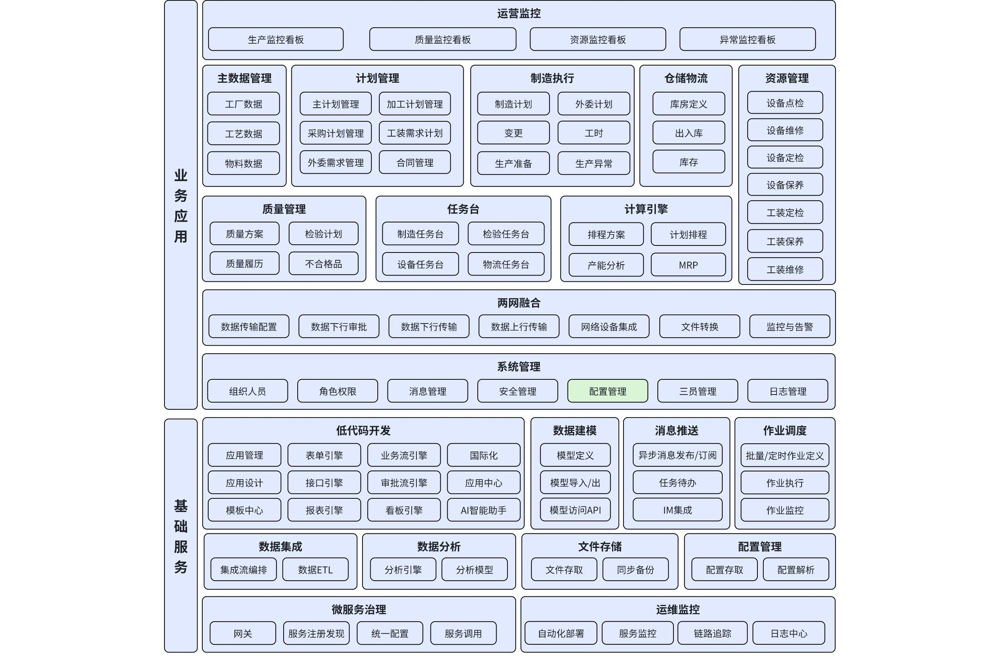

# **DNW30050****-****系统配置**

# 1. **概述**

## 1.1 **原始需求**

**原始需求**
在生产过程中，企业面临着多种业务场景的挑战，需要一个灵活、高效的系统配置管理来适应不同的生产需求，满足快速变化的生产环境和多样化的业务需求。

**重点诉求**

**配置方便**：系统应提供简单、直观的配置界面，使用户能够快速、轻松地进行配置操作，无需复杂的技术知识或编程技能。

**可扩展性**：系统应具备良好的可扩展性，能够随着企业业务的发展和变化，轻松添加新的功能模块或业务场景配置。

**数据准确性**：配置过程中，系统应确保数据的准确性和一致性，避免因配置错误导致的生产问题。

**操作简单**：系统应提供简洁明了的操作指引和帮助文档，使用户能够快速上手，减少培训成本和时间。

## 1.2 **需求来源**

       产品自主规划。

## 1.3 **术语及缩写解释**

|术语 | 缩写 | 说明|
|--- | --- | ---|
|业务组织 | Business Organization | 业务组织是指以生产制造为核心活动的企业或机构中，围绕生产流程和生产目标而设立的组织结构。它通常是以生产工厂为基本单位，强调生产过程的组织和管理。|
|工作中心 | work center | 由一个或多个相同能力的工人和/或机器组成的，可被看作是一个单元以实现能力需求计划和详细排程目标的特定生产区域。生产过程中执行特定工序的地点，通常包括必要的设备、资源和操作人员。|

## 1.4 **参考文献**

无

---

# 2. **需求描述**

## 2.1 **业务描述**

无

## 2.2 **功能描述**

### 2.2.1 **应用架构**

#### 2.2.1.1 **整体应用架构**

本次主要涉及配置管理。

#### 2.2.1.2 **功能清单**

|模块 | 页面 | 配置项 | 功能说明|
|--- | --- | --- | ---|
|业务配置 | 制造执行业务配置 | 生产订单导入配置 | 生产订单导入后是否自动发布 |
|业务配置 | 制造执行业务配置 | 生产订单发布配置 | 生产订单发布后是否自动释放 |
|业务配置 | 制造执行业务配置 | 生产订单释放配置 | 是否自动生成物料准备计划 |
|业务配置 | 制造执行业务配置 | 生产订单完工配置 | 生产订单完工约束 |
|业务配置 | 制造执行业务配置 | 制造任务报工配置 | 报工后是否自动发起报废入库申请 |
|业务配置 | 制造执行业务配置 | 制造订单完工配置 | 制造订单完工后是否自动发起合格入库申请 |
|业务配置 | 制造执行业务配置 | 加工报工方案配置 | 基于业务组织配置默认加工报工方案 |
|业务配置 | 仓储业务配置 | 默认库房配置 | 定义成品完工入库和报废入库申请等业务场景的默认库房 |
|业务配置 | 仓储业务配置 | 库位分配规则 | 定义物料入库时库位的默认取值规则 |
|业务配置 | 质量管理业务配置 | 检验任务报工配置 | 检验任务报工后是否自动发起报废入库申请 |
|业务配置 | 质量管理业务配置 | 质量方案配置 | 基于业务组织配置默认质量方案（包含检验报工项） |
|业务配置 | 质量管理业务配置 | 不合格品审理配置 | 默认加入的不合格品审理流程标识、是否默认勾选加入审批流 |
|业务配置 | 工装工具业务配置 | 工装工具借用周期配置（天） | |
|审批流业务配置 | 审批流配置 | 业务审批流 | 定义各业务实体类型与审批流程的绑定关系 |
|APS业务配置 | APS配置 | 排产资源分类 | 工作中心/设备 |
|APS业务配置 | APS配置 | 排产锁定规则 | 按派工结果时间资源锁定等多种规则 |
|APS业务配置 | APS配置 | 排产锁定期限 | 定义排产时间锁定-按固定期限锁定的期限（天） |
|APS业务配置 | APS配置 | 排产标准时间 | 定义1天有多少工作小时 |

#### 2.2.1.3 **配置入口设计**

业务配置按应用域独立管理，拆分为以下配置入口：
- **业务配置**：通用业务配置，包含制造执行、工装工具、设备管理等业务域的配置项
- **审批流业务配置**：独立管理审批流相关配置
- **APS业务配置**：独立管理APS排产相关配置（排产资源分类、排产锁定规则、排产锁定期限、排产标准时间等）

各配置入口采用统一的配置界面风格，便于不同角色各自管理负责的配置。

# 3. **页面 & 功能设计**

## 3.1 **配置管理通用规则**

### 3.1.1 **全局配置与组织级配置**

配置项分为两类：
- **全局配置**：适用于所有业务组织的默认配置
- **组织级配置**：针对特定业务组织的差异化配置

界面采用卡片式布局展示，通过标识区分配置类型（全局/组织级）。用户可从全局配置卡片快速创建组织级配置。点击卡片查看配置详情，配置项较多时左侧提供分类导航。

## 3.2 **业务配置**

### 3.2.1 **制造执行业务配置**

#### 3.2.1.1 **生产订单导入**

##### 3.2.1.1.1 **生产订单导入后是否自动发布**

- **配置说明：** 开启后，生产订单导入后要自动发布，不开启则不处理
- **配置方式：** 开关
- **默认值：** 是

#### 3.2.1.2 **生产订单发布**

##### 3.2.1.2.1 **生产订单发布后是否自动释放**

- **配置说明：** 开启后，当生产订单发布后自动按生产订单的剩余可释放数量进行释放生成制造订单，无需按生产订单释放方式配置来释放；不开启则不处理
- **配置方式：** 开关
- **默认值：** 否

#### 3.2.1.3 **生产订单释放**

##### 3.2.1.3.1 **生产订单释放后是否自动生成物料准备计划**

- **配置说明：** 开启后，若生产订单的备料清单不为空，则生产订单释放后要自动生产物料准备计划，不开启则不处理。注：当备料清单为空时，不影响生产订单释放的结果，只是不自动生产物料准备计划
- **配置方式：** 开关
- **默认值：** 否

#### 3.2.1.4 **生产订单完工**

##### 3.2.1.4.1 **生产订单完工约束**

- **配置说明：** 生产订单的合格数量>=计划产出数量；生产订单的完工数量>=计划投入数量；生产订单的入库数量>=计划产出数量；生产订单的已释放数量>=计划数量；生产订单下所有制造订单已完工或已终止或已关闭；生产订单下所有制造订单已入库
- **配置方式：** 多选
- **默认值：** 生产订单已全部释放且关联的所有制造订单已完工

#### 3.2.1.5 **制造任务报工**

##### 3.2.1.5.1 **制造任务报工后是否自动发起报废入库申请**

- **配置说明：** 开启后，当制造任务报工后且存在报废数量时，自动发起报废入库申请单，若未配置该物料的报废库房，则发起申请失败，但报工成功，此时可手动进行报废入库申请
- **配置方式：** 开关
- **默认值：** 否

#### 3.2.1.6 **制造订单完工**

##### 3.2.1.6.1 **制造订单完工后是否自动发起合格入库申请**

- **配置说明：** 开启后，当制造订单完工后且存在合格数量时，自动发起合格入库申请单，若未配置该物料的合格库房，则发起申请失败，但订单完工成功，此时可手动进行合格入库申请
- **配置方式：** 开关
- **默认值：** 否

#### 3.2.1.7 **加工报工方案配置**

- **配置说明：** 定义组织级默认加工报工方案，作为工序库加工报工方案的默认模板。报工项类型：报工后，报工项的数量累计到对应的数量上，当报工项类型=待定时，会自动创建不合格品审理单；不合格品审理结论：当且仅当报工项类型=待定时有效，当创建不合格品审理单时，需自动带上配置的审理结论；是否启用：等于是时报工时可见，否则不可见
- **配置方式：** 表格
- **默认值：** 空
- **表格列：** 报工项类型（下拉值：合格、报废、待定）、报工项编码、报工项名称、是否分卡、不合格品审理结论（合格、让步接收、报废、返工、返修）、是否启用

### 3.2.2 **仓储业务配置**

#### 3.2.2.1 **默认库房配置**

- **配置说明：** 用于定义成品完工入库和报废入库申请等业务场景的默认库房。物料类别：手动填写物料信息的物料类别名称；默认合格库房编码：手动填写库房编码；默认废品库房编码：手动填写库房编码
- **配置方式：** 表格
- **默认值：** 空
- **表格列：** 物料类别（手动填写物料类别名称）、默认合格库编码（选择库房对象，支持下拉或弹窗选择，按当前组织过滤可用库房，选择后自动回填编码和名称）、默认废品库编码（选择库房对象，支持下拉或弹窗选择，按当前组织过滤可用库房，选择后自动回填编码和名称）

#### 3.2.2.2 **库位分配规则**

- **配置说明：** 用于定义物料入库时，库位的默认取值规则配置。无：不做任何处理；取最近一次入库的库位：根据当前物料，取最近一次入库的库位
- **配置方式：** 下拉单选
- **默认值：** 取最近一次入库的库位

### 3.2.3 **质量管理业务配置**

#### 3.2.3.1 **检验任务报工**

##### 3.2.3.1.1 **检验任务报工后是否自动发起报废入库申请**

- **配置说明：** 开启后，当检验任务报工后且存在报废数量时，自动发起报废入库申请单，若未配置该物料的报废库房，则发起申请失败，但报工成功，此时可手动进行报废入库申请
- **配置方式：** 开关
- **默认值：** 否

#### 3.2.3.2 **不合格品审理**

##### 3.2.3.2.1 **默认加入的不合格品审理流程标识**

- **配置说明：** 填写默认加入的不合格审理流程标识
- **配置方式：** 文本编辑框
- **默认值：** 空

##### 3.2.3.2.2 **是否默认勾选加入审批流**

- **配置说明：** 是：报工时默认勾选加入不合格审批流；否：报工时默认不勾选加入不合格审批流
- **配置方式：** 开关
- **默认值：** 否

#### 3.2.3.3 **质量方案配置**

- **配置说明：** 定义组织级默认质量方案，作为工序库质量方案的默认模板。质量方案包含检验报工项配置。报工项类型：报工后，报工项的数量累计到对应的数量上，当报工项类型=待定时，会自动创建不合格品审理单；不合格品审理结论：当且仅当报工项类型=待定时有效，当创建不合格品审理单时，需自动带上配置的审理结论；是否启用：等于是时报工时可见，否则不可见
- **配置方式：** 表格
- **默认值：** 空
- **表格列：** 报工项类型（下拉值：合格、报废、待定）、报工项编码、报工项名称、是否分卡、不合格品审理结论（合格、让步接收、报废、返工、返修）、是否启用

**说明**：质量方案中的检验报工项用于检验任务报工，结构与加工报工项相同，但可配置不同的报工项（如检验可配置"待定"项）。

### 3.2.4 **工装工具业务配置**

#### 3.2.4.1 **工装工具借用周期配置（天）**

- **配置说明：** 用于设置不同工装工具类别的借用周期。工装工具类别：手动填写工装工具类别名称；默认借用周期：整数
- **配置方式：** 表格
- **默认值：** 空
- **表格列：** 工装工具类别（手动填写类别名称）、默认借用周期（手动填写，整数）

## 3.3 **审批流业务配置**

### 3.3.1 **业务审批流配置**

- **配置说明：** 用于定义各业务实体类型与审批流程的绑定关系。业务实体类型：用户关联审批流程的业务实体类型；是否默认加入审批流：新增实体数据时是否默认加入审批流；流程标识：业务实体类型绑定的审批流程标识
- **配置方式：** 表格
- **默认值：** 空
- **表格列：** 业务实体类型、是否默认加入审批流、流程标识

## 3.4 **APS业务配置**

### 3.4.1 **排产资源分类**

- **配置说明：** 工作中心：排产资源分类为工作中心；设备：排产资源分类为设备
- **配置方式：** 下拉单选
- **默认值：** 工作中心

### 3.4.2 **排产锁定规则**

- **配置说明：** 按派工结果时间资源锁定：按任务派工的时间、资源进行锁定；按派工结果时间锁定：按任务派工的时间进行锁定（应用于客户鉴证）；按派工结果资源锁定：按任务派工的资源进行锁定（应用于设备良品率差异大）；按固定期限时间资源锁定：从今天往后加N天，N取排产固定期限，若未配置，则默认为1天，期限内(任务锁定级别：按任务派工开始确定区间)的时间、资源双重锁定；按固定期限时间锁定：从今天往后加N天，N取排产固定期限，若未配置，则默认为1天，期限内的时间锁定（应用于生产准备）；不锁定：不按执行任何锁定
- **配置方式：** 下拉单选
- **默认值：** 不锁定

### 3.4.3 **排产锁定期限**

- **配置说明：** 用于定义排产时间锁定-按固定期限锁定的期限（单位：天）
- **配置方式：** 数值编辑框，只能输入正整数
- **默认值：** 1
- **单位：** 天，不允许设置其他单位

### 3.4.4 **排产标准时间**

- **配置说明：** 用于定义1天有多少工作小时，用于排产资源能力定义为天/d时，方便系统将天换算成最小单位秒/s
- **配置方式：** 数值编辑框，可以输入小数
- **默认值：** 8
- **校验：** 输入值（0，24】

# 4. **外部依赖**

本次功能对外部依赖的状态说明

| 产品 | 应用 | 功能 | 外部依赖说明 | 状态 |
|------|------|------|-------------|------|
| 报工和质量方案设计 | - | - | 全局设计文档，了解组织级配置在整体架构中的作用 | 待开发 |
| DNW30120-工序库 | 工序库 | 工序库管理 | 工序库定义，包括加工报工方案、质量方案、人员资质 | 待开发 |
| DNW30120-工序库 | 加工报工方案 | 加工报工方案管理 | 加工报工方案定义 | 待开发 |
| DNW30120-工序库 | 质量方案 | 质量方案管理 | 质量方案定义，包含检验报工项 | 待开发 |

---

# 变更记录

| 日期 | 版本 | 变更内容 | 变更人 |
|------|------|---------|--------|
| 2025-01-07 | v2.1 | 新增配置入口设计（业务配置、审批流业务配置、APS业务配置分离）、全局/组织级配置分离规则、仓储配置改为选择库房对象 | - |
| 2026-01-08 | v2.2 | 合并V1版本配置项，按配置入口重新组织功能清单和页面设计（业务配置、审批流业务配置、APS业务配置） | - |
| 2026-01-08 | v2.3 | 删除已废弃配置项：生产订单导入后是否自动匹配工艺路线、生产订单释放后是否自动展开制造订单、生产订单释放方式、工艺路线匹配配置、制造订单指定时间配置、制造任务开工配置、制造任务完工约束、定额工时计算配置、实作工时计算配置、切件管理配置、生产订单的备料清单来源、物料出库优先级规则、是否允许负库存、物料有效期预警提前期、呆滞物料预警时长 | - |

