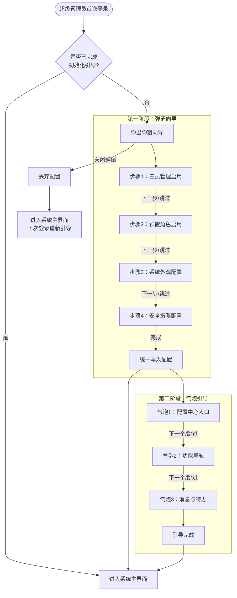
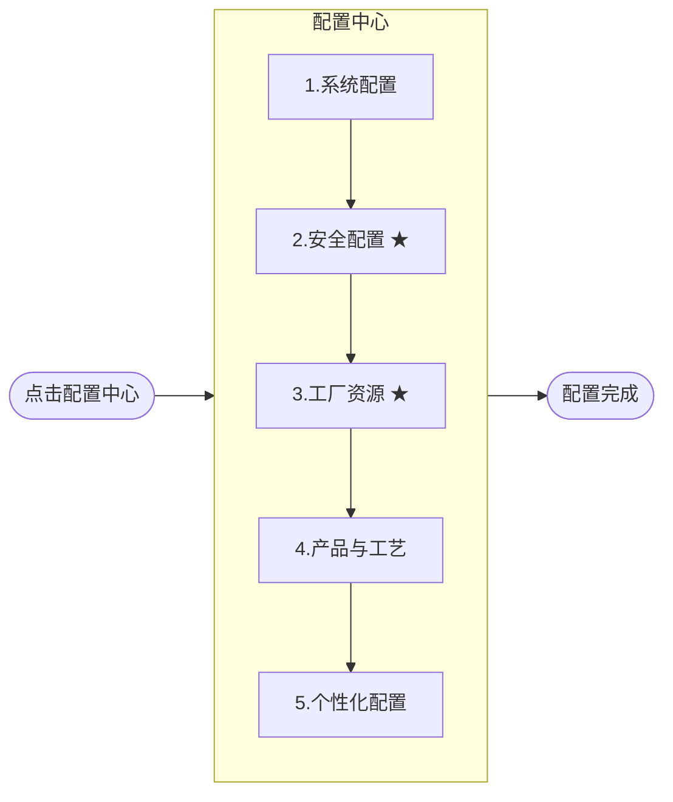

# DNW30055 系统配置引导

## 1. 概述

### 1.1 业务背景与挑战

**挑战1：系统初始配置流程复杂，缺乏引导**
- 问题：MOM系统部署完成后，需要进行大量的初始配置才能正常使用，配置项分散在多个模块中，配置顺序有严格的依赖关系，新用户难以掌握正确的配置流程
- 影响：系统上线周期长，实施成本高，用户体验差

**挑战2：配置项必选与可选不清晰**
- 问题：系统配置项众多，哪些是系统运行必须配置的，哪些是可选的外观或个性化配置，用户难以区分，容易遗漏关键配置或在非必要配置上花费过多时间
- 影响：配置效率低，关键配置遗漏导致系统无法正常运行

**挑战3：系统级开关配置缺乏首次引导**
- 问题：三员管理启用、预置角色、安全策略等系统级开关配置，需要在系统使用前完成决策，但缺乏引导机制，用户不知道这些配置的存在和影响
- 影响：系统上线后才发现关键配置未设置，需要回头补配置，影响使用体验

### 1.2 价值主张

本方案通过「系统初始化引导」+「配置中心」的双功能设计，为用户提供完整的配置引导体验：

- **首次引导**：系统部署后首次登录，通过向导式引导帮助超级管理员快速完成系统级开关配置
- **配置效率提升**：通过分阶段、分类别的配置中心，用户可快速了解配置全貌，按正确顺序完成配置
- **配置质量保障**：明确区分必选配置与可选配置，确保关键配置不遗漏，降低系统上线风险
- **量化目标**：5分钟内完成初始化引导，15分钟内完成配置中心主线配置（含数据准备时间）

### 1.3 用户画像

| 分类 | 角色名称 | 核心职责 | 核心诉求与痛点 |
| :--- | :--- | :--- | :--- |
| **系统层** | 超级管理员(superAdmin) | 三员管理、系统最高权限管理、系统初始化 | 希望首次登录时有清晰的引导，快速完成系统级配置 |

**说明**：系统初始化引导和配置中心均仅面向超级管理员。

### 1.4 术语及缩写解释

| 术语 | 缩写 | 解释说明 |
| --- | --- | --- |
| 三员管理 | | 指超级管理员、安全管理员、系统管理员三种角色的分权管理模式，用于满足安全合规要求 |
| 系统初始化引导 | | 系统部署后超级管理员首次登录时弹出的向导式引导，帮助完成系统级开关配置 |
| 配置中心 | | 系统右上角入口的独立配置页面，提供分类别、可视化的配置引导，帮助用户按正确顺序完成系统配置 |
| 弹窗向导 | | 初始化引导的第一阶段，居中弹窗+步骤条形式，用户在弹窗内完成配置 |
| 气泡引导 | | 初始化引导的第二阶段，在系统主界面上以气泡形式指引关键入口位置 |
| 必选配置 | | 系统正常运行所必须完成的配置项，不配置将影响系统核心功能 |
| 可选配置 | | 系统外观、个性化等非必须配置项，不配置不影响系统核心功能 |
| 主数据 | | 企业核心业务数据，如物料、工艺路线、设备、工作中心等 |
| 预置角色 | | 系统预定义的业务角色及其默认权限配置，启用后自动创建 |

---

## 2. 功能一：系统初始化引导

### 2.1 功能概述

系统部署后超级管理员首次登录时，自动弹出初始化引导，帮助用户快速完成系统级开关配置。引导采用两段式设计：先通过弹窗向导完成配置，再通过气泡引导帮助用户认识系统界面。

### 2.2 触发条件与生命周期

| 项目 | 说明 |
|------|------|
| 触发角色 | 仅超级管理员（superAdmin） |
| 触发条件 | 系统部署后超级管理员首次登录 |
| 触发次数 | 仅触发一次，完成后不再弹出 |
| 中途退出 | 丢弃所有配置，下次登录重新弹出引导 |
| 重新进入 | 不提供重新进入引导的入口，用户去配置中心修改 |
| 数据写入 | 引导全部完成后统一写入，之后在配置中心修改 |

### 2.3 业务流程

### 2.4 第一阶段：弹窗向导

#### 2.4.1 交互形式

- 居中弹窗 + 顶部步骤条
- 弹窗内完成所有配置（纯引导式），不跳转到其他页面
- 每个步骤提供「跳过」和「下一步」按钮
- 每步可跳过，但必须走完所有步骤才能完成引导
- 弹窗支持滚动，以容纳内容较多的步骤（如系统外观配置）
- 弹窗右上角提供关闭按钮，点击关闭则丢弃所有配置，下次登录重新引导

#### 2.4.2 步骤1：三员管理启用

**步骤目的**：决定系统是否采用三员分权管理模式。

| 配置项 | 类型 | 默认值 | 说明 |
|--------|------|--------|------|
| 是否启用三员分权管理 | 开关 | 关闭 | 启用后系统将采用超级管理员、安全管理员、系统管理员三种角色的分权管理模式 |

**界面说明**：
- 开关上方展示三员管理的简要说明文字，帮助用户理解启用后的影响
- 说明内容：启用三员后，系统权限将分为超级管理员（最高权限）、安全管理员（安全策略与授权）、系统管理员（组织架构与配置）三个角色分别管理

#### 2.4.3 步骤2：预置角色启用

**步骤目的**：决定是否启用系统预置的业务角色。

| 配置项 | 类型 | 默认值 | 说明 |
|--------|------|--------|------|
| 是否启用预置角色 | 开关 + 角色列表勾选 | 关闭 | 启用后展示角色列表，用户可勾选需要启用的角色 |

**预置角色列表**：

| 角色名称 | 职责描述 | 默认勾选 |
|----------|----------|----------|
| 系统管理员 | 系统配置、主数据维护及高级功能的完全控制权限 | 是 |
| 厂际协同计划员 | 跨工厂的计划协同与调度 | 是 |
| 生产厂长 | 全厂生产运营监控与决策 | 是 |
| 生产主管 | 生产计划管理、排程、工单下达及生产进度监控 | 是 |
| 工艺主管 | 工艺标准、资源定义、工艺路线及BOM管理 | 是 |
| 质量主管 | 全面质量管理体系监控与标准制定 | 是 |
| 设备主管 | 设备全生命周期管理与维护策略制定 | 是 |
| 工装管理员 | 工装台账、借还及库存管理 | 是 |
| 仓库主管 | 仓储物流全面管理及库存策略制定 | 是 |
| 库管员 | 物料出入库、盘点及库存日常管理 | 是 |
| 工时管理员 | 工时定额维护与管理 | 是 |
| 班组长 | 班组任务分配、派工及现场人员管理 | 是 |
| 操作工 | 现场生产任务执行、报工、异常上报 | 是 |
| 质检员 | 质量检验任务执行 | 是 |
| 设备保养/维修专员 | 设备日常巡检、保养与维修执行 | 是 |
| 工装检定/维保专员 | 工装的定期检定与维护执行 | 是 |

**界面说明**：
- 开关关闭时，角色列表不展示
- 开关打开后，展示角色列表，默认全选
- 用户可取消勾选不需要的角色
- 启用后系统自动创建对应角色及其默认权限配置（权限定义详见「导航按钮角色权限默认配置」文档）

#### 2.4.4 步骤3：系统外观配置

**步骤目的**：配置系统的品牌标识、页面背景和水印设置。

| 分区 | 配置项 | 类型 | 默认值 | 说明 |
|------|--------|------|--------|------|
| 系统标识配置 | 平台Logo | 图片上传 | 系统默认Logo | 建议尺寸192×80像素，PNG/JPG，<2M |
| | 网站图标 | 图片上传 | 系统默认图标 | 建议尺寸256×256像素，PNG/JPG，<2M |
| | 用户头像 | 图片上传 | 系统默认头像 | 建议尺寸256×256像素，PNG/JPG，<2M |
| | 系统主标题 | 文本输入 | KMMOM CLOUD | 显示在系统顶部导航栏 |
| | 系统子标题 | 文本输入 | 空 | 显示在主标题下方 |
| 登录页配置 | 登录页背景 | 图片上传 | 系统默认背景 | 建议尺寸1920×1080像素(16:9)，PNG/JPG，<5M |
| 首页配置 | 首页背景 | 图片上传 | 系统默认背景 | 建议尺寸1920×1080像素(16:9)，PNG/JPG，<2M |
| | 欢迎语 | 文本输入 | 欢迎来到MOM系统！ | 显示在首页 |
| 系统水印设置 | 是否开启水印 | 开关 | 开启 | 开启后可选择水印类型 |
| | 水印类型 | 单选 | 内容水印 | 内容水印 / 图片水印 |
| | 水印内容/文件 | 文本/上传 | - | 根据水印类型展示对应配置 |
| | 水印附加信息 | 多选 | 空 | 当前用户名、当前时间、当前组织 |

**界面说明**：
- 弹窗内按分区展示，支持滚动
- 图片上传支持拖拽和点击选择
- 跳过此步骤时，所有配置项使用系统默认值

#### 2.4.5 步骤4：安全策略快捷配置

**步骤目的**：配置系统关键安全参数。

| 配置项 | 类型 | 说明 |
|--------|------|------|
| 密码策略 | 表单 | 密码最小长度、复杂度要求（大小写、数字、特殊字符）、过期天数 |
| 空闲锁定 | 开关 + 输入 | 是否启用空闲锁定，空闲时长（分钟） |
| 多IP登录控制 | 开关 | 是否允许同一账号多地点同时登录 |
| 登录失败锁定 | 表单 | 连续登录失败次数上限、锁定时长（分钟） |

**界面说明**：
- 每个配置项附带简要说明文字
- 跳过此步骤时，所有配置项使用系统默认值

#### 2.4.6 完成动作

当用户走完4个步骤后：

1. 点击「完成」按钮
2. 系统统一写入所有配置（跳过的步骤使用系统默认值）
3. 关闭弹窗，进入系统主界面
4. 自动触发第二阶段气泡引导
5. 标记该租户的初始化引导已完成，后续登录不再触发

### 2.5 第二阶段：气泡引导

弹窗向导完成后，在系统主界面上以气泡形式指引用户认识关键入口位置。

#### 2.5.1 气泡引导步骤

| 步骤 | 指向位置 | 气泡标题 | 气泡说明 |
|------|----------|----------|----------|
| 1/3 | 右上角用户头像下拉菜单 → 配置中心 | 配置中心入口 | 系统配置、安全配置、工厂资源、产品与工艺、个性化配置都在这里。刚才跳过的配置项也可以在这里设置。 |
| 2/3 | 左侧导航菜单区域 | 功能导航 | 这里是系统的功能导航区域，所有业务功能模块都可以在这里找到。 |
| 3/3 | 顶部消息中心/待办区域 | 消息与待办 | 待办任务和系统消息会在这里提醒你，及时处理不遗漏。 |

#### 2.5.2 交互规则

| 场景 | 交互行为 |
|------|----------|
| 气泡展示 | 指向目标位置，背景半透明遮罩，目标区域高亮 |
| 点击「下一个」 | 进入下一步气泡引导 |
| 点击「跳过」 | 整个气泡引导结束，不再出现 |
| 点击关闭按钮 | 整个气泡引导结束，不再出现 |
| 走完所有步骤 | 自动结束，不再出现 |
| 气泡引导状态 | 不持久化，关闭即结束 |

---

## 3. 功能二：配置中心

### 3.1 功能概述

配置中心是面向超级管理员的系统配置管理界面，提供分类别、可视化的配置引导，帮助用户按正确顺序完成系统的全面配置。

### 3.2 入口与权限

| 项目 | 说明 |
|------|------|
| 入口位置 | 系统右上角用户头像下拉菜单中的「配置中心」选项 |
| 可见性 | 有权限的用户可见 |
| 页面形式 | 点击后打开新的浏览器标签页，独立全屏页面 |

**右上角下拉菜单内容**：

| 菜单项 | 可见角色 | 说明 |
|--------|----------|------|
| 配置中心 | 有权限的用户可见 | 打开新标签页进入配置中心 |
| 修改密码 | 所有用户 | 修改当前用户密码 |
| 刷新缓存 | 所有用户 | 刷新系统缓存 |
| 退出登录 | 所有用户 | 退出当前登录 |

### 3.3 业务流程

**前提条件**：超级管理员已登录系统。

**大阶段执行顺序**：按配置分类顺序执行

**图例说明**：★ 必选配置

### 3.4 配置项清单

#### 3.4.1 系统配置

| 序号 | 配置项 | 说明 | 必选 |
| --- | --- | --- | :---: |
| 1 | 导航菜单 | 配置系统导航菜单结构 | |
| 2 | 行政组织与用户 | 配置行政组织架构和系统用户 | |
| 3 | 三员启用与安全配置 | 启用/关闭三员分权管理模式 | |
| 4 | 管理员授权 | 配置三员角色的权限范围 | |
| 5 | 条码规则 | 配置系统条码生成规则 | |
| 6 | 编码规则 | 配置系统编码生成规则 | |
| 7 | 配置导出 | 导出当前系统配置方案 | |
| 8 | 配置导入 | 导入系统配置方案 | |

#### 3.4.2 安全配置 ★

| 序号 | 配置项 | 说明 | 必选 |
| --- | --- | --- | :---: |
| 1 | 安全配置 | 密码策略、登录策略等安全参数配置 | ★ |
| 2 | 角色管理 | 创建和管理系统角色 | ★ |
| 3 | 角色授权 | 为角色分配功能权限 | ★ |

#### 3.4.3 工厂资源 ★

| 序号 | 配置项 | 说明 | 必选 |
| --- | --- | --- | :---: |
| 1 | 工厂组织和用户 | 配置工厂组织架构和用户 | ★ |
| 2 | 供应商 | 配置供应商信息 | |
| 3 | 设备定义 | 配置设备基础信息 | |
| 4 | 工装定义 | 配置工装基础信息 | |
| 5 | 工作中心 | 配置工作中心信息 | ★ |
| 6 | 库房库位 | 配置仓库和库位信息 | |

#### 3.4.4 产品与工艺

| 序号 | 配置项 | 说明 | 必选 |
| --- | --- | --- | :---: |
| 1 | 物料信息 | 配置物料基础数据 | |
| 2 | MBOM | 配置制造BOM | |
| 3 | 资质等级 | 配置人员资质等级 | |
| 4 | 工序库 | 配置标准工序库 | |
| 5 | 工艺路线 | 配置产品工艺路线 | |

#### 3.4.5 个性化配置

| 序号 | 配置项 | 说明 | 必选 |
| --- | --- | --- | :---: |
| 1 | 外观配置 | 系统标识、登录页/首页背景、水印等外观设置 | |
| 2 | 界面布局配置 | 页面布局个性化配置 | |
| 3 | 审批流配置 | 审批流程模型配置 | |
| 4 | 业务参数配置 | 业务相关参数配置 | |
| 5 | 文档工具 | 文档工具配置 | |
| 6 | 文档模型工具配置 | 文档模型工具配置 | |

### 3.5 界面设计

#### 3.5.1 页面布局

- 采用5列卡片式布局，每个分类一列卡片
- 卡片内展示该分类下的所有配置项
- 必选配置项标注 ★ 标识
- 分类卡片按推荐配置顺序从左到右排列

#### 3.5.2 卡片内容

每个分类卡片包含：

| 元素 | 说明 |
|------|------|
| 分类标题 | 如"系统配置"、"安全配置 ★" |
| 配置项列表 | 该分类下的所有配置项，以超链接形式展示 |
| 下载模板按钮 | 鼠标悬停分类卡片时显示（如有） |
| 导入数据按钮 | 鼠标悬停分类卡片时显示（如有） |

### 3.6 交互设计

| 场景 | 交互行为 |
| --- | --- |
| 点击配置项 | 跳转到对应的配置功能页面 |
| 鼠标悬停配置项 | 配置项高亮，显示可点击状态 |
| 鼠标悬停分类 | 分类卡片高亮，显示下载/导入按钮(如有) |
| 下载模板 | 点击下载按钮，下载Excel模板 |
| 导入数据 | 点击导入按钮，打开文件选择器导入数据 |
| 配置项已访问状态 | 点击跳转后，配置项文字变为已访问颜色（参考标准超链接已访问效果，具体颜色由UI定义） |
| 已访问状态生命周期 | 当前会话内有效，不持久化存储，刷新页面或重新登录后重置 |
| 分类批量导入 | 鼠标悬停分类卡片时，显示【下载模板】【导入数据】按钮，点击执行对应操作 |

---

## 4. 原型文件

| 文件 | 路径 | 说明 |
| --- | --- | --- |
| 配置中心（卡片版） | `src/management_plat/system_config/config_guide_center.html` | 卡片布局版本 |
| 配置中心（时间轴版） | `src/management_plat/system_config/config_guide_center_v2.html` | 时间轴布局版本 |

---

## 5. 约束与边界

| 约束项 | 说明 |
|--------|------|
| 终端支持 | 仅支持PC端，不支持移动端/平板 |
| 初始化引导触发 | 仅超级管理员首次登录触发，完成后不可重新进入 |
| 初始化引导中途退出 | 丢弃所有配置，下次登录重新引导 |
| 初始化引导数据写入 | 完成后统一写入，跳过的步骤使用系统默认值 |
| 气泡引导状态 | 关闭即结束，不持久化，不可重新触发 |
| 配置中心可见性 | 仅超级管理员可见 |
| 配置中心入口 | 右上角用户头像下拉菜单 |
| 配置项已访问状态 | 不持久化，仅当前会话有效 |
| 帮助文档 | 本期不含配置项帮助入口，后续需求迭代 |

---

**文档版本**：V2.0
**更新日期**：2026年02月25日
**适用系统**：KMMOM CLOUD V3.2
**文档类型**：产品需求文档
**需求编号**：DNW30055
