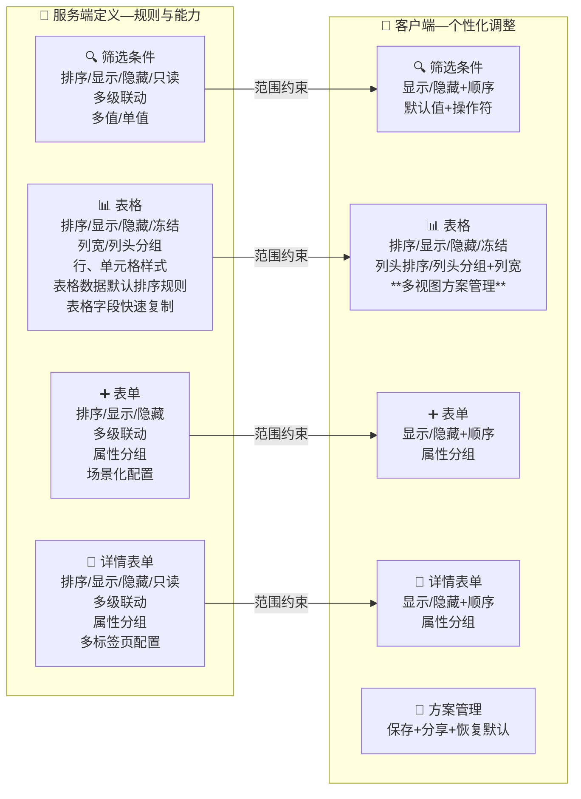

# **服务端布局需求规格说明**

## 1. **概述**

### 1.1 **产品目标**
服务端布局旨在为系统集成实施顾问及管理员提供一个强大、灵活的页面标准化配置工具。它将UI表现与业务逻辑解耦，通过服务端下发的元数据来定义页面的标准结构、内容、行为和权限边界。此功能是整个UI扩展体系的基石，旨在提升交付效率、统一产品规范，并为客户端个性化配置提供稳定的基础。

### 1.2 **核心设计原则**
- **权责分离**: 服务端定义“能力”和“标准”（能看到什么，能操作什么），客户端在此范围内进行“个性化”调整（想怎么看）。
- **配置驱动**: 所有页面结构和行为均由配置定义，实现“即改即用”，无需重新部署。
- **可视化配置**: 提供直观的图形化界面，降低配置门槛。
- **场景化设计**: 支持同一业务对象在不同业务场景（如新增、编辑、列表、筛选）下拥有不同的布局。

### 1.3 功能边界与职责划分

#### 1.3.1 应用范围

**本次改造覆盖范围**：
- ✅ **管理平台** - 生产订单、工序、质检、物料等各类CRUD管理页面
- ✅ **车间工作台** - 任务列表、报工、检验、详情等核心工作界面

**功能一致性原则**：

虽然两个平台的**界面风格和组件**存在明显差异（管理平台面向PC端、车间工作台面向工控机/PAD端），但在**布局配置的核心概念和业务规则**上保持一致：

| 方面 | 管理平台 (PC) | 车间工作台 (工控/PAD) |
| :--- | :--- | :--- |
| **界面风格** | 桌面化、功能密集、多面板 | 移动/触屏化、简洁高效、单屏操作 |
| **主要组件** | 复杂表格、弹窗对话框、多级菜单 | 简化表单、全屏操作、大按钮 |
| **适用场景** | 计划员、管理人员等办公室工作 | 车间一线员工、工控机操作 |
| **布局配置概念** | ✅ **相同** - 都支持筛选、表格、表单的字段配置 | ✅ **相同** - 都支持列表、表单的字段配置 |
| **业务规则** | ✅ **相同** - 都支持字段联动、动态表达式、权限控制 | ✅ **相同** - 都支持字段联动、动态表达式、权限控制 |
| **实现方式** | 具体UI实现形式可能不同 | 具体UI实现形式可能不同 |

**结论**：两个平台在服务端布局的核心能力和业务规则上保持统一，但具体的UI实现形式和交互方式因平台特性而异。

---

#### 1.3.2 整体架构概览

为了清晰定义服务端与客户端布局的权责，以下思维导图展示了二者的功能边界。核心思想是：**服务端定义“能力集合与默认标准”，客户端在此集合内进行“个性化偏好设置”**。

---

#### 1.3.3 服务端与客户端的边界范围

---

##### 1.3.3.1 **服务端布局的边界范围**

为了清晰定义服务端布局的能力范围，下面阐述其适用和不适用的场景。

###### **服务端布局的适用范围** ✅

| 适用范围 | 说明 | 例子 |
| :--- | :--- | :--- |
| **标准对象管理界面** | 对系统中标准业务对象（如生产订单、工序、质检单等）的**增删查改操作界面**的布局进行定义，包括列表页、新增表单、详情表单等 | 生产订单列表页、新建订单表单、订单详情页的字段显示、顺序、宽度等配置 |
| **界面元素配置** | 定义表格列、筛选条件、表单字段的显示/隐藏、顺序、宽度、必填性、操作符等 | — |
| **业务规则配置** | 配置字段联动、动态可见性表达式、动态只读规则、数据格式化规则等 | 当订单类型="自制"时显示"工序"字段；状态="完成"时表单只读 |

###### **服务端布局的不适用范围** ❌

| 不适用范围 | 说明 | 例子 |
| :--- | :--- | :--- |
| **代码定制的业务功能** | 通过代码完全定制开发的新业务功能，暂不支持通过服务端布局进行界面配置 | 客户自开发的"供应商协同平台"模块、"MES-WMS对接"模块等 |
| **第三方集成界面** | 来自第三方系统或低代码平台的自定义界面，不纳入服务端布局管理 | 通过帆软报表、PowerBI、iVX等外部平台创建的自定义界面 |

###### **虽然不支持界面布局，但支持的其他扩展能力** 🔧

即使对于代码定制的业务功能，用户仍可通过以下方式进行扩展和增强：

| 扩展方式 | 说明 | 适用场景 |
| :--- | :--- | :--- |
| **脚本逻辑扩展/替换** | 标准产品业务功能支持通过**脚本引擎**进行逻辑扩展或替换，无需修改产品代码 | 自定义编码规则、条码解析规则、工序排产算法、质量检验逻辑等 |

除服务端布局外，KMMOM系统还提供以下扩展能力（不在本文档范围内）：
- **功能扩展配置** - 支持自定义业务功能按钮扩展
- **事件订阅体系** - 支持系统事件订阅和Webhook能力
- **低代码开发平台** - 用于快速开发项目定制功能

---

##### 1.3.3.2 **客户端布局的边界范围**

客户端布局旨在为最终用户提供个性化的界面调整能力，但需在服务端设定的权限和能力范围内操作。

######  **客户端布局的适用范围** ✅

| 适用范围 | 说明 | 例子 |
| :--- | :--- | :--- |
| **个性化展现配置** | 用户可根据个人习惯调整界面元素的展示方式，如显示/隐藏字段、调整顺序、调整列宽等 | 某用户在订单列表中隐藏"备注"列，并将"状态"列移到第一位 |
| **视图方案管理** | 用户可保存常用的布局方案，并可分享给团队内的其他用户 | 生产计划员保存一套"紧急订单视图"方案，并分享给组内其他成员 |
| **权限范围内的操作** | 用户只能执行服务端授权的操作（如"允许排序"、"允许隐藏"等） | 若服务端未授权"允许排序"，则用户无法对该列进行排序 |

###### **客户端布局的不适用范围** ❌

| 不适用范围 | 说明 | 例子 |
| :--- | :--- | :--- |
| **跨越服务端权限** | 用户不能进行服务端未授权的操作 | 即使用户想要显示某个字段，若服务端将其隐藏（设为不可见），用户也无法显示 |
| **修改业务规则** | 用户不能修改字段联动、动态表达式、验证规则等业务逻辑 | 用户不能改变"选择工厂后自动更新车间"的联动规则 |
| **超出授权范围的自定义** | 用户不能创建服务端未支持的字段、添加新的操作符等 | 用户不能在筛选条件中添加服务端未定义的字段 |
| **代码定制功能** | 客户端布局仅适用于标准功能，不适用于代码定制的业务模块 | 客户自开发的模块不在客户端布局管理范围内 |

## 2. 功能设计

### 2.1 服务端布局设计

#### 2.1.1 页面扩展中心主界面
服务端布局提供一个集中的管理入口，实施顾问或管理员可在此处查看系统中所有支持布局配置的页面。

- **功能入口**: `产品扩展` -> `页面扩展中心`
- **界面核心功能**:
    - **页面列表**: 以表格形式展示所有已配置的页面，包含`序号`、`页面名称`、`页面编码`、`所属站点`、`操作`等列。
    - **快速搜索**: 提供统一的搜索框，支持按`页面名称/页面编码`进行关键词搜索，配合`查询`和`重置`按钮，方便快速定位目标页面。
    - **核心操作**:
        - `引入`: 从功能管理的导航中引入需要扩展的页面。
        - `页面配置`: 进入已绑定模型的页面的配置界面，可配置页面的布局、脚本等。
        - `删除`: 删除已绑定模型的页面。

#### 2.1.2 引入页面
引入页面是进行布局配置的前提，它为页面指定了扩展的页面。

- **功能入口**: 在布局管理主界面，点击指定页面操作列的`引入`按钮。
- **界面核心功能**:
    - **信息展示**: 弹窗中会展示选择功能管理中已定义的导航菜单。

#### 2.1.3 页面配置
页面配置是服务端定义页面标准的核心环节，管理员在此可对页面的网格、表单、详情等不同类型进行个性化配置。

- **功能入口**: 在页面扩展中心主界面，点击页面操作列的`页面配置`按钮。
- **配置界面结构**:
    - 采用两栏式布局，左侧为页面配置区，右侧为具体配置区。
    - 左侧页面配置区支持对页面的`网格配置`、`新增表单配置`、`编辑表单配置`、`详情配置`、`事件配置`等类型进行配置。
    - 支持通过`新增配置`按钮添加新的配置项，新增时需要选择配置类型和关联的数据模型。

##### 新增配置项
- **配置类型选择**: 支持以下配置类型：
    - **网格配置** (object-table): 用于配置列表页面的表格展示
    - **新增表单配置** (object-form): 用于配置新增数据的表单
    - **编辑表单配置** (object-form): 用于配置编辑数据的表单
    - **详情配置** (object-detail-form): 用于配置数据详情页面
    - **脚本配置** (page-script): 用于配置页面脚本事件
- **关联数据模型**: 每个配置项需要关联相应的数据模型作为数据源

##### 网格配置
当左侧选择网格配置类型时，右侧支持以下配置：
- **标签页结构**: 包含`列配置`、`筛选条件配置`、`网格样式配置`三个标签页
- **列配置**: 
    - **显示**: 通过勾选框控制列是否默认显示
    - **排序**: 可设定列的默认排序方式
    - **冻结**: 可设定列的默认冻结状态
    - **序号**: 显示列在表格中的排序位置
    - **列宽**: 可为每列设定默认的像素宽度
    - **名称**: 显示字段的中文名称
    - **快速复制**: 配置字段是否支持快速复制功能，支持的字段在表格中会显示复制图标
    - **操作**: 每行提供设置图标，用于详细配置
- **筛选条件**: 
    - **字段显示**: 配置筛选字段的显示/隐藏
    - **操作符**: 设定每个字段可用的查询操作符（等于、包含、大于等）
    - **默认值**: 配置筛选条件的默认值
    - **多级联动**: 支持配置字段间的联动关系，如"选择工厂后自动过滤对应车间"
    - **多值/单值**: 配置筛选字段是否支持多值选择（如多选下拉框）
    - **只读控制**: 可将特定筛选条件设为只读，限制用户修改
- **表格样式**: 
    - **表格样式**: 配置表格整体样式（边框、间距等）
    - **行样式**: 支持根据数据条件配置行的背景色、字体色等样式规则
    - **单元格样式**: 支持根据字段值配置特定单元格的样式表现
    - **默认排序**: 配置表格数据的默认排序字段和排序方向

##### 详情配置
当左侧选择详情配置类型时，右侧支持以下配置：
- **标签页结构**: 包含`表单项配置`、`标签页配置`等标签页
- **表单项配置**: 配置详情页面的字段显示条件和布局，支持将字段进行分组管理，提升页面组织性
- **标签页配置**: 配置详情页面关联的标签页和相关数据展示

##### 新增/编辑表单配置
当左侧选择新增表单配置类型时，右侧支持以下配置：
- **标签页结构**: 包含`表单项配置`等标签页
- **表单项配置**: 
    - **显示/隐藏**: 控制字段在表单中的可见性
    - **排序**: 配置字段在表单中的显示顺序
    - **属性分组**: 支持将相关字段分组显示，提升表单组织性
    - **多级联动**: 配置字段间的动态联动关系
- **验证规则**: 配置字段的验证约束和提示信息

##### 脚本配置
当左侧选择脚本配置类型时，右侧支持以下配置：
- **标签页结构**: 包含`脚本配置`等标签页
- **脚本配置**: 配置页面脚本事件

### 2.2 客户端布局设计
客户端布局为最终用户提供在服务端设定的能力范围内，进行个性化界面调整的功能。

#### 2.2.1 筛选条件配置
- **配置入口**: 在网格页面的右上角，点击【设置】图标，打开布局设置弹窗，并切换至“筛选配置”标签页。
- **配置界面**:
    - 界面左侧为功能导航（当前方案、表格配置、筛选配置等），右侧为主要配置区。
    - 配置区列出了所有可用的筛选条件字段。
    - 用户可通过勾选框控制字段的**显示/隐藏**。
    - 用户可通过拖拽字段左侧的排序图标，调整字段的**显示顺序**。
    - 用户可设置筛选条件的默认**展示样式**（展开或收起）。
    - 每个字段前提供操作符选择（如等于、包含、大于等），允许用户构建更复杂的查询条件。
    - **[✨ 新增功能]** 用户可以为常用的筛选条件设置并保存**默认值**，在下次进入页面时自动填充。
- **功能说明**: 此功能允许用户根据个人偏好，自定义查询区域的筛选条件，并通过设置默认值和操作符来保存常用的查询场景，极大提升查询效率。所有可配置的字段和操作符均由服务端布局限定。

#### 2.2.2 网格配置
- **配置入口**: 在网格页面的右上角，点击【设置】图标，打开布局设置弹窗，默认即为“表格配置”标签页。
- **配置界面**:
    - 界面右侧展示了所有可用的表格列。
    - 表格的每个列头将增加排序控件，用户可通过单击在升序、降序和无序之间切换。
    - 用户可通过勾选框控制列的**显示/隐藏**。
    - 用户可通过拖拽排序图标调整列的**左右顺序**。
    - 用户可在输入框中设置每列的**默认宽度**。
    - 用户可点击图标设置**冻结左侧或右侧列**。
    - **[✨ 新增功能]** 用户可以将当前的表格布局（包括列顺序、宽度、可见性等）保存为一个**视图方案**。系统支持保存多个不同的视图，用户可以随时在这些**多视图**之间切换。
- **功能说明**: 用户可个性化定制数据表格的视图。新增的“多视图”功能，允许用户针对不同业务场景（如“审核视图”、“库存分析视图”）保存和切换不同的列布局，使得数据分析更加灵活和高效。

#### 2.2.3 新增表单配置
- **配置入口**: 在点击“新增”按钮弹出的**新增表单**窗口右上角，点击【设置】图标，即可打开该表单的布局配置界面。
- **配置界面**:
    - 配置界面列出了新增表单中的所有可用字段。
    - 用户可通过勾选框控制字段的**显示/隐藏**（必填项除外）。
    - 用户可通过拖拽排序图标调整字段在表单中的**上下显示顺序**。
- **功能说明**: 用户可以通过此功能简化新增操作，隐藏非必要的字段，并调整字段顺序以符合录入习惯，从而提高数据录入的效率和准确性。带有红色星号 `*` 的必填字段不可隐藏。

#### 2.2.4 详情表单配置
- **配置入口**: 在查看数据详情的**抽屉或页面**右上角，点击【设置】图标，即可打开详情表单的布局配置界面。
- **配置界面**:
    - **多标签页支持**: 如果详情页包含多个标签页（如"属性"、"关联信息"、"操作记录"），每个标签页可独立进行字段配置
    - **属性标签配置**: 针对主要的"属性"标签页，用户可通过勾选框控制字段的**显示/隐藏**
    - **字段排序**: 用户可通过拖拽排序图标调整字段的**显示顺序**
    - **分组显示**: 支持字段按逻辑分组展示，用户可调整分组的折叠状态
- **功能说明**: 此功能允许用户自定义详情页面的信息展示优先级，隐藏次要信息，突出核心数据。多标签页的独立配置能力，让用户可以针对不同信息类型进行精细化的布局调整，使得信息查阅更加直观和高效。

#### 2.2.5 方案管理
- **配置入口**: 在布局设置弹窗的左下角，提供"分享方案"、"选择方案"和"恢复默认"的入口。
- **配置界面**:
    - **分享方案**: 点击后弹出分享对话框，可选择分享范围（指定用户、组织等）。
    - **选择方案**: 点击后弹出方案列表，可搜索并应用他人分享的方案。
    - **恢复默认**: 点击后将清空当前用户的所有个性化配置，并立即应用服务端的默认布局。
- **功能说明**: 方案管理允许用户将个性化的布局配置（包括筛选、网格等整体设置）进行保存、分享或应用。同时，"恢复默认"功能为用户提供了一个快速返回标准视图的途径，确保在个性化配置混乱时能够一键复原。
