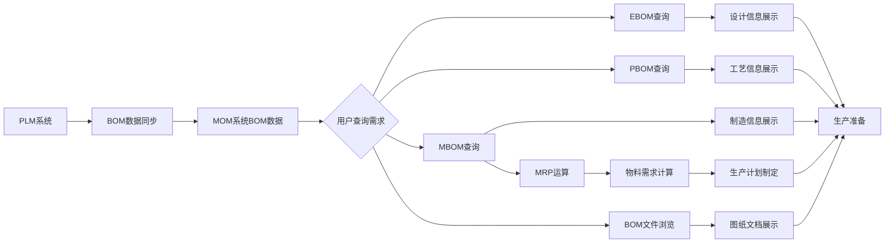
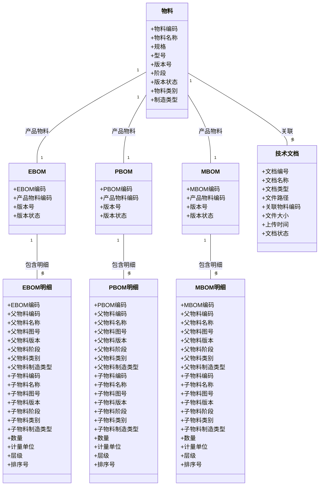
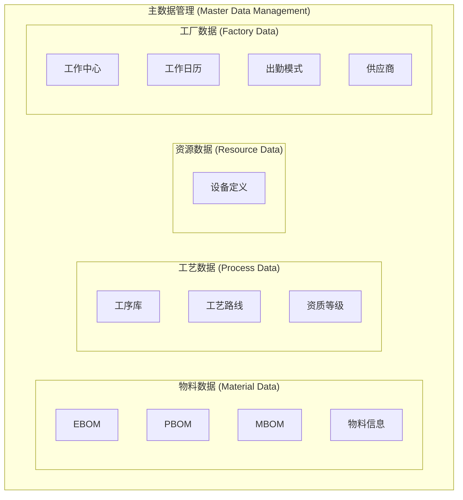

# DNW30110-产品数据

## 1. 概述

### 1.1 原始需求

**业务背景**：在制造执行系统（MOM）中，产品BOM（物料清单）是连接产品设计、工艺规划和生产执行的核心数据基础。MOM系统需要能够查询和浏览来自上游PLM系统的BOM数据，以支持生产计划制定、物料需求计算和生产执行等核心业务。

**用户故事**：
- 作为生产计划员，我希望能快速查询产品的MBOM结构，以便准确计算物料需求和制定生产计划。
- 作为工艺工程师，我希望能浏览PBOM信息，以便了解产品的工艺路线和装配要求。
- 作为生产主管，我希望能查看EBOM设计信息，以便理解产品的技术要求和质量标准。
- 作为库管员，我希望能浏览BOM相关的图纸和文档，以便准确识别和准备生产物料。

**问题痛点**：
- 当前MOM系统缺乏对产品BOM数据的统一查询和浏览能力，生产人员需要频繁切换系统获取BOM信息。
- 生产计划制定时无法直接基于MBOM进行MRP运算，影响物料需求计算的准确性。
- 缺乏对BOM相关技术文档的集成浏览，增加了生产准备和执行的复杂度。

### 1.2 需求分析

**价值主张与量化指标**：
- **用户价值**：将BOM查询响应时间从平均5分钟缩短至30秒内，提升生产人员工作效率。
- **客户价值**：通过准确的MRP运算，减少物料短缺导致的停产时间，预计降低10%的生产延误。
- **业务价值**：增强MOM系统的数据集成能力，提升产品竞争力，支持向智能制造转型。

**核心挑战**：
- 需要建立与PLM系统的稳定数据接口，确保BOM数据的实时性和准确性。
- 需要设计高效的BOM查询和浏览界面，支持复杂的多层级结构展示。
- 需要实现MBOM与MRP系统的无缝集成，支持动态的物料需求计算。

**解决方案概述**：
在MOM系统中构建BOM数据查询和浏览模块，通过标准化的数据接口从PLM系统获取EBOM、PBOM、MBOM数据，提供统一的查询、浏览和文件查看功能，并支持MBOM数据在MRP运算中的应用。

### 1.3 用户画像

**核心用户角色**：

1. **生产计划员**
   - 工作职责：制定生产计划、计算物料需求、协调生产资源
   - 业务熟练度：熟悉生产计划制定流程，了解BOM结构对物料需求的影响
   - 核心痛点：需要快速获取准确的BOM信息来支持计划制定

2. **工艺工程师**
   - 工作职责：制定工艺路线、优化生产流程、解决工艺问题
   - 业务熟练度：具备工艺设计经验，熟悉PBOM结构和装配要求
   - 核心痛点：需要了解产品的工艺设计细节来指导生产

3. **生产主管**
   - 工作职责：监督生产执行、协调生产资源、处理生产异常
   - 业务熟练度：具备丰富的生产管理经验，了解产品技术标准
   - 核心痛点：需要快速了解产品的技术要求和质量标准

4. **库管员**
   - 工作职责：管理物料库存、准备生产物料、维护物料档案
   - 业务熟练度：熟悉物料管理流程，了解BOM结构与物料的关系
   - 核心痛点：需要准确识别物料规格和查看相关技术文档

### 1.4 术语及缩写解释

| 术语 | 定义 |
|------|------|
| **BOM** | 物料清单（Bill of Material），描述产品由部件、零件、材料等组成关系的结构化清单。|
| **EBOM** | 工程BOM（Engineering BOM）。从设计视角组织的产品结构，一般按功能模块划分，关联设计模型、图纸、技术参数与质量标准。|
| **PBOM** | 工艺BOM（Processing BOM）。在EBOM基础上补充工艺信息（如工艺路线、材料定额），并按需要进行结构调整，体现工艺合件、工艺构型件、虚拟件、中间件等。仅作查询/浏览，不在MOM中维护。|
| **MBOM** | 制造BOM（Manufacturing BOM）。依据实际制造与装配过程重新组织结构，增加原材料/辅料，常按生产线与工位组织，并将PBOM中的零组件分配到工序/工步形成装入件。MOM侧用于MRP运算与浏览。|
| **PLM** | 产品生命周期管理（Product Lifecycle Management），管理产品从概念到退役的全过程，上游BOM权威来源。|
| **MRP** | 物料需求计划（Material Requirements Planning），基于MBOM与生产计划计算物料需求的方法，在MOM侧执行。|

### 1.5 参考文献
- 《机械制造技术基础》
- KMPLM CLOUD 5.0 操作手册 - KM-CL-DM(B)-05 EBOM管理
- KMPLM CLOUD 5.0 操作手册 - KM-CL-MPM(B)-07 PBOM管理  
- KMPLM CLOUD 5.0 操作手册 - KM-CL-MPM(B)-08 MBOM管理
- **国际标准**：遵循ISA-95/IEC 62264制造企业集成标准，确保与ERP、PLM等系统的标准化集成
- **行业规范**：符合汽车行业IATF 16949、航空航天行业AS9100等质量管理体系的BOM管理规范要求

## 2. 需求描述

### 2.1 业务描述

#### 2.1.1 业务主流程

#### 2.1.2 业务流程描述

**活动1：BOM数据同步**
- **输入**：PLM系统中的EBOM、PBOM、MBOM数据
- **处理过程**：通过标准化的数据接口，定期同步BOM数据到MOM系统
- **输出**：MOM系统中可用的BOM数据
- **核心规则**：只同步已发布且有效的BOM版本，保持数据的一致性
- **涉及角色**：系统管理员、数据工程师

**活动2：用户查询需求识别**
- **输入**：用户的具体查询需求（产品编码、BOM类型、查询条件等）
- **处理过程**：系统识别用户的查询意图，确定查询的BOM类型和范围
- **输出**：明确的查询参数和BOM类型
- **核心规则**：支持模糊查询和精确查询，支持多条件组合查询
- **涉及角色**：生产计划员、工艺工程师、生产主管、库管员

**活动3：BOM数据查询与展示**
- **输入**：查询参数和BOM类型
- **处理过程**：根据查询条件从BOM数据库中检索数据，并按照用户权限过滤
- **输出**：结构化的BOM信息展示
- **核心规则**：
  - 仅浏览：MOM端不提供新增/删除/调整结构等编辑入口；所有数据以只读方式呈现
  - 一致性：版本选择与有效性结果需与上游PLM保持一致（版本、时间、批次）
  - 展示能力：支持多层级展开；默认显示列含"视图类型/节点类别/装入件标识/有效性"
  - 筛选能力：支持版本筛选、时间有效性、批次有效性三类过滤
- **涉及角色**：所有BOM查询用户

**活动4：BOM文件浏览**
- **输入**：BOM节点关联的文件信息
- **处理过程**：从PLM系统获取关联的图纸、文档等文件，提供在线浏览
- **输出**：可浏览的技术文档和图纸（标签区分：2D图纸/3D模型/工艺卡片）
- **核心规则**：支持多种文件格式，提供缩放、旋转等基本操作
- **涉及角色**：工艺工程师、生产主管、库管员

**活动5：MRP运算集成**
- **输入**：MBOM数据和生产计划
- **处理过程**：基于MBOM结构计算物料需求，考虑库存、在途等因素
- **输出**：物料需求清单和采购建议
- **核心规则**：支持多级BOM展开，考虑批量规则和提前期
- **涉及角色**：生产计划员、采购员

**活动6：生产准备支持**
- **输入**：BOM信息、生产计划、物料需求
- **处理过程**：基于BOM信息指导生产准备，包括物料准备、工装准备等
- **输出**：生产准备清单和指导信息
- **核心规则**：确保生产所需的所有资源都已准备就绪
- **涉及角色**：生产主管、库管员、工艺工程师

#### 2.1.3 使用场景设计

| 场景ID | 用户目标 | 触发条件 | 执行步骤 | 成功标准 |
|--------|----------|----------|----------|----------|
| UC-Query-01 | 生产计划员快速查询产品MBOM | 需要制定生产计划时 | 1. 输入产品编码 2. 选择MBOM视图 3. 展开BOM结构 4. 查看物料清单 | 在30秒内获得完整的MBOM结构信息 |
| UC-Query-02 | 工艺工程师浏览PBOM工艺信息 | 需要了解产品工艺路线时 | 1. 输入产品编码 2. 选择PBOM视图 3. 查看工艺节点 4. 浏览工艺要求 | 清晰了解产品的工艺路线和装配要求 |
| UC-Query-03 | 生产主管查看EBOM设计信息 | 需要了解产品技术要求时 | 1. 输入产品编码 2. 选择EBOM视图 3. 查看设计节点 4. 浏览技术参数 | 准确理解产品的技术要求和质量标准 |
| UC-Query-04 | 库管员浏览BOM相关图纸 | 需要准备生产物料时 | 1. 选择BOM节点 2. 查看关联文件 3. 打开图纸文档 4. 查看技术细节 | 能够准确识别物料规格和查看相关技术文档 |
| UC-MRP-01 | 基于MBOM进行MRP运算 | 需要计算物料需求时 | 1. 选择产品MBOM 2. 输入生产计划 3. 执行MRP运算 4. 查看计算结果 | 获得准确的物料需求清单和采购建议 |
| UC-Export-01 | 导出BOM数据用于分析 | 需要离线分析BOM数据时 | 1. 选择BOM视图 2. 设置导出范围 3. 选择导出格式 4. 下载文件 | 成功导出指定格式的BOM数据文件 |

### 2.2 数据描述

#### 2.2.1 业务对象ER关系图

#### 2.2.2 数据字典

##### 2.2.2.1 物料

| 字段名 | 业务类型 | 业务约束 | 业务说明 |
|--------|----------|----------|----------|
| **物料编码** | 文本标识 | 唯一，格式：M-YYYYMMDD-NNNN | 物料的唯一业务标识，用于系统内识别和查询 |
| **物料名称** | 文本名称 | 非空，最大长度200字符 | 物料的标准名称，用于显示和识别 |
| **规格** | 文本描述 | 最大长度300字符 | 物料的规格信息 |
| **型号** | 文本描述 | 最大长度300字符 | 物料的型号信息 |
| **版本号** | 版本标识 | 格式：V1.0、V2.1等 | 物料版本的唯一标识，用于版本管理和追溯 |
| **阶段** | 分类枚举 | 枚举值：C、S、 D、P | 物料的阶段分类，物料的唯一业务标识，默认值为P |
| **生命周期状态** | 状态枚举 | 枚举值：已创建、已发布 | 物料版本的工作状态，只有已发布版本可用于生产 |
| **物料类别** | 分类枚举 | 枚举值：成品、半成品、原材料 | 物料的业务分类，影响BOM结构的管理方式 |
| **制造类型** | 分类枚举 | 枚举值：自制件、外购件、自制+外购 | 物料的业务分类，影响BOM结构的管理方式 |

##### 2.2.2.2 EBOM

| 字段名 | 业务类型 | 业务约束 | 业务说明 |
|--------|----------|----------|----------|
| **EBOM编码** | 文本标识 | 唯一，格式：EBOM-YYYYMMDD-NNNN | EBOM的唯一业务标识，用于系统内识别和查询 |
| **产品物料编码** | 文本标识 | 非空，关联物料表 | 产品物料的编码，用于建立物料与EBOM的关联关系 |
| **版本号** | 版本标识 | 格式：V1.0、V2.1等 | EBOM版本的唯一标识，用于版本管理和追溯 |
| **版本状态** | 状态枚举 | 枚举值：已创建、已发布 | EBOM版本的工作状态，只有已发布版本可用于生产 |

##### 2.2.2.3 EBOM明细

| 字段名 | 业务类型 | 业务约束 | 业务说明 |
|--------|----------|----------|----------|
| **EBOM编码** | 文本标识 | 非空，关联EBOM主表 | EBOM主表的编码，用于建立主表与明细表的关联关系 |
| **父物料编码** | 文本标识 | 非空，关联物料表 | 父级物料的编码，用于构建BOM层级关系 |
| **父物料名称** | 文本名称 | 非空，最大长度200字符 | 父级物料的标准名称，用于显示和识别 |
| **父物料图号** | 文本标识 | 最大长度100字符 | 父级物料的图号信息 |
| **父物料版本** | 版本标识 | 格式：V1.0、V2.1等 | 父级物料版本的唯一标识 |
| **父物料阶段** | 分类枚举 | 枚举值：C、S、D、P | 父级物料的阶段分类 |
| **父物料类别** | 分类枚举 | 枚举值：成品、半成品、原材料 | 父级物料的业务分类 |
| **父物料制造类型** | 分类枚举 | 枚举值：自制件、外购件、自制+外购 | 父级物料的制造类型分类 |
| **子物料编码** | 文本标识 | 非空，关联物料表 | 子级物料的编码，用于构建BOM层级关系 |
| **子物料名称** | 文本名称 | 非空，最大长度200字符 | 子级物料的标准名称，用于显示和识别 |
| **子物料图号** | 文本标识 | 最大长度100字符 | 子级物料的图号信息 |
| **子物料版本** | 版本标识 | 格式：V1.0、V2.1等 | 子级物料版本的唯一标识 |
| **子物料阶段** | 分类枚举 | 枚举值：C、S、D、P | 子级物料的阶段分类 |
| **子物料类别** | 分类枚举 | 枚举值：成品、半成品、原材料 | 子级物料的业务分类 |
| **子物料制造类型** | 分类枚举 | 枚举值：自制件、外购件、自制+外购 | 子级物料的制造类型分类 |
| **数量** | 数值 | 必须大于0，支持小数，精度0.001 | 该子物料在父物料中的使用数量 |
| **计量单位** | 文本标识 | 非空，最大长度20字符 | 数量的计量单位，如个、件、米等 |
| **层级** | 数值 | 必须大于等于0，最大10层 | 节点在BOM树中的层级深度，根节点为0 |
| **排序号** | 数值 | 必须大于等于0 | 同级节点中的显示顺序，用于界面展示 |

##### 2.2.2.3 PBOM

| 字段名 | 业务类型 | 业务约束 | 业务说明 |
|--------|----------|----------|----------|
| **PBOM编码** | 文本标识 | 唯一，格式：PBOM-YYYYMMDD-NNNN | PBOM的唯一业务标识，用于系统内识别和查询 |
| **产品物料编码** | 文本标识 | 非空，关联物料表 | 产品物料的编码，用于建立物料与PBOM的关联关系 |
| **版本号** | 版本标识 | 格式：V1.0、V2.1等 | PBOM版本的唯一标识，用于版本管理和追溯 |
| **版本状态** | 状态枚举 | 枚举值：已创建、已发布 | PBOM版本的工作状态，只有已发布版本可用于生产 |

##### 2.2.2.5 PBOM明细

| 字段名 | 业务类型 | 业务约束 | 业务说明 |
|--------|----------|----------|----------|
| **PBOM编码** | 文本标识 | 非空，关联PBOM主表 | PBOM主表的编码，用于建立主表与明细表的关联关系 |
| **父物料编码** | 文本标识 | 非空，关联物料表 | 父级物料的编码，用于构建BOM层级关系 |
| **父物料名称** | 文本名称 | 非空，最大长度200字符 | 父级物料的标准名称，用于显示和识别 |
| **父物料图号** | 文本标识 | 最大长度100字符 | 父级物料的图号信息 |
| **父物料版本** | 版本标识 | 格式：V1.0、V2.1等 | 父级物料版本的唯一标识 |
| **父物料阶段** | 分类枚举 | 枚举值：C、S、D、P | 父级物料的阶段分类 |
| **父物料类别** | 分类枚举 | 枚举值：成品、半成品、原材料 | 父级物料的业务分类 |
| **父物料制造类型** | 分类枚举 | 枚举值：自制件、外购件、自制+外购 | 父级物料的制造类型分类 |
| **子物料编码** | 文本标识 | 非空，关联物料表 | 子级物料的编码，用于构建BOM层级关系 |
| **子物料名称** | 文本名称 | 非空，最大长度200字符 | 子级物料的标准名称，用于显示和识别 |
| **子物料图号** | 文本标识 | 最大长度100字符 | 子级物料的图号信息 |
| **子物料版本** | 版本标识 | 格式：V1.0、V2.1等 | 子级物料版本的唯一标识 |
| **子物料阶段** | 分类枚举 | 枚举值：C、S、D、P | 子级物料的阶段分类 |
| **子物料类别** | 分类枚举 | 枚举值：成品、半成品、原材料 | 子级物料的业务分类 |
| **子物料制造类型** | 分类枚举 | 枚举值：自制件、外购件、自制+外购 | 子级物料的制造类型分类 |
| **数量** | 数值 | 必须大于0，支持小数，精度0.001 | 该子物料在父物料中的使用数量 |
| **计量单位** | 文本标识 | 非空，最大长度20字符 | 数量的计量单位，如个、件、米等 |
| **层级** | 数值 | 必须大于等于0，最大10层 | 节点在BOM树中的层级深度，根节点为0 |
| **排序号** | 数值 | 必须大于等于0 | 同级节点中的显示顺序，用于界面展示 |

##### 2.2.2.6 MBOM

| 字段名 | 业务类型 | 业务约束 | 业务说明 |
|--------|----------|----------|----------|
| **MBOM编码** | 文本标识 | 唯一，格式：MBOM-YYYYMMDD-NNNN | MBOM的唯一业务标识，用于系统内识别和查询 |
| **产品物料编码** | 文本标识 | 非空，关联物料表 | 产品物料的编码，用于建立物料与MBOM的关联关系 |
| **版本号** | 版本标识 | 格式：V1.0、V2.1等 | MBOM版本的唯一标识，用于版本管理和追溯 |
| **版本状态** | 状态枚举 | 枚举值：已创建、已发布 | MBOM版本的工作状态，只有已发布版本可用于生产 |

##### 2.2.2.7 MBOM明细

| 字段名 | 业务类型 | 业务约束 | 业务说明 |
|--------|----------|----------|----------|
| **MBOM编码** | 文本标识 | 非空，关联MBOM主表 | MBOM主表的编码，用于建立主表与明细表的关联关系 |
| **父物料编码** | 文本标识 | 非空，关联物料表 | 父级物料的编码，用于构建BOM层级关系 |
| **父物料名称** | 文本名称 | 非空，最大长度200字符 | 父级物料的标准名称，用于显示和识别 |
| **父物料图号** | 文本标识 | 最大长度100字符 | 父级物料的图号信息 |
| **父物料版本** | 版本标识 | 格式：V1.0、V2.1等 | 父级物料版本的唯一标识 |
| **父物料阶段** | 分类枚举 | 枚举值：C、S、D、P | 父级物料的阶段分类 |
| **父物料类别** | 分类枚举 | 枚举值：成品、半成品、原材料 | 父级物料的业务分类 |
| **父物料制造类型** | 分类枚举 | 枚举值：自制件、外购件、自制+外购 | 父级物料的制造类型分类 |
| **子物料编码** | 文本标识 | 非空，关联物料表 | 子级物料的编码，用于构建BOM层级关系 |
| **子物料名称** | 文本名称 | 非空，最大长度200字符 | 子级物料的标准名称，用于显示和识别 |
| **子物料图号** | 文本标识 | 最大长度100字符 | 子级物料的图号信息 |
| **子物料版本** | 版本标识 | 格式：V1.0、V2.1等 | 子级物料版本的唯一标识 |
| **子物料阶段** | 分类枚举 | 枚举值：C、S、D、P | 子级物料的阶段分类 |
| **子物料类别** | 分类枚举 | 枚举值：成品、半成品、原材料 | 子级物料的业务分类 |
| **子物料制造类型** | 分类枚举 | 枚举值：自制件、外购件、自制+外购 | 子级物料的制造类型分类 |
| **数量** | 数值 | 必须大于0，支持小数，精度0.001 | 该子物料在父物料中的使用数量 |
| **计量单位** | 文本标识 | 非空，最大长度20字符 | 数量的计量单位，如个、件、米等 |
| **层级** | 数值 | 必须大于等于0，最大10层 | 节点在BOM树中的层级深度，根节点为0 |
| **排序号** | 数值 | 必须大于等于0 | 同级节点中的显示顺序，用于界面展示 |

##### 2.2.2.8 技术文档数据字典

| 字段名 | 业务类型 | 业务约束 | 业务说明 |
|--------|----------|----------|----------|
| **文档编号** | 文本标识 | 唯一，格式：DOC-YYYYMMDD-NNNN | 技术文档的唯一标识，用于系统内识别和查询 |
| **文档名称** | 文本名称 | 非空，最大长度200字符 | 技术文档的标准名称，用于显示和识别 |
| **文档类型** | 分类枚举 | 枚举值：图纸、说明书、工艺卡、检验卡 | 技术文档的业务类型，用于分类管理 |
| **文件路径** | 文件路径 | 非空，指向实际文件位置 | 技术文档文件的存储路径，用于文件访问 |
| **关联物料编码** | 文本标识 | 非空，关联物料表 | 关联的物料编码，用于建立文档与物料的关联关系 |
| **文件大小** | 数值 | 单位：字节，必须大于0 | 技术文档文件的大小，用于存储管理 |
| **上传时间** | 时间戳 | 非空 | 技术文档上传到系统的时间，用于版本管理 |
| **文档状态** | 状态枚举 | 枚举值：已创建、已发布 | 技术文档的工作状态，影响文档的可用性 |

### 2.3 功能描述

#### 2.3.1 整体应用架构

#### 2.3.2 模块/核心功能应用架构

基于系统主数据管理架构，BOM功能模块按照三级结构组织：

#### 2.3.3 功能清单

基于主数据管理架构，BOM功能清单按EBOM、PBOM、MBOM三类对象组织，每个功能点都对应`3. 页面&功能设计`章节中的具体功能点设计：

| 模块 | 页面 | 功能点 | 功能点状态 | 功能点描述 |
|------|------|--------|------------|------------|
| **主数据管理** | EBOM | `[查询] 查询` | 规划中 | 支持按产品编码、名称、版本、状态等条件查询EBOM数据，提供智能搜索建议 |
| **主数据管理** | EBOM | `[详情] 详情` | 规划中 | 查看EBOM详细信息，包括结构树展示、节点属性、关联文件（2D/3D图纸）等 |
| **主数据管理** | EBOM | `[导入] 导入` | 规划中 | 支持通过Excel模板批量导入EBOM数据，包括产品信息和BOM结构 |
| **主数据管理** | EBOM | `[导出] 导出` | 规划中 | 支持将EBOM数据导出为Excel、CSV等格式，支持按条件筛选导出 |
| **主数据管理** | PBOM | `[查询] 查询` | 规划中 | 支持按产品编码、名称、版本、状态等条件查询PBOM数据，提供智能搜索建议 |
| **主数据管理** | PBOM | `[详情] 详情` | 规划中 | 查看PBOM详细信息，包括结构树展示、节点属性、关联文件（工艺卡片）等 |
| **主数据管理** | PBOM | `[导入] 导入` | 规划中 | 支持通过Excel模板批量导入PBOM数据，包括产品信息和工艺BOM结构 |
| **主数据管理** | PBOM | `[导出] 导出` | 规划中 | 支持将PBOM数据导出为Excel、CSV等格式，支持按条件筛选导出 |
| **主数据管理** | MBOM | `[查询] 查询` | 规划中 | 支持按产品编码、名称、版本、状态等条件查询MBOM数据，提供智能搜索建议 |
| **主数据管理** | MBOM | `[详情] 详情` | 规划中 | 查看MBOM详细信息，包括结构树展示、节点属性、关联文件（制造文档）等 |
| **主数据管理** | MBOM | `[导入] 导入` | 规划中 | 支持通过Excel模板批量导入MBOM数据，包括产品信息和制造BOM结构 |
| **主数据管理** | MBOM | `[导出] 导出` | 规划中 | 支持将MBOM数据导出为Excel、CSV等格式，支持按条件筛选导出 |

### 2.4 用户体验要求

#### 2.4.1 可用性目标

- **响应时间**：BOM查询响应时间不超过30秒，文件预览加载时间不超过10秒
- **操作效率**：用户能够在3步内完成BOM查询，5步内完成MRP运算
- **学习成本**：新用户能够在30分钟内掌握基本操作，无需额外培训
- **错误率**：用户操作错误率控制在5%以内，系统提供清晰的错误提示

#### 2.4.2 交互要求

- **导航一致性**：遵循平台统一设计规范，保持与其他模块的导航一致性
- **信息层次**：BOM结构信息按照层级清晰展示，支持展开/收起操作
- **搜索体验**：提供智能搜索建议，支持模糊匹配和搜索历史记录
- **反馈机制**：所有操作提供即时反馈，长时间操作显示进度条

#### 2.4.3 可访问性要求

- **键盘操作**：支持完整的键盘导航和操作，不依赖鼠标
- **屏幕阅读器**：兼容主流屏幕阅读器，提供适当的ARIA标签
- **色彩对比**：遵循WCAG 2.1 AA标准，确保足够的色彩对比度
- **字体缩放**：支持150%字体缩放，保持界面布局稳定

#### 2.4.4 边界测试要求

- **BOM层级支持**：系统必须支持最大16层BOM结构，确保深层级BOM的完整展示和操作
- **BOM总节点数**：系统必须支持单产品BOM总节点数达到1万个左右，保证大型复杂产品BOM的完整加载和浏览
- **零件种类支持**：系统必须支持BOM节点中使用的零件种类达到5000种左右，确保多样化物料的有效管理和查询
- **性能边界**：在达到上述边界条件时，系统响应时间仍应保持在可接受范围内，BOM结构树展开/收起操作流畅
- **内存管理**：系统应具备高效的内存管理机制，避免大型BOM数据导致的内存溢出问题

## 3. 页面&功能设计

### 3.1 主数据管理

#### 3.1.1 EBOM

- **概述**

本页面用于管理工程BOM（Engineering BOM）数据，支持从PLM系统同步EBOM信息，提供查询、浏览、导入导出等功能。EBOM是产品设计的核心数据，为生产计划制定和工艺设计提供基础支撑。

- **功能清单**

| 功能点         | 描述                                       |
|----------------|--------------------------------------------|
| `[查询] 查询`    | 支持按产品编码、名称、版本、状态等条件查询EBOM数据，提供智能搜索建议 |
| `[详情] 详情`    | 查看EBOM详细信息，包括结构树展示、节点属性、物料技术文件等 |
| `[导入] 导入`    | 支持通过Excel模板批量导入EBOM数据，包括产品信息和BOM结构 |
| `[导出] 导出`    | 支持将EBOM数据导出为Excel、CSV等格式，支持按条件筛选导出 |

##### 3.1.1.1 [查询] 查询

###### 概述
支持按产品编码、名称、版本、状态等条件查询EBOM数据，提供智能搜索建议，帮助用户快速定位目标产品信息。

###### 用户场景与核心路径
**核心场景 (UC-EBOM-Query-01)**: 生产计划员小王需要查询产品"导向器壳体"的EBOM结构，用于制定下周的生产计划。他通过物料编码快速定位到该产品，系统展示完整的BOM结构树和基本信息。

###### 界面原型描述
- 本功能主要涉及"EBOM管理"页面的查询区域和结果展示区域。
- **查询条件区**:
  - `物料编码`: [文本输入框，支持模糊匹配，可选，占位符"请输入物料编码..."]
  - `物料名称`: [文本输入框，支持模糊匹配，可选，占位符"请输入物料名称..."]
  - `图号`: [文本输入框，支持模糊匹配，可选，占位符"请输入图号..."]
  - `版本`: [文本输入框，支持模糊匹配，可选，占位符"请输入版本..."]
  - `[按钮] 重置`: [清除所有查询条件]
  - `[按钮] 查询`: [主要操作按钮，带搜索图标]
- **操作按钮区**:
  - `[按钮] 导入`: [主要操作按钮，带上传图标]
  - `[按钮] 导出`: [带下载图标]
  - `[按钮] 删除`: [带删除图标]
- **查询结果区**:
  - `EBOM清单`: [表格形式，列：选择框、序号、物料编码、物料名称、图号、版本、BOM类型、状态、操作]
  - `分页控件`: [支持分页浏览，每页10/20/50/100/200条记录，显示选中项数量和总条数]

###### 业务规则
1. **查询权限**: 用户必须拥有"EBOM查询"权限才能访问本功能
2. **数据范围**: 只能查询已发布且有效的EBOM版本
3. **查询限制**: 单次查询最多返回1000条记录，超出时提示用户缩小查询范围
4. **缓存策略**: 查询结果缓存5分钟，提升重复查询响应速度

###### 处理逻辑

1. **前置条件**: 用户必须拥有"EBOM查询"权限，系统已从PLM同步最新的EBOM数据。

2. **流程触发**: 用户在EBOM管理页面输入查询条件，点击`查询`按钮触发查询流程。

3. **条件验证与处理**:
   - 系统首先验证查询条件的有效性，确保必填字段不为空
   - 对于模糊查询条件，系统自动添加通配符进行数据库查询
   - 查询范围限制在已发布且有效的EBOM版本内

4. **权限控制与数据过滤**:
   - 系统根据用户角色和权限，过滤可访问的产品数据
   - 应用数据行级权限控制，确保用户只能查看授权范围内的产品

5. **结果处理与展示**:
   - 查询结果按产品编码排序，支持分页展示
   - 如果结果超过1000条，系统提示用户缩小查询范围
   - 结果列表显示产品的核心信息，提供快速操作入口

###### 验收标准

| 场景ID | 场景描述 | 前置条件 | 操作步骤 | 预期结果 |
| :--- | :--- | :--- | :--- | :--- |
| AC-EBOM-Query-01 | 正常查询成功 | 1. 用户"小王"拥有"EBOM查询"权限。 2. 系统中存在产品"导向器壳体"的EBOM数据。 | 1. 用户"小王"进入EBOM管理页面。 2. 在`物料编码`输入框中输入"XD-001"。 3. 点击`查询`按钮。 | 1. **界面**：系统在3秒内返回查询结果。 2. **数据**：结果列表显示包含"XD-001"的产品记录。 3. **功能**：支持分页浏览，每页显示200条记录。 |
| AC-EBOM-Query-02 | 查询条件为空时提示 | 1. 用户"小王"拥有"EBOM查询"权限。 | 1. 用户"小王"进入EBOM管理页面。 2. 不输入任何查询条件。 3. 点击`查询`按钮。 | 1. **界面**：系统提示"请输入至少一个查询条件"。 2. **数据**：无查询结果返回。 |
| AC-EBOM-Query-03 | 查询结果超过限制时提示 | 1. 用户"小王"拥有"EBOM查询"权限。 2. 系统中存在超过1000条符合条件的EBOM记录。 | 1. 用户"小王"进入EBOM管理页面。 2. 输入宽泛的查询条件（如只选择"已发布"状态）。 3. 点击`查询`按钮。 | 1. **界面**：系统提示"查询结果超过1000条，请缩小查询范围"。 2. **数据**：不返回任何结果。 |

##### 3.1.1.2 [详情] 详情

###### 概述
查看EBOM详细信息，包括结构树展示、节点属性、关联文件（2D/3D图纸）等，为用户提供完整的工程BOM结构视图。

###### 用户场景与核心路径
**核心场景 (UC-EBOM-Detail-01)**: 工艺工程师小李需要查看产品"导向器壳体"的详细EBOM结构，了解各零部件的设计要求和装配关系，以便制定工艺路线。他通过查询结果点击"查看详情"，系统展示完整的BOM结构树和关联技术文档。

###### 界面原型描述
- 本功能主要涉及"EBOM详情"抽屉式页面，采用左右分栏布局设计，提供现代化的BOM结构浏览体验。
- **左侧BOM结构树区域**:
  - `BOM结构树`: [树形控件，支持展开/收起，显示层级关系，默认展开一级子节点]
  - `树操作按钮`: [展开全部、收起全部、展开到指定层级（第1-5层）]
  - `树搜索框`: [搜索编码/名称，支持实时过滤节点]
  - `节点信息`: [显示物料编码、名称、数量、单位、设计状态、设计工程师等]
- **右侧标签页区域**:
  - `属性详情标签页`: [默认显示，展示选中节点的完整属性信息，包括物料编码、名称、规格、数量、单位、层级、设计状态、设计工程师、审核状态、创建时间、最后修改等]
  - `技术文档标签页`: [支持文件列表展示和在线预览]
- **抽屉式布局**:
  - `尺寸`: [宽度80%，最大宽度1200px，右侧滑入显示]
  - `响应式设计`: [移动端自动切换为垂直布局]

###### 业务规则
1. **访问权限**: 用户必须拥有"EBOM详情查看"权限
2. **数据完整性**: 确保BOM结构树的完整性和一致性
3. **文件访问**: 关联文件根据用户权限控制访问
4. **性能要求**: 大型BOM结构（超过1000节点）采用懒加载方式

###### 处理逻辑

1. **前置条件**: 用户已通过查询功能定位到目标产品，拥有查看详情的权限。

2. **数据加载与验证**:
   - 系统根据产品编码和版本号，从本地数据库加载EBOM结构数据
   - 如果本地数据不完整或过期，系统自动从PLM系统同步最新数据
   - 验证BOM结构的完整性，确保父子关系正确

3. **结构树构建与展示**:
   - 系统将BOM数据构建为树形结构，支持多层级展开
   - 对于大型结构，采用懒加载方式，初始只加载前3层
   - 每个节点显示关键信息：物料编码、名称、规格、数量等

4. **节点详情与文件关联**:
   - 用户点击节点时，系统显示该节点的完整属性信息
   - 关联文件根据文件类型分类展示，支持在线预览和下载
   - 文件访问权限控制，确保用户只能访问授权范围内的文档

5. **交互操作与导航**:
   - 支持结构树的展开/收起操作，提升浏览效率
   - 提供树搜索功能，快速定位特定节点
   - 支持展开到指定层级，优化大型BOM的浏览体验

###### 验收标准

| 场景ID | 场景描述 | 前置条件 | 操作步骤 | 预期结果 |
| :--- | :--- | :--- | :--- | :--- |
| AC-EBOM-Detail-01 | 正常查看EBOM详情 | 1. 用户"小李"拥有"EBOM详情查看"权限。 2. 产品"导向器壳体"的EBOM数据完整。 | 1. 用户在查询结果中点击"查看详情"。 2. 等待页面加载完成。 3. 浏览BOM结构树。 | 1. **界面**：页面在5秒内加载完成，显示完整的BOM结构树。 2. **数据**：结构树显示所有层级节点，每个节点显示基本信息。 3. **功能**：支持展开/收起操作，节点选择正常。 |
| AC-EBOM-Detail-02 | 查看节点详细信息 | 1. 用户已进入EBOM详情页面。 2. BOM结构树正常显示。 | 1. 在结构树中点击任意节点。 2. 查看右侧详细信息区域。 | 1. **界面**：右侧区域显示选中节点的完整属性信息。 2. **数据**：包含物料编码、名称、规格、数量、单位等字段。 3. **功能**：信息显示准确，无缺失数据。 |
| AC-EBOM-Detail-03 | 树搜索功能 | 1. 用户已进入EBOM详情页面。 2. BOM结构树正常显示。 | 1. 在树搜索框中输入搜索关键词。 2. 观察树节点的过滤结果。 | 1. **界面**：搜索框实时过滤显示匹配的节点。 2. **功能**：匹配节点高亮显示，父节点自动展开。 3. **性能**：搜索响应时间小于1秒。 |
| AC-EBOM-Detail-04 | 展开层级控制 | 1. 用户已进入EBOM详情页面。 2. BOM结构树正常显示。 | 1. 选择"展开到第3层"选项。 2. 观察树的展开状态。 | 1. **界面**：树自动展开到第3层。 2. **功能**：第1-3层节点展开，第4层及以上收起。 3. **性能**：展开操作流畅，无卡顿。 |

##### 3.1.1.3 [导入] 导入
功能描述：同标准通用导入

##### 3.1.1.4 [导出] 导出
功能描述：同标准通用导出

#### 3.1.2 PBOM

- **概述**

本页面用于管理工艺BOM（Processing BOM）数据，支持从PLM系统同步PBOM信息，提供查询、浏览、导入导出等功能。PBOM在EBOM基础上补充工艺信息，为生产准备和工艺执行提供指导。

- **功能清单**

| 功能点         | 描述                                       |
|----------------|--------------------------------------------|
| `[查询] 查询`    | 支持按产品编码、名称、版本、状态等条件查询PBOM数据，提供智能搜索建议 |
| `[详情] 详情`    | 查看PBOM详细信息，包括结构树展示、节点属性、物料技术文件等 |
| `[导入] 导入`    | 支持通过Excel模板批量导入PBOM数据，包括产品信息和工艺BOM结构 |
| `[导出] 导出`    | 支持将PBOM数据导出为Excel、CSV等格式，支持按条件筛选导出 |

##### 3.1.2.1 [查询] 查询

###### 概述
支持按产品编码、名称、版本、状态等条件查询PBOM数据，提供智能搜索建议，帮助用户快速定位目标产品的工艺BOM信息。

###### 用户场景与核心路径
**核心场景 (UC-PBOM-Query-01)**: 工艺工程师小李需要查询产品"变速箱总成V1.5"的PBOM结构，用于了解产品的工艺路线和装配要求。他通过产品编码快速定位到该产品，系统展示完整的工艺BOM结构树和工艺信息。

###### 界面原型描述
- 本功能主要涉及"PBOM管理"页面的查询区域和结果展示区域。
- **查询条件区**:
  - `物料编码`: [文本输入框，支持模糊匹配，可选]
  - `物料名称`: [文本输入框，支持模糊匹配，可选]
  - `图号`: [文本输入框，支持模糊匹配，可选]
  - `版本`: [下拉选择框，可选，显示已发布版本]
  - `工艺类型`: [下拉选择框，可选：全部、机加工、装配、焊接、热处理、表面处理]
  - `[按钮] 重置`: [清除所有查询条件]
  - `[按钮] 查询`: [主要操作按钮，带搜索图标]
- **操作按钮区**:
  - `[按钮] 导入`: [主要操作按钮，带上传图标]
  - `[按钮] 导出`: [带下载图标]
  - `[按钮] 删除`: [带删除图标]
- **查询结果区**:
  - `PBOM清单`: [表格形式，列：选择框、序号、物料编码、物料名称、图号、版本、工艺类型、BOM类型、状态、操作]
  - `分页控件`: [支持分页浏览，每页10/20/50/100/200条记录，显示选中项数量和总条数]

###### 业务规则
1. **查询权限**: 用户必须拥有"PBOM查询"权限才能访问本功能
2. **数据范围**: 只能查询已发布且有效的PBOM版本
3. **工艺类型过滤**: 支持按工艺类型进行专项查询
4. **查询限制**: 单次查询最多返回1000条记录，超出时提示用户缩小查询范围

###### 处理逻辑

1. **前置条件**: 用户必须拥有"PBOM查询"权限，系统已从PLM同步最新的PBOM数据。

2. **流程触发**: 用户在PBOM管理页面输入查询条件，点击`查询`按钮触发查询流程。

3. **条件验证与处理**:
   - 系统首先验证查询条件的有效性，确保必填字段不为空
   - 对于模糊查询条件，系统自动添加通配符进行数据库查询
   - 查询范围限制在已发布且有效的PBOM版本内

4. **权限控制与数据过滤**:
   - 系统根据用户角色和权限，过滤可访问的产品数据
   - 应用数据行级权限控制，确保用户只能查看授权范围内的产品
   - 根据工艺类型过滤，提供专项查询能力

5. **结果处理与展示**:
   - 查询结果按产品编码排序，支持分页展示
   - 如果结果超过1000条，系统提示用户缩小查询范围
   - 结果列表显示产品的核心信息和工艺类型，提供快速操作入口

###### 验收标准

| 场景ID | 场景描述 | 前置条件 | 操作步骤 | 预期结果 |
| :--- | :--- | :--- | :--- | :--- |
| AC-PBOM-Query-01 | 正常查询成功 | 1. 用户"小李"拥有"PBOM查询"权限。 2. 系统中存在产品"变速箱总成V1.5"的PBOM数据。 | 1. 用户"小李"进入PBOM管理页面。 2. 在`产品编码`输入框中输入"变速箱"。 3. 点击`查询`按钮。 | 1. **界面**：系统在3秒内返回查询结果。 2. **数据**：结果列表显示包含"变速箱"的产品记录。 3. **功能**：支持分页浏览，每页显示20条记录。 |
| AC-PBOM-Query-02 | 按工艺类型查询 | 1. 用户"小李"拥有"PBOM查询"权限。 2. 系统中存在多种工艺类型的PBOM数据。 | 1. 用户选择`工艺类型`为"装配工艺"。 2. 点击`查询`按钮。 | 1. **界面**：系统返回查询结果。 2. **数据**：结果列表只显示工艺类型为"装配工艺"的产品。 3. **过滤**：工艺类型过滤功能正常工作。 |

##### 3.1.2.2 [详情] 详情

###### 概述
查看PBOM详细信息，包括结构树展示、节点属性、关联文件（工艺卡片）等，为用户提供完整的工艺BOM结构视图和工艺指导信息。

###### 用户场景与核心路径
**核心场景 (UC-PBOM-Detail-01)**: 生产主管老王需要查看产品"变速箱总成V1.5"的详细PBOM结构，了解各零部件的工艺要求和装配顺序，以便安排生产资源和制定生产计划。他通过查询结果点击"查看详情"，系统展示完整的工艺BOM结构树和关联工艺文档。

###### 界面原型描述
- 本功能主要涉及"PBOM详情"页面，采用左右分栏布局设计，提供现代化的工艺BOM结构浏览体验。
- **左侧工艺BOM结构树区域**:
  - `工艺BOM结构树`: [树形控件，支持展开/收起，显示层级关系，默认展开一级子节点]
  - `树操作按钮`: [展开全部、收起全部、展开到指定层级（第1-5层）]
  - `节点信息`: [显示物料编码、名称、数量、单位、工艺要求等]
- **右侧标签页区域**:
  - `属性详情标签页`: [默认显示，展示选中节点的完整工艺信息，包括物料编码、名称、规格、数量、单位、层级、工艺要求等]
  - `关联文件标签页`: [包含三个子标签页：工艺卡片、装配图纸、检验标准，支持文件列表展示和在线预览]
- **模态框布局**:
  - `尺寸`: [宽度90%，最大宽度1200px，全屏显示]
  - `响应式设计`: [移动端自动切换为垂直布局]

###### 业务规则
1. **访问权限**: 用户必须拥有"PBOM详情查看"权限
2. **数据完整性**: 确保PBOM结构树的完整性和一致性
3. **工艺信息展示**: 突出显示工艺相关的关键信息
4. **文件访问**: 关联文件根据用户权限控制访问

###### 处理逻辑

1. **前置条件**: 用户已通过查询功能定位到目标产品，拥有查看详情的权限。

2. **数据加载与验证**:
   - 系统根据产品编码和版本号，从本地数据库加载PBOM结构数据
   - 如果本地数据不完整或过期，系统自动从PLM系统同步最新数据
   - 验证PBOM结构的完整性，确保工艺关系正确

3. **结构树构建与展示**:
   - 系统将PBOM数据构建为树形结构，支持多层级展开
   - 每个节点显示关键信息：物料编码、名称、规格、数量、工艺要求等
   - 工艺信息以特殊标识显示，便于用户快速识别

4. **工艺信息与文件关联**:
   - 用户点击节点时，系统显示该节点的完整工艺属性信息
   - 关联文件根据类型分类展示：工艺卡片、装配图纸、检验标准等
   - 文件访问权限控制，确保用户只能访问授权范围内的文档

5. **交互操作与导航**:
   - 支持结构树的展开/收起操作，提升浏览效率
   - 提供返回列表和导出详情的快捷操作
   - 支持在结构树中快速定位特定工艺节点

###### 验收标准

| 场景ID | 场景描述 | 前置条件 | 操作步骤 | 预期结果 |
| :--- | :--- | :--- | :--- | :--- |
| AC-PBOM-Detail-01 | 正常查看PBOM详情 | 1. 用户"老王"拥有"PBOM详情查看"权限。 2. 产品"变速箱总成V1.5"的PBOM数据完整。 | 1. 用户在查询结果中点击"查看详情"。 2. 等待页面加载完成。 3. 浏览PBOM结构树。 | 1. **界面**：页面在5秒内加载完成，显示完整的PBOM结构树。 2. **数据**：结构树显示所有层级节点，每个节点显示工艺信息。 3. **功能**：支持展开/收起操作，节点选择正常。 |
| AC-PBOM-Detail-02 | 查看工艺信息 | 1. 用户已进入PBOM详情页面。 2. PBOM结构树正常显示。 | 1. 在结构树中点击任意节点。 2. 查看右侧工艺信息区域。 | 1. **界面**：右侧区域显示选中节点的完整工艺属性信息。 2. **数据**：包含物料编码、名称、规格、数量、工艺要求等字段。 3. **工艺**：工艺信息以特殊标识显示，便于识别。 |

##### 3.1.2.3 [导入] 导入
功能描述：同标准通用导入

##### 3.1.2.4 [导出] 导出
功能描述：同标准通用导出

#### 3.1.3 MBOM

- **概述**

本页面用于管理制造BOM（Manufacturing BOM）数据，支持从PLM系统同步MBOM信息，提供查询、浏览、导入导出等功能。MBOM是生产执行的核心数据，直接支持MRP运算和物料需求计算。

- **功能清单**

| 功能点         | 描述                                       |
|----------------|--------------------------------------------|
| `[查询] 查询`    | 支持按产品编码、名称、版本、状态等条件查询MBOM数据，提供智能搜索建议 |
| `[详情] 详情`    | 查看MBOM详细信息，包括结构树展示、节点属性、物料技术文件等 |
| `[导入] 导入`    | 支持通过Excel模板批量导入MBOM数据，包括产品信息和制造BOM结构 |
| `[导出] 导出`    | 支持将MBOM数据导出为Excel、CSV等格式，支持按条件筛选导出 |

##### 3.1.3.1 [查询] 查询

###### 概述
支持按产品编码、名称、版本、状态等条件查询MBOM数据，提供智能搜索建议，帮助用户快速定位目标产品的制造BOM信息，支持MRP运算和物料需求分析。

###### 用户场景与核心路径
**核心场景 (UC-MBOM-Query-01)**: 生产计划员小王需要查询产品"导向器壳体"的MBOM结构，用于制定生产计划和计算物料需求。他通过物料编码快速定位到该产品，系统展示完整的制造BOM结构树和制造信息，支持MRP运算。

###### 界面原型描述
- 本功能主要涉及"MBOM管理"页面的查询区域和结果展示区域。
- **查询条件区**:
  - `物料编码`: [文本输入框，支持模糊匹配，可选，占位符"请输入物料编码..."]
  - `物料名称`: [文本输入框，支持模糊匹配，可选，占位符"请输入物料名称..."]
  - `图号`: [文本输入框，支持模糊匹配，可选，占位符"请输入图号..."]
  - `制造类型`: [下拉选择框，可选：全部、自制、外购、外协]
  - `[按钮] 重置`: [清除所有查询条件]
  - `[按钮] 查询`: [主要操作按钮，带搜索图标]
- **操作按钮区**:
  - `[按钮] 导入`: [主要操作按钮，带上传图标]
  - `[按钮] 导出`: [带下载图标]
  - `[按钮] 删除`: [带删除图标]
- **查询结果区**:
  - `MBOM清单`: [表格形式，列：选择框、序号、物料编码、物料名称、图号、版本、制造类型、BOM类型、状态、操作]
  - `分页控件`: [支持分页浏览，每页10/20/50/100/200条记录，显示选中项数量和总条数]

###### 业务规则
1. **查询权限**: 用户必须拥有"MBOM查询"权限才能访问本功能
2. **数据范围**: 只能查询已发布且有效的MBOM版本
3. **制造类型过滤**: 支持按制造类型进行专项查询
4. **MRP集成**: 查询结果支持直接进行MRP运算
5. **查询限制**: 单次查询最多返回1000条记录，超出时提示用户缩小查询范围

###### 处理逻辑

1. **前置条件**: 用户必须拥有"MBOM查询"权限，系统已从PLM同步最新的MBOM数据。

2. **流程触发**: 用户在MBOM管理页面输入查询条件，点击`查询`按钮触发查询流程。

3. **条件验证与处理**:
   - 系统首先验证查询条件的有效性，确保必填字段不为空
   - 对于模糊查询条件，系统自动添加通配符进行数据库查询
   - 查询范围限制在已发布且有效的MBOM版本内

4. **权限控制与数据过滤**:
   - 系统根据用户角色和权限，过滤可访问的产品数据
   - 应用数据行级权限控制，确保用户只能查看授权范围内的产品
   - 根据制造类型过滤，提供专项查询能力

5. **结果处理与MRP集成**:
   - 查询结果按产品编码排序，支持分页展示
   - 如果结果超过1000条，系统提示用户缩小查询范围
   - 结果列表显示产品的核心信息和制造类型，提供MRP运算入口
   - 支持批量MRP运算，提升生产计划制定效率

###### 验收标准

| 场景ID | 场景描述 | 前置条件 | 操作步骤 | 预期结果 |
| :--- | :--- | :--- | :--- | :--- |
| AC-MBOM-Query-01 | 正常查询成功 | 1. 用户"小王"拥有"MBOM查询"权限。 2. 系统中存在产品"导向器壳体"的MBOM数据。 | 1. 用户"小王"进入MBOM管理页面。 2. 在`物料编码`输入框中输入"XD-001"。 3. 点击`查询`按钮。 | 1. **界面**：系统在3秒内返回查询结果。 2. **数据**：结果列表显示包含"XD-001"的产品记录。 3. **功能**：支持分页浏览，每页显示200条记录。 4. **MRP**：每个产品行显示"MRP运算"操作按钮。 |
| AC-MBOM-Query-02 | 按制造类型查询 | 1. 用户"小王"拥有"MBOM查询"权限。 2. 系统中存在多种制造类型的MBOM数据。 | 1. 用户选择`制造类型`为"自制"。 2. 点击`查询`按钮。 | 1. **界面**：系统返回查询结果。 2. **数据**：结果列表只显示制造类型为"自制"的产品。 3. **过滤**：制造类型过滤功能正常工作。 |
| AC-MBOM-Query-03 | 批量MRP运算 | 1. 用户"小王"拥有"MBOM查询"权限。 2. 查询结果包含多个产品。 | 1. 用户执行查询获得结果列表。 2. 点击`批量MRP运算`按钮。 | 1. **界面**：系统显示MRP运算进度。 2. **功能**：对所有查询结果产品执行MRP运算。 3. **结果**：生成批量MRP运算报告。 |

##### 3.1.3.2 [详情] 详情

###### 概述
查看MBOM详细信息，包括结构树展示、节点属性、关联文件（制造文档）等，为用户提供完整的制造BOM结构视图，支持MRP运算和物料需求分析。

###### 用户场景与核心路径
**核心场景 (UC-MBOM-Detail-01)**: 生产主管老王需要查看产品"导向器壳体"的详细MBOM结构，了解各零部件的制造要求和装配关系，以便安排生产资源和制定物料采购计划。他通过查询结果点击"查看详情"，系统展示完整的制造BOM结构树和关联制造文档。

###### 界面原型描述
- 本功能主要涉及"MBOM详情"抽屉式页面，采用左右分栏布局设计，提供现代化的制造BOM结构浏览体验。
- **左侧制造BOM结构树区域**:
  - `制造BOM结构树`: [树形控件，支持展开/收起，显示层级关系，默认展开一级子节点]
  - `树操作按钮`: [展开全部、收起全部、展开到指定层级（第1-5层）]
  - `树搜索框`: [搜索编码/名称，支持实时过滤节点]
  - `节点信息`: [显示物料编码、名称、数量、单位、制造类型、提前期等]
- **右侧标签页区域**:
  - `属性详情标签页`: [默认显示，展示选中节点的完整制造信息，包括物料编码、名称、规格、数量、单位、层级、制造类型、提前期等]
  - `技术文档标签页`: [支持文件列表展示和在线预览]
- **抽屉式布局**:
  - `尺寸`: [宽度80%，最大宽度1200px，右侧滑入显示]
  - `响应式设计`: [移动端自动切换为垂直布局]

###### 业务规则
1. **访问权限**: 用户必须拥有"MBOM详情查看"权限
2. **数据完整性**: 确保MBOM结构树的完整性和一致性
3. **制造信息展示**: 突出显示制造相关的关键信息
4. **MRP集成**: 支持基于MBOM结构直接执行MRP运算
5. **文件访问**: 关联文件根据用户权限控制访问

###### 处理逻辑

1. **前置条件**: 用户已通过查询功能定位到目标产品，拥有查看详情的权限。

2. **数据加载与验证**:
   - 系统根据产品编码和版本号，从本地数据库加载MBOM结构数据
   - 如果本地数据不完整或过期，系统自动从PLM系统同步最新数据
   - 验证MBOM结构的完整性，确保制造关系正确

3. **结构树构建与展示**:
   - 系统将MBOM数据构建为树形结构，支持多层级展开
   - 每个节点显示关键信息：物料编码、名称、规格、数量、制造类型、提前期等
   - 制造信息以特殊标识显示，便于用户快速识别

4. **制造信息与文件关联**:
   - 用户点击节点时，系统显示该节点的完整制造属性信息
   - 关联文件根据类型分类展示：制造图纸、装配指导、检验标准等
   - 文件访问权限控制，确保用户只能访问授权范围内的文档

5. **MRP运算集成**:
   - 支持基于当前MBOM结构直接执行MRP运算
   - 用户可配置MRP参数：计划时间、数量、库存考虑等
   - 运算结果包括物料需求清单、采购建议、生产建议等

6. **交互操作与导航**:
   - 支持结构树的展开/收起操作，提升浏览效率
   - 提供树搜索功能，快速定位特定制造节点
   - 支持展开到指定层级，优化大型MBOM的浏览体验

###### 验收标准

| 场景ID | 场景描述 | 前置条件 | 操作步骤 | 预期结果 |
| :--- | :--- | :--- | :--- | :--- |
| AC-MBOM-Detail-01 | 正常查看MBOM详情 | 1. 用户"老王"拥有"MBOM详情查看"权限。 2. 产品"导向器壳体"的MBOM数据完整。 | 1. 用户在查询结果中点击"查看详情"。 2. 等待页面加载完成。 3. 浏览MBOM结构树。 | 1. **界面**：页面在5秒内加载完成，显示完整的MBOM结构树。 2. **数据**：结构树显示所有层级节点，每个节点显示制造信息。 3. **功能**：支持展开/收起操作，节点选择正常。 4. **MRP**：页面显示MRP运算相关功能。 |
| AC-MBOM-Detail-02 | 查看制造信息 | 1. 用户已进入MBOM详情页面。 2. MBOM结构树正常显示。 | 1. 在结构树中点击任意节点。 2. 查看右侧制造信息区域。 | 1. **界面**：右侧区域显示选中节点的完整制造属性信息。 2. **数据**：包含物料编码、名称、规格、数量、制造类型、提前期等字段。 3. **制造**：制造信息以特殊标识显示，便于识别。 |
| AC-MBOM-Detail-03 | 执行MRP运算 | 1. 用户已进入MBOM详情页面。 2. MBOM结构树正常显示。 | 1. 点击"执行MRP"按钮。 2. 配置MRP参数。 3. 执行运算。 | 1. **界面**：系统显示MRP运算进度。 2. **功能**：成功执行MRP运算。 3. **结果**：显示物料需求清单和采购建议。 |
| AC-MBOM-Detail-04 | 树搜索功能 | 1. 用户已进入MBOM详情页面。 2. MBOM结构树正常显示。 | 1. 在树搜索框中输入搜索关键词。 2. 观察树节点的过滤结果。 | 1. **界面**：搜索框实时过滤显示匹配的节点。 2. **功能**：匹配节点高亮显示，父节点自动展开。 3. **性能**：搜索响应时间小于1秒。 |
| AC-MBOM-Detail-05 | 展开层级控制 | 1. 用户已进入MBOM详情页面。 2. MBOM结构树正常显示。 | 1. 选择"展开到第3层"选项。 2. 观察树的展开状态。 | 1. **界面**：树自动展开到第3层。 2. **功能**：第1-3层节点展开，第4层及以上收起。 3. **性能**：展开操作流畅，无卡顿。 |

##### 3.1.3.3 [导入] 导入
功能描述：同标准通用导入

##### 3.1.3.4 [导出] 导出
功能描述：同标准通用导出

